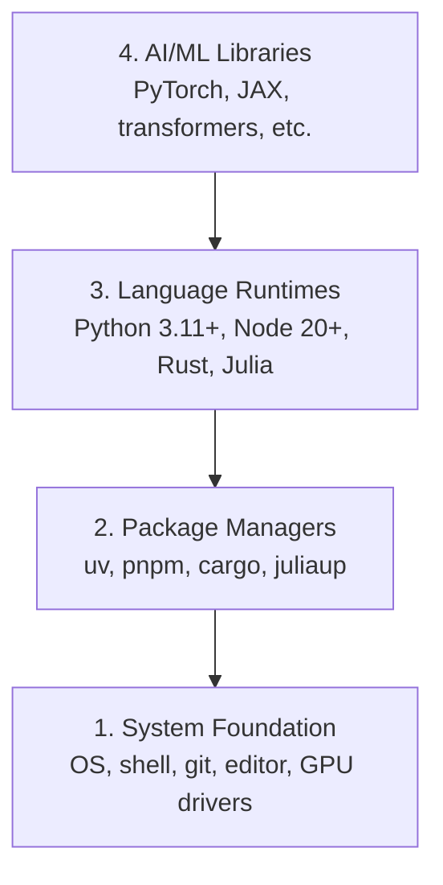

# 开发环境

> 工具塑造思维。一次配好，终身受益。

**Type:** Build
**Languages:** Python, Node.js, Rust
**Prerequisites:** None
**Time:** ~45 minutes

## 学习目标

- 从零搭建 Python 3.11+、Node.js 20+ 和 Rust 工具链
- 配置虚拟环境和包管理器，实现可复现的构建
- 验证 GPU 是否可用（CUDA/MPS），并运行一个测试 tensor 运算
- 理解四层技术栈：系统层、包管理层、运行时层、AI 库层

## 问题是什么

你即将用 Python、TypeScript、Rust 和 Julia 学习 200+ 节课的 AI 工程内容。如果环境有问题，每一节课都会变成和工具搏斗，而不是学习。

大多数人跳过环境配置。然后花几个小时调试 import 错误、版本冲突和缺失的 CUDA 驱动。我们要一次性把这件事做对。

## 核心概念

AI 工程环境有四个层次：



我们自底向上安装。每一层都依赖下面那层。

## 动手搭建

### Step 1: 系统基础

检查系统并安装基础工具。

```bash
# macOS
xcode-select --install
brew install git curl wget

# Ubuntu/Debian
sudo apt update && sudo apt install -y build-essential git curl wget

# Windows (use WSL2)
wsl --install -d Ubuntu-24.04
```

### Step 2: Python + uv

我们用 `uv` —— 比 pip 快 10-100 倍，而且自动管理虚拟环境。

```bash
curl -LsSf https://astral.sh/uv/install.sh | sh

uv python install 3.12

uv venv
source .venv/bin/activate  # or .venv\Scripts\activate on Windows

uv pip install numpy matplotlib jupyter
```

验证：

```python
import sys
print(f"Python {sys.version}")

import numpy as np
print(f"NumPy {np.__version__}")
a = np.array([1, 2, 3])
print(f"Vector: {a}, dot product with itself: {np.dot(a, a)}")
```

### Step 3: Node.js + pnpm

用于 TypeScript 课程（agent、MCP server、Web 应用）。

```bash
curl -fsSL https://fnm.vercel.app/install | bash
fnm install 22
fnm use 22

npm install -g pnpm

node -e "console.log('Node', process.version)"
```

### Step 4: Rust

用于性能关键的课程（推理、系统编程）。

```bash
curl --proto '=https' --tlsv1.2 -sSf https://sh.rustup.rs | sh

rustc --version
cargo --version
```

### Step 5: Julia（可选）

用于数学密集型课程，Julia 在这方面很擅长。

```bash
curl -fsSL https://install.julialang.org | sh

julia -e 'println("Julia ", VERSION)'
```

### Step 6: GPU 配置（如果你有的话）

```bash
# NVIDIA
nvidia-smi

# Install PyTorch with CUDA
uv pip install torch torchvision torchaudio --index-url https://download.pytorch.org/whl/cu124
```

```python
import torch
print(f"CUDA available: {torch.cuda.is_available()}")
if torch.cuda.is_available():
    print(f"GPU: {torch.cuda.get_device_name(0)}")
```

没有 GPU？没关系。大多数课程在 CPU 上就能跑。需要大量训练的课程可以用 Google Colab 或云 GPU。

### Step 7: 验证一切

运行验证脚本：

```bash
python phases/00-setup-and-tooling/01-dev-environment/code/verify.py
```

## 怎么用

你的环境现在已经为本课程的所有课程做好了准备。以下是各语言的使用场景：

| Language | Used In | Package Manager |
|----------|---------|-----------------|
| Python | Phases 1-12 (ML, DL, NLP, Vision, Audio, LLMs) | uv |
| TypeScript | Phases 13-17 (Tools, Agents, Swarms, Infra) | pnpm |
| Rust | Phases 12, 15-17 (Performance-critical systems) | cargo |
| Julia | Phase 1 (Math foundations) | Pkg |

## 交付物

本课产出一个验证脚本，任何人都可以运行它来检查自己的环境。

参见 `outputs/prompt-env-check.md`，里面有一个帮助 AI 助手诊断环境问题的 prompt。

## 练习

1. 运行验证脚本，修复所有失败项
2. 为本课程创建一个 Python 虚拟环境并安装 PyTorch
3. 用四种语言各写一个 "hello world" 并运行
