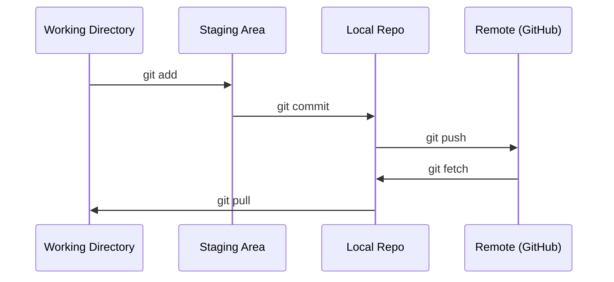

# Git 与协作

> 版本控制不是可选项。你在这里做的每个实验、每个模型、每节课都要被追踪。

**Type:** Learn
**Languages:** --
**Prerequisites:** Phase 0, Lesson 01
**Time:** ~30 minutes

## 学习目标

- 配置 Git 身份信息，掌握 add、commit、push 的日常工作流
- 创建和合并分支，在不破坏 main 的情况下进行隔离实验
- 编写 `.gitignore` 来排除模型 checkpoint 和大型二进制文件
- 用 `git log` 浏览提交历史，理解项目演进过程

## 问题是什么

你即将在 20 个阶段中编写数百个代码文件。没有版本控制，你会丢失工作、搞坏无法撤销的东西，而且没办法和别人协作。

Git 是工具。GitHub 是代码存放的地方。这节课只讲你在本课程中需要的内容，不多不少。

## 核心概念



记住三件事：
1. 经常保存（`git commit`）
2. 推送到远程（`git push`）
3. 用分支做实验（`git checkout -b experiment`）

## 动手搭建

### Step 1: 配置 Git

```bash
git config --global user.name "Your Name"
git config --global user.email "you@example.com"
```

### Step 2: 日常工作流

```bash
git status
git add file.py
git commit -m "Add perceptron implementation"
git push origin main
```

### Step 3: 用分支做实验

```bash
git checkout -b experiment/new-optimizer

# ... make changes, commit ...

git checkout main
git merge experiment/new-optimizer
```

### Step 4: 使用本课程仓库

```bash
git clone https://github.com/rohitg00/ai-engineering-from-scratch.git
cd ai-engineering-from-scratch

git checkout -b my-progress
# work through lessons, commit your code
git push origin my-progress
```

## 怎么用

在本课程中，你只需要这些命令：

| Command | When |
|---------|------|
| `git clone` | Get the course repo |
| `git add` + `git commit` | Save your work |
| `git push` | Back it up to GitHub |
| `git checkout -b` | Try something without breaking main |
| `git log --oneline` | See what you've done |

就这些。本课程不需要 rebase、cherry-pick 或 submodules。

## 练习

1. Clone 本仓库，创建一个叫 `my-progress` 的分支，新建一个文件，commit 并 push
2. 创建一个 `.gitignore`，排除模型 checkpoint 文件（`.pt`、`.pth`、`.safetensors`）
3. 用 `git log --oneline` 查看本仓库的提交历史，看看课程是怎么一步步添加的

## 关键术语

| 术语 | 口语说法 | 实际含义 |
|------|---------|---------|
| Commit | "保存" | 项目在某个时间点的完整快照 |
| Branch | "一个副本" | 指向某个 commit 的指针，随着你的工作向前移动 |
| Merge | "合并代码" | 把一个分支的改动应用到另一个分支 |
| Remote | "云端" | 你的仓库托管在别处的副本（GitHub、GitLab） |
