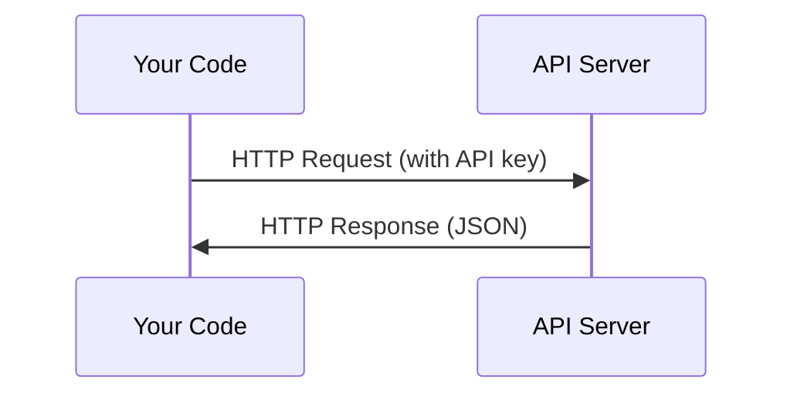

# API 与密钥

> 所有 AI API 的工作方式都一样：发请求，收响应。细节会变，模式不变。

**Type:** Build
**Languages:** Python, TypeScript
**Prerequisites:** Phase 0, Lesson 01
**Time:** ~30 minutes

## 学习目标

- 用环境变量和 `.env` 文件安全存储 API key
- 用 Anthropic Python SDK 和原始 HTTP 两种方式调用 LLM API
- 对比 SDK 和原始 HTTP 的请求/响应格式，便于调试
- 识别和处理常见 API 错误，包括认证失败和 rate limit

## 问题是什么

从 Phase 11 开始，你会调用 LLM API（Anthropic、OpenAI、Google）。在 Phase 13-16 你会构建在循环中使用这些 API 的 agent。你需要知道 API key 怎么工作、怎么安全存储，以及怎么发出第一个 API 调用。

## 核心概念



每个 API 调用包含：
1. 一个 endpoint（URL）
2. 一个 API key（认证）
3. 一个请求体（你想要什么）
4. 一个响应体（你得到什么）

## 动手搭建

### Step 1: 安全存储 API key

永远不要把 API key 写在代码里。用环境变量。

```bash
export ANTHROPIC_API_KEY="sk-ant-..."
export OPENAI_API_KEY="sk-..."
```

或者用 `.env` 文件（记得加到 `.gitignore`）：

```
ANTHROPIC_API_KEY=sk-ant-...
OPENAI_API_KEY=sk-...
```

### Step 2: 第一个 API 调用（Python）

```python
import anthropic

client = anthropic.Anthropic()

response = client.messages.create(
    model="claude-sonnet-4-20250514",
    max_tokens=256,
    messages=[{"role": "user", "content": "What is a neural network in one sentence?"}]
)

print(response.content[0].text)
```

### Step 3: 第一个 API 调用（TypeScript）

```typescript
import Anthropic from "@anthropic-ai/sdk";

const client = new Anthropic();

const response = await client.messages.create({
  model: "claude-sonnet-4-20250514",
  max_tokens: 256,
  messages: [{ role: "user", content: "What is a neural network in one sentence?" }],
});

console.log(response.content[0].text);
```

### Step 4: 原始 HTTP（不用 SDK）

```python
import os
import urllib.request
import json

url = "https://api.anthropic.com/v1/messages"
headers = {
    "Content-Type": "application/json",
    "x-api-key": os.environ["ANTHROPIC_API_KEY"],
    "anthropic-version": "2023-06-01",
}
body = json.dumps({
    "model": "claude-sonnet-4-20250514",
    "max_tokens": 256,
    "messages": [{"role": "user", "content": "What is a neural network in one sentence?"}],
}).encode()

req = urllib.request.Request(url, data=body, headers=headers, method="POST")
with urllib.request.urlopen(req) as resp:
    result = json.loads(resp.read())
    print(result["content"][0]["text"])
```

这就是 SDK 底层做的事情。理解原始 HTTP 调用在调试时很有帮助。

## 怎么用

本课程中：

| API | When you need it | Free tier |
|-----|-----------------|-----------|
| Anthropic (Claude) | Phases 11-16 (agents, tools) | $5 credit on signup |
| OpenAI | Phase 11 (comparison) | $5 credit on signup |
| Hugging Face | Phases 4-10 (models, datasets) | Free |

你现在不需要全部注册。等课程需要时再配置。

## 交付物

本课产出：
- `outputs/prompt-api-troubleshooter.md` - 诊断常见 API 错误

## 练习

1. 获取一个 Anthropic API key 并发出你的第一个 API 调用
2. 试试原始 HTTP 版本，对比响应格式和 SDK 版本的区别
3. 故意用一个错误的 API key，看看错误信息是什么

## 关键术语

| 术语 | 口语说法 | 实际含义 |
|------|---------|---------|
| API key | "API 的密码" | 一个唯一字符串，标识你的账户并授权请求 |
| Rate limit | "被限流了" | 每分钟/每小时的最大请求数，防止滥用并确保公平使用 |
| Token | "一个词"（API 语境下） | 计费单位：输入和输出的 token 分别计数和收费 |
| Streaming | "实时响应" | 逐词获取响应，而不是等待完整响应一次性返回 |
