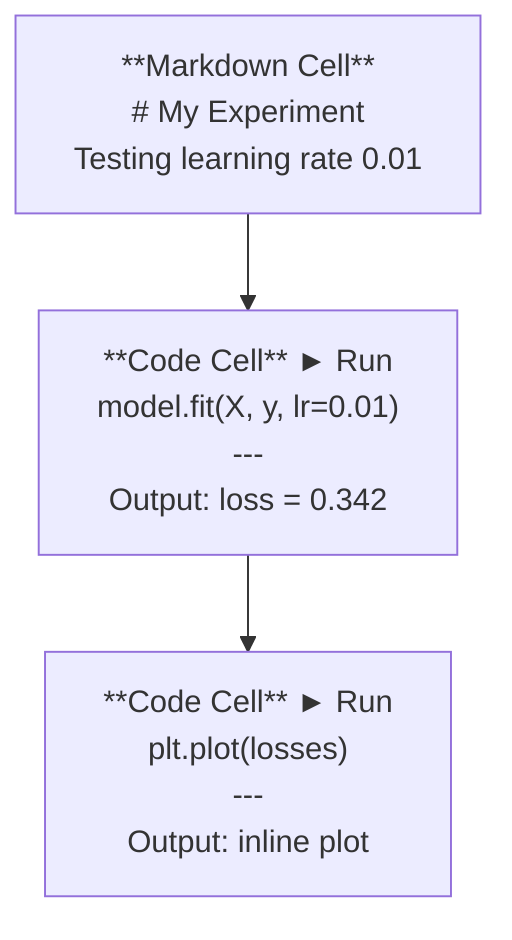
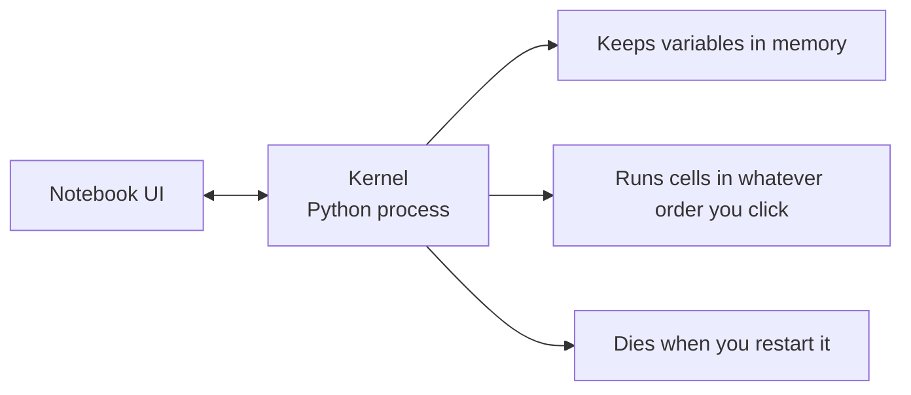

# Jupyter Notebooks

> Notebook 是 AI 工程的实验台。你在这里做原型，然后把可行的部分搬到生产环境。

**Type:** Build
**Languages:** Python
**Prerequisites:** Phase 0, Lesson 01
**Time:** ~30 minutes

## 学习目标

- 安装并启动 JupyterLab、Jupyter Notebook 或带 Jupyter 扩展的 VS Code
- 使用 magic commands（`%timeit`、`%%time`、`%matplotlib inline`）进行基准测试和内联可视化
- 区分何时该用 notebook、何时该用脚本，掌握"在 notebook 中探索，用脚本交付"的工作流
- 识别并避免常见的 notebook 陷阱：乱序执行、隐藏状态和内存泄漏

## 问题是什么

每篇 AI 论文、教程和 Kaggle 比赛都在用 Jupyter notebook。它们让你分段运行代码、内联查看输出、把代码和解释混在一起，迭代速度极快。如果你学 AI 不用 notebook，就像做数学作业没有草稿纸。

但 notebook 有真实的陷阱。人们把它用在所有事情上，包括它根本不擅长的事情。知道什么时候该用 notebook、什么时候该用脚本，能帮你避免后续的调试噩梦。

## 核心概念

一个 notebook 就是一个 cell 列表。每个 cell 要么是代码，要么是文本。



Kernel 是一个在后台运行的 Python 进程。当你运行一个 cell 时，它把代码发送给 kernel，kernel 执行后返回结果。所有 cell 共享同一个 kernel，所以变量在 cell 之间是持久的。



"你点哪个就执行哪个"这一点，既是超能力，也是自毁按钮。

## 动手构建

### Step 1: 选择你的界面

三个选项，同一种格式：

| 界面 | 安装方式 | 适合场景 |
|-----------|---------|----------|
| JupyterLab | `pip install jupyterlab` 然后 `jupyter lab` | 完整 IDE 体验，多标签页，文件浏览器，终端 |
| Jupyter Notebook | `pip install notebook` 然后 `jupyter notebook` | 简单轻量，一次只开一个 notebook |
| VS Code | 安装 "Jupyter" 扩展 | 已经在你的编辑器里，有 git 集成和调试功能 |

三者读写的都是同一种 `.ipynb` 文件。选你喜欢的就行。JupyterLab 在 AI 工作中最常见。

```bash
pip install jupyterlab
jupyter lab
```

### Step 2: 重要的快捷键

你在两种模式之间切换。按 `Escape` 进入命令模式（左侧蓝色条），按 `Enter` 进入编辑模式（绿色条）。

**命令模式（最常用）：**

| 按键 | 操作 |
|-----|--------|
| `Shift+Enter` | 运行当前 cell，跳到下一个 |
| `A` | 在上方插入 cell |
| `B` | 在下方插入 cell |
| `DD` | 删除 cell |
| `M` | 转为 markdown |
| `Y` | 转为代码 |
| `Z` | 撤销 cell 操作 |
| `Ctrl+Shift+H` | 显示所有快捷键 |

**编辑模式：**

| 按键 | 操作 |
|-----|--------|
| `Tab` | 自动补全 |
| `Shift+Tab` | 显示函数签名 |
| `Ctrl+/` | 切换注释 |

`Shift+Enter` 是你每天会用上千次的快捷键。先学会它。

### Step 3: Cell 类型

**代码 cell** 运行 Python 并显示输出：

```python
import numpy as np
data = np.random.randn(1000)
data.mean(), data.std()
```

输出：`(0.0032, 0.9987)`

**Markdown cell** 渲染格式化文本。用它来记录你在做什么以及为什么。支持标题、粗体、斜体、LaTeX 数学公式（`$E = mc^2$`）、表格和图片。

### Step 4: Magic commands

这些不是 Python。它们是 Jupyter 特有的命令，以 `%`（行 magic）或 `%%`（cell magic）开头。

**计时你的代码：**

```python
%timeit np.random.randn(10000)
```

输出：`45.2 us +/- 1.3 us per loop`

```python
%%time
model.fit(X_train, y_train, epochs=10)
```

输出：`Wall time: 2.34 s`

`%timeit` 会多次运行代码并取平均值。`%%time` 只运行一次。微基准测试用 `%timeit`，训练运行用 `%%time`。

**启用内联绘图：**

```python
%matplotlib inline
```

之后每次 `plt.plot()` 或 `plt.show()` 都会直接在 notebook 中渲染。

**不离开 notebook 安装包：**

```python
!pip install scikit-learn
```

`!` 前缀可以运行任何 shell 命令。

**检查环境变量：**

```python
%env CUDA_VISIBLE_DEVICES
```

### Step 5: 内联显示富文本输出

Notebook 会自动显示 cell 中最后一个表达式的值。但你也可以控制它：

```python
import pandas as pd

df = pd.DataFrame({
    "model": ["Linear", "Random Forest", "Neural Net"],
    "accuracy": [0.72, 0.89, 0.94],
    "training_time": [0.1, 2.3, 45.6]
})
df
```

这会渲染一个格式化的 HTML 表格，而不是纯文本。绘图也一样：

```python
import matplotlib.pyplot as plt

plt.figure(figsize=(8, 4))
plt.plot([1, 2, 3, 4], [1, 4, 2, 3])
plt.title("Inline Plot")
plt.show()
```

图表直接出现在 cell 下方。这就是 notebook 在 AI 工作中占主导地位的原因——你能同时看到数据、图表和代码。

显示图片：

```python
from IPython.display import Image, display
display(Image(filename="architecture.png"))
```

### Step 6: Google Colab

Colab 是一个免费的云端 Jupyter notebook。它提供 GPU、预装的库和 Google Drive 集成。无需任何配置。

1. 访问 [colab.research.google.com](https://colab.research.google.com)
2. 上传本课程的任意 `.ipynb` 文件
3. Runtime > Change runtime type > T4 GPU（免费）

Colab 与本地 Jupyter 的区别：
- 文件在会话之间不会保留（保存到 Drive 或下载）
- 预装了：numpy、pandas、matplotlib、torch、tensorflow、sklearn
- `from google.colab import files` 用于上传/下载文件
- `from google.colab import drive; drive.mount('/content/drive')` 用于持久存储
- 免费版会话在 90 分钟无活动后超时

## 实际使用

### Notebook vs 脚本：什么时候用哪个

| 用 notebook | 用脚本 |
|-------------------|-----------------|
| 探索数据集 | 训练流水线 |
| 原型开发模型 | 可复用的工具函数 |
| 可视化结果 | 任何有 `if __name__` 的代码 |
| 解释你的工作 | 定时运行的代码 |
| 快速实验 | 生产代码 |
| 课程练习 | 包和库 |

原则：**在 notebook 中探索，用脚本交付**。

AI 中常见的工作流：
1. 在 notebook 中探索数据
2. 在 notebook 中做模型原型
3. 一旦跑通，把代码移到 `.py` 文件
4. 在 notebook 中 import 这些 `.py` 文件继续实验

### 常见陷阱

**乱序执行。** 你先运行 cell 5，再运行 cell 2，再运行 cell 7。notebook 在你的机器上能跑，但别人从头到尾运行就崩了。解决方法：分享前执行 Kernel > Restart & Run All。

**隐藏状态。** 你删了一个 cell，但它创建的变量还在内存里。notebook 看起来很干净，但依赖一个幽灵 cell。解决方法：定期重启 kernel。

**内存泄漏。** 加载一个 4GB 的数据集，训练模型，再加载另一个数据集。什么都没被释放。解决方法：`del variable_name` 加 `gc.collect()`，或者重启 kernel。

## 交付产出

本课产出：
- `outputs/prompt-notebook-helper.md` 用于调试 notebook 问题

## 练习

1. 打开 JupyterLab，创建一个 notebook，用 `%timeit` 比较列表推导式和 numpy 创建 100,000 个随机数的速度
2. 创建一个包含 markdown 和代码 cell 的 notebook，加载一个 CSV，显示 dataframe，画一张图。然后执行 Kernel > Restart & Run All 验证它能从头到尾跑通
3. 把 `code/notebook_tips.py` 中的代码粘贴到 Colab notebook 中，用免费 GPU 运行

## 关键术语

| 术语 | 口语说法 | 实际含义 |
|------|----------------|----------------------|
| Kernel | "跑我代码的那个东西" | 一个独立的 Python 进程，执行 cell 并在内存中保持变量 |
| Cell | "一个代码块" | Notebook 中可独立运行的单元，要么是代码，要么是 markdown |
| Magic command | "Jupyter 的小技巧" | 以 `%` 或 `%%` 开头的特殊命令，用于控制 notebook 环境 |
| `.ipynb` | "Notebook 文件" | 一个包含 cell、输出和元数据的 JSON 文件。全称 IPython Notebook |

## 延伸阅读

- [JupyterLab Docs](https://jupyterlab.readthedocs.io/) 完整功能文档
- [Google Colab FAQ](https://research.google.com/colaboratory/faq.html) Colab 的限制和功能
- [28 Jupyter Notebook Tips](https://www.dataquest.io/blog/jupyter-notebook-tips-tricks-shortcuts/) 高级用户快捷键技巧
