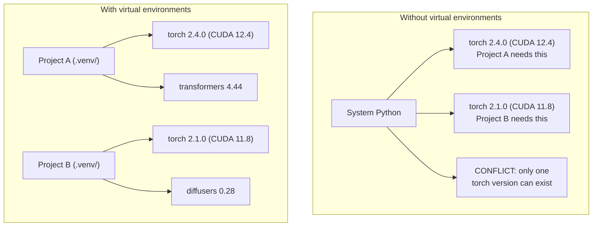

# Python 环境管理

> 依赖地狱是真实存在的。虚拟环境就是解药。

**Type:** Build
**Languages:** Shell
**Prerequisites:** Phase 0, Lesson 01
**Time:** ~30 minutes

## 学习目标

- 使用 `uv`、`venv` 或 `conda` 创建隔离的虚拟环境
- 编写带有可选依赖组的 `pyproject.toml`，并生成 lockfile 以确保可复现性
- 诊断和修复常见坑点：全局安装、pip/conda 混用、CUDA 版本不匹配
- 为依赖冲突的项目实施按阶段划分环境的策略

## 问题是什么

你为一个 fine-tuning 项目安装了 PyTorch 2.4。下周，另一个项目需要 PyTorch 2.1，因为它的 CUDA 构建版本是锁定的。你全局升级，第一个项目崩了。你降级，第二个项目崩了。

这就是依赖地狱。在 AI/ML 工作中它经常发生，因为：

- PyTorch、JAX 和 TensorFlow 各自附带自己的 CUDA 绑定
- 模型库会锁定特定的框架版本
- 全局 `pip install` 会覆盖之前安装的任何东西
- CUDA 11.8 的构建在 CUDA 12.x 驱动上跑不了（反过来也一样）

解决方案：每个项目都有自己的隔离环境和独立的包。

## 核心概念



## 动手构建

### 方案 1：uv venv（推荐）

`uv` 是最快的 Python 包管理器（比 pip 快 10-100 倍）。它在一个工具中处理虚拟环境、Python 版本和依赖解析。

```bash
curl -LsSf https://astral.sh/uv/install.sh | sh

uv python install 3.12

cd your-project
uv venv
source .venv/bin/activate
```

安装包：

```bash
uv pip install torch numpy
```

一步创建带 `pyproject.toml` 的项目：

```bash
uv init my-ai-project
cd my-ai-project
uv add torch numpy matplotlib
```

### 方案 2：venv（内置）

如果你装不了 `uv`，Python 自带 `venv`：

```bash
python3 -m venv .venv
source .venv/bin/activate  # Linux/macOS
.venv\Scripts\activate     # Windows

pip install torch numpy
```

比 `uv` 慢，但只要有 Python 就能用。

### 方案 3：conda（需要时再用）

Conda 管理非 Python 依赖，比如 CUDA toolkit、cuDNN 和 C 库。在以下情况使用：

- 你需要特定版本的 CUDA toolkit 但不想全局安装
- 你在共享集群上，没有权限安装系统包
- 某个库的安装说明写着"use conda"

```bash
# Install miniconda (not the full Anaconda)
curl -LsSf https://repo.anaconda.com/miniconda/Miniconda3-latest-Linux-x86_64.sh -o miniconda.sh
bash miniconda.sh -b

conda create -n myproject python=3.12
conda activate myproject

conda install pytorch torchvision torchaudio pytorch-cuda=12.4 -c pytorch -c nvidia
```

一条铁律：如果你用 conda 创建了环境，就用 conda 安装该环境中的所有包。在 conda 环境里混用 `pip install` 会导致依赖冲突，调试起来非常痛苦。

### 本课程的策略：按阶段划分环境

你可以为整个课程创建一个环境。别这么做。不同阶段需要不同的（有时互相冲突的）依赖。

策略：

```
ai-engineering-from-scratch/
├── .venv/                    <-- shared lightweight env for phases 0-3
├── phases/
│   ├── 04-neural-networks/
│   │   └── .venv/            <-- PyTorch env
│   ├── 05-cnns/
│   │   └── .venv/            <-- same PyTorch env (symlink or shared)
│   ├── 08-transformers/
│   │   └── .venv/            <-- might need different transformer versions
│   └── 11-llm-apis/
│       └── .venv/            <-- API SDKs, no torch needed
```

`code/env_setup.sh` 中的脚本会为本课程创建基础环境。

## pyproject.toml 基础

每个 Python 项目都应该有一个 `pyproject.toml`。它用一个文件取代了 `setup.py`、`setup.cfg` 和 `requirements.txt`。

```toml
[project]
name = "ai-engineering-from-scratch"
version = "0.1.0"
requires-python = ">=3.11"
dependencies = [
    "numpy>=1.26",
    "matplotlib>=3.8",
    "jupyter>=1.0",
    "scikit-learn>=1.4",
]

[project.optional-dependencies]
torch = ["torch>=2.3", "torchvision>=0.18"]
llm = ["anthropic>=0.39", "openai>=1.50"]
```

然后安装：

```bash
uv pip install -e ".[torch]"    # base + PyTorch
uv pip install -e ".[llm]"     # base + LLM SDKs
uv pip install -e ".[torch,llm]" # everything
```

## Lockfile

Lockfile 把每个依赖（包括传递依赖）锁定到精确版本。这保证了可复现性：任何人从 lockfile 安装都会得到完全相同的包。

```bash
# uv generates uv.lock automatically when using uv add
uv add numpy

# pip-tools approach
uv pip compile pyproject.toml -o requirements.lock
uv pip install -r requirements.lock
```

把 lockfile 提交到 git。当别人 clone 仓库时，他们从 lockfile 安装就能得到完全一致的版本。

## 常见错误

### 1. 全局安装

```bash
pip install torch  # BAD: installs to system Python

source .venv/bin/activate
pip install torch  # GOOD: installs to virtual environment
```

检查你的包装到了哪里：

```bash
which python       # should show .venv/bin/python, not /usr/bin/python
which pip           # should show .venv/bin/pip
```

### 2. 混用 pip 和 conda

```bash
conda create -n myenv python=3.12
conda activate myenv
conda install pytorch -c pytorch
pip install some-other-package   # BAD: can break conda's dependency tracking
conda install some-other-package # GOOD: let conda manage everything
```

如果你必须在 conda 中使用 pip（有些包只有 pip 版本），先安装所有 conda 包，最后再装 pip 包。

### 3. 忘记激活环境

```bash
python train.py           # uses system Python, missing packages
source .venv/bin/activate
python train.py           # uses project Python, packages found
```

你的 shell 提示符应该显示环境名称：

```
(.venv) $ python train.py
```

### 4. 把 .venv 提交到 git

```bash
echo ".venv/" >> .gitignore
```

虚拟环境有 200MB-2GB。它们是本地的，不能在机器之间移植。应该提交 `pyproject.toml` 和 lockfile。

### 5. CUDA 版本不匹配

```bash
nvidia-smi                # shows driver CUDA version (e.g., 12.4)
python -c "import torch; print(torch.version.cuda)"  # shows PyTorch CUDA version

# These must be compatible.
# PyTorch CUDA version must be <= driver CUDA version.
```

## 实际使用

运行配置脚本来创建你的课程环境：

```bash
bash phases/00-setup-and-tooling/06-python-environments/code/env_setup.sh
```

这会在仓库根目录创建一个 `.venv`，安装并验证核心依赖。

## 练习

1. 运行 `env_setup.sh` 并验证所有检查通过
2. 创建第二个虚拟环境，在其中安装不同版本的 numpy，确认两个环境是隔离的
3. 为一个同时需要 PyTorch 和 Anthropic SDK 的项目编写 `pyproject.toml`
4. 故意在不激活 venv 的情况下全局安装一个包，观察它装到了哪里，然后卸载它

## 关键术语

| 术语 | 口语说法 | 实际含义 |
|------|----------------|----------------------|
| Virtual environment | "一个 venv" | 一个包含 Python 解释器和包的隔离目录，与系统 Python 分开 |
| Lockfile | "锁定的依赖" | 一个列出每个包及其精确版本的文件，保证跨机器安装完全一致 |
| pyproject.toml | "新版 setup.py" | 标准的 Python 项目配置文件，取代 setup.py/setup.cfg/requirements.txt |
| Transitive dependency | "依赖的依赖" | 包 B 依赖 C；如果你安装了依赖 B 的 A，那么 C 就是 A 的传递依赖 |
| CUDA mismatch | "我的 GPU 不工作了" | PyTorch 编译时用的 CUDA 版本和你的 GPU 驱动支持的版本不一致 |
