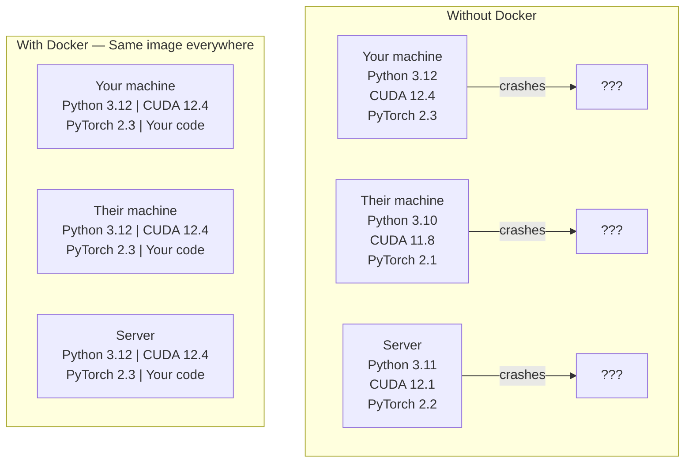

# Docker for AI

> 容器让"在我机器上能跑"成为历史。

**Type:** Build
**Languages:** Docker
**Prerequisites:** Phase 0, Lessons 01 and 03
**Time:** ~60 minutes

## 学习目标

- 从 Dockerfile 构建一个支持 GPU 的 Docker 镜像，包含 CUDA、PyTorch 和 AI 库
- 挂载宿主机目录作为 volume，使模型、数据集和代码在容器重建后依然保留
- 配置 NVIDIA Container Toolkit 以在容器内暴露 GPU
- 使用 Docker Compose 编排多服务 AI 应用（推理服务器 + 向量数据库）

## 问题是什么

你在笔记本电脑上用 PyTorch 2.3、CUDA 12.4 和 Python 3.12 训练了一个模型。你的同事用的是 PyTorch 2.1、CUDA 11.8 和 Python 3.10。你的模型在他们的机器上崩了。而你的 Dockerfile 在两台机器上都能跑。

AI 项目是依赖噩梦。一个典型的技术栈包括 Python、PyTorch、CUDA 驱动、cuDNN、系统级 C 库，以及像 flash-attn 这样需要精确编译器版本的特殊包。Docker 把所有这些打包成一个镜像，在任何地方都能一致运行。

## 核心概念

Docker 把你的代码、运行时、库和系统工具包装成一个隔离的单元，叫做容器。你可以把它想象成一个轻量级虚拟机，只不过它共享宿主机的 OS kernel 而不是运行自己的，所以启动只需几秒而不是几分钟。



### 为什么 AI 项目比其他项目更需要 Docker

1. **GPU 驱动很脆弱。** CUDA 12.4 的代码在 CUDA 11.8 上跑不了。Docker 把 CUDA toolkit 隔离在容器内部，同时通过 NVIDIA Container Toolkit 共享宿主机的 GPU 驱动。

2. **模型权重很大。** 一个 7B 参数的模型在 fp16 下是 14 GB。你不会想每次重建容器都重新下载。Docker volume 让你从宿主机挂载模型目录。

3. **多服务架构很常见。** 一个真实的 AI 应用不只是一个 Python 脚本。它是一个推理服务器、一个用于 RAG 的向量数据库，可能还有一个 web 前端。Docker Compose 用一条命令编排所有这些。

### 核心词汇

| 术语 | 含义 |
|------|---------------|
| Image | 只读模板。你的配方。从 Dockerfile 构建。 |
| Container | 镜像的运行实例。你的厨房。 |
| Dockerfile | 构建镜像的指令。逐层构建。 |
| Volume | 在容器重启后依然存在的持久存储。 |
| docker-compose | 用 YAML 定义多容器应用的工具。 |

### AI 中常见的容器模式

```
Dev Container
  Full toolkit. Editor support. Jupyter. Debugging tools.
  Used during development and experimentation.

Training Container
  Minimal. Just the training script and dependencies.
  Runs on GPU clusters. No editor, no Jupyter.

Inference Container
  Optimized for serving. Small image. Fast cold start.
  Runs behind a load balancer in production.
```

## 动手构建

### Step 1: 安装 Docker

```bash
# macOS
brew install --cask docker
open /Applications/Docker.app

# Ubuntu
curl -fsSL https://get.docker.com | sh
sudo usermod -aG docker $USER
# Log out and back in for group change to take effect
```

验证：

```bash
docker --version
docker run hello-world
```

### Step 2: 安装 NVIDIA Container Toolkit（Linux + NVIDIA GPU）

这让 Docker 容器能访问你的 GPU。macOS 和 Windows（WSL2）用户可以跳过这步；Docker Desktop 在这些平台上以不同方式处理 GPU 透传。

```bash
distribution=$(. /etc/os-release;echo $ID$VERSION_ID)
curl -fsSL https://nvidia.github.io/libnvidia-container/gpgkey | sudo gpg --dearmor -o /usr/share/keyrings/nvidia-container-toolkit-keyring.gpg
curl -s -L https://nvidia.github.io/libnvidia-container/$distribution/libnvidia-container.list | \
    sed 's#deb https://#deb [signed-by=/usr/share/keyrings/nvidia-container-toolkit-keyring.gpg] https://#g' | \
    sudo tee /etc/apt/sources.list.d/nvidia-container-toolkit.list

sudo apt-get update
sudo apt-get install -y nvidia-container-toolkit
sudo nvidia-ctk runtime configure --runtime=docker
sudo systemctl restart docker
```

测试容器内的 GPU 访问：

```bash
docker run --rm --gpus all nvidia/cuda:12.4.1-base-ubuntu22.04 nvidia-smi
```

如果你看到了 GPU 信息，说明 toolkit 工作正常。

### Step 3: 理解基础镜像

选对基础镜像能省下几小时的调试时间。

```
nvidia/cuda:12.4.1-devel-ubuntu22.04
  Full CUDA toolkit. Compilers included.
  Use for: building packages that need nvcc (flash-attn, bitsandbytes)
  Size: ~4 GB

nvidia/cuda:12.4.1-runtime-ubuntu22.04
  CUDA runtime only. No compilers.
  Use for: running pre-built code
  Size: ~1.5 GB

pytorch/pytorch:2.3.1-cuda12.4-cudnn9-runtime
  PyTorch pre-installed on top of CUDA.
  Use for: skipping the PyTorch install step
  Size: ~6 GB

python:3.12-slim
  No CUDA. CPU only.
  Use for: inference on CPU, lightweight tools
  Size: ~150 MB
```

### Step 4: 为 AI 开发编写 Dockerfile

这是 `code/Dockerfile` 中的 Dockerfile。逐步解读：

```dockerfile
FROM nvidia/cuda:12.4.1-devel-ubuntu22.04

ENV DEBIAN_FRONTEND=noninteractive
ENV PYTHONUNBUFFERED=1

RUN apt-get update && apt-get install -y --no-install-recommends \
    python3.12 \
    python3.12-venv \
    python3.12-dev \
    python3-pip \
    git \
    curl \
    build-essential \
    && rm -rf /var/lib/apt/lists/*

RUN update-alternatives --install /usr/bin/python python /usr/bin/python3.12 1

RUN python -m pip install --no-cache-dir --upgrade pip setuptools wheel

RUN python -m pip install --no-cache-dir \
    torch==2.3.1 \
    torchvision==0.18.1 \
    torchaudio==2.3.1 \
    --index-url https://download.pytorch.org/whl/cu124

RUN python -m pip install --no-cache-dir \
    numpy \
    pandas \
    scikit-learn \
    matplotlib \
    jupyter \
    transformers \
    datasets \
    accelerate \
    safetensors

WORKDIR /workspace

VOLUME ["/workspace", "/models"]

EXPOSE 8888

CMD ["python"]
```

构建：

```bash
docker build -t ai-dev -f phases/00-setup-and-tooling/07-docker-for-ai/code/Dockerfile .
```

第一次构建需要一些时间（下载 CUDA 基础镜像 + PyTorch）。后续构建会使用缓存层。

运行：

```bash
docker run --rm -it --gpus all \
    -v $(pwd):/workspace \
    -v ~/models:/models \
    ai-dev python -c "import torch; print(f'PyTorch {torch.__version__}, CUDA: {torch.cuda.is_available()}')"
```

在容器内运行 Jupyter：

```bash
docker run --rm -it --gpus all \
    -v $(pwd):/workspace \
    -v ~/models:/models \
    -p 8888:8888 \
    ai-dev jupyter notebook --ip=0.0.0.0 --port=8888 --no-browser --allow-root
```

### Step 5: 用 volume 挂载数据和模型

Volume 挂载对 AI 工作至关重要。没有它们，你 14 GB 的模型下载会在容器停止时消失。

```bash
# Mount your code
-v $(pwd):/workspace

# Mount a shared models directory
-v ~/models:/models

# Mount datasets
-v ~/datasets:/data
```

在训练脚本中，从挂载路径加载：

```python
from transformers import AutoModel

model = AutoModel.from_pretrained("/models/llama-7b")
```

模型存在宿主机文件系统上。随便重建容器多少次都不需要重新下载。

### Step 6: 用 Docker Compose 编排多服务 AI 应用

一个真实的 RAG 应用需要推理服务器和向量数据库。Docker Compose 用一条命令同时运行两者。

参见 `code/docker-compose.yml`：

```yaml
services:
  ai-dev:
    build:
      context: .
      dockerfile: Dockerfile
    deploy:
      resources:
        reservations:
          devices:
            - driver: nvidia
              count: all
              capabilities: [gpu]
    volumes:
      - ../../../:/workspace
      - ~/models:/models
      - ~/datasets:/data
    ports:
      - "8888:8888"
    stdin_open: true
    tty: true
    command: jupyter notebook --ip=0.0.0.0 --port=8888 --no-browser --allow-root

  qdrant:
    image: qdrant/qdrant:v1.12.5
    ports:
      - "6333:6333"
      - "6334:6334"
    volumes:
      - qdrant_data:/qdrant/storage

volumes:
  qdrant_data:
```

启动所有服务：

```bash
cd phases/00-setup-and-tooling/07-docker-for-ai/code
docker compose up -d
```

现在你的 AI 开发容器可以通过服务名访问向量数据库 `http://qdrant:6333`。Docker Compose 会自动创建共享网络。

从 AI 容器内部测试连接：

```python
from qdrant_client import QdrantClient

client = QdrantClient(host="qdrant", port=6333)
print(client.get_collections())
```

停止所有服务：

```bash
docker compose down
```

加 `-v` 同时删除 qdrant volume：

```bash
docker compose down -v
```

### Step 7: AI 工作中常用的 Docker 命令

```bash
# List running containers
docker ps

# List all images and their sizes
docker images

# Remove unused images (reclaim disk space)
docker system prune -a

# Check GPU usage inside a running container
docker exec -it <container_id> nvidia-smi

# Copy a file from container to host
docker cp <container_id>:/workspace/results.csv ./results.csv

# View container logs
docker logs -f <container_id>
```

## 实际使用

你现在有了一个可复现的 AI 开发环境。在本课程的后续部分：

- 用 `docker compose up` 同时启动开发环境和向量数据库
- 把代码、模型和数据作为 volume 挂载，这样重建时什么都不会丢
- 当某节课需要新的 Python 包时，把它加到 Dockerfile 然后重建
- 把 Dockerfile 分享给队友。他们会得到完全相同的环境。

### 没有 GPU？

去掉 `--gpus all` 标志和 NVIDIA deploy 配置块。容器在 CPU 课程中依然能正常工作。PyTorch 会检测到没有 CUDA 并自动回退到 CPU。

## 练习

1. 构建 Dockerfile 并在容器内运行 `python -c "import torch; print(torch.__version__)"`
2. 启动 docker-compose 栈，验证从 AI 容器内可以访问 Qdrant `http://qdrant:6333/collections`
3. 在 Dockerfile 中添加 `flask`，重建，然后在 5000 端口运行一个简单的 API 服务器。用 `-p 5000:5000` 映射端口
4. 用 `docker images` 查看镜像大小。尝试把基础镜像从 `devel` 换成 `runtime`，比较大小差异

## 关键术语

| 术语 | 口语说法 | 实际含义 |
|------|----------------|----------------------|
| Container | "轻量级虚拟机" | 使用宿主机 kernel 的隔离进程，有自己的文件系统和网络 |
| Image layer | "缓存的步骤" | 每条 Dockerfile 指令创建一层。未改变的层会被缓存，所以重建很快。 |
| NVIDIA Container Toolkit | "Docker 里的 GPU" | 一个运行时钩子，通过 `--gpus` 标志将宿主机 GPU 暴露给容器 |
| Volume mount | "共享文件夹" | 宿主机上的目录映射到容器内。容器停止后更改依然保留。 |
| Base image | "起点" | Dockerfile 中 `FROM` 指定的镜像。决定了预装了什么。 |
