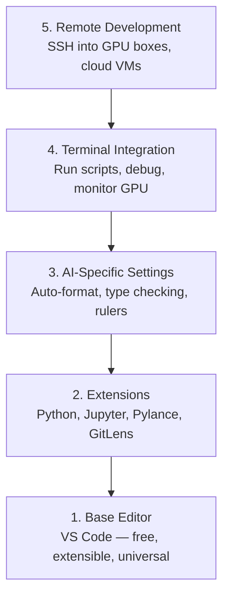

# 编辑器配置

> 你的编辑器是你的副驾驶。配置一次，让它不碍事，然后开始发挥作用。

**Type:** Build
**Languages:** --
**Prerequisites:** Phase 0, Lesson 01
**Time:** ~20 minutes

## 学习目标

- 安装 VS Code 及 Python、Jupyter、linting 和 Remote SSH 的核心扩展
- 配置保存时格式化、类型检查和 notebook 输出滚动，适配 AI 工作流
- 设置 Remote SSH，像在本地一样编辑和调试远程 GPU 机器上的代码
- 评估编辑器替代方案（Cursor、Windsurf、Neovim）及其在 AI 工作中的取舍

## 问题是什么

你会在编辑器里花上数千小时写 Python、跑 notebook、调试训练循环、SSH 到 GPU 机器。一个配置不当的编辑器让每次工作都充满摩擦：没有自动补全、没有类型提示、没有内联错误、手动格式化、笨拙的终端工作流。

正确的配置只需 20 分钟。跳过它每天都会浪费你 20 分钟。

## 核心概念

AI 工程的编辑器配置需要五样东西：



## 动手构建

### Step 1: 安装 VS Code

VS Code 是推荐的编辑器。它免费，跨平台运行，有一流的 Jupyter notebook 支持，扩展生态覆盖了 AI 工作所需的一切。

从 [code.visualstudio.com](https://code.visualstudio.com/) 下载。

在终端验证：

```bash
code --version
```

如果在 macOS 上找不到 `code` 命令，打开 VS Code，按 `Cmd+Shift+P`，输入 "Shell Command"，选择 "Install 'code' command in PATH"。

### Step 2: 安装核心扩展

在 VS Code 中打开集成终端（`Ctrl+`` ` 或 `` Cmd+` ``），安装 AI 工作需要的扩展：

```bash
code --install-extension ms-python.python
code --install-extension ms-python.vscode-pylance
code --install-extension ms-toolsai.jupyter
code --install-extension eamodio.gitlens
code --install-extension ms-vscode-remote.remote-ssh
code --install-extension ms-python.debugpy
code --install-extension ms-python.black-formatter
code --install-extension charliermarsh.ruff
```

每个扩展的作用：

| 扩展 | 用途 |
|-----------|-----|
| Python | 语言支持、虚拟环境检测、运行/调试 |
| Pylance | 快速类型检查、自动补全、import 解析 |
| Jupyter | 在 VS Code 内运行 notebook、变量浏览器 |
| GitLens | 查看谁改了什么、内联 git blame |
| Remote SSH | 像本地一样打开远程 GPU 机器上的文件夹 |
| Debugpy | Python 单步调试 |
| Black Formatter | 保存时自动格式化，统一风格 |
| Ruff | 快速 linting，捕获常见错误 |

本课的 `code/.vscode/extensions.json` 文件包含完整的推荐列表。当你打开项目文件夹时，VS Code 会提示你安装它们。

### Step 3: 配置设置

从本课的 `code/.vscode/settings.json` 复制设置，或通过 `Settings > Open Settings (JSON)` 手动应用。

AI 工作的关键设置：

```jsonc
{
    "python.analysis.typeCheckingMode": "basic",
    "editor.formatOnSave": true,
    "editor.rulers": [88, 120],
    "notebook.output.scrolling": true,
    "files.autoSave": "afterDelay"
}
```

为什么这些很重要：

- **类型检查设为 basic**：在运行前捕获错误的参数类型。省下调试 tensor shape 不匹配和错误 API 参数的时间。
- **保存时格式化**：再也不用想格式化的事。Black 搞定一切。
- **标尺在 88 和 120**：Black 在 88 处换行。120 的标记提示 docstring 和注释太长了。
- **Notebook 输出滚动**：训练循环会打印几千行。没有滚动，输出面板会爆炸。
- **自动保存**：你会忘记保存。你的训练脚本会运行过时的代码。自动保存防止这种情况。

### Step 4: 终端集成

VS Code 的集成终端是你运行训练脚本、监控 GPU 和管理环境的地方。

正确配置：

```jsonc
{
    "terminal.integrated.defaultProfile.osx": "zsh",
    "terminal.integrated.defaultProfile.linux": "bash",
    "terminal.integrated.fontSize": 13,
    "terminal.integrated.scrollback": 10000
}
```

常用快捷键：

| 操作 | macOS | Linux/Windows |
|--------|-------|---------------|
| 切换终端 | `` Ctrl+` `` | `` Ctrl+` `` |
| 新建终端 | `Ctrl+Shift+`` ` | `Ctrl+Shift+`` ` |
| 分割终端 | `Cmd+\` | `Ctrl+\` |

分割终端很有用：一个跑脚本，一个用 `nvidia-smi -l 1` 或 `watch -n 1 nvidia-smi` 监控 GPU。

### Step 5: 远程开发（SSH 到 GPU 机器）

这是 AI 工作中最重要的扩展。你会在远程机器上运行训练（云 VM、实验室服务器、Lambda、Vast.ai）。Remote SSH 让你打开远程文件系统、编辑文件、运行终端和调试，就像一切都在本地一样。

配置步骤：

1. 安装 Remote SSH 扩展（Step 2 已完成）。
2. 按 `Ctrl+Shift+P`（或 `Cmd+Shift+P`），输入 "Remote-SSH: Connect to Host"。
3. 输入 `user@your-gpu-box-ip`。
4. VS Code 会自动在远程机器上安装它的服务端组件。

要实现免密登录，设置 SSH 密钥：

```bash
ssh-keygen -t ed25519 -C "your-email@example.com"
ssh-copy-id user@your-gpu-box-ip
```

把主机添加到 `~/.ssh/config` 方便使用：

```
Host gpu-box
    HostName 203.0.113.50
    User ubuntu
    IdentityFile ~/.ssh/id_ed25519
    ForwardAgent yes
```

现在 `Remote-SSH: Connect to Host > gpu-box` 就能即时连接。

## 替代方案

### Cursor

[cursor.com](https://cursor.com) 是一个内置 AI 代码生成的 VS Code fork。它使用相同的扩展生态和设置格式。如果你用 Cursor，本课的所有内容依然适用。导入相同的 `settings.json` 和 `extensions.json` 即可。

### Windsurf

[windsurf.com](https://windsurf.com) 是另一个 AI 优先的 VS Code fork。同样的道理：相同的扩展、相同的设置格式、相同的 Remote SSH 支持。

### Vim/Neovim

如果你已经在用 Vim 或 Neovim 并且效率很高，继续用。AI Python 工作的最低配置：

- **pyright** 或 **pylsp** 做类型检查（通过 Mason 或手动安装）
- **nvim-lspconfig** 做语言服务器集成
- **jupyter-vim** 或 **molten-nvim** 做类 notebook 执行
- **telescope.nvim** 做文件/符号搜索
- **none-ls.nvim** 配合 black 和 ruff 做格式化/linting

如果你还没用过 Vim，现在不要开始学。学习曲线会和学 AI 工程互相竞争。用 VS Code。

## 实际使用

配置完成后，你的日常工作流是这样的：

1. 在 VS Code 中打开项目文件夹（或通过 Remote SSH 连接到 GPU 机器）。
2. 在编辑器中写 Python，享受自动补全、类型提示和内联错误。
3. 用 Jupyter 扩展内联运行 notebook。
4. 用集成终端运行训练脚本、`uv pip install` 和 GPU 监控。
5. 提交前用 GitLens 审查更改。

## 练习

1. 安装 VS Code 和 Step 2 中列出的所有扩展
2. 把本课的 `settings.json` 复制到你的 VS Code 配置中
3. 打开一个 Python 文件，验证 Pylance 显示类型提示且 Black 在保存时格式化
4. 如果你有远程机器的访问权限，设置 Remote SSH 并打开上面的一个文件夹

## 关键术语

| 术语 | 口语说法 | 实际含义 |
|------|----------------|----------------------|
| LSP | "自动补全引擎" | Language Server Protocol：一种标准，让编辑器从语言特定的服务器获取类型信息、补全和诊断 |
| Pylance | "Python 插件" | 微软的 Python 语言服务器，使用 Pyright 进行类型检查和 IntelliSense |
| Remote SSH | "在服务器上工作" | VS Code 扩展，在远程机器上运行轻量服务端，将 UI 流式传输到本地编辑器 |
| Format on save | "自动格式化" | 编辑器在每次保存时运行格式化工具（Black、Ruff），保持代码风格始终一致 |
