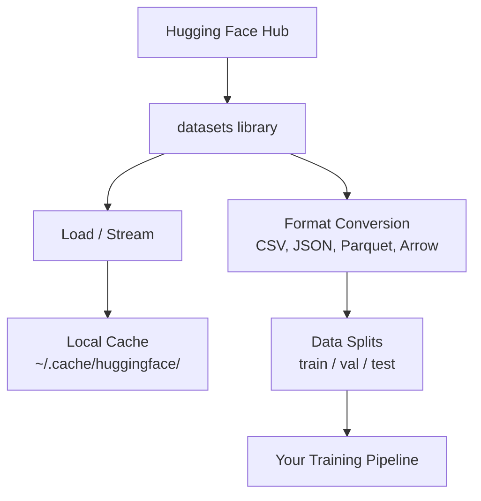

# 数据管理

> 数据是燃料。你管理数据的方式决定了你能跑多快。

**Type:** Build
**Language:** Python
**Prerequisites:** Phase 0, Lesson 01
**Time:** ~45 minutes

## 学习目标

- 使用 Hugging Face `datasets` 库加载、流式处理和缓存数据集
- 在 CSV、JSON、Parquet 和 Arrow 格式之间转换，并解释它们的取舍
- 使用固定随机种子创建可复现的 train/validation/test 数据划分
- 使用 `.gitignore`、Git LFS 或 DVC 管理大型模型和数据集文件

## 问题

每个 AI 项目都从数据开始。你需要找到数据集、下载它们、在格式之间转换、为训练和评估做划分，还要做版本管理以确保实验可复现。每次都手动做这些事情既慢又容易出错。你需要一个可重复的工作流。

## 概念



Hugging Face `datasets` 库是 AI 工作中加载数据的标准方式。它开箱即用地处理下载、缓存、格式转换和流式加载。

## 动手构建

### Step 1: 安装 datasets 库

```bash
pip install datasets huggingface_hub
```

### Step 2: 加载数据集

```python
from datasets import load_dataset

dataset = load_dataset("imdb")
print(dataset)
print(dataset["train"][0])
```

这会下载 IMDB 电影评论数据集。首次下载后，后续会从 `~/.cache/huggingface/datasets/` 的缓存中加载。

### Step 3: 流式加载大型数据集

有些数据集太大，磁盘放不下。流式加载逐行读取数据，不需要下载完整文件。

```python
dataset = load_dataset("wikimedia/wikipedia", "20220301.en", split="train", streaming=True)

for i, example in enumerate(dataset):
    print(example["title"])
    if i >= 4:
        break
```

流式加载返回一个 `IterableDataset`。数据到达时即可处理。无论数据集多大，内存占用都保持恒定。

### Step 4: 数据集格式

`datasets` 库底层使用 Apache Arrow。你可以根据 pipeline 的需要转换为其他格式。

```python
dataset = load_dataset("imdb", split="train")

dataset.to_csv("imdb_train.csv")
dataset.to_json("imdb_train.json")
dataset.to_parquet("imdb_train.parquet")
```

格式对比：

| Format | Size | Read Speed | Best For |
|--------|------|-----------|----------|
| CSV | Large | Slow | Human readability, spreadsheets |
| JSON | Large | Slow | APIs, nested data |
| Parquet | Small | Fast | Analytics, columnar queries |
| Arrow | Small | Fastest | In-memory processing (what `datasets` uses internally) |

对于 AI 工作，Parquet 是最佳存储格式。Arrow 是你在内存中使用的格式。CSV 和 JSON 用于数据交换。

### Step 5: 数据划分

每个 ML 项目都需要三个划分：

- **Train**：模型从中学习（通常 80%）
- **Validation**：训练过程中检查进度（通常 10%）
- **Test**：训练完成后的最终评估（通常 10%）

有些数据集自带划分。没有的话，自己划分：

```python
dataset = load_dataset("imdb", split="train")

split = dataset.train_test_split(test_size=0.2, seed=42)
train_val = split["train"].train_test_split(test_size=0.125, seed=42)

train_ds = train_val["train"]
val_ds = train_val["test"]
test_ds = split["test"]

print(f"Train: {len(train_ds)}, Val: {len(val_ds)}, Test: {len(test_ds)}")
```

一定要设置 seed 以确保可复现性。相同的 seed 每次都会产生相同的划分。

### Step 6: 下载和缓存模型

模型是大文件。`huggingface_hub` 库负责下载和缓存。

```python
from huggingface_hub import hf_hub_download, snapshot_download

model_path = hf_hub_download(
    repo_id="sentence-transformers/all-MiniLM-L6-v2",
    filename="config.json"
)
print(f"Cached at: {model_path}")

model_dir = snapshot_download("sentence-transformers/all-MiniLM-L6-v2")
print(f"Full model at: {model_dir}")
```

模型缓存在 `~/.cache/huggingface/hub/`。下载一次后，后续运行会即时加载。

### Step 7: 处理大文件

模型权重和大型数据集不应该放进 git。三种方案：

**方案 A: .gitignore（最简单）**

```
*.bin
*.safetensors
*.pt
*.onnx
data/*.parquet
data/*.csv
models/
```

**方案 B: Git LFS（在 git 中追踪大文件）**

```bash
git lfs install
git lfs track "*.bin"
git lfs track "*.safetensors"
git add .gitattributes
```

Git LFS 在仓库中存储指针，实际文件存在单独的服务器上。GitHub 免费提供 1 GB 空间。

**方案 C: DVC（数据版本控制）**

```bash
pip install dvc
dvc init
dvc add data/training_set.parquet
git add data/training_set.parquet.dvc data/.gitignore
git commit -m "Track training data with DVC"
```

DVC 创建小的 `.dvc` 文件指向你的数据。数据本身存储在 S3、GCS 或其他远程存储后端。

| Approach | Complexity | Best For |
|----------|-----------|----------|
| .gitignore | Low | Personal projects, downloaded data you can re-fetch |
| Git LFS | Medium | Teams sharing model weights via git |
| DVC | High | Reproducible experiments, large datasets, teams |

本课程中，`.gitignore` 就够了。当你需要在多台机器上精确复现实验时，再用 DVC。

### Step 8: 存储模式

**本地存储**适用于 10 GB 以下的数据集。HF 缓存会自动处理。

**云存储**适用于更大的数据或需要跨机器共享的场景：

```python
import os

local_path = os.path.expanduser("~/.cache/huggingface/datasets/")

# s3_path = "s3://my-bucket/datasets/"
# gcs_path = "gs://my-bucket/datasets/"
```

DVC 直接集成 S3 和 GCS：

```bash
dvc remote add -d myremote s3://my-bucket/dvc-store
dvc push
```

本课程中，本地存储就够了。当你在远程 GPU 实例上做 fine-tuning 时，云存储才变得重要。

## 本课程使用的数据集

| Dataset | Lessons | Size | What It Teaches |
|---------|---------|------|----------------|
| IMDB | Tokenization, classification | 84 MB | Text classification basics |
| WikiText | Language modeling | 181 MB | Next-token prediction |
| SQuAD | QA systems | 35 MB | Question answering, spans |
| Common Crawl (subset) | Embeddings | Varies | Large-scale text processing |
| MNIST | Vision basics | 21 MB | Image classification fundamentals |
| COCO (subset) | Multimodal | Varies | Image-text pairs |

你现在不需要全部下载。每节课会说明需要什么。

## 使用

运行工具脚本验证一切正常：

```bash
python code/data_utils.py
```

这会下载一个小数据集，转换格式，做划分，然后打印摘要。

## 交付

本课产出：
- `code/data_utils.py` - 可复用的数据加载和缓存工具
- `outputs/prompt-data-helper.md` - 用于为任务找到合适数据集的 prompt

## 练习

1. 加载 `glue` 数据集的 `mrpc` 配置，查看前 5 个样本
2. 流式加载 `c4` 数据集，计算 10 秒内能处理多少样本
3. 将数据集转换为 Parquet 格式，与 CSV 比较文件大小
4. 用固定 seed 创建 70/15/15 的 train/val/test 划分，验证大小

## 关键术语

| Term | What people say | What it actually means |
|------|----------------|----------------------|
| Dataset split | "Training data" | A named subset (train/val/test) used at different stages of the ML lifecycle |
| Streaming | "Load it lazily" | Processing data row by row from a remote source without downloading the full dataset |
| Parquet | "Compressed CSV" | A columnar file format optimized for analytical queries and storage efficiency |
| Arrow | "Fast dataframe" | An in-memory columnar format used internally by the datasets library for zero-copy reads |
| Git LFS | "Git for big files" | An extension that stores large files outside the git repo while keeping pointers in version control |
| DVC | "Git for data" | A version control system for datasets and models that integrates with cloud storage |
| Cache | "Already downloaded" | A local copy of previously fetched data, stored at ~/.cache/huggingface/ by default |
