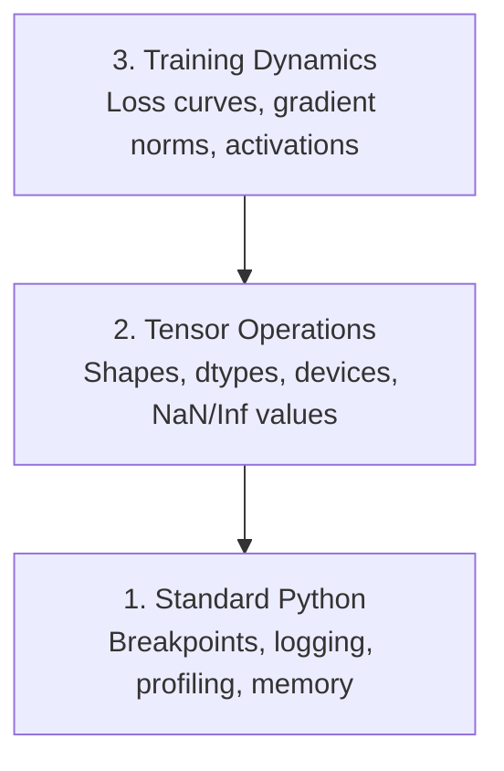

# 调试与性能分析

> 最糟糕的 AI bug 不会崩溃。它们默默地在垃圾数据上训练，然后报告一条漂亮的 loss 曲线。

**Type:** Build
**Language:** Python
**Prerequisites:** Lesson 1 (Dev Environment), basic PyTorch familiarity
**Time:** ~60 minutes

## 学习目标

- 使用条件 `breakpoint()` 和 `debug_print` 在训练过程中检查 tensor 的 shape、dtype 和 NaN 值
- 使用 `cProfile`、`line_profiler` 和 `tracemalloc` 对训练循环做性能分析，找到瓶颈
- 检测常见 AI bug：shape 不匹配、NaN loss、数据泄漏、tensor 在错误设备上
- 设置 TensorBoard 来可视化 loss 曲线、权重直方图和梯度分布

## 问题

AI 代码的失败方式和普通代码不同。Web 应用崩溃时会给你一个 stack trace。一个配置错误的训练循环会跑 8 小时，烧掉 200 美元的 GPU 费用，然后产出一个对所有输入都预测均值的模型。代码从未报错。Bug 是一个在错误设备上的 tensor、一个忘记的 `.detach()`、或者标签泄漏到了特征中。

你需要能在这些静默失败浪费你的时间和算力之前捕获它们的调试工具。

## 概念

AI 调试在三个层面运作：



大多数人直接跳到第 3 层（盯着 TensorBoard 看）。但 80% 的 AI bug 存在于第 1 层和第 2 层。

## 动手构建

### Part 1: Print 调试（没错，它管用）

Print 调试经常被看不起。不应该。对于 tensor 代码，一个精准的 print 语句比单步调试更好用，因为你需要同时看到 shape、dtype 和值的范围。

```python
def debug_print(name, tensor):
    print(f"{name}: shape={tensor.shape}, dtype={tensor.dtype}, "
          f"device={tensor.device}, "
          f"min={tensor.min().item():.4f}, max={tensor.max().item():.4f}, "
          f"mean={tensor.mean().item():.4f}, "
          f"has_nan={tensor.isnan().any().item()}")
```

在每个可疑操作后调用它。找到 bug 后删掉 print。就这么简单。

### Part 2: Python Debugger（pdb 和 breakpoint）

内置 debugger 在 AI 工作中被低估了。在训练循环中放一个 `breakpoint()`，交互式地检查 tensor。

```python
def training_step(model, batch, criterion, optimizer):
    inputs, labels = batch
    outputs = model(inputs)
    loss = criterion(outputs, labels)

    if loss.item() > 100 or torch.isnan(loss):
        breakpoint()

    loss.backward()
    optimizer.step()
```

当 debugger 把你拉进去时，有用的命令：

- `p outputs.shape` 检查 shape
- `p loss.item()` 查看 loss 值
- `p torch.isnan(outputs).sum()` 计算 NaN 数量
- `p model.fc1.weight.grad` 检查梯度
- `c` 继续，`q` 退出

这是条件调试。只在出问题时才停下来。对于一个 10,000 步的训练来说，这很重要。

### Part 3: Python Logging

当调试超出快速检查的范围时，用 logging 替代 print。

```python
import logging

logging.basicConfig(
    level=logging.INFO,
    format="%(asctime)s [%(levelname)s] %(message)s",
    handlers=[
        logging.FileHandler("training.log"),
        logging.StreamHandler()
    ]
)
logger = logging.getLogger(__name__)

logger.info("Starting training: lr=%.4f, batch_size=%d", lr, batch_size)
logger.warning("Loss spike detected: %.4f at step %d", loss.item(), step)
logger.error("NaN loss at step %d, stopping", step)
```

Logging 给你时间戳、严重级别和文件输出。当训练在凌晨 3 点失败时，你需要的是日志文件，不是已经滚出屏幕的 terminal 输出。

### Part 4: 计时代码段

知道时间花在哪里是优化的第一步。

```python
import time

class Timer:
    def __init__(self, name=""):
        self.name = name

    def __enter__(self):
        self.start = time.perf_counter()
        return self

    def __exit__(self, *args):
        elapsed = time.perf_counter() - self.start
        print(f"[{self.name}] {elapsed:.4f}s")

with Timer("data loading"):
    batch = next(dataloader_iter)

with Timer("forward pass"):
    outputs = model(batch)

with Timer("backward pass"):
    loss.backward()
```

常见发现：数据加载占了训练时间的 60%。解决方法是在 DataLoader 中设置 `num_workers > 0`，而不是换更快的 GPU。

### Part 5: cProfile 和 line_profiler

当你需要比手动计时更多的信息时：

```bash
python -m cProfile -s cumtime train.py
```

这会显示按累计时间排序的每个函数调用。逐行分析：

```bash
pip install line_profiler
```

```python
@profile
def train_step(model, data, target):
    output = model(data)
    loss = F.cross_entropy(output, target)
    loss.backward()
    return loss

# Run with: kernprof -l -v train.py
```

### Part 6: 内存分析

#### CPU 内存：tracemalloc

```python
import tracemalloc

tracemalloc.start()

# your code here
model = build_model()
data = load_dataset()

snapshot = tracemalloc.take_snapshot()
top_stats = snapshot.statistics("lineno")
for stat in top_stats[:10]:
    print(stat)
```

#### CPU 内存：memory_profiler

```bash
pip install memory_profiler
```

```python
from memory_profiler import profile

@profile
def load_data():
    raw = read_csv("data.csv")       # watch memory jump here
    processed = preprocess(raw)       # and here
    return processed
```

用 `python -m memory_profiler your_script.py` 运行，查看逐行内存使用。

#### GPU 内存：PyTorch

```python
import torch

if torch.cuda.is_available():
    print(torch.cuda.memory_summary())

    print(f"Allocated: {torch.cuda.memory_allocated() / 1e9:.2f} GB")
    print(f"Cached: {torch.cuda.memory_reserved() / 1e9:.2f} GB")
```

当你遇到 OOM（Out of Memory）时：

1. 减小 batch size（永远第一个尝试）
2. 用 `torch.cuda.empty_cache()` 释放缓存内存
3. 对大的中间变量用 `del tensor` 然后 `torch.cuda.empty_cache()`
4. 用混合精度（`torch.cuda.amp`）将内存使用减半
5. 对非常深的模型用 gradient checkpointing

### Part 7: 常见 AI Bug 及其捕获方法

#### Shape 不匹配

最常见的 bug。一个 tensor 的 shape 是 `[batch, features]`，但模型期望的是 `[batch, channels, height, width]`。

```python
def check_shapes(model, sample_input):
    print(f"Input: {sample_input.shape}")
    hooks = []

    def make_hook(name):
        def hook(module, inp, out):
            in_shape = inp[0].shape if isinstance(inp, tuple) else inp.shape
            out_shape = out.shape if hasattr(out, "shape") else type(out)
            print(f"  {name}: {in_shape} -> {out_shape}")
        return hook

    for name, module in model.named_modules():
        hooks.append(module.register_forward_hook(make_hook(name)))

    with torch.no_grad():
        model(sample_input)

    for h in hooks:
        h.remove()
```

用一个样本 batch 运行一次。它会映射出模型中每一个 shape 变换。

#### NaN Loss

NaN loss 意味着什么东西爆了。常见原因：

- 学习率太高
- 自定义 loss 中除以零
- 对零或负数取 log
- RNN 中的梯度爆炸

```python
def detect_nan(model, loss, step):
    if torch.isnan(loss):
        print(f"NaN loss at step {step}")
        for name, param in model.named_parameters():
            if param.grad is not None:
                if torch.isnan(param.grad).any():
                    print(f"  NaN gradient in {name}")
                if torch.isinf(param.grad).any():
                    print(f"  Inf gradient in {name}")
        return True
    return False
```

#### 数据泄漏

你的模型在测试集上达到 99% 准确率。听起来很棒。这是个 bug。

```python
def check_data_leakage(train_set, test_set, id_column="id"):
    train_ids = set(train_set[id_column].tolist())
    test_ids = set(test_set[id_column].tolist())
    overlap = train_ids & test_ids
    if overlap:
        print(f"DATA LEAKAGE: {len(overlap)} samples in both train and test")
        return True
    return False
```

还要检查时间泄漏：用未来的数据预测过去。划分前按时间戳排序。

#### 设备错误

不同设备（CPU vs GPU）上的 tensor 会导致运行时错误。但有时一个 tensor 静默地留在 CPU 上，而其他所有东西都在 GPU 上，训练只是变慢了。

```python
def check_devices(model, *tensors):
    model_device = next(model.parameters()).device
    print(f"Model device: {model_device}")
    for i, t in enumerate(tensors):
        if t.device != model_device:
            print(f"  WARNING: tensor {i} on {t.device}, model on {model_device}")
```

### Part 8: TensorBoard 基础

TensorBoard 让你看到训练过程中内部随时间的变化。

```bash
pip install tensorboard
```

```python
from torch.utils.tensorboard import SummaryWriter

writer = SummaryWriter("runs/experiment_1")

for step in range(num_steps):
    loss = train_step(model, batch)

    writer.add_scalar("loss/train", loss.item(), step)
    writer.add_scalar("lr", optimizer.param_groups[0]["lr"], step)

    if step % 100 == 0:
        for name, param in model.named_parameters():
            writer.add_histogram(f"weights/{name}", param, step)
            if param.grad is not None:
                writer.add_histogram(f"grads/{name}", param.grad, step)

writer.close()
```

启动：

```bash
tensorboard --logdir=runs
```

要关注什么：

- **Loss 不下降**：学习率太低，或模型架构有问题
- **Loss 剧烈震荡**：学习率太高
- **Loss 变成 NaN**：数值不稳定（见上面 NaN 部分）
- **训练 loss 下降，验证 loss 上升**：过拟合
- **权重直方图坍缩到零**：梯度消失
- **梯度直方图爆炸**：需要梯度裁剪

### Part 9: VS Code Debugger

对于交互式调试，用 `launch.json` 配置 VS Code：

```json
{
    "version": "0.2.0",
    "configurations": [
        {
            "name": "Debug Training",
            "type": "debugpy",
            "request": "launch",
            "program": "${file}",
            "console": "integratedTerminal",
            "justMyCode": false
        }
    ]
}
```

点击行号旁边设置 breakpoint。用 Variables 面板检查 tensor 属性。Debug Console 让你在执行过程中运行任意 Python 表达式。

对于逐步检查数据预处理 pipeline 中每个变换很有用。

## 使用

以下是能捕获大多数 AI bug 的调试工作流：

1. **训练前**：用样本 batch 运行 `check_shapes`。验证输入输出维度符合预期。
2. **前 10 步**：对 loss、输出和梯度使用 `debug_print`。确认没有 NaN，值在合理范围内。
3. **训练中**：记录 loss、学习率和梯度范数。用 TensorBoard 可视化。
4. **出问题时**：在故障点放 `breakpoint()`。交互式检查 tensor。
5. **性能问题**：计时数据加载 vs 前向传播 vs 反向传播。如果接近 OOM，分析内存。

## 交付

运行调试工具脚本：

```bash
python phases/00-setup-and-tooling/12-debugging-and-profiling/code/debug_tools.py
```

参见 `outputs/prompt-debug-ai-code.md`，里面有帮助诊断 AI 特定 bug 的 prompt。

## 练习

1. 运行 `debug_tools.py` 并阅读每个部分的输出。修改 dummy 模型引入一个 NaN（提示：在 forward pass 中除以零），观察检测器捕获它。
2. 用 `cProfile` 分析一个训练循环，找出最慢的函数。
3. 用 `tracemalloc` 找出数据加载 pipeline 中哪一行分配了最多内存。
4. 为一个简单的训练运行设置 TensorBoard，判断模型是否过拟合。
5. 在训练循环中使用 `breakpoint()`。练习从 debugger 提示符中检查 tensor 的 shape、设备和梯度值。
