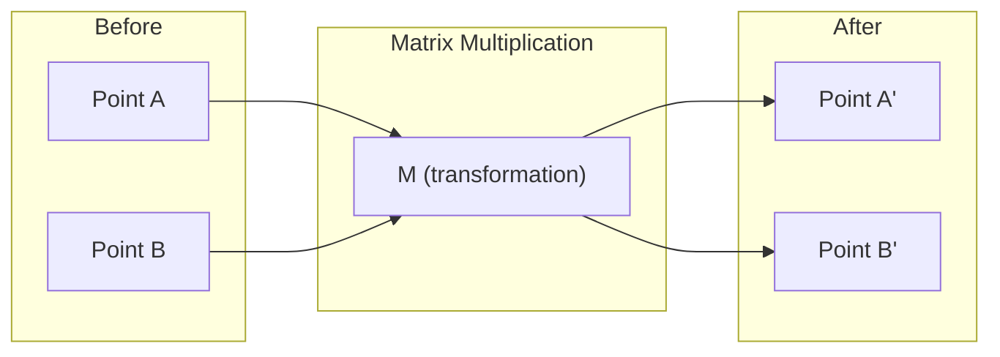
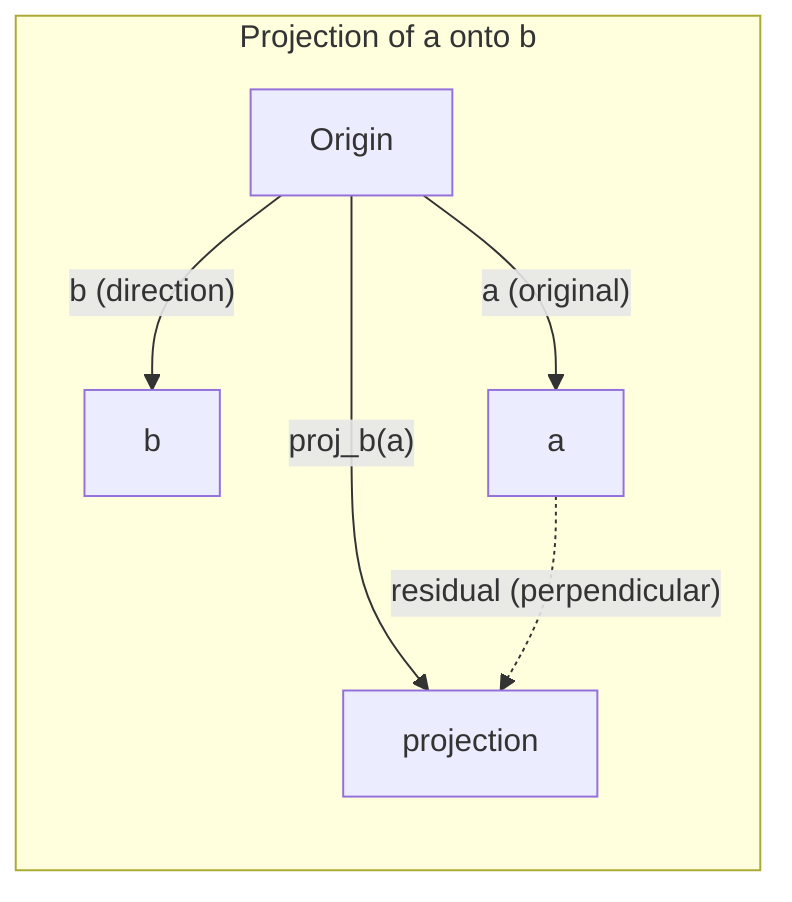

# 线性代数直觉

> 每个 AI 模型本质上都是矩阵运算穿了件花哨的外套。

**类型：** 学习
**语言：** Python, Julia
**前置条件：** Phase 0
**时间：** 约 60 分钟

## 学习目标

- 用 Python 从零实现 vector 和 matrix 运算（加法、dot product、矩阵乘法）
- 从几何角度解释 dot product、projection 和 Gram-Schmidt 过程的含义
- 通过行化简判断一组 vector 的线性无关性、rank 和 basis
- 将线性代数概念与 AI 应用联系起来：embeddings、attention scores 和 LoRA

## 问题

打开任何一篇 ML 论文，第一页你就会看到 vector、matrix、dot product 和变换。没有线性代数直觉，这些只是符号。有了直觉，你就能看到神经网络实际在做什么——在空间中移动点。

你不需要成为数学家。你需要看到这些运算在几何上意味着什么，然后自己把它们写出来。

## 概念

### Vector 既是点也是方向

Vector 就是一组数字。但这些数字有含义——它们是空间中的坐标。

**2D vector [3, 2]：**

| x | y | 点 |
|---|---|-------|
| 3 | 2 | 这个 vector 从原点 (0,0) 指向平面上的 (3, 2) |

这个 vector 的模长为 sqrt(3^2 + 2^2) = sqrt(13)，方向朝右上方。

在 AI 中，vector 表示一切：
- 一个词 → 768 个数字组成的 vector（它在 embedding 空间中的"含义"）
- 一张图片 → 数百万像素值组成的 vector
- 一个用户 → 偏好组成的 vector

### Matrix 是变换

Matrix 将一个 vector 变换成另一个。它可以旋转、缩放、拉伸或投影。



在 AI 中，matrix 就是模型本身：
- 神经网络权重 → 将输入变换为输出的 matrix
- Attention scores → 决定关注什么的 matrix
- Embeddings → 将词映射为 vector 的 matrix

### Dot Product 衡量相似度

两个 vector 的 dot product 告诉你它们有多相似。

```
a · b = a₁×b₁ + a₂×b₂ + ... + aₙ×bₙ

同方向：      a · b > 0  （相似）
垂直：        a · b = 0  （无关）
反方向：      a · b < 0  （不相似）
```

搜索引擎、推荐系统和 RAG 就是这样工作的——找到 dot product 最大的 vector。

### 线性无关

如果一组 vector 中没有任何一个可以被其他 vector 的组合表示，它们就是线性无关的。如果 v1、v2、v3 无关，它们张成一个 3D 空间。如果其中一个是其他的组合，它们只能张成一个平面。

为什么对 AI 重要：你的特征矩阵应该有线性无关的列。如果两个特征完全相关（线性相关），模型就无法区分它们的效果。这会导致回归中的多重共线性——权重矩阵变得不稳定，输入的微小变化会导致输出剧烈波动。

**具体例子：**

```
v1 = [1, 0, 0]
v2 = [0, 1, 0]
v3 = [2, 1, 0]   # v3 = 2*v1 + v2
```

v1 和 v2 是无关的——两者都不是对方的标量倍数或线性组合。但 v3 = 2*v1 + v2，所以 {v1, v2, v3} 是一个相关集。这三个 vector 都在 xy 平面上。无论怎么组合它们，你都无法到达 [0, 0, 1]。你有三个 vector，但只有两个自由度。

在数据集中：如果 feature_3 = 2*feature_1 + feature_2，添加 feature_3 给模型零新信息。更糟的是，它会使正规方程奇异——权重没有唯一解。

### Basis 和 Rank

Basis 是一组最小的线性无关 vector 集合，能张成整个空间。Basis vector 的数量就是空间的维度。

3D 空间的标准 basis 是 {[1,0,0], [0,1,0], [0,0,1]}。但 3D 中任何三个无关的 vector 都构成一个有效的 basis。选择 basis 就是选择坐标系。

Matrix 的 rank = 线性无关列的数量 = 线性无关行的数量。如果 rank < min(rows, cols)，matrix 就是 rank 不足的。这意味着：
- 系统有无穷多解（或无解）
- 变换中信息丢失了
- Matrix 不可逆

| 情况 | Rank | 对 ML 的意义 |
|-----------|------|---------------------|
| 满 rank (rank = min(m, n)) | 最大可能值 | 唯一最小二乘解存在。模型条件良好。 |
| Rank 不足 (rank < min(m, n)) | 低于最大值 | 特征冗余。无穷多权重解。需要正则化。 |
| Rank 1 | 1 | 每列都是一个 vector 的缩放副本。所有数据在一条线上。 |
| 接近 rank 不足（小奇异值） | 数值上低 | Matrix 条件不良。微小输入噪声导致巨大输出变化。使用 SVD 截断或 ridge regression。 |

### Projection

将 vector **a** 投影到 vector **b** 上，得到 **a** 在 **b** 方向上的分量：

```
proj_b(a) = (a dot b / b dot b) * b
```

残差 (a - proj_b(a)) 垂直于 b。这种正交分解是最小二乘拟合的基础。

Projection 在 ML 中无处不在：
- 线性回归最小化观测值到列空间的距离——解本身就是一个 projection
- PCA 将数据投影到最大方差方向
- Transformer 中的 attention 计算 query 到 key 的 projection



**例子：** a = [3, 4], b = [1, 0]

proj_b(a) = (3*1 + 4*0) / (1*1 + 0*0) * [1, 0] = 3 * [1, 0] = [3, 0]

Projection 丢掉了 y 分量。这是最简单形式的降维——扔掉你不关心的方向。

### Gram-Schmidt 过程

将任意一组无关 vector 转换为正交归一 basis。正交归一意味着每个 vector 长度为 1，且每对 vector 互相垂直。

算法：
1. 取第一个 vector，归一化
2. 取第二个 vector，减去它在第一个上的 projection，归一化
3. 取第三个 vector，减去它在所有前面 vector 上的 projection，归一化
4. 对剩余 vector 重复

```
Input:  v1, v2, v3, ... (linearly independent)

u1 = v1 / |v1|

w2 = v2 - (v2 dot u1) * u1
u2 = w2 / |w2|

w3 = v3 - (v3 dot u1) * u1 - (v3 dot u2) * u2
u3 = w3 / |w3|

Output: u1, u2, u3, ... (orthonormal basis)
```

QR 分解内部就是这样工作的。Q 是正交归一 basis，R 捕获 projection 系数。QR 分解用于：
- 求解线性系统（比高斯消元更稳定）
- 计算 eigenvalue（QR 算法）
- 最小二乘回归（标准数值方法）

## 动手构建

### Step 1：从零实现 Vector（Python）

```python
class Vector:
    def __init__(self, components):
        self.components = list(components)
        self.dim = len(self.components)

    def __add__(self, other):
        return Vector([a + b for a, b in zip(self.components, other.components)])

    def __sub__(self, other):
        return Vector([a - b for a, b in zip(self.components, other.components)])

    def dot(self, other):
        return sum(a * b for a, b in zip(self.components, other.components))

    def magnitude(self):
        return sum(x**2 for x in self.components) ** 0.5

    def normalize(self):
        mag = self.magnitude()
        return Vector([x / mag for x in self.components])

    def cosine_similarity(self, other):
        return self.dot(other) / (self.magnitude() * other.magnitude())

    def __repr__(self):
        return f"Vector({self.components})"


a = Vector([1, 2, 3])
b = Vector([4, 5, 6])

print(f"a + b = {a + b}")
print(f"a · b = {a.dot(b)}")
print(f"|a| = {a.magnitude():.4f}")
print(f"cosine similarity = {a.cosine_similarity(b):.4f}")
```

### Step 2：从零实现 Matrix（Python）

```python
class Matrix:
    def __init__(self, rows):
        self.rows = [list(row) for row in rows]
        self.shape = (len(self.rows), len(self.rows[0]))

    def __matmul__(self, other):
        if isinstance(other, Vector):
            return Vector([
                sum(self.rows[i][j] * other.components[j] for j in range(self.shape[1]))
                for i in range(self.shape[0])
            ])
        rows = []
        for i in range(self.shape[0]):
            row = []
            for j in range(other.shape[1]):
                row.append(sum(
                    self.rows[i][k] * other.rows[k][j]
                    for k in range(self.shape[1])
                ))
            rows.append(row)
        return Matrix(rows)

    def transpose(self):
        return Matrix([
            [self.rows[j][i] for j in range(self.shape[0])]
            for i in range(self.shape[1])
        ])

    def __repr__(self):
        return f"Matrix({self.rows})"


rotation_90 = Matrix([[0, -1], [1, 0]])
point = Vector([3, 1])

rotated = rotation_90 @ point
print(f"Original: {point}")
print(f"Rotated 90°: {rotated}")
```

### Step 3：为什么这对 AI 重要

```python
import random

random.seed(42)
weights = Matrix([[random.gauss(0, 0.1) for _ in range(3)] for _ in range(2)])
input_vector = Vector([1.0, 0.5, -0.3])

output = weights @ input_vector
print(f"Input (3D): {input_vector}")
print(f"Output (2D): {output}")
print("This is what a neural network layer does -- matrix multiplication.")
```

### Step 4：Julia 版本

```julia
a = [1.0, 2.0, 3.0]
b = [4.0, 5.0, 6.0]

println("a + b = ", a + b)
println("a · b = ", a ⋅ b)       # Julia supports unicode operators
println("|a| = ", √(a ⋅ a))
println("cosine = ", (a ⋅ b) / (√(a ⋅ a) * √(b ⋅ b)))

# Matrix-vector multiplication
W = [0.1 -0.2 0.3; 0.4 0.5 -0.1]
x = [1.0, 0.5, -0.3]
println("Wx = ", W * x)
println("This is a neural network layer.")
```

### Step 5：线性无关和 Projection 的从零实现（Python）

```python
def is_linearly_independent(vectors):
    n = len(vectors)
    dim = len(vectors[0].components)
    mat = Matrix([v.components[:] for v in vectors])
    rows = [row[:] for row in mat.rows]
    rank = 0
    for col in range(dim):
        pivot = None
        for row in range(rank, len(rows)):
            if abs(rows[row][col]) > 1e-10:
                pivot = row
                break
        if pivot is None:
            continue
        rows[rank], rows[pivot] = rows[pivot], rows[rank]
        scale = rows[rank][col]
        rows[rank] = [x / scale for x in rows[rank]]
        for row in range(len(rows)):
            if row != rank and abs(rows[row][col]) > 1e-10:
                factor = rows[row][col]
                rows[row] = [rows[row][j] - factor * rows[rank][j] for j in range(dim)]
        rank += 1
    return rank == n


def project(a, b):
    scalar = a.dot(b) / b.dot(b)
    return Vector([scalar * x for x in b.components])


def gram_schmidt(vectors):
    orthonormal = []
    for v in vectors:
        w = v
        for u in orthonormal:
            proj = project(w, u)
            w = w - proj
        if w.magnitude() < 1e-10:
            continue
        orthonormal.append(w.normalize())
    return orthonormal


v1 = Vector([1, 0, 0])
v2 = Vector([1, 1, 0])
v3 = Vector([1, 1, 1])
basis = gram_schmidt([v1, v2, v3])
for i, u in enumerate(basis):
    print(f"u{i+1} = {u}")
    print(f"  |u{i+1}| = {u.magnitude():.6f}")

print(f"u1 · u2 = {basis[0].dot(basis[1]):.6f}")
print(f"u1 · u3 = {basis[0].dot(basis[2]):.6f}")
print(f"u2 · u3 = {basis[1].dot(basis[2]):.6f}")
```

## 实际使用

用 NumPy 做同样的事——实践中你真正会用的：

```python
import numpy as np

a = np.array([1, 2, 3], dtype=float)
b = np.array([4, 5, 6], dtype=float)

print(f"a + b = {a + b}")
print(f"a · b = {np.dot(a, b)}")
print(f"|a| = {np.linalg.norm(a):.4f}")
print(f"cosine = {np.dot(a, b) / (np.linalg.norm(a) * np.linalg.norm(b)):.4f}")

W = np.random.randn(2, 3) * 0.1
x = np.array([1.0, 0.5, -0.3])
print(f"Wx = {W @ x}")
```

### 用 NumPy 做 Rank、Projection 和 QR

```python
import numpy as np

A = np.array([[1, 2], [2, 4]])
print(f"Rank: {np.linalg.matrix_rank(A)}")

a = np.array([3, 4])
b = np.array([1, 0])
proj = (np.dot(a, b) / np.dot(b, b)) * b
print(f"Projection of {a} onto {b}: {proj}")

Q, R = np.linalg.qr(np.random.randn(3, 3))
print(f"Q is orthogonal: {np.allclose(Q @ Q.T, np.eye(3))}")
print(f"R is upper triangular: {np.allclose(R, np.triu(R))}")
```

### PyTorch——带自动微分的 Tensor

```python
import torch

x = torch.randn(3, requires_grad=True)
y = torch.tensor([1.0, 0.0, 0.0])

similarity = torch.dot(x, y)
similarity.backward()

print(f"x = {x.data}")
print(f"y = {y.data}")
print(f"dot product = {similarity.item():.4f}")
print(f"d(dot)/dx = {x.grad}")
```

Dot product 对 x 的 gradient 就是 y。PyTorch 自动计算了这个。神经网络中的每个运算都是由这样的操作构建的——矩阵乘法、dot product、projection——autodiff 跟踪所有这些操作的 gradient。

你刚刚从零构建了 NumPy 一行代码就能做的事。现在你知道底层发生了什么。

## 产出

本课产出：
- `outputs/prompt-linear-algebra-tutor.md`——一个让 AI 助手通过几何直觉教线性代数的 prompt

## 关联

本课的所有内容都与现代 AI 的具体部分相连：

| 概念 | 出现在哪里 |
|---------|------------------|
| Dot product | Transformer 中的 attention scores，RAG 中的 cosine similarity |
| 矩阵乘法 | 每个神经网络层，每个线性变换 |
| 线性无关 | 特征选择，避免多重共线性 |
| Rank | 判断系统是否可解，LoRA（低秩适配） |
| Projection | 线性回归（投影到列空间），PCA |
| Gram-Schmidt / QR | 数值求解器，eigenvalue 计算 |
| 正交归一 basis | 稳定的数值计算，白化变换 |

LoRA 值得特别提一下。它通过将权重更新分解为低秩矩阵来微调大语言模型。不是更新一个 4096x4096 的权重矩阵（1600 万参数），LoRA 更新两个大小为 4096x16 和 16x4096 的矩阵（13.1 万参数）。Rank-16 的约束意味着 LoRA 假设权重更新存在于完整 4096 维空间的一个 16 维子空间中。这就是线性代数在做实际工作。

## 练习

1. 实现 `Vector.angle_between(other)`，返回两个 vector 之间的角度（度数）
2. 创建一个 2D 缩放矩阵，将 x 坐标加倍、y 坐标变为三倍，然后应用到 vector [1, 1]
3. 给定 5 个随机的类词 vector（维度 50），用 cosine similarity 找到最相似的两个
4. 验证 Gram-Schmidt 输出确实是正交归一的：检查每对 dot product 为 0，每个 vector 模长为 1
5. 创建一个 rank 为 2 的 3x3 矩阵。用 `rank()` 方法验证。然后解释列张成什么几何对象。
6. 将 vector [1, 2, 3] 投影到 [1, 1, 1] 上。结果在几何上代表什么？

## 关键术语

| 术语 | 通俗说法 | 实际含义 |
|------|----------------|----------------------|
| Vector | "一个箭头" | 表示 n 维空间中一个点或方向的数字列表 |
| Matrix | "一张数字表" | 将 vector 从一个空间映射到另一个空间的变换 |
| Dot product | "乘起来加起来" | 衡量两个 vector 对齐程度的度量——相似度搜索的核心 |
| Embedding | "某种 AI 魔法" | 表示某物含义（词、图片、用户）的 vector |
| 线性无关 | "它们不重叠" | 集合中没有 vector 可以被其他 vector 的组合表示 |
| Rank | "有多少维" | Matrix 中线性无关列（或行）的数量 |
| Projection | "影子" | 一个 vector 在另一个 vector 方向上的分量 |
| Basis | "坐标轴" | 张成空间的最小无关 vector 集合 |
| 正交归一 | "互相垂直的单位 vector" | 互相垂直且每个长度为 1 的 vector |
