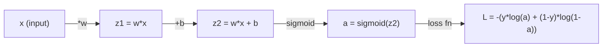
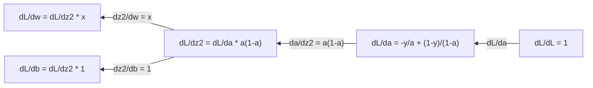
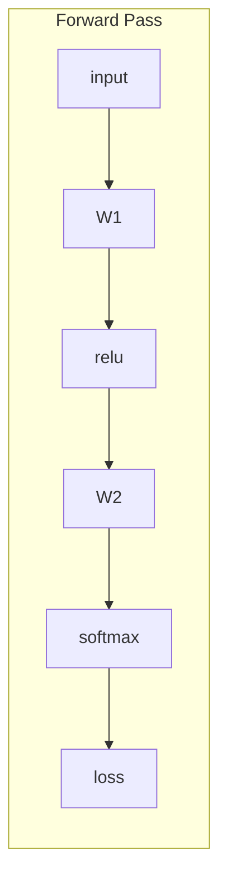
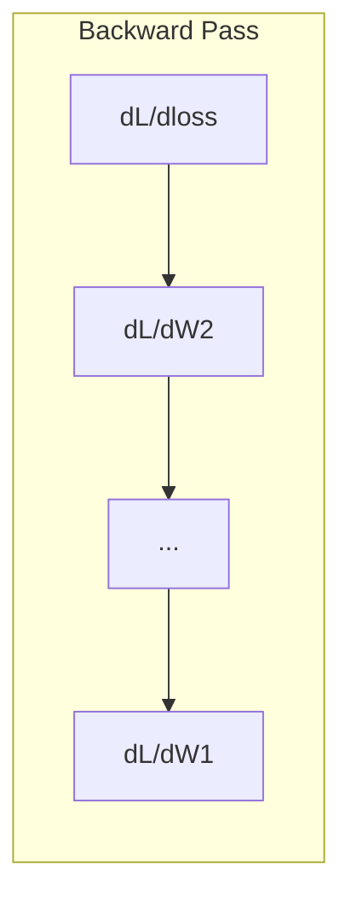

# 机器学习中的微积分

> 导数告诉你哪个方向是下坡。这就是神经网络学习所需要的全部信息。

**类型：** 学习
**语言：** Python
**前置课程：** Phase 1, Lessons 01-03
**时间：** 约 60 分钟

## 学习目标

- 计算常见 ML 函数（x^2、sigmoid、cross-entropy）的数值导数和解析导数
- 从零实现 gradient descent，在一维和二维下最小化损失函数
- 推导 linear regression 模型的梯度，并通过手动权重更新来训练它
- 解释 Hessian 矩阵、Taylor 级数近似，以及它们与优化方法的关联

## 问题

你有一个神经网络，里面有几百万个权重。每个权重都是一个旋钮。你需要弄清楚每一个旋钮该往哪个方向调，才能让模型的错误稍微少一点。微积分给你的就是这个方向。

没有微积分，训练神经网络就只能是随机乱试，听天由命。有了导数，你就能精确知道每个权重对误差的影响。每一次，每一个旋钮都能拧到正确的方向。

## 概念

### 什么是导数？

导数衡量的是变化率。对于函数 y = f(x)，导数 f'(x) 告诉你：如果把 x 微微推动一点，y 会变化多少？

从几何上看，导数就是某点切线的斜率。

**f(x) = x^2：**

| x | f(x) | f'(x)（斜率） |
|---|------|---------------|
| 0 | 0    | 0（平的，在最低点） |
| 1 | 1    | 2 |
| 2 | 4    | 4（该点切线的斜率） |
| 3 | 9    | 6 |

在 x=2 处，斜率是 4。如果把 x 往右挪一点点，y 就会增加约 4 倍那么多。在 x=0 处，斜率是 0。你正处于碗的底部。

形式化定义：

```
f'(x) = lim   f(x + h) - f(x)
        h->0  -----------------
                     h
```

写代码时，跳过取极限这一步，直接用一个非常小的 h。这就是数值导数。

### 偏导数：一次只看一个变量

真实的函数有很多输入。神经网络的损失依赖于成千上万个权重。偏导数把除一个变量外的所有变量都视为常量，然后对这一个变量求导。

```
f(x, y) = x^2 + 3xy + y^2

df/dx = 2x + 3y     (把 y 当作常量)
df/dy = 3x + 2y     (把 x 当作常量)
```

每个偏导数回答的问题是：如果我只调这一个权重，损失会怎么变？

### 梯度：所有偏导数组成的向量

梯度把每一个偏导数都收集到一个向量里。对于函数 f(x, y, z)，梯度是：

```
grad f = [ df/dx, df/dy, df/dz ]
```

梯度指向函数上升最快的方向。要最小化函数，就往反方向走。

**f(x,y) = x^2 + y^2 的等高线图：**

这个函数形成一个碗状，等高线是同心圆。最小值在 (0, 0)。

| 点 | grad f | -grad f（下降方向） |
|-------|--------|----------------------------|
| (1, 1) | [2, 2]（指向上坡，远离最小值） | [-2, -2]（指向下坡，朝向最小值） |
| (0, 0) | [0, 0]（平的，就在最小值处） | [0, 0] |

这就是 gradient descent 的图像版本。计算梯度，取负号，迈一步。

### 与优化的关联

训练神经网络就是优化。你有一个损失函数 L(w1, w2, ..., wn)，它衡量模型的错误程度。你想最小化它。

```
Gradient descent 更新规则：

  w_new = w_old - learning_rate * dL/dw

对每个权重：
  1. 计算损失对该权重的偏导数
  2. 从权重中减去这个偏导数的一个小倍数
  3. 重复
```

学习率控制步长。太大了会跨过头，太小了又走得太慢。

**损失景观（一维切片）：**

损失函数 L(w) 随权重 w 变化形成一条带峰谷的曲线。

| 特征 | 描述 |
|---------|-------------|
| 全局最小值 | 整条曲线上的最低点 —— 最优解 |
| 局部最小值 | 一个比邻居都低、但不是全局最低的山谷 |
| 斜率 | Gradient descent 从任意起点沿斜率下坡 |

Gradient descent 沿着斜率下坡。它可能卡在局部最小值，但在高维空间（几百万个权重）里，这在实践中很少成为真正的问题。

### 数值导数 vs 解析导数

计算导数有两种方式。

解析导数：手工应用微积分规则。对于 f(x) = x^2，导数是 f'(x) = 2x。精确，且快。

数值导数：用定义来近似。计算一个微小 h 下的 f(x+h) 和 f(x-h)，再用差分。

```
数值导数（中心差分）：

f'(x) ~= f(x + h) - f(x - h)
          -----------------------
                  2h

实践中 h = 0.0001 效果不错
```

数值导数较慢，但适用于任意函数。解析导数快，但需要你自己推出公式。神经网络框架用的是第三种方式：自动微分（automatic differentiation），它能机械地计算精确导数。Phase 3 会讲到。

### 简单函数的手算导数

下面这些是你在 ML 中会反复遇到的导数。

```
函数             导数              用在哪里
--------        ----------       -------
f(x) = x^2     f'(x) = 2x      损失函数（MSE）
f(x) = wx + b  f'(w) = x        Linear layer（对 weight 的梯度）
                f'(b) = 1        Linear layer（对 bias 的梯度）
                f'(x) = w        Linear layer（对 input 的梯度）
f(x) = e^x     f'(x) = e^x     Softmax、attention
f(x) = ln(x)   f'(x) = 1/x     Cross-entropy 损失
f(x) = 1/(1+e^-x)  f'(x) = f(x)(1-f(x))   Sigmoid 激活
```

对于 f(x) = x^2：

```
f(x) = x^2    f'(x) = 2x

  x    f(x)   f'(x)   含义
  -2    4      -4      斜率向左倾（递减）
  -1    1      -2      斜率向左倾（递减）
   0    0       0      平的（最小值！）
   1    1       2      斜率向右倾（递增）
   2    4       4      斜率向右倾（递增）
```

对于 f(w) = wx + b，x=3, b=1：

```
f(w) = 3w + 1    f'(w) = 3

对 w 的导数就是 x。
如果 x 很大，w 的小变化会引起输出的大变化。
```

### 链式法则

当函数嵌套组合时，链式法则告诉你怎么求导。

```
若 y = f(g(x))，则 dy/dx = f'(g(x)) * g'(x)

例：y = (3x + 1)^2
  外层：f(u) = u^2       f'(u) = 2u
  内层：g(x) = 3x + 1    g'(x) = 3
  dy/dx = 2(3x + 1) * 3 = 6(3x + 1)
```

神经网络是一连串的函数：input -> linear -> activation -> linear -> activation -> loss。Backpropagation 就是从输出到输入反复应用链式法则。整个算法就这么回事。

### Hessian 矩阵

梯度告诉你斜率。Hessian 告诉你曲率。

Hessian 是二阶偏导数构成的矩阵。对于函数 f(x1, x2, ..., xn)，Hessian 的 (i, j) 项是：

```
H[i][j] = d^2f / (dx_i * dx_j)
```

对于二元函数 f(x, y)：

```
H = | d^2f/dx^2    d^2f/dxdy |
    | d^2f/dydx    d^2f/dy^2 |
```

**在临界点（梯度为 0 处），Hessian 告诉你什么：**

| Hessian 性质 | 含义 | 曲面例子 |
|-----------------|---------|-----------------|
| 正定（所有特征值 > 0） | 局部最小值 | 朝上的碗 |
| 负定（所有特征值 < 0） | 局部最大值 | 朝下的碗 |
| 不定（特征值有正有负） | 鞍点 | 马鞍形 |

**例子：** f(x, y) = x^2 - y^2（鞍函数）

```
df/dx = 2x       df/dy = -2y
d^2f/dx^2 = 2    d^2f/dy^2 = -2    d^2f/dxdy = 0

H = | 2   0 |
    | 0  -2 |

特征值：2 和 -2（一正一负）
--> (0, 0) 是鞍点
```

对比 f(x, y) = x^2 + y^2（碗）：

```
H = | 2  0 |
    | 0  2 |

特征值：2 和 2（都是正的）
--> (0, 0) 是局部最小值
```

**Hessian 在 ML 里为什么重要：**

Newton's method 用 Hessian 走出比 gradient descent 更好的优化步长。它不只是顺着斜率走，还把曲率考虑了进去：

```
Newton 更新：    w_new = w_old - H^(-1) * gradient
Gradient descent: w_new = w_old - lr * gradient
```

Newton's method 收敛更快，因为 Hessian 给梯度做了"重缩放" —— 陡的方向步子小一点，平的方向步子大一点。

代价是：对于有 N 个参数的神经网络，Hessian 是 N x N 的。一个百万参数模型需要一万亿项的矩阵。所以我们只能用近似方法。

| 方法 | 用了什么 | 单步代价 | 收敛速度 |
|--------|-------------|------|-------------|
| Gradient descent | 仅一阶导数 | 每步 O(N) | 慢（线性） |
| Newton's method | 完整 Hessian | 每步 O(N^3) | 快（二次） |
| L-BFGS | 用历史梯度近似 Hessian | 每步 O(N) | 中等（超线性） |
| Adam | 每个参数自适应学习率（对角 Hessian 近似） | 每步 O(N) | 中等 |
| Natural gradient | Fisher 信息矩阵（统计意义上的 Hessian） | 每步 O(N^2) | 快 |

实践中，Adam 是深度学习的默认 optimizer。它通过追踪每个参数梯度的滑动均值和方差，廉价地近似二阶信息。

### Taylor 级数近似

任何光滑函数都可以在局部用多项式近似：

```
f(x + h) = f(x) + f'(x)*h + (1/2)*f''(x)*h^2 + (1/6)*f'''(x)*h^3 + ...
```

包含的项越多，近似越好 —— 但只在 x 附近成立。

**Taylor 级数对 ML 为什么重要：**

- **一阶 Taylor = gradient descent。** 当你用 f(x + h) ~ f(x) + f'(x)*h 时，你在做线性近似。Gradient descent 最小化这个线性模型，得到 h = -lr * f'(x)。

- **二阶 Taylor = Newton's method。** 用 f(x + h) ~ f(x) + f'(x)*h + (1/2)*f''(x)*h^2 时，你得到一个二次模型。最小化它得到 h = -f'(x)/f''(x) —— Newton 步。

- **损失函数设计。** MSE 和 cross-entropy 是光滑的，所以它们的 Taylor 展开性质良好。这不是巧合。光滑的损失让优化变得可预测。

```
近似阶数               捕捉的内容            优化方法
-------------------    -----------------   -------------------
0 阶（常数）            只有函数值            随机搜索
1 阶（线性）            斜率                  Gradient descent
2 阶（二次）            曲率                  Newton's method
更高阶                  更精细的结构          ML 中很少用
```

关键洞察：所有基于梯度的优化，本质上都是在局部近似损失函数，然后走到这个近似的最小值处。

### ML 中的积分

导数告诉你变化率，积分则计算累积量 —— 曲线下的面积。

ML 中你很少手算积分，但这个概念无处不在：

**Probability。** 对于密度为 p(x) 的连续随机变量：
```
P(a < X < b) = integral from a to b of p(x) dx
```
概率密度曲线在 a 到 b 之间的面积，就是落在该范围内的概率。

**Expected value。** 用概率加权的平均结果：
```
E[f(X)] = integral of f(x) * p(x) dx
```
数据分布上的期望损失就是一个积分。训练过程最小化它的经验近似。

**KL divergence。** 衡量两个分布有多不同：
```
KL(p || q) = integral of p(x) * log(p(x) / q(x)) dx
```
用在 VAEs、知识蒸馏、Bayesian 推断里。

**归一化常数。** 在 Bayesian 推断中：
```
p(w | data) = p(data | w) * p(w) / integral of p(data | w) * p(w) dw
```
分母是对所有可能参数值的积分。它通常不可解，所以我们用 MCMC 和变分推断来近似。

| 积分概念 | 在 ML 里出现的地方 |
|-----------------|----------------------|
| 曲线下面积 | 由密度函数得到的概率 |
| 期望值 | 损失函数、风险最小化 |
| KL divergence | VAEs、policy 优化、蒸馏 |
| 归一化 | Bayesian 后验、softmax 分母 |
| 边际似然 | 模型比较、ELBO（证据下界） |

### 计算图中的多变量链式法则

链式法则不只适用于一条线上的标量函数。在神经网络里，变量会扇出再合并。下面是导数在一个简单前向传播里的流动方式：



反向传播从右往左计算梯度：



每条箭头都乘上一个局部导数。任何参数的梯度，都是从损失到该参数路径上所有局部导数的乘积。当路径分叉再合并时，要把贡献加起来（多变量链式法则）。

Backpropagation 全部秘密就这些：链式法则在计算图上从输出到输入系统地应用。

### Jacobian 矩阵

当函数把向量映射到向量时（比如神经网络的一层），它的导数是一个矩阵。Jacobian 包含每一个输出对每一个输入的偏导数。

对于 f: R^n -> R^m，Jacobian J 是一个 m x n 矩阵：

| | x1 | x2 | ... | xn |
|---|---|---|---|---|
| f1 | df1/dx1 | df1/dx2 | ... | df1/dxn |
| f2 | df2/dx1 | df2/dx2 | ... | df2/dxn |
| ... | ... | ... | ... | ... |
| fm | dfm/dx1 | dfm/dx2 | ... | dfm/dxn |

你不会手算神经网络的 Jacobian，PyTorch 替你处理。但知道它的存在能帮你理解 backpropagation 中的形状：如果一层把 R^n 映射到 R^m，它的 Jacobian 是 m x n。梯度反向流动时是经过这个矩阵的转置。

### 这一切对神经网络为什么重要

神经网络中的每个权重都会得到一个梯度。梯度告诉你怎么调整这个权重才能减少损失。





每次权重更新：
- `W1 = W1 - lr * dL/dW1`
- `W2 = W2 - lr * dL/dW2`

前向传播计算预测和损失。反向传播计算损失对每个权重的梯度。然后每个权重沿下坡迈一小步。重复几百万步。这就是深度学习。

## 动手构建

### Step 1：从零实现数值导数

```python
def numerical_derivative(f, x, h=1e-7):
    return (f(x + h) - f(x - h)) / (2 * h)

def f(x):
    return x ** 2

for x in [-2, -1, 0, 1, 2]:
    numerical = numerical_derivative(f, x)
    analytical = 2 * x
    print(f"x={x:2d}  f'(x) numerical={numerical:.6f}  analytical={analytical:.1f}")
```

数值导数与解析导数小数点后好几位都能对上。

### Step 2：偏导数与梯度

```python
def numerical_gradient(f, point, h=1e-7):
    gradient = []
    for i in range(len(point)):
        point_plus = list(point)
        point_minus = list(point)
        point_plus[i] += h
        point_minus[i] -= h
        partial = (f(point_plus) - f(point_minus)) / (2 * h)
        gradient.append(partial)
    return gradient

def f_multi(point):
    x, y = point
    return x**2 + 3*x*y + y**2

grad = numerical_gradient(f_multi, [1.0, 2.0])
print(f"Numerical gradient at (1,2): {[f'{g:.4f}' for g in grad]}")
print(f"Analytical gradient at (1,2): [2*1+3*2, 3*1+2*2] = [{2*1+3*2}, {3*1+2*2}]")
```

### Step 3：用 gradient descent 找 f(x) = x^2 的最小值

```python
x = 5.0
lr = 0.1
for step in range(20):
    grad = 2 * x
    x = x - lr * grad
    print(f"step {step:2d}  x={x:8.4f}  f(x)={x**2:10.6f}")
```

从 x=5 起步，每一步都更接近 x=0（最小值）。

### Step 4：在二维函数上做 gradient descent

```python
def f_2d(point):
    x, y = point
    return x**2 + y**2

point = [4.0, 3.0]
lr = 0.1
for step in range(30):
    grad = numerical_gradient(f_2d, point)
    point = [p - lr * g for p, g in zip(point, grad)]
    loss = f_2d(point)
    if step % 5 == 0 or step == 29:
        print(f"step {step:2d}  point=({point[0]:7.4f}, {point[1]:7.4f})  f={loss:.6f}")
```

### Step 5：对比数值导数与解析导数

```python
import math

test_functions = [
    ("x^2",      lambda x: x**2,          lambda x: 2*x),
    ("x^3",      lambda x: x**3,          lambda x: 3*x**2),
    ("sin(x)",   lambda x: math.sin(x),   lambda x: math.cos(x)),
    ("e^x",      lambda x: math.exp(x),   lambda x: math.exp(x)),
    ("1/x",      lambda x: 1/x,           lambda x: -1/x**2),
]

x = 2.0
print(f"{'Function':<12} {'Numerical':>12} {'Analytical':>12} {'Error':>12}")
print("-" * 50)
for name, f, df in test_functions:
    num = numerical_derivative(f, x)
    ana = df(x)
    err = abs(num - ana)
    print(f"{name:<12} {num:12.6f} {ana:12.6f} {err:12.2e}")
```

### Step 6：数值方法计算 Hessian

```python
def hessian_2d(f, x, y, h=1e-5):
    fxx = (f(x + h, y) - 2 * f(x, y) + f(x - h, y)) / (h ** 2)
    fyy = (f(x, y + h) - 2 * f(x, y) + f(x, y - h)) / (h ** 2)
    fxy = (f(x + h, y + h) - f(x + h, y - h) - f(x - h, y + h) + f(x - h, y - h)) / (4 * h ** 2)
    return [[fxx, fxy], [fxy, fyy]]

def saddle(x, y):
    return x ** 2 - y ** 2

def bowl(x, y):
    return x ** 2 + y ** 2

H_saddle = hessian_2d(saddle, 0.0, 0.0)
H_bowl = hessian_2d(bowl, 0.0, 0.0)
print(f"Saddle Hessian: {H_saddle}")  # [[2, 0], [0, -2]] -- mixed signs
print(f"Bowl Hessian:   {H_bowl}")    # [[2, 0], [0, 2]]  -- both positive
```

鞍函数的 Hessian 特征值是 2 和 -2（符号混合，确认是鞍点）。碗的特征值是 2 和 2（都为正，确认是最小值）。

### Step 7：Taylor 近似实战

```python
import math

def taylor_approx(f, f_prime, f_double_prime, x0, h, order=2):
    result = f(x0)
    if order >= 1:
        result += f_prime(x0) * h
    if order >= 2:
        result += 0.5 * f_double_prime(x0) * h ** 2
    return result

x0 = 0.0
for h in [0.1, 0.5, 1.0, 2.0]:
    true_val = math.sin(h)
    t1 = taylor_approx(math.sin, math.cos, lambda x: -math.sin(x), x0, h, order=1)
    t2 = taylor_approx(math.sin, math.cos, lambda x: -math.sin(x), x0, h, order=2)
    print(f"h={h:.1f}  sin(h)={true_val:.4f}  order1={t1:.4f}  order2={t2:.4f}")
```

在 x0=0 附近，sin(x) ~ x（一阶 Taylor）。h 小的时候近似很好，h 大就会失效。这就是为什么 gradient descent 在小学习率下表现最好 —— 每一步都假设线性近似是准确的。

### Step 8：这一切对神经网络为什么重要

```python
import random

random.seed(42)

w = random.gauss(0, 1)
b = random.gauss(0, 1)
lr = 0.01

xs = [1.0, 2.0, 3.0, 4.0, 5.0]
ys = [3.0, 5.0, 7.0, 9.0, 11.0]

for epoch in range(200):
    total_loss = 0
    dw = 0
    db = 0
    for x, y in zip(xs, ys):
        pred = w * x + b
        error = pred - y
        total_loss += error ** 2
        dw += 2 * error * x
        db += 2 * error
    dw /= len(xs)
    db /= len(xs)
    total_loss /= len(xs)
    w -= lr * dw
    b -= lr * db
    if epoch % 40 == 0 or epoch == 199:
        print(f"epoch {epoch:3d}  w={w:.4f}  b={b:.4f}  loss={total_loss:.6f}")

print(f"\nLearned: y = {w:.2f}x + {b:.2f}")
print(f"Actual:  y = 2x + 1")
```

每一个基于梯度的训练循环都是这个套路：预测、算损失、算梯度、更新权重。

## 用起来

用 NumPy 同样的操作更快也更简洁：

```python
import numpy as np

x = np.array([1, 2, 3, 4, 5], dtype=float)
y = np.array([3, 5, 7, 9, 11], dtype=float)

w, b = np.random.randn(), np.random.randn()
lr = 0.01

for epoch in range(200):
    pred = w * x + b
    error = pred - y
    loss = np.mean(error ** 2)
    dw = np.mean(2 * error * x)
    db = np.mean(2 * error)
    w -= lr * dw
    b -= lr * db

print(f"Learned: y = {w:.2f}x + {b:.2f}")
```

你刚刚从零搭出了 gradient descent。PyTorch 把梯度计算自动化了，但更新循环是一模一样的。

## 练习

1. 用调用两次 `numerical_derivative` 的方式实现 `numerical_second_derivative(f, x)`。验证 x^3 在 x=2 处的二阶导数是 12。
2. 用 gradient descent 找 f(x, y) = (x - 3)^2 + (y + 1)^2 的最小值。从 (0, 0) 出发。答案应该收敛到 (3, -1)。
3. 给 gradient descent 循环加上 momentum：维护一个累积过往梯度的速度向量。在 f(x) = x^4 - 3x^2 上对比有无 momentum 的收敛速度。

## 关键术语

| 术语 | 大家怎么说 | 它实际上是什么 |
|------|----------------|----------------------|
| Derivative | "斜率" | 函数在某点的变化率。告诉你输入每变化一个单位，输出会变化多少。 |
| Partial derivative | "对一个变量求导" | 把其他所有变量当作常量，只对一个变量求导。 |
| Gradient | "上升最快的方向" | 所有偏导数构成的向量。指向函数增长最快的方向。 |
| Gradient descent | "下坡走" | 从参数中减去梯度（乘上学习率）来减小损失。神经网络训练的核心。 |
| Learning rate | "步长" | 控制每次 gradient descent 步子大小的标量。太大会发散，太小会收敛得慢。 |
| Chain rule | "导数相乘" | 复合函数求导规则：df/dx = df/dg * dg/dx。Backpropagation 的数学基础。 |
| Jacobian | "导数矩阵" | 当函数把向量映到向量时，Jacobian 是所有输出对所有输入偏导数的矩阵。 |
| Numerical derivative | "有限差分" | 在两个邻近点上取函数值，用斜率来近似导数。 |
| Backpropagation | "反向模式自动微分" | 用链式法则从输出到输入逐层计算梯度。神经网络的学习方式。 |
| Hessian | "二阶导数矩阵" | 所有二阶偏导数构成的矩阵。描述函数的曲率。临界点处 Hessian 正定意味着局部最小值。 |
| Taylor series | "多项式近似" | 用导数在一个点附近近似函数：f(x+h) ~ f(x) + f'(x)h + (1/2)f''(x)h^2 + ...。理解 gradient descent 和 Newton's method 为什么有效的基础。 |
| Integral | "曲线下面积" | 一个量在某区间的累积。在 ML 中，积分定义了概率、期望值和 KL divergence。 |

## 延伸阅读

- [3Blue1Brown: Essence of Calculus](https://www.3blue1brown.com/topics/calculus) - 关于导数、积分和链式法则的视觉直觉
- [Stanford CS231n: Backpropagation](https://cs231n.github.io/optimization-2/) - 梯度如何在神经网络层间流动
