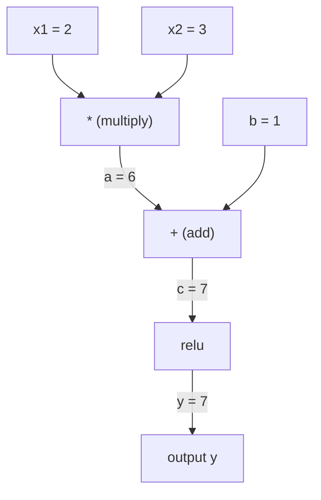
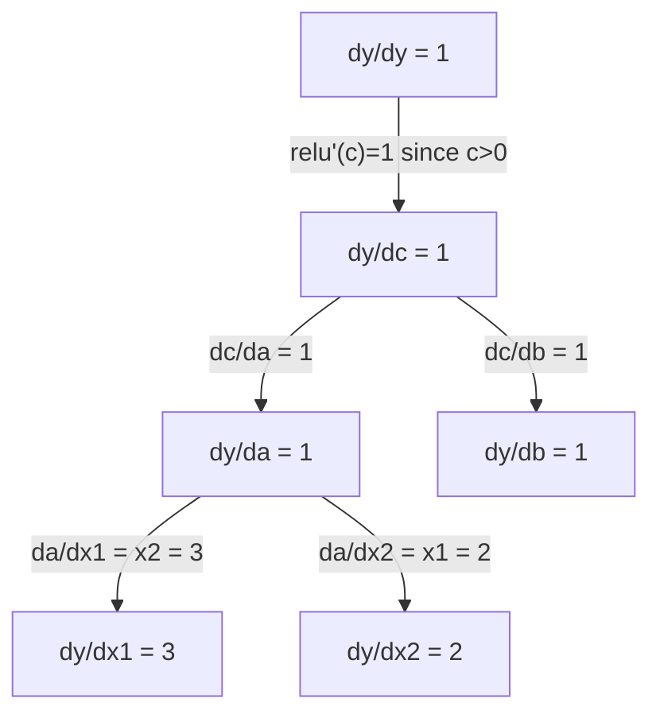

# 链式法则与自动微分

> 链式法则是每一个会学习的神经网络背后的引擎。

**类型：** 构建
**语言：** Python
**前置课程：** Phase 1, Lesson 04（导数与梯度）
**时间：** 约 90 分钟

## 学习目标

- 构建一个最小的 autograd 引擎（Value class），它能记录操作并通过反向模式自动微分计算梯度
- 用拓扑排序在计算图上实现前向和反向传播
- 仅用从零搭建的 autograd 引擎在 XOR 上构建并训练一个 multi-layer perceptron
- 用 gradient checking 与数值有限差分对比来验证 autodiff 的正确性

## 问题

你能算简单函数的导数。但神经网络不是简单函数。它是几百个函数嵌套组合：matrix multiply、加 bias、应用 activation、再 matrix multiply、softmax、cross-entropy loss。输出是函数的函数的函数。

要训练网络，你需要损失对每一个权重的梯度。手算几百万个参数是不可能的。用数值方法（有限差分）又太慢。

链式法则给你数学。自动微分给你算法。两者结合，让你能在与一次前向传播相当的时间里，对任意函数组合算出精确梯度。

PyTorch、TensorFlow、JAX 就是这么工作的。你将从零搭一个迷你版。

## 概念

### 链式法则

如果 `y = f(g(x))`，y 对 x 的导数是：

```
dy/dx = dy/dg * dg/dx = f'(g(x)) * g'(x)
```

把链上的每一段导数相乘。每一段贡献它的局部导数。

例子：`y = sin(x^2)`

```
g(x) = x^2       g'(x) = 2x
f(g) = sin(g)     f'(g) = cos(g)

dy/dx = cos(x^2) * 2x
```

更深的嵌套，链就更长：

```
y = f(g(h(x)))

dy/dx = f'(g(h(x))) * g'(h(x)) * h'(x)
```

神经网络的每一层都是这条链上的一个环节。

### 计算图

计算图把链式法则可视化。每个操作是一个节点。数据沿着图前向流动。梯度沿着图反向流动。

**前向传播（计算值）：**



**反向传播（计算梯度）：**



反向传播在每个节点上应用链式法则，把梯度从输出传播到输入。

### 前向模式 vs 反向模式

在图上应用链式法则有两种方式。

**前向模式（Forward mode）** 从输入开始，把导数往前推。它从 `dx/dx = 1` 开始，逐个操作往前传播。当输入少、输出多时表现好。

```
前向模式：以 dx/dx = 1 起步，往前传播

  x = 2       (dx/dx = 1)
  a = x^2     (da/dx = 2x = 4)
  y = sin(a)  (dy/dx = cos(a) * da/dx = cos(4) * 4 = -2.615)
```

**反向模式（Reverse mode）** 从输出开始，把梯度往回拉。它从 `dy/dy = 1` 开始，逆向逐个操作传播。当输入多、输出少时表现好。

```
反向模式：以 dy/dy = 1 起步，往后传播

  y = sin(a)  (dy/dy = 1)
  a = x^2     (dy/da = cos(a) = cos(4) = -0.654)
  x = 2       (dy/dx = dy/da * da/dx = -0.654 * 4 = -2.615)
```

神经网络有几百万输入（权重）和一个输出（损失）。反向模式一次反向传播就能算出所有梯度。这就是为什么 backpropagation 用反向模式。

| 模式 | 起步种子 | 方向 | 适用 |
|------|------|-----------|-----------|
| Forward | `dx_i/dx_i = 1` | 输入到输出 | 输入少、输出多 |
| Reverse | `dy/dy = 1` | 输出到输入 | 输入多、输出少（神经网络） |

### 用 dual number 实现前向模式

前向模式可以用 dual number 优雅地实现。dual number 形如 `a + b*epsilon`，其中 `epsilon^2 = 0`。

```
Dual number: (value, derivative)

(2, 1) 表示：值是 2，对 x 的导数是 1

算术规则：
  (a, a') + (b, b') = (a+b, a'+b')
  (a, a') * (b, b') = (a*b, a'*b + a*b')
  sin(a, a')         = (sin(a), cos(a)*a')
```

把输入变量的导数置为 1。导数会随每次操作自动传播。

### 构建一个 autograd 引擎

autograd 引擎需要三件事：

1. **值的封装。** 把每个数字包装成一个对象，存它的值和梯度。
2. **图的记录。** 每次操作记录它的输入和局部梯度函数。
3. **反向传播。** 对图做拓扑排序，然后逆序遍历，每个节点上应用链式法则。

PyTorch 的 `autograd` 就是这么做的。`torch.Tensor` 类封装值，在 `requires_grad=True` 时记录操作，在你调用 `.backward()` 时计算梯度。

### PyTorch Autograd 的内部工作原理

当你写 PyTorch 代码：

```python
x = torch.tensor(2.0, requires_grad=True)
y = x ** 2 + 3 * x + 1
y.backward()
print(x.grad)  # 7.0 = 2*x + 3 = 2*2 + 3
```

PyTorch 内部会：

1. 为 `x` 创建一个 `requires_grad=True` 的 `Tensor` 节点
2. 每个操作（`**`、`*`、`+`）创建一个新节点并记录反向函数
3. `y.backward()` 通过记录的图触发反向模式 autodiff
4. 每个节点的 `grad_fn` 计算局部梯度并传给父节点
5. 梯度通过加法（不是替换）累积到 `.grad` 属性中

图是动态的（define-by-run）。每次前向传播都会重建一个新图。这就是为什么 PyTorch 模型里能用 Python 控制流（if/else、循环）。

## 动手构建

### Step 1：Value 类

```python
class Value:
    def __init__(self, data, children=(), op=''):
        self.data = data
        self.grad = 0.0
        self._backward = lambda: None
        self._prev = set(children)
        self._op = op

    def __repr__(self):
        return f"Value(data={self.data:.4f}, grad={self.grad:.4f})"
```

每个 `Value` 存它的数值数据、它的梯度（初始为零）、一个反向函数，以及指向产生它的子节点的指针。

### Step 2：带梯度追踪的算术操作

```python
    def __add__(self, other):
        other = other if isinstance(other, Value) else Value(other)
        out = Value(self.data + other.data, (self, other), '+')
        def _backward():
            self.grad += out.grad
            other.grad += out.grad
        out._backward = _backward
        return out

    def __mul__(self, other):
        other = other if isinstance(other, Value) else Value(other)
        out = Value(self.data * other.data, (self, other), '*')
        def _backward():
            self.grad += other.data * out.grad
            other.grad += self.data * out.grad
        out._backward = _backward
        return out

    def relu(self):
        out = Value(max(0, self.data), (self,), 'relu')
        def _backward():
            self.grad += (1.0 if out.data > 0 else 0.0) * out.grad
        out._backward = _backward
        return out
```

每个操作创建一个闭包，知道怎么计算局部梯度，并乘上上游梯度（`out.grad`）。`+=` 处理一个值被多次操作使用的情形。

### Step 3：反向传播

```python
    def backward(self):
        topo = []
        visited = set()
        def build_topo(v):
            if v not in visited:
                visited.add(v)
                for child in v._prev:
                    build_topo(child)
                topo.append(v)
        build_topo(self)

        self.grad = 1.0
        for v in reversed(topo):
            v._backward()
```

拓扑排序保证每个节点的梯度在传播给子节点之前都已经完全计算好了。种子梯度是 1.0（dy/dy = 1）。

### Step 4：完整引擎需要的更多操作

基础 Value 类只支持加法、乘法和 relu。真正的 autograd 引擎需要更多。下面是构建神经网络需要的操作：

```python
    def __neg__(self):
        return self * -1

    def __sub__(self, other):
        return self + (-other)

    def __radd__(self, other):
        return self + other

    def __rmul__(self, other):
        return self * other

    def __rsub__(self, other):
        return other + (-self)

    def __pow__(self, n):
        out = Value(self.data ** n, (self,), f'**{n}')
        def _backward():
            self.grad += n * (self.data ** (n - 1)) * out.grad
        out._backward = _backward
        return out

    def __truediv__(self, other):
        return self * (other ** -1) if isinstance(other, Value) else self * (Value(other) ** -1)

    def exp(self):
        import math
        e = math.exp(self.data)
        out = Value(e, (self,), 'exp')
        def _backward():
            self.grad += e * out.grad
        out._backward = _backward
        return out

    def log(self):
        import math
        out = Value(math.log(self.data), (self,), 'log')
        def _backward():
            self.grad += (1.0 / self.data) * out.grad
        out._backward = _backward
        return out

    def tanh(self):
        import math
        t = math.tanh(self.data)
        out = Value(t, (self,), 'tanh')
        def _backward():
            self.grad += (1 - t ** 2) * out.grad
        out._backward = _backward
        return out
```

**每个操作为什么重要：**

| 操作 | 反向规则 | 用在哪 |
|-----------|--------------|---------|
| `__sub__` | 复用 add + neg | 损失计算（pred - target） |
| `__pow__` | n * x^(n-1) | 多项式激活、MSE（error^2） |
| `__truediv__` | 复用 mul + pow(-1) | 归一化、学习率缩放 |
| `exp` | exp(x) * 上游 | Softmax、log-likelihood |
| `log` | (1/x) * 上游 | Cross-entropy 损失、log 概率 |
| `tanh` | (1 - tanh^2) * 上游 | 经典激活函数 |

巧妙之处：`__sub__` 和 `__truediv__` 是用现有操作定义的。它们免费得到正确的梯度，因为链式法则会自动通过底层的 add/mul/pow 组合起来。

### Step 5：从零搭一个 mini MLP

有了完整的 Value 类，你就能搭神经网络。不用 PyTorch，不用 NumPy，只用 Value 和链式法则。

```python
import random

class Neuron:
    def __init__(self, n_inputs):
        self.w = [Value(random.uniform(-1, 1)) for _ in range(n_inputs)]
        self.b = Value(0.0)

    def __call__(self, x):
        act = sum((wi * xi for wi, xi in zip(self.w, x)), self.b)
        return act.tanh()

    def parameters(self):
        return self.w + [self.b]

class Layer:
    def __init__(self, n_inputs, n_outputs):
        self.neurons = [Neuron(n_inputs) for _ in range(n_outputs)]

    def __call__(self, x):
        return [n(x) for n in self.neurons]

    def parameters(self):
        return [p for n in self.neurons for p in n.parameters()]

class MLP:
    def __init__(self, sizes):
        self.layers = [Layer(sizes[i], sizes[i+1]) for i in range(len(sizes)-1)]

    def __call__(self, x):
        for layer in self.layers:
            x = layer(x)
        return x[0] if len(x) == 1 else x

    def parameters(self):
        return [p for layer in self.layers for p in layer.parameters()]
```

`Neuron` 计算 `tanh(w1*x1 + w2*x2 + ... + b)`。`Layer` 是一组 neurons。`MLP` 把多层堆起来。每个权重都是一个 `Value`，所以调用 `loss.backward()` 会把梯度传到每个参数。

**在 XOR 上训练：**

```python
random.seed(42)
model = MLP([2, 4, 1])  # 2 inputs, 4 hidden neurons, 1 output

xs = [[0, 0], [0, 1], [1, 0], [1, 1]]
ys = [-1, 1, 1, -1]  # XOR pattern (using -1/1 for tanh)

for step in range(100):
    preds = [model(x) for x in xs]
    loss = sum((p - y) ** 2 for p, y in zip(preds, ys))

    for p in model.parameters():
        p.grad = 0.0
    loss.backward()

    lr = 0.05
    for p in model.parameters():
        p.data -= lr * p.grad

    if step % 20 == 0:
        print(f"step {step:3d}  loss = {loss.data:.4f}")

print("\nPredictions after training:")
for x, y in zip(xs, ys):
    print(f"  input={x}  target={y:2d}  pred={model(x).data:6.3f}")
```

这就是 micrograd。一个完整的神经网络训练循环，纯 Python 加自动微分。所有商业深度学习框架都是用同样的方法在大规模上做这件事。

### Step 6：Gradient checking

你怎么知道你的 autodiff 对不对？跟数值导数比较。这就是 gradient checking。

```python
def gradient_check(build_expr, x_val, h=1e-7):
    x = Value(x_val)
    y = build_expr(x)
    y.backward()
    autodiff_grad = x.grad

    y_plus = build_expr(Value(x_val + h)).data
    y_minus = build_expr(Value(x_val - h)).data
    numerical_grad = (y_plus - y_minus) / (2 * h)

    diff = abs(autodiff_grad - numerical_grad)
    return autodiff_grad, numerical_grad, diff
```

在一个复杂表达式上测试：

```python
def expr(x):
    return (x ** 3 + x * 2 + 1).tanh()

ad, num, diff = gradient_check(expr, 0.5)
print(f"Autodiff:  {ad:.8f}")
print(f"Numerical: {num:.8f}")
print(f"Difference: {diff:.2e}")
# Difference should be < 1e-5
```

实现新操作时 gradient checking 很关键。如果反向传播有 bug，数值检查能抓到。所有正经的深度学习实现在开发期间都会跑 gradient check。

**什么时候用 gradient checking：**

| 场景 | 要不要 gradient check？ |
|-----------|-------------------|
| 给 autograd 加新操作 | 一定要 |
| 调试不收敛的训练循环 | 要，先检查梯度 |
| 生产训练 | 不要，太慢（每个参数 2 次前向传播） |
| autograd 代码的单元测试 | 要，自动化 |

### Step 7：与手算结果验证

```python
x1 = Value(2.0)
x2 = Value(3.0)
a = x1 * x2          # a = 6.0
b = a + Value(1.0)    # b = 7.0
y = b.relu()          # y = 7.0

y.backward()

print(f"y = {y.data}")          # 7.0
print(f"dy/dx1 = {x1.grad}")   # 3.0 (= x2)
print(f"dy/dx2 = {x2.grad}")   # 2.0 (= x1)
```

手算检查：`y = relu(x1*x2 + 1)`。因为 `x1*x2 + 1 = 7 > 0`，relu 就是 identity。
`dy/dx1 = x2 = 3`。`dy/dx2 = x1 = 2`。引擎结果一致。

## 用起来

### 与 PyTorch 对比验证

```python
import torch

x1 = torch.tensor(2.0, requires_grad=True)
x2 = torch.tensor(3.0, requires_grad=True)
a = x1 * x2
b = a + 1.0
y = torch.relu(b)
y.backward()

print(f"PyTorch dy/dx1 = {x1.grad.item()}")  # 3.0
print(f"PyTorch dy/dx2 = {x2.grad.item()}")  # 2.0
```

梯度一样。你的引擎和 PyTorch 算出相同的结果，因为数学是同一套：通过链式法则的反向模式 autodiff。

### 一个更复杂的表达式

```python
a = Value(2.0)
b = Value(-3.0)
c = Value(10.0)
f = (a * b + c).relu()  # relu(2*(-3) + 10) = relu(4) = 4

f.backward()
print(f"df/da = {a.grad}")  # -3.0 (= b)
print(f"df/db = {b.grad}")  #  2.0 (= a)
print(f"df/dc = {c.grad}")  #  1.0
```

## 交付产物

这节课产出：
- `outputs/skill-autodiff.md` —— 用于构建和调试 autograd 系统的 skill
- `code/autodiff.py` —— 一个可扩展的最小 autograd 引擎

这里搭的 Value 类是 Phase 3 神经网络训练循环的基础。

## 练习

1. 给 Value 类加上 `__pow__`，让你能算 `x ** n`。验证 `d/dx(x^3)` 在 `x=2` 处等于 `12.0`。

2. 加上 `tanh` 作为激活函数。验证 `tanh'(0) = 1`，以及 `tanh'(2) ≈ 0.0707`。

3. 为单个 neuron 构建计算图：`y = relu(w1*x1 + w2*x2 + b)`。计算所有五个梯度，并与 PyTorch 对比。

4. 用 dual number 实现前向模式 autodiff。创建一个 `Dual` 类，并验证它给出和反向模式引擎相同的导数。

## 关键术语

| 术语 | 大家怎么说 | 它实际上是什么 |
|------|----------------|----------------------|
| Chain rule | "导数相乘" | 复合函数的导数等于每个函数局部导数的乘积，每个都在正确的点取值 |
| Computational graph | "网络图" | 一个有向无环图，节点是操作，边携带值（前向）或梯度（反向） |
| Forward mode | "把导数往前推" | 把导数从输入传播到输出的 autodiff。每个输入变量需要一次传播。 |
| Reverse mode | "Backpropagation" | 把梯度从输出传播到输入的 autodiff。每个输出变量需要一次传播。 |
| Autograd | "自动梯度" | 一个系统，记录值上的操作，构建图，通过链式法则计算精确梯度 |
| Dual numbers | "值加导数" | 形如 a + b*epsilon（epsilon^2 = 0）的数，在算术中携带导数信息 |
| Topological sort | "依赖顺序" | 排序图节点，使每个节点都在它所有依赖之后。正确的梯度传播必需。 |
| Gradient accumulation | "累加而不是替换" | 当一个值参与多个操作时，它的梯度是所有上游梯度贡献的和 |
| Dynamic graph | "Define by run" | 每次前向传播都重建的计算图，允许在模型里使用 Python 控制流（PyTorch 风格） |
| Gradient checking | "数值验证" | 把 autodiff 梯度与数值有限差分梯度对比来验证正确性。调试必备。 |
| MLP | "Multi-layer perceptron" | 一个或多个隐层神经元的神经网络。每个 neuron 计算加权和加 bias，然后应用激活函数。 |
| Neuron | "加权和 + 激活" | 基本单元：output = activation(w1*x1 + w2*x2 + ... + b)。权重和 bias 是可学习参数。 |

## 延伸阅读

- [3Blue1Brown: Backpropagation calculus](https://www.youtube.com/watch?v=tIeHLnjs5U8) —— 链式法则在神经网络中的可视化解释
- [PyTorch Autograd mechanics](https://pytorch.org/docs/stable/notes/autograd.html) —— 真实系统的工作原理
- [Baydin et al., Automatic Differentiation in Machine Learning: a Survey](https://arxiv.org/abs/1502.05767) —— 全面的参考资料
