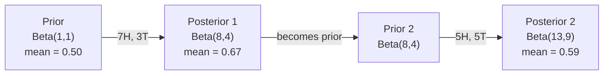

# 贝叶斯定理

> 概率讲的是你的预期。贝叶斯定理讲的是你如何从数据中学习。

**类型：** Build
**语言：** Python
**前置课程：** Phase 1, Lesson 06（概率基础）
**时间：** 约 75 分钟

## 学习目标

- 运用贝叶斯定理，从先验、似然和证据计算后验概率
- 从零构建一个带 Laplace smoothing 和 log 空间计算的 Naive Bayes 文本分类器
- 比较 MLE 和 MAP 估计，并解释 MAP 如何对应 L2 regularization
- 使用 Beta-Binomial 共轭先验实现序贯贝叶斯更新，用于 A/B 测试

## 问题

一个医学检测准确率 99%。你检测呈阳性。你真正患病的概率是多少？

大多数人会说 99%。真实答案取决于疾病有多罕见。如果每 10,000 人中只有 1 人患病，那么阳性结果只意味着你大约有 1% 的概率真的生病了。其余 99% 的阳性结果都是健康人的误报。

这不是脑筋急转弯，这就是贝叶斯定理。每个垃圾邮件过滤器、每个医学诊断、每个量化不确定性的机器学习模型都在用这个推理。你从一个信念出发，观察到证据，然后更新信念。

如果你在不理解这些的情况下构建 ML 系统，你会误解模型输出、设置错误的阈值、上线过度自信的预测。

## 概念

### 从联合概率到贝叶斯

你在 Lesson 06 中已经知道条件概率是：

```
P(A|B) = P(A and B) / P(B)
```

对称地：

```
P(B|A) = P(A and B) / P(A)
```

两个表达式共享同一个分子：P(A and B)。令它们相等并整理：

```
P(A and B) = P(A|B) * P(B) = P(B|A) * P(A)

因此：

P(A|B) = P(B|A) * P(A) / P(B)
```

这就是贝叶斯定理。四个量，一个等式。

### 四个组成部分

| 部分 | 名称 | 含义 |
|------|------|------|
| P(A\|B) | 后验 (Posterior) | 看到证据 B 后，对 A 的更新信念 |
| P(B\|A) | 似然 (Likelihood) | 如果 A 为真，证据 B 出现的概率 |
| P(A) | 先验 (Prior) | 在看到任何证据之前，对 A 的信念 |
| P(B) | 证据 (Evidence) | 在所有可能性下，观察到 B 的总概率 |

证据项 P(B) 起归一化作用。你可以用全概率公式展开它：

```
P(B) = P(B|A) * P(A) + P(B|not A) * P(not A)
```

### 医学检测示例

一种疾病影响万分之一的人。检测准确率 99%（能检出 99% 的患者，误报率 1%）。

```
P(sick)          = 0.0001     (先验：疾病很罕见)
P(positive|sick) = 0.99       (似然：检测能捕获它)
P(positive|healthy) = 0.01    (假阳性率)

P(positive) = P(positive|sick) * P(sick) + P(positive|healthy) * P(healthy)
            = 0.99 * 0.0001 + 0.01 * 0.9999
            = 0.000099 + 0.009999
            = 0.010098

P(sick|positive) = P(positive|sick) * P(sick) / P(positive)
                 = 0.99 * 0.0001 / 0.010098
                 = 0.0098
                 = 0.98%
```

不到 1%。先验占主导。当某种情况很罕见时，即使准确的检测也会产生大量假阳性。这就是医生要求做确认检测的原因。

### 垃圾邮件过滤器示例

你收到一封包含 "lottery" 这个词的邮件。它是垃圾邮件吗？

```
P(spam)                = 0.3      (30% 的邮件是垃圾邮件)
P("lottery"|spam)      = 0.05     (5% 的垃圾邮件包含 "lottery")
P("lottery"|not spam)  = 0.001    (0.1% 的正常邮件包含 "lottery")

P("lottery") = 0.05 * 0.3 + 0.001 * 0.7
             = 0.015 + 0.0007
             = 0.0157

P(spam|"lottery") = 0.05 * 0.3 / 0.0157
                  = 0.955
                  = 95.5%
```

一个词就把概率从 30% 提升到了 95.5%。真正的垃圾邮件过滤器会同时对数百个词应用贝叶斯。

### Naive Bayes：独立性假设

Naive Bayes 通过假设所有特征在给定类别下条件独立，将贝叶斯扩展到多个特征：

```
P(class | feature_1, feature_2, ..., feature_n)
  = P(class) * P(feature_1|class) * P(feature_2|class) * ... * P(feature_n|class)
    / P(feature_1, feature_2, ..., feature_n)
```

"Naive" 的部分就是独立性假设。在文本中，词的出现并不独立（"New" 和 "York" 是相关的）。但这个假设在实践中效果出奇地好，因为分类器只需要对类别排序，而不需要产生校准的概率。

由于分母对所有类别相同，你可以跳过它，直接比较分子：

```
score(class) = P(class) * product of P(feature_i | class)
```

选择得分最高的类别。

### 最大似然估计 (MLE)

如何从训练数据中得到 P(feature|class)？计数。

```
P("free"|spam) = (包含 "free" 的垃圾邮件数) / (垃圾邮件总数)
```

这就是 MLE：选择使观测数据最可能出现的参数值。你在最大化似然函数，对于离散计数来说就是相对频率。

问题：如果一个词在训练中从未出现在垃圾邮件中，MLE 给它的概率为零。一个未见过的词就会杀死整个乘积。用 Laplace smoothing 修复：

```
P(word|class) = (count(word, class) + 1) / (total_words_in_class + vocabulary_size)
```

给每个计数加 1，确保没有概率为零。

### 最大后验估计 (MAP)

MLE 问的是：什么参数最大化 P(data|parameters)？

MAP 问的是：什么参数最大化 P(parameters|data)？

根据贝叶斯定理：

```
P(parameters|data) proportional to P(data|parameters) * P(parameters)
```

MAP 在参数本身上加了一个先验。如果你相信参数应该较小，你就把这编码为一个惩罚大值的先验。这和 ML 中的 L2 regularization 完全相同。Ridge regression 中的 "ridge" 惩罚项就是对权重的高斯先验。

| 估计方法 | 优化目标 | ML 等价物 |
|----------|----------|-----------|
| MLE | P(data\|params) | 无正则化训练 |
| MAP | P(data\|params) * P(params) | L2 / L1 regularization |

### 贝叶斯 vs 频率派：实际区别

频率派把参数视为固定的未知量。他们问："如果我重复这个实验很多次，会发生什么？"

贝叶斯派把参数视为分布。他们问："根据我观察到的，我对参数有什么信念？"

对于构建 ML 系统，实际区别：

| 方面 | 频率派 | 贝叶斯派 |
|------|--------|----------|
| 输出 | 点估计 | 值的分布 |
| 不确定性 | 置信区间（关于过程） | 可信区间（关于参数） |
| 小数据 | 容易过拟合 | 先验起正则化作用 |
| 计算 | 通常更快 | 通常需要采样 (MCMC) |

大多数生产 ML 是频率派的（SGD、点估计）。贝叶斯方法在你需要校准的不确定性（医疗决策、安全关键系统）或数据稀缺（few-shot learning、冷启动）时表现突出。

### 为什么贝叶斯思维对 ML 很重要

这种联系比类比更深：

**先验就是正则化。** 权重上的高斯先验就是 L2 regularization。Laplace 先验就是 L1。每次你添加正则化项，你都在做一个关于期望参数值的贝叶斯声明。

**后验就是不确定性。** 单个预测概率不能告诉你模型对该估计有多自信。贝叶斯方法给你一个分布："我认为 P(spam) 在 0.8 到 0.95 之间。"

**贝叶斯更新就是在线学习。** 今天的后验成为明天的先验。当模型看到新数据时，它增量地更新信念，而不是从头重新训练。

**模型比较是贝叶斯的。** 贝叶斯信息准则 (BIC)、边际似然和贝叶斯因子都使用贝叶斯推理来在不过拟合的情况下选择模型。

## 动手构建

### Step 1：贝叶斯定理函数

```python
def bayes(prior, likelihood, false_positive_rate):
    evidence = likelihood * prior + false_positive_rate * (1 - prior)
    posterior = likelihood * prior / evidence
    return posterior

result = bayes(prior=0.0001, likelihood=0.99, false_positive_rate=0.01)
print(f"P(sick|positive) = {result:.4f}")
```

### Step 2：Naive Bayes 分类器

```python
import math
from collections import defaultdict

class NaiveBayes:
    def __init__(self, smoothing=1.0):
        self.smoothing = smoothing
        self.class_counts = defaultdict(int)
        self.word_counts = defaultdict(lambda: defaultdict(int))
        self.class_word_totals = defaultdict(int)
        self.vocab = set()

    def train(self, documents, labels):
        for doc, label in zip(documents, labels):
            self.class_counts[label] += 1
            words = doc.lower().split()
            for word in words:
                self.word_counts[label][word] += 1
                self.class_word_totals[label] += 1
                self.vocab.add(word)

    def predict(self, document):
        words = document.lower().split()
        total_docs = sum(self.class_counts.values())
        vocab_size = len(self.vocab)
        best_class = None
        best_score = float("-inf")
        for cls in self.class_counts:
            score = math.log(self.class_counts[cls] / total_docs)
            for word in words:
                count = self.word_counts[cls].get(word, 0)
                total = self.class_word_totals[cls]
                score += math.log((count + self.smoothing) / (total + self.smoothing * vocab_size))
            if score > best_score:
                best_score = score
                best_class = cls
        return best_class
```

对数概率防止下溢。连乘很多小概率会产生浮点数无法表示的极小数。对数概率求和在数值上稳定，且数学上等价。

### Step 3：在垃圾邮件数据上训练

```python
train_docs = [
    "win free money now",
    "free lottery ticket winner",
    "claim your prize today free",
    "urgent offer free cash",
    "congratulations you won free",
    "meeting tomorrow at noon",
    "project update attached",
    "can we schedule a call",
    "quarterly report review",
    "lunch on thursday sounds good",
    "team standup notes attached",
    "please review the pull request",
]

train_labels = [
    "spam", "spam", "spam", "spam", "spam",
    "ham", "ham", "ham", "ham", "ham", "ham", "ham",
]

classifier = NaiveBayes()
classifier.train(train_docs, train_labels)

test_messages = [
    "free money waiting for you",
    "meeting rescheduled to friday",
    "you won a free prize",
    "please review the attached report",
]

for msg in test_messages:
    print(f"  '{msg}' -> {classifier.predict(msg)}")
```

### Step 4：检查学到的概率

```python
def show_top_words(classifier, cls, n=5):
    vocab_size = len(classifier.vocab)
    total = classifier.class_word_totals[cls]
    probs = {}
    for word in classifier.vocab:
        count = classifier.word_counts[cls].get(word, 0)
        probs[word] = (count + classifier.smoothing) / (total + classifier.smoothing * vocab_size)
    sorted_words = sorted(probs.items(), key=lambda x: x[1], reverse=True)
    for word, prob in sorted_words[:n]:
        print(f"    {word}: {prob:.4f}")

print("\nTop spam words:")
show_top_words(classifier, "spam")
print("\nTop ham words:")
show_top_words(classifier, "ham")
```

## 实际使用

Scikit-learn 提供了生产级的 Naive Bayes 实现：

```python
from sklearn.feature_extraction.text import CountVectorizer
from sklearn.naive_bayes import MultinomialNB
from sklearn.metrics import classification_report

vectorizer = CountVectorizer()
X_train = vectorizer.fit_transform(train_docs)
clf = MultinomialNB()
clf.fit(X_train, train_labels)

X_test = vectorizer.transform(test_messages)
predictions = clf.predict(X_test)
for msg, pred in zip(test_messages, predictions):
    print(f"  '{msg}' -> {pred}")
```

同样的算法。CountVectorizer 处理分词和词表构建。MultinomialNB 内部处理 smoothing 和对数概率。你的从零实现用 40 行做了同样的事。

## 交付

这里构建的 NaiveBayes 类展示了完整流程：分词、带 Laplace smoothing 的概率估计、log 空间预测。`code/bayes.py` 中的代码端到端运行，除 Python 标准库外无依赖。

### 共轭先验

当先验和后验属于同一分布族时，该先验称为"共轭的"。这使得贝叶斯更新在代数上很简洁——你可以得到闭式后验，无需数值积分。

| 似然 | 共轭先验 | 后验 | 示例 |
|------|----------|------|------|
| Bernoulli | Beta(a, b) | Beta(a + successes, b + failures) | 硬币偏差估计 |
| Normal（已知方差） | Normal(mu_0, sigma_0) | Normal(加权均值, 更小方差) | 传感器校准 |
| Poisson | Gamma(a, b) | Gamma(a + sum of counts, b + n) | 到达率建模 |
| Multinomial | Dirichlet(alpha) | Dirichlet(alpha + counts) | 主题模型、语言模型 |

为什么这很重要：没有共轭先验，你需要 Monte Carlo 采样或变分推断来近似后验。有了共轭先验，你只需更新两个数。

Beta 分布是实践中最常见的共轭先验。Beta(a, b) 表示你对一个概率参数的信念。均值是 a/(a+b)。a+b 越大，分布越集中（越自信）。

Beta 先验的特殊情况：
- Beta(1, 1) = 均匀分布。你对参数没有意见。
- Beta(10, 10) = 在 0.5 处有峰。你强烈相信参数接近 0.5。
- Beta(1, 10) = 偏向 0。你相信参数很小。

更新规则极其简单：

```
Prior:     Beta(a, b)
Data:      s successes, f failures
Posterior: Beta(a + s, b + f)
```

不需要积分。不需要采样。只是加法。

### 序贯贝叶斯更新

贝叶斯推断天然是序贯的。今天的后验成为明天的先验。这就是真实系统如何在不重新处理所有历史数据的情况下增量学习。

具体例子：估计一枚硬币是否公平。

**第 1 天：还没有数据。**
从 Beta(1, 1) 开始——均匀先验。你没有意见。
- 先验均值：0.5
- 先验在 [0, 1] 上是平坦的

**第 2 天：观察到 7 次正面，3 次反面。**
后验 = Beta(1 + 7, 1 + 3) = Beta(8, 4)
- 后验均值：8/12 = 0.667
- 证据表明硬币偏向正面

**第 3 天：又观察到 5 次正面，5 次反面。**
用昨天的后验作为今天的先验。
后验 = Beta(8 + 5, 4 + 5) = Beta(13, 9)
- 后验均值：13/22 = 0.591
- 均衡的新数据把估计拉回了 0.5 附近



观察的顺序不影响结果。Beta(1,1) 一次性用全部 12 次正面和 8 次反面更新，得到 Beta(13, 9)——同样的结果。序贯更新和批量更新在数学上等价。但序贯更新让你可以在每一步做决策，而不需要存储原始数据。

这是生产 ML 系统中在线学习的基础。Thompson sampling、增量推荐系统和流式异常检测器都使用这个模式。

### 与 A/B 测试的联系

A/B 测试本质上就是贝叶斯推断。

设置：你在测试两种按钮颜色。变体 A（蓝色）和变体 B（绿色）。你想知道哪个获得更多点击。

贝叶斯 A/B 测试：

1. **先验。** 两个变体都从 Beta(1, 1) 开始。没有先验偏好。
2. **数据。** 变体 A：1000 次展示中 50 次点击。变体 B：1000 次展示中 65 次点击。
3. **后验。**
   - A: Beta(1 + 50, 1 + 950) = Beta(51, 951)。均值 = 0.051
   - B: Beta(1 + 65, 1 + 935) = Beta(66, 936)。均值 = 0.066
4. **决策。** 计算 P(B > A)——B 的真实转化率高于 A 的概率。

解析计算 P(B > A) 很难。但 Monte Carlo 让它变得简单：

```
1. Draw 100,000 samples from Beta(51, 951)  -> samples_A
2. Draw 100,000 samples from Beta(66, 936)  -> samples_B
3. P(B > A) = fraction of samples where B > A
```

如果 P(B > A) > 0.95，上线变体 B。如果在 0.05 到 0.95 之间，继续收集数据。如果 P(B > A) < 0.05，上线变体 A。

相比频率派 A/B 测试的优势：
- 你得到直接的概率声明："B 更好的概率是 97%"
- 没有 p 值的困惑。没有"无法拒绝零假设"的含糊表述。
- 你可以随时查看结果而不会膨胀假阳性率（没有"偷看问题"）
- 你可以纳入先验知识（例如，之前的测试表明转化率通常在 3-8%）

| 方面 | 频率派 A/B | 贝叶斯 A/B |
|------|-----------|------------|
| 输出 | p-value | P(B > A) |
| 解释 | "如果 A=B，这个数据有多令人惊讶？" | "B 比 A 好的可能性有多大？" |
| 提前停止 | 膨胀假阳性 | 任何时候都安全（给定合理的先验和正确指定的模型） |
| 先验知识 | 不使用 | 编码为 Beta 先验 |
| 决策规则 | p < 0.05 | P(B > A) > threshold |

## 练习

1. **多次检测。** 一个患者在两次独立检测中都呈阳性（两次都是 99% 准确率，疾病患病率万分之一）。两次检测后 P(sick) 是多少？用第一次检测的后验作为第二次的先验。

2. **Smoothing 的影响。** 用 smoothing 值 0.01、0.1、1.0 和 10.0 运行垃圾邮件分类器。排名靠前的词概率如何变化？smoothing=0 且某个词只出现在 ham 中时会发生什么？

3. **添加特征。** 扩展 NaiveBayes 类，除了词计数外还使用消息长度（短/长）作为特征。从训练数据中估计 P(short|spam) 和 P(short|ham)，并将其纳入预测分数。

4. **手动 MAP。** 给定观测数据（10 次抛硬币中 7 次正面），使用 Beta(2,2) 先验计算偏差的 MAP 估计。与 MLE 估计 (7/10) 比较。

## 关键术语

| 术语 | 通俗说法 | 实际含义 |
|------|----------|----------|
| Prior | "我的初始猜测" | 观察证据前对假设的概率 P(hypothesis)。在 ML 中：正则化项。 |
| Likelihood | "数据拟合得多好" | P(evidence\|hypothesis)。在特定假设下，观测数据出现的概率。 |
| Posterior | "我更新后的信念" | P(hypothesis\|evidence)。先验乘以似然，再归一化。 |
| Evidence | "归一化常数" | 所有假设下的 P(data)。确保后验之和为 1。 |
| Naive Bayes | "那个简单的文本分类器" | 假设特征在给定类别下独立的分类器。尽管假设不成立，效果依然很好。 |
| Laplace smoothing | "加一平滑" | 给每个特征加一个小计数，防止未见数据导致零概率。 |
| MLE | "直接用频率" | 选择使 P(data\|parameters) 最大的参数。没有先验。小数据时容易过拟合。 |
| MAP | "带先验的 MLE" | 选择使 P(data\|parameters) * P(parameters) 最大的参数。等价于正则化的 MLE。 |
| Log-probability | "在 log 空间工作" | 用 log(P) 代替 P，避免连乘很多小数时的浮点下溢。 |
| False positive | "误报" | 检测说阳性，但真实状态是阴性。驱动基率谬误。 |

## 延伸阅读

- [3Blue1Brown: Bayes' theorem](https://www.youtube.com/watch?v=HZGCoVF3YvM) - 用医学检测示例的可视化解释
- [Stanford CS229: Generative Learning Algorithms](https://cs229.stanford.edu/notes2022fall/cs229-notes2.pdf) - Naive Bayes 及其与判别模型的联系
- [Think Bayes](https://greenteapress.com/wp/think-bayes/) - 免费书籍，用 Python 代码讲贝叶斯统计
- [scikit-learn Naive Bayes](https://scikit-learn.org/stable/modules/naive_bayes.html) - 生产级实现及各变体的使用场景
