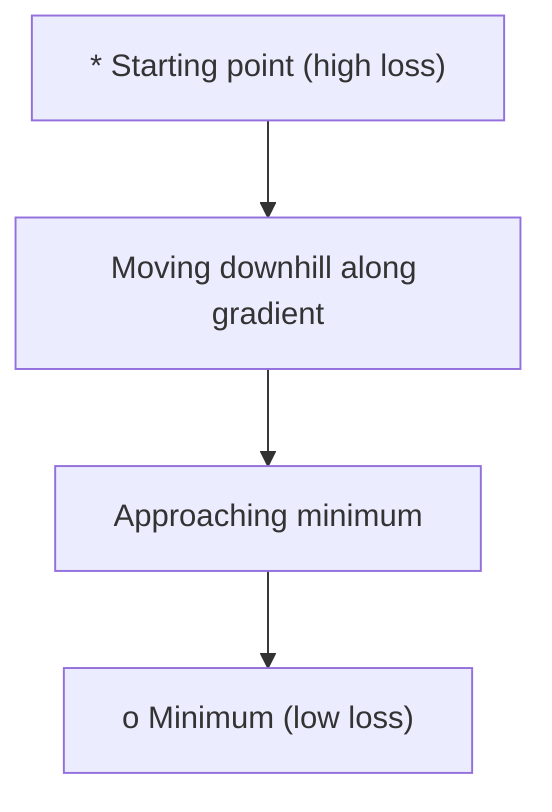
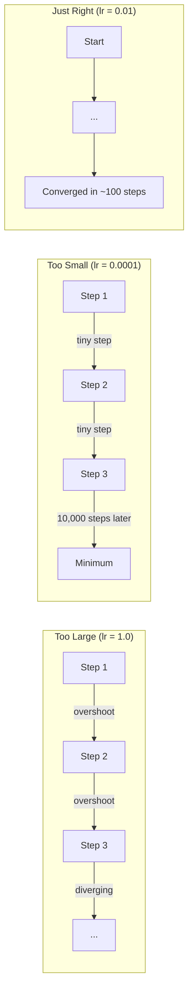
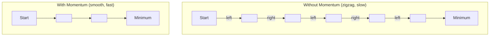
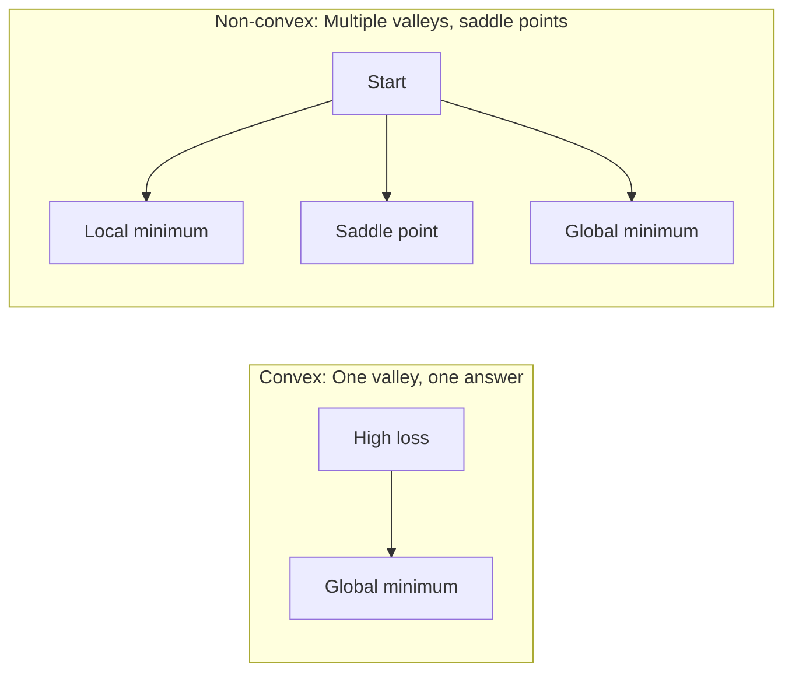
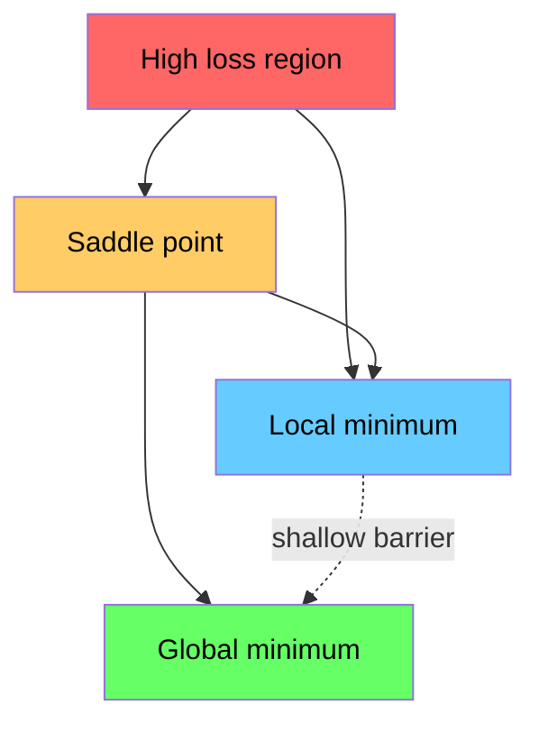

# 最优化

> 训练神经网络无非就是找到山谷的最低点。

**类型：** Build
**语言：** Python
**前置课程：** Phase 1, Lessons 04-05（导数、梯度）
**时间：** 约 75 分钟

## 学习目标

- 从零实现 vanilla gradient descent、SGD with momentum 和 Adam
- 在 Rosenbrock 函数上比较优化器的收敛性，并解释为什么 Adam 能为每个权重自适应学习率
- 区分凸和非凸 loss landscape，并解释鞍点在高维空间中的作用
- 配置学习率调度（step decay、cosine annealing、warmup）以保证训练稳定性

## 问题

你有一个 loss 函数。它告诉你模型错得有多离谱。你有 gradient。它告诉你哪个方向会让 loss 变得更糟。现在你需要一个下山的策略。

最朴素的方法很简单：沿梯度反方向移动。用一个叫学习率的数来缩放步长。重复。这就是 gradient descent，它能用。但"能用"有很多附加条件。学习率太大，你会直接飞过山谷，在两壁之间弹跳。太小，你会花几千步不必要地爬向答案。碰到鞍点，你会停下来，即使你还没找到最小值。

深度学习中的每个优化器都在回答同一个问题：如何更快、更可靠地到达谷底？

## 概念

### 最优化的含义

最优化就是找到使函数最小化（或最大化）的输入值。在机器学习中，函数是 loss，输入是模型的权重。训练就是最优化。

```
minimize L(w) where:
  L = loss function
  w = model weights (could be millions of parameters)
```

### Gradient descent（vanilla）

最简单的优化器。计算 loss 对每个权重的梯度。将每个权重沿梯度反方向移动。用学习率缩放步长。

```
w = w - lr * gradient
```

这就是整个算法。一行。



### 学习率：最重要的超参数

学习率控制步长。它决定了收敛的一切。



没有公式能告诉你正确的学习率。你通过实验找到它。常见起点：Adam 用 0.001，SGD with momentum 用 0.01。

### SGD vs batch vs mini-batch

Vanilla gradient descent 在整个数据集上计算梯度后才走一步。这叫 batch gradient descent。稳定但慢。

Stochastic gradient descent (SGD) 在单个随机样本上计算梯度并立即更新。噪声大但快。

Mini-batch gradient descent 折中。在一小批数据（32、64、128、256 个样本）上计算梯度，然后更新。这是大家实际使用的方式。

| 变体 | Batch 大小 | 梯度质量 | 每步速度 | 噪声 |
|------|-----------|----------|----------|------|
| Batch GD | 整个数据集 | 精确 | 慢 | 无 |
| SGD | 1 个样本 | 非常嘈杂 | 快 | 高 |
| Mini-batch | 32-256 | 良好估计 | 均衡 | 适中 |

SGD 和 mini-batch 中的噪声不是 bug。它帮助逃离浅的局部最小值和鞍点。

### Momentum：滚下山的球

Vanilla gradient descent 只看当前梯度。如果梯度来回震荡（在窄谷中很常见），进展就很慢。Momentum 通过将过去的梯度累积到一个速度项来解决这个问题。

```
v = beta * v + gradient
w = w - lr * v
```

类比：一个滚下山的球。它不会在每个颠簸处停下来重新启动。它在一致的方向上积累速度，并抑制振荡。



`beta`（通常 0.9）控制保留多少历史。更高的 beta 意味着更多动量、更平滑的路径，但对方向变化的响应更慢。

### Adam：自适应学习率

不同的权重需要不同的学习率。一个很少获得大梯度的权重，在终于获得时应该走更大的步。一个持续获得巨大梯度的权重应该走更小的步。

Adam (Adaptive Moment Estimation) 为每个权重跟踪两个量：

1. 一阶矩 (m)：梯度的滑动平均（类似 momentum）
2. 二阶矩 (v)：梯度平方的滑动平均（梯度幅度）

```
m = beta1 * m + (1 - beta1) * gradient
v = beta2 * v + (1 - beta2) * gradient^2

m_hat = m / (1 - beta1^t)    bias correction
v_hat = v / (1 - beta2^t)    bias correction

w = w - lr * m_hat / (sqrt(v_hat) + epsilon)
```

除以 `sqrt(v_hat)` 是关键洞察。梯度大的权重被一个大数除（有效步长小）。梯度小的权重被一个小数除（有效步长大）。每个权重获得自己的自适应学习率。

默认超参数：`lr=0.001, beta1=0.9, beta2=0.999, epsilon=1e-8`。这些默认值对大多数问题都效果不错。

### 学习率调度

固定学习率是一种折中。训练早期，你想要大步快速前进。训练后期，你想要小步在最小值附近精调。

常见调度：

| 调度 | 公式 | 使用场景 |
|------|------|----------|
| Step decay | lr = lr * factor every N epochs | 简单，手动控制 |
| Exponential decay | lr = lr_0 * decay^t | 平滑衰减 |
| Cosine annealing | lr = lr_min + 0.5 * (lr_max - lr_min) * (1 + cos(pi * t / T)) | Transformer，现代训练 |
| Warmup + decay | 线性升温，然后衰减 | 大模型，防止早期不稳定 |

### 凸 vs 非凸

凸函数只有一个最小值。Gradient descent 总能找到它。像 `f(x) = x^2` 这样的二次函数是凸的。

神经网络的 loss 函数是非凸的。它们有很多局部最小值、鞍点和平坦区域。



在实践中，高维神经网络中的局部最小值很少是问题。大多数局部最小值的 loss 值接近全局最小值。鞍点（某些方向平坦，其他方向弯曲）才是真正的障碍。Momentum 和 mini-batch 的噪声帮助逃离它们。

### Loss landscape 可视化

Loss 是所有权重的函数。对于一个有 100 万权重的模型，loss landscape 存在于 1,000,001 维空间中。我们通过在权重空间中选择两个随机方向并沿这些方向绘制 loss 来可视化它，产生一个 2D 曲面。



尖锐的最小值泛化差。平坦的最小值泛化好。这是 SGD with momentum 在最终测试精度上经常优于 Adam 的原因之一：它的噪声防止落入尖锐最小值。

## 动手构建

### Step 1：定义测试函数

Rosenbrock 函数是经典的最优化基准。它的最小值在 (1, 1)，位于一个容易找到但难以跟随的窄弯曲山谷内。

```
f(x, y) = (1 - x)^2 + 100 * (y - x^2)^2
```

```python
def rosenbrock(params):
    x, y = params
    return (1 - x) ** 2 + 100 * (y - x ** 2) ** 2

def rosenbrock_gradient(params):
    x, y = params
    df_dx = -2 * (1 - x) + 200 * (y - x ** 2) * (-2 * x)
    df_dy = 200 * (y - x ** 2)
    return [df_dx, df_dy]
```

### Step 2：Vanilla gradient descent

```python
class GradientDescent:
    def __init__(self, lr=0.001):
        self.lr = lr

    def step(self, params, grads):
        return [p - self.lr * g for p, g in zip(params, grads)]
```

### Step 3：SGD with momentum

```python
class SGDMomentum:
    def __init__(self, lr=0.001, momentum=0.9):
        self.lr = lr
        self.momentum = momentum
        self.velocity = None

    def step(self, params, grads):
        if self.velocity is None:
            self.velocity = [0.0] * len(params)
        self.velocity = [
            self.momentum * v + g
            for v, g in zip(self.velocity, grads)
        ]
        return [p - self.lr * v for p, v in zip(params, self.velocity)]
```

### Step 4：Adam

```python
class Adam:
    def __init__(self, lr=0.001, beta1=0.9, beta2=0.999, epsilon=1e-8):
        self.lr = lr
        self.beta1 = beta1
        self.beta2 = beta2
        self.epsilon = epsilon
        self.m = None
        self.v = None
        self.t = 0

    def step(self, params, grads):
        if self.m is None:
            self.m = [0.0] * len(params)
            self.v = [0.0] * len(params)

        self.t += 1

        self.m = [
            self.beta1 * m + (1 - self.beta1) * g
            for m, g in zip(self.m, grads)
        ]
        self.v = [
            self.beta2 * v + (1 - self.beta2) * g ** 2
            for v, g in zip(self.v, grads)
        ]

        m_hat = [m / (1 - self.beta1 ** self.t) for m in self.m]
        v_hat = [v / (1 - self.beta2 ** self.t) for v in self.v]

        return [
            p - self.lr * mh / (vh ** 0.5 + self.epsilon)
            for p, mh, vh in zip(params, m_hat, v_hat)
        ]
```

### Step 5：运行并比较

```python
def optimize(optimizer, func, grad_func, start, steps=5000):
    params = list(start)
    history = [params[:]]
    for _ in range(steps):
        grads = grad_func(params)
        params = optimizer.step(params, grads)
        history.append(params[:])
    return history

start = [-1.0, 1.0]

gd_history = optimize(GradientDescent(lr=0.0005), rosenbrock, rosenbrock_gradient, start)
sgd_history = optimize(SGDMomentum(lr=0.0001, momentum=0.9), rosenbrock, rosenbrock_gradient, start)
adam_history = optimize(Adam(lr=0.01), rosenbrock, rosenbrock_gradient, start)

for name, history in [("GD", gd_history), ("SGD+M", sgd_history), ("Adam", adam_history)]:
    final = history[-1]
    loss = rosenbrock(final)
    print(f"{name:6s} -> x={final[0]:.6f}, y={final[1]:.6f}, loss={loss:.8f}")
```

预期输出：Adam 收敛最快。SGD with momentum 走更平滑的路径。Vanilla GD 在窄谷中缓慢前进。

## 实际使用

实践中使用 PyTorch 或 JAX 的优化器。它们处理参数组、weight decay、gradient clipping 和 GPU 加速。

```python
import torch

model = torch.nn.Linear(784, 10)

sgd = torch.optim.SGD(model.parameters(), lr=0.01, momentum=0.9)
adam = torch.optim.Adam(model.parameters(), lr=0.001)
adamw = torch.optim.AdamW(model.parameters(), lr=0.001, weight_decay=0.01)

scheduler = torch.optim.lr_scheduler.CosineAnnealingLR(adam, T_max=100)
```

经验法则：

- 从 Adam (lr=0.001) 开始。它对大多数问题无需调参就能工作。
- 当你需要最佳最终精度且能承受更多调参时，切换到 SGD with momentum (lr=0.01, momentum=0.9)。
- 对 transformer 使用 AdamW（带解耦 weight decay 的 Adam）。
- 对于超过几个 epoch 的训练，始终使用学习率调度。
- 如果训练不稳定，降低学习率。如果训练太慢，提高学习率。

## 交付

本课产出一个选择正确优化器的 prompt。见 `outputs/prompt-optimizer-guide.md`。

这里构建的优化器类会在 Phase 3 从零训练神经网络时再次出现。

## 练习

1. **学习率扫描。** 用学习率 [0.0001, 0.0005, 0.001, 0.005, 0.01] 在 Rosenbrock 函数上运行 vanilla gradient descent。绘制或打印 5000 步后每个学习率的最终 loss。找到仍能收敛的最大学习率。

2. **Momentum 比较。** 用 momentum 值 [0.0, 0.5, 0.9, 0.99] 在 Rosenbrock 函数上运行 SGD。跟踪每步的 loss。哪个 momentum 值收敛最快？哪个会过冲？

3. **鞍点逃逸。** 定义函数 `f(x, y) = x^2 - y^2`（原点处有鞍点）。从 (0.01, 0.01) 开始。比较 vanilla GD、SGD with momentum 和 Adam 的行为。哪个能逃离鞍点？

4. **实现学习率衰减。** 给 GradientDescent 类添加指数衰减调度：`lr = lr_0 * 0.999^step`。在 Rosenbrock 函数上比较有无衰减的收敛情况。

## 关键术语

| 术语 | 通俗说法 | 实际含义 |
|------|----------|----------|
| Gradient descent | "往下走" | 用梯度乘以学习率来更新权重。最基本的优化器。 |
| Learning rate | "步长" | 控制每次更新移动权重多远的标量。太大导致发散。太小浪费算力。 |
| Momentum | "继续滚" | 将过去的梯度累积到速度向量中。抑制振荡并加速在一致方向上的移动。 |
| SGD | "随机采样" | Stochastic gradient descent。在随机子集上计算梯度而非整个数据集。实践中几乎总是指 mini-batch SGD。 |
| Mini-batch | "一小块数据" | 训练数据的小子集（32-256 个样本），用于估计梯度。平衡速度和梯度精度。 |
| Adam | "默认优化器" | Adaptive Moment Estimation。跟踪每个权重的梯度和梯度平方的滑动平均，给每个权重自己的学习率。 |
| Bias correction | "修复冷启动" | Adam 的一阶和二阶矩初始化为零。Bias correction 在早期步骤中除以 (1 - beta^t) 来补偿。 |
| Learning rate schedule | "随时间改变 lr" | 在训练过程中调整学习率的函数。早期大步，后期小步。 |
| Convex function | "一个山谷" | 任何局部最小值都是全局最小值的函数。Gradient descent 总能找到它。神经网络的 loss 不是凸的。 |
| Saddle point | "平坦但不是最小值" | 梯度为零但在某些方向是最小值、其他方向是最大值的点。在高维中很常见。 |
| Loss landscape | "地形" | Loss 函数在权重空间上的图。通过沿两个随机方向切片来可视化。 |
| Convergence | "到达了" | 优化器已到达进一步步骤不会显著降低 loss 的点。 |

## 延伸阅读

- [Sebastian Ruder: An overview of gradient descent optimization algorithms](https://ruder.io/optimizing-gradient-descent/) - 所有主要优化器的全面综述
- [Why Momentum Really Works (Distill)](https://distill.pub/2017/momentum/) - momentum 动力学的交互式可视化
- [Adam: A Method for Stochastic Optimization (Kingma & Ba, 2014)](https://arxiv.org/abs/1412.6980) - 原始 Adam 论文，可读且简短
- [Visualizing the Loss Landscape of Neural Nets (Li et al., 2018)](https://arxiv.org/abs/1712.09913) - 展示尖锐 vs 平坦最小值的论文
