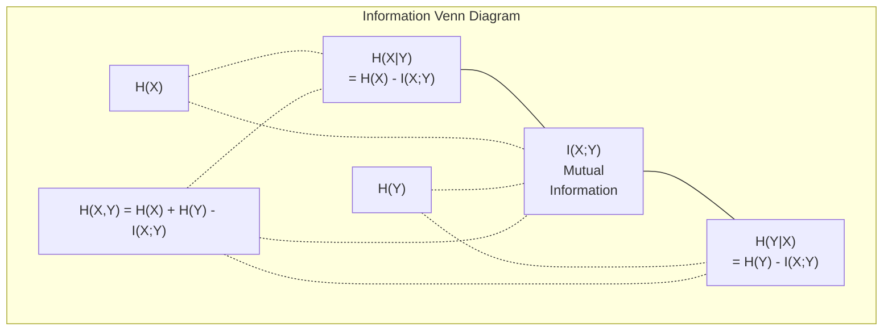

# 信息论

> 信息论度量惊讶程度。Loss 函数就建立在它之上。

**类型：** Learn
**语言：** Python
**前置课程：** Phase 1, Lesson 06（概率）
**时间：** 约 60 分钟

## 学习目标

- 从零计算 entropy、cross-entropy 和 KL divergence，并解释它们之间的关系
- 推导为什么最小化 cross-entropy loss 等价于最大化 log-likelihood
- 计算特征与目标之间的 mutual information 来排序特征重要性
- 解释 perplexity 作为语言模型从中选择的有效词表大小

## 问题

你在每个分类模型中都调用 `CrossEntropyLoss()`。你在每篇语言模型论文中都看到 "perplexity"。你在 VAE、蒸馏和 RLHF 中读到 KL divergence。这些不是互不相关的概念。它们都是同一个想法戴着不同的帽子。

信息论给你提供了推理不确定性、压缩和预测的语言。Claude Shannon 在 1948 年发明了它来解决通信问题。结果发现，训练神经网络就是一个通信问题：模型试图通过学到的权重这个噪声信道来传输正确的标签。

本课从零构建每个公式，让你看到它们从哪里来、为什么有效。

## 概念

### 信息量（惊讶度）

当不太可能的事情发生时，它携带更多信息。硬币正面朝上？不惊讶。中彩票？非常惊讶。

概率为 p 的事件的信息量是：

```
I(x) = -log(p(x))
```

用以 2 为底的对数得到 bits。用自然对数得到 nats。同样的想法，不同的单位。

```
Event              Probability    Surprise (bits)
Fair coin heads    0.5            1.0
Rolling a 6        0.167          2.58
1-in-1000 event    0.001          9.97
Certain event      1.0            0.0
```

确定事件携带零信息。你已经知道它会发生。

### Entropy（平均惊讶度）

Entropy 是一个分布所有可能结果的期望惊讶度。

```
H(P) = -sum( p(x) * log(p(x)) )  for all x
```

公平硬币对二元变量有最大 entropy：1 bit。偏置硬币（99% 正面）entropy 很低：0.08 bits。你已经知道会发生什么，所以每次翻转几乎不告诉你任何信息。

```
Fair coin:    H = -(0.5 * log2(0.5) + 0.5 * log2(0.5)) = 1.0 bit
Biased coin:  H = -(0.99 * log2(0.99) + 0.01 * log2(0.01)) = 0.08 bits
```

Entropy 度量分布中不可约的不确定性。你无法压缩到比它更低。

### Cross-Entropy（你每天都在用的 Loss 函数）

Cross-entropy 度量当你用分布 Q 来编码实际来自分布 P 的事件时的平均惊讶度。

```
H(P, Q) = -sum( p(x) * log(q(x)) )  for all x
```

P 是真实分布（标签）。Q 是你模型的预测。如果 Q 完美匹配 P，cross-entropy 等于 entropy。任何不匹配都会使它变大。

在分类中，P 是 one-hot vector（真实类别概率为 1，其他为 0）。这将 cross-entropy 简化为：

```
H(P, Q) = -log(q(true_class))
```

这就是分类的整个 cross-entropy loss 公式。最大化对正确类别的预测概率。

### KL Divergence（分布之间的距离）

KL divergence 度量用 Q 代替 P 时你多获得了多少额外惊讶。

```
D_KL(P || Q) = sum( p(x) * log(p(x) / q(x)) )  for all x
             = H(P, Q) - H(P)
```

Cross-entropy 等于 entropy 加 KL divergence。由于真实分布的 entropy 在训练过程中是常数，最小化 cross-entropy 等同于最小化 KL divergence。你在把模型的分布推向真实分布。

KL divergence 不是对称的：D_KL(P || Q) != D_KL(Q || P)。它不是真正的距离度量。

### Mutual Information

Mutual information 度量知道一个变量能告诉你关于另一个变量多少信息。

```
I(X; Y) = H(X) - H(X|Y)
        = H(X) + H(Y) - H(X, Y)
```

如果 X 和 Y 独立，mutual information 为零。知道一个对另一个没有任何帮助。如果它们完全相关，mutual information 等于任一变量的 entropy。

在特征选择中，特征与目标之间的高 mutual information 意味着该特征有用。低 mutual information 意味着它是噪声。

### 条件 Entropy

H(Y|X) 度量观察到 X 后，关于 Y 还剩多少不确定性。

```
H(Y|X) = H(X,Y) - H(X)
```

两个极端：
- 如果 X 完全决定 Y，则 H(Y|X) = 0。知道 X 消除了关于 Y 的所有不确定性。例如：X = 摄氏温度，Y = 华氏温度。
- 如果 X 对 Y 没有任何帮助，则 H(Y|X) = H(Y)。知道 X 完全不减少你的不确定性。例如：X = 抛硬币结果，Y = 明天的天气。

条件 entropy 总是非负的，且不超过 H(Y)：

```
0 <= H(Y|X) <= H(Y)
```

在机器学习中，条件 entropy 出现在决策树中。在每次分裂时，算法选择使 H(Y|X) 最小的特征 X——即移除关于标签 Y 最多不确定性的特征。

### 联合 Entropy

H(X,Y) 是 X 和 Y 联合分布的 entropy。

```
H(X,Y) = -sum sum p(x,y) * log(p(x,y))   for all x, y
```

关键性质：

```
H(X,Y) <= H(X) + H(Y)
```

当 X 和 Y 独立时等号成立。如果它们共享信息，联合 entropy 小于各自 entropy 之和。"缺失"的 entropy 恰好就是 mutual information。



关系：
- H(X,Y) = H(X) + H(Y|X) = H(Y) + H(X|Y)
- I(X;Y) = H(X) - H(X|Y) = H(Y) - H(Y|X)
- H(X,Y) = H(X) + H(Y) - I(X;Y)

### Mutual Information（深入）

Mutual information I(X;Y) 量化知道一个变量能减少多少关于另一个变量的不确定性。

```
I(X;Y) = H(X) - H(X|Y)
       = H(Y) - H(Y|X)
       = H(X) + H(Y) - H(X,Y)
       = sum sum p(x,y) * log(p(x,y) / (p(x) * p(y)))
```

性质：
- I(X;Y) >= 0 总是成立。观察某事物永远不会丢失信息。
- I(X;Y) = 0 当且仅当 X 和 Y 独立。
- I(X;Y) = I(Y;X)。它是对称的，不像 KL divergence。
- I(X;X) = H(X)。一个变量与自身共享所有信息。

**用 Mutual information 做特征选择。** 在 ML 中，你想要对目标有信息量的特征。Mutual information 给你一种有原则的方式来排序特征：

1. 对每个特征 X_i，计算 I(X_i; Y)，其中 Y 是目标变量。
2. 按 MI 分数排序特征。
3. 保留前 k 个特征。

这对特征和目标之间的任何关系都有效——线性、非线性、单调或非单调。相关系数只能捕捉线性关系。MI 能捕捉一切。

| 方法 | 检测 | 计算成本 | 处理分类变量？ |
|------|------|----------|---------------|
| Pearson correlation | 线性关系 | O(n) | 否 |
| Spearman correlation | 单调关系 | O(n log n) | 否 |
| Mutual information | 任何统计依赖 | O(n log n) with binning | 是 |

### Label Smoothing 与 Cross-Entropy

标准分类使用硬目标：[0, 0, 1, 0]。真实类别概率为 1，其他为 0。Label smoothing 用软目标替换：

```
soft_target = (1 - epsilon) * hard_target + epsilon / num_classes
```

epsilon = 0.1，4 个类别时：
- 硬目标：[0, 0, 1, 0]
- 软目标：[0.025, 0.025, 0.925, 0.025]

从信息论角度看，label smoothing 增加了目标分布的 entropy。硬 one-hot 目标的 entropy 为 0——没有不确定性。软目标有正的 entropy。

为什么这有帮助：
- 防止模型将 logits 推向极端值（在 cross-entropy 下完美匹配 one-hot 目标需要无穷大的 logits）
- 起正则化作用：模型不能 100% 自信
- 改善校准：预测概率更好地反映真实不确定性
- 减少训练和推理行为之间的差距

带 label smoothing 的 cross-entropy loss 变为：

```
L = (1 - epsilon) * CE(hard_target, prediction) + epsilon * H_uniform(prediction)
```

第二项惩罚远离均匀分布的预测——对置信度的直接正则化。

### 为什么 Cross-Entropy 是分类 Loss

三个视角，同一个结论。

**信息论视角。** Cross-entropy 度量你用模型的分布代替真实分布时浪费了多少 bits。最小化它使你的模型成为现实最高效的编码器。

**最大似然视角。** 对于 N 个训练样本，真实类别为 y_i：

```
Likelihood     = product( q(y_i) )
Log-likelihood = sum( log(q(y_i)) )
Negative log-likelihood = -sum( log(q(y_i)) )
```

最后一行就是 cross-entropy loss。最小化 cross-entropy = 最大化训练数据在你模型下的似然。

**梯度视角。** Cross-entropy 对 logits 的梯度就是 (predicted - true)。干净、稳定、计算快。这就是它与 softmax 完美配对的原因。

### Bits vs Nats

唯一的区别是对数底数。

```
log base 2   -> bits      (信息论传统)
log base e   -> nats      (机器学习惯例)
log base 10  -> hartleys  (很少使用)
```

1 nat = 1/ln(2) bits = 1.4427 bits。PyTorch 和 TensorFlow 默认使用自然对数（nats）。

### Perplexity

Perplexity 是 cross-entropy 的指数。它告诉你模型在多少个等概率选项之间犹豫不决。

```
Perplexity = 2^H(P,Q)   (if using bits)
Perplexity = e^H(P,Q)   (if using nats)
```

perplexity 为 50 的语言模型，平均来说就像要从 50 个可能的下一个 token 中均匀选择一样困惑。越低越好。

GPT-2 在常见基准上达到了约 30 的 perplexity。现代模型在充分覆盖的领域中已经是个位数。

## 动手构建

### Step 1：信息量和 entropy

```python
import math

def information_content(p, base=2):
    if p <= 0 or p > 1:
        return float('inf') if p <= 0 else 0.0
    return -math.log(p) / math.log(base)

def entropy(probs, base=2):
    return sum(
        p * information_content(p, base)
        for p in probs if p > 0
    )

fair_coin = [0.5, 0.5]
biased_coin = [0.99, 0.01]
fair_die = [1/6] * 6

print(f"Fair coin entropy:   {entropy(fair_coin):.4f} bits")
print(f"Biased coin entropy: {entropy(biased_coin):.4f} bits")
print(f"Fair die entropy:    {entropy(fair_die):.4f} bits")
```

### Step 2：Cross-entropy 和 KL divergence

```python
def cross_entropy(p, q, base=2):
    total = 0.0
    for pi, qi in zip(p, q):
        if pi > 0:
            if qi <= 0:
                return float('inf')
            total += pi * (-math.log(qi) / math.log(base))
    return total

def kl_divergence(p, q, base=2):
    return cross_entropy(p, q, base) - entropy(p, base)

true_dist = [0.7, 0.2, 0.1]
good_model = [0.6, 0.25, 0.15]
bad_model = [0.1, 0.1, 0.8]

print(f"Entropy of true dist:     {entropy(true_dist):.4f} bits")
print(f"CE (good model):          {cross_entropy(true_dist, good_model):.4f} bits")
print(f"CE (bad model):           {cross_entropy(true_dist, bad_model):.4f} bits")
print(f"KL divergence (good):     {kl_divergence(true_dist, good_model):.4f} bits")
print(f"KL divergence (bad):      {kl_divergence(true_dist, bad_model):.4f} bits")
```

### Step 3：Cross-entropy 作为分类 loss

```python
def softmax(logits):
    max_logit = max(logits)
    exps = [math.exp(z - max_logit) for z in logits]
    total = sum(exps)
    return [e / total for e in exps]

def cross_entropy_loss(true_class, logits):
    probs = softmax(logits)
    return -math.log(probs[true_class])

logits = [2.0, 1.0, 0.1]
true_class = 0

probs = softmax(logits)
loss = cross_entropy_loss(true_class, logits)

print(f"Logits:      {logits}")
print(f"Softmax:     {[f'{p:.4f}' for p in probs]}")
print(f"True class:  {true_class}")
print(f"Loss:        {loss:.4f} nats")
print(f"Perplexity:  {math.exp(loss):.2f}")
```

### Step 4：Cross-entropy 等于 negative log-likelihood

```python
import random

random.seed(42)

n_samples = 1000
n_classes = 3
true_labels = [random.randint(0, n_classes - 1) for _ in range(n_samples)]
model_logits = [[random.gauss(0, 1) for _ in range(n_classes)] for _ in range(n_samples)]

ce_loss = sum(
    cross_entropy_loss(label, logits)
    for label, logits in zip(true_labels, model_logits)
) / n_samples

nll = -sum(
    math.log(softmax(logits)[label])
    for label, logits in zip(true_labels, model_logits)
) / n_samples

print(f"Cross-entropy loss:      {ce_loss:.6f}")
print(f"Negative log-likelihood: {nll:.6f}")
print(f"Difference:              {abs(ce_loss - nll):.2e}")
```

### Step 5：Mutual information

```python
def mutual_information(joint_probs, base=2):
    rows = len(joint_probs)
    cols = len(joint_probs[0])

    margin_x = [sum(joint_probs[i][j] for j in range(cols)) for i in range(rows)]
    margin_y = [sum(joint_probs[i][j] for i in range(rows)) for j in range(cols)]

    mi = 0.0
    for i in range(rows):
        for j in range(cols):
            pxy = joint_probs[i][j]
            if pxy > 0:
                mi += pxy * math.log(pxy / (margin_x[i] * margin_y[j])) / math.log(base)
    return mi

independent = [[0.25, 0.25], [0.25, 0.25]]
dependent = [[0.45, 0.05], [0.05, 0.45]]

print(f"MI (independent): {mutual_information(independent):.4f} bits")
print(f"MI (dependent):   {mutual_information(dependent):.4f} bits")
```

## 实际使用

用 NumPy 实现同样的概念，这是你在实践中会用到的方式：

```python
import numpy as np

def np_entropy(p):
    p = np.asarray(p, dtype=float)
    mask = p > 0
    result = np.zeros_like(p)
    result[mask] = p[mask] * np.log(p[mask])
    return -result.sum()

def np_cross_entropy(p, q):
    p, q = np.asarray(p, dtype=float), np.asarray(q, dtype=float)
    mask = p > 0
    return -(p[mask] * np.log(q[mask])).sum()

def np_kl_divergence(p, q):
    return np_cross_entropy(p, q) - np_entropy(p)

true = np.array([0.7, 0.2, 0.1])
pred = np.array([0.6, 0.25, 0.15])
print(f"Entropy:    {np_entropy(true):.4f} nats")
print(f"Cross-ent:  {np_cross_entropy(true, pred):.4f} nats")
print(f"KL div:     {np_kl_divergence(true, pred):.4f} nats")
```

你从零构建了 `torch.nn.CrossEntropyLoss()` 内部做的事情。现在你知道为什么训练时 loss 会下降：你模型的预测分布正在接近真实分布，以浪费的信息 nats 来衡量。

## 练习

1. 假设均匀分布（26 个字母），计算英文字母表的 entropy。然后用实际字母频率估计它。哪个更高，为什么？

2. 一个模型对真实类别为 1 的样本输出 logits [5.0, 2.0, 0.5]。手动计算 cross-entropy loss，然后用你的 `cross_entropy_loss` 函数验证。什么 logits 会给出零 loss？

3. 证明 KL divergence 不是对称的。选择两个分布 P 和 Q，计算 D_KL(P || Q) 和 D_KL(Q || P)。解释为什么它们不同。

4. 构建一个计算 token 预测序列 perplexity 的函数。给定一个 (true_token_index, predicted_logits) 对的列表，返回序列的 perplexity。

## 关键术语

| 术语 | 通俗说法 | 实际含义 |
|------|----------|----------|
| Information content | "惊讶度" | 编码一个事件所需的 bits（或 nats）数：-log(p) |
| Entropy | "随机性" | 分布所有结果的平均惊讶度。度量不可约的不确定性。 |
| Cross-entropy | "那个 loss 函数" | 用模型分布 Q 编码来自真实分布 P 的事件时的平均惊讶度。 |
| KL divergence | "分布之间的距离" | 用 Q 代替 P 浪费的额外 bits。等于 cross-entropy 减去 entropy。不对称。 |
| Mutual information | "X 和 Y 有多相关" | 知道 Y 后关于 X 的不确定性减少量。为零意味着独立。 |
| Softmax | "把 logits 变成概率" | 取指数并归一化。将任意实值向量映射为有效的概率分布。 |
| Perplexity | "模型有多困惑" | Cross-entropy 的指数。模型在每步从中选择的有效词表大小。 |
| Bits | "Shannon 的单位" | 用以 2 为底的对数度量的信息。一个 bit 解决一次公平硬币翻转。 |
| Nats | "ML 的单位" | 用自然对数度量的信息。PyTorch 和 TensorFlow 默认使用。 |
| Negative log-likelihood | "NLL loss" | 对 one-hot 标签与 cross-entropy loss 完全相同。最小化它就是最大化正确预测的概率。 |

## 延伸阅读

- [Shannon 1948: A Mathematical Theory of Communication](https://people.math.harvard.edu/~ctm/home/text/others/shannon/entropy/entropy.pdf) - 原始论文，至今仍可读
- [Visual Information Theory (Chris Olah)](https://colah.github.io/posts/2015-09-Visual-Information/) - entropy 和 KL divergence 最好的可视化解释
- [PyTorch CrossEntropyLoss docs](https://pytorch.org/docs/stable/generated/torch.nn.CrossEntropyLoss.html) - 框架如何实现你刚刚构建的东西
