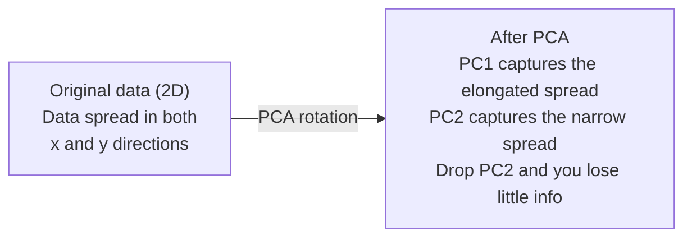

# 降维

> 高维数据有结构。你需要从正确的角度去发现它。

**类型：** Build
**语言：** Python
**前置课程：** Phase 1, Lessons 01（线性代数直觉）、02（向量与矩阵运算）、03（特征值与特征向量）、06（概率与分布）
**时间：** 约 90 分钟

## 学习目标

- 从零实现 PCA：中心化数据、计算协方差矩阵、特征分解、投影
- 使用 explained variance ratio 和肘部法则选择主成分数量
- 比较 PCA、t-SNE 和 UMAP 在 2D 可视化 MNIST 数字时的表现，并解释它们的权衡
- 使用 RBF kernel 的 kernel PCA 来分离标准 PCA 无法处理的非线性数据结构

## 问题

你有一个每个样本 784 个特征的数据集。也许是手写数字的像素值。也许是基因表达水平。也许是用户行为信号。你无法可视化 784 个维度。你无法绘制它们。你甚至无法思考它们。

但这 784 个特征中大多数是冗余的。实际信息存在于一个小得多的表面上。一个手写的 "7" 不需要 784 个独立数字来描述。它只需要几个：笔画的角度、横杠的长度、倾斜程度。其余的是噪声。

降维找到那个更小的表面。它把你的 784 维数据压缩到 2、10 或 50 维，同时保留重要的结构。

## 概念

### 维度灾难

高维空间是反直觉的。随着维度增长，三件事会崩溃。

**距离变得无意义。** 在高维中，任意两个随机点之间的距离趋向于相同的值。如果每个点与其他每个点的距离大致相同，最近邻搜索就失效了。

```
Dimension    Avg distance ratio (max/min between random points)
2            ~5.0
10           ~1.8
100          ~1.2
1000         ~1.02
```

**体积集中在角落。** d 维单位超立方体有 2^d 个角。在 100 维中，几乎所有体积都在角落里，远离中心。数据点散布到边缘，你的模型在内部缺乏数据。

**你需要指数级更多的数据。** 要在空间中保持相同的样本密度，从 2D 到 20D 意味着你需要 10^18 倍的数据。你永远不够。降维把数据密度带回可操作的水平。

### PCA：找到重要的方向

Principal Component Analysis (PCA) 找到数据变化最大的轴。它旋转你的坐标系，使第一个轴捕获最多方差，第二个捕获次多，依此类推。

算法：

```
1. Center the data        (subtract the mean from each feature)
2. Compute covariance     (how features move together)
3. Eigendecomposition     (find the principal directions)
4. Sort by eigenvalue     (biggest variance first)
5. Project               (keep top k eigenvectors, drop the rest)
```

为什么用特征分解？协方差矩阵是对称半正定的。它的 eigenvector 是特征空间中的正交方向。eigenvalue 告诉你每个方向捕获了多少方差。最大 eigenvalue 对应的 eigenvector 指向最大方差的方向。



- **PCA 之前：** 数据云沿 x 和 y 轴对角展开
- **PCA 之后：** 坐标系旋转，使 PC1 对齐最大方差方向（拉长的展开），PC2 对齐最小方差方向（窄的展开）
- **降维：** 丢弃 PC2 将数据投影到 PC1 上，损失很少信息

### Explained variance ratio

每个主成分捕获总方差的一个比例。Explained variance ratio 告诉你具体是多少。

```
Component    Eigenvalue    Explained ratio    Cumulative
PC1          4.73          0.473              0.473
PC2          2.51          0.251              0.724
PC3          1.12          0.112              0.836
PC4          0.89          0.089              0.925
...
```

当累积 explained variance 达到 0.95 时，你知道这些成分捕获了 95% 的信息。之后的大部分是噪声。

### 选择成分数量

三种策略：

1. **阈值法。** 保留足够的成分来解释 90-95% 的方差。
2. **肘部法则。** 绘制每个成分的 explained variance。寻找急剧下降点。
3. **下游性能。** 用 PCA 作为预处理。扫描 k 并测量模型精度。最佳 k 是精度趋于平稳的地方。

### t-SNE：保留邻域

t-Distributed Stochastic Neighbor Embedding (t-SNE) 专为可视化设计。它将高维数据映射到 2D（或 3D），同时保留哪些点彼此接近。

直觉：在原始空间中，基于点之间的距离计算点对的概率分布。近的点获得高概率。远的点获得低概率。然后找到一个 2D 排列，使相同的概率分布成立。在 784 维中是邻居的点在 2D 中仍然是邻居。

t-SNE 的关键特性：
- 非线性。它能展开 PCA 无法处理的复杂流形。
- 随机的。不同运行产生不同布局。
- Perplexity 参数控制考虑多少邻居（典型范围：5-50）。
- 输出中簇之间的距离没有意义。只有簇本身有意义。
- 在大数据集上慢。默认 O(n^2)。

### UMAP：更快，更好的全局结构

Uniform Manifold Approximation and Projection (UMAP) 与 t-SNE 类似但有两个优势：
- 更快。它使用近似最近邻图而不是计算所有成对距离。
- 更好的全局结构。输出中簇的相对位置往往比 t-SNE 更有意义。

UMAP 在高维空间中构建加权图（"模糊拓扑表示"），然后找到尽可能保留该图的低维布局。

关键参数：
- `n_neighbors`：多少邻居定义局部结构（类似 perplexity）。更高的值保留更多全局结构。
- `min_dist`：输出中点的紧密程度。更低的值创建更密集的簇。

### 何时使用哪种方法

| 方法 | 使用场景 | 保留 | 速度 |
|------|----------|------|------|
| PCA | 训练前预处理 | 全局方差 | 快（精确），可处理百万样本 |
| PCA | 快速探索性可视化 | 线性结构 | 快 |
| t-SNE | 出版质量的 2D 图 | 局部邻域 | 慢（< 10k 样本理想） |
| UMAP | 大规模 2D 可视化 | 局部 + 部分全局结构 | 中等（可处理百万） |
| PCA | 模型的特征降维 | 按方差排序的特征 | 快 |
| t-SNE / UMAP | 理解簇结构 | 簇分离 | 中等到慢 |

经验法则：用 PCA 做预处理和数据压缩。需要在 2D 中可视化结构时用 t-SNE 或 UMAP。

### Kernel PCA

标准 PCA 找线性子空间。它旋转坐标系并丢弃轴。但如果数据位于非线性流形上呢？2D 中的圆不能被任何直线分开。标准 PCA 帮不了。

Kernel PCA 在核函数诱导的高维特征空间中应用 PCA，而不显式计算该空间中的坐标。这就是 kernel trick——与 SVM 背后相同的思想。

算法：
1. 计算核矩阵 K，其中 K_ij = k(x_i, x_j)
2. 在特征空间中中心化核矩阵
3. 对中心化核矩阵做特征分解
4. 前几个 eigenvector（按 1/sqrt(eigenvalue) 缩放）就是投影

常见核函数：

| 核 | 公式 | 适用于 |
|----|------|--------|
| RBF (Gaussian) | exp(-gamma * \|\|x - y\|\|^2) | 大多数非线性数据，光滑流形 |
| Polynomial | (x . y + c)^d | 多项式关系 |
| Sigmoid | tanh(alpha * x . y + c) | 类神经网络映射 |

何时使用 kernel PCA vs 标准 PCA：

| 标准 | 标准 PCA | Kernel PCA |
|------|----------|------------|
| 数据结构 | 线性子空间 | 非线性流形 |
| 速度 | O(min(n^2 d, d^2 n)) | O(n^2 d + n^3) |
| 可解释性 | 成分是特征的线性组合 | 成分缺乏直接的特征解释 |
| 可扩展性 | 可处理百万样本 | 核矩阵是 n x n，受内存限制 |
| 重构 | 直接逆变换 | 需要 pre-image 近似 |

经典例子：2D 中的同心圆。两圈点，一个在另一个里面。标准 PCA 把两者投影到同一条线上——对分类没用。RBF kernel 的 Kernel PCA 将内圆和外圆映射到不同区域，使它们线性可分。

### 重构误差

你的降维有多好？你把 784 维压缩到了 50 维。你损失了什么？

测量重构误差：
1. 将数据投影到 k 维：X_reduced = X @ W_k
2. 重构：X_hat = X_reduced @ W_k^T
3. 计算 MSE：mean((X - X_hat)^2)

对于 PCA，重构误差与 explained variance 有清晰的关系：

```
Reconstruction error = sum of eigenvalues NOT included
Total variance = sum of ALL eigenvalues
Fraction lost = (sum of dropped eigenvalues) / (sum of all eigenvalues)
```

每个成分的 explained variance ratio 是：

```
explained_ratio_k = eigenvalue_k / sum(all eigenvalues)
```

绘制累积 explained variance 与成分数量的关系给你"肘部"曲线。正确的成分数量是：
- 曲线变平的地方（收益递减）
- 累积方差超过你的阈值的地方（通常 0.90 或 0.95）
- 下游任务性能趋于平稳的地方

重构误差的用途不止于选择 k。你可以用它做异常检测：重构误差高的样本是不符合学到的子空间的异常值。这是生产系统中基于 PCA 的异常检测的基础。

## 动手构建

### Step 1：从零实现 PCA

```python
import numpy as np

class PCA:
    def __init__(self, n_components):
        self.n_components = n_components
        self.components = None
        self.mean = None
        self.eigenvalues = None
        self.explained_variance_ratio_ = None

    def fit(self, X):
        self.mean = np.mean(X, axis=0)
        X_centered = X - self.mean

        cov_matrix = np.cov(X_centered, rowvar=False)

        eigenvalues, eigenvectors = np.linalg.eigh(cov_matrix)

        sorted_idx = np.argsort(eigenvalues)[::-1]
        eigenvalues = eigenvalues[sorted_idx]
        eigenvectors = eigenvectors[:, sorted_idx]

        self.components = eigenvectors[:, :self.n_components].T
        self.eigenvalues = eigenvalues[:self.n_components]
        total_var = np.sum(eigenvalues)
        self.explained_variance_ratio_ = self.eigenvalues / total_var

        return self

    def transform(self, X):
        X_centered = X - self.mean
        return X_centered @ self.components.T

    def fit_transform(self, X):
        self.fit(X)
        return self.transform(X)
```

### Step 2：在合成数据上测试

```python
np.random.seed(42)
n_samples = 500

t = np.random.uniform(0, 2 * np.pi, n_samples)
x1 = 3 * np.cos(t) + np.random.normal(0, 0.2, n_samples)
x2 = 3 * np.sin(t) + np.random.normal(0, 0.2, n_samples)
x3 = 0.5 * x1 + 0.3 * x2 + np.random.normal(0, 0.1, n_samples)

X_synthetic = np.column_stack([x1, x2, x3])

pca = PCA(n_components=2)
X_reduced = pca.fit_transform(X_synthetic)

print(f"Original shape: {X_synthetic.shape}")
print(f"Reduced shape:  {X_reduced.shape}")
print(f"Explained variance ratios: {pca.explained_variance_ratio_}")
print(f"Total variance captured: {sum(pca.explained_variance_ratio_):.4f}")
```

### Step 3：MNIST 数字的 2D 可视化

```python
from sklearn.datasets import fetch_openml

mnist = fetch_openml("mnist_784", version=1, as_frame=False, parser="auto")
X_mnist = mnist.data[:5000].astype(float)
y_mnist = mnist.target[:5000].astype(int)

pca_mnist = PCA(n_components=50)
X_pca50 = pca_mnist.fit_transform(X_mnist)
print(f"50 components capture {sum(pca_mnist.explained_variance_ratio_):.2%} of variance")

pca_2d = PCA(n_components=2)
X_pca2d = pca_2d.fit_transform(X_mnist)
print(f"2 components capture {sum(pca_2d.explained_variance_ratio_):.2%} of variance")
```

### Step 4：与 sklearn 比较

```python
from sklearn.decomposition import PCA as SklearnPCA
from sklearn.manifold import TSNE

sklearn_pca = SklearnPCA(n_components=2)
X_sklearn_pca = sklearn_pca.fit_transform(X_mnist)

print(f"\nOur PCA explained variance:     {pca_2d.explained_variance_ratio_}")
print(f"Sklearn PCA explained variance: {sklearn_pca.explained_variance_ratio_}")

diff = np.abs(np.abs(X_pca2d) - np.abs(X_sklearn_pca))
print(f"Max absolute difference: {diff.max():.10f}")

tsne = TSNE(n_components=2, perplexity=30, random_state=42)
X_tsne = tsne.fit_transform(X_mnist)
print(f"\nt-SNE output shape: {X_tsne.shape}")
```

### Step 5：UMAP 比较

```python
try:
    from umap import UMAP

    reducer = UMAP(n_components=2, n_neighbors=15, min_dist=0.1, random_state=42)
    X_umap = reducer.fit_transform(X_mnist)
    print(f"UMAP output shape: {X_umap.shape}")
except ImportError:
    print("Install umap-learn: pip install umap-learn")
```

## 实际使用

PCA 作为分类器前的预处理：

```python
from sklearn.decomposition import PCA as SklearnPCA
from sklearn.linear_model import LogisticRegression
from sklearn.model_selection import train_test_split
from sklearn.metrics import accuracy_score

X_train, X_test, y_train, y_test = train_test_split(
    X_mnist, y_mnist, test_size=0.2, random_state=42
)

results = {}
for k in [10, 30, 50, 100, 200]:
    pca_k = SklearnPCA(n_components=k)
    X_tr = pca_k.fit_transform(X_train)
    X_te = pca_k.transform(X_test)

    clf = LogisticRegression(max_iter=1000, random_state=42)
    clf.fit(X_tr, y_train)
    acc = accuracy_score(y_test, clf.predict(X_te))
    var_captured = sum(pca_k.explained_variance_ratio_)
    results[k] = (acc, var_captured)
    print(f"k={k:>3d}  accuracy={acc:.4f}  variance={var_captured:.4f}")
```

性能在远低于 784 维时就趋于平稳。那个平稳点就是你的工作点。

## 交付

本课产出：
- `outputs/skill-dimensionality-reduction.md` - 一个为给定任务选择正确降维技术的 skill

## 练习

1. 修改 PCA 类以支持 `inverse_transform`。从 10、50 和 200 个成分重构 MNIST 数字。打印每个的重构误差（与原始的均方差）。

2. 用 perplexity 值 5、30 和 100 在相同的 MNIST 子集上运行 t-SNE。描述输出如何变化。为什么 perplexity 影响簇的紧密度？

3. 取一个有 50 个特征但只有 5 个有信息量的数据集（用 `sklearn.datasets.make_classification` 生成）。应用 PCA 并检查 explained variance 曲线是否正确识别出数据实际上是 5 维的。

## 关键术语

| 术语 | 通俗说法 | 实际含义 |
|------|----------|----------|
| Curse of dimensionality | "特征太多" | 距离、体积和数据密度随维度增长都表现反直觉。模型需要指数级更多数据来补偿。 |
| PCA | "降维" | 旋转坐标系使轴对齐最大方差方向，然后丢弃低方差轴。 |
| Principal component | "一个重要方向" | 协方差矩阵的 eigenvector。特征空间中数据变化最大的方向。 |
| Explained variance ratio | "这个成分有多少信息" | 一个主成分捕获的总方差比例。对前 k 个比例求和看 k 个成分保留了多少。 |
| Covariance matrix | "特征如何相关" | 对称矩阵，(i,j) 项度量特征 i 和特征 j 如何一起变动。对角项是各自方差。 |
| t-SNE | "那个簇图" | 通过保留成对邻域概率将高维数据映射到 2D 的非线性方法。适合可视化，不适合预处理。 |
| UMAP | "更快的 t-SNE" | 基于拓扑数据分析的非线性方法。保留局部和部分全局结构。比 t-SNE 扩展性更好。 |
| Perplexity | "t-SNE 的旋钮" | 控制每个点考虑的有效邻居数。低 perplexity 关注非常局部的结构。高 perplexity 捕获更广泛的模式。 |
| Manifold | "数据所在的表面" | 嵌入在高维空间中的低维表面。在 3D 中揉皱的纸是 2D 流形。 |

## 延伸阅读

- [A Tutorial on Principal Component Analysis](https://arxiv.org/abs/1404.1100) (Shlens) - 从头清晰推导 PCA
- [How to Use t-SNE Effectively](https://distill.pub/2016/misread-tsne/) (Wattenberg et al.) - t-SNE 陷阱和参数选择的交互式指南
- [UMAP documentation](https://umap-learn.readthedocs.io/) - UMAP 作者的理论和实践指导
