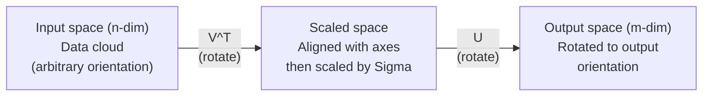
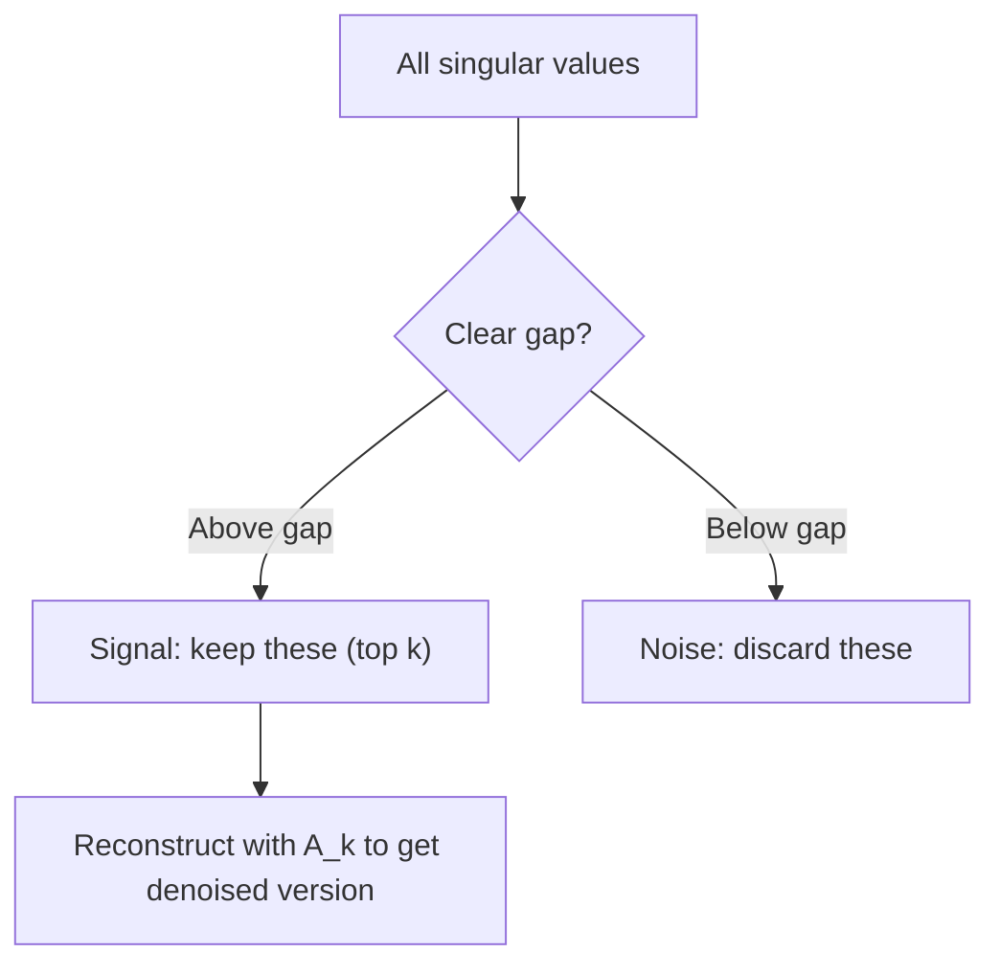

# Singular Value Decomposition

> SVD 是线性代数的瑞士军刀。每个矩阵都有一个 SVD，每个数据科学家都需要它。

**类型：** Build
**语言：** Python, Julia
**前置知识：** Phase 1, Lessons 01 (Linear Algebra Intuition), 02 (Vectors & Matrices Operations), 03 (Matrix Transformations)
**时长：** 约 120 分钟

## 学习目标

- 通过 power iteration 实现 SVD，并解释 U、Sigma 和 V^T 的几何意义
- 应用 truncated SVD 进行图像压缩，衡量压缩比与重构误差之间的权衡
- 通过 SVD 计算 Moore-Penrose pseudoinverse 来求解超定 least-squares 系统
- 把 SVD 与 PCA、推荐系统（latent factors）以及 NLP 中的 Latent Semantic Analysis 联系起来

## 问题背景

你手里有一个 1000x2000 的矩阵。它可能是用户对电影的评分，可能是文档-词频表，也可能是一张图像的像素值。你需要压缩它、去噪、发现其中的隐藏结构，或者用它来求解一个 least-squares 系统。Eigendecomposition 只对方阵有效，而且即使是方阵，也要求它有一组完整的线性无关 eigenvectors。

SVD 对任意矩阵都成立。任意形状，任意 rank，没有任何前置条件。它把矩阵分解成三个因子，揭示这个矩阵对空间所做的几何变换。它是整个线性代数中最通用、最有用的分解。

## 核心概念

### SVD 的几何含义

任意矩阵，无论形状如何，都依次执行三个操作：旋转、缩放、旋转。SVD 把这种分解明确写出来。

```
A = U * Sigma * V^T

      m x n     m x m    m x n    n x n
     (any)    (rotate)  (scale)  (rotate)
```

对于任意矩阵 A，SVD 把它分解成：
- V^T 在输入空间（n 维）中旋转向量
- Sigma 沿每条坐标轴进行缩放（拉伸或压缩）
- U 把结果旋转到输出空间（m 维）



可以这样理解：你把一个矩阵交给 SVD，它告诉你：“这个矩阵把一个输入球面，先用 V^T 旋转，再用 Sigma 拉伸成椭球，最后用 U 把椭球旋转到目标方向。” 那些 singular values 就是这个椭球各条主轴的长度。

### 完整分解形式

对于形状为 m x n 的矩阵 A：

```
A = U * Sigma * V^T

where:
  U     is m x m, orthogonal (U^T U = I)
  Sigma is m x n, diagonal (singular values on the diagonal)
  V     is n x n, orthogonal (V^T V = I)

The singular values sigma_1 >= sigma_2 >= ... >= sigma_r > 0
where r = rank(A)
```

U 的列称为 left singular vectors，V 的列称为 right singular vectors，Sigma 对角线上的元素称为 singular values。它们都是非负的，并且按惯例从大到小排列。

### Left singular vectors、singular values、right singular vectors

SVD 的每个组成部分都有独立的几何含义。

**Right singular vectors（V 的列）：** 它们构成输入空间 R^n 的一组正交单位基。它们是输入空间中那些被矩阵映射到输出空间正交方向的方向。把它们想象成定义域的天然坐标系。

**Singular values（Sigma 对角线）：** 这些是缩放因子。第 i 个 singular value 表示矩阵沿着第 i 个 right singular vector 把向量拉伸了多少。singular value 等于零意味着矩阵把这个方向完全压扁。

**Left singular vectors（U 的列）：** 它们构成输出空间 R^m 的一组正交单位基。第 i 个 left singular vector 是第 i 个 right singular vector 经过缩放后落到的输出方向。

它们之间的关系：

```
A * v_i = sigma_i * u_i

The matrix A takes the i-th right singular vector v_i,
scales it by sigma_i, and maps it to the i-th left singular vector u_i.
```

这给了你一个逐坐标的视角，看到任意矩阵到底在做什么。

### 外积形式

SVD 可以写成一组 rank-1 矩阵的和：

```
A = sigma_1 * u_1 * v_1^T + sigma_2 * u_2 * v_2^T + ... + sigma_r * u_r * v_r^T

Each term sigma_i * u_i * v_i^T is a rank-1 matrix (an outer product).
The full matrix is the sum of r such matrices, where r is the rank.
```

这个形式是低秩近似（low-rank approximation）的基石。每一项都给矩阵添加一层结构。第一项捕捉最重要的单一模式，第二项捕捉次要的模式，依此类推。截断这个求和，就得到任意 rank 下的最优近似。

```
Rank-1 approx:    A_1 = sigma_1 * u_1 * v_1^T
                  (captures the dominant pattern)

Rank-2 approx:    A_2 = sigma_1 * u_1 * v_1^T + sigma_2 * u_2 * v_2^T
                  (captures the two most important patterns)

Rank-k approx:    A_k = sum of top k terms
                  (optimal by the Eckart-Young theorem)
```

### 与 eigendecomposition 的关系

SVD 与 eigendecomposition 有深刻的联系。A 的 singular values 和 singular vectors 直接来自 A^T A 和 A A^T 的 eigenvalues 与 eigenvectors。

```
A^T A = V * Sigma^T * U^T * U * Sigma * V^T
      = V * Sigma^T * Sigma * V^T
      = V * D * V^T

where D = Sigma^T * Sigma is a diagonal matrix with sigma_i^2 on the diagonal.

So:
- The right singular vectors (V) are eigenvectors of A^T A
- The singular values squared (sigma_i^2) are eigenvalues of A^T A

Similarly:
A A^T = U * Sigma * V^T * V * Sigma^T * U^T
      = U * Sigma * Sigma^T * U^T

So:
- The left singular vectors (U) are eigenvectors of A A^T
- The eigenvalues of A A^T are also sigma_i^2
```

这种联系告诉你三件事：
1. Singular values 永远是实数且非负（它们是半正定矩阵 eigenvalues 的平方根）。
2. 你可以通过对 A^T A 做 eigendecomposition 来计算 SVD，但这会让 condition number 平方化，损失数值精度。专门的 SVD 算法会避开这种做法。
3. 当 A 是对称半正定方阵时，SVD 与 eigendecomposition 完全相同。

### Truncated SVD：低秩近似

Eckart-Young-Mirsky 定理指出，对 A 的最佳 rank-k 近似（无论在 Frobenius norm 还是 spectral norm 下）都是只保留前 k 个 singular values 及其对应向量后得到的：

```
A_k = U_k * Sigma_k * V_k^T

where:
  U_k     is m x k  (first k columns of U)
  Sigma_k is k x k  (top-left k x k block of Sigma)
  V_k     is n x k  (first k columns of V)

Approximation error = sigma_{k+1}  (in spectral norm)
                    = sqrt(sigma_{k+1}^2 + ... + sigma_r^2)  (in Frobenius norm)
```

这不只是“一个不错的”近似，它在数学上可被证明是 rank k 下最好的近似。没有其他 rank-k 矩阵比它更接近 A。

| Component | Relative magnitude | Kept in rank-3 approx? |
|-----------|-------------------|------------------------|
| sigma_1 | Largest | Yes |
| sigma_2 | Large | Yes |
| sigma_3 | Medium-large | Yes |
| sigma_4 | Medium | No (error) |
| sigma_5 | Medium-small | No (error) |
| sigma_6 | Small | No (error) |
| sigma_7 | Very small | No (error) |
| sigma_8 | Tiny | No (error) |

保留前 3 个：A_3 包含三个最大的 singular values，误差来自剩余值（sigma_4 到 sigma_8）。

如果 singular values 衰减得快，一个较小的 k 就能捕捉到矩阵的大部分信息。如果衰减得慢，说明矩阵没有低秩结构。

### 用 SVD 做图像压缩

灰度图就是一张像素强度组成的矩阵。一张 800x600 的图像有 480,000 个值。SVD 让你用远少于此的数字近似它。

```
Original image: 800 x 600 = 480,000 values

SVD with rank k:
  U_k:      800 x k values
  Sigma_k:  k values
  V_k:      600 x k values
  Total:    k * (800 + 600 + 1) = k * 1401 values

  k=10:   14,010 values   (2.9% of original)
  k=50:   70,050 values  (14.6% of original)
  k=100: 140,100 values  (29.2% of original)

  The compression ratio improves as k gets smaller,
  but visual quality degrades.
```

关键洞见：自然图像的 singular values 衰减得很快。前几个 singular values 抓住整体结构（形状、渐变），后面的捕捉细节和噪声。在 rank 50 处截断通常能得到看起来与原图几乎一致的图像，同时减少 85% 的存储。

### 用 SVD 做推荐系统

Netflix Prize 让这种用法广为人知。你有一个用户-电影评分矩阵，其中绝大多数项是缺失的。

```
             Movie1  Movie2  Movie3  Movie4  Movie5
  User1      [  5      ?       3       ?       1  ]
  User2      [  ?      4       ?       2       ?  ]
  User3      [  3      ?       5       ?       ?  ]
  User4      [  ?      ?       ?       4       3  ]

  ? = unknown rating
```

核心想法：这个评分矩阵是低秩的。用户的口味并非完全独立，背后只有少数几个 latent factors（动作还是剧情、新片还是老片、烧脑还是直接刺激）足以解释大部分偏好。

对（已填充的）评分矩阵做 SVD 分解，结果是：
- U：用户在 latent factor 空间中的画像
- Sigma：每个 latent factor 的重要程度
- V^T：电影在 latent factor 空间中的画像

某个用户对一部电影的预测评分，就是用户画像与电影画像的点积（再乘上 singular values 的权重）。低秩近似填补了缺失的项。

实际工程中，会用像 Simon Funk 的 incremental SVD 或 ALS（alternating least squares）这样的变体来直接处理缺失数据。但核心思路不变：通过 SVD 进行 latent factor 分解。

### NLP 中的 SVD：Latent Semantic Analysis

Latent Semantic Analysis（LSA），也叫 Latent Semantic Indexing（LSI），就是把 SVD 应用在词-文档矩阵上。

```
             Doc1   Doc2   Doc3   Doc4
  "cat"      [  3      0      1      0  ]
  "dog"      [  2      0      0      1  ]
  "fish"     [  0      4      1      0  ]
  "pet"      [  1      1      1      1  ]
  "ocean"    [  0      3      0      0  ]

After SVD with rank k=2:

  Each document becomes a point in 2D "concept space."
  Each term becomes a point in the same 2D space.
  Documents about similar topics cluster together.
  Terms with similar meanings cluster together.

  "cat" and "dog" end up near each other (land pets).
  "fish" and "ocean" end up near each other (water concepts).
  Doc1 and Doc3 cluster if they share similar topics.
```

LSA 是最早成功从原始文本中捕捉语义相似度的方法之一。它之所以能工作，是因为同义词倾向于出现在相似的文档中，于是 SVD 把它们归入同一个 latent 维度。现代 word embeddings（Word2Vec、GloVe）可以看作这一思想的后裔。

### 用 SVD 做去噪

噪声数据中的信号集中在前几个 singular values 上，而噪声分布在所有 singular values 上。截断可以去掉噪声底噪。

**干净信号的 singular values：**

| Component | Magnitude | Type |
|-----------|-----------|------|
| sigma_1 | Very large | Signal |
| sigma_2 | Large | Signal |
| sigma_3 | Medium | Signal |
| sigma_4 | Near zero | Negligible |
| sigma_5 | Near zero | Negligible |

**含噪信号的 singular values（噪声叠加到所有分量上）：**

| Component | Magnitude | Type |
|-----------|-----------|------|
| sigma_1 | Very large | Signal |
| sigma_2 | Large | Signal |
| sigma_3 | Medium | Signal |
| sigma_4 | Small | Noise |
| sigma_5 | Small | Noise |
| sigma_6 | Small | Noise |
| sigma_7 | Small | Noise |



这种方法被广泛用于信号处理、科学测量与数据清洗。任何被加性噪声污染的矩阵，truncated SVD 都是分离信号与噪声的有原则的做法。

### 通过 SVD 计算 pseudoinverse

Moore-Penrose pseudoinverse A+ 把矩阵求逆推广到非方阵和奇异矩阵。SVD 让计算它变得轻而易举。

```
If A = U * Sigma * V^T, then:

A+ = V * Sigma+ * U^T

where Sigma+ is formed by:
  1. Transpose Sigma (swap rows and columns)
  2. Replace each non-zero diagonal entry sigma_i with 1/sigma_i
  3. Leave zeros as zeros

For A (m x n):      A+ is (n x m)
For Sigma (m x n):  Sigma+ is (n x m)
```

Pseudoinverse 用来解 least-squares 问题。如果 Ax = b 没有精确解（超定系统），那么 x = A+ b 就是 least-squares 解（最小化 ||Ax - b||）。

```
Overdetermined system (more equations than unknowns):

  [1  1]         [3]
  [2  1] x   =   [5]       No exact solution exists.
  [3  1]         [6]

  x_ls = A+ b = V * Sigma+ * U^T * b

  This gives the x that minimizes the sum of squared residuals.
  Same result as the normal equations (A^T A)^(-1) A^T b,
  but numerically more stable.
```

### 数值稳定性优势

对 A^T A 做 eigendecomposition 会把 singular values 平方（A^T A 的 eigenvalues 就是 sigma_i^2），这也会让 condition number 平方化，放大数值误差。

```
Example:
  A has singular values [1000, 1, 0.001]
  Condition number of A: 1000 / 0.001 = 10^6

  A^T A has eigenvalues [10^6, 1, 10^{-6}]
  Condition number of A^T A: 10^6 / 10^{-6} = 10^{12}

  Computing SVD directly: works with condition number 10^6
  Computing via A^T A:     works with condition number 10^{12}
                           (6 extra digits of precision lost)
```

现代 SVD 算法（Golub-Kahan bidiagonalization）直接在 A 上工作，从不显式构造 A^T A。这就是为什么你应该始终选择 `np.linalg.svd(A)` 而不是 `np.linalg.eig(A.T @ A)`。

### 与 PCA 的关系

PCA 就是中心化数据上的 SVD。这不是类比，而是字面上的同一个计算。

```
Given data matrix X (n_samples x n_features), centered (mean subtracted):

Covariance matrix: C = (1/(n-1)) * X^T X

PCA finds eigenvectors of C. But:

  X = U * Sigma * V^T    (SVD of X)

  X^T X = V * Sigma^2 * V^T

  C = (1/(n-1)) * V * Sigma^2 * V^T

So the principal components are exactly the right singular vectors V.
The explained variance for each component is sigma_i^2 / (n-1).

In sklearn, PCA is implemented using SVD, not eigendecomposition.
It is faster and more numerically stable.
```

也就是说，你在 Lesson 10 学到的所有降维内容，底层其实都是 SVD。PCA 是 SVD 在机器学习中最常见的应用。

## 动手实现

### Step 1：用 power iteration 从零实现 SVD

思路：要找最大的 singular value 与对应向量，可以在 A^T A（或 A A^T）上做 power iteration。然后对矩阵做 deflation，再为下一个 singular value 重复同样的步骤。

```python
import numpy as np

def power_iteration(M, num_iters=100):
    n = M.shape[1]
    v = np.random.randn(n)
    v = v / np.linalg.norm(v)

    for _ in range(num_iters):
        Mv = M @ v
        v = Mv / np.linalg.norm(Mv)

    eigenvalue = v @ M @ v
    return eigenvalue, v

def svd_from_scratch(A, k=None):
    m, n = A.shape
    if k is None:
        k = min(m, n)

    sigmas = []
    us = []
    vs = []

    A_residual = A.copy().astype(float)

    for _ in range(k):
        AtA = A_residual.T @ A_residual
        eigenvalue, v = power_iteration(AtA, num_iters=200)

        if eigenvalue < 1e-10:
            break

        sigma = np.sqrt(eigenvalue)
        u = A_residual @ v / sigma

        sigmas.append(sigma)
        us.append(u)
        vs.append(v)

        A_residual = A_residual - sigma * np.outer(u, v)

    U = np.column_stack(us) if us else np.empty((m, 0))
    S = np.array(sigmas)
    V = np.column_stack(vs) if vs else np.empty((n, 0))

    return U, S, V
```

### Step 2：测试并与 NumPy 对比

```python
np.random.seed(42)
A = np.random.randn(5, 4)

U_ours, S_ours, V_ours = svd_from_scratch(A)
U_np, S_np, Vt_np = np.linalg.svd(A, full_matrices=False)

print("Our singular values:", np.round(S_ours, 4))
print("NumPy singular values:", np.round(S_np, 4))

A_reconstructed = U_ours @ np.diag(S_ours) @ V_ours.T
print(f"Reconstruction error: {np.linalg.norm(A - A_reconstructed):.8f}")
```

### Step 3：图像压缩演示

```python
def compress_image_svd(image_matrix, k):
    U, S, Vt = np.linalg.svd(image_matrix, full_matrices=False)
    compressed = U[:, :k] @ np.diag(S[:k]) @ Vt[:k, :]
    return compressed

image = np.random.seed(42)
rows, cols = 200, 300
image = np.random.randn(rows, cols)

for k in [1, 5, 10, 20, 50]:
    compressed = compress_image_svd(image, k)
    error = np.linalg.norm(image - compressed) / np.linalg.norm(image)
    original_size = rows * cols
    compressed_size = k * (rows + cols + 1)
    ratio = compressed_size / original_size
    print(f"k={k:>3d}  error={error:.4f}  storage={ratio:.1%}")
```

### Step 4：去噪

```python
np.random.seed(42)
clean = np.outer(np.sin(np.linspace(0, 4*np.pi, 100)),
                 np.cos(np.linspace(0, 2*np.pi, 80)))
noise = 0.3 * np.random.randn(100, 80)
noisy = clean + noise

U, S, Vt = np.linalg.svd(noisy, full_matrices=False)
denoised = U[:, :5] @ np.diag(S[:5]) @ Vt[:5, :]

print(f"Noisy error:    {np.linalg.norm(noisy - clean):.4f}")
print(f"Denoised error: {np.linalg.norm(denoised - clean):.4f}")
print(f"Improvement:    {(1 - np.linalg.norm(denoised - clean) / np.linalg.norm(noisy - clean)):.1%}")
```

### Step 5：Pseudoinverse

```python
A = np.array([[1, 1], [2, 1], [3, 1]], dtype=float)
b = np.array([3, 5, 6], dtype=float)

U, S, Vt = np.linalg.svd(A, full_matrices=False)
S_inv = np.diag(1.0 / S)
A_pinv = Vt.T @ S_inv @ U.T

x_svd = A_pinv @ b
x_lstsq = np.linalg.lstsq(A, b, rcond=None)[0]
x_pinv = np.linalg.pinv(A) @ b

print(f"SVD pseudoinverse solution:  {x_svd}")
print(f"np.linalg.lstsq solution:   {x_lstsq}")
print(f"np.linalg.pinv solution:    {x_pinv}")
```

## 实际运行

完整可运行的演示在 `code/svd.py`。运行它就能看到 SVD 在图像压缩、推荐系统、Latent Semantic Analysis 与去噪中的应用。

```bash
python svd.py
```

`code/svd.jl` 中的 Julia 版本用 Julia 原生的 `svd()` 函数和 `LinearAlgebra` 包演示了同样的概念。

```bash
julia svd.jl
```

## 交付产物

本课产出：
- `outputs/skill-svd.md` - 一份关于何时以及如何在真实项目中应用 SVD 的 skill

## 练习

1. 不使用 power iteration，从零实现完整的 SVD。改为对 A^T A 做 eigendecomposition 得到 V 与 singular values，再用 U = A V Sigma^{-1} 计算 U。把它的数值精度与你的 power iteration 版本以及 NumPy 进行对比。

2. 加载一张真实灰度图（或者把彩色图转灰度）。在 rank 1, 5, 10, 25, 50, 100 处分别压缩它。对每个 rank，计算压缩比和相对误差，找出图像在视觉上变得可接受的 rank。

3. 搭建一个迷你推荐系统。构造一个 10x8 的用户-电影评分矩阵，其中部分项已知。用每行的均值填补缺失项。计算 SVD 并重构 rank-3 近似。用重构后的矩阵预测缺失评分，验证预测结果是否合理。

4. 构造一个 100x50 的文档-词矩阵，包含 3 个合成主题。每个主题有 5 个相关词。加入噪声后做 SVD，验证前 3 个 singular values 显著大于其他值。把文档投影到 3D latent 空间，检查同一主题的文档是否聚到一起。

5. 生成一个干净的低秩矩阵（rank 3，大小 50x40），叠加不同强度的高斯噪声（sigma = 0.1, 0.5, 1.0, 2.0）。对每个噪声水平，把 k 从 1 扫到 40，根据相对干净矩阵的重构误差找出最优截断 rank。画出最优 k 随噪声水平的变化情况。

## 关键术语

| Term | What people say | What it actually means |
|------|----------------|----------------------|
| SVD | "Factor any matrix" | Decompose A into U Sigma V^T where U and V are orthogonal and Sigma is diagonal with non-negative entries. Works for any matrix of any shape. |
| Singular value | "How important this component is" | The i-th diagonal entry of Sigma. Measures how much the matrix stretches along the i-th principal direction. Always non-negative, sorted in decreasing order. |
| Left singular vector | "Output direction" | A column of U. The direction in output space that the i-th right singular vector maps to (after scaling by sigma_i). |
| Right singular vector | "Input direction" | A column of V. The direction in input space that the matrix maps to the i-th left singular vector (after scaling by sigma_i). |
| Truncated SVD | "Low-rank approximation" | Keep only the top k singular values and their vectors. Produces the provably best rank-k approximation to the original matrix (Eckart-Young theorem). |
| Rank | "True dimensionality" | The number of non-zero singular values. Tells you how many independent directions the matrix actually uses. |
| Pseudoinverse | "Generalized inverse" | V Sigma+ U^T. Inverts non-zero singular values, leaves zeros as zeros. Solves least-squares problems for non-square or singular matrices. |
| Condition number | "How sensitive to errors" | sigma_max / sigma_min. A large condition number means small input changes cause large output changes. SVD reveals this directly. |
| Latent factor | "Hidden variable" | A dimension in the low-rank space discovered by SVD. In recommendations, a latent factor might correspond to genre preference. In NLP, it might correspond to a topic. |
| Frobenius norm | "Total matrix size" | Square root of the sum of squared entries. Equals the square root of the sum of squared singular values. Used to measure approximation error. |
| Eckart-Young theorem | "SVD gives the best compression" | For any target rank k, the truncated SVD minimizes the approximation error over all possible rank-k matrices. |
| Power iteration | "Find the biggest eigenvector" | Repeatedly multiply a random vector by the matrix and normalize. Converges to the eigenvector with the largest eigenvalue. The building block of many SVD algorithms. |

## 延伸阅读

- [Gilbert Strang: Linear Algebra and Its Applications, Chapter 7](https://math.mit.edu/~gs/linearalgebra/) - SVD 及其应用的全面讲解
- [3Blue1Brown: But what is the SVD?](https://www.youtube.com/watch?v=vSczTbgc8Rc) - SVD 的几何直觉
- [We Recommend a Singular Value Decomposition](https://www.ams.org/publicoutreach/feature-column/fcarc-svd) - 美国数学会出品的通俗概述
- [Netflix Prize and Matrix Factorization](https://sifter.org/~simon/journal/20061211.html) - Simon Funk 关于推荐系统中 SVD 的原始博文
- [Latent Semantic Analysis](https://en.wikipedia.org/wiki/Latent_semantic_analysis) - SVD 在 NLP 中的最初应用
- [Numerical Linear Algebra by Trefethen and Bau](https://people.maths.ox.ac.uk/trefethen/text.html) - 理解 SVD 算法及其数值性质的金标准
