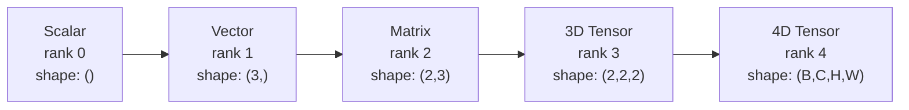
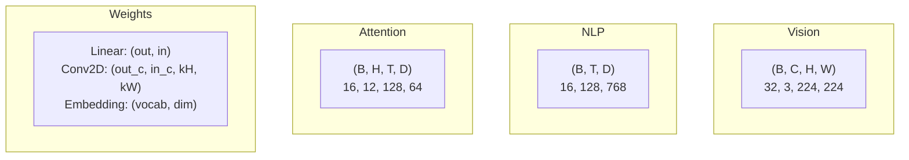
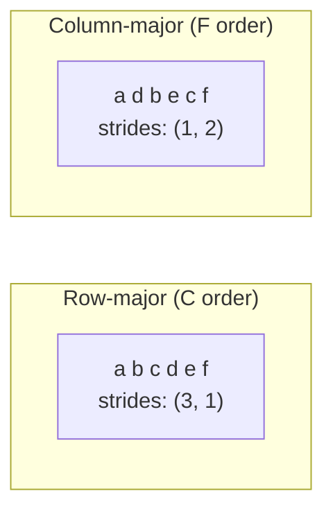
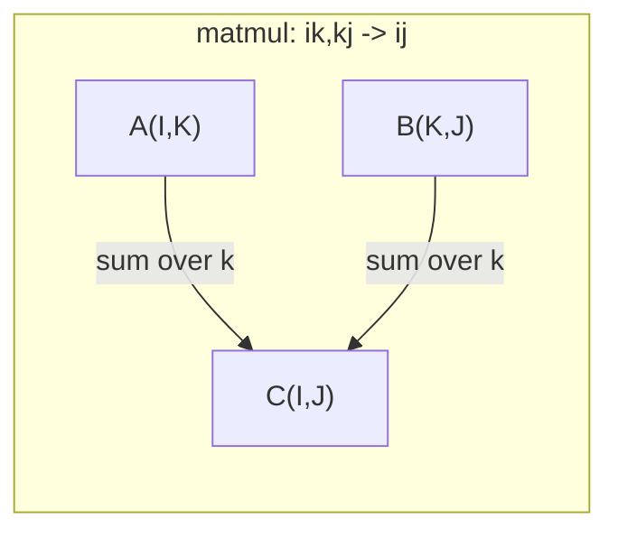

# Tensor Operations

> Tensor 是数据与深度学习之间的通用语言。每一张图像、每一句话、每一份梯度都从中流过。

**类型：** Build
**语言：** Python
**前置课程：** Phase 1, Lessons 01 (Linear Algebra Intuition), 02 (Vectors, Matrices & Operations)
**时长：** 约 90 分钟

## 学习目标

- 从零实现一个 tensor 类，包含 shape、strides、reshape、transpose 以及逐元素运算
- 应用 broadcasting 规则，在不复制数据的前提下对不同 shape 的 tensor 进行运算
- 编写 einsum 表达式来表达点积、矩阵乘法、外积以及批量运算
- 追踪 multi-head attention 每一步中 tensor 的精确 shape

## 问题所在

你搭好了一个 transformer，前向传播看起来干净利落。一运行就报错：`RuntimeError: mat1 and mat2 shapes cannot be multiplied (32x768 and 512x768)`。你盯着 shape 看，加了一个 transpose。它又说 `Expected 4D input (got 3D input)`。你再加一个 unsqueeze，结果别的地方又坏了。

Shape 错误是深度学习代码里最常见的 bug。它们在概念上并不难——每个操作都有自己的 shape 契约——但它们叠加得很快。一个 transformer 里串联着几十次 reshape、transpose 和 broadcast。一个轴搞错，错误就会层层传染。更糟的是，有些 shape 错误压根不会抛异常，它们会沿着错误的维度 broadcast、或在错误的轴上求和，悄无声息地产出垃圾结果。

矩阵能处理两组事物之间的两两关系。但真实数据装不进二维空间。一个 batch 的 32 张 224x224 RGB 图像是一个 4D tensor：`(32, 3, 224, 224)`。带有 12 个 head 的 self-attention 也是 4D：`(batch, heads, seq_len, head_dim)`。你需要一个能推广到任意维度、且各个维度上操作都能干净组合的数据结构。这个结构就是 tensor。掌握了它的运算，shape 错误就会变成显而易见的可调试问题。

## 核心概念

### 什么是 tensor

Tensor 是一个具有统一数据类型的多维数组。维度的数量称为 **rank**（或 **order**）。每一个维度是一个 **axis**。**shape** 是一个元组，列出每个轴上的大小。



总元素数 = 所有维度大小的乘积。一个形状为 `(2, 3, 4)` 的 tensor 包含 `2 * 3 * 4 = 24` 个元素。

### 深度学习中的 tensor shape

不同的数据类型按惯例对应特定的 tensor shape。



PyTorch 使用 NCHW（channels-first）。TensorFlow 默认使用 NHWC（channels-last）。布局不一致会导致悄无声息的性能下降或错误。

### 内存布局是怎么回事

二维数组在内存中其实是一段一维的字节序列。**Strides** 告诉你在每个轴上前进一步需要跨过多少个元素。



Transpose 不会移动数据，它只是交换 strides，让 tensor 变成 **non-contiguous**——同一行的元素在内存中不再相邻。

### Broadcasting 规则

Broadcasting 让你在不复制数据的情况下对不同 shape 的 tensor 进行运算。规则是从右向左对齐 shape。当两个维度相等、或其中一个为 1 时，它们是兼容的。维度较少的一方会在左侧用 1 来补齐。

```
Tensor A:     (8, 1, 6, 1)
Tensor B:        (7, 1, 5)
Padded B:     (1, 7, 1, 5)
Result:       (8, 7, 6, 5)
```

### Einsum：通用的 tensor 运算

Einstein summation 给每个轴标一个字母。出现在输入但不出现在输出中的轴会被求和；同时出现在输入和输出中的轴会被保留。



常见模式：`i,i->`（点积）、`i,j->ij`（外积）、`ii->`（trace）、`ij->ji`（transpose）、`bij,bjk->bik`（batch matmul）、`bhtd,bhsd->bhts`（attention scores）。

## 动手实现

代码位于 `code/tensors.py`。每一步都对应那里的实现。

### Step 1：Tensor 存储与 strides

一个 tensor 存的是一个扁平的数字列表加上 shape 元数据。Strides 告诉索引逻辑如何把多维下标映射到扁平位置。

```python
class Tensor:
    def __init__(self, data, shape=None):
        if isinstance(data, (list, tuple)):
            self._data, self._shape = self._flatten_nested(data)
        elif isinstance(data, np.ndarray):
            self._data = data.flatten().tolist()
            self._shape = tuple(data.shape)
        else:
            self._data = [data]
            self._shape = ()

        if shape is not None:
            total = reduce(lambda a, b: a * b, shape, 1)
            if total != len(self._data):
                raise ValueError(
                    f"Cannot reshape {len(self._data)} elements into shape {shape}"
                )
            self._shape = tuple(shape)

        self._strides = self._compute_strides(self._shape)

    @staticmethod
    def _compute_strides(shape):
        if len(shape) == 0:
            return ()
        strides = [1] * len(shape)
        for i in range(len(shape) - 2, -1, -1):
            strides[i] = strides[i + 1] * shape[i + 1]
        return tuple(strides)
```

对于 shape `(3, 4)`，strides 是 `(4, 1)`——跳过 4 个元素以前进一行，跳过 1 个元素以前进一列。

### Step 2：Reshape、squeeze、unsqueeze

Reshape 在不改变元素顺序的前提下改变 shape，要求总元素数保持不变。可以用 `-1` 让某一个维度的大小被自动推断。

```python
t = Tensor(list(range(12)), shape=(2, 6))
r = t.reshape((3, 4))
r = t.reshape((-1, 3))
```

Squeeze 移除大小为 1 的轴；unsqueeze 插入一个大小为 1 的轴。Unsqueeze 对 broadcasting 至关重要——一个 bias 向量 `(D,)` 要加到 batch `(B, T, D)` 上，需要先 unsqueeze 成 `(1, 1, D)`。

```python
t = Tensor(list(range(6)), shape=(1, 3, 1, 2))
s = t.squeeze()
v = Tensor([1, 2, 3])
u = v.unsqueeze(0)
```

### Step 3：Transpose 和 permute

Transpose 交换两个轴；permute 重新排列所有轴。这就是 NCHW 与 NHWC 之间互转的方式。

```python
mat = Tensor(list(range(6)), shape=(2, 3))
tr = mat.transpose(0, 1)

t4d = Tensor(list(range(24)), shape=(1, 2, 3, 4))
perm = t4d.permute((0, 2, 3, 1))
```

经过 transpose 或 permute 后，tensor 在内存中变得 non-contiguous。在 PyTorch 中，`view` 在 non-contiguous tensor 上会失败——这时要用 `reshape`，或者先调用 `.contiguous()`。

### Step 4：逐元素运算与 reduction

逐元素运算（add、multiply、subtract）独立作用于每个元素，shape 保持不变。Reduction（sum、mean、max）会折叠掉一个或多个轴。

```python
a = Tensor([[1, 2], [3, 4]])
b = Tensor([[10, 20], [30, 40]])
c = a + b
d = a * 2
s = a.sum(axis=0)
```

CNN 中的全局平均池化：`(B, C, H, W).mean(axis=[2, 3])` 得到 `(B, C)`。NLP 中的序列均值池化：`(B, T, D).mean(axis=1)` 得到 `(B, D)`。

### Step 5：用 NumPy 做 broadcasting

`tensors.py` 中的 `demo_broadcasting_numpy()` 函数展示了核心模式。

```python
activations = np.random.randn(4, 3)
bias = np.array([0.1, 0.2, 0.3])
result = activations + bias

images = np.random.randn(2, 3, 4, 4)
scale = np.array([0.5, 1.0, 1.5]).reshape(1, 3, 1, 1)
result = images * scale

a = np.array([1, 2, 3]).reshape(-1, 1)
b = np.array([10, 20, 30, 40]).reshape(1, -1)
outer = a * b
```

通过 broadcasting 计算两两距离：把 `(M, 2)` reshape 成 `(M, 1, 2)`，把 `(N, 2)` reshape 成 `(1, N, 2)`，相减、平方、沿最后一个轴求和、再开方。结果：`(M, N)`。

### Step 6：Einsum 运算

`demo_einsum()` 和 `demo_einsum_gallery()` 函数走过了所有常见模式。

```python
a = np.array([1.0, 2.0, 3.0])
b = np.array([4.0, 5.0, 6.0])
dot = np.einsum("i,i->", a, b)

A = np.array([[1, 2], [3, 4], [5, 6]], dtype=float)
B = np.array([[7, 8, 9], [10, 11, 12]], dtype=float)
matmul = np.einsum("ik,kj->ij", A, B)

batch_A = np.random.randn(4, 3, 5)
batch_B = np.random.randn(4, 5, 2)
batch_mm = np.einsum("bij,bjk->bik", batch_A, batch_B)
```

一次 contraction 的计算量等于所有索引（无论保留还是被求和）大小的乘积。对于 `bij,bjk->bik`，当 B=32, I=128, J=64, K=128 时：`32 * 128 * 64 * 128 = 33,554,432` 次乘加。

### Step 7：用 einsum 实现 attention

`demo_attention_einsum()` 函数端到端实现了 multi-head attention。

```python
B, H, T, D = 2, 4, 8, 16
E = H * D

X = np.random.randn(B, T, E)
W_q = np.random.randn(E, E) * 0.02

Q = np.einsum("bte,ek->btk", X, W_q)
Q = Q.reshape(B, T, H, D).transpose(0, 2, 1, 3)

scores = np.einsum("bhtd,bhsd->bhts", Q, K) / np.sqrt(D)
weights = softmax(scores, axis=-1)
attn_output = np.einsum("bhts,bhsd->bhtd", weights, V)

concat = attn_output.transpose(0, 2, 1, 3).reshape(B, T, E)
output = np.einsum("bte,ek->btk", concat, W_o)
```

每一步都是 tensor 运算：投影（用 einsum 写的 matmul）、拆 head（reshape + transpose）、attention scores（用 einsum 写的 batch matmul）、加权求和（用 einsum 写的 batch matmul）、合并 head（transpose + reshape）、输出投影（用 einsum 写的 matmul）。

## 实际使用

### Scratch 与 NumPy 对照

| Operation | Scratch (Tensor class) | NumPy |
|---|---|---|
| Create | `Tensor([[1,2],[3,4]])` | `np.array([[1,2],[3,4]])` |
| Reshape | `t.reshape((3,4))` | `a.reshape(3,4)` |
| Transpose | `t.transpose(0,1)` | `a.T` or `a.transpose(0,1)` |
| Squeeze | `t.squeeze(0)` | `np.squeeze(a, 0)` |
| Sum | `t.sum(axis=0)` | `a.sum(axis=0)` |
| Einsum | N/A | `np.einsum("ij,jk->ik", a, b)` |

### Scratch 与 PyTorch 对照

```python
import torch

t = torch.tensor([[1, 2, 3], [4, 5, 6]], dtype=torch.float32)
t.shape
t.stride()
t.is_contiguous()

t.reshape(3, 2)
t.unsqueeze(0)
t.transpose(0, 1)
t.transpose(0, 1).contiguous()

torch.einsum("ik,kj->ij", A, B)
```

PyTorch 在此基础上增加了 autograd、GPU 支持和优化过的 BLAS kernel。Shape 语义完全相同。如果你理解了从零实现的版本，PyTorch 的 shape 错误就会变得可读。

### 把每一种神经网络层都看成 tensor 运算

| Operation | Tensor Form | Einsum |
|---|---|---|
| Linear layer | `Y = X @ W.T + b` | `"bd,od->bo"` + bias |
| Attention QKV | `Q = X @ W_q` | `"btd,dh->bth"` |
| Attention scores | `Q @ K.T / sqrt(d)` | `"bhtd,bhsd->bhts"` |
| Attention output | `softmax(scores) @ V` | `"bhts,bhsd->bhtd"` |
| Batch norm | `(X - mu) / sigma * gamma` | element-wise + broadcast |
| Softmax | `exp(x) / sum(exp(x))` | element-wise + reduction |

## 交付产物

这一课会沉淀出两个可复用的 prompt：

1. **`outputs/prompt-tensor-shapes.md`** —— 一个用来系统化排查 tensor shape 不匹配问题的 prompt。包含每种常见运算（matmul、broadcast、cat、Linear、Conv2d、BatchNorm、softmax）的决策表，以及一张修复速查表。

2. **`outputs/prompt-tensor-debugger.md`** —— 一个分步的 debugging prompt，当 shape 错误把你卡住时，可以直接粘到任意 AI 助手里。把错误信息和 tensor shape 喂给它，就能拿到精确的修复方案。

## 练习

1. **Easy —— Reshape round-trip。** 拿一个 shape 为 `(2, 3, 4)` 的 tensor，先 reshape 成 `(6, 4)`，再 reshape 成 `(24,)`，最后再 reshape 回 `(2, 3, 4)`。每一步都打印扁平数据，验证元素顺序保持不变。

2. **Medium —— 实现 broadcasting。** 给 `Tensor` 类加一个 `broadcast_to(shape)` 方法，把大小为 1 的维度扩展到目标 shape。然后修改 `_elementwise_op`，让它在运算前自动 broadcast。用 `(3, 1)` 和 `(1, 4)` 测试，期望结果 shape 为 `(3, 4)`。

3. **Hard —— 从零实现 einsum。** 实现一个基本的 `einsum(subscripts, *tensors)` 函数，至少要支持：点积（`i,i->`）、矩阵乘法（`ij,jk->ik`）、外积（`i,j->ij`）和 transpose（`ij->ji`）。解析 subscript 字符串，识别被 contract 的索引，再遍历所有索引组合。结果要和 `np.einsum` 对得上。

4. **Hard —— Attention shape tracker。** 写一个函数，输入是 `batch_size`、`seq_len`、`embed_dim` 和 `num_heads`，输出是 multi-head attention 每一步的精确 shape：input、Q/K/V projection、head split、attention scores、softmax weights、weighted sum、head merge、output projection。结果与 `demo_attention_einsum()` 的输出对照验证。

## 关键术语

| Term | 大家常说的 | 它实际指的是 |
|---|---|---|
| Tensor | "维度更多的矩阵" | 一种具有统一数据类型，并定义了 shape、strides 和运算的多维数组 |
| Rank | "维度的数量" | 轴的数量。矩阵的 rank 是 2，与线性代数里的"矩阵秩"不是一回事 |
| Shape | "tensor 的大小" | 一个元组，列出每个轴上的大小。`(2, 3)` 表示 2 行 3 列 |
| Stride | "内存是怎么排的" | 在每个轴上前进一格需要跨过多少个元素 |
| Broadcasting | "shape 不同也能直接算" | 一套严格的规则：从右对齐，对应维度必须相等或其中一个为 1 |
| Contiguous | "tensor 是正常的" | 元素在内存中按逻辑布局顺序连续存储，没有间隙也没有重排 |
| Einsum | "写 matmul 的花式语法" | 一种通用记号，能用一行表达任意 tensor contraction、外积、trace 或 transpose |
| View | "和 reshape 一样" | 一个共享同一段内存缓冲、但 shape/stride 元数据不同的 tensor。在 non-contiguous 数据上会失败 |
| Contraction | "在某个索引上求和" | 一种通用运算：tensor 间共享的索引会被相乘并求和，得到一个 rank 更低的结果 |
| NCHW / NHWC | "PyTorch 和 TensorFlow 的格式" | 图像 tensor 的内存布局约定。NCHW 把 channel 放在空间维之前，NHWC 放在之后 |

## 延伸阅读

- [NumPy Broadcasting](https://numpy.org/doc/stable/user/basics.broadcasting.html) —— 经典规则配可视化示例
- [PyTorch Tensor Views](https://pytorch.org/docs/stable/tensor_view.html) —— 何时是 view，何时会复制
- [einops](https://github.com/arogozhnikov/einops) —— 让 tensor reshape 既可读又安全的库
- [The Illustrated Transformer](https://jalammar.github.io/illustrated-transformer/) —— 把 attention 中的 tensor shape 流动可视化出来
- [Einstein Summation in NumPy](https://numpy.org/doc/stable/reference/generated/numpy.einsum.html) —— 完整的 einsum 文档与示例
