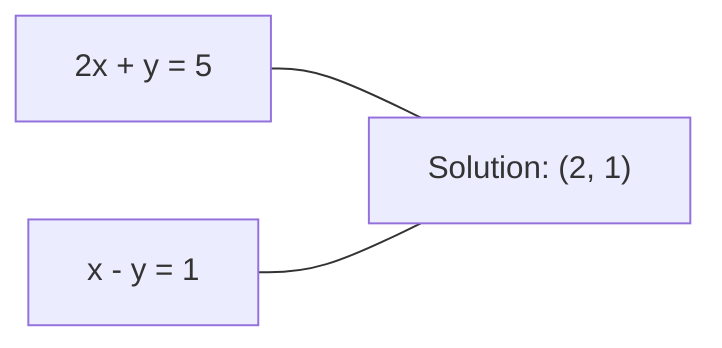
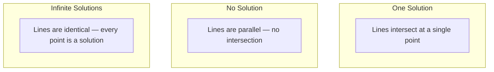

# Linear Systems

> 求解 Ax = b 是数学中最古老的问题，至今仍在驱动你的神经网络。

**Type:** Build
**Language:** Python
**Prerequisites:** Phase 1, Lessons 01 (Linear Algebra Intuition), 02 (Vectors & Matrices), 03 (Matrix Transformations)
**Time:** ~120 minutes

## Learning Objectives

- 用带 partial pivoting 的 Gaussian elimination 和 back substitution 求解 Ax = b
- 用 LU、QR、Cholesky decomposition 对矩阵进行因式分解，并说清楚每种方式的适用场景
- 推导 least squares 的 normal equations，并将其与 linear regression、ridge regression 联系起来
- 用 condition number 诊断 ill-conditioned 系统，并通过 regularization 让其稳定下来

## The Problem

每一次训练 linear regression，你都在求解一个线性方程组。每一次计算 least-squares 拟合，你都在求解一个线性方程组。每一次神经网络的某一层计算 `y = Wx + b`，它都是在求线性方程组的一边。每当你加上 regularization，就是在改写这个系统。每当你使用 Gaussian processes，就要对一个矩阵做分解。每当你为了 Mahalanobis distance 而对协方差矩阵求逆，又是在求解一个线性方程组。

Ax = b 这个方程无处不在。A 是已知系数构成的矩阵；b 是已知输出构成的向量；x 是你想要求解的未知向量。在 linear regression 里，A 就是你的数据矩阵，b 是目标向量，x 是权重向量。整个模型可以归结为一句话：找到 x，使 Ax 尽可能接近 b。

这一课会从零构建求解这个方程的所有主要方法。你会理解为什么有些方法快、有些方法稳定，为什么有些只适用于方阵系统、有些能处理超定（overdetermined）系统，以及为什么矩阵的 condition number 决定了你的答案究竟有没有意义。

## The Concept

### What Ax = b means geometrically

线性方程组有一个几何上的解释。每一个方程定义一个 hyperplane，解就是所有 hyperplane 相交的那一点（或那一组点）。

```
2x + y = 5          Two lines in 2D.
x - y  = 1          They intersect at x=2, y=1.
```



可能出现三种情况：



写成矩阵形式时，"一个解"意味着 A 可逆；"无解"意味着系统不相容；"无穷多解"意味着 A 有 null space。多数 ML 问题落在"没有精确解"那一类，因为方程数（数据点）比未知数（参数）多。这正是 least squares 派上用场的地方。

### Column picture vs row picture

读 Ax = b 有两种角度。

**Row picture.** A 的每一行定义一个方程，每一个方程是一个 hyperplane，解就在它们的交点处。

**Column picture.** A 的每一列是一个向量。问题变成：A 的列向量做怎样的线性组合才能得到 b？

```
A = | 2  1 |    b = | 5 |
    | 1 -1 |        | 1 |

Row picture: solve 2x + y = 5 and x - y = 1 simultaneously.

Column picture: find x1, x2 such that:
  x1 * [2, 1] + x2 * [1, -1] = [5, 1]
  2 * [2, 1] + 1 * [1, -1] = [4+1, 2-1] = [5, 1]   check.
```

Column picture 更本质一些。如果 b 落在 A 的 column space 中，系统就有解；如果不在，就找出 column space 中离 b 最近的那个点，这个最近点就是 least-squares 解。

### Gaussian elimination

Gaussian elimination 把 Ax = b 化为一个上三角系统 Ux = c，然后用 back substitution 求解。这是最直接的方法。

算法：

```
1. For each column k (the pivot column):
   a. Find the largest entry in column k at or below row k (partial pivoting).
   b. Swap that row with row k.
   c. For each row i below k:
      - Compute multiplier m = A[i][k] / A[k][k]
      - Subtract m times row k from row i.
2. Back substitute: solve from the last equation upward.
```

例子：

```
Original:
| 2  1  1 | 8 |       R2 = R2 - (2)R1     | 2  1   1 |  8 |
| 4  3  3 |20 |  -->  R3 = R3 - (1)R1 --> | 0  1   1 |  4 |
| 2  3  1 |12 |                            | 0  2   0 |  4 |

                       R3 = R3 - (2)R2     | 2  1   1 |  8 |
                                       --> | 0  1   1 |  4 |
                                           | 0  0  -2 | -4 |

Back substitute:
  -2 * x3 = -4    -->  x3 = 2
  x2 + 2  = 4     -->  x2 = 2
  2*x1 + 2 + 2 = 8 --> x1 = 2
```

Gaussian elimination 的成本是 O(n^3) 次运算。对一个 1000x1000 的系统，大约要十亿次浮点运算。已经很快了，但如果要用同一个 A 解多次系统，还有更省的方法。

### Partial pivoting: why it matters

不做 pivoting 时，Gaussian elimination 可能直接失败，或者算出垃圾。如果 pivot 元素是 0，会出现除零；如果它很小，舍入误差会被放大。

```
Bad pivot:                       With partial pivoting:
| 0.001  1 | 1.001 |            Swap rows first:
| 1      1 | 2     |            | 1      1 | 2     |
                                 | 0.001  1 | 1.001 |
m = 1/0.001 = 1000              m = 0.001/1 = 0.001
R2 = R2 - 1000*R1               R2 = R2 - 0.001*R1
| 0.001  1     | 1.001   |      | 1      1     | 2     |
| 0     -999   | -999.0  |      | 0      0.999 | 0.999 |

x2 = 1.000 (correct)            x2 = 1.000 (correct)
x1 = (1.001 - 1)/0.001          x1 = (2 - 1)/1 = 1.000 (correct)
   = 0.001/0.001 = 1.000        Stable because the multiplier is small.
```

在精度有限的浮点运算里，不做 pivoting 的版本会丢失有效位数。Partial pivoting 总是挑选当前可用的最大 pivot，把误差放大降到最低。

### LU decomposition

LU decomposition 把 A 分解成下三角矩阵 L 和上三角矩阵 U：A = LU。L 矩阵保存 Gaussian elimination 中的乘子，U 矩阵则是消元的结果。

```
A = L @ U

| 2  1  1 |   | 1  0  0 |   | 2  1   1 |
| 4  3  3 | = | 2  1  0 | @ | 0  1   1 |
| 2  3  1 |   | 1  2  1 |   | 0  0  -2 |
```

为什么要分解，而不是直接消元？因为有了 L 和 U 之后，对任何新的 b 解 Ax = b 只要 O(n^2)：

```
Ax = b
LUx = b
Let y = Ux:
  Ly = b    (forward substitution, O(n^2))
  Ux = y    (back substitution, O(n^2))
```

O(n^3) 的开销在分解时只付一次，后续每次求解都是 O(n^2)。如果你需要用同一个 A 解 1000 个不同的 b，LU 在总工作量上能省下大约 1000/3 倍。

加上 partial pivoting 后会得到 PA = LU，其中 P 是记录行交换的 permutation matrix。

### QR decomposition

QR decomposition 把 A 分解成正交矩阵 Q 和上三角矩阵 R：A = QR。

正交矩阵满足 Q^T Q = I，它的列是 orthonormal 向量。乘以 Q 不改变长度和角度。

```
A = Q @ R

Q has orthonormal columns: Q^T Q = I
R is upper triangular

To solve Ax = b:
  QRx = b
  Rx = Q^T b    (just multiply by Q^T, no inversion needed)
  Back substitute to get x.
```

在求解 least-squares 问题时，QR 在数值上比 LU 更稳定。Gram-Schmidt 过程逐列构造 Q：

```
Given columns a1, a2, ... of A:

q1 = a1 / ||a1||

q2 = a2 - (a2 . q1) * q1        (subtract projection onto q1)
q2 = q2 / ||q2||                (normalize)

q3 = a3 - (a3 . q1) * q1 - (a3 . q2) * q2
q3 = q3 / ||q3||

R[i][j] = qi . aj    for i <= j
```

每一步都把当前列在前面所有 q 方向上的分量减掉，只留下新的、彼此正交的方向。

### Cholesky decomposition

当 A 是 symmetric（A = A^T）且 positive definite（所有特征值都为正）时，可以分解成 A = L L^T，其中 L 是下三角矩阵。这就是 Cholesky decomposition。

```
A = L @ L^T

| 4  2 |   | 2  0 |   | 2  1 |
| 2  5 | = | 1  2 | @ | 0  2 |

L[i][i] = sqrt(A[i][i] - sum(L[i][k]^2 for k < i))
L[i][j] = (A[i][j] - sum(L[i][k]*L[j][k] for k < j)) / L[j][j]    for i > j
```

Cholesky 的速度是 LU 的两倍，存储也只要一半。它只能用于 symmetric positive definite 矩阵，但这种矩阵在实际中无处不在：

- Covariance matrices 是 symmetric positive semi-definite（加上 regularization 后就是 positive definite）。
- Gaussian processes 中的 kernel matrix 是 symmetric positive definite。
- 凸函数在最小值点处的 Hessian 是 symmetric positive definite。
- A^T A 始终是 symmetric positive semi-definite。

在 Gaussian processes 里，先用 Cholesky 分解 kernel matrix K，再求解 K alpha = y 来得到预测均值。Cholesky factor 还能直接给出 marginal likelihood 所需的 log-determinant：log det(K) = 2 * sum(log(diag(L)))。

### Least squares: when Ax = b has no exact solution

如果 A 是 m x n 且 m > n（方程数比未知数多），系统就是超定的（overdetermined），不存在精确解。这时你转而最小化平方误差：

```
minimize ||Ax - b||^2

This is the sum of squared residuals:
  sum((A[i,:] @ x - b[i])^2 for i in range(m))
```

最小化的解满足 normal equations：

```
A^T A x = A^T b
```

推导：展开 ||Ax - b||^2 = (Ax - b)^T (Ax - b) = x^T A^T A x - 2 x^T A^T b + b^T b。对 x 求梯度并置零，得到 2 A^T A x - 2 A^T b = 0。

```
Original system (overdetermined, 4 equations, 2 unknowns):
| 1  1 |         | 3 |
| 1  2 | x     = | 5 |       No exact x satisfies all 4 equations.
| 1  3 |         | 6 |
| 1  4 |         | 8 |

Normal equations:
A^T A = | 4  10 |    A^T b = | 22 |
        | 10 30 |            | 63 |

Solve: x = [1.5, 1.7]

This is linear regression. x[0] is the intercept, x[1] is the slope.
```

### Normal equations = linear regression

这种联系是严格相等的。在 linear regression 中，数据矩阵 X 每行一个样本，每列一个特征；目标向量 y 每行对应一个样本。权重向量 w 满足：

```
X^T X w = X^T y
w = (X^T X)^(-1) X^T y
```

这就是 linear regression 的闭式解。每一次调用 `sklearn.linear_model.LinearRegression.fit()`，都是在算这个（或它通过 QR、SVD 等价的版本）。

在矩阵上加一个 regularization 项 lambda * I，就变成了 ridge regression：

```
(X^T X + lambda * I) w = X^T y
w = (X^T X + lambda * I)^(-1) X^T y
```

regularization 让矩阵的 conditioning 变好（更容易精确求逆），同时把权重向 0 收缩，从而抑制过拟合。当 lambda > 0 时，X^T X + lambda * I 始终是 symmetric positive definite，所以可以直接用 Cholesky 求解。

### Pseudoinverse (Moore-Penrose)

Pseudoinverse A+ 把矩阵求逆推广到非方阵和奇异矩阵的情形。对任何矩阵 A：

```
x = A+ b

where A+ = V Sigma+ U^T    (computed via SVD)
```

Sigma+ 的构造方式是把每个非零奇异值取倒数再转置整个矩阵。如果 A = U Sigma V^T，则 A+ = V Sigma+ U^T。

```
A = U Sigma V^T        (SVD)

Sigma = | 5  0 |       Sigma+ = | 1/5  0  0 |
        | 0  2 |                | 0  1/2  0 |
        | 0  0 |

A+ = V Sigma+ U^T
```

Pseudoinverse 给出 minimum-norm least-squares 解。对于这个系统：
- 唯一解：A+ b 就是该解。
- 无解：A+ b 给出 least-squares 解。
- 无穷多解：A+ b 给出 ||x|| 最小的那一个解。

NumPy 的 `np.linalg.lstsq` 和 `np.linalg.pinv` 内部都使用 SVD。

### Condition number

Condition number 衡量解对输入小扰动的敏感程度。对一个矩阵 A：

```
kappa(A) = ||A|| * ||A^(-1)|| = sigma_max / sigma_min
```

其中 sigma_max 和 sigma_min 是最大和最小的奇异值。

```
Well-conditioned (kappa ~ 1):        Ill-conditioned (kappa ~ 10^15):
Small change in b -->                Small change in b -->
small change in x                    huge change in x

| 2  0 |   kappa = 2/1 = 2          | 1   1          |   kappa ~ 10^15
| 0  1 |   safe to solve            | 1   1+10^(-15) |   solution is garbage
```

经验法则：
- kappa < 100：安全，解是准确的。
- kappa ~ 10^k：从浮点运算中大约会丢失 k 位有效数字。
- kappa ~ 10^16（对 float64 而言）：解已经没有意义，矩阵实际上是奇异的。

在 ML 中，ill-conditioning 通常发生在特征近似共线时。Regularization（加上 lambda * I）把 condition number 从 sigma_max / sigma_min 改善为 (sigma_max + lambda) / (sigma_min + lambda)。

### Iterative methods: conjugate gradient

对非常大的稀疏系统（百万级未知数），LU、Cholesky 这种直接方法成本太高。Iterative methods 通过反复改进一个猜测来逼近解。

Conjugate gradient（CG）适用于 A 是 symmetric positive definite 时求解 Ax = b。在精确算术下它最多在 n 步内得到精确解，但若 A 的特征值聚集，通常会快得多。

```
Algorithm sketch:
  x0 = initial guess (often zero)
  r0 = b - A x0           (residual)
  p0 = r0                 (search direction)

  For k = 0, 1, 2, ...:
    alpha = (rk . rk) / (pk . A pk)
    x_{k+1} = xk + alpha * pk
    r_{k+1} = rk - alpha * A pk
    beta = (r_{k+1} . r_{k+1}) / (rk . rk)
    p_{k+1} = r_{k+1} + beta * pk
    if ||r_{k+1}|| < tolerance: stop
```

CG 用在：
- 大规模优化（Newton-CG 方法）
- PDE 离散化方程的求解
- kernel matrix 大到无法分解时的 kernel methods
- 其他迭代求解器的 preconditioning

收敛速度依赖于 condition number。Conditioning 越好，收敛越快，这也是 regularization 有帮助的另一个原因。

### The full picture: which method when

| Method | Requirements | Cost | Use case |
|--------|-------------|------|----------|
| Gaussian elimination | Square, nonsingular A | O(n^3) | One-off solve of a square system |
| LU decomposition | Square, nonsingular A | O(n^3) factor + O(n^2) solve | Multiple solves with the same A |
| QR decomposition | Any A (m >= n) | O(mn^2) | Least squares, numerically stable |
| Cholesky | Symmetric positive definite A | O(n^3/3) | Covariance matrices, Gaussian processes, ridge regression |
| Normal equations | Overdetermined (m > n) | O(mn^2 + n^3) | Linear regression (small n) |
| SVD / pseudoinverse | Any A | O(mn^2) | Rank-deficient systems, minimum-norm solutions |
| Conjugate gradient | Symmetric positive definite, sparse A | O(n * k * nnz) | Large sparse systems, k = iterations |

### Connection to ML

这一课中的每一种方法都会出现在生产 ML 中：

**Linear regression.** 闭式解就是求解 normal equations X^T X w = X^T y。一般会用 Cholesky（n 较小时）、QR（关注数值稳定性时）或 SVD（矩阵可能 rank-deficient 时）来完成。

**Ridge regression.** 在 X^T X 上加了 lambda * I。当 lambda > 0 时，正则化系统 (X^T X + lambda * I) w = X^T y 永远是 symmetric positive definite，可以直接用 Cholesky 求解。

**Gaussian processes.** 预测均值需要求解 K alpha = y，其中 K 是 kernel matrix。标准做法是对 K 做 Cholesky 分解。Log marginal likelihood 用到 log det(K) = 2 sum(log(diag(L)))。

**Neural network initialization.** Orthogonal initialization 通过 QR decomposition 得到列向量为 orthonormal 的权重矩阵，从而避免深层网络中的信号塌缩。

**Preconditioning.** 大规模优化器会用 incomplete Cholesky 或 incomplete LU 作为 conjugate gradient 求解器的 preconditioner。

**Feature engineering.** X^T X 的 condition number 可以告诉你特征是不是共线的。如果 kappa 很大，要么剔除特征，要么加上 regularization。

## Build It

### Step 1: Gaussian elimination with partial pivoting

```python
import numpy as np

def gaussian_elimination(A, b):
    n = len(b)
    Ab = np.hstack([A.astype(float), b.reshape(-1, 1).astype(float)])

    for k in range(n):
        max_row = k + np.argmax(np.abs(Ab[k:, k]))
        Ab[[k, max_row]] = Ab[[max_row, k]]

        if abs(Ab[k, k]) < 1e-12:
            raise ValueError(f"Matrix is singular or nearly singular at pivot {k}")

        for i in range(k + 1, n):
            m = Ab[i, k] / Ab[k, k]
            Ab[i, k:] -= m * Ab[k, k:]

    x = np.zeros(n)
    for i in range(n - 1, -1, -1):
        x[i] = (Ab[i, -1] - Ab[i, i+1:n] @ x[i+1:n]) / Ab[i, i]

    return x
```

### Step 2: LU decomposition

```python
def lu_decompose(A):
    n = A.shape[0]
    L = np.eye(n)
    U = A.astype(float).copy()
    P = np.eye(n)

    for k in range(n):
        max_row = k + np.argmax(np.abs(U[k:, k]))
        if max_row != k:
            U[[k, max_row]] = U[[max_row, k]]
            P[[k, max_row]] = P[[max_row, k]]
            if k > 0:
                L[[k, max_row], :k] = L[[max_row, k], :k]

        for i in range(k + 1, n):
            L[i, k] = U[i, k] / U[k, k]
            U[i, k:] -= L[i, k] * U[k, k:]

    return P, L, U

def lu_solve(P, L, U, b):
    n = len(b)
    Pb = P @ b.astype(float)

    y = np.zeros(n)
    for i in range(n):
        y[i] = Pb[i] - L[i, :i] @ y[:i]

    x = np.zeros(n)
    for i in range(n - 1, -1, -1):
        x[i] = (y[i] - U[i, i+1:] @ x[i+1:]) / U[i, i]

    return x
```

### Step 3: Cholesky decomposition

```python
def cholesky(A):
    n = A.shape[0]
    L = np.zeros_like(A, dtype=float)

    for i in range(n):
        for j in range(i + 1):
            s = A[i, j] - L[i, :j] @ L[j, :j]
            if i == j:
                if s <= 0:
                    raise ValueError("Matrix is not positive definite")
                L[i, j] = np.sqrt(s)
            else:
                L[i, j] = s / L[j, j]

    return L
```

### Step 4: Least squares via normal equations

```python
def least_squares_normal(A, b):
    AtA = A.T @ A
    Atb = A.T @ b
    return gaussian_elimination(AtA, Atb)

def ridge_regression(A, b, lam):
    n = A.shape[1]
    AtA = A.T @ A + lam * np.eye(n)
    Atb = A.T @ b
    L = cholesky(AtA)
    y = np.zeros(n)
    for i in range(n):
        y[i] = (Atb[i] - L[i, :i] @ y[:i]) / L[i, i]
    x = np.zeros(n)
    for i in range(n - 1, -1, -1):
        x[i] = (y[i] - L.T[i, i+1:] @ x[i+1:]) / L.T[i, i]
    return x
```

### Step 5: Condition number

```python
def condition_number(A):
    U, S, Vt = np.linalg.svd(A)
    return S[0] / S[-1]
```

## Use It

把上面的零件拼起来，在真实数据上做 linear regression 和 ridge regression：

```python
np.random.seed(42)
X_raw = np.random.randn(100, 3)
w_true = np.array([2.0, -1.0, 0.5])
y = X_raw @ w_true + np.random.randn(100) * 0.1

X = np.column_stack([np.ones(100), X_raw])

w_ols = least_squares_normal(X, y)
print(f"OLS weights (ours):    {w_ols}")

w_np = np.linalg.lstsq(X, y, rcond=None)[0]
print(f"OLS weights (numpy):   {w_np}")
print(f"Max difference: {np.max(np.abs(w_ols - w_np)):.2e}")

w_ridge = ridge_regression(X, y, lam=1.0)
print(f"Ridge weights (ours):  {w_ridge}")

from sklearn.linear_model import Ridge
ridge_sk = Ridge(alpha=1.0, fit_intercept=False)
ridge_sk.fit(X, y)
print(f"Ridge weights (sklearn): {ridge_sk.coef_}")
```

## Ship It

这一课会产出：
- `code/linear_systems.py`，包含从零实现的 Gaussian elimination、LU decomposition、Cholesky decomposition、least squares 和 ridge regression
- 一个可运行的演示，验证 normal equations 与 sklearn 的 LinearRegression 给出相同的权重

## Exercises

1. 用你的 Gaussian elimination、LU solver 和 `np.linalg.solve` 求解 `[[1,2,3],[4,5,6],[7,8,10]] x = [6, 15, 27]`，验证三者的答案在浮点精度内一致。

2. 生成一个 50x5 的随机矩阵 X 和目标 y = X @ w_true + noise。分别用 normal equations、QR（`np.linalg.qr`）、SVD（`np.linalg.svd`）和 `np.linalg.lstsq` 求解 w，比较四种结果。测量 X^T X 的 condition number，并解释它如何影响你对哪种方法更信任。

3. 通过让两列几乎相同（比如 column 2 = column 1 + 1e-10 * noise）来构造一个近似奇异的矩阵。计算它的 condition number。在加和不加 regularization（加 0.01 * I）两种情况下求解 Ax = b，比较解和残差，解释为什么 regularization 有帮助。

4. 为一个 100x100 的随机 symmetric positive definite 矩阵实现 conjugate gradient 算法。统计在容差 1e-8 下需要多少次迭代收敛，并与理论上限 n 次迭代作比较。

5. 在大小为 10、50、200、500 的 symmetric positive definite 矩阵上，对你的 Cholesky solver、LU solver 和 `np.linalg.solve` 计时。把结果画出来，验证 Cholesky 大约比 LU 快 2 倍。

## Key Terms

| Term | What people say | What it actually means |
|------|----------------|----------------------|
| Linear system | "Solve for x" | 一组线性方程 Ax = b。求 x 就是找出经过变换 A 后能得到输出 b 的那个输入。 |
| Gaussian elimination | "Row reduce" | 通过行变换系统性地把对角线下方的元素清零，得到可由 back substitution 求解的上三角系统，O(n^3)。 |
| Partial pivoting | "Swap rows for stability" | 在第 k 列消元前，把当前列中绝对值最大的那一行换到 pivot 位置，避免被小数除。 |
| LU decomposition | "Factor into triangles" | 把 A 写成 LU，其中 L 是下三角（保存乘子），U 是上三角（消元结果）。把 O(n^3) 成本摊到多次求解上。 |
| QR decomposition | "Orthogonal factorization" | 把 A 写成 QR，其中 Q 的列是 orthonormal，R 是上三角。在 least squares 上比 LU 更稳定。 |
| Cholesky decomposition | "Square root of a matrix" | 对 symmetric positive definite 的 A，写成 A = LL^T。开销只有 LU 的一半，常用于 covariance matrices、kernel matrices、ridge regression。 |
| Least squares | "Best fit when exact is impossible" | 当系统超定（方程比未知数多）时，最小化残差平方和 ||Ax - b||^2。 |
| Normal equations | "The calculus shortcut" | A^T A x = A^T b。让 ||Ax - b||^2 的梯度为零得到的方程。它就是 linear regression 的闭式解。 |
| Pseudoinverse | "Inversion for non-square matrices" | 通过 SVD 得到 A+ = V Sigma+ U^T。对任何矩阵（方或非方、奇异或非奇异）都给出 minimum-norm least-squares 解。 |
| Condition number | "How trustworthy is this answer" | kappa = sigma_max / sigma_min。衡量解对输入扰动的敏感程度，大约会损失 log10(kappa) 位有效数字。 |
| Ridge regression | "Regularized least squares" | 求解 (X^T X + lambda I) w = X^T y。加上 lambda I 改善 conditioning，把权重向 0 收缩，抑制过拟合。 |
| Conjugate gradient | "Iterative Ax=b for big matrices" | 一种针对 symmetric positive definite 系统的迭代求解器，最多 n 步收敛。在分解过于昂贵的大型稀疏系统中很实用。 |
| Overdetermined system | "More data than parameters" | m x n 系统中 m > n。没有精确解，least squares 给出最佳近似。每一个 regression 问题都属于这种情况。 |
| Back substitution | "Solve from the bottom up" | 给定上三角系统，先解最后一个方程，再向上代回，O(n^2)。 |
| Forward substitution | "Solve from the top down" | 给定下三角系统，先解第一个方程，再向下代入，O(n^2)。在 LU 求解的 L 阶段使用。 |

## Further Reading

- [MIT 18.06: Linear Algebra](https://ocw.mit.edu/courses/18-06-linear-algebra-spring-2010/) (Gilbert Strang) -- 关于线性方程组与矩阵分解的权威课程
- [Numerical Linear Algebra](https://people.maths.ox.ac.uk/trefethen/text.html) (Trefethen & Bau) -- 理解数值稳定性、conditioning，以及算法为何会失败的标准参考
- [Matrix Computations](https://www.cs.cornell.edu/cv/GolubVanLoan4/golubandvanloan.htm) (Golub & Van Loan) -- 涵盖每一种矩阵算法的百科全书式参考
- [3Blue1Brown: Inverse Matrices](https://www.3blue1brown.com/lessons/inverse-matrices) -- 直观地展示求解 Ax = b 在几何上意味着什么
