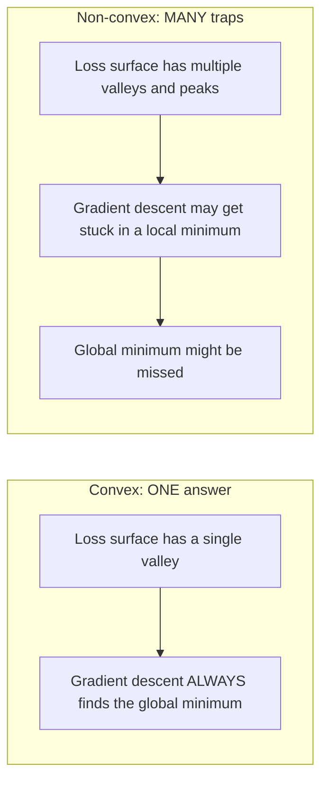
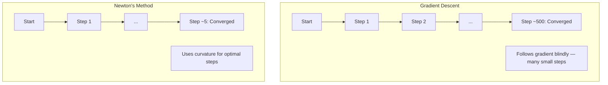
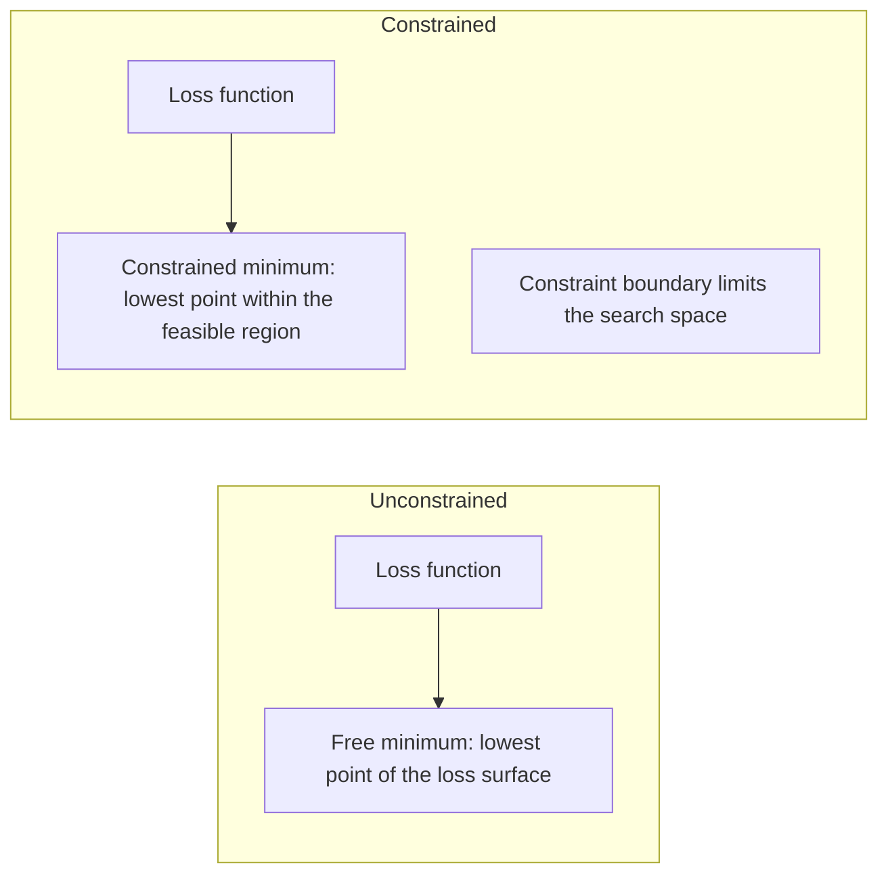
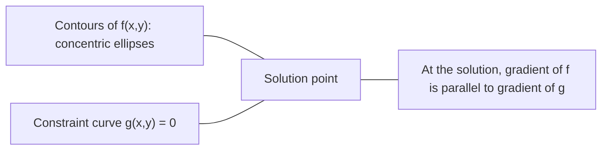

# Convex Optimization

> Convex 问题只有一个山谷，神经网络则有数百万个。理解二者的差异至关重要。

**Type:** Build
**Language:** Python
**Prerequisites:** Phase 1, Lessons 04 (Calculus for ML), 08 (Optimization)
**Time:** ~90 minutes

## Learning Objectives

- 通过定义、二阶导数和 Hessian 准则判断一个函数是否为 convex
- 实现 Newton's method，并将其 quadratic convergence 与 gradient descent 进行对比
- 使用 Lagrange multipliers 求解 constrained optimization 问题，并解读 KKT conditions
- 解释为什么神经网络的损失曲面是 non-convex 的，而 SGD 仍能找到良好的解

## The Problem

Lesson 08 教过你 gradient descent、momentum 和 Adam。这些 optimizer 能在任意曲面上沿着下坡走，但它们没有任何保证。在 non-convex 曲面上，gradient descent 可能落到糟糕的 local minimum、卡在 saddle point，或者无休止地震荡。你之所以仍然使用它，是因为神经网络是 non-convex 的，没有更好的替代方案。

但机器学习中的许多问题其实是 convex 的，例如 linear regression、logistic regression、SVMs、LASSO、ridge regression。对这些问题，有一种更强的工具：带数学保证的优化。一个 convex 问题恰好只有一个山谷。任何沿着下坡走的算法都能到达 global minimum。不需要 restart，不需要 learning rate schedule，也不需要祈祷。

理解 convexity 能带来三件事。第一，它告诉你哪些问题简单（convex），哪些问题困难（non-convex）。第二，它给你更快的工具，比如针对 convex 问题的 Newton's method。第三，它解释了贯穿 ML 始终的概念：把 regularization 看作约束、SVMs 中的 duality，以及为什么深度学习能在违反 convexity 所有美好性质的情况下依然奏效。

## The Concept

### Convex sets

集合 S 是 convex 的，当且仅当对于 S 中任意两点，二者之间的线段也完全位于 S 中。

| Convex sets | Not convex |
|---|---|
| **Rectangle**：内部任意两点都可以用一条始终位于内部的线段连接 | **Star/crescent shape**：连接两个内部点的线段可能跑到集合外面 |
| **Triangle**：内部所有点都满足同样的性质 | **Donut/annulus**：中间的洞导致某些线段离开了集合 |
| 任意两点之间的线段始终位于集合内 | 某些点对之间的线段会跑出集合 |

形式化的判定：对于 S 中任意点 x、y 和任意 t in [0, 1]，点 tx + (1-t)y 也在 S 中。

Convex 集合的例子：
- 一条直线、一个平面、整个 R^n
- 一个球（圆、球面、超球面）
- 半空间：{x : a^T x <= b}
- 任意多个 convex 集合的交集

非 convex 集合的例子：
- 圆环（annulus）
- 两个不相交圆的并集
- 任何带"凹陷"或"洞"的集合

### Convex functions

函数 f 是 convex 的，当且仅当其定义域是 convex 集合，并且对其定义域中任意两点 x、y 和任意 t in [0, 1]：

```
f(tx + (1-t)y) <= t*f(x) + (1-t)*f(y)
```

几何解释：函数图像上任意两点之间的线段位于图像之上或正好在图像上。

| Property | Convex function | Non-convex function |
|---|---|---|
| **Line segment test** | 图像上任意两点之间的线段**位于曲线之上或正好在曲线上** | 图像上某些点之间的线段会**跌到曲线之下** |
| **Shape** | 单一向上弯曲的碗形/谷形 | 多个山峰山谷，曲率混杂 |
| **Local minima** | 每个 local minimum 都是 global minimum | 不同高度上可能存在多个 local minima |

常见的 convex 函数：
- f(x) = x^2（抛物线）
- f(x) = |x|（绝对值）
- f(x) = e^x（指数）
- f(x) = max(0, x)（ReLU，虽然是 piecewise linear）
- f(x) = -log(x)，x > 0（负对数）
- 任意线性函数 f(x) = a^T x + b（既 convex 又 concave）

### Testing for convexity

三种实用判定方法，从最简单到最严格。

**Test 1: Second derivative test (1D)。** 如果对所有 x 都有 f''(x) >= 0，那么 f 是 convex 的。

- f(x) = x^2：f''(x) = 2 >= 0。Convex。
- f(x) = x^3：f''(x) = 6x。当 x < 0 时为负。不是 convex。
- f(x) = e^x：f''(x) = e^x > 0。Convex。

**Test 2: Hessian test (multivariate)。** 如果对所有 x，Hessian 矩阵 H(x) 都是 positive semidefinite，那么 f 是 convex 的。Hessian 是二阶偏导数构成的矩阵。

**Test 3: Definition test。** 直接验证不等式 f(tx + (1-t)y) <= t*f(x) + (1-t)*f(y)。对那些导数难以计算的函数很有用。

### Why convexity matters

Convex optimization 的核心定理：

**对于 convex 函数，每个 local minimum 都是 global minimum。**

这意味着 gradient descent 不会被困住。任何下坡路径都通向同一个答案。算法保证收敛到最优解。



由此带来的好处：
- 不需要 random restart
- 不需要复杂的 learning rate schedule
- 可以给出收敛性证明（速率取决于函数性质）
- 解是唯一的（除了 flat region）

### Convex vs non-convex in ML

| Problem | Convex? | Why |
|---------|---------|-----|
| Linear regression (MSE) | Yes | Loss 关于权重是 quadratic |
| Logistic regression | Yes | Log-loss 关于权重是 convex |
| SVM (hinge loss) | Yes | 线性函数的 maximum |
| LASSO (L1 regression) | Yes | Convex 函数之和仍是 convex |
| Ridge regression (L2) | Yes | Quadratic + quadratic = convex |
| Neural network (any loss) | No | 非线性激活函数造成 non-convex 曲面 |
| k-means clustering | No | 离散的分配步骤 |
| Matrix factorization | No | 未知量之间相乘 |

带 convex loss 的线性模型是 convex 的。一旦加入带非线性激活的隐藏层，convexity 就被打破了。

### The Hessian matrix

函数 f: R^n -> R 的 Hessian H 是一个 n x n 的二阶偏导数矩阵。

```
H[i][j] = d^2 f / (dx_i dx_j)
```

对 f(x, y) = x^2 + 3xy + y^2：

```
df/dx = 2x + 3y       d^2f/dx^2 = 2      d^2f/dxdy = 3
df/dy = 3x + 2y       d^2f/dydx = 3      d^2f/dy^2 = 2

H = [ 2  3 ]
    [ 3  2 ]
```

Hessian 描述的是曲率：
- 所有特征值为正：函数在每个方向上都向上弯曲（在该点是 convex）
- 所有特征值为负：在每个方向上都向下弯曲（concave，是 local max）
- 正负混合：saddle point（某些方向向上，某些方向向下）
- 零特征值：在该方向上是平的（退化）

要保证 convexity，Hessian 必须在每一处都 positive semidefinite（所有特征值 >= 0），而不仅仅在某一点。

### Newton's method

Gradient descent 使用一阶信息（梯度）。Newton's method 使用二阶信息（Hessian）。它在当前点拟合一个 quadratic 近似，然后直接跳到这个 quadratic 的最小值处。

```
Update rule:
  x_new = x - H^(-1) * gradient

Compare to gradient descent:
  x_new = x - lr * gradient
```

Newton's method 用 inverse Hessian 替换了标量 learning rate。这会根据局部曲率自动调整步长和方向。



优点：
- 在最小值附近 quadratic convergence（每一步误差变成原来的平方）
- 不需要调 learning rate
- Scale-invariant（无论怎么参数化都能工作）

缺点：
- 计算 Hessian 需要 O(n^2) 内存，求逆需要 O(n^3)
- 对一个有 100 万权重的神经网络来说，那是 10^12 个矩阵元素和 10^18 次操作
- 在深度学习里完全不实用

### Constrained optimization

Unconstrained optimization：在所有 x 上 minimize f(x)。
Constrained optimization：在约束条件下 minimize f(x)。

实际问题都带约束。你想最小化成本但预算有限。你想最小化误差但模型复杂度有上限。



### Lagrange multipliers

Lagrange multipliers 方法把一个 constrained 问题转化为 unconstrained 问题。

问题：在约束 g(x) = 0 下 minimize f(x)。

解法：引入一个新变量（Lagrange multiplier lambda），求解下面这个 unconstrained 问题：

```
L(x, lambda) = f(x) + lambda * g(x)
```

在解处，L 的梯度为零：

```
dL/dx = df/dx + lambda * dg/dx = 0
dL/dlambda = g(x) = 0
```

几何直觉：在 constrained minimum 处，f 的梯度必须与约束 g 的梯度平行。如果不平行，你就可以沿着约束曲面继续移动，进一步降低 f。



例子：在约束 x + y = 1 下 minimize f(x,y) = x^2 + y^2。

```
L = x^2 + y^2 + lambda(x + y - 1)

dL/dx = 2x + lambda = 0  =>  x = -lambda/2
dL/dy = 2y + lambda = 0  =>  y = -lambda/2
dL/dlambda = x + y - 1 = 0

From first two: x = y
Substituting: 2x = 1, so x = y = 0.5, lambda = -1
```

直线 x + y = 1 上离原点最近的点是 (0.5, 0.5)。

### KKT conditions

Karush-Kuhn-Tucker 条件把 Lagrange multipliers 推广到 inequality constraints。

问题：在约束 g_i(x) <= 0（i = 1, ..., m）下 minimize f(x)。

KKT conditions（最优性必要条件）：

```
1. Stationarity:    df/dx + sum(lambda_i * dg_i/dx) = 0
2. Primal feasibility:  g_i(x) <= 0  for all i
3. Dual feasibility:    lambda_i >= 0  for all i
4. Complementary slackness:  lambda_i * g_i(x) = 0  for all i
```

Complementary slackness 是关键洞察：要么约束起作用（g_i = 0，解位于边界上），要么乘子为零（约束无关紧要）。一个对解没有影响的约束，其 lambda = 0。

KKT conditions 在 SVMs 中至关重要。Support vectors 就是约束起作用的数据点（lambda > 0）。其他数据点的 lambda = 0，对决策边界没有影响。

### Regularization as constrained optimization

L1 和 L2 regularization 不是凭空想出来的技巧。它们其实是伪装过的 constrained optimization 问题。

**L2 regularization (Ridge)：**

```
minimize  Loss(w)  subject to  ||w||^2 <= t

Equivalent unconstrained form:
minimize  Loss(w) + lambda * ||w||^2
```

约束 ||w||^2 <= t 定义了一个球（在二维是圆，三维是球面）。解是 loss 等高线第一次接触到这个球的地方。

**L1 regularization (LASSO)：**

```
minimize  Loss(w)  subject to  ||w||_1 <= t

Equivalent unconstrained form:
minimize  Loss(w) + lambda * ||w||_1
```

约束 ||w||_1 <= t 定义了一个菱形（二维下是旋转过的正方形）。

| Property | L2 constraint (circle) | L1 constraint (diamond) |
|---|---|---|
| **Constraint shape** | 圆（高维下是球面） | 菱形（二维下是旋转过的正方形） |
| **Where loss contour touches** | 平滑边界 — 圆上的任意点 | 角 — 与坐标轴对齐 |
| **Solution behavior** | 权重很小但非零 | 一些权重恰好为零（sparse） |
| **Result** | Weight shrinkage | Feature selection |

这就解释了为什么 L1 会产生稀疏模型（feature selection），而 L2 只会让权重收缩。菱形的角与坐标轴对齐，loss 等高线更可能接触到角，把一个或多个权重正好设为零。

### Duality

每个 constrained optimization 问题（primal）都有一个伴随问题（dual）。对于 convex 问题，primal 和 dual 有相同的最优值，这就是 strong duality。

Lagrangian dual function：

```
Primal: minimize f(x) subject to g(x) <= 0
Lagrangian: L(x, lambda) = f(x) + lambda * g(x)
Dual function: d(lambda) = min_x L(x, lambda)
Dual problem: maximize d(lambda) subject to lambda >= 0
```

Duality 为什么重要：
- Dual 问题有时候比 primal 问题更容易求解
- SVMs 是在 dual 形式下求解的，问题只依赖数据点之间的内积（让 kernel trick 成为可能）
- Dual 给出了 primal 最优值的下界，可以用来检查解的质量

具体到 SVMs：

```
Primal: find w, b that maximize the margin 2/||w|| subject to
        y_i(w^T x_i + b) >= 1 for all i

Dual:   maximize sum(alpha_i) - 0.5 * sum_ij(alpha_i * alpha_j * y_i * y_j * x_i^T x_j)
        subject to alpha_i >= 0 and sum(alpha_i * y_i) = 0

The dual only involves dot products x_i^T x_j.
Replace x_i^T x_j with K(x_i, x_j) to get the kernel trick.
```

### Why deep learning works despite non-convexity

神经网络的损失函数极度 non-convex。按照所有经典指标来看，对它们做优化都应该失败才对。但 stochastic gradient descent 却能可靠地找到良好的解。这背后有几个原因。

**大多数 local minima 已经够好。** 在高维空间里，随机的临界点（梯度为零处）绝大多数是 saddle point，而不是 local minima。少数存在的 local minima 的 loss 值往往接近 global minimum。当参数空间有几百万维时，被困在一个极糟的 local minimum 里几乎不可能。

**真正的障碍是 saddle points，而非 local minima。** 在一个有 n 个参数的函数中，saddle point 同时具有正负两种曲率方向。对高维空间中一个随机的临界点，所有 n 个特征值都为正（即 local minimum）的概率约为 2^(-n)。几乎所有临界点都是 saddle points。SGD 的噪声有助于逃离它们。

**Overparameterization 让曲面更平滑。** 参数比训练样本还多的网络拥有更平滑、连接更好的损失曲面。更宽的网络拥有更少的糟糕 local minima。这一点反直觉但在实证上一致。

**Loss landscape 的结构：**

| Property | 低维空间 | 高维空间 |
|---|---|---|
| **Landscape** | 许多孤立的山峰山谷 | 平滑相连的山谷 |
| **Minima** | 许多孤立的 local minima | 糟糕的 local minima 很少；大多数接近最优 |
| **Navigation** | 难以找到 global minimum | 许多路径都通向良好的解 |
| **Critical points** | Local minima 和 saddle points 混杂 | 几乎全是 saddle points，而非 local minima |

**Stochastic noise 起到隐式 regularization 的作用。** Mini-batch SGD 注入的噪声防止算法落入 sharp minima。Sharp minima 容易过拟合，flat minima 泛化更好。这种噪声让优化偏向 loss 曲面中的平坦区域。

### Second-order methods in practice

纯粹的 Newton's method 对大模型并不实用。一些近似方法让二阶信息变得可用。

**L-BFGS (Limited-memory BFGS)：** 用最近 m 步的梯度差近似 inverse Hessian。需要 O(mn) 内存而不是 O(n^2)。在大约 10,000 个参数以内的问题上效果良好。常用于经典 ML（logistic regression、CRFs），但不用于深度学习。

**Natural gradient：** 用 Fisher information matrix（log-likelihood 的期望 Hessian）替代标准 Hessian。这样能反映概率分布的几何。K-FAC（Kronecker-Factored Approximate Curvature）把 Fisher 矩阵近似为一个 Kronecker product，让它在神经网络上变得可行。

**Hessian-free optimization：** 用 conjugate gradient 求解 Hx = g，过程中从不真正构造出 H。只需要 Hessian-vector 乘积，而这可以通过 automatic differentiation 在 O(n) 时间内算出。

**Diagonal approximations：** Adam 的二阶矩就是 Hessian 对角线的对角近似。AdaHessian 通过 Hutchinson's estimator 使用真正的 Hessian 对角元素，把这一思路推进了一步。

| Method | Memory | Per-step cost | When to use |
|--------|--------|--------------|-------------|
| Gradient descent | O(n) | O(n) | Baseline，大模型 |
| Newton's method | O(n^2) | O(n^3) | 小型 convex 问题 |
| L-BFGS | O(mn) | O(mn) | 中等规模 convex 问题 |
| Adam | O(n) | O(n) | 深度学习默认 |
| K-FAC | O(n) | 每层 O(n) | 研究型工作、大 batch 训练 |

## Build It

### Step 1: Convexity checker

写一个函数，通过采样点并检查定义来从经验上判定 convexity。

```python
import random
import math

def check_convexity(f, dim, bounds=(-5, 5), samples=1000):
    violations = 0
    for _ in range(samples):
        x = [random.uniform(*bounds) for _ in range(dim)]
        y = [random.uniform(*bounds) for _ in range(dim)]
        t = random.uniform(0, 1)
        mid = [t * xi + (1 - t) * yi for xi, yi in zip(x, y)]
        lhs = f(mid)
        rhs = t * f(x) + (1 - t) * f(y)
        if lhs > rhs + 1e-10:
            violations += 1
    return violations == 0, violations
```

### Step 2: Newton's method for 2D

用显式 Hessian 实现 Newton's method，把它的收敛速度和 gradient descent 进行对比。

```python
def newtons_method(f, grad_f, hessian_f, x0, steps=50, tol=1e-12):
    x = list(x0)
    history = [x[:]]
    for _ in range(steps):
        g = grad_f(x)
        H = hessian_f(x)
        det = H[0][0] * H[1][1] - H[0][1] * H[1][0]
        if abs(det) < 1e-15:
            break
        H_inv = [
            [H[1][1] / det, -H[0][1] / det],
            [-H[1][0] / det, H[0][0] / det],
        ]
        dx = [
            H_inv[0][0] * g[0] + H_inv[0][1] * g[1],
            H_inv[1][0] * g[0] + H_inv[1][1] * g[1],
        ]
        x = [x[0] - dx[0], x[1] - dx[1]]
        history.append(x[:])
        if sum(gi ** 2 for gi in g) < tol:
            break
    return history
```

### Step 3: Lagrange multiplier solver

用 gradient descent 在 Lagrangian 上求解 constrained optimization。

```python
def lagrange_solve(f_grad, g_val, g_grad, x0, lr=0.01,
                   lr_lambda=0.01, steps=5000):
    x = list(x0)
    lam = 0.0
    history = []
    for _ in range(steps):
        fg = f_grad(x)
        gv = g_val(x)
        gg = g_grad(x)
        x = [
            xi - lr * (fgi + lam * ggi)
            for xi, fgi, ggi in zip(x, fg, gg)
        ]
        lam = lam + lr_lambda * gv
        history.append((x[:], lam, gv))
    return history
```

### Step 4: Compare first-order vs second-order

在同一个 quadratic 函数上运行 gradient descent 和 Newton's method，统计收敛所需的步数。

```python
def quadratic(x):
    return 5 * x[0] ** 2 + x[1] ** 2

def quadratic_grad(x):
    return [10 * x[0], 2 * x[1]]

def quadratic_hessian(x):
    return [[10, 0], [0, 2]]
```

Newton's method 一步就能收敛（对 quadratic 函数它是精确的）。Gradient descent 则需要数百步，因为 Hessian 的特征值相差 5 倍，造就了一个狭长的山谷。

## Use It

Convexity 分析在选择 ML 模型和 solver 时可以直接派上用场。

对 convex 问题（logistic regression、SVMs、LASSO）：
- 使用专用 solver（liblinear、CVXPY、scipy.optimize.minimize 配 method='L-BFGS-B'）
- 期望得到唯一的全局解
- 二阶方法实用且快速

对 non-convex 问题（神经网络）：
- 使用一阶方法（SGD、Adam）
- 接受解依赖于初始化和随机性
- 利用 overparameterization、噪声和 learning rate schedule 作为隐式 regularization
- 不要浪费时间去找 global minimum，一个不错的 local minimum 就够了。

```python
from scipy.optimize import minimize

result = minimize(
    fun=lambda w: sum((y - X @ w) ** 2) + 0.1 * sum(w ** 2),
    x0=np.zeros(d),
    method='L-BFGS-B',
    jac=lambda w: -2 * X.T @ (y - X @ w) + 0.2 * w,
)
```

对 SVMs，dual 形式让你能用上 kernel trick：

```python
from sklearn.svm import SVC

svm = SVC(kernel='rbf', C=1.0)
svm.fit(X_train, y_train)
print(f"Support vectors: {svm.n_support_}")
```

## Exercises

1. **Convexity gallery。** 用 checker 测试这些函数的 convexity：f(x) = x^4、f(x) = sin(x)、f(x,y) = x^2 + y^2、f(x,y) = x*y、f(x) = max(x, 0)。解释每个结果为什么合理。

2. **Newton vs gradient descent race。** 从起点 (10, 10) 开始，在 f(x,y) = 50*x^2 + y^2 上运行这两种方法。各需要多少步才能让 loss < 1e-10？当 condition number（Hessian 最大特征值与最小特征值之比）增大时，gradient descent 会发生什么？

3. **Lagrange multiplier geometry。** 在约束 x + 2y = 4 下 minimize f(x,y) = (x-3)^2 + (y-3)^2。通过验证解处 f 的梯度与 g 的梯度平行来确认结果。

4. **Regularization constraint。** 实现 L1-constrained optimization：在约束 |x| + |y| <= 1 下 minimize (x-3)^2 + (y-2)^2。证明解中有一个坐标恰好为零（菱形约束带来的稀疏性）。

5. **Hessian eigenvalue analysis。** 计算 Rosenbrock 函数在 (1,1) 和 (-1,1) 处的 Hessian，并求出两处的特征值。这些特征值告诉你最小值处与远离最小值处的曲率有什么不同？

## Key Terms

| Term | What it means |
|------|---------------|
| Convex set | 一个集合，集合中任意两点之间的线段都位于集合内部 |
| Convex function | 一个函数，其图像上任意两点之间的线段位于图像之上或正好在图像上。等价地，Hessian 处处 positive semidefinite |
| Local minimum | 比附近所有点都低的点。对 convex 函数而言，每个 local minimum 都是 global minimum |
| Global minimum | 函数在整个定义域上的最低点 |
| Hessian matrix | 全部二阶偏导数构成的矩阵，编码曲率信息 |
| Positive semidefinite | 特征值全部非负的矩阵。"二阶导数 >= 0"在多维下的对应概念 |
| Condition number | Hessian 最大特征值与最小特征值之比。Condition number 大意味着山谷狭长、gradient descent 很慢 |
| Newton's method | 二阶 optimizer，使用 inverse Hessian 决定步长方向和大小。在最小值附近 quadratic convergence |
| Lagrange multiplier | 引入的一个变量，用于把 constrained optimization 问题转化为 unconstrained 问题 |
| KKT conditions | 带 inequality constraints 的最优性必要条件。Lagrange multipliers 的推广 |
| Complementary slackness | 在解处，约束要么起作用，要么对应的乘子为零，二者不会同时非零 |
| Duality | 每个 constrained 问题都有一个伴随的 dual 问题。对 convex 问题，二者最优值相等 |
| Strong duality | Primal 与 dual 的最优值相等。在满足 Slater's condition 的 convex 问题上成立 |
| L-BFGS | 近似的二阶方法，存储最近 m 步的梯度差而非完整 Hessian |
| Saddle point | 梯度为零的点，但在某些方向上是最小值，在另一些方向上是最大值 |
| Overparameterization | 使用比训练样本更多的参数。能让损失曲面更平滑、减少糟糕 local minima |

## Further Reading

- [Boyd & Vandenberghe: Convex Optimization](https://web.stanford.edu/~boyd/cvxbook/) - 标准教材，可在线免费获取
- [Bottou, Curtis, Nocedal: Optimization Methods for Large-Scale Machine Learning (2018)](https://arxiv.org/abs/1606.04838) - 衔接 convex optimization 理论与深度学习实践
- [Choromanska et al.: The Loss Surfaces of Multilayer Networks (2015)](https://arxiv.org/abs/1412.0233) - 解释为什么神经网络的 non-convex 曲面并不像看起来那么糟
- [Nocedal & Wright: Numerical Optimization](https://link.springer.com/book/10.1007/978-0-387-40065-5) - Newton's method、L-BFGS、constrained optimization 的全面参考
