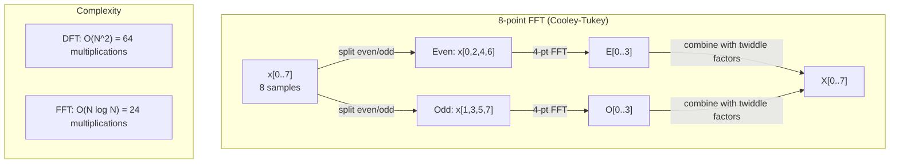
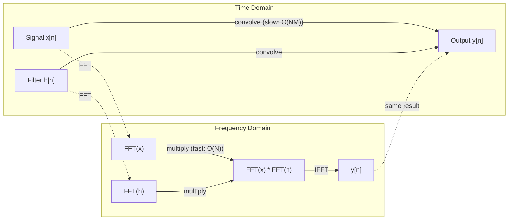

# Fourier 变换

> 每个信号都是正弦波的叠加。Fourier 变换告诉你其中有哪些。

**类型:** Build
**语言:** Python
**前置课程:** Phase 1, Lessons 01-04, 19（复数）
**时间:** ~90 分钟

## 学习目标

- 从零实现 DFT，并与 O(N log N) 的 Cooley-Tukey FFT 进行验证对比
- 解读频率系数：从信号中提取幅值、相位和功率谱
- 应用卷积定理，通过 FFT 乘法实现卷积
- 理解 Fourier 频率分解与 transformer 位置编码及 CNN 卷积层之间的联系

## 问题

音频录音是一段时间内的压力测量序列。股票价格是若干天内的数值序列。图像是空间中的像素强度网格。这些都是时域（或空域）中的数据——你看到的是某个索引上不断变化的数值。

但许多模式在时域中是不可见的。这个音频信号是纯音还是和弦？这支股票价格是否具有周周期？这张图像是否有重复纹理？这些问题都是关于频率成分的，而时域将其隐藏了起来。

Fourier 变换将数据从时域转换到频域。它接收一个信号，将其分解为不同频率的正弦波。每个正弦波都有一个幅值（强度）和一个相位（起始位置）。Fourier 变换同时给出这两个信息。

这对机器学习很重要，因为频域思维无处不在。卷积神经网络执行卷积运算，而卷积在频域中就是乘法。Transformer 位置编码使用频率分解来表示位置。音频模型（语音识别、音乐生成）在频谱图上工作——即声音的频率表示。时间序列模型寻找周期性模式。理解 Fourier 变换能让你具备使用所有这些技术的基础。

## 核心概念

### DFT 定义

给定 N 个采样值 x[0], x[1], ..., x[N-1]，离散 Fourier 变换产生 N 个频率系数 X[0], X[1], ..., X[N-1]：

```
X[k] = sum_{n=0}^{N-1} x[n] * e^(-2*pi*i*k*n/N)

for k = 0, 1, ..., N-1
```

每个 X[k] 是一个复数。它的模 |X[k]| 表示频率 k 的幅值。它的相位 angle(X[k]) 表示该频率的相位偏移。

核心洞见：`e^(-2*pi*i*k*n/N)` 是一个以频率 k 旋转的相量。DFT 计算信号与 N 个等间距频率之间的相关性。如果信号在频率 k 处有能量，相关性就大；如果没有，就接近零。

### 各系数的含义

**X[0]：直流分量。** 这是所有采样值的总和——与均值成正比。它代表信号的常数（零频率）偏移。

```
X[0] = sum_{n=0}^{N-1} x[n] * e^0 = sum of all samples
```

**X[k]（1 <= k <= N/2）：正频率。** X[k] 表示每 N 个采样周期内的频率 k。k 越大，频率越高（振荡越快）。

**X[N/2]：Nyquist 频率。** 用 N 个采样能表示的最高频率。超过此频率会产生混叠——高频伪装成低频。

**X[k]（N/2 < k < N）：负频率。** 对于实值信号，X[N-k] = conj(X[k])。负频率是正频率的镜像。这就是为什么有用信息集中在前 N/2 + 1 个系数中。

### 逆 DFT

逆 DFT 从频率系数重建原始信号：

```
x[n] = (1/N) * sum_{k=0}^{N-1} X[k] * e^(2*pi*i*k*n/N)

for n = 0, 1, ..., N-1
```

与正向 DFT 的唯一区别：指数中的符号为正（而非负），并有一个 1/N 的归一化因子。

逆 DFT 是完美重建，不会丢失任何信息。你可以从时域到频域再回来，没有任何误差。DFT 是一种基变换——它用不同的坐标系重新表达相同的信息。

### FFT：加速计算

上述定义的 DFT 是 O(N^2) 的：对 N 个输出系数中的每一个，都要对 N 个输入采样求和。当 N = 100 万时，需要 10^12 次运算。

快速 Fourier 变换（FFT）用 O(N log N) 计算相同的结果。当 N = 100 万时，大约只需 2000 万次运算，而不是一万亿次。这使得频率分析真正可行。

Cooley-Tukey 算法（最常见的 FFT）采用分治策略：

1. 将信号分为偶数索引和奇数索引采样。
2. 递归计算两半的 DFT。
3. 使用"旋转因子" e^(-2*pi*i*k/N) 将两个半长 DFT 合并。

```
X[k] = E[k] + e^(-2*pi*i*k/N) * O[k]          for k = 0, ..., N/2 - 1
X[k + N/2] = E[k] - e^(-2*pi*i*k/N) * O[k]    for k = 0, ..., N/2 - 1

where E = DFT of even-indexed samples
      O = DFT of odd-indexed samples
```

这种对称性意味着每一层递归的工作量为 O(N)，共有 log2(N) 层。总计：O(N log N)。



FFT 要求信号长度为 2 的幂。在实际应用中，信号会被零填充到下一个 2 的幂。

### 频谱分析

**功率谱**是 |X[k]|^2——每个频率系数的模的平方。它显示了每个频率上有多少能量。

**相位谱**是 angle(X[k])——每个频率分量的相位偏移。对于大多数分析任务，你关心的是功率谱，而忽略相位。

```
Power at frequency k:  P[k] = |X[k]|^2 = X[k].real^2 + X[k].imag^2
Phase at frequency k:  phi[k] = atan2(X[k].imag, X[k].real)
```

### 频率分辨率

DFT 的频率分辨率取决于采样数 N 和采样率 fs。

```
Frequency of bin k:      f_k = k * fs / N
Frequency resolution:    delta_f = fs / N
Maximum frequency:       f_max = fs / 2  (Nyquist)
```

要分辨两个靠得很近的频率，需要更多采样。要捕获高频信号，需要更高的采样率。

### 卷积定理

这是信号处理中最重要的结果之一，与 CNN 直接相关。

**时域中的卷积等于频域中的逐点乘法。**

```
x * h = IFFT(FFT(x) . FFT(h))

where * is convolution and . is element-wise multiplication
```

为什么这很重要：

- 两个长度为 N 和 M 的信号直接卷积需要 O(N*M) 次运算。
- 基于 FFT 的卷积只需 O(N log N)：对两者做变换、相乘、再反变换。
- 对于大卷积核，FFT 卷积明显更快。
- 这正是具有大感受野的卷积层中发生的事情。

注意：DFT 计算的是循环卷积（信号会环绕）。要实现线性卷积（无环绕），需要在计算前将两个信号零填充到长度 N + M - 1。



### 加窗

DFT 假设信号是周期性的——它将 N 个采样视为无限重复信号的一个周期。如果信号的起始值和结束值不同，就会在边界处产生不连续性，表现为虚假的高频成分。这称为频谱泄漏。

加窗通过在计算 DFT 之前将信号两端逐渐衰减到零来减少泄漏。

常用窗函数：

| 窗函数 | 形状 | 主瓣宽度 | 旁瓣电平 | 使用场景 |
|--------|------|---------|---------|---------|
| 矩形窗 | 平坦（无窗） | 最窄 | 最高 (-13 dB) | 信号恰好在 N 个采样内为周期信号时 |
| Hann 窗 | 升余弦 | 中等 | 较低 (-31 dB) | 通用频谱分析 |
| Hamming 窗 | 修正余弦 | 中等 | 更低 (-42 dB) | 音频处理、语音分析 |
| Blackman 窗 | 三重余弦 | 宽 | 非常低 (-58 dB) | 旁瓣抑制要求严格时 |

```
Hann window:    w[n] = 0.5 * (1 - cos(2*pi*n / (N-1)))
Hamming window: w[n] = 0.54 - 0.46 * cos(2*pi*n / (N-1))
```

在 DFT 之前将窗函数与信号逐点相乘即可应用窗：`X = DFT(x * w)`。

### DFT 性质

| 性质 | 时域 | 频域 |
|------|------|------|
| 线性 | a*x + b*y | a*X + b*Y |
| 时移 | x[n - k] | X[f] * e^(-2*pi*i*f*k/N) |
| 频移 | x[n] * e^(2*pi*i*f0*n/N) | X[f - f0] |
| 卷积 | x * h | X * H（逐点） |
| 乘法 | x * h（逐点） | X * H（循环卷积，缩放 1/N） |
| Parseval 定理 | sum \|x[n]\|^2 | (1/N) * sum \|X[k]\|^2 |
| 共轭对称性（实输入） | x[n] 实数 | X[k] = conj(X[N-k]) |

Parseval 定理表明总能量在两个域中是相同的。能量在变换过程中守恒。

### 与位置编码的关联

原始 Transformer 使用正弦位置编码：

```
PE(pos, 2i)   = sin(pos / 10000^(2i/d_model))
PE(pos, 2i+1) = cos(pos / 10000^(2i/d_model))
```

每一对维度 (2i, 2i+1) 以不同的频率振荡。频率从高（维度 0,1）到低（最后的维度）呈几何级数排列。这使得每个位置在所有频带上都有一个独特的模式——类似于 Fourier 系数唯一标识一个信号的方式。

这提供了以下关键性质：

- **唯一性：** 没有两个位置具有相同的编码。
- **有界值：** sin 和 cos 始终在 [-1, 1] 范围内。
- **相对位置：** 位置 p+k 的编码可以表示为位置 p 编码的线性函数。模型可以学习关注相对位置。

### 与 CNN 的关联

卷积层通过将学习到的滤波器（卷积核）在信号或图像上滑动来处理输入。从数学上讲，这就是卷积运算。

根据卷积定理，这等价于：
1. 对输入做 FFT
2. 对卷积核做 FFT
3. 在频域中相乘
4. 对结果做 IFFT

标准 CNN 实现使用直接卷积（对小的 3x3 卷积核更快）。但对于大卷积核或全局卷积，基于 FFT 的方法明显更快。某些架构（如 FNet）完全用 FFT 替代 attention，以 O(N log N) 而非 O(N^2) 的复杂度实现了具有竞争力的精度。

### 频谱图与短时 Fourier 变换

单次 FFT 给出整个信号的频率成分，但无法告诉你这些频率何时出现。一个啁啾信号（频率随时间增加的信号）和一个和弦（所有频率同时存在）可以具有相同的幅度谱。

短时 Fourier 变换（STFT）通过在信号的重叠窗口上计算 FFT 来解决这个问题。结果是一个频谱图：一个二维表示，一个轴是时间，另一个轴是频率。每个点的强度表示该时刻该频率的能量。

```
STFT procedure:
1. Choose a window size (e.g., 1024 samples)
2. Choose a hop size (e.g., 256 samples -- 75% overlap)
3. For each window position:
   a. Extract the windowed segment
   b. Apply a Hann/Hamming window
   c. Compute FFT
   d. Store the magnitude spectrum as one column of the spectrogram
```

频谱图是音频机器学习模型的标准输入表示。语音识别模型（Whisper、DeepSpeech）在 mel 频谱图上工作——即频率映射到 mel 刻度的频谱图，mel 刻度更符合人类的音高感知。

### 混叠

如果信号包含高于 fs/2（Nyquist 频率）的频率，以采样率 fs 采样会产生混叠副本。一个 90 Hz 的信号以 100 Hz 采样看起来与 10 Hz 的信号完全相同。仅从采样值无法区分它们。

```
Example:
  True signal: 90 Hz sine wave
  Sampling rate: 100 Hz
  Apparent frequency: 100 - 90 = 10 Hz

  The samples from the 90 Hz signal at 100 Hz sampling rate
  are identical to the samples from a 10 Hz signal.
  No amount of math can recover the original 90 Hz.
```

这就是为什么模数转换器包含抗混叠滤波器，在采样前去除高于 Nyquist 频率的成分。在机器学习中，当对特征图进行下采样而没有适当的低通滤波时就会出现混叠——某些架构通过抗混叠池化层来解决这个问题。

### 零填充不能提高分辨率

一个常见误解：在 FFT 前对信号进行零填充可以提高频率分辨率。事实并非如此。零填充在现有频率仓之间进行插值，使频谱看起来更平滑。但它无法揭示原始采样中不存在的频率细节。

真正的频率分辨率仅取决于观测时间 T = N / fs。要分辨间隔为 delta_f 的两个频率，至少需要 T = 1 / delta_f 秒的数据。再多的零填充也无法改变这个基本限制。

## 动手构建

### 第 1 步：从零实现 DFT

O(N^2) 的 DFT 直接由定义得出。

```python
import math

class Complex:
    ...

def dft(x):
    N = len(x)
    result = []
    for k in range(N):
        total = Complex(0, 0)
        for n in range(N):
            angle = -2 * math.pi * k * n / N
            w = Complex(math.cos(angle), math.sin(angle))
            xn = x[n] if isinstance(x[n], Complex) else Complex(x[n])
            total = total + xn * w
        result.append(total)
    return result
```

### 第 2 步：逆 DFT

结构相同，指数为正，除以 N。

```python
def idft(X):
    N = len(X)
    result = []
    for n in range(N):
        total = Complex(0, 0)
        for k in range(N):
            angle = 2 * math.pi * k * n / N
            w = Complex(math.cos(angle), math.sin(angle))
            total = total + X[k] * w
        result.append(Complex(total.real / N, total.imag / N))
    return result
```

### 第 3 步：FFT（Cooley-Tukey）

递归 FFT 要求长度为 2 的幂。分为偶数和奇数部分，递归计算，用旋转因子合并。

```python
def fft(x):
    N = len(x)
    if N <= 1:
        return [x[0] if isinstance(x[0], Complex) else Complex(x[0])]
    if N % 2 != 0:
        return dft(x)

    even = fft([x[i] for i in range(0, N, 2)])
    odd = fft([x[i] for i in range(1, N, 2)])

    result = [Complex(0)] * N
    for k in range(N // 2):
        angle = -2 * math.pi * k / N
        twiddle = Complex(math.cos(angle), math.sin(angle))
        t = twiddle * odd[k]
        result[k] = even[k] + t
        result[k + N // 2] = even[k] - t
    return result
```

### 第 4 步：频谱分析辅助函数

```python
def power_spectrum(X):
    return [xk.real ** 2 + xk.imag ** 2 for xk in X]

def convolve_fft(x, h):
    N = len(x) + len(h) - 1
    padded_N = 1
    while padded_N < N:
        padded_N *= 2

    x_padded = x + [0.0] * (padded_N - len(x))
    h_padded = h + [0.0] * (padded_N - len(h))

    X = fft(x_padded)
    H = fft(h_padded)

    Y = [xk * hk for xk, hk in zip(X, H)]

    y = idft(Y)
    return [y[n].real for n in range(N)]
```

## 用起来

在实际工作中，使用 numpy 的 FFT，它由高度优化的 C 库支持。

```python
import numpy as np

signal = np.sin(2 * np.pi * 5 * np.arange(256) / 256)
spectrum = np.fft.fft(signal)
freqs = np.fft.fftfreq(256, d=1/256)

power = np.abs(spectrum) ** 2

positive_freqs = freqs[:len(freqs)//2]
positive_power = power[:len(power)//2]
```

加窗和更高级的频谱分析：

```python
from scipy.signal import windows, stft

window = windows.hann(256)
windowed = signal * window
spectrum = np.fft.fft(windowed)
```

卷积：

```python
from scipy.signal import fftconvolve

result = fftconvolve(signal, kernel, mode='full')
```

频谱图：

```python
from scipy.signal import stft

frequencies, times, Zxx = stft(signal, fs=sample_rate, nperseg=256)
spectrogram = np.abs(Zxx) ** 2
```

频谱图矩阵的形状为 (n_frequencies, n_time_frames)。每一列是一个时间窗口的功率谱。这就是音频机器学习模型接收的输入。

## 交付

运行 `code/fourier.py` 生成 `outputs/prompt-spectral-analyzer.md`。

## 练习

1. **纯音识别。** 创建一个包含单一正弦波的信号，频率未知（在 1 到 50 Hz 之间），以 128 Hz 采样 1 秒。使用你的 DFT 识别频率。验证答案是否匹配。然后添加标准差为 0.5 的高斯噪声并重复。噪声如何影响频谱？

2. **FFT 与 DFT 验证。** 生成一个长度为 64 的随机信号。分别计算 DFT（O(N^2)）和 FFT。验证所有系数在 1e-10 的误差范围内一致。对长度为 256、512、1024 和 2048 的信号分别计时两个函数。绘制 DFT 时间与 FFT 时间的比值图。

3. **用实例证明卷积定理。** 创建信号 x = [1, 2, 3, 4, 0, 0, 0, 0] 和滤波器 h = [1, 1, 1, 0, 0, 0, 0, 0]。直接计算它们的循环卷积（嵌套循环）。然后通过 FFT 计算（变换、相乘、逆变换）。验证结果一致。现在通过适当零填充进行线性卷积。

4. **加窗效果。** 创建一个由 10 Hz 和 12 Hz 两个正弦波叠加的信号（非常接近）。以 128 Hz 采样 1 秒。分别用无窗、Hann 窗和 Hamming 窗计算功率谱。哪个窗函数最便于区分两个峰值？为什么？

5. **位置编码分析。** 生成 d_model = 128 和 max_pos = 512 的正弦位置编码。对于每一对位置 (p1, p2)，计算它们编码的点积。证明点积仅取决于 |p1 - p2|，而与绝对位置无关。随着距离增大，点积会发生什么变化？

## 关键术语

| 术语 | 含义 |
|------|------|
| DFT（离散 Fourier 变换） | 将 N 个时域采样转换为 N 个频域系数。每个系数是与该频率复正弦波的相关性 |
| FFT（快速 Fourier 变换） | O(N log N) 的 DFT 计算算法。Cooley-Tukey 算法递归地将偶/奇索引分开处理 |
| 逆 DFT | 从频率系数重建时域信号。与 DFT 公式相同，但指数符号翻转并有 1/N 缩放 |
| 频率仓 | DFT 输出中的每个索引 k 代表频率 k*fs/N Hz。"仓"是离散的频率槽位 |
| 直流分量 | X[0]，零频率系数。与信号均值成正比 |
| Nyquist 频率 | fs/2，采样率 fs 下可表示的最大频率。高于此频率的信号会产生混叠 |
| 功率谱 | \|X[k]\|^2，每个频率系数的模的平方。显示能量在各频率上的分布 |
| 相位谱 | angle(X[k])，每个频率分量的相位偏移。在分析中通常被忽略 |
| 频谱泄漏 | 将非周期信号视为周期信号而产生的虚假频率成分。通过加窗来减少 |
| 窗函数 | 在 DFT 之前应用的衰减函数（Hann、Hamming、Blackman），用于减少频谱泄漏 |
| 旋转因子 | FFT 蝶形运算中用于合并子 DFT 的复指数 e^(-2*pi*i*k/N) |
| 卷积定理 | 时域中的卷积等于频域中的逐点乘法。信号处理和 CNN 的基础 |
| 循环卷积 | 信号环绕的卷积。这是 DFT 自然计算的结果 |
| 线性卷积 | 无环绕的标准卷积。通过在 DFT 前零填充来实现 |
| Parseval 定理 | 总能量在 Fourier 变换中保持不变。sum \|x[n]\|^2 = (1/N) sum \|X[k]\|^2 |
| 混叠 | 当频率高于 Nyquist 频率时，由于采样率不足而表现为较低频率的现象 |

## 延伸阅读

- [Cooley & Tukey: An Algorithm for the Machine Calculation of Complex Fourier Series (1965)](https://www.ams.org/journals/mcom/1965-19-090/S0025-5718-1965-0178586-1/) - 改变了计算领域的原始 FFT 论文
- [3Blue1Brown: But what is the Fourier Transform?](https://www.youtube.com/watch?v=spUNpyF58BY) - 最佳的 Fourier 变换可视化入门
- [Lee-Thorp et al.: FNet: Mixing Tokens with Fourier Transforms (2021)](https://arxiv.org/abs/2105.03824) - 在 transformer 中用 FFT 替代 self-attention
- [Smith: The Scientist and Engineer's Guide to Digital Signal Processing](http://www.dspguide.com/) - 免费在线教材，深入讲解 FFT、加窗和频谱分析
- [Vaswani et al.: Attention Is All You Need (2017)](https://arxiv.org/abs/1706.03762) - 源自 Fourier 频率分解的正弦位置编码
- [Radford et al.: Whisper (2022)](https://arxiv.org/abs/2212.04356) - 使用 mel 频谱图作为输入表示的语音识别
