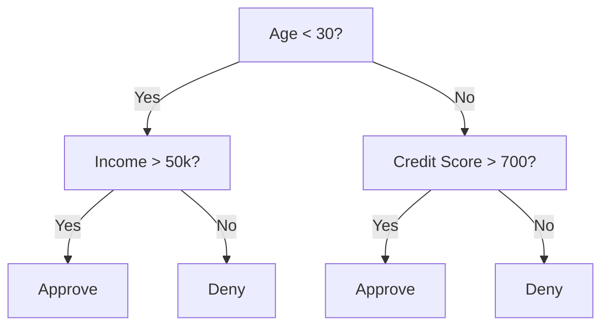
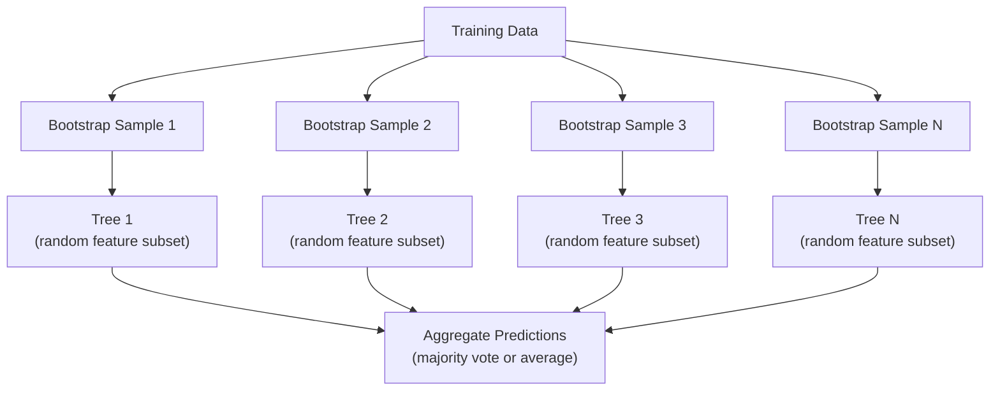

# 决策树与随机森林

> 决策树就是一个流程图。但一片森林是 ML 中最强大的工具之一。

**类型：** 构建
**语言：** Python
**前置知识：** Phase 1（第 09 课信息论，第 06 课概率）
**时间：** 约 90 分钟

## 学习目标

- 实现 Gini impurity、entropy 和 information gain 的计算，找到最优决策树分裂点
- 从零构建带预剪枝控制（max depth、min samples）的决策树分类器
- 使用 bootstrap 采样和 feature 随机化构建随机森林，并解释为什么它能降低 variance
- 比较 MDI feature importance 和 permutation importance，识别 MDI 何时有偏

## 问题

你有表格数据。行是样本，列是 feature，还有一个你想预测的目标列。你可以用神经网络。但对于表格数据，基于树的模型（决策树、随机森林、梯度提升树）始终优于深度学习。Kaggle 上结构化数据的竞赛被 XGBoost 和 LightGBM 主导，而不是 transformer。

为什么？树天然处理混合 feature 类型（数值和分类），无需预处理。它们处理非线性关系，无需特征工程。它们是可解释的：你可以看着树，确切知道为什么做出了某个预测。而随机森林通过平均多棵树，在中等规模数据集上高度抗 overfitting。

本课从零使用递归分裂构建决策树，然后在其上构建随机森林。你将实现分裂准则背后的数学（Gini impurity、entropy、information gain），并理解为什么弱学习器的集成能变成强学习器。

## 概念

### 决策树做什么

决策树通过一系列是/否问题将 feature 空间划分为矩形区域。



每个内部节点测试一个 feature 是否超过阈值。每个叶节点做出预测。要分类一个新数据点，从根节点开始沿着分支走，直到到达叶节点。

树是自顶向下构建的，在每个节点选择最能分离数据的 feature 和阈值。"最好"由分裂准则定义。

### 分裂准则：衡量不纯度

在每个节点，我们有一组样本。我们想分裂它们，使得子节点尽可能"纯"，即每个子节点主要包含一个类别。

**Gini impurity** 衡量如果按该节点的类别分布随机标注一个随机选择的样本，被错误分类的概率。

```
Gini(S) = 1 - sum(p_k^2)

where p_k is the proportion of class k in set S.
```

对于纯节点（全是一个类别），Gini = 0。对于 50/50 的二分类，Gini = 0.5。越低越好。

```
Example: 6 cats, 4 dogs

Gini = 1 - (0.6^2 + 0.4^2) = 1 - (0.36 + 0.16) = 0.48
```

**Entropy** 衡量节点中的信息含量（无序度）。在 Phase 1 第 09 课中介绍过。

```
Entropy(S) = -sum(p_k * log2(p_k))
```

对于纯节点，entropy = 0。对于 50/50 的二分类，entropy = 1.0。越低越好。

```
Example: 6 cats, 4 dogs

Entropy = -(0.6 * log2(0.6) + 0.4 * log2(0.4))
        = -(0.6 * -0.737 + 0.4 * -1.322)
        = 0.442 + 0.529
        = 0.971 bits
```

**Information gain** 是分裂后不纯度的减少量。

```
IG(S, feature, threshold) = Impurity(S) - weighted_avg(Impurity(S_left), Impurity(S_right))

where the weights are the proportions of samples in each child.
```

每个节点的贪心算法：尝试每个 feature 和每个可能的阈值。选择使 information gain 最大的 (feature, threshold) 对。

### 分裂如何工作

对于当前节点有 n 个 feature 和 m 个样本的数据集：

1. 对每个 feature j（j = 1 到 n）：
   - 按 feature j 排序样本
   - 尝试连续不同值之间的每个中点作为阈值
   - 计算每个阈值的 information gain
2. 选择 information gain 最高的 feature 和阈值
3. 将数据分为左（feature <= threshold）和右（feature > threshold）
4. 对每个子节点递归

这种贪心方法不保证全局最优树。找到最优树是 NP-hard 的。但贪心分裂在实践中效果很好。

### 停止条件

没有停止条件，树会一直生长直到每个叶节点都是纯的（每个叶一个样本）。这完美记住了训练数据，但泛化能力很差。

**预剪枝（Pre-pruning）** 在树完全生长之前停止：
- 最大深度：当树达到设定深度时停止分裂
- 叶节点最小样本数：如果节点样本少于 k 个则停止
- 最小 information gain：如果最佳分裂的不纯度改善小于阈值则停止
- 最大叶节点数：限制叶节点总数

**后剪枝（Post-pruning）** 先生长完整的树，然后修剪：
- 代价复杂度剪枝（scikit-learn 使用）：添加与叶节点数成比例的惩罚。增加惩罚得到更小的树
- 减少误差剪枝：如果验证误差不增加就移除子树

预剪枝更简单更快。后剪枝通常产生更好的树，因为它不会过早停止可能导致有用后续分裂的分裂。

### 回归决策树

对于回归，叶节点的预测是该叶中目标值的均值。分裂准则也变了：

**方差减少（Variance reduction）** 替代 information gain：

```
VR(S, feature, threshold) = Var(S) - weighted_avg(Var(S_left), Var(S_right))
```

选择方差减少最多的分裂。树将输入空间划分为区域，在每个区域预测一个常数（均值）。

### 随机森林：集成的力量

单棵决策树 variance 很高。数据的小变化可能产生完全不同的树。随机森林通过平均多棵树来解决这个问题。



两个随机性来源使树多样化：

**Bagging（bootstrap aggregating）：** 每棵树在一个 bootstrap 样本上训练，即从训练数据中有放回地随机抽样。大约 63% 的原始样本出现在每个 bootstrap 中（其余是 out-of-bag 样本，可用于验证）。

**Feature 随机化：** 在每次分裂时，只考虑 feature 的一个随机子集。对于分类，默认是 sqrt(n_features)。对于回归，是 n_features/3。这防止所有树都在同一个主导 feature 上分裂。

关键洞察：平均多棵去相关的树可以降低 variance 而不增加 bias。每棵单独的树可能很一般。但集成是强大的。

### Feature importance

随机森林天然提供 feature importance 分数。最常见的方法：

**Mean Decrease in Impurity (MDI)：** 对每个 feature，在所有树和所有使用该 feature 的节点上，累加不纯度的总减少量。在更早的分裂中产生更大不纯度减少的 feature 更重要。

```
importance(feature_j) = sum over all nodes where feature_j is used:
    (n_samples_at_node / n_total_samples) * impurity_decrease
```

这很快（训练时计算），但对高基数 feature 和有很多可能分裂点的 feature 有偏。

**Permutation importance** 是替代方案：打乱一个 feature 的值，衡量 model 准确率下降多少。更可靠但更慢。

### 树何时胜过神经网络

树和森林在表格数据上主导神经网络。原因有几个：

| 因素 | 树 | 神经网络 |
|--------|-------|----------------|
| 混合类型（数值 + 分类） | 原生支持 | 需要编码 |
| 小数据集（< 10k 行） | 效果好 | 容易 overfit |
| Feature 交互 | 通过分裂发现 | 需要架构设计 |
| 可解释性 | 完全透明 | 黑箱 |
| 训练时间 | 分钟级 | 小时级 |
| 超参数敏感度 | 低 | 高 |

当数据有空间或序列结构时（图像、文本、音频），神经网络胜出。对于平坦的 feature 表格，树是默认选择。

## 动手构建

### 第 1 步：Gini impurity 和 entropy

从零构建两种分裂准则，验证它们在哪些分裂是好的上达成一致。

```python
import math

def gini_impurity(labels):
    n = len(labels)
    if n == 0:
        return 0.0
    counts = {}
    for label in labels:
        counts[label] = counts.get(label, 0) + 1
    return 1.0 - sum((c / n) ** 2 for c in counts.values())

def entropy(labels):
    n = len(labels)
    if n == 0:
        return 0.0
    counts = {}
    for label in labels:
        counts[label] = counts.get(label, 0) + 1
    return -sum(
        (c / n) * math.log2(c / n) for c in counts.values() if c > 0
    )
```

### 第 2 步：找到最佳分裂

尝试每个 feature 和每个阈值。返回 information gain 最高的那个。

```python
def information_gain(parent_labels, left_labels, right_labels, criterion="gini"):
    measure = gini_impurity if criterion == "gini" else entropy
    n = len(parent_labels)
    n_left = len(left_labels)
    n_right = len(right_labels)
    if n_left == 0 or n_right == 0:
        return 0.0
    parent_impurity = measure(parent_labels)
    child_impurity = (
        (n_left / n) * measure(left_labels) +
        (n_right / n) * measure(right_labels)
    )
    return parent_impurity - child_impurity
```

### 第 3 步：构建 DecisionTree 类

递归分裂、预测和 feature importance 跟踪。

```python
class DecisionTree:
    def __init__(self, max_depth=None, min_samples_split=2,
                 min_samples_leaf=1, criterion="gini",
                 max_features=None):
        self.max_depth = max_depth
        self.min_samples_split = min_samples_split
        self.min_samples_leaf = min_samples_leaf
        self.criterion = criterion
        self.max_features = max_features
        self.tree = None
        self.feature_importances_ = None

    def fit(self, X, y):
        self.n_features = len(X[0])
        self.feature_importances_ = [0.0] * self.n_features
        self.n_samples = len(X)
        self.tree = self._build(X, y, depth=0)
        total = sum(self.feature_importances_)
        if total > 0:
            self.feature_importances_ = [
                fi / total for fi in self.feature_importances_
            ]

    def predict(self, X):
        return [self._predict_one(x, self.tree) for x in X]
```

### 第 4 步：构建 RandomForest 类

Bootstrap 采样、feature 随机化和多数投票。

```python
class RandomForest:
    def __init__(self, n_trees=100, max_depth=None,
                 min_samples_split=2, max_features="sqrt",
                 criterion="gini"):
        self.n_trees = n_trees
        self.max_depth = max_depth
        self.min_samples_split = min_samples_split
        self.max_features = max_features
        self.criterion = criterion
        self.trees = []

    def fit(self, X, y):
        n = len(X)
        for _ in range(self.n_trees):
            indices = [random.randint(0, n - 1) for _ in range(n)]
            X_boot = [X[i] for i in indices]
            y_boot = [y[i] for i in indices]
            tree = DecisionTree(
                max_depth=self.max_depth,
                min_samples_split=self.min_samples_split,
                max_features=self.max_features,
                criterion=self.criterion,
            )
            tree.fit(X_boot, y_boot)
            self.trees.append(tree)

    def predict(self, X):
        all_preds = [tree.predict(X) for tree in self.trees]
        predictions = []
        for i in range(len(X)):
            votes = {}
            for preds in all_preds:
                v = preds[i]
                votes[v] = votes.get(v, 0) + 1
            predictions.append(max(votes, key=votes.get))
        return predictions
```

完整实现及所有辅助方法见 `code/trees.py`。

## 实际使用

用 scikit-learn 训练随机森林只需三行：

```python
from sklearn.ensemble import RandomForestClassifier
from sklearn.datasets import load_iris
from sklearn.model_selection import train_test_split

X, y = load_iris(return_X_y=True)
X_train, X_test, y_train, y_test = train_test_split(X, y, random_state=42)

rf = RandomForestClassifier(n_estimators=100, random_state=42)
rf.fit(X_train, y_train)
print(f"Accuracy: {rf.score(X_test, y_test):.4f}")
print(f"Feature importances: {rf.feature_importances_}")
```

实践中，梯度提升树（XGBoost、LightGBM、CatBoost）通常比随机森林更强，因为它们顺序构建树，每棵树纠正前一棵的错误。但随机森林更难配置错误，几乎不需要超参数调优。

## 交付物

本课产出 `outputs/prompt-tree-interpreter.md` -- 一个为业务利益相关者解释决策树分裂的 prompt。输入训练好的树的结构（深度、feature、分裂阈值、准确率），它会将 model 翻译成通俗语言规则，排列 feature importance，标记 overfitting 或数据泄漏，并推荐下一步。任何时候你需要向不读代码的人解释基于树的 model 时使用它。

## 练习

1. 在一个有 3 个类别的二维数据集上训练单棵决策树。手动追踪分裂并画出矩形决策边界。比较 max_depth=2 和 max_depth=10 时的边界。

2. 实现回归树的方差减少分裂。对 200 个点生成 y = sin(x) + noise 并拟合你的回归树。画出树的分段常数预测与真实曲线的对比。

3. 构建有 1、5、10、50 和 200 棵树的随机森林。画出训练准确率和测试准确率 vs 树的数量。观察测试准确率趋于平稳但不下降（森林抗 overfitting）。

4. 在 5 个不同数据集上比较 Gini impurity 和 entropy 作为分裂准则。衡量准确率和树深度。大多数情况下，它们产生几乎相同的结果。解释为什么。

5. 实现 permutation importance。在一个数据集上将它与 MDI importance 比较，其中一个 feature 是随机噪声但基数很高。MDI 会将噪声 feature 排得很高。Permutation importance 不会。

## 关键术语

| 术语 | 通俗说法 | 实际含义 |
|------|----------------|----------------------|
| Decision tree | "预测用的流程图" | 通过学习一系列 if/else 分裂将 feature 空间划分为矩形区域的 model |
| Gini impurity | "节点有多混" | 在节点随机分类一个样本被错误分类的概率。0 = 纯，0.5 = 二分类最大不纯度 |
| Entropy | "节点的无序度" | 节点的信息含量。0 = 纯，1.0 = 二分类最大不确定性。来自信息论 |
| Information gain | "分裂有多好" | 分裂后不纯度的减少量。选择分裂的贪心准则 |
| Pre-pruning | "提前停止树" | 通过设置最大深度、最小样本数或最小增益阈值来提前停止树的生长 |
| Post-pruning | "事后修剪树" | 先生长完整的树，然后移除不改善验证性能的子树 |
| Bagging | "在随机子集上训练" | Bootstrap aggregating。每个 model 在不同的有放回随机样本上训练 |
| Random forest | "一堆树" | 决策树的集成，每棵在 bootstrap 样本上训练，每次分裂使用随机 feature 子集 |
| Feature importance (MDI) | "哪些 feature 重要" | 每个 feature 贡献的总不纯度减少，在所有树和节点上求和 |
| Permutation importance | "打乱后检查" | 随机打乱一个 feature 的值后准确率的下降。比 MDI 对噪声 feature 更可靠 |
| Variance reduction | "回归版的 info gain" | 回归树中 information gain 的类比。选择目标方差减少最多的分裂 |
| Bootstrap sample | "有重复的随机样本" | 从原始数据集有放回抽取的随机样本。大小相同，但有重复 |

## 延伸阅读

- [Breiman: Random Forests (2001)](https://link.springer.com/article/10.1023/A:1010933404324) - 随机森林的原始论文
- [Grinsztajn et al.: Why do tree-based models still outperform deep learning on tabular data? (2022)](https://arxiv.org/abs/2207.08815) - 树与神经网络在表格任务上的严格比较
- [scikit-learn Decision Trees documentation](https://scikit-learn.org/stable/modules/tree.html) - 实用指南，附可视化工具
- [XGBoost: A Scalable Tree Boosting System (Chen & Guestrin, 2016)](https://arxiv.org/abs/1603.02754) - 主导 Kaggle 的梯度提升论文
