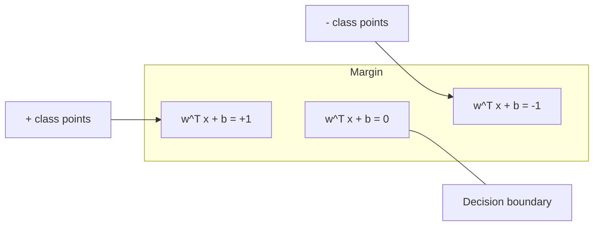
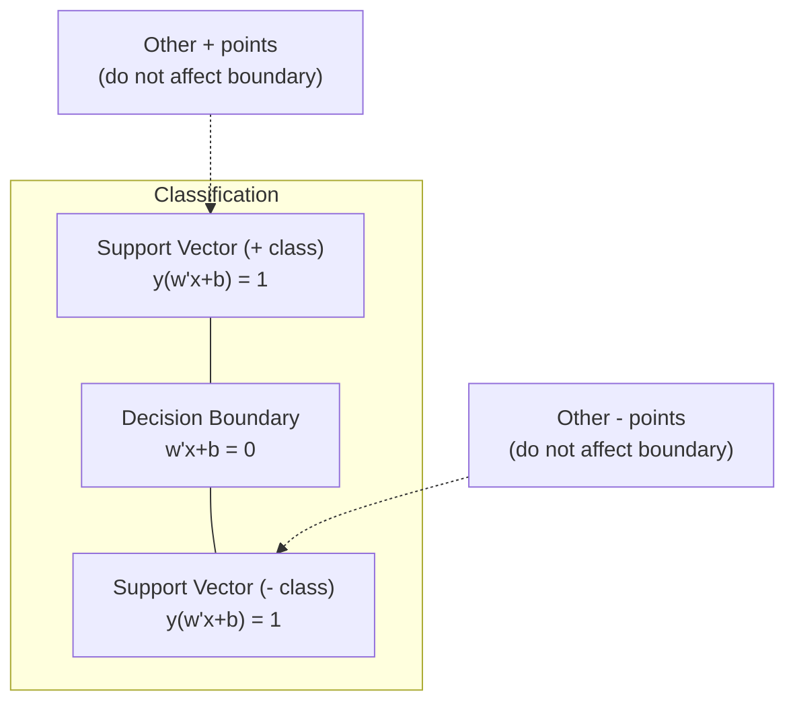
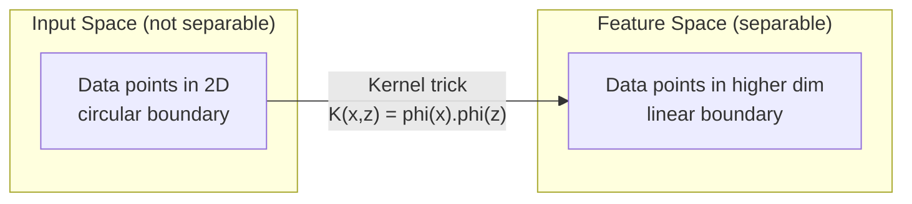

# 支持向量机

> 在两个类别之间找到最宽的街道。这就是全部思想。

**类型：** 构建
**语言：** Python
**前置知识：** Phase 1（第 08 课优化，第 14 课范数与距离，第 18 课凸优化）
**时间：** 约 90 分钟

## 学习目标

- 使用 hinge loss 和 gradient descent 在 primal formulation 上从零实现线性 SVM
- 解释最大间隔原理，并从训练好的 model 中识别 support vectors
- 比较 linear、polynomial 和 RBF kernel，解释 kernel trick 如何避免显式高维映射
- 评估 C 参数在间隔宽度和分类错误之间控制的权衡

## 问题

你有两类数据点，需要画一条线（或超平面）将它们分开。无穷多条线都可以。你应该选哪一条？

间隔最大的那条。间隔是决策边界与两侧最近数据点之间的距离。更宽的间隔意味着分类器更有信心，对未见数据泛化更好。

这个直觉引出了支持向量机，ML 中数学上最优雅的算法之一。SVM 在深度学习之前是主导的分类方法，对于小数据集、高维数据以及需要有理论保证的、原理清晰的 model 的问题，它仍然是最佳选择。

SVM 直接连接到 Phase 1：优化是凸的（第 18 课），间隔用范数衡量（第 14 课），kernel trick 利用点积来处理非线性边界，而无需在高维空间中实际计算。

## 概念

### 最大间隔分类器

给定线性可分的数据，标签 y_i 属于 {-1, +1}，feature 向量为 x_i，我们想要一个超平面 w^T x + b = 0 来分隔类别。

点 x_i 到超平面的距离是：

```
distance = |w^T x_i + b| / ||w||
```

对于正确分类的点：y_i * (w^T x_i + b) > 0。间隔是超平面到两侧最近点距离的两倍。



优化问题：

```
maximize    2 / ||w||     (the margin width)
subject to  y_i * (w^T x_i + b) >= 1  for all i
```

等价地（最小化 ||w||^2 更容易优化）：

```
minimize    (1/2) ||w||^2
subject to  y_i * (w^T x_i + b) >= 1  for all i
```

这是一个凸二次规划。它有唯一的全局解。恰好位于间隔边界上的数据点（其中 y_i * (w^T x_i + b) = 1）就是 support vectors。它们是唯一决定决策边界的点。移动或删除任何非 support vector 的点，边界不会改变。

### Support vectors：关键的少数



大多数训练点是无关的。只有 support vectors 重要。这就是为什么 SVM 在预测时内存高效：你只需要存储 support vectors，而不是整个训练集。

Support vectors 的数量还给出了泛化误差的上界。相对于数据集大小，support vectors 越少意味着泛化越好。

### Soft margin：用 C 参数处理噪声

真实数据很少完美可分。一些点可能在边界的错误一侧，或在间隔内部。Soft margin 公式通过引入松弛变量允许违反。

```
minimize    (1/2) ||w||^2 + C * sum(xi_i)
subject to  y_i * (w^T x_i + b) >= 1 - xi_i
            xi_i >= 0  for all i
```

松弛变量 xi_i 衡量点 i 违反间隔的程度。C 控制权衡：

| C 值 | 行为 |
|---------|----------|
| 大 C | 严重惩罚违反。窄间隔，更少误分类。容易 overfit |
| 小 C | 允许更多违反。宽间隔，更多误分类。容易 underfit |

C 是 regularization 强度的倒数。大 C = 少 regularization。小 C = 多 regularization。

### Hinge loss：SVM 的 loss function

Soft margin SVM 可以改写为无约束优化：

```
minimize    (1/2) ||w||^2 + C * sum(max(0, 1 - y_i * (w^T x_i + b)))
```

项 max(0, 1 - y_i * f(x_i)) 就是 hinge loss。当点被正确分类且在间隔之外时为零。当点在间隔内或被误分类时是线性的。

```
Hinge loss for a single point:

loss
  |
  | \
  |  \
  |   \
  |    \
  |     \_______________
  |
  +-----|-----|-------->  y * f(x)
       0     1

Zero loss when y*f(x) >= 1 (correctly classified, outside margin).
Linear penalty when y*f(x) < 1.
```

与 logistic loss（逻辑回归）比较：

```
Hinge:     max(0, 1 - y*f(x))          Hard cutoff at margin
Logistic:  log(1 + exp(-y*f(x)))        Smooth, never exactly zero
```

Hinge loss 产生稀疏解（只有 support vectors 有非零贡献）。Logistic loss 使用所有数据点。这使 SVM 在预测时更内存高效。

### 用 gradient descent 训练线性 SVM

你可以用 gradient descent 在 hinge loss 加 L2 regularization 上训练线性 SVM，无需求解约束 QP：

```
L(w, b) = (lambda/2) * ||w||^2 + (1/n) * sum(max(0, 1 - y_i * (w^T x_i + b)))

Gradient with respect to w:
  If y_i * (w^T x_i + b) >= 1:  dL/dw = lambda * w
  If y_i * (w^T x_i + b) < 1:   dL/dw = lambda * w - y_i * x_i

Gradient with respect to b:
  If y_i * (w^T x_i + b) >= 1:  dL/db = 0
  If y_i * (w^T x_i + b) < 1:   dL/db = -y_i
```

这叫做 primal formulation。每个 epoch 运行时间为 O(n * d)，其中 n 是样本数，d 是 feature 数。对于大规模、稀疏、高维数据（文本分类），这很快。

### 对偶公式和 kernel trick

SVM 问题的 Lagrangian 对偶（来自 Phase 1 第 18 课，KKT 条件）是：

```
maximize    sum(alpha_i) - (1/2) * sum_ij(alpha_i * alpha_j * y_i * y_j * (x_i . x_j))
subject to  0 <= alpha_i <= C
            sum(alpha_i * y_i) = 0
```

对偶只涉及数据点之间的点积 x_i . x_j。这是关键洞察。将每个点积替换为 kernel 函数 K(x_i, x_j)，SVM 就能学习非线性边界，而无需显式计算变换。

```
Linear kernel:      K(x, z) = x . z
Polynomial kernel:  K(x, z) = (x . z + c)^d
RBF (Gaussian):     K(x, z) = exp(-gamma * ||x - z||^2)
```

RBF kernel 将数据映射到无限维空间。输入空间中接近的点 kernel 值接近 1。远离的点 kernel 值接近 0。它可以学习任何光滑的决策边界。



Kernel trick 在高维空间中计算点积，而无需真正去到那里。对于 D 维中 d 次的 polynomial kernel，显式 feature 空间有 O(D^d) 维。但 K(x, z) 在 O(D) 时间内计算。

### SVM 回归（SVR）

Support Vector Regression 在数据周围拟合一个宽度为 epsilon 的管道。管道内的点 loss 为零。管道外的点线性惩罚。

```
minimize    (1/2) ||w||^2 + C * sum(xi_i + xi_i*)
subject to  y_i - (w^T x_i + b) <= epsilon + xi_i
            (w^T x_i + b) - y_i <= epsilon + xi_i*
            xi_i, xi_i* >= 0
```

Epsilon 参数控制管道宽度。更宽的管道 = 更少 support vectors = 更平滑的拟合。更窄的管道 = 更多 support vectors = 更紧的拟合。

### 为什么 SVM 输给了深度学习（以及何时仍然胜出）

SVM 从 1990 年代末到 2010 年代初主导 ML。深度学习超越它们有几个原因：

| 因素 | SVM | 深度学习 |
|--------|------|---------------|
| 特征工程 | 需要 | 自动学习 feature |
| 可扩展性 | kernel 为 O(n^2) 到 O(n^3) | SGD 每 epoch O(n) |
| 图像/文本/音频 | 需要手工 feature | 从原始数据学习 |
| 大数据集 (>100k) | 慢 | 扩展性好 |
| GPU 加速 | 收益有限 | 巨大加速 |

SVM 在以下情况仍然胜出：
- 小数据集（几百到几千个样本）
- 高维稀疏数据（TF-IDF feature 的文本）
- 需要数学保证时（间隔界）
- 训练时间必须最短时（线性 SVM 非常快）
- 有清晰间隔结构的二分类
- 异常检测（one-class SVM）

## 动手构建

### 第 1 步：Hinge loss 和梯度

基础。计算一个 batch 的 hinge loss 及其梯度。

```python
def hinge_loss(X, y, w, b):
    n = len(X)
    total_loss = 0.0
    for i in range(n):
        margin = y[i] * (dot(w, X[i]) + b)
        total_loss += max(0.0, 1.0 - margin)
    return total_loss / n
```

### 第 2 步：通过 gradient descent 训练线性 SVM

通过最小化正则化的 hinge loss 来训练。不需要 QP 求解器。

```python
class LinearSVM:
    def __init__(self, lr=0.001, lambda_param=0.01, n_epochs=1000):
        self.lr = lr
        self.lambda_param = lambda_param
        self.n_epochs = n_epochs
        self.w = None
        self.b = 0.0

    def fit(self, X, y):
        n_features = len(X[0])
        self.w = [0.0] * n_features
        self.b = 0.0

        for epoch in range(self.n_epochs):
            for i in range(len(X)):
                margin = y[i] * (dot(self.w, X[i]) + self.b)
                if margin >= 1:
                    self.w = [wj - self.lr * self.lambda_param * wj
                              for wj in self.w]
                else:
                    self.w = [wj - self.lr * (self.lambda_param * wj - y[i] * X[i][j])
                              for j, wj in enumerate(self.w)]
                    self.b -= self.lr * (-y[i])

    def predict(self, X):
        return [1 if dot(self.w, x) + self.b >= 0 else -1 for x in X]
```

### 第 3 步：Kernel 函数

实现 linear、polynomial 和 RBF kernel。

```python
def linear_kernel(x, z):
    return dot(x, z)

def polynomial_kernel(x, z, degree=3, c=1.0):
    return (dot(x, z) + c) ** degree

def rbf_kernel(x, z, gamma=0.5):
    diff = [xi - zi for xi, zi in zip(x, z)]
    return math.exp(-gamma * dot(diff, diff))
```

### 第 4 步：间隔和 support vector 识别

训练后，识别哪些点是 support vectors 并计算间隔宽度。

```python
def find_support_vectors(X, y, w, b, tol=1e-3):
    support_vectors = []
    for i in range(len(X)):
        margin = y[i] * (dot(w, X[i]) + b)
        if abs(margin - 1.0) < tol:
            support_vectors.append(i)
    return support_vectors
```

完整实现及所有演示见 `code/svm.py`。

## 实际使用

用 scikit-learn：

```python
from sklearn.svm import SVC, LinearSVC, SVR
from sklearn.preprocessing import StandardScaler
from sklearn.pipeline import Pipeline

clf = Pipeline([
    ("scaler", StandardScaler()),
    ("svm", SVC(kernel="rbf", C=1.0, gamma="scale")),
])
clf.fit(X_train, y_train)
print(f"Accuracy: {clf.score(X_test, y_test):.4f}")
print(f"Support vectors: {clf['svm'].n_support_}")
```

重要：训练 SVM 之前一定要缩放 feature。SVM 对 feature 量级敏感，因为间隔依赖于 ||w||，未缩放的 feature 会扭曲几何结构。

对于大数据集，使用 `LinearSVC`（primal formulation，每 epoch O(n)）而不是 `SVC`（dual formulation，O(n^2) 到 O(n^3)）：

```python
from sklearn.svm import LinearSVC

clf = Pipeline([
    ("scaler", StandardScaler()),
    ("svm", LinearSVC(C=1.0, max_iter=10000)),
])
```

## 练习

1. 生成一个二维线性可分数据集。训练你的 LinearSVM 并识别 support vectors。验证 support vectors 是离决策边界最近的点。

2. 在有噪声的数据集上将 C 从 0.001 变化到 1000。画出每个 C 值的决策边界。观察从宽间隔（underfitting）到窄间隔（overfitting）的过渡。

3. 创建一个类别边界是圆形（非线性）的数据集。展示线性 SVM 失败。计算 RBF kernel 矩阵并展示类别在 kernel 诱导的 feature 空间中变得可分。

4. 在同一数据集上比较 hinge loss 和 logistic loss。训练线性 SVM 和逻辑回归。计算有多少训练点对每个 model 的决策边界有贡献（support vectors vs 所有点）。

5. 实现 SVR（epsilon-insensitive loss）。在 y = sin(x) + noise 上拟合。画出预测周围的 epsilon 管道并高亮 support vectors（管道外的点）。

## 关键术语

| 术语 | 实际含义 |
|------|----------------------|
| Support vectors | 离决策边界最近的训练点。唯一决定超平面的点 |
| Margin | 决策边界与最近 support vectors 之间的距离。SVM 最大化它 |
| Hinge loss | max(0, 1 - y*f(x))。正确分类且在间隔外时为零。否则线性惩罚 |
| C parameter | 间隔宽度和分类错误之间的权衡。大 C = 窄间隔，小 C = 宽间隔 |
| Soft margin | 通过松弛变量允许间隔违反的 SVM 公式。处理不可分数据 |
| Kernel trick | 在高维 feature 空间中计算点积，而无需显式映射到该空间 |
| Linear kernel | K(x, z) = x . z。等价于标准点积。用于线性可分数据 |
| RBF kernel | K(x, z) = exp(-gamma * \|\|x-z\|\|^2)。映射到无限维。学习任何光滑边界 |
| Polynomial kernel | K(x, z) = (x . z + c)^d。映射到多项式组合的 feature 空间 |
| Dual formulation | SVM 问题的重新表述，只依赖数据点之间的点积。使 kernel 成为可能 |
| SVR | Support Vector Regression。在数据周围拟合 epsilon 管道。管道内的点 loss 为零 |
| Slack variables | xi_i：衡量一个点违反间隔的程度。对间隔外正确分类的点为零 |
| Maximum margin | 选择使到每个类别最近点距离最大化的超平面的原则 |

## 延伸阅读

- [Vapnik: The Nature of Statistical Learning Theory (1995)](https://link.springer.com/book/10.1007/978-1-4757-3264-1) - SVM 和统计学习理论的奠基性著作
- [Cortes & Vapnik: Support-vector networks (1995)](https://link.springer.com/article/10.1007/BF00994018) - SVM 的原始论文
- [Platt: Sequential Minimal Optimization (1998)](https://www.microsoft.com/en-us/research/publication/sequential-minimal-optimization-a-fast-algorithm-for-training-support-vector-machines/) - 使 SVM 训练变得实用的 SMO 算法
- [scikit-learn SVM documentation](https://scikit-learn.org/stable/modules/svm.html) - 实用指南，附实现细节
- [LIBSVM: A Library for Support Vector Machines](https://www.csie.ntu.edu.tw/~cjlin/libsvm/) - 大多数 SVM 实现背后的 C++ 库
