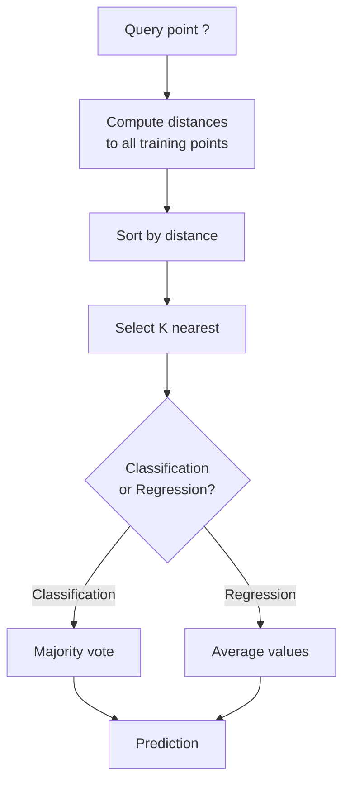
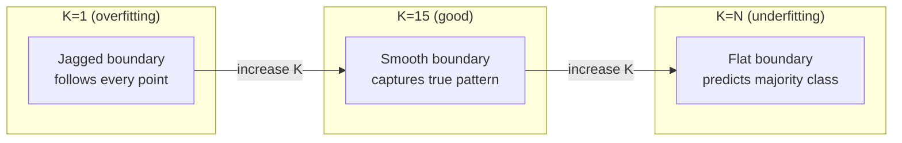
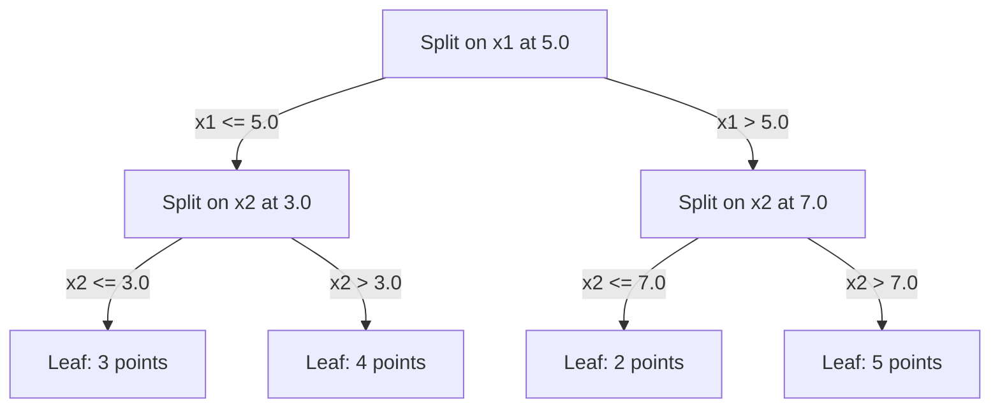

# K 近邻与距离度量

> 存储一切。通过看邻居来预测。最简单的、真正有效的算法。

**类型：** 构建
**语言：** Python
**前置知识：** Phase 1（第 14 课 范数与距离）
**时间：** 约 90 分钟

## 学习目标

- 从零实现 KNN 分类和回归，支持可配置的 K 和距离加权投票
- 比较 L1、L2、cosine 和 Minkowski 距离度量，并为给定数据类型选择合适的度量
- 解释维度灾难，并演示为什么 KNN 在高维空间中退化
- 构建 KD-tree 进行高效最近邻搜索，并分析它何时优于暴力搜索

## 问题

你有一个数据集。一个新数据点到来。你需要对它分类或预测它的值。不像线性回归或 SVM 那样从数据中学习参数，你只需找到离新点最近的 K 个训练点，让它们投票。

这就是 K-nearest neighbors。没有训练阶段。没有要学习的参数。没有要最小化的 loss function。你存储整个训练集，在预测时计算距离。

听起来太简单了不可能有效。但 KNN 在很多问题上出奇地有竞争力，特别是中小规模数据集。深入理解它揭示了基本概念：距离度量的选择（连接到 Phase 1 第 14 课）、维度灾难，以及懒惰学习和急切学习的区别。

KNN 在现代 AI 中无处不在，只是换了名字。向量数据库对 embedding 做 KNN 搜索。检索增强生成（RAG）找到 K 个最近的文档块。推荐系统找到相似的用户或物品。算法是一样的。规模和数据结构不同。

## 概念

### KNN 如何工作

给定一个带标签的数据集和一个新的查询点：

1. 计算查询点到数据集中每个点的距离
2. 按距离排序
3. 取最近的 K 个点
4. 分类：K 个邻居中的多数投票
5. 回归：K 个邻居值的平均（或加权平均）



这就是整个算法。没有拟合。没有 gradient descent。没有 epoch。

### 选择 K

K 是唯一的超参数。它控制 bias-variance 权衡：

| K | 行为 |
|---|----------|
| K = 1 | 决策边界跟随每个点。训练误差为零。高 variance。Overfits |
| 小 K (3-5) | 对局部结构敏感。能捕捉复杂边界 |
| 大 K | 更平滑的边界。对噪声更鲁棒。可能 underfit |
| K = N | 对每个点预测多数类。最大 bias |

常见起点是 K = sqrt(N)，其中 N 是数据点数。二分类用奇数 K 避免平票。



### 距离度量

距离函数定义了"近"的含义。不同的度量产生不同的邻居、不同的预测。

**L2（Euclidean）** 是默认选择。直线距离。

```
d(a, b) = sqrt(sum((a_i - b_i)^2))
```

对 feature 尺度敏感。使用 L2 配合 KNN 之前一定要标准化 feature。

**L1（Manhattan）** 求绝对差之和。比 L2 对异常值更鲁棒，因为它不对差值平方。

```
d(a, b) = sum(|a_i - b_i|)
```

**Cosine distance** 衡量向量之间的角度，忽略大小。对文本和 embedding 数据至关重要。

```
d(a, b) = 1 - (a . b) / (||a|| * ||b||)
```

**Minkowski** 用参数 p 泛化 L1 和 L2。

```
d(a, b) = (sum(|a_i - b_i|^p))^(1/p)

p=1: Manhattan
p=2: Euclidean
p->inf: Chebyshev (max absolute difference)
```

使用哪种度量取决于数据：

| 数据类型 | 最佳度量 | 原因 |
|-----------|------------|-----|
| 数值 feature，尺度相似 | L2 (Euclidean) | 默认，适用于空间数据 |
| 数值 feature，有异常值 | L1 (Manhattan) | 鲁棒，不放大大差异 |
| 文本 embedding | Cosine | 大小是噪声，方向是含义 |
| 高维稀疏 | Cosine 或 L1 | L2 受维度灾难影响 |
| 混合类型 | 自定义距离 | 按 feature 类型组合度量 |

### 加权 KNN

标准 KNN 给所有 K 个邻居相同的权重。但距离 0.1 的邻居应该比距离 5.0 的更重要。

**距离加权 KNN** 按距离的倒数给每个邻居加权：

```
weight_i = 1 / (distance_i + epsilon)

For classification: weighted vote
For regression:     weighted average = sum(w_i * y_i) / sum(w_i)
```

Epsilon 防止当查询点恰好匹配训练点时除以零。

加权 KNN 对 K 的选择不那么敏感，因为远处的邻居无论如何贡献很小。

### 维度灾难

KNN 性能在高维中退化。这不是模糊的担忧。这是数学事实。

**问题 1：距离趋同。** 随着维度增加，最大距离与最小距离的比值趋近 1。所有点变得同样"远"。

```
In d dimensions, for random uniform points:

d=2:    max_dist / min_dist = varies widely
d=100:  max_dist / min_dist ~ 1.01
d=1000: max_dist / min_dist ~ 1.001

When all distances are nearly equal, "nearest" is meaningless.
```

**问题 2：体积爆炸。** 要在数据的固定比例内捕获 K 个邻居，你需要将搜索半径扩展到覆盖 feature 空间的更大比例。高维中的"邻域"涵盖了大部分空间。

**问题 3：角落主导。** 在 d 维的单位超立方体中，大部分体积集中在角落附近，而不是中心。内切球在 d 增长时包含的体积比例趋于零。

实际后果：KNN 在大约 20-50 个 feature 以内效果好。超过这个范围，你需要在应用 KNN 之前做降维（PCA、UMAP、t-SNE），或者使用利用数据内在低维度的树形搜索结构。

### KD-tree：快速最近邻搜索

暴力 KNN 计算查询到每个训练点的距离。每次查询 O(n * d)。对大数据集太慢。

KD-tree 沿 feature 轴递归划分空间。在每一层，沿一个维度在中位数处分裂。



要找最近邻，遍历树到包含查询的叶节点，然后回溯并检查相邻分区（仅当它们可能包含更近的点时）。

平均查询时间：低维时 O(log n)。但 KD-tree 在高维（d > 20）退化为 O(n)，因为回溯消除的分支越来越少。

### Ball tree：适合中等维度

Ball tree 将数据划分为嵌套的超球体，而不是轴对齐的盒子。每个节点定义一个球（中心 + 半径），包含该子树中的所有点。

相比 KD-tree 的优势：
- 在中等维度（最多约 50）效果更好
- 处理非轴对齐的结构
- 更紧的包围体意味着搜索时剪枝更多分支

KD-tree 和 ball tree 都是精确算法。对于真正大规模的搜索（数百万点，数百维），使用近似最近邻方法（HNSW、IVF、product quantization）。这些在 Phase 1 第 14 课中介绍。

### 懒惰学习 vs 急切学习

KNN 是懒惰学习器：训练时不做任何工作，所有工作在预测时完成。大多数其他算法（线性回归、SVM、神经网络）是急切学习器：训练时做大量计算来构建紧凑的 model，然后预测很快。

| 方面 | 懒惰 (KNN) | 急切 (SVM, 神经网络) |
|--------|------------|------------------------|
| 训练时间 | O(1) 只存储数据 | O(n * epochs) |
| 预测时间 | 每次查询 O(n * d) | O(d) 或 O(parameters) |
| 预测时内存 | 存储整个训练集 | 只存储 model 参数 |
| 适应新数据 | 即时添加点 | 重新训练 model |
| 决策边界 | 隐式的，动态计算 | 显式的，训练后固定 |

懒惰学习适合以下场景：
- 数据集频繁变化（无需重新训练即可添加/删除点）
- 你只需要对很少的查询做预测
- 你想要零训练时间
- 数据集小到暴力搜索很快

### KNN 回归

不是多数投票，KNN 回归对 K 个邻居的目标值取平均。

```
prediction = (1/K) * sum(y_i for i in K nearest neighbors)

Or with distance weighting:
prediction = sum(w_i * y_i) / sum(w_i)
where w_i = 1 / distance_i
```

KNN 回归产生分段常数（或加权时分段平滑）的预测。它不能外推超出训练数据的范围。如果训练目标都在 0 到 100 之间，KNN 永远不会预测 200。

## 动手构建

### 第 1 步：距离函数

实现 L1、L2、cosine 和 Minkowski 距离。这些直接连接到 Phase 1 第 14 课。

```python
import math

def l2_distance(a, b):
    return math.sqrt(sum((ai - bi) ** 2 for ai, bi in zip(a, b)))

def l1_distance(a, b):
    return sum(abs(ai - bi) for ai, bi in zip(a, b))

def cosine_distance(a, b):
    dot_val = sum(ai * bi for ai, bi in zip(a, b))
    norm_a = math.sqrt(sum(ai ** 2 for ai in a))
    norm_b = math.sqrt(sum(bi ** 2 for bi in b))
    if norm_a == 0 or norm_b == 0:
        return 1.0
    return 1.0 - dot_val / (norm_a * norm_b)

def minkowski_distance(a, b, p=2):
    if p == float('inf'):
        return max(abs(ai - bi) for ai, bi in zip(a, b))
    return sum(abs(ai - bi) ** p for ai, bi in zip(a, b)) ** (1 / p)
```

### 第 2 步：KNN 分类器和回归器

构建完整的 KNN，支持可配置的 K、距离度量和可选的距离加权。

```python
class KNN:
    def __init__(self, k=5, distance_fn=l2_distance, weighted=False,
                 task="classification"):
        self.k = k
        self.distance_fn = distance_fn
        self.weighted = weighted
        self.task = task
        self.X_train = None
        self.y_train = None

    def fit(self, X, y):
        self.X_train = X
        self.y_train = y

    def predict(self, X):
        return [self._predict_one(x) for x in X]
```

### 第 3 步：KD-tree 高效搜索

从零构建 KD-tree，递归在每个维度的中位数处分裂。

```python
class KDTree:
    def __init__(self, X, indices=None, depth=0):
        # Recursively partition the data
        self.axis = depth % len(X[0])
        # Split on median of the current axis
        ...

    def query(self, point, k=1):
        # Traverse to leaf, then backtrack
        ...
```

完整实现及所有辅助方法和演示见 `code/knn.py`。

### 第 4 步：Feature scaling

KNN 需要 feature scaling，因为距离对 feature 量级敏感。一个范围 0 到 1000 的 feature 会主导一个范围 0 到 1 的 feature。

```python
def standardize(X):
    n = len(X)
    d = len(X[0])
    means = [sum(X[i][j] for i in range(n)) / n for j in range(d)]
    stds = [
        max(1e-10, (sum((X[i][j] - means[j]) ** 2 for i in range(n)) / n) ** 0.5)
        for j in range(d)
    ]
    return [[((X[i][j] - means[j]) / stds[j]) for j in range(d)] for i in range(n)], means, stds
```

## 实际使用

用 scikit-learn：

```python
from sklearn.neighbors import KNeighborsClassifier
from sklearn.preprocessing import StandardScaler
from sklearn.pipeline import Pipeline

clf = Pipeline([
    ("scaler", StandardScaler()),
    ("knn", KNeighborsClassifier(n_neighbors=5, metric="euclidean")),
])
clf.fit(X_train, y_train)
print(f"Accuracy: {clf.score(X_test, y_test):.4f}")
```

Scikit-learn 在数据集足够大且维度足够低时自动使用 KD-tree 或 ball tree。对于高维数据，它回退到暴力搜索。你可以通过 `algorithm` 参数控制这一点。

对于大规模最近邻搜索（数百万向量），使用 FAISS、Annoy 或向量数据库：

```python
import faiss

index = faiss.IndexFlatL2(dimension)
index.add(embeddings)
distances, indices = index.search(query_vectors, k=5)
```

## 练习

1. 在一个有 3 个类别的二维数据集上实现 KNN 分类。画出 K=1、K=5、K=15 和 K=N 的决策边界。观察从 overfitting 到 underfitting 的过渡。

2. 在 2、5、10、50、100 和 500 维中生成 1000 个随机点。对每个维度，计算最大成对距离与最小成对距离的比值。画出比值 vs 维度来可视化维度灾难。

3. 在文本分类问题上比较 L1、L2 和 cosine 距离的 KNN（使用 TF-IDF 向量）。哪种度量给出最好的 accuracy？为什么 cosine 在文本上往往胜出？

4. 实现 KD-tree 并衡量查询时间 vs 暴力搜索，数据集为 1k、10k 和 100k 个点，维度为 2D、10D 和 50D。在什么维度 KD-tree 不再比暴力搜索快？

5. 为 y = sin(x) + noise 构建加权 KNN 回归器。与非加权 KNN 比较，K=3、10、30。展示加权产生更平滑的预测，特别是对于大 K。

## 关键术语

| 术语 | 实际含义 |
|------|----------------------|
| K-nearest neighbors | 非参数算法，通过找到离查询最近的 K 个训练点来预测 |
| Lazy learning | 训练时不计算。所有工作在预测时发生。KNN 是典型例子 |
| Eager learning | 训练时大量计算来构建紧凑 model。大多数 ML 算法是急切的 |
| Curse of dimensionality | 高维中距离趋同，邻域扩展到覆盖大部分空间，使 KNN 失效 |
| KD-tree | 沿 feature 轴递归划分空间的二叉树。低维时查询 O(log n) |
| Ball tree | 嵌套超球体的树。在中等维度（最多约 50）比 KD-tree 效果好 |
| Weighted KNN | 邻居按距离倒数加权。更近的邻居对预测影响更大 |
| Feature scaling | 将 feature 归一化到可比较的范围。基于距离的方法如 KNN 必需 |
| Majority vote | 通过计算 K 个邻居中哪个类别最常见来分类 |
| Brute force search | 计算到每个训练点的距离。每次查询 O(n*d)。精确但对大 n 慢 |
| Approximate nearest neighbor | 比精确搜索快得多地找到近似最近点的算法（HNSW、LSH、IVF） |
| Voronoi diagram | 空间的划分，每个区域包含所有比其他训练点更接近某一个训练点的点。K=1 KNN 产生 Voronoi 边界 |

## 延伸阅读

- [Cover & Hart: Nearest Neighbor Pattern Classification (1967)](https://ieeexplore.ieee.org/document/1053964) - KNN 的奠基性论文，证明其错误率最多是 Bayes 最优的两倍
- [Friedman, Bentley, Finkel: An Algorithm for Finding Best Matches in Logarithmic Expected Time (1977)](https://dl.acm.org/doi/10.1145/355744.355745) - KD-tree 的原始论文
- [Beyer et al.: When Is "Nearest Neighbor" Meaningful? (1999)](https://link.springer.com/chapter/10.1007/3-540-49257-7_15) - 最近邻维度灾难的形式化分析
- [scikit-learn Nearest Neighbors documentation](https://scikit-learn.org/stable/modules/neighbors.html) - 实用指南，附算法选择
- [FAISS: A Library for Efficient Similarity Search](https://github.com/facebookresearch/faiss) - Meta 的十亿级近似最近邻搜索库
