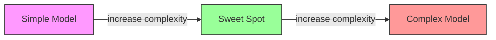
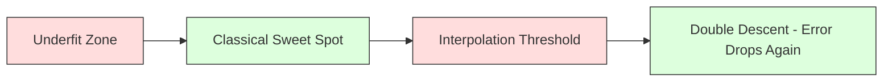
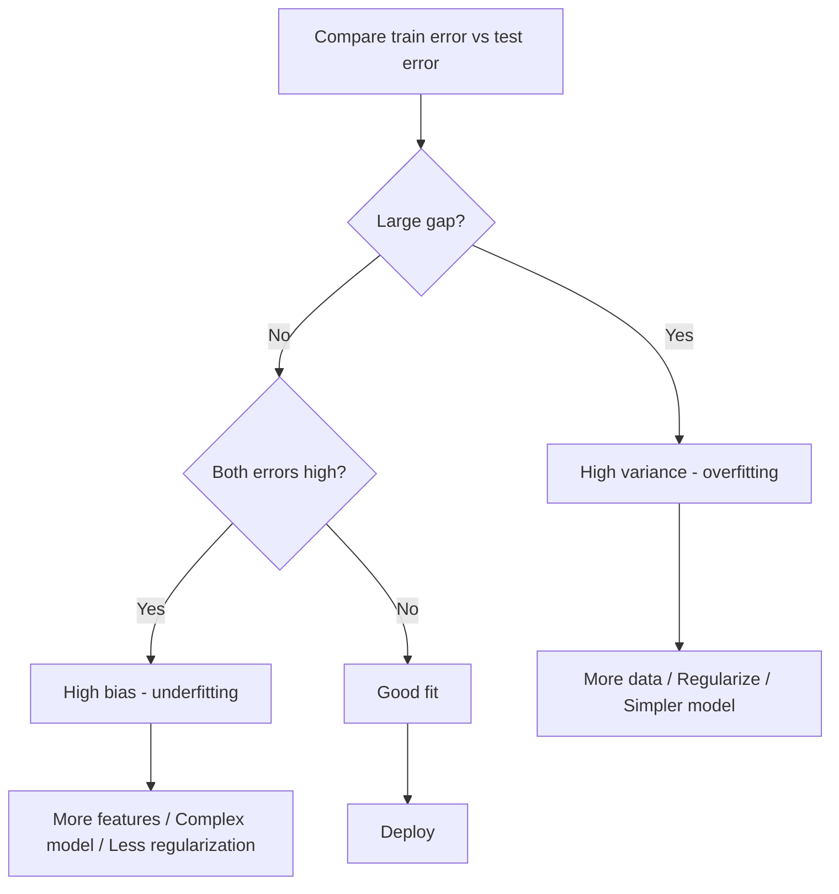
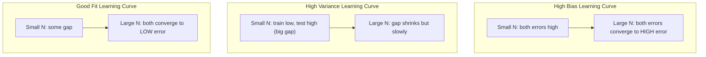
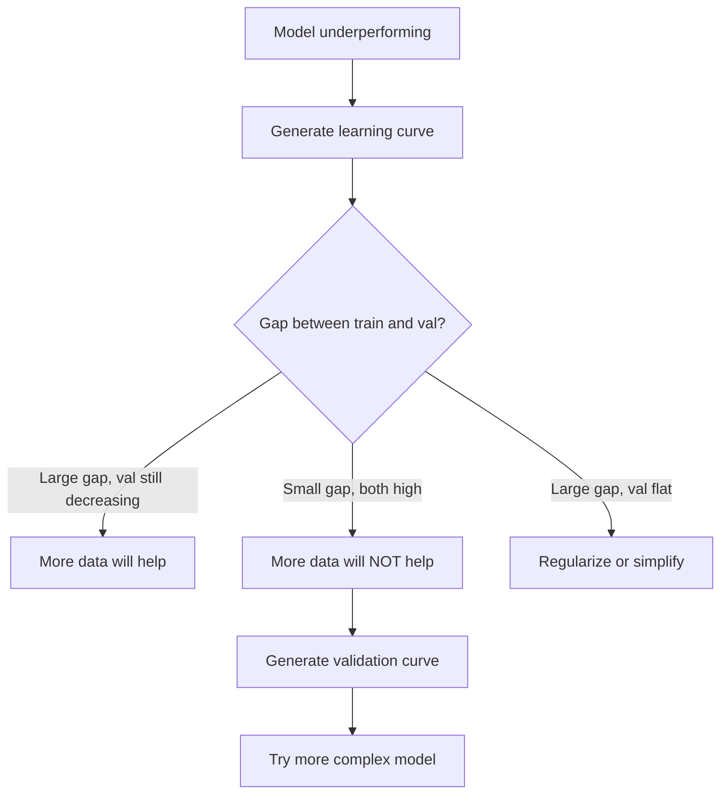

# Bias-Variance Tradeoff

> 模型的每一份误差都来自三个来源之一：bias、variance 或 noise。你只能控制前两者。

**Type:** Learn
**Language:** Python
**Prerequisites:** Phase 2, Lessons 01-09 (ML basics, regression, classification, evaluation)
**Time:** ~75 minutes

## Learning Objectives

- 推导 expected prediction error 的 bias-variance decomposition，并解释 irreducible noise 的作用
- 通过 training error 与 test error 的形态判断模型究竟是 high bias 还是 high variance
- 解释 regularization（L1、L2、dropout、early stopping）如何用 bias 换 variance
- 实现可视化实验，展示模型复杂度递增时的 bias-variance tradeoff

## The Problem

你训练好了一个模型。它在 test data 上有一些误差。这些误差从哪里来？

如果模型太简单（比如用 linear regression 拟合一个曲线型数据集），它会一直错过真实的 pattern。这就是 bias。如果模型太复杂（比如用 degree-20 polynomial 拟合 15 个数据点），它会在 training data 上拟合得严丝合缝，却对新数据给出截然不同的预测。这就是 variance。

在固定的模型容量下，你没法同时压低这两者。把 bias 压下去，variance 就会上升；把 variance 压下去，bias 又会上升。理解这个 tradeoff 是机器学习里最有用的诊断技能：它告诉你应该让模型更复杂还是更简单，应该收集更多数据还是构造更好的特征，应该加大还是减小 regularization。

## The Concept

### Bias: Systematic Error

Bias 衡量的是模型的平均预测离真实值有多远。如果你在同一分布下采样很多 training set 反复训练同一个模型并把预测取平均，bias 就是这个平均值与真值之间的差距。

High bias 意味着模型过于死板，无法捕捉真实的 pattern。一条直线去拟合抛物线，无论你给它多少数据，都永远会错过曲线。这就是 underfitting。

```
High bias (underfitting):
  Model always predicts roughly the same wrong thing.
  Training error: HIGH
  Test error: HIGH
  Gap between them: SMALL
```

### Variance: Sensitivity to Training Data

Variance 衡量的是当你在不同子集上训练时，预测会变化多少。如果 training set 的微小变化会导致模型出现剧烈变化，那 variance 就高。

High variance 意味着模型在拟合 training data 中的 noise，而不是底层的 signal。一个 degree-20 polynomial 会穿过每一个训练点，但在它们之间剧烈震荡。这就是 overfitting。

```
High variance (overfitting):
  Model fits training data perfectly but fails on new data.
  Training error: LOW
  Test error: HIGH
  Gap between them: LARGE
```

### The Decomposition

对任意一点 x，squared loss 下的 expected prediction error 可以严格分解为：

```
Expected Error = Bias^2 + Variance + Irreducible Noise

where:
  Bias^2   = (E[f_hat(x)] - f(x))^2
  Variance = E[(f_hat(x) - E[f_hat(x)])^2]
  Noise    = E[(y - f(x))^2]             (sigma^2)
```

- `f(x)` 是真实函数
- `f_hat(x)` 是模型的预测
- `E[...]` 是对不同 training set 取的期望
- `y` 是观察到的 label（真实函数加上噪声）

noise 这一项是 irreducible 的。在带噪数据上，没有任何模型能比 sigma^2 做得更好。你的任务是找到 bias^2 和 variance 之间的最佳平衡。

### Model Complexity vs Error



经典的 U 形曲线：

| Complexity | Bias | Variance | Total Error |
|-----------|------|----------|-------------|
| Too low | HIGH | LOW | HIGH (underfitting) |
| Just right | MODERATE | MODERATE | LOWEST |
| Too high | LOW | HIGH | HIGH (overfitting) |

### Regularization as Bias-Variance Control

Regularization 故意提高 bias 来降低 variance。它约束模型，使其不去追逐 noise。

- **L2 (Ridge):** 把所有权重朝零收缩。保留所有特征但削弱它们的影响。
- **L1 (Lasso):** 把一部分权重直接压成零。等同于做 feature selection。
- **Dropout:** 训练时随机屏蔽 neuron。强迫网络学到冗余表示。
- **Early stopping:** 在模型完全拟合 training data 之前停止训练。

regularization 强度（lambda、dropout rate、训练轮数）直接决定了你坐落在 bias-variance 曲线的哪个位置。regularization 越强，bias 越大、variance 越小。

### Double Descent: The Modern Perspective

经典理论说：过了 sweet spot，复杂度越高就越糟。但 2019 年以来的研究展示了一个出人意料的现象。如果你把模型容量继续推过 interpolation threshold（参数足够把 training data 完美拟合的临界点），test error 反而可能再次下降。



这种 "double descent" 现象解释了为什么参数远超训练样本数的超参数化神经网络仍然可以泛化得不错。经典的 bias-variance tradeoff 并没有错，只是它对现代 regime 来说不完整。

关于 double descent 的几点关键观察：
- 它在 linear models、decision trees 和 neural networks 中都会出现
- 在 interpolation 区域，更多的数据反而可能让结果变差（sample-wise double descent）
- 更多的训练 epoch 也会引发它（epoch-wise double descent）
- regularization 能把这个尖峰削平，但无法消除

为什么会这样？在 interpolation threshold，模型刚好有足够容量去拟合所有训练点。它被迫落到一个非常特定的解上，让曲线穿过每一个点，数据中的微小扰动就会导致拟合的剧烈变化。这就是 variance 达到峰值的地方。越过临界点之后，模型有许多种可能的解都能完美拟合数据。学习算法（例如带有隐式正则的 gradient descent）倾向于在其中挑出最简单的那一个。这种朝向简单解的 implicit bias，正是超参数化模型能够泛化的原因。

| Regime | Parameters vs Samples | Behavior |
|--------|----------------------|----------|
| Underparameterized | p << n | Classical tradeoff applies |
| Interpolation threshold | p ~ n | Variance peaks, test error spikes |
| Overparameterized | p >> n | Implicit regularization kicks in, test error drops |

实践层面：如果你在用 neural network 或大型 tree ensemble，不要停在 interpolation threshold。要么远低于它（配合 explicit regularization），要么远高于它。最糟糕的位置就是恰好卡在临界点上。

### Diagnosing Your Model



| Symptom | Diagnosis | Fix |
|---------|-----------|-----|
| High train error, high test error | Bias | More features, complex model, less regularization |
| Low train error, high test error | Variance | More data, regularization, simpler model, dropout |
| Low train error, low test error | Good fit | Ship it |
| Train error decreasing, test error increasing | Overfitting in progress | Early stopping |

### Practical Strategies

**当问题出在 bias：**
- 增加 polynomial 或 interaction 特征
- 换一个更灵活的模型（用 tree ensemble 替代 linear）
- 减小 regularization 强度
- 训练更久（如果还没收敛）

**当问题出在 variance：**
- 收集更多训练数据
- 使用 bagging（random forests）
- 加大 regularization（更高的 lambda、更多 dropout）
- 做 feature selection（去掉噪声特征）
- 用 cross-validation 尽早发现

### Ensemble Methods and Variance Reduction

Ensemble 方法是对抗 variance 最实用的工具。

**Bagging (Bootstrap Aggregating)** 在 training data 的不同 bootstrap 样本上训练多个模型，再把它们的预测取平均。每个单独的模型 variance 都很高，但平均之后的 variance 会低得多。Random forests 就是 bagging 应用在 decision tree 上的产物。

它在数学上为什么有效：如果你把 N 个独立预测求平均，每个的 variance 都是 sigma^2，那么平均值的 variance 就是 sigma^2 / N。模型并不真正独立（它们看到的数据相似），所以下降幅度小于 1/N，但仍然相当可观。

**Boosting** 通过顺序构建模型来降低 bias，每个新模型专注于当前 ensemble 的误差。Gradient boosting 和 AdaBoost 是主要代表。Boosting 在模型加得过多时会 overfit，所以需要 early stopping 或 regularization。

| Method | Primary Effect | Bias Change | Variance Change |
|--------|---------------|-------------|-----------------|
| Bagging | Reduces variance | No change | Decreases |
| Boosting | Reduces bias | Decreases | Can increase |
| Stacking | Reduces both | Depends on meta-learner | Depends on base models |
| Dropout | Implicit bagging | Slight increase | Decreases |

**实用法则：** 如果 base model variance 高（深树、高次多项式），用 bagging。如果 base model bias 高（浅 stump、简单线性模型），用 boosting。

### Learning Curves

Learning curve 把 training error 和 validation error 画成 training set size 的函数。它是你手头最实用的诊断工具。和单点的 train/test 对比不同，learning curve 展示的是模型的轨迹，能告诉你"再加数据"是否值得。



如何读懂它们：

| Scenario | Training Error | Validation Error | Gap | What It Means | What to Do |
|----------|---------------|-----------------|-----|---------------|------------|
| High bias | High | High | Small | Model cannot capture the pattern | More features, complex model, less regularization |
| High variance | Low | High | Large | Model memorizes training data | More data, regularization, simpler model |
| Good fit | Moderate | Moderate | Small | Model generalizes well | Ship it |
| High variance, improving | Low | Decreasing with more data | Shrinking | Variance problem that data can fix | Collect more data |
| High bias, flat | High | High and flat | Small and flat | More data will NOT help | Change model architecture |

最关键的洞察：如果两条曲线都已经平稳，gap 很小但两边的误差都很高，那再加数据也没用。你需要更好的模型。如果 gap 很大且仍在缩小，那加数据会有帮助。

### How to Generate Learning Curves

有两种做法：

**Approach 1: 改变 training set size，模型固定。** 把模型和超参数都固定下来。在越来越大的训练子集上训练。在每个 size 上记录 training error 和 validation error。这就是标准的 learning curve。

**Approach 2: 改变模型复杂度，数据固定。** 把数据固定。扫一遍复杂度参数（polynomial degree、tree depth、layer 数量）。在每个复杂度下记录 training error 和 validation error。这是 validation curve，能直接展示 bias-variance tradeoff。

两种方法相互补充。前者告诉你加数据是否有帮助，后者告诉你换模型是否有帮助。在做下一步决定之前两者都跑一遍。



## Build It

`code/bias_variance.py` 中的代码会跑完整的 bias-variance decomposition 实验。下面一步步看做法。

### Step 1: Generate Synthetic Data from a Known Function

我们用 `f(x) = sin(1.5x) + 0.5x` 加上 Gaussian noise。知道真实函数能让我们精确地算出 bias 和 variance。

```python
def true_function(x):
    return np.sin(1.5 * x) + 0.5 * x

def generate_data(n_samples=30, noise_std=0.5, x_range=(-3, 3), seed=None):
    rng = np.random.RandomState(seed)
    x = rng.uniform(x_range[0], x_range[1], n_samples)
    y = true_function(x) + rng.normal(0, noise_std, n_samples)
    return x, y
```

### Step 2: Bootstrap Sampling and Polynomial Fitting

对每个 polynomial degree，我们抽取多组 bootstrap training set，拟合多项式，并把预测记录在固定的 test grid 上。这样每个测试点都会得到一组预测分布。

```python
def fit_polynomial(x_train, y_train, degree, lam=0.0):
    X = np.column_stack([x_train ** d for d in range(degree + 1)])
    if lam > 0:
        penalty = lam * np.eye(X.shape[1])
        penalty[0, 0] = 0
        w = np.linalg.solve(X.T @ X + penalty, X.T @ y_train)
    else:
        w = np.linalg.lstsq(X, y_train, rcond=None)[0]
    return w
```

我们一共在 200 个不同的 bootstrap 样本上拟合。每个 bootstrap 样本都来自同一个底层分布，但具体点不同。

### Step 3: Computing Bias^2, Variance Decomposition

有了每个测试点的 200 组预测，就可以直接按定义计算分解：

```python
mean_pred = predictions.mean(axis=0)
bias_sq = np.mean((mean_pred - y_true) ** 2)
variance = np.mean(predictions.var(axis=0))
total_error = np.mean(np.mean((predictions - y_true) ** 2, axis=1))
```

- `mean_pred` 是从 bootstrap 样本估计出的 E[f_hat(x)]
- `bias_sq` 是平均预测与真值之间的平方差
- `variance` 是预测在 bootstrap 样本之间的平均离散度
- `total_error` 应近似等于 bias^2 + variance + noise

### Step 4: Learning Curves

Learning curve 在固定模型复杂度的同时扫 training set size，能告诉你模型究竟是数据受限还是容量受限。

```python
def demo_learning_curves():
    sizes = [10, 15, 20, 30, 50, 75, 100, 150, 200, 300]
    degree = 5

    for n in sizes:
        train_errors = []
        test_errors = []
        for seed in range(50):
            x_train, y_train = generate_data(n_samples=n, seed=seed * 100)
            w = fit_polynomial(x_train, y_train, degree)
            train_pred = predict_polynomial(x_train, w)
            train_mse = np.mean((train_pred - y_train) ** 2)
            test_pred = predict_polynomial(x_test, w)
            test_mse = np.mean((test_pred - y_test) ** 2)
            train_errors.append(train_mse)
            test_errors.append(test_mse)
        # Average over runs gives the learning curve point
```

对于 high-variance 模型（小数据下的 degree 5），你会看到：
- Training error 起步很低，随着数据增多越来越难"硬记"，因而上升
- Test error 起步很高，随着模型获得更多 signal 而下降
- 两者之间的 gap 随着数据增多而缩小

对于 high-bias 模型（degree 1），两条曲线很快收敛到同一个高值，加数据也无济于事。

### Step 5: Regularization Sweep

代码里还包含 `demo_regularization_sweep()`，它固定一个高次多项式（degree 15）并把 Ridge regularization 强度从 0.001 扫到 100。这从另一个角度展示了 bias-variance tradeoff：不是改变模型复杂度，而是改变约束强度。

```python
def demo_regularization_sweep():
    alphas = [0.001, 0.005, 0.01, 0.05, 0.1, 0.5, 1.0, 5.0, 10.0, 50.0, 100.0]
    for alpha in alphas:
        results = bias_variance_decomposition([15], lam=alpha)
        r = results[15]
        print(f"alpha={alpha:.3f}  bias={r['bias_sq']:.4f}  var={r['variance']:.4f}")
```

alpha 很小时，degree-15 多项式几乎不受约束，variance 占主导，因为模型在每个 bootstrap 样本上都去追噪声。alpha 很大时，惩罚太强，模型实际上退化成接近常数函数，bias 占主导。最优 alpha 落在两者之间。

这和扫 polynomial degree 得到的是同一条 U 形曲线，只不过控制旋钮从离散变成连续。在实践中，regularization 是控制 tradeoff 的首选方式，因为它能在不改变特征集的情况下做精细调整。

## Use It

sklearn 提供了 `learning_curve` 和 `validation_curve`，可以让你不写 bootstrap 循环就完成这些诊断。

### Validation Curve: Sweep Model Complexity

```python
from sklearn.model_selection import validation_curve
from sklearn.pipeline import make_pipeline
from sklearn.preprocessing import PolynomialFeatures
from sklearn.linear_model import Ridge

degrees = list(range(1, 16))
train_scores_all = []
val_scores_all = []

for d in degrees:
    pipe = make_pipeline(PolynomialFeatures(d), Ridge(alpha=0.01))
    train_scores, val_scores = validation_curve(
        pipe, X, y, param_name="polynomialfeatures__degree",
        param_range=[d], cv=5, scoring="neg_mean_squared_error"
    )
    train_scores_all.append(-train_scores.mean())
    val_scores_all.append(-val_scores.mean())
```

这就直接给出了 bias-variance tradeoff 曲线。validation score 相对 train score 最差的地方，是 variance 占主导；两者都很差的地方，是 bias 占主导。

### Learning Curve: Sweep Training Set Size

```python
from sklearn.model_selection import learning_curve

pipe = make_pipeline(PolynomialFeatures(5), Ridge(alpha=0.01))
train_sizes, train_scores, val_scores = learning_curve(
    pipe, X, y, train_sizes=np.linspace(0.1, 1.0, 10),
    cv=5, scoring="neg_mean_squared_error"
)
train_mse = -train_scores.mean(axis=1)
val_mse = -val_scores.mean(axis=1)
```

把 `train_mse` 和 `val_mse` 对 `train_sizes` 画出来。曲线的形状会告诉你关于模型的一切。

### Cross-Validation with Regularization Sweep

```python
from sklearn.model_selection import cross_val_score

alphas = [0.001, 0.01, 0.1, 1.0, 10.0, 100.0]
for alpha in alphas:
    pipe = make_pipeline(PolynomialFeatures(10), Ridge(alpha=alpha))
    scores = cross_val_score(pipe, X, y, cv=5, scoring="neg_mean_squared_error")
    print(f"alpha={alpha:>7.3f}  MSE={-scores.mean():.4f} +/- {scores.std():.4f}")
```

这是在固定模型复杂度的前提下扫 regularization 强度。你会看到同样的 bias-variance tradeoff：低 alpha 意味着 high variance，高 alpha 意味着 high bias。

### Putting It All Together: A Complete Diagnostic Workflow

实践中，你会按下面这个顺序跑这套诊断：

1. 训练你的模型，计算 train 和 test error。
2. 如果两者都很高：你遇到的是 bias 问题。直接跳到第 4 步。
3. 如果 train 很低但 test 很高：你遇到的是 variance 问题。生成 learning curve，看看加数据能否解决；如果不能，就 regularize。
4. 用主要的复杂度参数生成 validation curve，找到 sweet spot。
5. 在 sweet spot 上再生成一次 learning curve。如果 gap 仍然很大，说明你需要更多数据或更强的 regularization。
6. 用 `cross_val_score` 在不同 alpha 下试 Ridge/Lasso，挑出 cross-validated error 最小的那个 alpha。

对大多数 tabular 数据集来说，这套流程跑下来要 10-15 分钟，能省下数小时的瞎猜。

## Ship It

This lesson produces: `outputs/prompt-model-diagnostics.md`

## Exercises

1. 在 `noise_std=0`（无噪声）下重跑分解。irreducible error 项会发生什么？最优复杂度是否会变？

2. 把训练集大小从 30 提高到 300。这会如何影响 variance 分量？最优 polynomial degree 会迁移吗？

3. 在实验中加入 L2 regularization (Ridge regression)。固定一个高次多项式（degree 15），把 lambda 从 0 扫到 100。把 bias^2 和 variance 都画成 lambda 的函数。

4. 把真实函数从 polynomial 换成 `sin(x)`。bias-variance 分解会怎样变化？是否仍然存在一个明确的最优 degree？

5. 实现一个简单的 bootstrap aggregating (bagging) 包装器：在 bootstrap 样本上训练 10 个模型并对预测取平均。证明这能降低 variance 而几乎不增加 bias。

## Key Terms

| Term | What people say | What it actually means |
|------|----------------|----------------------|
| Bias | "The model is too simple" | 来自错误假设的系统性误差。模型平均预测与真值之间的差距。 |
| Variance | "The model is overfitting" | 对训练数据敏感所导致的误差。预测在不同 training set 之间变化的程度。 |
| Irreducible error | "Noise in the data" | 来自真实数据生成过程的随机性。任何模型都无法消除。 |
| Underfitting | "Not learning enough" | 模型 bias 高。它在 training data 上都抓不到真实 pattern。 |
| Overfitting | "Memorizing the data" | 模型 variance 高。它把 training data 中无法泛化的 noise 也拟合进去了。 |
| Regularization | "Constraining the model" | 加入惩罚以降低模型复杂度，用 bias 换更低的 variance。 |
| Double descent | "More parameters can help" | 当模型容量远超 interpolation threshold 时，test error 会再次下降。 |
| Model complexity | "How flexible the model is" | 模型拟合任意 pattern 的容量，由 architecture、特征或 regularization 控制。 |

## Further Reading

- [Hastie, Tibshirani, Friedman: Elements of Statistical Learning, Ch. 7](https://hastie.su.domains/ElemStatLearn/) -- bias-variance decomposition 的权威论述
- [Belkin et al., Reconciling modern machine learning practice and the bias-variance trade-off (2019)](https://arxiv.org/abs/1812.11118) -- double descent 的开创性论文
- [Nakkiran et al., Deep Double Descent (2019)](https://arxiv.org/abs/1912.02292) -- epoch-wise 与 sample-wise double descent
- [Scott Fortmann-Roe: Understanding the Bias-Variance Tradeoff](http://scott.fortmann-roe.com/docs/BiasVariance.html) -- 直观清晰的可视化解释
