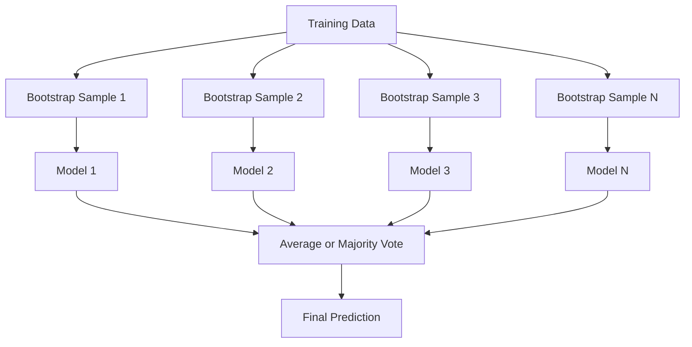
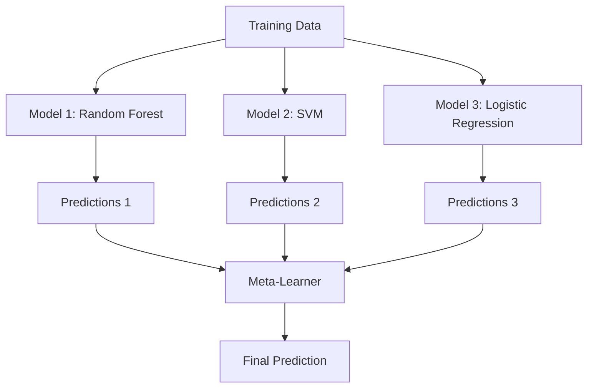

# 集成方法

> 一组弱学习器，正确组合后，就能成为强学习器。这不是比喻，而是一个定理。

**类型：** Build
**语言：** Python
**前置课程：** Phase 2, Lesson 10 (Bias-Variance Tradeoff)
**时间：** ~120 分钟

## 学习目标

- 从零实现 AdaBoost 和 gradient boosting，并解释 boosting 如何逐步降低 bias
- 构建 bagging 集成，演示对去相关模型取平均如何在不增加 bias 的情况下降低 variance
- 比较 bagging、boosting 和 stacking 各自针对误差的哪个分量
- 评估集成多样性，解释为什么多数投票的准确率随独立弱学习器数量增加而提升

## 问题背景

单棵决策树训练快、易解释，但容易过拟合。单个线性模型在复杂边界上欠拟合。你可以花好几天去设计完美的模型架构，也可以把一堆不完美的模型组合起来，得到比任何单个模型都好的结果。

集成方法正是做这件事的。它们是表格数据 Kaggle 竞赛中最可靠的获胜技术，驱动着大多数生产环境的 ML 系统，并且完美诠释了 bias-variance tradeoff。Bagging 降低 variance，Boosting 降低 bias，Stacking 学习在不同输入上信任哪个模型。

## 核心概念

### 为什么集成有效

假设你有 N 个独立分类器，每个准确率为 p > 0.5。多数投票的准确率为：

```
P(majority correct) = sum over k > N/2 of C(N,k) * p^k * (1-p)^(N-k)
```

对于 21 个准确率各为 60% 的分类器，多数投票准确率约为 74%。101 个分类器时升至 84%。当模型犯不同的错误时，误差会相互抵消。

关键要求是**多样性**。如果所有模型犯相同的错误，组合它们毫无帮助。集成通过以下方式产生多样化模型：

- 不同的训练子集（bagging）
- 不同的特征子集（random forests）
- 顺序纠错（boosting）
- 不同的模型族（stacking）

### Bagging（Bootstrap Aggregating）

Bagging 通过在不同的 bootstrap 样本上训练每个模型来创造多样性。



Bootstrap 样本是从原始数据中有放回地抽取的，大小与原始数据相同。每个 bootstrap 中约有 63.2% 的唯一样本出现。剩余的 36.8%（out-of-bag 样本）提供了一个免费的验证集。

Bagging 在几乎不增加 bias 的情况下降低 variance。每棵树都对其 bootstrap 样本过拟合，但每棵树的过拟合方式不同，所以取平均会抵消噪声。

**Random Forests** 是带有额外技巧的 bagging：在每次分裂时，只考虑特征的一个随机子集。这迫使树之间产生更多多样性。候选特征数量通常为分类任务取 `sqrt(n_features)`，回归任务取 `n_features / 3`。

### Boosting（顺序纠错）

Boosting 按顺序训练模型。每个新模型专注于之前模型预测错误的样本。


Boosting 降低 bias。每个新模型纠正当前集成的系统性误差。最终预测是所有模型的加权和，表现更好的模型获得更高权重。

代价是：如果运行太多轮，boosting 可能过拟合，因为它不断拟合更难的样本，其中一些可能是噪声。

### AdaBoost

AdaBoost（Adaptive Boosting）是第一个实用的 boosting 算法。它可以与任何 base learner 配合使用，通常是 decision stumps（深度为 1 的树）。

算法流程：

```
1. 初始化样本权重：w_i = 1/N for all i

2. For t = 1 to T:
   a. 在加权数据上训练弱学习器 h_t
   b. 计算加权错误率：
      err_t = sum(w_i * I(h_t(x_i) != y_i)) / sum(w_i)
   c. 计算模型权重：
      alpha_t = 0.5 * ln((1 - err_t) / err_t)
   d. 更新样本权重：
      w_i = w_i * exp(-alpha_t * y_i * h_t(x_i))
   e. 归一化权重使其和为 1

3. 最终预测：H(x) = sign(sum(alpha_t * h_t(x)))
```

错误率越低的模型获得越高的 alpha。被错误分类的样本获得更高权重，使下一个模型专注于它们。

### Gradient Boosting

Gradient boosting 将 boosting 推广到任意损失函数。它不是重新加权样本，而是让每个新模型拟合当前集成的残差（损失函数的负梯度）。

```
1. 初始化：F_0(x) = argmin_c sum(L(y_i, c))

2. For t = 1 to T:
   a. 计算伪残差：
      r_i = -dL(y_i, F_{t-1}(x_i)) / dF_{t-1}(x_i)
   b. 对残差 r_i 拟合一棵树 h_t
   c. 找到最优步长：
      gamma_t = argmin_gamma sum(L(y_i, F_{t-1}(x_i) + gamma * h_t(x_i)))
   d. 更新：
      F_t(x) = F_{t-1}(x) + learning_rate * gamma_t * h_t(x)

3. 最终预测：F_T(x)
```

对于平方误差损失，伪残差就是实际残差：`r_i = y_i - F_{t-1}(x_i)`。每棵树字面上在拟合前一个集成的误差。

Learning rate（shrinkage）控制每棵树的贡献大小。更小的 learning rate 需要更多树但泛化更好。典型值：0.01 到 0.3。

### XGBoost：为什么它主导表格数据

XGBoost（eXtreme Gradient Boosting）是带有工程优化的 gradient boosting，使其快速、准确且抗过拟合：

- **正则化目标函数：** 对叶子权重施加 L1 和 L2 惩罚，防止单棵树过于自信
- **二阶近似：** 同时使用损失的一阶和二阶导数，给出更好的分裂决策
- **稀疏感知分裂：** 原生处理缺失值，在每个分裂点学习缺失数据的最佳方向
- **列采样：** 类似 random forests，在每次分裂时采样特征以增加多样性
- **加权分位数草图：** 在分布式数据上高效找到连续特征的分裂点
- **缓存感知块结构：** 内存布局针对 CPU cache line 优化

对于表格数据，XGBoost（及其后继者 LightGBM）始终优于神经网络。这在短期内不会改变。如果你的数据能放进行列表格中，从 gradient boosting 开始。

### Stacking（元学习）

Stacking 将多个 base models 的预测作为 meta-learner 的特征。



meta-learner 学习在不同输入上信任哪个 base model。如果 random forest 在某些区域更好而 SVM 在其他区域更好，meta-learner 会学会相应地路由。

为避免数据泄漏，base model 的预测必须通过训练集上的交叉验证生成。永远不要在同一份数据上训练 base models 并生成 meta-features。

### Voting

最简单的集成方法。直接组合预测结果。

- **Hard voting：** 对类别标签进行多数投票。
- **Soft voting：** 对预测概率取平均，选择平均概率最高的类别。通常更好，因为它利用了置信度信息。

## 动手实现

### Step 1: Decision Stump（base learner）

`code/ensembles.py` 中的代码从零实现了所有内容。我们从 decision stump 开始：只有一次分裂的树。

```python
class DecisionStump:
    def __init__(self):
        self.feature_idx = None
        self.threshold = None
        self.polarity = 1
        self.alpha = None

    def fit(self, X, y, weights):
        n_samples, n_features = X.shape
        best_error = float("inf")

        for f in range(n_features):
            thresholds = np.unique(X[:, f])
            for thresh in thresholds:
                for polarity in [1, -1]:
                    pred = np.ones(n_samples)
                    pred[polarity * X[:, f] < polarity * thresh] = -1
                    error = np.sum(weights[pred != y])
                    if error < best_error:
                        best_error = error
                        self.feature_idx = f
                        self.threshold = thresh
                        self.polarity = polarity

    def predict(self, X):
        n = X.shape[0]
        pred = np.ones(n)
        idx = self.polarity * X[:, self.feature_idx] < self.polarity * self.threshold
        pred[idx] = -1
        return pred
```

### Step 2: 从零实现 AdaBoost

```python
class AdaBoostScratch:
    def __init__(self, n_estimators=50):
        self.n_estimators = n_estimators
        self.stumps = []
        self.alphas = []

    def fit(self, X, y):
        n = X.shape[0]
        weights = np.full(n, 1 / n)

        for _ in range(self.n_estimators):
            stump = DecisionStump()
            stump.fit(X, y, weights)
            pred = stump.predict(X)

            err = np.sum(weights[pred != y])
            err = np.clip(err, 1e-10, 1 - 1e-10)

            alpha = 0.5 * np.log((1 - err) / err)
            weights *= np.exp(-alpha * y * pred)
            weights /= weights.sum()

            stump.alpha = alpha
            self.stumps.append(stump)
            self.alphas.append(alpha)

    def predict(self, X):
        total = sum(a * s.predict(X) for a, s in zip(self.alphas, self.stumps))
        return np.sign(total)
```

### Step 3: 从零实现 Gradient Boosting

```python
class GradientBoostingScratch:
    def __init__(self, n_estimators=100, learning_rate=0.1, max_depth=3):
        self.n_estimators = n_estimators
        self.lr = learning_rate
        self.max_depth = max_depth
        self.trees = []
        self.initial_pred = None

    def fit(self, X, y):
        self.initial_pred = np.mean(y)
        current_pred = np.full(len(y), self.initial_pred)

        for _ in range(self.n_estimators):
            residuals = y - current_pred
            tree = SimpleRegressionTree(max_depth=self.max_depth)
            tree.fit(X, residuals)
            update = tree.predict(X)
            current_pred += self.lr * update
            self.trees.append(tree)

    def predict(self, X):
        pred = np.full(X.shape[0], self.initial_pred)
        for tree in self.trees:
            pred += self.lr * tree.predict(X)
        return pred
```

### Step 4: 与 sklearn 对比

代码验证我们从零实现的版本与 sklearn 的 `AdaBoostClassifier` 和 `GradientBoostingClassifier` 产生相似的准确率，并将所有方法并排比较。

## 实际应用

### 何时使用哪种方法

| 方法 | 降低 | 最适合 | 注意事项 |
|--------|---------|----------|---------------|
| Bagging / Random Forest | Variance | 噪声数据，多特征 | 对 bias 无帮助 |
| AdaBoost | Bias | 干净数据，简单 base learners | 对异常值和噪声敏感 |
| Gradient Boosting | Bias | 表格数据，竞赛 | 训练慢，不调参容易过拟合 |
| XGBoost / LightGBM | 两者 | 生产环境表格 ML | 超参数多 |
| Stacking | 两者 | 争取最后 1-2% 准确率 | 复杂，meta-learner 有过拟合风险 |
| Voting | Variance | 快速组合多样化模型 | 仅在模型多样时有帮助 |

### 表格数据的生产技术栈

对于大多数表格预测问题，按以下顺序尝试：

1. **LightGBM 或 XGBoost** 使用默认参数
2. 调优 n_estimators、learning_rate、max_depth、min_child_weight
3. 如果需要最后 0.5%，用 3-5 个多样化模型构建 stacking 集成
4. 全程使用交叉验证

神经网络在表格数据上几乎总是不如 gradient boosting，尽管研究一直在尝试。TabNet、NODE 等架构偶尔能持平，但很少能超越调优良好的 XGBoost。

## 交付产出

本课产出 `outputs/prompt-ensemble-selector.md` -- 一个帮助你为给定数据集选择正确集成方法的 prompt。描述你的数据（大小、特征类型、噪声水平、类别平衡）和要解决的问题，prompt 会引导你完成决策清单，推荐方法，建议起始超参数，并警告该方法的常见错误。同时产出 `outputs/skill-ensemble-builder.md`，包含完整的选择指南。

## 练习

1. 修改 AdaBoost 实现，跟踪每轮后的训练准确率。绘制准确率 vs 估计器数量的图。它何时收敛？

2. 从零实现 random forest，在回归树中添加随机特征采样。用 `max_features=sqrt(n_features)` 训练 100 棵树并平均预测。与单棵树相比，variance 降低了多少？

3. 在 gradient boosting 实现中添加 early stopping：跟踪每轮后的验证损失，当连续 10 轮没有改善时停止。它实际需要多少棵树？

4. 用三个 base models（logistic regression、decision tree、k-nearest neighbors）和一个 logistic regression meta-learner 构建 stacking 集成。使用 5-fold 交叉验证生成 meta-features。与每个 base model 单独使用相比如何？

5. 在相同数据集上用默认参数运行 XGBoost。将其准确率与你从零实现的 gradient boosting 比较。计时两者。速度差异有多大？

## 关键术语

| 术语 | 通俗说法 | 实际含义 |
|------|----------------|----------------------|
| Bagging | "在随机子集上训练" | Bootstrap aggregating：在 bootstrap 样本上训练模型，平均预测以降低 variance |
| Boosting | "专注于难样本" | 顺序训练模型，每个模型纠正当前集成的误差，以降低 bias |
| AdaBoost | "重新加权数据" | 通过样本权重更新实现 boosting；被错分的点在下一个学习器中获得更高权重 |
| Gradient boosting | "拟合残差" | 通过让每个新模型拟合损失函数的负梯度来实现 boosting |
| XGBoost | "Kaggle 利器" | 带正则化、二阶优化和系统级加速技巧的 gradient boosting |
| Stacking | "Models on top of models" | 将 base models 的预测作为 meta-learner 的输入特征 |
| Random forest | "许多随机化的树" | 带决策树的 bagging，在每次分裂时添加随机特征采样以增加多样性 |
| Ensemble diversity | "犯不同的错误" | 模型的误差必须不相关，集成才能优于单个模型 |
| Out-of-bag error | "免费验证" | 不在 bootstrap 抽样中的样本（~36.8%）作为验证集，无需额外留出数据 |

## 延伸阅读

- [Schapire & Freund: Boosting: Foundations and Algorithms](https://mitpress.mit.edu/9780262526036/) -- AdaBoost 创造者写的书
- [Friedman: Greedy Function Approximation: A Gradient Boosting Machine (2001)](https://statweb.stanford.edu/~jhf/ftp/trebst.pdf) -- gradient boosting 原始论文
- [Chen & Guestrin: XGBoost (2016)](https://arxiv.org/abs/1603.02754) -- XGBoost 论文
- [Wolpert: Stacked Generalization (1992)](https://www.sciencedirect.com/science/article/abs/pii/S0893608005800231) -- stacking 原始论文
- [scikit-learn Ensemble Methods](https://scikit-learn.org/stable/modules/ensemble.html) -- 实用参考
