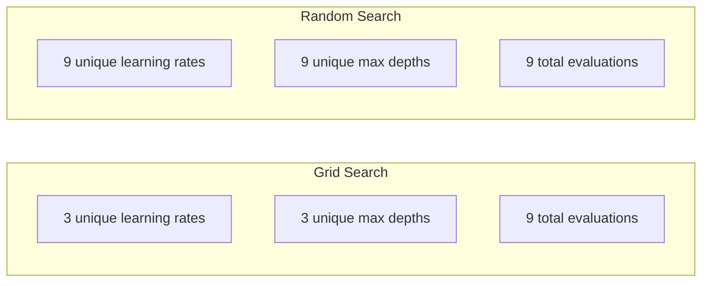
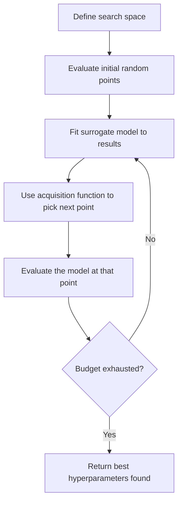
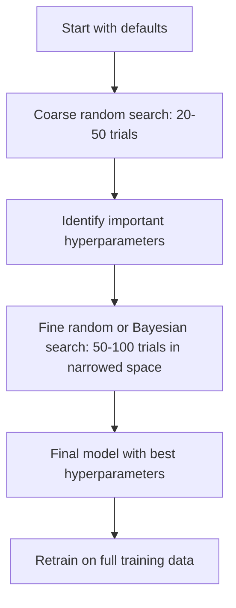
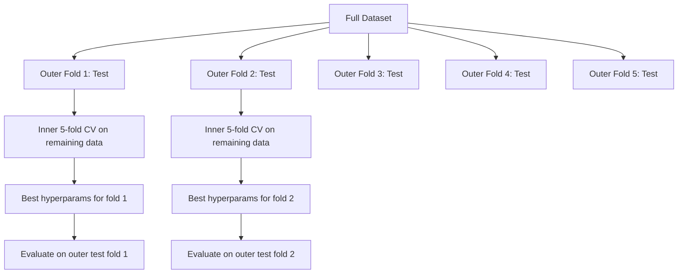

# Hyperparameter Tuning

> Hyperparameter 是训练开始前你需要拧动的旋钮。拧得好不好，决定了模型是平庸还是出色。

**Type:** Build
**Language:** Python
**Prerequisites:** Phase 2, Lesson 11 (Ensemble Methods)
**Time:** ~90 minutes

## Learning Objectives

- 从零实现 grid search、random search 和 Bayesian optimization，并比较它们的样本效率
- 解释为什么当大多数 hyperparameter 的有效维度较低时，random search 优于 grid search
- 使用 surrogate model 和 acquisition function 构建 Bayesian optimization 循环来引导搜索
- 设计一种通过合理 cross-validation 来避免过拟合 validation set 的 hyperparameter 调优策略

## The Problem

你的 gradient boosting 模型有 learning rate、树的数量、max depth、每个叶子最少样本数、subsample ratio、column sample ratio。一共六个 hyperparameter。如果每个有 5 个合理取值，网格就是 5^6 = 15,625 种组合。每次训练耗时 10 秒，全部跑完需要 43 小时的算力。

Grid search 是最直观的做法，但在大规模场景下也是最差的。Random search 用更少的算力做得更好。Bayesian optimization 通过从历史评估中学习，效果更上一层楼。知道在什么场景下用什么策略，以及哪些 hyperparameter 才真的重要，能帮你节省好几天本来浪费在 GPU 上的时间。

## The Concept

### Parameter 与 Hyperparameter

Parameter 是训练过程中学到的（权重、偏置、分裂阈值）。Hyperparameter 在训练开始前就需要设定，控制学习过程本身。

| Hyperparameter | What it controls | Typical range |
|---------------|-----------------|---------------|
| Learning rate | Step size per update | 0.001 to 1.0 |
| Number of trees/epochs | How long to train | 10 to 10,000 |
| Max depth | Model complexity | 1 to 30 |
| Regularization (lambda) | Overfitting prevention | 0.0001 to 100 |
| Batch size | Gradient estimation noise | 16 to 512 |
| Dropout rate | Fraction of neurons dropped | 0.0 to 0.5 |

### Grid Search

Grid search 评估指定值的每一种组合。它穷尽所有可能、易于理解，但随着 hyperparameter 数量呈指数级膨胀。

```
Grid for 2 hyperparameters:

  learning_rate: [0.01, 0.1, 1.0]
  max_depth:     [3, 5, 7]

  Evaluations: 3 x 3 = 9 combinations

  (0.01, 3)  (0.01, 5)  (0.01, 7)
  (0.1,  3)  (0.1,  5)  (0.1,  7)
  (1.0,  3)  (1.0,  5)  (1.0,  7)
```

Grid search 有一个根本缺陷：如果一个 hyperparameter 重要、另一个不重要，大多数评估都被浪费了。9 次评估只能让你看到重要参数的 3 个不同取值。

### Random Search

Random search 从分布中采样 hyperparameter，而不是在网格上取值。同样是 9 次评估的预算，你能为每个 hyperparameter 取到 9 个不同的值。



为什么 random 比 grid 强（Bergstra & Bengio, 2012）：

- 大多数 hyperparameter 的有效维度较低。在给定问题中，6 个 hyperparameter 通常只有 1-2 个真正重要。
- Grid search 在不重要的维度上浪费了大量评估。
- 同等预算下，Random search 能更密集地覆盖重要维度。
- 进行 60 次随机试验后，你有 95% 的概率能找到一个落在最优解 5% 范围内的点（前提是该点存在于搜索空间中）。

### Bayesian Optimization

Random search 完全不利用结果。它不会注意到高 learning rate 会发散，也不会发现 depth 3 持续优于 depth 10。Bayesian optimization 利用历史评估来决定下一步搜索的位置。



两个关键组件：

**Surrogate model：** 一个评估代价低的模型（通常是 Gaussian process），用来近似昂贵的目标函数。它能在搜索空间的任意一点同时给出预测值和不确定性估计。

**Acquisition function：** 通过权衡 exploitation（在已知较好的点附近搜索）和 exploration（在不确定性高的地方搜索）来决定下一步去哪评估。常见的选择有：

- **Expected Improvement (EI)：** 在该点上相比当前最好成绩，预期能提升多少？
- **Upper Confidence Bound (UCB)：** 预测值加上若干倍的不确定性。UCB 越高意味着这个点要么有潜力，要么尚未被探索。
- **Probability of Improvement (PI)：** 该点超过当前最好成绩的概率是多少？

Bayesian optimization 通常能用比 random search 少 2-5 倍的评估次数找到更优的 hyperparameter。拟合 surrogate model 的开销与实际训练模型的开销相比微不足道。

### Early Stopping

并不是每个训练任务都要跑完。如果某个配置在 10 个 epoch 后明显很差，就应该停下来去尝试别的。这就是 hyperparameter 搜索语境中的 early stopping。

策略：
- **Patience-based：** 如果 validation loss 在连续 N 个 epoch 都没有改善就停止
- **Median pruning：** 如果 trial 在某一步的中间结果比已完成 trial 在同一步上的中位数还差就停止
- **Hyperband：** 给许多配置先分配很小的预算，再逐步给表现最好的配置增加预算

Hyperband 尤其有效。它先用 1 个 epoch 跑 81 个配置，保留 top 1/3，再给它们 3 个 epoch，继续保留 top 1/3，依此类推。这种方式能比给所有配置都跑满预算快 10-50 倍找到优秀配置。

### Learning Rate Schedulers

Learning rate 几乎总是最重要的 hyperparameter。与其保持固定，不如用 scheduler 在训练过程中动态调整。

| Scheduler | Formula | When to use |
|-----------|---------|-------------|
| Step decay | Multiply by 0.1 every N epochs | Classic CNN training |
| Cosine annealing | lr * 0.5 * (1 + cos(pi * t / T)) | Modern default |
| Warmup + decay | Linear increase then cosine decay | Transformers |
| One-cycle | Increase then decrease over one cycle | Fast convergence |
| Reduce on plateau | Reduce by factor when metric stalls | Safe default |

### Hyperparameter Importance

并非所有 hyperparameter 都同等重要。关于 random forest（Probst et al., 2019）和 gradient boosting 的研究都给出了一致的规律：

**重要性高：**
- Learning rate（永远第一个调）
- Number of estimators / epochs（用 early stopping 代替调参）
- Regularization strength

**重要性中等：**
- Max depth / number of layers
- Min samples per leaf / weight decay
- Subsample ratio

**重要性低：**
- Max features（针对 random forest）
- 具体的激活函数选择
- Batch size（在合理范围内）

先调最重要的，其余的留默认值。

### Practical Strategy



具体的工作流：

1. **从库的默认值开始。** 这些值是经验丰富的从业者选定的，通常已经达到了 80% 的水平。
2. **粗粒度 random search。** 范围放宽，做 20-50 次试验。用 early stopping 快速干掉糟糕的尝试。
3. **分析结果。** 哪些 hyperparameter 与表现相关？据此缩小搜索空间。
4. **精细搜索。** 在缩小后的空间里做 Bayesian optimization 或聚焦的 random search，进行 50-100 次试验。
5. **使用找到的最佳 hyperparameter 在全部训练数据上重新训练。**

### Cross-Validation Integration

只用一次 validation 划分来调 hyperparameter 是有风险的：最佳 hyperparameter 可能过拟合到那一份 validation fold 上。Nested cross-validation 通过两层循环来解决这个问题：

- **Outer loop**（评估）：把数据分成 train+val 和 test，给出无偏的性能估计。
- **Inner loop**（调参）：把 train+val 进一步划分为 train 和 val，找出最佳 hyperparameter。



每个 outer fold 都独立地找出自己的最佳 hyperparameter。Outer 的得分就是泛化性能的无偏估计。

用 sklearn：

```python
from sklearn.model_selection import cross_val_score, GridSearchCV
from sklearn.ensemble import GradientBoostingRegressor

inner_cv = GridSearchCV(
    GradientBoostingRegressor(),
    param_grid={
        "learning_rate": [0.01, 0.05, 0.1],
        "max_depth": [2, 3, 5],
        "n_estimators": [50, 100, 200],
    },
    cv=5,
    scoring="neg_mean_squared_error",
)

outer_scores = cross_val_score(
    inner_cv, X, y, cv=5, scoring="neg_mean_squared_error"
)

print(f"Nested CV MSE: {-outer_scores.mean():.4f} +/- {outer_scores.std():.4f}")
```

这样做开销很大（5 个 outer fold x 5 个 inner fold x 27 个网格点 = 675 次模型拟合），但能得到一个值得信赖的性能估计。在论文中报告最终结果或者决策赌注很高时，使用它。

### Practical Tips

**先调 learning rate。** 对基于梯度的方法来说，它永远是最重要的 hyperparameter。Learning rate 选错了，调别的也是徒劳。把其他 hyperparameter 固定在默认值，先扫一遍 learning rate。

**对 learning rate 和 regularization 使用 log-uniform 分布。** 0.001 和 0.01 之间的差距，与 0.1 和 1.0 之间的差距同样重要。线性搜索会把预算浪费在大值那一端。

**用 early stopping 代替调 n_estimators。** 对于 boosting 和神经网络，把 n_estimators 或 epoch 设得足够大，让 early stopping 自己决定何时停。这样能从搜索中减少一个 hyperparameter。

**预算分配。** 把 60% 的调参预算花在最重要的 2 个 hyperparameter 上，剩下 40% 分给其他。Top 2 决定了大部分性能差异。

**注意取值的尺度。** 永远不要在 log 尺度上搜索 batch size（16、32、64 这样就好），但 learning rate 一定要用 log 尺度搜索。让搜索分布与该 hyperparameter 影响模型的方式匹配。

| Model Type | Top Hyperparameters | Recommended Search | Budget |
|-----------|--------------------|--------------------|--------|
| Random Forest | n_estimators, max_depth, min_samples_leaf | Random search, 50 trials | Low (fast training) |
| Gradient Boosting | learning_rate, n_estimators, max_depth | Bayesian, 100 trials + early stopping | Medium |
| Neural Network | learning_rate, weight_decay, batch_size | Bayesian or random, 100+ trials | High (slow training) |
| SVM | C, gamma (RBF kernel) | Grid on log scale, 25-50 trials | Low (2 params) |
| Lasso/Ridge | alpha | 1D search on log scale, 20 trials | Very low |
| XGBoost | learning_rate, max_depth, subsample, colsample | Bayesian, 100-200 trials + early stopping | Medium |

**拿不准时：** 用 random search，trial 数至少是 hyperparameter 数量的 2 倍（比如 6 个 hyperparameter 至少 12 次）。50 次试验的 random search 能击败精心设计的 grid search 的频率，会超出你的预期。

## Build It

### Step 1: Grid Search from Scratch

`code/tuning.py` 中的代码从零实现了 grid search、random search 和一个简单的 Bayesian optimizer。

```python
def grid_search(model_fn, param_grid, X_train, y_train, X_val, y_val):
    keys = list(param_grid.keys())
    values = list(param_grid.values())
    best_score = -float("inf")
    best_params = None
    n_evals = 0

    for combo in itertools.product(*values):
        params = dict(zip(keys, combo))
        model = model_fn(**params)
        model.fit(X_train, y_train)
        score = evaluate(model, X_val, y_val)
        n_evals += 1

        if score > best_score:
            best_score = score
            best_params = params

    return best_params, best_score, n_evals
```

### Step 2: Random Search from Scratch

```python
def random_search(model_fn, param_distributions, X_train, y_train,
                  X_val, y_val, n_iter=50, seed=42):
    rng = np.random.RandomState(seed)
    best_score = -float("inf")
    best_params = None

    for _ in range(n_iter):
        params = {k: sample(v, rng) for k, v in param_distributions.items()}
        model = model_fn(**params)
        model.fit(X_train, y_train)
        score = evaluate(model, X_val, y_val)

        if score > best_score:
            best_score = score
            best_params = params

    return best_params, best_score, n_iter
```

### Step 3: Bayesian Optimization (Simplified)

核心思路：用 Gaussian process 拟合已观察到的 (hyperparameter, score) 配对，然后用 acquisition function 决定下一个采样位置。

```python
class SimpleBayesianOptimizer:
    def __init__(self, search_space, n_initial=5):
        self.search_space = search_space
        self.n_initial = n_initial
        self.X_observed = []
        self.y_observed = []

    def _kernel(self, x1, x2, length_scale=1.0):
        dists = np.sum((x1[:, None, :] - x2[None, :, :]) ** 2, axis=2)
        return np.exp(-0.5 * dists / length_scale ** 2)

    def _fit_gp(self, X_new):
        X_obs = np.array(self.X_observed)
        y_obs = np.array(self.y_observed)
        y_mean = y_obs.mean()
        y_centered = y_obs - y_mean

        K = self._kernel(X_obs, X_obs) + 1e-4 * np.eye(len(X_obs))
        K_star = self._kernel(X_new, X_obs)

        L = np.linalg.cholesky(K)
        alpha = np.linalg.solve(L.T, np.linalg.solve(L, y_centered))
        mu = K_star @ alpha + y_mean

        v = np.linalg.solve(L, K_star.T)
        var = 1.0 - np.sum(v ** 2, axis=0)
        var = np.maximum(var, 1e-6)

        return mu, var

    def _expected_improvement(self, mu, var, best_y):
        sigma = np.sqrt(var)
        z = (mu - best_y) / (sigma + 1e-10)
        ei = sigma * (z * norm_cdf(z) + norm_pdf(z))
        return ei

    def suggest(self):
        if len(self.X_observed) < self.n_initial:
            return sample_random(self.search_space)

        candidates = [sample_random(self.search_space) for _ in range(500)]
        X_cand = np.array([to_vector(c) for c in candidates])
        mu, var = self._fit_gp(X_cand)
        ei = self._expected_improvement(mu, var, max(self.y_observed))
        return candidates[np.argmax(ei)]

    def observe(self, params, score):
        self.X_observed.append(to_vector(params))
        self.y_observed.append(score)
```

GP surrogate 在每个候选点会给出两件事：预测得分（mu）和不确定性（var）。Expected Improvement 在两者间做权衡：它偏好那些模型预测得分高、或者不确定性高的点。早期大部分点的不确定性都很高，所以优化器会去探索；之后才会聚焦到最有希望的区域。

### Step 4: Compare All Methods

在同一个合成目标上跑这三种方法并对比。下面这种对比使用了一个简化的封装，让每个 optimizer 直接调用目标函数（不真正训练模型），所以 API 与上面基于模型的实现略有不同：

```python
def synthetic_objective(params):
    lr = params["learning_rate"]
    depth = params["max_depth"]
    return -(np.log10(lr) + 2) ** 2 - (depth - 4) ** 2 + 10

param_grid = {
    "learning_rate": [0.001, 0.01, 0.1, 1.0],
    "max_depth": [2, 3, 4, 5, 6, 7, 8],
}

grid_best = None
grid_score = -float("inf")
grid_history = []
for combo in itertools.product(*param_grid.values()):
    params = dict(zip(param_grid.keys(), combo))
    score = synthetic_objective(params)
    grid_history.append((params, score))
    if score > grid_score:
        grid_score = score
        grid_best = params

param_dist = {
    "learning_rate": ("log_float", 0.001, 1.0),
    "max_depth": ("int", 2, 8),
}

rand_best = None
rand_score = -float("inf")
rand_history = []
rng = np.random.RandomState(42)
for _ in range(28):
    params = {k: sample(v, rng) for k, v in param_dist.items()}
    score = synthetic_objective(params)
    rand_history.append((params, score))
    if score > rand_score:
        rand_score = score
        rand_best = params

optimizer = SimpleBayesianOptimizer(param_dist, n_initial=5)
bayes_history = []
for _ in range(28):
    params = optimizer.suggest()
    score = synthetic_objective(params)
    optimizer.observe(params, score)
    bayes_history.append((params, score))
bayes_score = max(s for _, s in bayes_history)

print(f"{'Method':<20} {'Best Score':>12} {'Evaluations':>12}")
print("-" * 50)
print(f"{'Grid Search':<20} {grid_score:>12.4f} {len(grid_history):>12}")
print(f"{'Random Search':<20} {rand_score:>12.4f} {len(rand_history):>12}")
print(f"{'Bayesian Opt':<20} {bayes_score:>12.4f} {len(bayes_history):>12}")
```

预算相同的情况下，Bayesian optimization 通常最快找到最佳得分，因为它不会在明显糟糕的区域浪费评估。Random search 比 grid search 覆盖得更广。Grid search 只有在 hyperparameter 很少、能负担得起穷举时才胜出。

## Use It

### Optuna in Practice

Optuna 是认真做 hyperparameter 调优时推荐的库。它原生支持 pruning、分布式搜索和可视化。

```python
import optuna

def objective(trial):
    lr = trial.suggest_float("learning_rate", 1e-4, 1e-1, log=True)
    n_est = trial.suggest_int("n_estimators", 50, 500)
    max_depth = trial.suggest_int("max_depth", 2, 10)

    model = GradientBoostingRegressor(
        learning_rate=lr,
        n_estimators=n_est,
        max_depth=max_depth,
    )
    model.fit(X_train, y_train)
    return mean_squared_error(y_val, model.predict(X_val))

study = optuna.create_study(direction="minimize")
study.optimize(objective, n_trials=100)

print(f"Best params: {study.best_params}")
print(f"Best MSE: {study.best_value:.4f}")
```

Optuna 的关键功能：
- `suggest_float(..., log=True)` 用于适合 log 尺度搜索的参数（learning rate、regularization）
- `suggest_int` 用于整数参数
- `suggest_categorical` 用于离散选项
- 内置 MedianPruner 用于对糟糕 trial 进行 early stopping
- `study.trials_dataframe()` 用于结果分析

### Optuna with Pruning

Pruning 会提前终止没有希望的 trial，节省大量算力。模板如下：

```python
import optuna
from sklearn.model_selection import cross_val_score

def objective(trial):
    params = {
        "learning_rate": trial.suggest_float("lr", 1e-4, 0.5, log=True),
        "max_depth": trial.suggest_int("max_depth", 2, 10),
        "n_estimators": trial.suggest_int("n_estimators", 50, 500),
        "subsample": trial.suggest_float("subsample", 0.5, 1.0),
    }

    model = GradientBoostingRegressor(**params)
    scores = cross_val_score(model, X_train, y_train, cv=3,
                             scoring="neg_mean_squared_error")
    mean_score = -scores.mean()

    trial.report(mean_score, step=0)
    if trial.should_prune():
        raise optuna.TrialPruned()

    return mean_score

pruner = optuna.pruners.MedianPruner(n_startup_trials=10, n_warmup_steps=5)
study = optuna.create_study(direction="minimize", pruner=pruner)
study.optimize(objective, n_trials=200)
```

`MedianPruner` 会在某 trial 的中间值比已完成 trial 在同一步的中位数更差时停止它。Pruning 需要调用 `trial.report()` 上报中间指标，再用 `trial.should_prune()` 判断是否应当停止。`n_startup_trials=10` 保证至少有 10 个 trial 完整跑完后 pruning 才会启动。这通常能省下 40-60% 的总算力。

### sklearn 的内置调优器

做快速实验时，sklearn 提供了 `GridSearchCV`、`RandomizedSearchCV` 和 `HalvingRandomSearchCV`：

```python
from sklearn.model_selection import RandomizedSearchCV
from scipy.stats import loguniform, randint

param_dist = {
    "learning_rate": loguniform(1e-4, 0.5),
    "max_depth": randint(2, 10),
    "n_estimators": randint(50, 500),
}

search = RandomizedSearchCV(
    GradientBoostingRegressor(),
    param_dist,
    n_iter=100,
    cv=5,
    scoring="neg_mean_squared_error",
    random_state=42,
    n_jobs=-1,
)
search.fit(X_train, y_train)
print(f"Best params: {search.best_params_}")
print(f"Best CV MSE: {-search.best_score_:.4f}")
```

Learning rate 和 regularization 用 scipy 的 `loguniform`；整数 hyperparameter 用 `randint`。`n_jobs=-1` 会把搜索并行到所有 CPU 核心上。

### Hyperparameter Tuning 中的常见错误

**预处理引入的 data leakage。** 如果在 cross-validation 之前就在整个数据集上拟合 scaler，validation fold 的信息会泄漏到训练里。务必把预处理放进 `Pipeline`，让它只在训练 fold 上拟合。

**对 validation set 过拟合。** 跑成千上万次 trial 实际上等于在 validation set 上训练。最终的性能估计要用 nested cross-validation，或者另留一份调参时绝不接触的 test set。

**搜索范围太窄。** 如果你最佳值正好在搜索空间的边界上，说明你搜索得还不够宽，最优值可能在范围之外。永远要检查最佳参数是否落在边缘。

**忽视交互效应。** 在 boosting 中 learning rate 和 number of estimators 之间有强烈的相互作用：低 learning rate 需要更多的 estimator。分别独立地调它们的效果会比一起调差。

**对迭代式模型不使用 early stopping。** 对 gradient boosting 和神经网络，把 n_estimators 或 epoch 设为很大的值并使用 early stopping，严格优于把迭代数当作 hyperparameter 来调。

## Exercises

1. 在相同的总预算（例如 50 次评估）下分别跑 grid search 和 random search。比较找到的最佳得分。换 10 个不同的 seed 重复实验，random search 胜出多少次？

2. 从零实现 Hyperband。从 81 个配置开始，每个先训练 1 个 epoch。每一轮保留前 1/3 并把它们的预算翻三倍。比较总算力（所有配置在所有阶段的 epoch 之和）与让 81 个配置全部跑满预算的对比。

3. 给 Lesson 11 的 gradient boosting 实现加一个 learning rate scheduler（cosine annealing）。和固定 learning rate 相比是否有提升？

4. 用 Optuna 在真实数据集上调一个 RandomForestClassifier（比如 sklearn 的 breast cancer 数据集）。用 `optuna.visualization.plot_param_importances(study)` 看哪些 hyperparameter 最重要。它和本课的重要性排名一致吗？

5. 实现一个简单的 acquisition function（Expected Improvement），并展示 exploration 与 exploitation 的对比。画出 surrogate model 的均值和不确定性，标出 EI 选择下一个评估点的位置。

## Key Terms

| Term | What people say | What it actually means |
|------|----------------|----------------------|
| Hyperparameter | "A setting you choose" | A value set before training that controls the learning process, not learned from data |
| Grid search | "Try every combination" | Exhaustive search over a specified parameter grid. Exponential cost. |
| Random search | "Just sample randomly" | Sample hyperparameters from distributions. Covers important dimensions better than grid search. |
| Bayesian optimization | "Smart search" | Uses a surrogate model of the objective to decide where to evaluate next, balancing exploration and exploitation |
| Surrogate model | "A cheap approximation" | A model (usually Gaussian process) that approximates the expensive objective function from observed evaluations |
| Acquisition function | "Where to look next" | Scores candidate points by balancing expected improvement with uncertainty. EI and UCB are common choices. |
| Early stopping | "Stop wasting time" | Terminate training early when validation performance stops improving |
| Hyperband | "Tournament bracket for configs" | Adaptive resource allocation: start many configs with small budgets, keep the best and increase their budgets |
| Learning rate scheduler | "Change lr during training" | A function that adjusts the learning rate over the course of training for better convergence |

## Further Reading

- [Bergstra & Bengio: Random Search for Hyper-Parameter Optimization (2012)](https://jmlr.org/papers/v13/bergstra12a.html) -- 论证 random 优于 grid 的奠基论文
- [Snoek et al., Practical Bayesian Optimization of Machine Learning Algorithms (2012)](https://arxiv.org/abs/1206.2944) -- 面向 ML 的 Bayesian optimization
- [Li et al., Hyperband: A Novel Bandit-Based Approach (2018)](https://jmlr.org/papers/v18/16-558.html) -- Hyperband 的原始论文
- [Optuna: A Next-generation Hyperparameter Optimization Framework](https://arxiv.org/abs/1907.10902) -- Optuna 论文
- [Probst et al., Tunability: Importance of Hyperparameters (2019)](https://jmlr.org/papers/v20/18-444.html) -- 哪些 hyperparameter 真正重要
