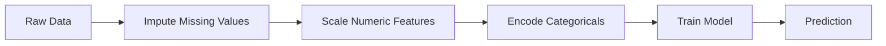
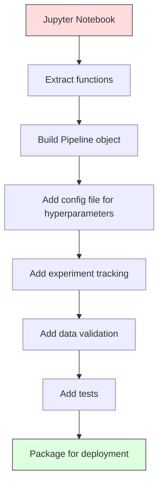

# ML Pipeline

> 模型不是产品，pipeline 才是。Pipeline 是从原始数据到部署预测的全部流程，每一步都必须可复现。

**类型：** 构建
**语言：** Python
**前置课程：** Phase 2，Lesson 12（超参数调优）
**时间：** 约 120 分钟

## 学习目标

- 从零构建一个 ML pipeline，将缺失值填充、特征缩放、编码和模型训练串联成一个可复现的对象
- 识别数据泄露场景，并解释 pipeline 如何通过仅在训练数据上拟合 transformer 来防止泄露
- 构建一个 ColumnTransformer，对数值特征和类别特征分别应用不同的预处理
- 实现 pipeline 序列化，并证明同一个已拟合的 pipeline 在训练和生产环境中产生完全相同的结果

## 问题

你有一个 notebook：加载数据、用中位数填充缺失值、缩放特征、训练模型、打印准确率。能跑通。你上线了。

一个月后，有人重新训练模型，结果不一样了。中位数是在包含测试数据的完整数据集上计算的（数据泄露）。缩放参数没有保存，推理时用了不同的统计量。特征工程代码在训练和服务之间复制粘贴，两份代码已经不一致了。一个类别列在生产环境中出现了编码器从未见过的新值。

这些不是假设。它们是 ML 系统在生产环境中失败的最常见原因。Pipeline 通过将每个转换步骤打包成一个有序、可复现的对象来解决所有这些问题。

## 概念

### 什么是 Pipeline

Pipeline 是一个有序的数据转换序列，最后接一个模型。每一步以上一步的输出作为输入。整个 pipeline 在训练数据上拟合一次。推理时，同一个已拟合的 pipeline 转换新数据并产生预测。



Pipeline 保证：
- Transformer 仅在训练数据上拟合（无泄露）
- 推理时应用相同的转换
- 整个对象可以序列化为一个部署产物
- 交叉验证对每个 fold 应用 pipeline，防止微妙的泄露

### 数据泄露：沉默的杀手

数据泄露发生在测试集或未来数据的信息污染了训练过程时。Pipeline 能防止最常见的泄露形式。

**有泄露（错误）：**
```python
X = df.drop("target", axis=1)
y = df["target"]

scaler = StandardScaler()
X_scaled = scaler.fit_transform(X)

X_train, X_test = X_scaled[:800], X_scaled[800:]
y_train, y_test = y[:800], y[800:]
```

Scaler 看到了测试数据。均值和标准差包含了测试样本。这会虚高准确率估计。

**正确：**
```python
X_train, X_test = X[:800], X[800:]

scaler = StandardScaler()
X_train_scaled = scaler.fit_transform(X_train)
X_test_scaled = scaler.transform(X_test)
```

使用 pipeline 时，你不需要考虑这些。Pipeline 自动处理。

### sklearn Pipeline

sklearn 的 `Pipeline` 将 transformer 和 estimator 串联起来。它暴露 `.fit()`、`.predict()` 和 `.score()`，按顺序应用所有步骤。

```python
from sklearn.pipeline import Pipeline
from sklearn.preprocessing import StandardScaler
from sklearn.linear_model import LogisticRegression

pipe = Pipeline([
    ("scaler", StandardScaler()),
    ("model", LogisticRegression()),
])

pipe.fit(X_train, y_train)
predictions = pipe.predict(X_test)
```

当你调用 `pipe.fit(X_train, y_train)` 时：
1. Scaler 对 X_train 调用 `fit_transform`
2. Model 对缩放后的 X_train 调用 `fit`

当你调用 `pipe.predict(X_test)` 时：
1. Scaler 对 X_test 调用 `transform`（不是 fit_transform）
2. Model 对缩放后的 X_test 调用 `predict`

Scaler 在拟合过程中从未看到测试数据。这就是关键所在。

### ColumnTransformer：不同列用不同的 Pipeline

真实数据集有数值列和类别列，需要不同的预处理。`ColumnTransformer` 处理这个问题。

```python
from sklearn.compose import ColumnTransformer
from sklearn.preprocessing import StandardScaler, OneHotEncoder
from sklearn.impute import SimpleImputer

numeric_pipe = Pipeline([
    ("impute", SimpleImputer(strategy="median")),
    ("scale", StandardScaler()),
])

categorical_pipe = Pipeline([
    ("impute", SimpleImputer(strategy="most_frequent")),
    ("encode", OneHotEncoder(handle_unknown="ignore")),
])

preprocessor = ColumnTransformer([
    ("num", numeric_pipe, ["age", "income", "score"]),
    ("cat", categorical_pipe, ["city", "gender", "plan"]),
])

full_pipeline = Pipeline([
    ("preprocess", preprocessor),
    ("model", GradientBoostingClassifier()),
])
```

OneHotEncoder 中的 `handle_unknown="ignore"` 对生产环境至关重要。当出现新类别（模型从未见过的城市）时，它产生一个零向量而不是崩溃。

### 实验追踪

Pipeline 使训练可复现，但你还需要追踪跨实验发生了什么：用了哪些超参数、哪个数据集版本、指标是什么、运行的是哪段代码。

**MLflow** 是最常见的开源方案：

```python
import mlflow

with mlflow.start_run():
    mlflow.log_param("max_depth", 5)
    mlflow.log_param("n_estimators", 100)
    mlflow.log_param("learning_rate", 0.1)

    pipe.fit(X_train, y_train)
    accuracy = pipe.score(X_test, y_test)

    mlflow.log_metric("accuracy", accuracy)
    mlflow.sklearn.log_model(pipe, "model")
```

每次运行都记录了参数、指标、产物和完整模型。你可以比较运行、复现任何实验、部署任何模型版本。

**Weights & Biases (wandb)** 提供相同功能，附带托管的仪表盘：

```python
import wandb

wandb.init(project="my-pipeline")
wandb.config.update({"max_depth": 5, "n_estimators": 100})

pipe.fit(X_train, y_train)
accuracy = pipe.score(X_test, y_test)

wandb.log({"accuracy": accuracy})
```

### 模型版本管理

实验追踪之后，你需要管理模型版本。哪个模型在生产环境？哪个在 staging？上周的是哪个？

MLflow 的 Model Registry 提供：
- **版本追踪：** 每个保存的模型都有版本号
- **阶段转换：** "Staging"、"Production"、"Archived"
- **审批流程：** 模型必须被显式提升到生产环境
- **回滚：** 即时切换回之前的版本

### 用 DVC 做数据版本管理

代码用 git 做版本管理。数据也应该做版本管理，但 git 处理不了大文件。DVC（Data Version Control）解决了这个问题。

```
dvc init
dvc add data/training.csv
git add data/training.csv.dvc data/.gitignore
git commit -m "Track training data"
dvc push
```

DVC 将实际数据存储在远程存储（S3、GCS、Azure）中，在 git 中保留一个记录哈希值的小 `.dvc` 文件。当你 checkout 一个 git commit 时，`dvc checkout` 恢复当时使用的确切数据。

这意味着每个 git commit 同时锁定了代码和数据。完全可复现。

### 可复现的实验

一个可复现的实验需要四样东西：

1. **固定随机种子：** 为 numpy、random 和框架（torch、sklearn）设置种子
2. **锁定依赖：** requirements.txt 或 poetry.lock 带精确版本
3. **数据版本化：** DVC 或类似工具
4. **配置文件：** 所有超参数放在配置中，不要硬编码

```python
import numpy as np
import random

def set_seed(seed=42):
    random.seed(seed)
    np.random.seed(seed)
    try:
        import torch
        torch.manual_seed(seed)
        torch.cuda.manual_seed_all(seed)
        torch.backends.cudnn.deterministic = True
    except ImportError:
        pass
```

### 从 Notebook 到生产 Pipeline



典型的演进路径：

1. **Notebook 探索：** 快速实验、可视化、特征想法
2. **提取函数：** 将预处理、特征工程、评估移入模块
3. **构建 Pipeline：** 将转换串联成 sklearn Pipeline 或自定义类
4. **配置管理：** 将所有超参数移入 YAML/JSON 配置
5. **实验追踪：** 添加 MLflow 或 wandb 日志
6. **数据验证：** 训练前检查 schema、分布和缺失值模式
7. **测试：** transformer 的单元测试，完整 pipeline 的集成测试
8. **部署：** 序列化 pipeline，包装成 API（FastAPI、Flask），容器化

### 常见 Pipeline 错误

| 错误 | 为什么有害 | 修复方法 |
|---------|-------------|-----|
| 分割前在全量数据上拟合 | 数据泄露 | 使用 Pipeline 配合 cross_val_score |
| 特征工程在 pipeline 外部 | 训练和服务时转换不同 | 将所有转换放入 Pipeline |
| 不处理未知类别 | 生产环境遇到新值时崩溃 | OneHotEncoder(handle_unknown="ignore") |
| 硬编码列名 | schema 变化时崩溃 | 从配置中使用列名列表 |
| 没有数据验证 | 对坏数据静默产生错误预测 | 预测前添加 schema 检查 |
| 训练/服务偏差 | 模型在生产中看到不同的特征 | 训练和服务使用同一个 Pipeline 对象 |

## 动手构建

`code/pipeline.py` 中的代码从零构建一个完整的 ML pipeline：

### 第 1 步：自定义 Transformer

```python
class CustomTransformer:
    def __init__(self):
        self.means = None
        self.stds = None

    def fit(self, X):
        self.means = np.mean(X, axis=0)
        self.stds = np.std(X, axis=0)
        self.stds[self.stds == 0] = 1.0
        return self

    def transform(self, X):
        return (X - self.means) / self.stds

    def fit_transform(self, X):
        return self.fit(X).transform(X)
```

### 第 2 步：从零实现 Pipeline

```python
class PipelineFromScratch:
    def __init__(self, steps):
        self.steps = steps

    def fit(self, X, y=None):
        X_current = X.copy()
        for name, step in self.steps[:-1]:
            X_current = step.fit_transform(X_current)
        name, model = self.steps[-1]
        model.fit(X_current, y)
        return self

    def predict(self, X):
        X_current = X.copy()
        for name, step in self.steps[:-1]:
            X_current = step.transform(X_current)
        name, model = self.steps[-1]
        return model.predict(X_current)
```

### 第 3 步：Pipeline 配合交叉验证

代码演示了 pipeline 配合交叉验证如何防止数据泄露：scaler 在每个 fold 的训练数据上单独拟合。

### 第 4 步：使用 sklearn 的完整生产 Pipeline

一个完整的 pipeline，包含 `ColumnTransformer`、多条预处理路径和一个模型，使用正确的交叉验证和实验日志进行训练。

## 交付产物

本课产出：
- `outputs/prompt-ml-pipeline.md` -- 构建和调试 ML pipeline 的技能提示
- `code/pipeline.py` -- 从零实现到 sklearn 的完整 pipeline

## 练习

1. 构建一个处理 3 个数值列和 2 个类别列的 pipeline。使用 `ColumnTransformer` 对数值列应用中位数填充 + 缩放，对类别列应用众数填充 + one-hot 编码。使用 5 折交叉验证训练。

2. 故意引入数据泄露：在分割前对全量数据集拟合 scaler。比较泄露的交叉验证分数和 pipeline 交叉验证分数（干净的）。差异有多大？

3. 用 `joblib.dump` 序列化你的 pipeline。在另一个脚本中加载并运行预测。验证预测结果完全相同。

4. 向 pipeline 添加一个自定义 transformer，为两个最重要的数值列创建多项式特征（degree 2）。它应该放在 pipeline 的哪个位置？

5. 为 pipeline 设置 MLflow 追踪。用不同的超参数运行 5 次实验。使用 MLflow UI（`mlflow ui`）比较运行并选择最佳模型。

## 关键术语

| 术语 | 通俗说法 | 实际含义 |
|------|----------------|----------------------|
| Pipeline | "转换链 + 模型" | 一个有序的已拟合 transformer 和模型序列，作为一个整体应用以防止泄露 |
| 数据泄露 | "测试信息泄露到训练中" | 使用训练集之外的信息来构建模型，导致性能估计虚高 |
| ColumnTransformer | "不同列不同预处理" | 对不同的列子集应用不同的 pipeline，合并结果 |
| 实验追踪 | "记录你的运行" | 记录每次训练运行的参数、指标、产物和代码版本 |
| MLflow | "追踪和部署模型" | 用于实验追踪、模型注册和部署的开源平台 |
| DVC | "数据的 Git" | 大数据文件的版本控制系统，在 git 中存储哈希，在远程存储中存储数据 |
| 模型注册表 | "模型版本目录" | 追踪模型版本并带有阶段标签（staging、production、archived）的系统 |
| 训练/服务偏差 | "在 notebook 里能跑" | 训练和推理时数据处理方式的差异，导致静默错误 |
| 可复现性 | "相同代码，相同结果" | 从相同的代码、数据和配置获得完全相同结果的能力 |

## 延伸阅读

- [scikit-learn Pipeline docs](https://scikit-learn.org/stable/modules/compose.html) -- 官方 pipeline 参考
- [MLflow documentation](https://mlflow.org/docs/latest/index.html) -- 实验追踪和模型注册
- [DVC documentation](https://dvc.org/doc) -- 数据版本管理
- [Sculley et al., Hidden Technical Debt in Machine Learning Systems (2015)](https://papers.nips.cc/paper/2015/hash/86df7dcfd896fcaf2674f757a2463eba-Abstract.html) -- 关于 ML 系统复杂性的开创性论文
- [Google ML Best Practices: Rules of ML](https://developers.google.com/machine-learning/guides/rules-of-ml) -- 实用的生产 ML 建议
