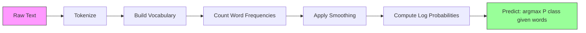

# Naive Bayes

> "Naive" 假设在数学上是错的，但它就是有效。这正是它的精妙之处。

**Type:** Build
**Language:** Python
**Prerequisites:** Phase 2, Lessons 01-07 (classification, Bayes' theorem)
**Time:** ~75 minutes

## Learning Objectives

- 从零实现带 Laplace smoothing 的 Multinomial Naive Bayes，用于文本分类
- 解释为什么 naive 独立性假设在数学上是错误的，但在实践中却能给出正确的类别排序
- 比较 Multinomial、Bernoulli 和 Gaussian Naive Bayes 三种变体，并为给定的特征类型挑选合适的版本
- 在高维稀疏数据上把 Naive Bayes 与 logistic regression 做对比，并解释背后起作用的 bias-variance tradeoff

## The Problem

你需要做文本分类。把邮件分成 spam 和 not-spam。把用户评论分成正面和负面。把工单分成不同类别。你有成千上万个特征（每个词一个），训练数据却很有限。

大多数分类器在这里都会卡住。Logistic regression 需要足够的样本才能稳定地估计成千上万个权重。Decision trees 一次只在一个词上做分裂，会严重过拟合。KNN 在 10,000 维空间里几乎没有意义，因为每个点到其他点的距离都差不多。

Naive Bayes 能搞定这种场景。它做了一个数学上明显错误的假设（每个特征在给定类别下都与其他特征独立），却仍然在文本分类上击败那些"更聪明"的模型，尤其是在小训练集上。它只需对数据扫一遍就能完成训练。它能扩展到上百万个特征。它还能给出概率估计（虽然由于独立性假设的存在，校准通常很差）。

理解为什么一个错误的假设能带来好的预测，会让你在机器学习中领悟到一个根本道理：最好的模型不是最"正确"的那个，而是在你数据上拥有最佳 bias-variance tradeoff 的那个。

## The Concept

### Bayes' Theorem (Quick Review)

Bayes' theorem 把条件概率翻转过来：

```
P(class | features) = P(features | class) * P(class) / P(features)
```

我们想要的是 `P(class | features)`——给定文档中的词，文档属于某个类别的概率。它可以由以下几项算出：
- `P(features | class)`——在该类别的文档中观察到这些词的 likelihood
- `P(class)`——该类别的 prior 概率（spam 整体上有多常见？）
- `P(features)`——证据项，对所有类别都一样，因此在比较时可以忽略

`P(class | features)` 最高的那个类别胜出。

### The Naive Independence Assumption

要精确计算 `P(features | class)`，需要估计所有特征的联合概率。词表有 10,000 个词时，你得对 2^10,000 种可能组合上的分布做估计。不可能。

Naive 假设：每个特征在给定类别下都条件独立。

```
P(w1, w2, ..., wn | class) = P(w1 | class) * P(w2 | class) * ... * P(wn | class)
```

不再去估计一个无法搞定的联合分布，而是估计 n 个简单的逐特征分布。每个分布只需要一个计数。

这个假设显然是错的。"machine" 和 "learning" 这两个词在任何文档里都不可能独立。但分类器并不需要正确的概率估计，它需要的是正确的排序——哪个类别的概率最高。独立性假设会带来系统性误差，但这些误差对所有类别影响相似，因此排序仍然正确。

### Why It Still Works

三个原因：

1. **排序优于校准。** 分类只需要排在第一的类别是对的。即便真概率是 0.7，分类器算出的 P(spam) = 0.99999，它仍然能正确选出 spam。我们不需要正确的概率，我们需要正确的赢家。

2. **高 bias，低 variance。** 独立性假设是一个很强的 prior。它对模型施加了重度约束，从而避免过拟合。在训练数据有限时，一个稍微有点错但稳定的模型，会胜过一个理论上正确却剧烈不稳定的模型。这就是 bias-variance tradeoff 在起作用。

3. **特征冗余相互抵消。** 相关特征提供的是冗余证据。分类器会重复计算这些证据，但它对正确的类别也同样重复计算。如果 "machine" 和 "learning" 总是同时出现，它们都为 "tech" 类别提供证据。NB 把它们计了两次，但是是为正确的类别计了两次。

还有第四个、偏实践的原因：Naive Bayes 极快。训练只需对数据扫一遍统计频次。预测就是一次矩阵乘法。你能在几秒内训练一百万份文档。这种速度意味着你可以更快迭代，尝试更多特征集合，做更多实验，远超那些慢吞吞的模型。

### The Math Step by Step

我们用一个具体例子走一遍。假设有两个类别：spam 和 not-spam。词表里有三个词："free"、"money"、"meeting"。

训练数据：
- Spam 邮件中 "free" 出现 80 次，"money" 出现 60 次，"meeting" 出现 10 次（共 150 个词）
- Not-spam 邮件中 "free" 出现 5 次，"money" 出现 10 次，"meeting" 出现 100 次（共 115 个词）
- 40% 的邮件是 spam，60% 不是 spam

应用 Laplace smoothing（alpha=1）：

```
P(free | spam)    = (80 + 1) / (150 + 3) = 81/153 = 0.529
P(money | spam)   = (60 + 1) / (150 + 3) = 61/153 = 0.399
P(meeting | spam) = (10 + 1) / (150 + 3) = 11/153 = 0.072

P(free | not-spam)    = (5 + 1) / (115 + 3) = 6/118 = 0.051
P(money | not-spam)   = (10 + 1) / (115 + 3) = 11/118 = 0.093
P(meeting | not-spam) = (100 + 1) / (115 + 3) = 101/118 = 0.856
```

新邮件包含："free"（2 次）、"money"（1 次）、"meeting"（0 次）。

```
log P(spam | email) = log(0.4) + 2*log(0.529) + 1*log(0.399) + 0*log(0.072)
                    = -0.916 + 2*(-0.637) + (-0.919) + 0
                    = -3.109

log P(not-spam | email) = log(0.6) + 2*log(0.051) + 1*log(0.093) + 0*log(0.856)
                        = -0.511 + 2*(-2.976) + (-2.375) + 0
                        = -8.838
```

Spam 大幅胜出。"free" 出现两次是 spam 的强力证据。注意 "meeting" 没出现时对两侧 log 求和的贡献都是零（0 * log(P)）——在 Multinomial NB 里，没出现的词不产生影响。是 Bernoulli NB 才会显式建模词的"缺席"。

### Three Variants

Naive Bayes 有三种风味，每种都对 `P(feature | class)` 做了不同的建模。

#### Multinomial Naive Bayes

把每个特征建模为计数。最适合特征是词频或 TF-IDF 值的文本数据。

```
P(word_i | class) = (count of word_i in class + alpha) / (total words in class + alpha * vocab_size)
```

这里的 `alpha` 就是 Laplace smoothing（下面会讲）。这个变体是文本分类的主力。

#### Gaussian Naive Bayes

把每个特征建模为正态分布。最适合连续特征。

```
P(x_i | class) = (1 / sqrt(2 * pi * var)) * exp(-(x_i - mean)^2 / (2 * var))
```

每个类别为每个特征单独估计 mean 和 variance。当特征在每个类别内部确实呈钟形分布时，这种方式效果不错。

#### Bernoulli Naive Bayes

把每个特征建模为二元值（出现或不出现）。最适合短文本或二值特征向量。

```
P(word_i | class) = (docs in class containing word_i + alpha) / (total docs in class + 2 * alpha)
```

与 Multinomial 不同，Bernoulli 会显式地惩罚某个词的"缺席"。如果 "free" 通常出现在 spam 中，但这封邮件里没有，Bernoulli 会把这视作 spam 的反面证据。

### When to Use Each Variant

| Variant | Feature Type | Best For | Example |
|---------|-------------|----------|---------|
| Multinomial | Counts or frequencies | Text classification, bag-of-words | Email spam, topic classification |
| Gaussian | Continuous values | Tabular data with normal-ish features | Iris classification, sensor data |
| Bernoulli | Binary (0/1) | Short text, binary feature vectors | SMS spam, presence/absence features |

### Laplace Smoothing

如果某个词出现在测试数据中，但训练数据里某个类别下从未出现过，会发生什么？

不做 smoothing 时：`P(word | class) = 0/N = 0`。一个零乘进整个连乘里，会让 `P(class | features) = 0`，无论其他证据多么充足。一个没见过的词就能毁掉整个预测，哪怕其他证据再强。

Laplace smoothing 会给每个特征计数加上一个小的计数 `alpha`（通常是 1）：

```
P(word_i | class) = (count(word_i, class) + alpha) / (total_words_in_class + alpha * vocab_size)
```

当 alpha=1 时，每个词都至少有一个微小的概率。测试邮件里出现 "discombobulate" 不再会把 spam 概率打成零。这种 smoothing 有 Bayesian 的解释：它等价于在词分布上放置一个均匀的 Dirichlet prior。

alpha 越大，smoothing 越强（分布越均匀）。alpha 越小，模型越信任数据。Alpha 是一个需要调优的 hyperparameter。

alpha 的影响：

| Alpha | Effect | When to use |
|-------|--------|-------------|
| 0.001 | Almost no smoothing, trust the data | Very large training set, no unseen features expected |
| 0.1 | Light smoothing | Large training set |
| 1.0 | Standard Laplace smoothing | Default starting point |
| 10.0 | Heavy smoothing, flattens distributions | Very small training set, many unseen features expected |

### Log-Space Computation

把上百个概率（每个都小于 1）相乘会触发浮点数下溢。即便真值是一个很小的正数，浮点数也会算出零。

解决办法：在 log 空间里运算。不再相乘概率，而是把它们的对数相加：

```
log P(class | x1, x2, ..., xn) = log P(class) + sum_i log P(xi | class)
```

这把预测变成了一次点积：

```
log_scores = X @ log_feature_probs.T + log_class_priors
prediction = argmax(log_scores)
```

矩阵乘法。这就是 Naive Bayes 预测如此之快的原因——它和单层线性模型用的是同一种运算。

### Naive Bayes vs Logistic Regression

两者都是用于文本的线性分类器。区别在于它们建模的对象。

| Aspect | Naive Bayes | Logistic Regression |
|--------|------------|-------------------|
| Type | Generative (models P(X\|Y)) | Discriminative (models P(Y\|X)) |
| Training | Count frequencies | Optimize loss function |
| Small data | Better (strong prior helps) | Worse (not enough to estimate weights) |
| Large data | Worse (wrong assumption hurts) | Better (flexible boundary) |
| Features | Assumes independence | Handles correlations |
| Speed | Single pass, very fast | Iterative optimization |
| Calibration | Poor probabilities | Better probabilities |

经验法则：先用 Naive Bayes。如果数据足够多、NB 性能停滞了，再切换到 logistic regression。

### Classification Pipeline



实践中我们都在 log 空间里运算，避免浮点下溢。不再连乘许多小概率，而是把它们的对数相加：

```
log P(class | features) = log P(class) + sum_i log P(feature_i | class)
```

## Build It

`code/naive_bayes.py` 中的代码从零实现了 MultinomialNB 和 GaussianNB。

### MultinomialNB

从零实现的步骤：

1. **fit(X, y)**：对每个类别，统计每个特征的出现频次。加上 Laplace smoothing。计算 log 概率。保存类别 prior（类别频率的 log 值）。

2. **predict_log_proba(X)**：对每个样本，计算所有类别的 log P(class) + sum of log P(feature_i | class)。这就是一次矩阵乘法：X @ log_probs.T + log_priors。

3. **predict(X)**：返回 log 概率最高的那个类别。

```python
class MultinomialNB:
    def __init__(self, alpha=1.0):
        self.alpha = alpha

    def fit(self, X, y):
        classes = np.unique(y)
        n_classes = len(classes)
        n_features = X.shape[1]

        self.classes_ = classes
        self.class_log_prior_ = np.zeros(n_classes)
        self.feature_log_prob_ = np.zeros((n_classes, n_features))

        for i, c in enumerate(classes):
            X_c = X[y == c]
            self.class_log_prior_[i] = np.log(X_c.shape[0] / X.shape[0])
            counts = X_c.sum(axis=0) + self.alpha
            self.feature_log_prob_[i] = np.log(counts / counts.sum())

        return self
```

关键洞察：fit 之后，预测就是一次矩阵乘法加一个偏置项。这就是 Naive Bayes 如此之快的原因。

### GaussianNB

对连续特征，我们为每个类别每个特征估计 mean 和 variance：

```python
class GaussianNB:
    def __init__(self):
        pass

    def fit(self, X, y):
        classes = np.unique(y)
        self.classes_ = classes
        self.means_ = np.zeros((len(classes), X.shape[1]))
        self.vars_ = np.zeros((len(classes), X.shape[1]))
        self.priors_ = np.zeros(len(classes))

        for i, c in enumerate(classes):
            X_c = X[y == c]
            self.means_[i] = X_c.mean(axis=0)
            self.vars_[i] = X_c.var(axis=0) + 1e-9
            self.priors_[i] = X_c.shape[0] / X.shape[0]

        return self
```

预测时对每个特征用 Gaussian PDF 计算，然后跨特征相乘（在 log 空间里相加）。

### Demo: Text Classification

代码会生成模拟两个类别（科技文章 vs 体育文章）的合成 bag-of-words 数据。每个类别有不同的词频分布。MultinomialNB 用词计数对它们分类。

合成数据是这样工作的：我们造 200 个"词"（特征列）。词 0-39 在科技文章里高频、在体育文章里低频。词 80-119 在体育文章里高频、在科技文章里低频。词 40-79 在两者中都属于中等频率。这模拟了一个真实场景：有些词是强类别指示词，有些则是噪声。

### Demo: Continuous Features

代码会生成类似 Iris 的数据（3 个类别，4 个特征，Gaussian 簇）。GaussianNB 用各类别的 mean 和 variance 进行分类。每个类别有不同的中心（均值向量）和不同的离散程度（方差），模拟现实中不同类别的测量值会出现系统性差异的情况。

代码还演示了：
- **Smoothing comparison：** 用不同 alpha 值训练 MultinomialNB，展示 smoothing 强度对准确率的影响。
- **Training size experiment：** NB 准确率如何随训练数据从 20 增长到 1600 而提升。NB 即便在样本极少时也能达到不错的准确率——这是它的主要优势。
- **Confusion matrix：** 各类别的 precision、recall 和 F1，以展示 NB 在哪些地方会出错。

### Prediction Speed

Naive Bayes 的预测就是一次矩阵乘法。对 n 个样本、d 个特征、k 个类别：
- MultinomialNB：一次矩阵乘法 (n x d) @ (d x k) = O(n * d * k)
- GaussianNB：n * k 次 Gaussian PDF 计算，每次涉及 d 个特征 = O(n * d * k)

两者在每个维度上都是线性的。对比之下，KNN（需要对所有训练点做距离计算）或带 RBF kernel 的 SVM（需要对所有支持向量做核函数计算）都慢得多。NB 在预测阶段比它们快上几个数量级。

## Use It

用 sklearn，两种变体都是一行搞定：

```python
from sklearn.naive_bayes import GaussianNB, MultinomialNB

gnb = GaussianNB()
gnb.fit(X_train, y_train)
print(f"GaussianNB accuracy: {gnb.score(X_test, y_test):.3f}")

mnb = MultinomialNB(alpha=1.0)
mnb.fit(X_train_counts, y_train)
print(f"MultinomialNB accuracy: {mnb.score(X_test_counts, y_test):.3f}")
```

用 sklearn 做文本分类：

```python
from sklearn.feature_extraction.text import CountVectorizer
from sklearn.naive_bayes import MultinomialNB
from sklearn.pipeline import Pipeline

text_clf = Pipeline([
    ("vectorizer", CountVectorizer()),
    ("classifier", MultinomialNB(alpha=1.0)),
])

text_clf.fit(train_texts, train_labels)
accuracy = text_clf.score(test_texts, test_labels)
```

`naive_bayes.py` 中的代码会把从零实现的版本与 sklearn 在相同数据上做对比，以验证正确性。

### TF-IDF with Naive Bayes

原始词计数让每次出现的每个词都有相同权重。但像 "the"、"is" 这种常见词在每个类别里都频繁出现——它们没有信息量。TF-IDF（Term Frequency - Inverse Document Frequency）会降权常见词，加权稀有但有判别力的词。

```python
from sklearn.feature_extraction.text import TfidfVectorizer
from sklearn.naive_bayes import MultinomialNB
from sklearn.pipeline import Pipeline

text_clf = Pipeline([
    ("tfidf", TfidfVectorizer()),
    ("classifier", MultinomialNB(alpha=0.1)),
])
```

TF-IDF 值是非负的，所以可以喂给 MultinomialNB。TF-IDF + MultinomialNB 是文本分类最强的 baseline 之一。在训练样本少于 10,000 的数据集上，它经常击败更复杂的模型。

### BernoulliNB for Short Text

对于短文本（推特、SMS、聊天消息），BernoulliNB 可以胜过 MultinomialNB。短文本词数本就很少，导致 MultinomialNB 依赖的频次信息噪声很大。BernoulliNB 只关心出现与否，对短文本而言更可靠。

```python
from sklearn.naive_bayes import BernoulliNB
from sklearn.feature_extraction.text import CountVectorizer

text_clf = Pipeline([
    ("vectorizer", CountVectorizer(binary=True)),
    ("classifier", BernoulliNB(alpha=1.0)),
])
```

CountVectorizer 中的 `binary=True` 会把所有计数都转成 0/1。不加这个参数 BernoulliNB 也能跑，但它接收到的是它本身并不为之设计的计数值。

### Calibrating NB Probabilities

NB 的概率校准很差。当 NB 说 P(spam) = 0.95 时，真实概率可能只有 0.7。如果你需要可靠的概率估计（例如设置阈值或与其他模型融合），就用 sklearn 的 CalibratedClassifierCV：

```python
from sklearn.calibration import CalibratedClassifierCV

calibrated_nb = CalibratedClassifierCV(MultinomialNB(), cv=5, method="sigmoid")
calibrated_nb.fit(X_train, y_train)
proba = calibrated_nb.predict_proba(X_test)
```

它会用交叉验证在 NB 的原始分数上拟合一个 logistic regression。最终得到的概率会更接近真实的类别频率。

### Common Gotchas

1. **负的特征值。** MultinomialNB 要求特征非负。如果你有负值（比如某些设置下的 TF-IDF 或标准化后的特征），就改用 GaussianNB，或者把特征整体平移成正值。

2. **零方差特征。** GaussianNB 要除以 variance。如果某个特征对某个类别方差为零（所有值都相同），概率计算就会崩。代码中给所有方差加了一个小的 smoothing 项（1e-9）来防止这种情况。

3. **类别不均衡。** 如果 99% 的邮件是 not-spam，那么 P(not-spam) = 0.99 这个 prior 会强到压倒 likelihood 证据。你可以手动设置类别 prior，或者使用 sklearn 中的 class_prior 参数。

4. **特征缩放。** MultinomialNB 不需要缩放（它本就在计数上工作）。GaussianNB 也不需要缩放（它对每个特征单独估计统计量）。这是相对 logistic regression 和 SVM 的优势——后两者对特征尺度敏感。

## Ship It

本课产出：
- `outputs/skill-naive-bayes-chooser.md` —— 用于挑选合适 NB 变体的 decision skill
- `code/naive_bayes.py` —— 从零实现的 MultinomialNB 和 GaussianNB，并与 sklearn 对比

### When Naive Bayes Fails

当独立性假设导致排序错误（不只是概率估计错误）时，NB 就会失效。这通常发生在：

1. **强烈的特征交互。** 如果类别取决于两个特征的组合而单独看任一个都没规律（类似 XOR 模式），NB 就会完全错过。每个特征单独都不提供证据，而 NB 没法把它们非线性地组合起来。

2. **高度相关、证据相反的特征。** 如果特征 A 指向 "spam"、特征 B 指向 "not-spam"，但 A 和 B 实际上完全相关（现实中它们总是一致），NB 会看到本不存在的"矛盾证据"。

3. **非常大的训练集。** 当数据足够多时，logistic regression 这类判别式模型能学到真正的决策边界，从而胜过 NB。在小数据上有帮助的独立性假设，此刻反而拖了模型的后腿。

实践中，这些失败模式在文本分类里很少见。文本特征数量多、单个特征都很弱，独立性假设带来的误差往往会相互抵消。对于强相关特征不多的表格数据，可以先考虑 logistic regression 或基于树的模型。

## Exercises

1. **Smoothing experiment.** 在文本数据上用 alpha 值 0.01、0.1、1.0、10.0、100.0 训练 MultinomialNB。画出 accuracy vs alpha。性能在哪里达到峰值？为什么 alpha 太大反而有害？

2. **Feature independence test.** 找一个真实文本数据集。挑两个明显相关的词（"machine" 和 "learning"）。计算 P(word1 | class) * P(word2 | class)，再和 P(word1 AND word2 | class) 做对比。独立性假设错得有多离谱？这影响分类准确率吗？

3. **Bernoulli implementation.** 在代码中扩展一个 BernoulliNB 类。把 bag-of-words 转成二值（出现/未出现），并在文本数据上与 MultinomialNB 比较准确率。Bernoulli 什么时候会胜出？

4. **NB vs Logistic Regression.** 在文本数据上同时训练两者。从 100 个训练样本开始，逐步增加到 10,000。画出两者的 accuracy vs training set size。Logistic Regression 在哪个点超过 Naive Bayes？

5. **Spam filter.** 构建一个完整的 spam 分类器：对原始邮件文本做分词，构建词表，生成 bag-of-words 特征，训练 MultinomialNB，并用 precision 和 recall 评估（不只是 accuracy——为什么？）。

## Key Terms

| Term | What people say | What it actually means |
|------|----------------|----------------------|
| Naive Bayes | "Simple probabilistic classifier" | A classifier that applies Bayes' theorem with the assumption that features are conditionally independent given the class |
| Conditional independence | "Features don't affect each other" | P(A, B \| C) = P(A \| C) * P(B \| C) -- knowing B tells you nothing new about A once you know C |
| Laplace smoothing | "Add-one smoothing" | Adding a small count to every feature to prevent zero probabilities from dominating the prediction |
| Prior | "What you believed before seeing data" | P(class) -- the probability of each class before observing any features |
| Likelihood | "How well the data fits" | P(features \| class) -- the probability of observing these features if the class is known |
| Posterior | "What you believe after seeing data" | P(class \| features) -- the updated probability of the class after observing the features |
| Generative model | "Models how data is generated" | A model that learns P(X \| Y) and P(Y), then uses Bayes' theorem to get P(Y \| X) |
| Discriminative model | "Models the decision boundary" | A model that directly learns P(Y \| X) without modeling how X is generated |
| Log probability | "Avoid underflow" | Working with log P instead of P to prevent the product of many small numbers from becoming zero in floating point |

## Further Reading

- [scikit-learn Naive Bayes docs](https://scikit-learn.org/stable/modules/naive_bayes.html) -- all three variants with mathematical details
- [McCallum and Nigam, A Comparison of Event Models for Naive Bayes Text Classification (1998)](https://www.cs.cmu.edu/~knigam/papers/multinomial-aaaiws98.pdf) -- the classic comparison of Multinomial vs Bernoulli for text
- [Rennie et al., Tackling the Poor Assumptions of Naive Bayes Text Classifiers (2003)](https://people.csail.mit.edu/jrennie/papers/icml03-nb.pdf) -- improvements to NB for text
- [Ng and Jordan, On Discriminative vs. Generative Classifiers (2001)](https://ai.stanford.edu/~ang/papers/nips01-discriminativegenerative.pdf) -- proves NB converges faster than LR with less data
