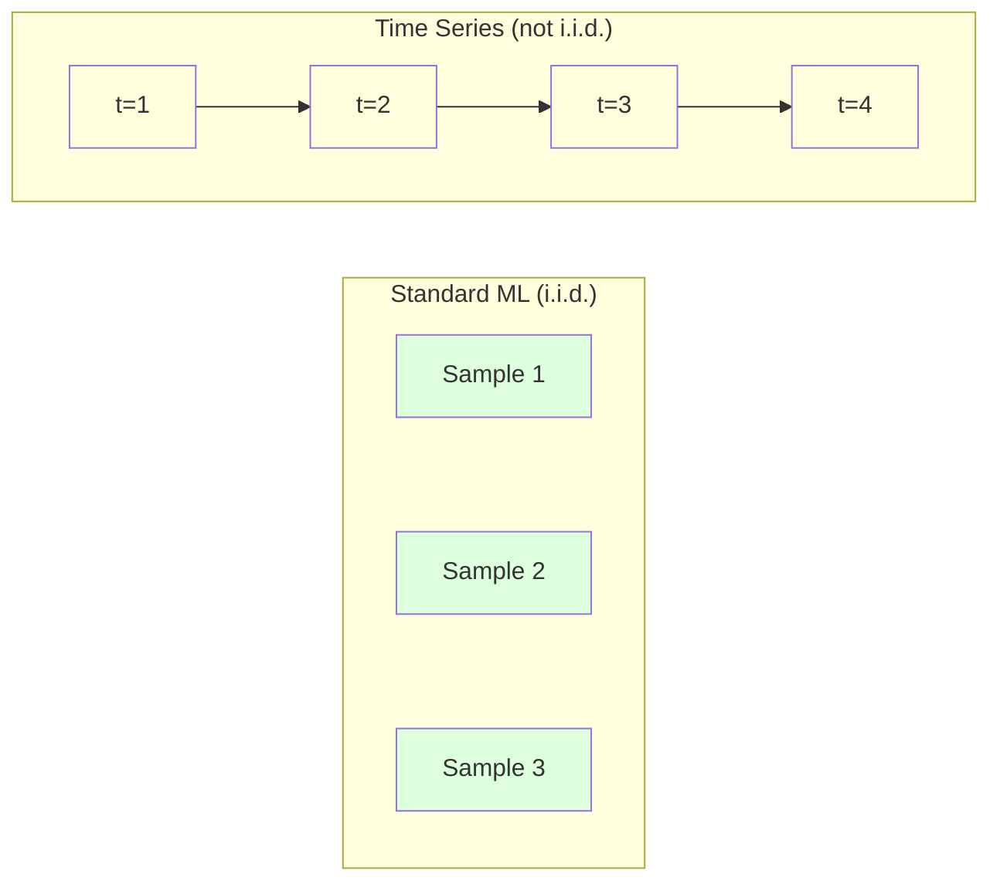
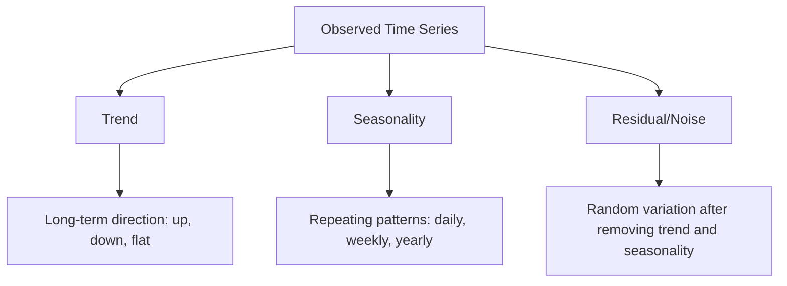
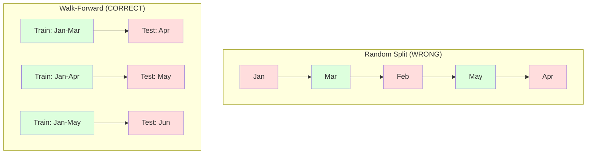

# 时间序列基础

> 历史业绩确实可以预示未来表现——前提是你先检验过平稳性。

**类型：** Build
**语言：** Python
**前置知识：** 第 2 阶段，第 01–09 课
**用时：** 约 90 分钟

## 学习目标

- 将时间序列分解为趋势、季节性和残差成分，并检验平稳性
- 实现滞后特征和滚动统计量，把时间序列转换为有监督学习问题
- 构建 walk-forward 验证框架，防止未来数据泄漏到训练集中
- 解释为什么随机训练/测试划分对时间序列无效，并展示其与正确的时间划分之间的性能差距

## 问题背景

你手上有一组按时间排序的数据：每日销量、每小时温度、每分钟 CPU 使用率、每周股价。你希望预测下一个值、下一周或下一个季度。

你拿起标准的 ML 工具箱：随机训练/测试划分、交叉验证，输入特征矩阵，输出预测。每一步都是错的。

时间序列违反了标准 ML 所依赖的假设。样本不再独立——今天的温度依赖于昨天的。随机划分会把未来的信息泄漏到过去。那些在回测中表现亮眼的特征，会在生产中失败，因为它们依赖的模式会随时间发生变化。

一个在随机交叉验证下达到 95% 准确率的模型，在正确的基于时间的评估下可能只有 55%。这种差距不是技术细节，而是“纸上模型”与“生产可用模型”之间的本质区别。

本课介绍基本功：是什么让时间数据与众不同，如何诚实地评估模型，以及如何把时间序列转换成标准 ML 模型可以消费的特征。

## 概念讲解

### 是什么让时间序列与众不同

标准 ML 假设 i.i.d.——独立同分布。每个样本都从同一分布中独立抽取。时间序列同时违反了这两点：

- **不独立。** 今天的股价依赖于昨天。本周的销量与上周相关。
- **不同分布。** 分布会随时间漂移。12 月的销量和 3 月的销量长得完全不同。

这些违反不是小事。它们会改变你构造特征的方式、评估模型的方式，以及哪些算法行得通。



在标准 ML 中，样本可以互换。打乱顺序毫无影响。在时间序列中，顺序就是一切。打乱会摧毁信号。

### 时间序列的组成成分

每条时间序列都是以下成分的组合：



- **Trend（趋势）**：长期方向。营收每年增长 10%，全球温度逐年升高。
- **Seasonality（季节性）**：在固定周期上重复的模式。零售销量在 12 月飙升，空调用电量在 7 月达到峰值。
- **Residual（残差）**：去除趋势和季节性之后剩下的部分。如果残差看起来像白噪声，说明分解抓住了主要信号。

### 平稳性

如果一条时间序列的统计性质（均值、方差、自相关）不随时间变化，就称它是平稳的。大多数预测方法都假设序列是平稳的。

**为什么重要：** 非平稳序列的均值会漂移。一个用 1 月数据训练出来的模型学到的均值，与 2 月将出现的均值不一致。它会出现系统性偏差。

**怎么检查：** 在滑动窗口上计算滚动均值和滚动标准差。如果它们在漂移，序列就是非平稳的。

**怎么修：** Differencing（差分）。不要直接对原始值建模，而是对相邻取值之间的变化建模：

```
diff[t] = value[t] - value[t-1]
```

如果一阶差分还不能让序列平稳，再来一次（二阶差分）。大多数现实中的序列最多需要两次差分。

**示例：**

原始序列：[100, 102, 106, 112, 120]
一阶差分： [2, 4, 6, 8]（仍呈上升趋势）
二阶差分： [2, 2, 2]（恒定——平稳）

原始序列是二次趋势。一阶差分把它变成了线性趋势。二阶差分把它压平。在实际中，超过两轮差分的情况很少见。

**正式检验：** Augmented Dickey-Fuller (ADF) test 是平稳性的标准统计检验。原假设是“序列非平稳”。p 值低于 0.05 时可以拒绝原假设并判定为平稳。我们不会从零实现 ADF（它需要渐近分布表），但代码中的滚动统计方法可以提供实用的可视化检查。

### 自相关

自相关衡量时刻 t 的值与 t-k（即 k 步之前）的值之间的相关程度。自相关函数（ACF）将这个相关系数随每个滞后 k 绘出。

**ACF 能告诉你：**
- 序列“记忆”能延伸多远。如果 ACF 在滞后 5 之后跌到零，那么 5 步之前的值就无关紧要。
- 是否存在季节性。如果 ACF 在滞后 12（月度数据）出现尖峰，则存在年度季节性。
- 该构造多少个滞后特征。把滞后取到 ACF 变得可忽略的位置即可。

**PACF（偏自相关函数）** 去除了间接相关。如果今天与 3 天前相关，仅仅因为两者都与昨天相关，那么 PACF 在滞后 3 处会接近零，而 ACF 在滞后 3 处不会。

### 滞后特征：把时间序列变成有监督学习

标准 ML 模型需要特征矩阵 X 和目标 y。时间序列只给你单一一列数值。把两者连起来的桥梁就是滞后特征。

把序列 [10, 12, 14, 13, 15] 构造出滞后 1 和滞后 2 的特征：

| lag_2 | lag_1 | target |
|-------|-------|--------|
| 10    | 12    | 14     |
| 12    | 14    | 13     |
| 14    | 13    | 15     |

现在你拥有了一个标准的回归问题。任何 ML 模型（线性回归、随机森林、梯度提升）都可以从滞后特征预测目标。

你还可以工程化以下特征：
- **Rolling statistics（滚动统计）：** 最近 k 个值的均值、标准差、最小值、最大值
- **Calendar features（日历特征）：** 星期几、月份、is_holiday、is_weekend
- **Differenced values（差分值）：** 与上一时刻相比的变化
- **Expanding statistics（累积统计）：** 累积均值、累积求和
- **Ratio features（比例特征）：** 当前值 / 滚动均值（与近期均值的偏离程度）
- **Interaction features（交互特征）：** lag_1 * day_of_week（工作日对动量的影响）

**用多少个滞后？** 看自相关函数。如果 ACF 在滞后 10 之内都显著，至少用 10 个滞后。如果存在周度季节性，加入滞后 7（也可能再加 14）。滞后越多，模型见到的历史就越长，但需要拟合的特征也越多，过拟合风险随之增加。

**目标对齐陷阱。** 构造滞后特征时，目标必须是时刻 t 的值，所有特征必须使用 t-1 或更早时刻的值。如果不小心把时刻 t 的值也作为特征，你就拥有了一个完美的预测器——以及一个毫无用处的模型。这是时间序列特征工程中最常见的 bug。

### Walk-Forward 验证

这是本课最重要的概念。标准 k-fold 交叉验证会把样本随机分给训练集和测试集。对时间序列而言，这会泄漏未来信息。



Walk-forward 验证的步骤：
1. 用截至时刻 t 的数据训练
2. 预测 t+1（或多步预测时的 t+1 到 t+k）
3. 把窗口向前滑动
4. 重复

每一折的测试集都只包含全部训练数据之后的数据。不会有未来泄漏。这样你才能得到模型在生产部署时的诚实性能估计。

**Expanding window（扩展窗口）** 用全部历史数据训练（窗口不断变长）。**Sliding window（滑动窗口）** 用固定长度的训练窗口（窗口随时间滑动）。如果你认为旧数据仍然相关，使用扩展窗口；如果世界在变、旧数据反而拖后腿，则使用滑动窗口。

### ARIMA 直觉

ARIMA 是经典的时间序列模型，包含三个组件：

- **AR (Autoregressive，自回归)：** 用过去的值做预测。AR(p) 使用最近 p 个值。
- **I (Integrated，积分/差分)：** 通过差分实现平稳。I(d) 表示进行 d 轮差分。
- **MA (Moving Average，移动平均)：** 用过去的预测误差做预测。MA(q) 使用最近 q 个误差。

ARIMA(p, d, q) 把这三者组合起来。p、d、q 可以基于 ACF/PACF 分析或自动搜索（auto-ARIMA）来选择。

我们不会从零实现 ARIMA——它需要数值优化，已超出本课范围。关键是理解每个组件做了什么，这样你才能解读 ARIMA 的结果，并知道何时该用它。

### 何时用什么

| 方案 | 适用场景 | 处理季节性 | 处理外部特征 |
|----------|---------|-------------------|------------------------|
| Lag features + ML | 表格化数据，外部特征多 | 配合日历特征 | 是 |
| ARIMA | 单一单变量序列、短期预测 | SARIMA 变体 | 否（ARIMAX 有限支持） |
| Exponential smoothing | 简单趋势 + 季节性 | 是（Holt-Winters） | 否 |
| Prophet | 业务预测、节假日 | 是（Fourier terms） | 有限 |
| Neural networks (LSTM, Transformer) | 长序列、多序列 | 自动学习 | 是 |

对大多数实际问题，**滞后特征 + 梯度提升**是最强的起点。它天然支持外部特征，不要求平稳，而且容易调试。

### 预测视野与策略

单步预测预测下一个时刻。多步预测预测多个时刻。常见有三种策略：

**Recursive（递归 / 迭代）：** 预测下一步，然后把预测值当作下一步的输入。简单，但误差会累积——每一次预测都用到了前一次的预测值，错误会叠加。

**Direct（直接）：** 为每个 horizon 训练一个独立模型。Model-1 预测 t+1，Model-5 预测 t+5。没有误差累积，但每个模型的训练样本更少，且彼此不共享信息。

**Multi-output（多输出）：** 训练一个模型同时输出所有 horizon。在 horizon 之间共享信息，但要求模型支持多输出（或自定义损失函数）。

对大多数实际问题，短 horizon（1–5 步）从 recursive 起步，长 horizon 用 direct。

### 时间序列中的常见错误

| 错误 | 为什么会发生 | 如何修复 |
|---------|---------------|-----------|
| 随机训练/测试划分 | 标准 ML 的惯性 | 使用 walk-forward 或时间划分 |
| 使用了未来特征 | 不小心把时刻 t 的值放进特征 | 审计每个特征的时间对齐 |
| 在季节性上过拟合 | 模型记忆了日历模式 | 在测试集中保留完整一个季节周期 |
| 忽视尺度变化 | 营收翻倍但模式不变 | 改建模为百分比变化而非绝对值 |
| 滞后特征过多 | “历史越多越好” | 用 ACF 决定相关的滞后 |
| 不做差分 | “模型自己会搞定” | 树模型可以处理趋势；线性模型需要平稳 |

## 动手实现

`code/time_series.py` 中的代码从零实现了核心构件。

### 滞后特征构造器

```python
def make_lag_features(series, n_lags):
    n = len(series)
    X = np.full((n, n_lags), np.nan)
    for lag in range(1, n_lags + 1):
        X[lag:, lag - 1] = series[:-lag]
    valid = ~np.isnan(X).any(axis=1)
    return X[valid], series[valid]
```

它把一维序列转换成特征矩阵，每行的特征是最近 `n_lags` 个值，目标是当前值。

### Walk-Forward 交叉验证

```python
def walk_forward_split(n_samples, n_splits=5, min_train=50):
    assert min_train < n_samples, "min_train must be less than n_samples"
    step = max(1, (n_samples - min_train) // n_splits)
    for i in range(n_splits):
        train_end = min_train + i * step
        test_end = min(train_end + step, n_samples)
        if train_end >= n_samples:
            break
        yield slice(0, train_end), slice(train_end, test_end)
```

每一折都保证训练数据严格位于测试数据之前。每一折的训练窗口都会扩展。

### 简单自回归模型

纯 AR 模型其实就是在滞后特征上做线性回归：

```python
class SimpleAR:
    def __init__(self, n_lags=5):
        self.n_lags = n_lags
        self.weights = None
        self.bias = None

    def fit(self, series):
        X, y = make_lag_features(series, self.n_lags)
        # Solve via normal equations
        X_b = np.column_stack([np.ones(len(X)), X])
        theta = np.linalg.lstsq(X_b, y, rcond=None)[0]
        self.bias = theta[0]
        self.weights = theta[1:]
        return self
```

它在概念上和第 02 课的线性回归完全相同，只是把同一个变量的时间滞后版本作为输入。

### 平稳性检查

代码用滚动统计量从可视化和数值两个角度评估平稳性：

```python
def check_stationarity(series, window=50):
    rolling_mean = np.array([
        series[max(0, i - window):i].mean()
        for i in range(1, len(series) + 1)
    ])
    rolling_std = np.array([
        series[max(0, i - window):i].std()
        for i in range(1, len(series) + 1)
    ])
    return rolling_mean, rolling_std
```

如果滚动均值漂移或滚动标准差变化，序列就是非平稳的。做一次差分再检查。

代码还会通过比较序列前一半和后一半来检查平稳性。如果均值差距超过半个标准差，或方差比超过 2 倍，序列就被标记为非平稳。

### 自相关

```python
def autocorrelation(series, max_lag=20):
    n = len(series)
    mean = series.mean()
    var = series.var()
    acf = np.zeros(max_lag + 1)
    for k in range(max_lag + 1):
        cov = np.mean((series[:n-k] - mean) * (series[k:] - mean))
        acf[k] = cov / var if var > 0 else 0
    return acf
```

## 投入使用

在 sklearn 中，可以把滞后特征直接喂给任何回归器：

```python
from sklearn.linear_model import Ridge
from sklearn.ensemble import GradientBoostingRegressor

X, y = make_lag_features(series, n_lags=10)

for train_idx, test_idx in walk_forward_split(len(X)):
    model = Ridge(alpha=1.0)
    model.fit(X[train_idx], y[train_idx])
    predictions = model.predict(X[test_idx])
```

ARIMA 用 statsmodels：

```python
from statsmodels.tsa.arima.model import ARIMA

model = ARIMA(train_series, order=(5, 1, 2))
fitted = model.fit()
forecast = fitted.forecast(steps=30)
```

`time_series.py` 中的代码同时演示了这两种方案，并通过 walk-forward 验证进行对比。

### sklearn TimeSeriesSplit

sklearn 提供了 `TimeSeriesSplit`，实现 walk-forward 验证：

```python
from sklearn.model_selection import TimeSeriesSplit

tscv = TimeSeriesSplit(n_splits=5)
for train_index, test_index in tscv.split(X):
    X_train, X_test = X[train_index], X[test_index]
    y_train, y_test = y[train_index], y[test_index]
    model.fit(X_train, y_train)
    score = model.score(X_test, y_test)
```

它等价于我们从零实现的 `walk_forward_split`，只是已经集成到 sklearn 的交叉验证框架中。它也能配合 `cross_val_score` 使用：

```python
from sklearn.model_selection import cross_val_score

scores = cross_val_score(model, X, y, cv=TimeSeriesSplit(n_splits=5))
print(f"Mean score: {scores.mean():.4f} +/- {scores.std():.4f}")
```

### 评估指标

时间序列预测使用回归指标，但需要带上时间感知的语境：

- **MAE (Mean Absolute Error，平均绝对误差)：** |y_true - y_pred| 的平均值。原始单位上很容易解读。“预测平均偏离 3.2 度。”
- **RMSE (Root Mean Squared Error，均方根误差)：** 均方误差的平方根。比 MAE 更惩罚大误差。当大误差比许多小误差更糟时使用。
- **MAPE (Mean Absolute Percentage Error，平均绝对百分比误差)：** |error / true_value| * 100 的平均值。与尺度无关，便于跨不同序列比较。但当真实值为零时未定义。
- **朴素基线对比：** 永远要和简单基线对比。Seasonal naive 基线预测“一个周期前的值”（昨天、上周）。如果你的模型打不过 naive，就肯定有问题。

### 滚动特征

代码演示了如何在滞后特征之上加入滚动统计量（窗口为 7 天和 14 天的均值、标准差、最小值、最大值）。这些特征向模型提供了滞后特征本身无法捕捉的近期趋势和波动信息。

例如，如果滚动均值在上升，意味着上行趋势；如果滚动标准差在上升，意味着波动性在加剧。这类模式是树模型可以学到的，而线性模型则做不到。

## 交付成果

本课产出：
- `outputs/prompt-time-series-advisor.md` —— 用于框定时间序列问题的提示词
- `code/time_series.py` —— 滞后特征、walk-forward 验证、AR 模型、平稳性检查

### 必须打败的基线

构建任何模型之前，先建立基线：

1. **Last value (persistence，持续性基线)。** 预测明天等于今天。对很多序列来说，这条基线意外地难以打败。
2. **Seasonal naive（季节性朴素基线）。** 预测今天等于上周（或去年）的同一天。如果你的模型打不过它，就说明它除了季节性之外什么都没学到。
3. **Moving average（移动平均）。** 预测最近 k 个值的平均。能平滑噪声，但抓不住突变。

如果你花哨的 ML 模型输给了 seasonal naive 基线，肯定有 bug。最常见的原因：特征中存在未来泄漏、评估方法错误，或者序列本身就是真正随机、不可预测的。

### 实战建议

1. **先画图。** 任何建模之前，先把原始序列画出来。看看趋势、季节性、异常点、结构断裂（行为突然改变）。30 秒的肉眼检查往往比一小时的自动分析更有用。

2. **先差分，再建模。** 如果序列有明显趋势，先做差分再构造滞后特征。树模型可以处理趋势，但线性模型不行；而且差分本身从不会让事情变差。

3. **至少留出一个完整的季节周期。** 如果存在周度季节性，测试集至少要覆盖一整周；月度则至少覆盖一整月。否则你根本无法判断模型是否捕捉到了季节性模式。

4. **上线后持续监控。** 时间序列模型会随着世界的变化逐渐退化。在滚动窗口上跟踪预测误差。一旦误差开始上升，就用最近的数据重新训练。

5. **警惕 regime change（机制变化）。** 用疫情前数据训练的模型无法预测疫情后的行为。把已知的机制变化指示加入特征，或者使用滑动窗口让模型遗忘旧数据。

6. **对偏态序列做 log 变换。** 营收、价格和计数往往是右偏的。取对数可以稳定方差，把乘性模式变成加性模式，这样线性模型就能处理。在对数空间中预测，再用指数函数还原回原始单位。

## 练习

1. **平稳性实验。** 生成一条带线性趋势的序列。用滚动统计量检查平稳性。做一次一阶差分。再检查一次。对二次趋势，需要几轮差分？

2. **滞后选择。** 在一个季节性序列（period=7）上计算 ACF。哪些滞后的自相关最高？仅用这些滞后（而不是连续的滞后）构造滞后特征。与使用滞后 1 到 7 相比，准确率有提升吗？

3. **Walk-forward 与随机划分的对比。** 在滞后特征上训练一个 Ridge 回归。分别用随机 80/20 划分和 walk-forward 验证来评估。随机划分高估性能多少？

4. **特征工程。** 在滞后特征基础上加入滚动均值（window=7）、滚动标准差（window=7）以及星期几特征。用 walk-forward 验证比较加与不加这些额外特征时的准确率。

5. **多步预测。** 改造 AR 模型，让它预测 5 步而不是 1 步。比较两种策略：(a) 预测一步、把预测值当作下一步的输入（recursive），(b) 为每个 horizon 训练独立模型（direct）。哪个更准？

## 关键术语

| 术语 | 大家怎么说 | 实际含义 |
|------|----------------|----------------------|
| Stationarity | “统计性质不随时间变化” | 均值、方差和自相关结构都不随时间变化的序列 |
| Differencing | “相邻值相减” | 计算 y[t] - y[t-1] 来去除趋势、实现平稳 |
| Autocorrelation (ACF) | “序列与自身的相关性” | 时间序列与其滞后副本之间的相关系数，作为滞后量的函数 |
| Partial autocorrelation (PACF) | “只算直接相关” | 在去除所有更短滞后影响后，滞后 k 处的自相关 |
| Lag features | “把过去的值当输入” | 用 y[t-1], y[t-2], ..., y[t-k] 作为特征预测 y[t] |
| Walk-forward validation | “尊重时间顺序的交叉验证” | 训练数据始终在时间上先于测试数据的评估方式 |
| ARIMA | “经典的时间序列模型” | AutoRegressive Integrated Moving Average：组合过去的值（AR）、差分（I）和过去的误差（MA） |
| Seasonality | “重复出现的日历模式” | 时间序列中与日历周期（日、周、年）相关的规律性、可预测周期 |
| Trend | “长期方向” | 序列水平随时间持续上升或下降 |
| Expanding window | “使用全部历史” | 训练集随每一折增长的 walk-forward 验证 |
| Sliding window | “固定大小的历史” | 训练集是固定长度、随时间向前滑动的 walk-forward 验证 |

## 延伸阅读

- [Hyndman and Athanasopoulos, Forecasting: Principles and Practice (3rd ed.)](https://otexts.com/fpp3/) —— 关于时间序列预测最好的免费教材
- [scikit-learn Time Series Split](https://scikit-learn.org/stable/modules/generated/sklearn.model_selection.TimeSeriesSplit.html) —— sklearn 的 walk-forward 划分器
- [statsmodels ARIMA docs](https://www.statsmodels.org/stable/generated/statsmodels.tsa.arima.model.ARIMA.html) —— 带诊断功能的 ARIMA 实现
- [Makridakis et al., The M5 Competition (2022)](https://www.sciencedirect.com/science/article/pii/S0169207021001874) —— 大规模预测竞赛，对比 ML 方法与统计方法
