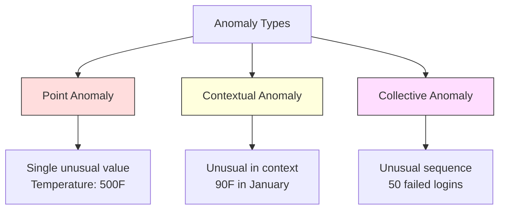
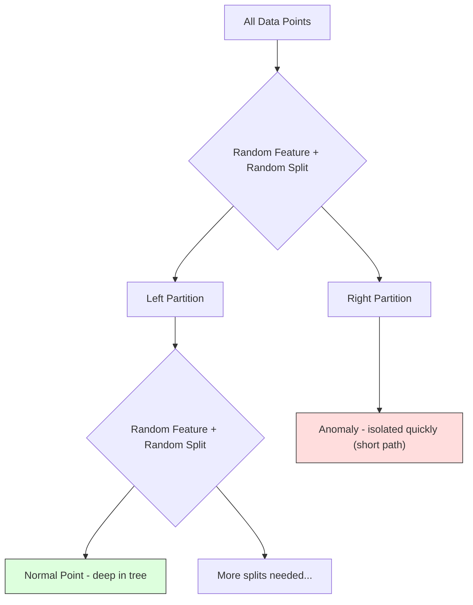
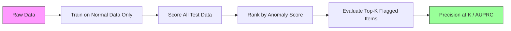

# Anomaly Detection

> 正常很容易定义，异常就是一切不符合正常的事物。

**Type:** Build
**Language:** Python
**Prerequisites:** Phase 2, Lessons 01-09
**Time:** ~75 minutes

## Learning Objectives

- 从零实现 Z-score、IQR 和 Isolation Forest 三种 anomaly detection 方法
- 区分 point、contextual 和 collective 三类 anomaly，并为每种类型选择合适的检测方法
- 解释为什么 anomaly detection 被定义为对正常数据建模，而不是对 anomaly 进行分类
- 比较 unsupervised anomaly detection 与 supervised classification，权衡新型 anomaly 覆盖率和 precision 之间的取舍

## The Problem

一张信用卡下午 2 点在纽约刷卡，2 点零 5 分又在东京被使用。一个工厂传感器读数为 150 度，而正常范围是 80 到 120 度。一台服务器每秒收到 50,000 个请求，而日均仅 200 个。

这些都是 anomaly。发现它们至关重要。Fraud 造成数十亿美元损失，设备故障带来停机成本，网络入侵则意味着数据泄露。

挑战在于：你很少能拿到带标签的 anomaly 样本。Fraud 仅占交易的 0.1%，设备故障一年只发生几次。你无法训练标准的 classifier，因为「anomaly」这一类几乎没有可学习的样本。即便拥有部分标签，已知的 anomaly 也只是冰山一角。明天的 fraud 手法和今天看起来截然不同。

Anomaly detection 反过来思考这个问题。与其学习什么是异常，不如学习什么是正常。任何偏离正常的样本都是可疑的。这种方法不需要标签，能适应新型 anomaly，并且可以扩展到海量数据集。

## The Concept

### Types of Anomalies

并非所有 anomaly 都一样：

- **Point anomalies。** 单个数据点本身就异常，与上下文无关。比如温度读数 500 度，或某个平时只花 50 美元的账户突然出现 50,000 美元的交易。
- **Contextual anomalies。** 在特定上下文下显得异常的数据点。90 度的气温在夏天是正常的，但在冬天就是 anomaly。同样的数值，不同的上下文。
- **Collective anomalies。** 一组数据点作为序列出现时显得异常，尽管单个点可能都正常。5 次登录失败是正常的，连续 50 次就是暴力破解攻击。

大多数方法只检测 point anomaly。Contextual anomaly 需要时间或位置等特征。Collective anomaly 则需要支持序列建模的方法。



### The Unsupervised Framing

在标准 classification 中，两类都有标签。但在 anomaly detection 里，你通常会面对以下三种情况之一：

1. **Fully unsupervised。** 完全没有标签。在所有数据上训练 detector，并寄希望于 anomaly 足够稀有，不会污染「正常」模型。
2. **Semi-supervised。** 你有一份只包含正常数据的干净数据集。在这份干净数据上训练，对其他数据进行打分。这是条件允许时最强的设定。
3. **Weakly supervised。** 你有少量带标签的 anomaly。仅用于评估，不用于训练。先无监督训练，再在带标签子集上度量 precision/recall。

关键洞察：anomaly detection 与 classification 在本质上不同。你建模的是正常数据的分布，而不是两个类别之间的决策边界。

### Supervised vs Unsupervised: The Tradeoff

如果你确实有带标签的 anomaly，应该用它们来训练（supervised classification），还是只用于评估（unsupervised detection）？

**Supervised（当作 classification）：**
- 能精准捕捉你之前见过的 anomaly 类型
- 在已知 anomaly 类型上 precision 更高
- 完全错过新型 anomaly
- 出现新型 anomaly 时需要重新训练
- 需要足够多的 anomaly 样本（往往太少）

**Unsupervised（建模正常，标记偏离）：**
- 能捕捉任何对正常的偏离，包括新型 anomaly
- 不需要带标签的 anomaly
- false positive 率更高（不是所有异常都是坏的）
- 对分布偏移更稳健

实际中最好的系统会两者结合：用 unsupervised detection 进行广覆盖，用 supervised 模型应对已知的高优先级 anomaly 类型，再让人工审核处理模糊情况。

### Z-Score Method

最简单的方法。计算每个特征的均值和标准差，把偏离均值超过 k 个标准差的点都标记为 anomaly。

```text
z_score = (x - mean) / std
anomaly if |z_score| > threshold
```

默认阈值是 3.0（对 Gaussian 分布而言，99.7% 的正常数据都落在 3 个标准差之内）。

**Strengths：** 简单、快速、可解释（「这个值偏离正常 4.5 个标准差」）。

**Weaknesses：** 假设数据服从正态分布。对训练数据中的离群值敏感（离群值会拉高均值并放大标准差，使其更难被检出）。在多峰分布上失效。

**适用场景：** 单特征监控且数据大致呈钟形分布。比如服务器响应时间、制造业容差、有稳定基线的传感器读数。

**失效场景：** 多簇数据（两个办公地点温度基线不同）、偏态数据（交易金额中 1000 美元罕见但并非异常）、训练集中存在离群值的数据。

### IQR Method

比 Z-score 更稳健。使用四分位距（interquartile range）替代均值和标准差。

```
Q1 = 25th percentile
Q3 = 75th percentile
IQR = Q3 - Q1
lower_bound = Q1 - factor * IQR
upper_bound = Q3 + factor * IQR
anomaly if x < lower_bound or x > upper_bound
```

默认 factor 是 1.5。

**Strengths：** 对离群值稳健（百分位数不受极端值影响）。适用于偏态分布。无需正态性假设。

**Weaknesses：** 仅支持单变量（独立地按特征逐个应用）。无法检测仅在多特征联合空间下才显得异常的样本（一个点在每个特征上单独看都正常，但在联合空间中却是 anomaly）。

**实践提示：** IQR 中的 1.5 这个因子对应箱线图（box plot）中的须线。落在须线之外的点是潜在 outlier。把因子从 1.5 调整为 3.0 会让 detector 更保守（标记更少，false positive 也更少）。具体取多少取决于你对误报的容忍度。

### Isolation Forest

关键洞察：anomaly 数量少且与众不同。在对数据进行随机分区时，anomaly 更容易被「隔离」——它们只需要更少的随机切分就能与其他点分开。



**工作原理：**
1. 构建多棵随机树（即一个 isolation forest）
2. 在每个节点上随机选择一个特征，并在该特征的最小值和最大值之间随机选择分裂点
3. 不断切分，直到每个点都被孤立（独占一个叶子）
4. anomaly 在所有树中的平均路径长度更短

**为什么有效：** 正常点处于密集区域，需要多次随机切分才能从邻居中分离。anomaly 处于稀疏区域，一两次切分就足以将其孤立。

anomaly score 基于所有树的平均路径长度，并按 random binary search tree 的期望路径长度做归一化：

```
score(x) = 2^(-average_path_length(x) / c(n))
```

其中 `c(n)` 是 n 个样本的期望路径长度。score 接近 1 表示 anomaly，接近 0.5 表示正常，接近 0 表示非常正常（深嵌于密集簇之中）。

**Strengths：** 不依赖任何分布假设。可在高维下工作。可扩展性强（在样本规模上是亚线性，因为每棵树只用子样本）。能处理混合类型的特征。

**Weaknesses：** 在密集区域中的 anomaly 难以检测（masking 效应）。当存在大量无关特征时，随机切分的效果会变差。

**关键超参数：**
- `n_estimators`：树的数量。100 棵通常已经足够。更多的树能给出更稳定的分数，但计算变慢。
- `max_samples`：每棵树使用的样本数。原论文默认 256。更小的值会让单棵树不够准确，但会增加多样性。这种 subsampling 让 Isolation Forest 很快——每棵树只看到一小部分数据。
- `contamination`：预计的 anomaly 比例。仅用于设置阈值，不影响 score 本身。

### Local Outlier Factor (LOF)

LOF 比较一个点周围的局部密度与其邻居周围的密度。处于稀疏区域却被密集区域包围的点就是 anomaly。

**工作原理：**
1. 对每个点，找到它的 k 个最近邻
2. 计算 local reachability density（邻域有多稠密）
3. 比较每个点的密度与其邻居的密度
4. 如果一个点的密度远低于邻居，它就是 outlier

**LOF score：**
- LOF 接近 1.0 表示与邻居密度相似（正常）
- LOF 大于 1.0 表示密度低于邻居（潜在 anomaly）
- LOF 远大于 1.0（如 2.0 以上）表示密度显著偏低（很可能是 anomaly）

「local」非常关键。设想一个数据集包含两个簇：一个有 1000 个点的稠密簇，一个有 50 个点的稀疏簇。位于稀疏簇边缘的点在全局上并不罕见——它有 50 个邻居。但如果它紧挨的那些邻居比它更密集，那么它在局部上就是异常的。LOF 捕捉到了全局方法忽略的这种细节。

**Strengths：** 能检测 local anomaly（在邻域中显得异常的点，即便从全局看不算异常）。能在不同密度的簇上工作。

**Weaknesses：** 在大数据集上很慢（朴素实现是 O(n^2)）。对 k 的选择敏感。在极高维下表现不佳（curse of dimensionality 会影响距离计算）。

### Comparison

| Method | Assumptions | Speed | Handles High Dims | Detects Local Anomalies |
|--------|------------|-------|-------------------|------------------------|
| Z-score | Normal distribution | Very fast | Yes (per feature) | No |
| IQR | None (per feature) | Very fast | Yes (per feature) | No |
| Isolation Forest | None | Fast | Yes | Partially |
| LOF | Distance is meaningful | Slow | Poorly | Yes |

### Evaluation Challenges

评估 anomaly detector 比评估 classifier 更棘手：

- **极端的类别不平衡。** 当 anomaly 占 0.1% 时，把所有样本预测为「正常」也能拿到 99.9% 的 accuracy。accuracy 在这里没有意义。
- **AUROC 具有误导性。** 在严重不平衡下，即使模型在实用阈值下漏掉了大多数 anomaly，AUROC 看起来仍可能很好。
- **更好的指标：** Precision@k（标记的前 k 个里有多少是真 anomaly）、AUPRC（precision-recall 曲线下的面积）以及在固定 false positive 率下的 recall。



### Anomaly Detection Pipeline

实际部署的 anomaly detection 大致遵循以下流程：

1. **采集 baseline 数据。** 最好选取一段你确信没有（或几乎没有）anomaly 的时期。
2. **特征工程。** 原始特征加上派生特征（rolling 统计量、时间特征、比率等）。
3. **训练 detector。** 在 baseline 数据上拟合，让模型学会「正常」是什么样。
4. **对新数据打分。** 每个新观测都获得一个 anomaly score。
5. **阈值选择。** 选择 score 的截断点。这是业务决策：阈值越高，误报越少，但漏报越多。
6. **告警与调查。** 标记的样本提交人工审核或自动响应。
7. **反馈采集。** 记录被标记样本是真 anomaly 还是误报。利用这些数据评估 detector，并随时间调优阈值。

这条 pipeline 永远不会「完成」。数据分布会漂移，新型 anomaly 会出现，阈值需要持续调整。把 anomaly detection 视作一个活的系统，而不是一次性训练完毕的模型。

## Build It

`code/anomaly_detection.py` 中的代码从零实现了 Z-score、IQR 和 Isolation Forest。

### Z-Score Detector

```python
def zscore_detect(X, threshold=3.0):
    mean = X.mean(axis=0)
    std = X.std(axis=0)
    std[std == 0] = 1.0
    z = np.abs((X - mean) / std)
    return z.max(axis=1) > threshold
```

简单且向量化。只要任一特征超过阈值就标记为 anomaly。

### IQR Detector

```python
def iqr_detect(X, factor=1.5):
    q1 = np.percentile(X, 25, axis=0)
    q3 = np.percentile(X, 75, axis=0)
    iqr = q3 - q1
    iqr[iqr == 0] = 1.0
    lower = q1 - factor * iqr
    upper = q3 + factor * iqr
    outside = (X < lower) | (X > upper)
    return outside.any(axis=1)
```

### Isolation Forest from Scratch

从零实现的版本通过 isolation tree 对特征空间进行随机分区：

```python
class IsolationTree:
    def __init__(self, max_depth):
        self.max_depth = max_depth

    def fit(self, X, depth=0):
        n, p = X.shape
        if depth >= self.max_depth or n <= 1:
            self.is_leaf = True
            self.size = n
            return self
        self.is_leaf = False
        self.feature = np.random.randint(p)
        x_min = X[:, self.feature].min()
        x_max = X[:, self.feature].max()
        if x_min == x_max:
            self.is_leaf = True
            self.size = n
            return self
        self.threshold = np.random.uniform(x_min, x_max)
        left_mask = X[:, self.feature] < self.threshold
        self.left = IsolationTree(self.max_depth).fit(X[left_mask], depth + 1)
        self.right = IsolationTree(self.max_depth).fit(X[~left_mask], depth + 1)
        return self
```

孤立一个点所需的路径长度决定它的 anomaly score。路径越短，越异常。

`IsolationForest` 类把多棵树包装在一起：

```python
class IsolationForest:
    def __init__(self, n_estimators=100, max_samples=256, seed=42):
        self.n_estimators = n_estimators
        self.max_samples = max_samples

    def fit(self, X):
        sample_size = min(self.max_samples, X.shape[0])
        max_depth = int(np.ceil(np.log2(sample_size)))
        for _ in range(self.n_estimators):
            idx = rng.choice(X.shape[0], size=sample_size, replace=False)
            tree = IsolationTree(max_depth=max_depth)
            tree.fit(X[idx])
            self.trees.append(tree)

    def anomaly_score(self, X):
        avg_path = average path length across all trees
        scores = 2.0 ** (-avg_path / c(max_samples))
        return scores
```

归一化因子 `c(n)` 是含 n 个元素的 binary search tree 中一次失败查找的期望路径长度，它等于 `2 * H(n-1) - 2*(n-1)/n`，其中 `H` 是调和数（harmonic number）。这种归一化保证了不同规模数据集上的 score 可以相互比较。

### Demo Scenarios

代码生成了多种测试场景：

1. **单簇加 outlier。** 一个二维 Gaussian 簇，外加远离中心的 anomaly。所有方法在这里都应该奏效。
2. **多峰数据。** 三个大小和密度都不同的簇。位于簇之间的点是 anomaly。Z-score 在这里会很吃力，因为单特征的取值范围太大。
3. **高维数据。** 50 维特征，但 anomaly 只在其中 5 维上不同。考验各方法能否在特征子集上发现 anomaly。

每个 demo 都用 precision、recall、F1 和 Precision@k 来比较所有方法。

## Use It

借助 sklearn（使用库实现，而不是从零实现）：

```python
from sklearn.ensemble import IsolationForest
from sklearn.neighbors import LocalOutlierFactor

iso = IsolationForest(n_estimators=100, contamination=0.05, random_state=42)
iso.fit(X_train)
predictions = iso.predict(X_test)

lof = LocalOutlierFactor(n_neighbors=20, contamination=0.05, novelty=True)
lof.fit(X_train)
predictions = lof.predict(X_test)
```

注意 `contamination` 用于设置预计的 anomaly 比例。设得对很重要——太低会漏掉 anomaly，太高会制造误报。

`anomaly_detection.py` 中的代码会在相同数据上对比从零实现版本与 sklearn 版本。

### sklearn Contamination Parameter

sklearn 中的 `contamination` 参数决定了把连续 anomaly score 转换为二元预测时使用的阈值，它不会改变底层的 score。

```python
iso_5 = IsolationForest(contamination=0.05)
iso_10 = IsolationForest(contamination=0.10)
```

两者产生相同的 anomaly score，但 `iso_5` 标记排名前 5%，而 `iso_10` 标记前 10%。如果你不知道真实的 anomaly 比例（通常都不知道），就把 contamination 设为 "auto" 并直接处理原始 score。基于 false positive 与 false negative 的成本权衡，自己设置阈值。

### One-Class SVM

另一个值得了解的 unsupervised anomaly detector。One-Class SVM 借助 kernel trick，在高维特征空间中围绕正常数据拟合一个边界。

```python
from sklearn.svm import OneClassSVM

oc_svm = OneClassSVM(kernel="rbf", gamma="auto", nu=0.05)
oc_svm.fit(X_train)
predictions = oc_svm.predict(X_test)
```

`nu` 参数近似表示 anomaly 的比例。One-Class SVM 在中小数据集上效果不错，但无法扩展到极大数据（kernel 矩阵呈二次增长）。

### Autoencoder Approach (Preview)

Autoencoder 是学习对数据进行压缩和重建的神经网络。先在正常数据上训练，测试时 anomaly 会有较高的重建误差，因为网络只学会了重建正常模式。

这部分会在 Phase 3（Deep Learning）中详细讲解，但原理是一致的：建模正常，标记偏离。

### Ensemble Anomaly Detection

正如 ensemble 方法可以提升 classification（Lesson 11），组合多个 anomaly detector 也能提升检测效果。最简单的方式：

1. 跑多个 detector（Z-score、IQR、Isolation Forest、LOF）
2. 把每个 detector 的 score 归一到 [0, 1]
3. 对归一化后的 score 求平均
4. 在平均 score 上按阈值筛选异常点

这能降低 false positive，因为不同方法有不同的失效模式。被四个方法同时标记的点几乎肯定是 anomaly；只被一个方法标记的点，可能只是该方法的特殊情况。

更复杂的 ensemble 会按各 detector 的可靠性进行加权（如果可能，可在含已知 anomaly 的验证集上估计可靠性）。

### Production Considerations

1. **阈值漂移。** 数据分布会变，固定阈值会过时。监控 anomaly score 的分布，并定期调整阈值。
2. **告警疲劳。** 误报太多，运维就会忽略告警。先用一个高阈值（更少但更可靠的告警），随着信任建立再逐步降低。
3. **Ensemble 思路。** 在生产环境中组合多个 detector，只有多个方法都判定为 anomaly 时才标记。可显著降低 false positive。
4. **特征工程。** 原始特征往往不够用。补充 rolling 统计量、比率、距上次事件的时间以及领域专属特征。一个好的特征集比 detector 的选择更重要。
5. **反馈回路。** 当运维人员对标记样本进行确认或驳回时，把结果回灌到系统中。随着时间积累带标签数据，用于评估和改进 detector。

## Ship It

本课产出：
- `outputs/skill-anomaly-detector.md` —— 帮助选择合适 detector 的决策技能
- `code/anomaly_detection.py` —— 从零实现的 Z-score、IQR 和 Isolation Forest，并附带 sklearn 对比

### Choosing a Threshold

anomaly score 是连续的，需要一个阈值才能做出二元决策。这是业务问题，不是技术问题。

考虑两个场景：
- **Fraud detection。** 漏掉 fraud 代价高昂（拒付、客户信任）；误报只让人工分析师多花 5 分钟。把阈值调低，多抓 fraud，容忍更多误报。
- **设备维护。** 一次误报意味着不必要的停机，损失 50,000 美元；漏掉一次故障意味着 500,000 美元的维修费用。要把阈值设在能平衡这两类成本的位置。

两种情况下，最优阈值都取决于 false positive 和 false negative 的成本比。在不同阈值下绘制 precision 和 recall，叠加成本函数，选取成本最低的点。

### Scaling to Production

在生产环境中做实时 anomaly detection：

1. **离线训练，在线打分。** 周期性（每天、每周）在最新的正常数据上训练模型，新观测一到来就立即打分。
2. **特征计算必须一致。** 如果你训练时使用了 30 天的 rolling 统计量，那么对新观测计算特征时也需要 30 天的历史数据。要缓冲所需的历史。
3. **score 分布监控。** 持续追踪 anomaly score 的分布。如果中位数 score 持续上移，要么是数据在变化，要么是模型已陈旧。
4. **可解释性。** 标记一个 anomaly 时，要说明原因。Z-score：「特征 X 比正常高出 4.2 个标准差。」Isolation Forest：「这个点平均只用 3.1 次切分就被孤立（正常点要 8.5 次）。」

## Exercises

1. **阈值调优。** 让 Z-score detector 在 1.0 到 5.0 之间以 0.5 为步长跑一遍。绘制每个阈值下的 precision 和 recall，找到你的数据上的最佳点。

2. **多变量 anomaly。** 构造一份二维数据，使每个特征单独看都正常，但组合起来异常（比如远离主簇对角线的点）。展示按特征做 Z-score 会漏掉它们，而 Isolation Forest 能捕捉到。

3. **从零实现 LOF。** 基于 k-nearest neighbors 实现 Local Outlier Factor，在相同数据上与 sklearn 的 LocalOutlierFactor 对比。试 k=10 和 k=50——k 的选择如何影响结果？

4. **流式 anomaly detection。** 把 Z-score detector 改造成流式版本：随着新点到来更新均值和方差（Welford 在线算法）。在相同数据上与批处理 Z-score 对比。

5. **真实世界评估。** 选用一个有已知 anomaly 的数据集（比如 Kaggle 上的信用卡 fraud 数据集）。用 precision@100、precision@500 和 AUPRC 评估全部四种方法。哪种方法效果最好？为什么？

## Key Terms

| Term | What people say | What it actually means |
|------|----------------|----------------------|
| Anomaly | "Outlier, unusual point" | 显著偏离正常数据预期模式的数据点 |
| Point anomaly | "A single weird value" | 与上下文无关、本身就异常的单个观测 |
| Contextual anomaly | "Normal value, wrong context" | 在给定上下文（时间、地点等）下异常的观测，但在另一种上下文中可能正常 |
| Isolation Forest | "Random splits to find outliers" | 由随机树组成的 ensemble，通过比正常点更少的切分数量来孤立 anomaly |
| Local Outlier Factor | "Compare density to neighbors" | 通过比较一个点的局部密度与其邻居的密度，标记密度显著偏低的点 |
| Z-score | "Standard deviations from mean" | (x - mean) / std，以标准差为单位衡量一个点离中心的远近 |
| IQR | "Interquartile range" | Q3 - Q1，衡量数据中间 50% 的离散程度，用于稳健的 outlier 检测 |
| Contamination | "Expected fraction of anomalies" | 告诉 detector 应将多大比例的数据标记为异常的超参数 |
| Precision@k | "Of the top k flags, how many are real" | 仅在最可疑的前 k 个点上计算的 precision，适合不平衡的 anomaly detection |
| AUPRC | "Area under precision-recall curve" | 跨所有阈值汇总 precision-recall 表现的指标，在不平衡数据上比 AUROC 更合适 |

## Further Reading

- [Liu et al., Isolation Forest (2008)](https://cs.nju.edu.cn/zhouzh/zhouzh.files/publication/icdm08b.pdf) —— Isolation Forest 的原始论文
- [Breunig et al., LOF: Identifying Density-Based Local Outliers (2000)](https://dl.acm.org/doi/10.1145/342009.335388) —— LOF 的原始论文
- [scikit-learn Outlier Detection docs](https://scikit-learn.org/stable/modules/outlier_detection.html) —— sklearn 中所有 anomaly detector 的总览
- [Chandola et al., Anomaly Detection: A Survey (2009)](https://dl.acm.org/doi/10.1145/1541880.1541882) —— anomaly detection 方法的综述
- [Goldstein and Uchida, A Comparative Evaluation of Unsupervised Anomaly Detection Algorithms (2016)](https://journals.plos.org/plosone/article?id=10.1371/journal.pone.0152173) —— 在真实数据集上对 10 种方法的实证比较
