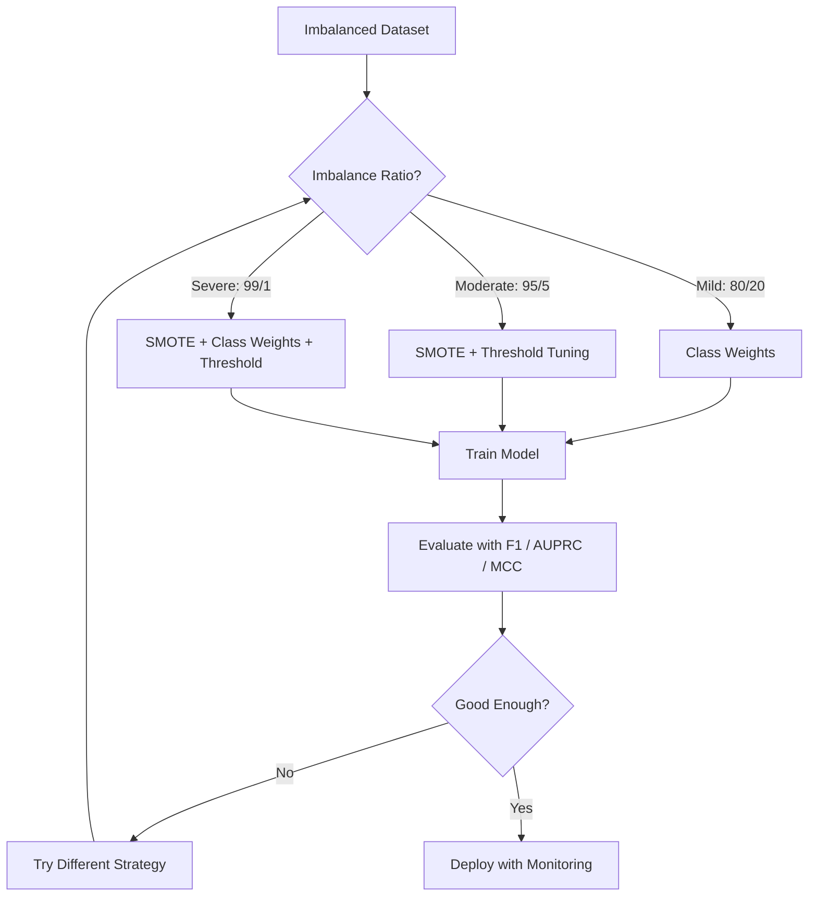
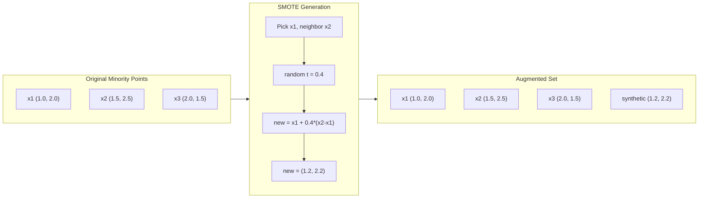
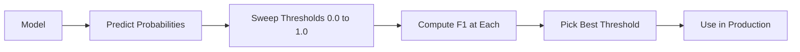
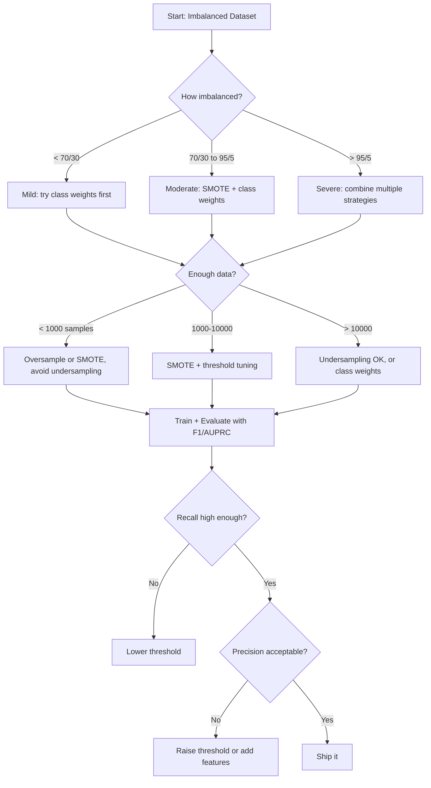

# 处理不平衡数据

> 当 99% 的数据都是"正常"时，准确率就是个谎言。

**类型：** Build
**语言：** Python
**前置知识：** Phase 2，第 01-09 课（尤其是评估指标部分）
**时长：** 约 90 分钟

## 学习目标

- 从零实现 SMOTE，并解释合成过采样与随机复制有何不同
- 使用 F1、AUPRC 和 Matthews Correlation Coefficient 替代 accuracy 来评估不平衡分类器
- 比较 class weighting、threshold tuning 和重采样策略，并为给定的不平衡比选择合适的方法
- 搭建一条完整的不平衡数据流水线，结合 SMOTE、class weights 和阈值优化

## 问题所在

你做了一个欺诈检测模型，准确率达到 99.9%。你正准备庆祝，却发现它对每一笔交易都预测"非欺诈"。

这不是 bug，而是当只有 0.1% 的交易是欺诈时最理性的选择。模型学到的是：永远猜多数类能让总体误差最小。这在技术上完全正确，却毫无用处。

凡是真正重要的分类场景，都会遇到这种情况。疾病诊断：1% 阳性率。网络入侵：0.01% 是攻击。制造缺陷：0.5% 不合格。垃圾邮件过滤：20%。流失预测：5% 流失用户。少数类越关键，往往就越稀有。

accuracy 之所以失效，是因为它把所有正确预测一视同仁。正确标记一笔合法交易和正确捕获一次欺诈各算一分。但抓欺诈才是模型存在的全部意义。我们需要新的指标、技术和训练策略，强迫模型把注意力放在那个稀有但重要的类上。

## 核心概念

### 为什么 accuracy 会失效

考虑一个有 1000 个样本的数据集：990 个负样本，10 个正样本。一个永远预测负的模型：

|  | Predicted Positive | Predicted Negative |
|--|---|---|
| Actually Positive | 0 (TP) | 10 (FN) |
| Actually Negative | 0 (FP) | 990 (TN) |

Accuracy = (0 + 990) / 1000 = 99.0%

这个模型抓到零次欺诈，零个病例，零个缺陷。但 accuracy 显示 99%。这就是为什么在不平衡问题里 accuracy 是危险的。

### 更好的指标

**Precision** = TP / (TP + FP)。被标为正的里面，有多少是真正的正？precision 高意味着误报少。

**Recall** = TP / (TP + FN)。所有真正的正样本里，我们抓到了多少？recall 高意味着漏报少。

**F1 Score** = 2 \* precision \* recall / (precision + recall)。调和平均数。比算术平均更严厉地惩罚 precision 和 recall 之间的极端失衡。

**F-beta Score** = (1 + beta^2) \* precision \* recall / (beta^2 \* precision + recall)。当 beta > 1 时 recall 更重要，当 beta < 1 时 precision 更重要。在欺诈检测里 F2 很常见（漏掉欺诈比误报更糟）。

**AUPRC**（Area Under Precision-Recall Curve）。类似 AUC-ROC，但对不平衡数据更具信息量。随机分类器的 AUPRC 等于正类比例（不像 ROC 那样为 0.5），因此模型的提升更容易看出来。

**Matthews Correlation Coefficient** = (TP \* TN - FP \* FN) / sqrt((TP+FP)(TP+FN)(TN+FP)(TN+FN))。取值范围从 -1 到 +1。只有当模型在两个类上都表现良好时才会得到高分。即便类别规模差异巨大也保持平衡。

对上面那个"永远预测负"的模型：precision = 0/0（未定义，通常设为 0），recall = 0/10 = 0，F1 = 0，MCC = 0。这些指标准确地把它识别为毫无价值。

### 不平衡数据流水线



### SMOTE：Synthetic Minority Oversampling Technique

随机过采样直接复制现有的少数类样本。这能用，但有过拟合风险，因为模型反复看到一模一样的点。

SMOTE 创建出合理但不是复制品的新合成少数类样本。算法如下：

1. 对每个少数类样本 x，在其他少数类样本中找出它的 k 个最近邻
2. 随机挑选一个邻居
3. 在 x 与该邻居所在线段上生成一个新样本

公式：`new_sample = x + random(0, 1) * (neighbor - x)`

这是在真实少数类点之间做插值，在同一片特征空间区域生成新样本，而不仅仅是复制已有数据。



### 采样策略对比

**Random Oversampling**：复制少数类样本直到与多数类数量相当。
- 优点：简单，无信息损失
- 缺点：精确复制会导致过拟合，训练时间增加

**Random Undersampling**：删除多数类样本直到与少数类数量相当。
- 优点：训练快，简单
- 缺点：丢弃了可能有用的多数类数据，方差更高

**SMOTE**：通过插值合成新的少数类样本。
- 优点：生成新的数据点，相比随机过采样减少过拟合
- 缺点：可能在决策边界附近生成噪声样本，未考虑多数类分布

| Strategy | Data Changed | Risk | When to Use |
|----------|-------------|------|-------------|
| Oversample | Minority duplicated | Overfitting | Small datasets, moderate imbalance |
| Undersample | Majority removed | Information loss | Large datasets, want fast training |
| SMOTE | Synthetic minority added | Boundary noise | Moderate imbalance, enough minority samples for k-NN |

### Class Weights

不修改数据，而是修改模型对错误的处理方式：把误分类少数类的代价调高。

对于一个二分类问题，950 个负样本和 50 个正样本：
- 负类权重 = n_samples / (2 \* n_negative) = 1000 / (2 \* 950) = 0.526
- 正类权重 = n_samples / (2 \* n_positive) = 1000 / (2 \* 50) = 10.0

正类拿到的权重是负类的 19 倍。误分类一个正样本的代价等同于误分类 19 个负样本。模型被迫关注少数类。

在 logistic regression 里，这会修改损失函数：

```
weighted_loss = -sum(w_i * [y_i * log(p_i) + (1-y_i) * log(1-p_i)])
```

其中 w_i 取决于样本 i 所属的类别。

class weights 在期望意义上等价于 oversampling，但不会创造新数据点。这让它更快，并且避免了重复样本带来的过拟合风险。

### Threshold Tuning

大多数分类器输出的是一个概率。默认阈值是 0.5：如果 P(positive) >= 0.5，就预测为正。但 0.5 是随意的。当类别不平衡时，最优阈值通常要低得多。

流程：
1. 训练一个模型
2. 在验证集上获得预测概率
3. 在 0.0 到 1.0 间扫描阈值
4. 在每个阈值下计算 F1（或你选定的指标）
5. 挑选让指标最大化的阈值



模型可能对一笔欺诈交易输出 P(fraud) = 0.15。在阈值 0.5 下它被分类为非欺诈；在阈值 0.10 下它被正确捕获。概率校准并不那么关键，关键是排序——只要欺诈拿到的概率始终高于非欺诈，就一定存在一个阈值把它们分开。

### Cost-Sensitive Learning

class weights 的推广。不再使用统一代价，而是为每种误分类指定具体代价：

| | Predict Positive | Predict Negative |
|--|---|---|
| Actually Positive | 0 (correct) | C_FN = 100 |
| Actually Negative | C_FP = 1 | 0 (correct) |

漏掉一笔欺诈交易（FN）的代价是误报（FP）的 100 倍。模型优化的是总代价，而不是错误数量。

当你能够估计真实世界的代价时，这是最有原则的方法。漏诊一例癌症与一次导致额外活检的误报，代价是天差地别的。把这些代价显式化，能强迫做出正确的取舍。

### 决策流程图



## 动手实现

### Step 1：生成一个不平衡数据集

```python
import numpy as np


def make_imbalanced_data(n_majority=950, n_minority=50, seed=42):
    rng = np.random.RandomState(seed)

    X_maj = rng.randn(n_majority, 2) * 1.0 + np.array([0.0, 0.0])
    X_min = rng.randn(n_minority, 2) * 0.8 + np.array([2.5, 2.5])

    X = np.vstack([X_maj, X_min])
    y = np.concatenate([np.zeros(n_majority), np.ones(n_minority)])

    shuffle_idx = rng.permutation(len(y))
    return X[shuffle_idx], y[shuffle_idx]
```

### Step 2：从零实现 SMOTE

```python
def euclidean_distance(a, b):
    return np.sqrt(np.sum((a - b) ** 2))


def find_k_neighbors(X, idx, k):
    distances = []
    for i in range(len(X)):
        if i == idx:
            continue
        d = euclidean_distance(X[idx], X[i])
        distances.append((i, d))
    distances.sort(key=lambda x: x[1])
    return [d[0] for d in distances[:k]]


def smote(X_minority, k=5, n_synthetic=100, seed=42):
    rng = np.random.RandomState(seed)
    n_samples = len(X_minority)
    k = min(k, n_samples - 1)
    synthetic = []

    for _ in range(n_synthetic):
        idx = rng.randint(0, n_samples)
        neighbors = find_k_neighbors(X_minority, idx, k)
        neighbor_idx = neighbors[rng.randint(0, len(neighbors))]
        t = rng.random()
        new_point = X_minority[idx] + t * (X_minority[neighbor_idx] - X_minority[idx])
        synthetic.append(new_point)

    return np.array(synthetic)
```

### Step 3：随机过采样和欠采样

```python
def random_oversample(X, y, seed=42):
    rng = np.random.RandomState(seed)
    classes, counts = np.unique(y, return_counts=True)
    max_count = counts.max()

    X_resampled = list(X)
    y_resampled = list(y)

    for cls, count in zip(classes, counts):
        if count < max_count:
            cls_indices = np.where(y == cls)[0]
            n_needed = max_count - count
            chosen = rng.choice(cls_indices, size=n_needed, replace=True)
            X_resampled.extend(X[chosen])
            y_resampled.extend(y[chosen])

    X_out = np.array(X_resampled)
    y_out = np.array(y_resampled)
    shuffle = rng.permutation(len(y_out))
    return X_out[shuffle], y_out[shuffle]


def random_undersample(X, y, seed=42):
    rng = np.random.RandomState(seed)
    classes, counts = np.unique(y, return_counts=True)
    min_count = counts.min()

    X_resampled = []
    y_resampled = []

    for cls in classes:
        cls_indices = np.where(y == cls)[0]
        chosen = rng.choice(cls_indices, size=min_count, replace=False)
        X_resampled.extend(X[chosen])
        y_resampled.extend(y[chosen])

    X_out = np.array(X_resampled)
    y_out = np.array(y_resampled)
    shuffle = rng.permutation(len(y_out))
    return X_out[shuffle], y_out[shuffle]
```

### Step 4：带 class weights 的 logistic regression

```python
def sigmoid(z):
    return 1.0 / (1.0 + np.exp(-np.clip(z, -500, 500)))


def logistic_regression_weighted(X, y, weights, lr=0.01, epochs=200):
    n_samples, n_features = X.shape
    w = np.zeros(n_features)
    b = 0.0

    for _ in range(epochs):
        z = X @ w + b
        pred = sigmoid(z)
        error = pred - y
        weighted_error = error * weights

        gradient_w = (X.T @ weighted_error) / n_samples
        gradient_b = np.mean(weighted_error)

        w -= lr * gradient_w
        b -= lr * gradient_b

    return w, b


def compute_class_weights(y):
    classes, counts = np.unique(y, return_counts=True)
    n_samples = len(y)
    n_classes = len(classes)
    weight_map = {}
    for cls, count in zip(classes, counts):
        weight_map[cls] = n_samples / (n_classes * count)
    return np.array([weight_map[yi] for yi in y])
```

### Step 5：阈值调优

```python
def find_optimal_threshold(y_true, y_probs, metric="f1"):
    best_threshold = 0.5
    best_score = -1.0

    for threshold in np.arange(0.05, 0.96, 0.01):
        y_pred = (y_probs >= threshold).astype(int)
        tp = np.sum((y_pred == 1) & (y_true == 1))
        fp = np.sum((y_pred == 1) & (y_true == 0))
        fn = np.sum((y_pred == 0) & (y_true == 1))

        if metric == "f1":
            precision = tp / (tp + fp) if (tp + fp) > 0 else 0.0
            recall = tp / (tp + fn) if (tp + fn) > 0 else 0.0
            score = 2 * precision * recall / (precision + recall) if (precision + recall) > 0 else 0.0
        elif metric == "recall":
            score = tp / (tp + fn) if (tp + fn) > 0 else 0.0
        elif metric == "precision":
            score = tp / (tp + fp) if (tp + fp) > 0 else 0.0

        if score > best_score:
            best_score = score
            best_threshold = threshold

    return best_threshold, best_score
```

### Step 6：评估函数

```python
def confusion_matrix_values(y_true, y_pred):
    tp = np.sum((y_pred == 1) & (y_true == 1))
    tn = np.sum((y_pred == 0) & (y_true == 0))
    fp = np.sum((y_pred == 1) & (y_true == 0))
    fn = np.sum((y_pred == 0) & (y_true == 1))
    return tp, tn, fp, fn


def compute_metrics(y_true, y_pred):
    tp, tn, fp, fn = confusion_matrix_values(y_true, y_pred)
    accuracy = (tp + tn) / (tp + tn + fp + fn)
    precision = tp / (tp + fp) if (tp + fp) > 0 else 0.0
    recall = tp / (tp + fn) if (tp + fn) > 0 else 0.0
    f1 = 2 * precision * recall / (precision + recall) if (precision + recall) > 0 else 0.0

    denom = np.sqrt(float((tp + fp) * (tp + fn) * (tn + fp) * (tn + fn)))
    mcc = (tp * tn - fp * fn) / denom if denom > 0 else 0.0

    return {
        "accuracy": accuracy,
        "precision": precision,
        "recall": recall,
        "f1": f1,
        "mcc": mcc,
    }
```

### Step 7：对比所有方案

```python
X, y = make_imbalanced_data(950, 50, seed=42)
split = int(0.8 * len(y))
X_train, X_test = X[:split], X[split:]
y_train, y_test = y[:split], y[split:]

# Baseline: no treatment
w_base, b_base = logistic_regression_weighted(
    X_train, y_train, np.ones(len(y_train)), lr=0.1, epochs=300
)
probs_base = sigmoid(X_test @ w_base + b_base)
preds_base = (probs_base >= 0.5).astype(int)

# Oversampled
X_over, y_over = random_oversample(X_train, y_train)
w_over, b_over = logistic_regression_weighted(
    X_over, y_over, np.ones(len(y_over)), lr=0.1, epochs=300
)
preds_over = (sigmoid(X_test @ w_over + b_over) >= 0.5).astype(int)

# SMOTE
minority_mask = y_train == 1
X_minority = X_train[minority_mask]
synthetic = smote(X_minority, k=5, n_synthetic=len(y_train) - 2 * int(minority_mask.sum()))
X_smote = np.vstack([X_train, synthetic])
y_smote = np.concatenate([y_train, np.ones(len(synthetic))])
w_sm, b_sm = logistic_regression_weighted(
    X_smote, y_smote, np.ones(len(y_smote)), lr=0.1, epochs=300
)
preds_smote = (sigmoid(X_test @ w_sm + b_sm) >= 0.5).astype(int)

# Class weights
sample_weights = compute_class_weights(y_train)
w_cw, b_cw = logistic_regression_weighted(
    X_train, y_train, sample_weights, lr=0.1, epochs=300
)
probs_cw = sigmoid(X_test @ w_cw + b_cw)
preds_cw = (probs_cw >= 0.5).astype(int)

# Threshold tuning (tune on held-out validation set, not test set)
probs_val = sigmoid(X_val @ w_cw + b_cw)
best_thresh, best_f1 = find_optimal_threshold(y_val, probs_val, metric="f1")
preds_thresh = (probs_cw >= best_thresh).astype(int)
```

代码文件会在一个脚本里运行所有这些步骤并打印结果。

## 实战使用

借助 scikit-learn 和 imbalanced-learn，这些技术都是一行代码的事：

```python
from sklearn.linear_model import LogisticRegression
from sklearn.metrics import classification_report, f1_score
from sklearn.model_selection import train_test_split
from imblearn.over_sampling import SMOTE
from imblearn.under_sampling import RandomUnderSampler
from imblearn.pipeline import Pipeline

X_train, X_test, y_train, y_test = train_test_split(X, y, stratify=y)

model_weighted = LogisticRegression(class_weight="balanced")
model_weighted.fit(X_train, y_train)
print(classification_report(y_test, model_weighted.predict(X_test)))

smote = SMOTE(random_state=42)
X_resampled, y_resampled = smote.fit_resample(X_train, y_train)
model_smote = LogisticRegression()
model_smote.fit(X_resampled, y_resampled)
print(classification_report(y_test, model_smote.predict(X_test)))

pipeline = Pipeline([
    ("smote", SMOTE()),
    ("model", LogisticRegression(class_weight="balanced")),
])
pipeline.fit(X_train, y_train)
print(classification_report(y_test, pipeline.predict(X_test)))
```

从零实现的版本清楚展示了每种技术的本质。SMOTE 不过是少数类上的 k-NN 插值。class weights 就是把损失乘上一个系数。threshold tuning 就是一个 for 循环遍历切分点。没有什么魔法。

## 交付产出

本课产出：
- `outputs/skill-imbalanced-data.md` —— 处理不平衡分类问题的决策清单

## 练习

1. **Borderline-SMOTE**：修改 SMOTE 实现，只为靠近决策边界的少数类点生成合成样本（即那些 k 近邻里包含多数类样本的点）。在类别有重叠的数据集上对比标准 SMOTE 的效果。

2. **代价矩阵优化**：实现 cost-sensitive learning，让代价矩阵成为参数。写一个函数：输入代价矩阵，输出能最小化期望代价的最优预测。用不同的代价比（1:10、1:100、1:1000）测试，并绘制 precision-recall 取舍如何随之变化。

3. **阈值校准**：实现 Platt scaling（在模型原始输出上拟合一个 logistic regression 来得到校准后的概率）。对比校准前后的 precision-recall 曲线。说明校准不会改变排序（AUC 保持不变），但能让概率更有意义。

4. **balanced bagging 集成**：训练多个模型，每个使用一个平衡的 bootstrap 采样（全部少数类 + 随机抽取的多数类子集）。对它们的预测求平均。把这种方法和单模型 + SMOTE 做对比，从性能和多次运行间方差两个维度衡量。

5. **不平衡比实验**：从一个平衡的数据集出发，逐步增加不平衡比（50/50、70/30、90/10、95/5、99/1）。在每个比例下，分别训练带 SMOTE 和不带 SMOTE 的模型。绘制两种方案下 F1 与不平衡比的关系。SMOTE 在多大的不平衡比下才开始产生明显差异？

## 关键术语

| Term | What people say | What it actually means |
|------|----------------|----------------------|
| Class imbalance | "某个类样本多得多" | 数据集中各类别分布显著倾斜，导致模型偏向多数类 |
| SMOTE | "合成过采样" | 通过在已有少数类样本与其 k 近邻（同为少数类）之间插值，生成新的少数类样本 |
| Class weights | "让稀有类的错误更贵" | 用类别相关的权重去乘损失函数，让模型对少数类的误分类付出更高代价 |
| Threshold tuning | "移动决策边界" | 把分类的概率切分点从默认的 0.5 改为能优化目标指标的值 |
| Precision-recall tradeoff | "鱼和熊掌不可兼得" | 调低阈值能抓到更多正样本（recall 升），但也会带来更多误报（precision 降），反之亦然 |
| AUPRC | "PR 曲线下的面积" | 把 precision-recall 曲线压缩成一个数值；在类别严重不平衡时比 AUC-ROC 更具信息量 |
| Matthews Correlation Coefficient | "平衡的指标" | 预测标签与真实标签之间的相关性，只有当模型在两个类上都表现良好时才会得到高分 |
| Cost-sensitive learning | "不同的错误代价不同" | 把真实世界的误分类代价纳入训练目标，让模型优化总代价而不是错误数 |
| Random oversampling | "复制少数类" | 重复少数类样本以平衡类别数量；简单但容易在被复制的点上过拟合 |

## 拓展阅读

- [SMOTE: Synthetic Minority Over-sampling Technique (Chawla et al., 2002)](https://arxiv.org/abs/1106.1813) —— 最初的 SMOTE 论文，至今仍是不平衡学习领域被引最多的工作
- [Learning from Imbalanced Data (He & Garcia, 2009)](https://ieeexplore.ieee.org/document/5128907) —— 全面综述，覆盖采样、cost-sensitive 和算法层面的方法
- [imbalanced-learn documentation](https://imbalanced-learn.org/stable/) —— Python 库，包含 SMOTE 的多种变体、欠采样策略和 pipeline 集成
- [The Precision-Recall Plot Is More Informative than the ROC Plot (Saito & Rehmsmeier, 2015)](https://journals.plos.org/plosone/article?id=10.1371/journal.pone.0118432) —— 在不平衡问题里何时以及为何应优先选 PR 曲线而非 ROC 曲线
