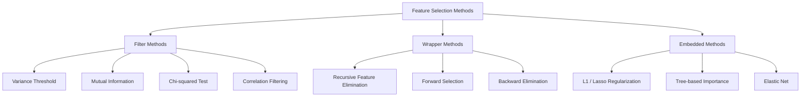
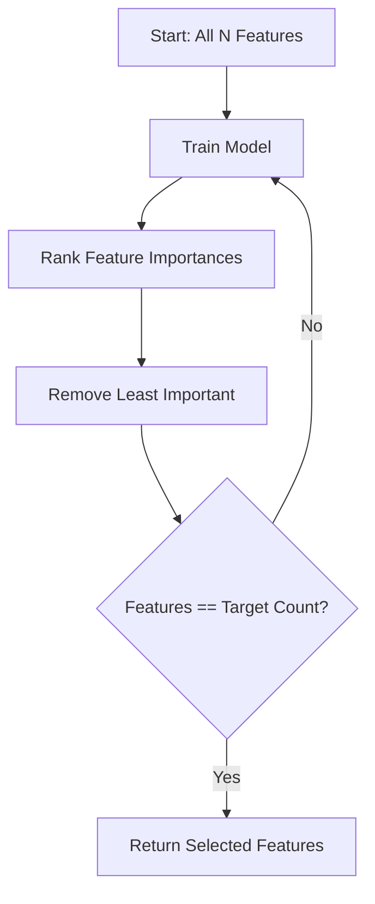
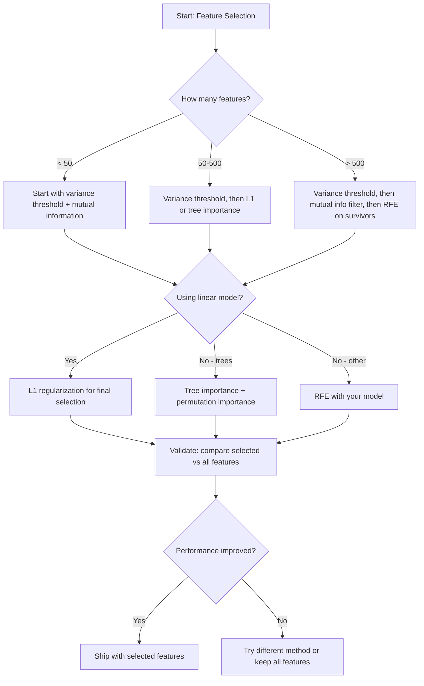

# Feature Selection

> 特征不是越多越好，选对的特征才好。

**Type:** Build
**Language:** Python
**Prerequisites:** Phase 2, Lessons 01-09, 08 (feature engineering)
**Time:** ~75 minutes

## Learning Objectives

- 从零实现 filter 方法（variance threshold、mutual information、chi-squared）和 wrapper 方法（RFE、forward selection）
- 解释为什么 mutual information 能捕捉到 correlation 漏掉的非线性特征-目标关系
- 比较 L1 regularization（embedded selection）与 RFE（wrapper selection），并评估各自的计算代价权衡
- 构建组合多种方法的特征选择 pipeline，并在 held-out 数据上验证泛化能力的提升

## The Problem

你手上有 500 个特征。模型训练慢、不停过拟合，没人能解释它到底学到了什么。你以为再加点特征就能改善表现，结果反而更糟。

这就是 curse of dimensionality 在作祟。特征数量增加时，特征空间的体积呈指数膨胀，数据点变得稀疏，点与点之间的距离趋于一致。模型需要指数级更多的数据才能找到真正的模式。噪声特征淹没了信号特征，过拟合成了默认结果。

特征选择就是解药。剥离噪声、消除冗余，只留下真正携带目标信息的特征。换来的是：训练更快、泛化更好、模型更可解释。

目标不是用上所有可得的信息，而是用对的信息。

## The Concept

### Three Categories of Feature Selection

每一种特征选择方法都属于这三类之一：



**Filter methods** 用某种统计度量独立给每个特征打分，不依赖任何模型。速度快，但抓不到特征之间的交互。

**Wrapper methods** 通过训练模型来评估特征子集，把模型表现当作打分标准。效果更好，但代价高，因为要反复训练模型。

**Embedded methods** 把特征选择嵌入到模型训练里。L1 regularization 把权重压到零；决策树在最有用的特征上分裂。选择是在拟合过程中完成的，而不是单独的一步。

### Variance Threshold

最朴素的 filter。如果一个特征在样本之间几乎没有变化，它就几乎不带信息。

设想一个特征在 1000 个样本里有 999 个都是 0.0，它的方差接近零，没有任何模型能靠它区分类别，直接删掉。

```
variance(x) = mean((x - mean(x))^2)
```

设一个阈值（比如 0.01），把方差低于它的特征都丢掉。这一步根本不看目标变量，就能干掉常量或近似常量的特征。

什么时候用：作为其他方法之前的预处理步骤。它能以接近零的代价过滤掉显然没用的特征。

局限：一个特征方差很高，也可能纯粹是噪声。Variance threshold 是必要条件，但远远不够。

### Mutual Information

Mutual information 衡量的是：知道特征 X 的取值能在多大程度上降低对目标 Y 的不确定性。

```
I(X; Y) = sum_x sum_y p(x, y) * log(p(x, y) / (p(x) * p(y)))
```

如果 X 和 Y 独立，p(x, y) = p(x) * p(y)，对数项为零，I(X; Y) = 0。X 关于 Y 的信息越多，mutual information 就越大。

相比 correlation 的关键优势：mutual information 能捕捉非线性关系。一个特征也许和目标的 correlation 为零，但 mutual information 很高，因为它们之间的关系是二次的或周期的。

对于连续特征，要先离散化分箱（基于直方图的估计）。箱数会影响估计——箱太少丢信息，箱太多加噪声。常见选择是 sqrt(n) 个箱，或者 Sturges' rule（1 + log2(n)）。


### Recursive Feature Elimination (RFE)

RFE 是一种 wrapper 方法。它利用模型自身的特征重要性来迭代地剪枝：

1. 用全部特征训练模型
2. 按重要性给特征排序（线性模型看系数，树看不纯度下降）
3. 删掉最不重要的那个（或几个）
4. 重复，直到剩下目标数量的特征



RFE 会考虑特征之间的交互，因为模型每次都同时看到所有剩余特征。删掉一个特征会改变其他特征的重要性，这让它比 filter 方法更彻底。

代价：你要训练 N - target 次模型。500 个特征想缩到 10 个就是 490 次。对昂贵的模型来说太慢。可以一次删多个特征来加速（比如每轮删掉重要性最低的 10%）。

### L1 (Lasso) Regularization

L1 regularization 把权重的绝对值之和加到损失函数里：

```
loss = prediction_error + alpha * sum(|w_i|)
```

alpha 控制剪枝的力度。alpha 越大，越多权重会被精确压到零。

为什么是精确为零？L1 惩罚在权重空间中划出一个菱形约束区域，最优解倾向于落在菱形的某个顶点上，那里有一个或多个权重就是零。L2 regularization（ridge）的约束是圆形，权重会缩小但很少正好为零。

这就是 embedded 特征选择：模型在训练中自己学会忽略哪些特征。权重为零的特征实质上就被删除了。

优点：只需训练一次；能处理相关特征（挑一个，把其余的压零）；多数线性模型实现里都内置。

局限：只对线性模型有效，捕捉不到非线性的特征重要性。

### Tree-Based Feature Importance

决策树及其集成（random forests、gradient boosting）天然就能给特征排序。每次分裂都会降低不纯度（分类用 Gini 或 entropy，回归用 variance）。能带来更大不纯度下降的特征就更重要。

对于一个有 T 棵树的 random forest：

```
importance(feature_j) = (1/T) * sum over all trees of
    sum over all nodes splitting on feature_j of
        (n_samples * impurity_decrease)
```

这给每个特征一个归一化的重要性分数。它能自动处理非线性关系和特征交互。

注意：tree-based importance 偏向取值多的特征（高基数）。一列随机 ID 看起来会很重要，因为它能完美切分每个样本。要用 permutation importance 做交叉验证。

### Permutation Importance

一种与模型无关的方法：

1. 训练模型，在 validation 数据上记录基线表现
2. 对每个特征：随机打乱它的值，测量表现下降多少
3. 下降越多，特征越重要

如果打乱某个特征不影响表现，模型就不依赖它；如果表现崩了，那它就是关键。

Permutation importance 避开了 tree-based importance 的高基数偏差。但它慢：每个特征要做一次完整评估，为了稳定还要重复多次。

### Comparison Table

| Method | Type | Speed | Nonlinear | Feature Interactions |
|--------|------|-------|-----------|---------------------|
| Variance threshold | Filter | Very fast | No | No |
| Mutual information | Filter | Fast | Yes | No |
| Correlation filter | Filter | Fast | No | No |
| RFE | Wrapper | Slow | Depends on model | Yes |
| L1 / Lasso | Embedded | Fast | No (linear) | No |
| Tree importance | Embedded | Medium | Yes | Yes |
| Permutation importance | Model-agnostic | Slow | Yes | Yes |

### Decision Flowchart



## Build It

### Step 1: Generate synthetic data with known feature structure

```python
import numpy as np


def make_feature_selection_data(n_samples=500, seed=42):
    rng = np.random.RandomState(seed)

    x1 = rng.randn(n_samples)
    x2 = rng.randn(n_samples)
    x3 = rng.randn(n_samples)
    x4 = x1 + 0.1 * rng.randn(n_samples)
    x5 = x2 + 0.1 * rng.randn(n_samples)

    informative = np.column_stack([x1, x2, x3, x4, x5])

    correlated = np.column_stack([
        x1 * 0.9 + 0.1 * rng.randn(n_samples),
        x2 * 0.8 + 0.2 * rng.randn(n_samples),
        x3 * 0.7 + 0.3 * rng.randn(n_samples),
        x1 * 0.5 + x2 * 0.5 + 0.1 * rng.randn(n_samples),
        x2 * 0.6 + x3 * 0.4 + 0.1 * rng.randn(n_samples),
    ])

    noise = rng.randn(n_samples, 10) * 0.5

    X = np.hstack([informative, correlated, noise])
    y = (2 * x1 - 1.5 * x2 + x3 + 0.5 * rng.randn(n_samples) > 0).astype(int)

    feature_names = (
        [f"info_{i}" for i in range(5)]
        + [f"corr_{i}" for i in range(5)]
        + [f"noise_{i}" for i in range(10)]
    )

    return X, y, feature_names
```

我们清楚 ground truth：特征 0-4 是 informative 的（其中 3 和 4 是 0 和 1 的相关副本），特征 5-9 与 informative 特征相关，特征 10-19 是纯噪声。一个好的选择方法应该把 0-4 排在最前面，把 10-19 排在最后面。

### Step 2: Variance threshold

```python
def variance_threshold(X, threshold=0.01):
    variances = np.var(X, axis=0)
    mask = variances > threshold
    return mask, variances
```

### Step 3: Mutual information (discrete)

```python
def discretize(x, n_bins=10):
    min_val, max_val = x.min(), x.max()
    if max_val == min_val:
        return np.zeros_like(x, dtype=int)
    bin_edges = np.linspace(min_val, max_val, n_bins + 1)
    binned = np.digitize(x, bin_edges[1:-1])
    return binned


def mutual_information(X, y, n_bins=10):
    n_samples, n_features = X.shape
    mi_scores = np.zeros(n_features)

    y_vals, y_counts = np.unique(y, return_counts=True)
    p_y = y_counts / n_samples

    for f in range(n_features):
        x_binned = discretize(X[:, f], n_bins)
        x_vals, x_counts = np.unique(x_binned, return_counts=True)
        p_x = dict(zip(x_vals, x_counts / n_samples))

        mi = 0.0
        for xv in x_vals:
            for yi, yv in enumerate(y_vals):
                joint_mask = (x_binned == xv) & (y == yv)
                p_xy = np.sum(joint_mask) / n_samples
                if p_xy > 0:
                    mi += p_xy * np.log(p_xy / (p_x[xv] * p_y[yi]))
        mi_scores[f] = mi

    return mi_scores
```

### Step 4: Recursive Feature Elimination

```python
def simple_logistic_importance(X, y, lr=0.1, epochs=100):
    n_samples, n_features = X.shape
    w = np.zeros(n_features)
    b = 0.0

    for _ in range(epochs):
        z = X @ w + b
        pred = 1.0 / (1.0 + np.exp(-np.clip(z, -500, 500)))
        error = pred - y
        w -= lr * (X.T @ error) / n_samples
        b -= lr * np.mean(error)

    return w, b


def rfe(X, y, n_features_to_select=5, lr=0.1, epochs=100):
    n_total = X.shape[1]
    remaining = list(range(n_total))
    rankings = np.ones(n_total, dtype=int)
    rank = n_total

    while len(remaining) > n_features_to_select:
        X_subset = X[:, remaining]
        w, _ = simple_logistic_importance(X_subset, y, lr, epochs)
        importances = np.abs(w)

        least_idx = np.argmin(importances)
        original_idx = remaining[least_idx]
        rankings[original_idx] = rank
        rank -= 1
        remaining.pop(least_idx)

    for idx in remaining:
        rankings[idx] = 1

    selected_mask = rankings == 1
    return selected_mask, rankings
```

### Step 5: L1 feature selection

```python
def soft_threshold(w, alpha):
    return np.sign(w) * np.maximum(np.abs(w) - alpha, 0)


def l1_feature_selection(X, y, alpha=0.1, lr=0.01, epochs=500):
    n_samples, n_features = X.shape
    w = np.zeros(n_features)
    b = 0.0

    for _ in range(epochs):
        z = X @ w + b
        pred = 1.0 / (1.0 + np.exp(-np.clip(z, -500, 500)))
        error = pred - y

        gradient_w = (X.T @ error) / n_samples
        gradient_b = np.mean(error)

        w -= lr * gradient_w
        w = soft_threshold(w, lr * alpha)
        b -= lr * gradient_b

    selected_mask = np.abs(w) > 1e-6
    return selected_mask, w
```

### Step 6: Tree-based importance (simple decision tree)

```python
def gini_impurity(y):
    if len(y) == 0:
        return 0.0
    classes, counts = np.unique(y, return_counts=True)
    probs = counts / len(y)
    return 1.0 - np.sum(probs ** 2)


def best_split(X, y, feature_idx):
    values = np.unique(X[:, feature_idx])
    if len(values) <= 1:
        return None, -1.0

    best_threshold = None
    best_gain = -1.0
    parent_gini = gini_impurity(y)
    n = len(y)

    for i in range(len(values) - 1):
        threshold = (values[i] + values[i + 1]) / 2.0
        left_mask = X[:, feature_idx] <= threshold
        right_mask = ~left_mask

        n_left = np.sum(left_mask)
        n_right = np.sum(right_mask)

        if n_left == 0 or n_right == 0:
            continue

        gain = parent_gini - (n_left / n) * gini_impurity(y[left_mask]) - (n_right / n) * gini_impurity(y[right_mask])

        if gain > best_gain:
            best_gain = gain
            best_threshold = threshold

    return best_threshold, best_gain


def tree_importance(X, y, n_trees=50, max_depth=5, seed=42):
    rng = np.random.RandomState(seed)
    n_samples, n_features = X.shape
    importances = np.zeros(n_features)

    for _ in range(n_trees):
        sample_idx = rng.choice(n_samples, size=n_samples, replace=True)
        feature_subset = rng.choice(n_features, size=max(1, int(np.sqrt(n_features))), replace=False)

        X_boot = X[sample_idx]
        y_boot = y[sample_idx]

        tree_imp = _build_tree_importance(X_boot, y_boot, feature_subset, max_depth)
        importances += tree_imp

    total = importances.sum()
    if total > 0:
        importances /= total

    return importances


def _build_tree_importance(X, y, feature_subset, max_depth, depth=0):
    n_features = X.shape[1]
    importances = np.zeros(n_features)

    if depth >= max_depth or len(np.unique(y)) <= 1 or len(y) < 4:
        return importances

    best_feature = None
    best_threshold = None
    best_gain = -1.0

    for f in feature_subset:
        threshold, gain = best_split(X, y, f)
        if gain > best_gain:
            best_gain = gain
            best_feature = f
            best_threshold = threshold

    if best_feature is None or best_gain <= 0:
        return importances

    importances[best_feature] += best_gain * len(y)

    left_mask = X[:, best_feature] <= best_threshold
    right_mask = ~left_mask

    importances += _build_tree_importance(X[left_mask], y[left_mask], feature_subset, max_depth, depth + 1)
    importances += _build_tree_importance(X[right_mask], y[right_mask], feature_subset, max_depth, depth + 1)

    return importances
```

### Step 7: Run all methods and compare

代码文件会在同一份合成数据集上运行全部五种方法，并打印一张对比表，展示每种方法各自挑出了哪些特征。

## Use It

在 scikit-learn 里，特征选择已经被融入到 pipeline 中：

```python
from sklearn.feature_selection import (
    VarianceThreshold,
    mutual_info_classif,
    RFE,
    SelectFromModel,
)
from sklearn.linear_model import Lasso, LogisticRegression
from sklearn.ensemble import RandomForestClassifier

vt = VarianceThreshold(threshold=0.01)
X_filtered = vt.fit_transform(X)

mi_scores = mutual_info_classif(X, y)
top_k = np.argsort(mi_scores)[-10:]

rfe_selector = RFE(LogisticRegression(), n_features_to_select=10)
rfe_selector.fit(X, y)
X_rfe = rfe_selector.transform(X)

lasso_selector = SelectFromModel(Lasso(alpha=0.01))
lasso_selector.fit(X, y)
X_lasso = lasso_selector.transform(X)

rf = RandomForestClassifier(n_estimators=100)
rf.fit(X, y)
importances = rf.feature_importances_
```

从零实现的版本把每种方法的内部机制摊开来看。Variance threshold 不过是算 `var(X, axis=0)` 然后套一层 mask；mutual information 就是在列联表里数联合频率和边缘频率；RFE 是个训练-排序-剪枝的循环；L1 是带 soft-thresholding 步骤的梯度下降；tree importance 是把各次分裂的不纯度下降累加起来。没什么魔法，就是统计加循环。

sklearn 的版本多了健壮性（比如 mutual_info_classif 用 k-NN 密度估计代替分箱）、速度（C 实现）和 pipeline 的集成。

## Ship It

This lesson produces:
- `outputs/skill-feature-selector.md` -- 一份用于挑选合适特征选择方法的快速决策树参考

## Exercises

1. **Forward selection**：实现 RFE 的反向版本。从零特征开始，每一步加入能让模型表现提升最多的那个特征，直到再加也无济于事时停下。把选出的特征和 RFE 的结果对照。哪个更快？哪个效果更好？

2. **Stability selection**：跑 50 次 L1 feature selection，每次在 80% 的随机子样本上、用略微不同的 alpha 值。统计每个特征被选中的次数。被选中超过 80% 的视为"稳定"特征。把稳定特征和单次 L1 选择的结果对比，哪个更可靠？

3. **Multicollinearity detection**：计算所有特征的 correlation 矩阵。实现一个函数，给定相关性阈值（比如 0.9），从每对高相关特征里删掉一个（保留与目标 mutual information 更高的那个）。在合成数据集上测试，验证它能去掉冗余的相关特征。

4. **Feature selection pipeline**：把 variance threshold、mutual information filter 和 RFE 串成一条 pipeline。先去掉近零方差特征，再按 mutual information 保留前 50%，最后在剩下的特征上跑 RFE。把这条 pipeline 与直接对全部特征跑 RFE 做对比。pipeline 是不是更快？精度是否相当？

5. **Permutation importance from scratch**：实现 permutation importance。对每个特征，把它的值打乱 10 次，测量 F1 分数的平均下降量。把这个排名和 tree-based importance 对比，找出二者不一致的情况并解释原因（提示：相关特征）。

## Key Terms

| Term | What people say | What it actually means |
|------|----------------|----------------------|
| Filter method | "Score features independently" | 一种在不训练模型的前提下、用统计度量给每个特征独立打分的特征选择方法 |
| Wrapper method | "Use the model to pick features" | 一种通过训练模型并以模型表现为评分标准、来评估特征子集的特征选择方法 |
| Embedded method | "The model selects features during training" | 在模型拟合过程中顺带完成的特征选择，例如 L1 regularization 把权重压到零 |
| Mutual information | "How much one variable tells you about another" | 在已知 X 的情况下 Y 的不确定性下降量，能同时刻画线性和非线性依赖 |
| Recursive Feature Elimination | "Train, rank, prune, repeat" | 一种迭代式 wrapper 方法：训练模型，删掉最不重要的若干特征，重复直到达到目标数量 |
| L1 / Lasso regularization | "Penalty that kills features" | 在损失函数里加上权重绝对值之和，把不重要特征的权重精确压到零 |
| Variance threshold | "Remove constant features" | 删除样本间方差低于设定阈值的特征，过滤掉那些几乎不带信息的特征 |
| Feature importance | "Which features matter most" | 衡量每个特征对模型预测贡献度的分数，可由分裂增益（树）或系数大小（线性）算出 |
| Permutation importance | "Shuffle and measure the damage" | 通过随机打乱每个特征的取值、测量模型表现下降幅度来评估其重要性 |
| Curse of dimensionality | "Too many features, not enough data" | 增加特征会让特征空间体积指数膨胀，导致数据稀疏、距离失去意义的现象 |

## Further Reading

- [An Introduction to Variable and Feature Selection (Guyon & Elisseeff, 2003)](https://jmlr.org/papers/v3/guyon03a.html) -- 特征选择方法的奠基性综述，至今仍被广泛引用
- [scikit-learn Feature Selection Guide](https://scikit-learn.org/stable/modules/feature_selection.html) -- 涵盖 filter、wrapper 和 embedded 方法的实用参考，附带代码示例
- [Stability Selection (Meinshausen & Buhlmann, 2010)](https://arxiv.org/abs/0809.2932) -- 把子采样和特征选择结合起来，得到更稳健、可复现的结果
- [Beware Default Random Forest Importances (Strobl et al., 2007)](https://bmcbioinformatics.biomedcentral.com/articles/10.1186/1471-2105-8-25) -- 揭示 tree-based importance 的高基数偏差，并提出 conditional importance 作为替代方案
