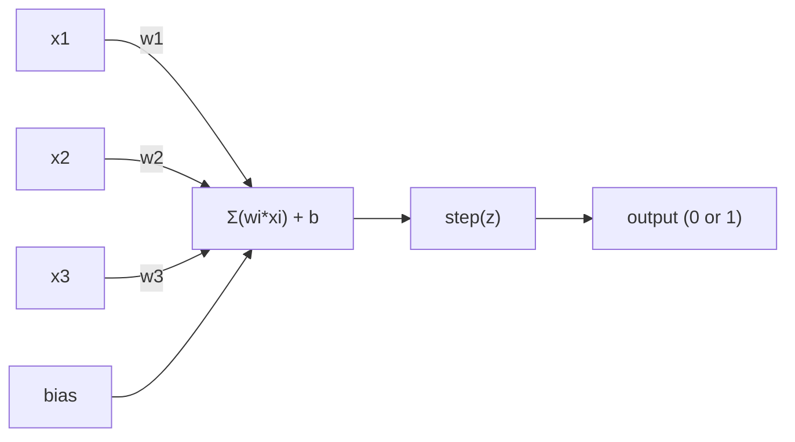
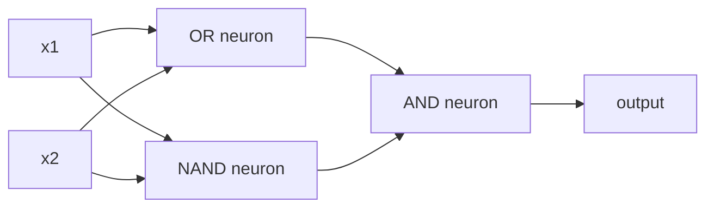

# 感知机

> 感知机是神经网络的原子。拆开它，里面是 weight、bias 和一个决策。

**Type:** Build
**Languages:** Python
**Prerequisites:** Phase 1 (Linear Algebra Intuition)
**Time:** ~60 minutes

## 学习目标

- 用 Python 从零实现一个 perceptron，包括权重更新规则和 step 激活函数
- 解释为什么单个 perceptron 只能解决线性可分问题，并演示 XOR 失败的情况
- 通过组合 OR、NAND 和 AND 门构建多层感知机来解决 XOR
- 训练一个带 sigmoid 激活和反向传播的两层网络，让它自动学会 XOR

## 问题

你已经知道向量和点积。你知道矩阵可以把输入变换成输出。但机器是怎么*学会*该用哪种变换的？

感知机回答了这个问题。它是最简单的学习机器：接收一些输入，乘以 weight，加上 bias，做一个二元决策。然后调整。就这样。所有神经网络都是这个想法一层层堆叠起来的。

理解感知机就是理解"学习"在代码里到底意味着什么：不断调整数字，直到输出与现实匹配。

## 概念

### 一个 Neuron，一个决策

一个 perceptron 接收 n 个输入，每个乘以一个 weight，求和，加上 bias，然后通过一个激活函数。



Step 函数很粗暴：如果加权和加 bias >= 0，输出 1。否则输出 0。

```
step(z) = 1  if z >= 0
           0  if z < 0
```

这是一个线性分类器。Weight 和 bias 定义了一条线（或高维空间中的超平面），把输入空间分成两个区域。

### 决策边界

对于两个输入，perceptron 在 2D 空间中画一条线：

```
  x2
  ┤
  │  Class 1        /
  │    (0)          /
  │                /
  │               / w1·x1 + w2·x2 + b = 0
  │              /
  │             /     Class 2
  │            /        (1)
  ┼───────────/──────────── x1
```

线的一侧输出 0，另一侧输出 1。训练就是移动这条线，直到它正确地分开两个类别。

### 学习规则

Perceptron 的学习规则很简单：

```
For each training example (x, y_true):
    y_pred = predict(x)
    error = y_true - y_pred

    For each weight:
        w_i = w_i + learning_rate * error * x_i
    bias = bias + learning_rate * error
```

如果预测正确，error = 0，什么都不变。如果预测 0 但应该是 1，weight 增大。如果预测 1 但应该是 0，weight 减小。Learning rate 控制每次调整的幅度。

### XOR 问题

问题出在这里。看看这些逻辑门：

```
AND gate:           OR gate:            XOR gate:
x1  x2  out         x1  x2  out         x1  x2  out
0   0   0           0   0   0           0   0   0
0   1   0           0   1   1           0   1   1
1   0   0           1   0   1           1   0   1
1   1   1           1   1   1           1   1   0
```

AND 和 OR 是线性可分的：你可以画一条线把 0 和 1 分开。XOR 不行。没有任何一条线能把 [0,1] 和 [1,0] 与 [0,0] 和 [1,1] 分开。

```
AND (separable):        XOR (not separable):

  x2                      x2
  1 ┤  0     1            1 ┤  1     0
    │     /                 │
  0 ┤  0 / 0              0 ┤  0     1
    ┼──/──────── x1         ┼──────────── x1
       line works!          no single line works!
```

这是一个根本性的限制。单个 perceptron 只能解决线性可分问题。Minsky 和 Papert 在 1969 年证明了这一点，几乎扼杀了神经网络研究整整十年。

解决办法：把 perceptron 堆叠成多层。多层感知机可以通过组合两个线性决策来解决 XOR 这样的非线性问题。

## 动手实现

### Step 1: Perceptron 类

```python
class Perceptron:
    def __init__(self, n_inputs, learning_rate=0.1):
        self.weights = [0.0] * n_inputs
        self.bias = 0.0
        self.lr = learning_rate

    def predict(self, inputs):
        total = sum(w * x for w, x in zip(self.weights, inputs))
        total += self.bias
        return 1 if total >= 0 else 0

    def train(self, training_data, epochs=100):
        for epoch in range(epochs):
            errors = 0
            for inputs, target in training_data:
                prediction = self.predict(inputs)
                error = target - prediction
                if error != 0:
                    errors += 1
                    for i in range(len(self.weights)):
                        self.weights[i] += self.lr * error * inputs[i]
                    self.bias += self.lr * error
            if errors == 0:
                print(f"Converged at epoch {epoch + 1}")
                return
        print(f"Did not converge after {epochs} epochs")
```

### Step 2: 在逻辑门上训练

```python
and_data = [
    ([0, 0], 0),
    ([0, 1], 0),
    ([1, 0], 0),
    ([1, 1], 1),
]

or_data = [
    ([0, 0], 0),
    ([0, 1], 1),
    ([1, 0], 1),
    ([1, 1], 1),
]

not_data = [
    ([0], 1),
    ([1], 0),
]

print("=== AND Gate ===")
p_and = Perceptron(2)
p_and.train(and_data)
for inputs, _ in and_data:
    print(f"  {inputs} -> {p_and.predict(inputs)}")

print("\n=== OR Gate ===")
p_or = Perceptron(2)
p_or.train(or_data)
for inputs, _ in or_data:
    print(f"  {inputs} -> {p_or.predict(inputs)}")

print("\n=== NOT Gate ===")
p_not = Perceptron(1)
p_not.train(not_data)
for inputs, _ in not_data:
    print(f"  {inputs} -> {p_not.predict(inputs)}")
```

### Step 3: 看 XOR 失败

```python
xor_data = [
    ([0, 0], 0),
    ([0, 1], 1),
    ([1, 0], 1),
    ([1, 1], 0),
]

print("\n=== XOR Gate (single perceptron) ===")
p_xor = Perceptron(2)
p_xor.train(xor_data, epochs=1000)
for inputs, expected in xor_data:
    result = p_xor.predict(inputs)
    status = "OK" if result == expected else "WRONG"
    print(f"  {inputs} -> {result} (expected {expected}) {status}")
```

它永远不会收敛。这是单个 perceptron 无法学会 XOR 的铁证。

### Step 4: 用两层解决 XOR

技巧：XOR = (x1 OR x2) AND NOT (x1 AND x2)。组合三个 perceptron：



```python
def xor_network(x1, x2):
    or_neuron = Perceptron(2)
    or_neuron.weights = [1.0, 1.0]
    or_neuron.bias = -0.5

    nand_neuron = Perceptron(2)
    nand_neuron.weights = [-1.0, -1.0]
    nand_neuron.bias = 1.5

    and_neuron = Perceptron(2)
    and_neuron.weights = [1.0, 1.0]
    and_neuron.bias = -1.5

    hidden1 = or_neuron.predict([x1, x2])
    hidden2 = nand_neuron.predict([x1, x2])
    output = and_neuron.predict([hidden1, hidden2])
    return output


print("\n=== XOR Gate (multi-layer network) ===")
for inputs, expected in xor_data:
    result = xor_network(inputs[0], inputs[1])
    print(f"  {inputs} -> {result} (expected {expected})")
```

四种情况全部正确。把 perceptron 堆叠成层，就能创造出单个 perceptron 无法产生的决策边界。

### Step 5: 训练一个两层网络

Step 4 是手动设定 weight 的。这对 XOR 有效，但对于你事先不知道正确 weight 的真实问题就不行了。解决办法：用 sigmoid 替换 step 函数，通过反向传播自动学习 weight。

```python
class TwoLayerNetwork:
    def __init__(self, learning_rate=0.5):
        import random
        random.seed(0)
        self.w_hidden = [[random.uniform(-1, 1), random.uniform(-1, 1)] for _ in range(2)]
        self.b_hidden = [random.uniform(-1, 1), random.uniform(-1, 1)]
        self.w_output = [random.uniform(-1, 1), random.uniform(-1, 1)]
        self.b_output = random.uniform(-1, 1)
        self.lr = learning_rate

    def sigmoid(self, x):
        import math
        x = max(-500, min(500, x))
        return 1.0 / (1.0 + math.exp(-x))

    def forward(self, inputs):
        self.inputs = inputs
        self.hidden_outputs = []
        for i in range(2):
            z = sum(w * x for w, x in zip(self.w_hidden[i], inputs)) + self.b_hidden[i]
            self.hidden_outputs.append(self.sigmoid(z))
        z_out = sum(w * h for w, h in zip(self.w_output, self.hidden_outputs)) + self.b_output
        self.output = self.sigmoid(z_out)
        return self.output

    def train(self, training_data, epochs=10000):
        for epoch in range(epochs):
            total_error = 0
            for inputs, target in training_data:
                output = self.forward(inputs)
                error = target - output
                total_error += error ** 2

                d_output = error * output * (1 - output)

                saved_w_output = self.w_output[:]
                hidden_deltas = []
                for i in range(2):
                    h = self.hidden_outputs[i]
                    hd = d_output * saved_w_output[i] * h * (1 - h)
                    hidden_deltas.append(hd)

                for i in range(2):
                    self.w_output[i] += self.lr * d_output * self.hidden_outputs[i]
                self.b_output += self.lr * d_output

                for i in range(2):
                    for j in range(len(inputs)):
                        self.w_hidden[i][j] += self.lr * hidden_deltas[i] * inputs[j]
                    self.b_hidden[i] += self.lr * hidden_deltas[i]
```

```python
net = TwoLayerNetwork(learning_rate=2.0)
net.train(xor_data, epochs=10000)
for inputs, expected in xor_data:
    result = net.forward(inputs)
    predicted = 1 if result >= 0.5 else 0
    print(f"  {inputs} -> {result:.4f} (rounded: {predicted}, expected {expected})")
```

与 Step 4 有两个关键区别。第一，sigmoid 替换了 step 函数——它是平滑的，所以梯度存在。第二，`train` 方法把误差从输出层反向传播到隐藏层，按每个 weight 对误差的贡献比例来调整它。这就是 20 行代码的反向传播。

这是通往 Lesson 03 的桥梁。`d_output` 和 `hidden_deltas` 背后的数学就是链式法则应用于网络图。我们会在那里正式推导。

## 实际使用

你刚才从零构建的一切，一个 import 就搞定了：

```python
from sklearn.linear_model import Perceptron as SkPerceptron
import numpy as np

X = np.array([[0,0],[0,1],[1,0],[1,1]])
y = np.array([0, 0, 0, 1])

clf = SkPerceptron(max_iter=100, tol=1e-3)
clf.fit(X, y)
print([clf.predict([x])[0] for x in X])
```

五行代码。你的 30 行 `Perceptron` 类做的是同样的事。sklearn 版本增加了收敛检查、多种损失函数和稀疏输入支持——但核心循环是一样的：加权求和、step 函数、出错时更新 weight。

真正的差距在规模上体现。生产网络中有什么变化：

- Step 函数变成 sigmoid、ReLU 或其他平滑激活函数
- Weight 通过反向传播自动学习（Lesson 03）
- 层变得更深：3 层、10 层、100+ 层
- 同样的原理成立：每一层从上一层的输出中创建新特征

单个 perceptron 只能画直线。把它们堆起来，你可以画任何形状。

## 交付产出

本课产出：
- `outputs/skill-perceptron.md` - 一个关于何时需要单层 vs 多层架构的技能文档

## 练习

1. 在 NAND 门（通用门——任何逻辑电路都可以用 NAND 构建）上训练一个 perceptron。验证它的 weight 和 bias 构成了有效的决策边界。
2. 修改 Perceptron 类，在每个 epoch 跟踪决策边界（w1*x1 + w2*x2 + b = 0）。打印在 AND 门训练过程中这条线是如何移动的。
3. 构建一个 3 输入的 perceptron，只有当 3 个输入中至少 2 个为 1 时才输出 1（多数投票函数）。这是线性可分的吗？为什么？

## 关键术语

| 术语 | 通俗说法 | 实际含义 |
|------|---------|---------|
| Perceptron | "一个假神经元" | 一个线性分类器：输入和 weight 的点积，加 bias，通过 step 函数 |
| Weight | "输入有多重要" | 一个乘数，缩放每个输入对决策的贡献 |
| Bias | "阈值" | 一个常数，移动决策边界，让 perceptron 在所有输入为零时也能激活 |
| 激活函数 | "压缩值的东西" | 加权和之后应用的函数——perceptron 用 step 函数，现代网络用 sigmoid/ReLU |
| 线性可分 | "能画一条线分开" | 一个数据集中，单个超平面可以完美分开各类别 |
| XOR 问题 | "perceptron 做不到的事" | 证明单层网络无法学习非线性可分函数 |
| 决策边界 | "分类器切换的地方" | 超平面 w*x + b = 0，把输入空间分成两个类别 |
| 多层感知机 | "真正的神经网络" | Perceptron 堆叠成层，每层的输出作为下一层的输入 |

## 延伸阅读

- Frank Rosenblatt, "The Perceptron: A Probabilistic Model for Information Storage and Organization in the Brain" (1958) -- 开启一切的原始论文
- Minsky & Papert, "Perceptrons" (1969) -- 证明 XOR 对单层网络不可解的书，让 perceptron 研究停滞了十年
- Michael Nielsen, "Neural Networks and Deep Learning", Chapter 1 (http://neuralnetworksanddeeplearning.com/) -- 免费在线，关于 perceptron 如何组合成网络的最佳可视化解释
