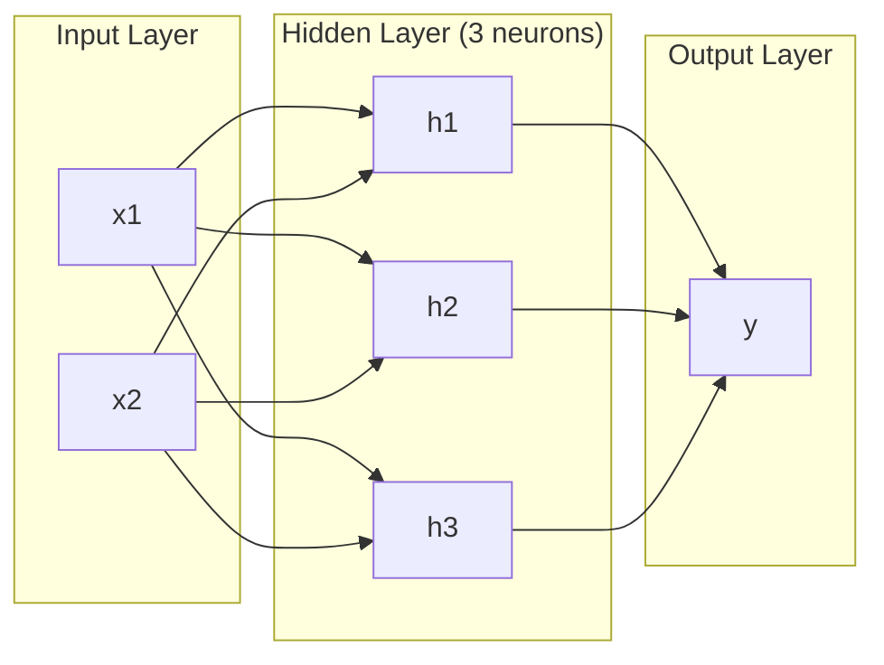
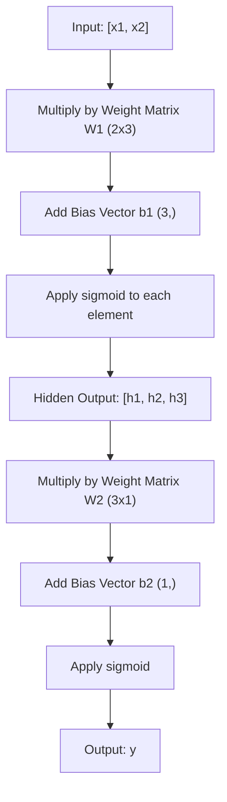
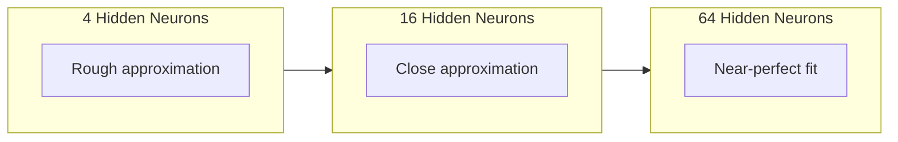

# 多层网络与前向传播

> 一个 neuron 画一条线。把它们堆起来，你可以画任何东西。

**Type:** Build
**Languages:** Python
**Prerequisites:** Phase 01 (Math Foundations), Lesson 03.01 (The Perceptron)
**Time:** ~90 minutes

## 学习目标

- 从零构建带有 Layer 和 Network 类的多层网络，执行完整的 forward pass
- 追踪矩阵维度在网络每一层中的变化，识别 shape 不匹配的问题
- 解释堆叠非线性激活如何让网络学习弯曲的决策边界
- 用手动调参的 sigmoid weight 在 2-2-1 架构上解决 XOR 问题

## 问题

单个 neuron 就是一个画线器。就这样。一条穿过数据的直线。AI 中的每个真实问题——图像识别、语言理解、下围棋——都需要曲线。把 neuron 堆叠成层就是获得曲线的方法。

1969 年，Minsky 和 Papert 证明了这个限制是致命的：单层网络无法学习 XOR。不是"学起来困难"——是数学上不可能。XOR 真值表把 [0,1] 和 [1,0] 放在一边，[0,0] 和 [1,1] 放在另一边。没有任何一条线能把它们分开。

这让神经网络的资金断了十多年。回头看解决办法很明显：别用一层了。把 neuron 堆叠成层。让第一层把输入空间切割成新特征，让第二层把这些特征组合成单条线无法做出的决策。

这个堆叠就是多层网络。它是今天所有生产环境中深度学习模型的基础。Forward pass——数据从输入流经隐藏层到输出——是你在其他一切工作之前需要先构建的东西。

## 概念

### 层：输入、隐藏、输出

多层网络有三种类型的层：

**输入层** -- 严格来说不算一层。它保存你的原始数据。两个特征意味着两个输入节点。这里不发生计算。

**隐藏层** -- 工作发生的地方。每个 neuron 接收上一层的所有输出，应用 weight 和 bias，然后通过激活函数。叫"隐藏"是因为你在训练数据中永远看不到这些值。

**输出层** -- 最终答案。对于二分类，一个带 sigmoid 的 neuron。对于多分类，每个类别一个 neuron。



这是一个 2-3-1 网络。两个输入，三个隐藏 neuron，一个输出。每个连接携带一个 weight。每个 neuron（输入层除外）携带一个 bias。

每一层产生一个数字向量，叫做 hidden state。对于文本，hidden state 增加维度——把一个词编码为 768 个数字来捕获语义。对于图像，它们降低维度——把数百万像素压缩成可管理的表示。Hidden state 是学习发生的地方。

### Neuron 和激活

每个 neuron 做三件事：

1. 把每个输入乘以对应的 weight
2. 把所有乘积求和并加上 bias
3. 把和通过激活函数

目前，激活函数是 sigmoid：

```
sigmoid(z) = 1 / (1 + e^(-z))
```

Sigmoid 把任何数字压缩到 (0, 1) 范围内。大的正输入推向 1。大的负输入推向 0。零映射到 0.5。这条平滑曲线是学习成为可能的原因——不像 perceptron 的硬 step，sigmoid 处处有梯度。

### Forward Pass：数据如何流动

Forward pass 把输入数据逐层推过网络，直到到达输出。Forward pass 期间不发生学习。它是纯计算：乘、加、激活、重复。



在每一层，三个操作按顺序发生：

```
z = W * input + b       (linear transformation)
a = sigmoid(z)           (activation)
```

一层的输出成为下一层的输入。这就是整个 forward pass。

### 矩阵维度

追踪维度是深度学习中最重要的调试技能。这是 2-3-1 网络：

| Step | Operation | Dimensions | Result Shape |
|------|-----------|------------|-------------|
| Input | x | -- | (2,) |
| Hidden linear | W1 * x + b1 | W1: (3, 2), b1: (3,) | (3,) |
| Hidden activation | sigmoid(z1) | -- | (3,) |
| Output linear | W2 * h + b2 | W2: (1, 3), b2: (1,) | (1,) |
| Output activation | sigmoid(z2) | -- | (1,) |

规则：第 k 层的 weight 矩阵 W 的 shape 是 (neurons_in_layer_k, neurons_in_layer_k_minus_1)。行数对应当前层。列数对应上一层。如果 shape 对不上，你就有 bug。

### 万能近似定理

1989 年，George Cybenko 证明了一个了不起的结论：一个只有单个隐藏层但有足够多 neuron 的神经网络，可以以任意精度逼近任何连续函数。

这不意味着一个隐藏层总是最好的。它意味着这个架构在理论上是有能力的。实际上，更深的网络（更多层，每层更少 neuron）用远少于浅而宽网络的总参数就能学到同样的函数。这就是深度学习有效的原因。

直觉：隐藏层中的每个 neuron 学习一个"凸起"或特征。足够多的凸起放在正确的位置就能逼近任何平滑曲线。更多 neuron，更多凸起，更好的逼近。



### 可组合性

神经网络是可组合的。你可以堆叠它们、链接它们、并行运行它们。Whisper 模型用一个 encoder 网络处理音频，用一个单独的 decoder 网络生成文本。现代 LLM 是 decoder-only 的。BERT 是 encoder-only 的。T5 是 encoder-decoder 的。架构选择决定了模型能做什么。

## 动手实现

纯 Python。不用 numpy。每个矩阵运算从零写起。

### Step 1: Sigmoid 激活

```python
import math

def sigmoid(x):
    x = max(-500.0, min(500.0, x))
    return 1.0 / (1.0 + math.exp(-x))
```

把值限制在 [-500, 500] 防止溢出。`math.exp(500)` 很大但有限。`math.exp(1000)` 是无穷大。

### Step 2: Layer 类

深度学习中最重要的运算是矩阵乘法。每一层、每个 attention head、每次 forward pass——全是 matmul。一个 linear layer 接收一个输入向量，乘以 weight 矩阵，加上 bias 向量：y = Wx + b。这一个方程就是神经网络中 90% 的计算。

一个 layer 持有一个 weight 矩阵和一个 bias 向量。它的 forward 方法接收输入向量并返回激活后的输出。

```python
class Layer:
    def __init__(self, n_inputs, n_neurons, weights=None, biases=None):
        if weights is not None:
            self.weights = weights
        else:
            import random
            self.weights = [
                [random.uniform(-1, 1) for _ in range(n_inputs)]
                for _ in range(n_neurons)
            ]
        if biases is not None:
            self.biases = biases
        else:
            self.biases = [0.0] * n_neurons

    def forward(self, inputs):
        self.last_input = inputs
        self.last_output = []
        for neuron_idx in range(len(self.weights)):
            z = sum(
                w * x for w, x in zip(self.weights[neuron_idx], inputs)
            )
            z += self.biases[neuron_idx]
            self.last_output.append(sigmoid(z))
        return self.last_output
```

Weight 矩阵的 shape 是 (n_neurons, n_inputs)。每一行是一个 neuron 在所有输入上的 weight。Forward 方法遍历 neuron，计算加权和加 bias，应用 sigmoid，收集结果。

### Step 3: Network 类

网络是一个 layer 列表。Forward pass 把它们链起来：第 k 层的输出送入第 k+1 层。

```python
class Network:
    def __init__(self, layers):
        self.layers = layers

    def forward(self, inputs):
        current = inputs
        for layer in self.layers:
            current = layer.forward(current)
        return current
```

这就是整个 forward pass。四行逻辑。数据进去，流过每一层，从另一端出来。

### Step 4: 用手动调参的 Weight 解决 XOR

在 Lesson 01 中，我们通过组合 OR、NAND 和 AND perceptron 解决了 XOR。现在用我们的 Layer 和 Network 类做同样的事。2-2-1 架构：两个输入，两个隐藏 neuron，一个输出。

```python
hidden = Layer(
    n_inputs=2,
    n_neurons=2,
    weights=[[20.0, 20.0], [-20.0, -20.0]],
    biases=[-10.0, 30.0],
)

output = Layer(
    n_inputs=2,
    n_neurons=1,
    weights=[[20.0, 20.0]],
    biases=[-30.0],
)

xor_net = Network([hidden, output])

xor_data = [
    ([0, 0], 0),
    ([0, 1], 1),
    ([1, 0], 1),
    ([1, 1], 0),
]

for inputs, expected in xor_data:
    result = xor_net.forward(inputs)
    predicted = 1 if result[0] >= 0.5 else 0
    print(f"  {inputs} -> {result[0]:.6f} (rounded: {predicted}, expected: {expected})")
```

大的 weight（20, -20）让 sigmoid 表现得像 step 函数。第一个隐藏 neuron 近似 OR。第二个近似 NAND。输出 neuron 把它们组合成 AND，也就是 XOR。

### Step 5: 圆形分类

一个更难的问题：把 2D 点分类为在以原点为圆心、半径 0.5 的圆内还是圆外。这需要弯曲的决策边界——单个 perceptron 不可能做到。

```python
import random
import math

random.seed(42)

data = []
for _ in range(200):
    x = random.uniform(-1, 1)
    y = random.uniform(-1, 1)
    label = 1 if (x * x + y * y) < 0.25 else 0
    data.append(([x, y], label))

circle_net = Network([
    Layer(n_inputs=2, n_neurons=8),
    Layer(n_inputs=8, n_neurons=1),
])
```

用随机 weight，网络分类效果不会好。但 forward pass 仍然能运行。这就是重点——forward pass 只是计算。学习正确的 weight 是反向传播的事，在 Lesson 03 中讲。

```python
correct = 0
for inputs, expected in data:
    result = circle_net.forward(inputs)
    predicted = 1 if result[0] >= 0.5 else 0
    if predicted == expected:
        correct += 1

print(f"Accuracy with random weights: {correct}/{len(data)} ({100*correct/len(data):.1f}%)")
```

随机 weight 给出很差的准确率——通常比猜多数类还差。训练之后（Lesson 03），同样的 8 个隐藏 neuron 的架构会画出一条弯曲的边界，把圆内和圆外分开。

## 实际使用

PyTorch 用四行代码做了上面所有的事：

```python
import torch
import torch.nn as nn

model = nn.Sequential(
    nn.Linear(2, 8),
    nn.Sigmoid(),
    nn.Linear(8, 1),
    nn.Sigmoid(),
)

x = torch.tensor([[0.0, 0.0], [0.0, 1.0], [1.0, 0.0], [1.0, 1.0]])
output = model(x)
print(output)
```

`nn.Linear(2, 8)` 就是你的 Layer 类：shape 为 (8, 2) 的 weight 矩阵，shape 为 (8,) 的 bias 向量。`nn.Sigmoid()` 就是你的 sigmoid 函数逐元素应用。`nn.Sequential` 就是你的 Network 类：按顺序链接各层。

区别在于速度和规模。PyTorch 在 GPU 上运行，处理数百万样本的 batch，并自动计算反向传播的梯度。但 forward pass 的逻辑和你刚从零构建的完全一样。

## 交付产出

本课产出一个用于设计网络架构的可复用 prompt：

- `outputs/prompt-network-architect.md`

当你需要决定多少层、每层多少 neuron、以及对给定问题使用哪些激活函数时，可以使用它。

## 练习

1. 构建一个 2-4-2-1 网络（两个隐藏层），用随机 weight 在 XOR 数据上运行 forward pass。打印中间隐藏层的输出，看看表示在每一层是如何变换的。

2. 把圆形分类器的隐藏层大小从 8 改为 2，再改为 32。每次用随机 weight 运行 forward pass。隐藏 neuron 的数量会改变输出的范围或分布吗？为什么？

3. 在 Network 类上实现一个 `count_parameters` 方法，返回可训练的 weight 和 bias 的总数。在 784-256-128-10 网络（经典 MNIST 架构）上测试。它有多少参数？

4. 为 3-4-4-2 网络构建 forward pass。输入 RGB 颜色值（归一化到 0-1）并观察两个输出。这是一个简单的两类颜色分类器的架构。

5. 用"leaky step"函数替换 sigmoid：如果 z < 0 返回 0.01 * z，否则返回 1.0。用 Step 4 中相同的手动调参 weight 在 XOR 上运行 forward pass。它还能工作吗？为什么平滑的 sigmoid 比硬截断更受青睐？

## 关键术语

| 术语 | 通俗说法 | 实际含义 |
|------|---------|---------|
| Forward pass | "运行模型" | 把输入推过每一层——乘 weight、加 bias、激活——产生输出 |
| 隐藏层 | "中间部分" | 输入和输出之间的任何层，其值在数据中不直接可观察 |
| 多层网络 | "深度神经网络" | Neuron 按顺序堆叠成层，每层的输出作为下一层的输入 |
| 激活函数 | "非线性" | 线性变换之后应用的函数，为决策边界引入曲线 |
| Sigmoid | "S 曲线" | sigma(z) = 1/(1+e^(-z))，把任何实数压缩到 (0,1)，处处平滑可微 |
| Weight 矩阵 | "参数" | shape 为 (当前层 neuron 数, 上一层 neuron 数) 的矩阵，包含可学习的连接强度 |
| Bias 向量 | "偏移量" | 矩阵乘法之后加的向量，让 neuron 在所有输入为零时也能激活 |
| 万能近似 | "神经网络能学任何东西" | 单个隐藏层加足够多的 neuron 可以逼近任何连续函数——但"足够多"可能意味着数十亿 |
| 线性变换 | "矩阵乘法步骤" | z = W * x + b，激活之前的计算，把输入映射到新空间 |
| 决策边界 | "分类器切换的地方" | 输入空间中网络输出跨过分类阈值的曲面 |

## 延伸阅读

- Michael Nielsen, "Neural Networks and Deep Learning", Chapter 1-2 (http://neuralnetworksanddeeplearning.com/) -- 关于 forward pass 和网络结构最清晰的免费解释，带交互式可视化
- Cybenko, "Approximation by Superpositions of a Sigmoidal Function" (1989) -- 万能近似定理的原始论文，出人意料地易读
- 3Blue1Brown, "But what is a neural network?" (https://www.youtube.com/watch?v=aircAruvnKk) -- 20 分钟的可视化讲解，涵盖层、weight 和 forward pass，建立正确的心智模型
- Goodfellow, Bengio, Courville, "Deep Learning", Chapter 6 (https://www.deeplearningbook.org/) -- 多层网络的标准参考，免费在线
