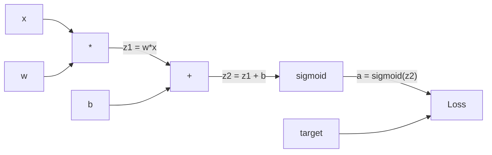
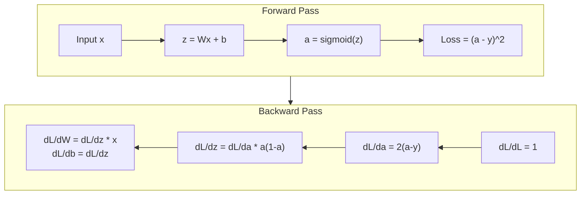
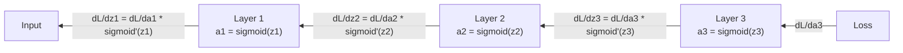

# 从零实现反向传播

> 反向传播是让学习成为可能的算法。没有它，神经网络只是昂贵的随机数生成器。

**Type:** Build
**Languages:** Python
**Prerequisites:** Lesson 03.02 (Multi-Layer Networks)
**Time:** ~120 minutes

## 学习目标

- 实现一个基于 Value 的 autograd 引擎，构建计算图并通过拓扑排序计算梯度
- 用链式法则推导加法、乘法和 sigmoid 的 backward pass
- 仅使用你从零构建的反向传播引擎，在 XOR 和圆形分类上训练多层网络
- 识别深层 sigmoid 网络中的梯度消失问题，并解释为什么梯度会指数级缩小

## 问题

你的网络有一个隐藏层，768 个输入和 3072 个输出。那是 2,359,296 个 weight。它做了一个错误的预测。哪些 weight 导致了这个错误？逐个测试每个 weight 意味着 230 万次 forward pass。反向传播在一次 backward pass 中计算所有 230 万个梯度。这不是优化。这是可训练和不可能之间的区别。

朴素方法：取一个 weight，微调一点点，再跑一次 forward pass，看 loss 是上升还是下降。这给你那个 weight 的梯度。现在对网络中的每个 weight 都这样做。再乘以数千个训练步骤和数百万个数据点。你需要地质时间才能训练出任何有用的东西。

反向传播解决了这个问题。一次 forward pass，一次 backward pass，所有梯度计算完毕。技巧是微积分中的链式法则，系统地应用于计算图。这是让深度学习变得实用的算法。没有它，我们还会困在玩具问题上。

## 概念

### 链式法则，应用于网络

你在 Phase 01, Lesson 05 中见过链式法则。快速回顾：如果 y = f(g(x))，那么 dy/dx = f'(g(x)) * g'(x)。你沿着链乘导数。

在神经网络中，"链"是从输入到 loss 的操作序列。每一层应用 weight，加 bias，通过激活函数。损失函数把最终输出和目标做比较。反向传播沿着这条链反向追踪，计算每个操作对误差的贡献。

### 计算图

每次 forward pass 都构建一个图。每个节点是一个操作（乘法、加法、sigmoid）。每条边在前向携带值，在反向携带梯度。



Forward pass：值从左到右流动。x 和 w 产生 z1 = w*x。加上 b 得到 z2。Sigmoid 给出激活值 a。用损失函数比较 a 和目标 y。

Backward pass：梯度从右到左流动。从 dL/da（loss 随激活值的变化）开始。乘以 da/dz2（sigmoid 导数）。得到 dL/dz2。分成 dL/db（等于 dL/dz2，因为 z2 = z1 + b）和 dL/dz1。然后 dL/dw = dL/dz1 * x，dL/dx = dL/dz1 * w。

图中的每个节点在 backward pass 中只有一个任务：接收从上面传来的梯度，乘以它的局部导数，然后向下传递。

### Forward vs Backward



Forward pass 存储每个中间值：z、a、每层的输入。Backward pass 需要这些存储的值来计算梯度。这是反向传播核心的内存-计算权衡。你用内存（存储激活值）换速度（一次 pass 而不是数百万次）。

### 梯度在网络中的流动

对于 3 层网络，梯度链式通过每一层：



在每一层，梯度被乘以 sigmoid 导数。Sigmoid 导数是 a * (1 - a)，最大值为 0.25（当 a = 0.5 时）。三层深，梯度最多被乘以 0.25^3 = 0.0156。十层深：0.25^10 = 0.000001。

### 梯度消失

这就是梯度消失问题。Sigmoid 把输出压缩在 0 和 1 之间。它的导数总是小于 0.25。堆叠足够多的 sigmoid 层，梯度就缩小到几乎为零。早期层几乎不学习，因为它们收到的梯度接近零。

```
sigmoid(z):     Output range [0, 1]
sigmoid'(z):    Max value 0.25 (at z = 0)

After 5 layers:   gradient * 0.25^5 = 0.001x original
After 10 layers:  gradient * 0.25^10 = 0.000001x original
```

这就是为什么深层 sigmoid 网络几乎不可能训练。解决办法——ReLU 及其变体——是 Lesson 04 的主题。现在只需理解反向传播本身工作得很好。问题在于它要穿过什么。

### 推导 2 层网络的梯度

具体数学：一个网络有输入 x，带 sigmoid 的隐藏层，带 sigmoid 的输出层，和 MSE loss。

Forward pass：
```
z1 = W1 * x + b1
a1 = sigmoid(z1)
z2 = W2 * a1 + b2
a2 = sigmoid(z2)
L = (a2 - y)^2
```

Backward pass（逐步应用链式法则）：
```
dL/da2 = 2(a2 - y)
da2/dz2 = a2 * (1 - a2)
dL/dz2 = dL/da2 * da2/dz2 = 2(a2 - y) * a2 * (1 - a2)

dL/dW2 = dL/dz2 * a1
dL/db2 = dL/dz2

dL/da1 = dL/dz2 * W2
da1/dz1 = a1 * (1 - a1)
dL/dz1 = dL/da1 * da1/dz1

dL/dW1 = dL/dz1 * x
dL/db1 = dL/dz1
```

每个梯度都是从 loss 追溯回来的局部导数的乘积。反向传播就是这些。

## 动手实现

### Step 1: Value 节点

我们计算中的每个数字都变成一个 Value。它存储数据、梯度，以及它是如何被创建的（这样它知道如何反向计算梯度）。

```python
class Value:
    def __init__(self, data, children=(), op=''):
        self.data = data
        self.grad = 0.0
        self._backward = lambda: None
        self._children = set(children)
        self._op = op

    def __repr__(self):
        return f"Value(data={self.data:.4f}, grad={self.grad:.4f})"
```

还没有梯度（0.0）。还没有 backward 函数（空操作）。`_children` 追踪哪些 Value 产生了这个 Value，这样我们之后可以对图做拓扑排序。

### Step 2: 带 Backward 函数的操作

每个操作创建一个新的 Value，并定义梯度如何反向流过它。

```python
def __add__(self, other):
    other = other if isinstance(other, Value) else Value(other)
    out = Value(self.data + other.data, (self, other), '+')

    def _backward():
        self.grad += out.grad
        other.grad += out.grad

    out._backward = _backward
    return out

def __mul__(self, other):
    other = other if isinstance(other, Value) else Value(other)
    out = Value(self.data * other.data, (self, other), '*')

    def _backward():
        self.grad += other.data * out.grad
        other.grad += self.data * out.grad

    out._backward = _backward
    return out
```

对于加法：d(a+b)/da = 1，d(a+b)/db = 1。所以两个输入直接获得输出的梯度。

对于乘法：d(a*b)/da = b，d(a*b)/db = a。每个输入获得另一个的值乘以输出梯度。

`+=` 是关键。一个 Value 可能被用在多个操作中。它的梯度是来自所有路径的梯度之和。

### Step 3: Sigmoid 和 Loss

```python
import math

def sigmoid(self):
    x = self.data
    x = max(-500, min(500, x))
    s = 1.0 / (1.0 + math.exp(-x))
    out = Value(s, (self,), 'sigmoid')

    def _backward():
        self.grad += (s * (1 - s)) * out.grad

    out._backward = _backward
    return out
```

Sigmoid 导数：sigmoid(x) * (1 - sigmoid(x))。我们在 forward pass 中已经计算了 sigmoid(x) = s。复用它。不需要额外工作。

```python
def mse_loss(predicted, target):
    diff = predicted + Value(-target)
    return diff * diff
```

单个输出的 MSE：(predicted - target)^2。我们把减法表示为加上一个取反的 Value。

### Step 4: Backward Pass

拓扑排序确保我们按正确的顺序处理节点——一个节点的梯度在我们通过它传播之前已经完全累积。

```python
def backward(self):
    topo = []
    visited = set()

    def build_topo(v):
        if v not in visited:
            visited.add(v)
            for child in v._children:
                build_topo(child)
            topo.append(v)

    build_topo(self)
    self.grad = 1.0
    for v in reversed(topo):
        v._backward()
```

从 loss 开始（梯度 = 1.0，因为 dL/dL = 1）。反向遍历排序后的图。每个节点的 `_backward` 把梯度推给它的子节点。

### Step 5: Layer 和 Network

```python
import random

class Neuron:
    def __init__(self, n_inputs):
        scale = (2.0 / n_inputs) ** 0.5
        self.weights = [Value(random.uniform(-scale, scale)) for _ in range(n_inputs)]
        self.bias = Value(0.0)

    def __call__(self, x):
        act = sum((wi * xi for wi, xi in zip(self.weights, x)), self.bias)
        return act.sigmoid()

    def parameters(self):
        return self.weights + [self.bias]


class Layer:
    def __init__(self, n_inputs, n_outputs):
        self.neurons = [Neuron(n_inputs) for _ in range(n_outputs)]

    def __call__(self, x):
        out = [n(x) for n in self.neurons]
        return out[0] if len(out) == 1 else out

    def parameters(self):
        params = []
        for n in self.neurons:
            params.extend(n.parameters())
        return params


class Network:
    def __init__(self, sizes):
        self.layers = []
        for i in range(len(sizes) - 1):
            self.layers.append(Layer(sizes[i], sizes[i + 1]))

    def __call__(self, x):
        for layer in self.layers:
            x = layer(x)
            if not isinstance(x, list):
                x = [x]
        return x[0] if len(x) == 1 else x

    def parameters(self):
        params = []
        for layer in self.layers:
            params.extend(layer.parameters())
        return params

    def zero_grad(self):
        for p in self.parameters():
            p.grad = 0.0
```

一个 Neuron 接收输入，计算加权和 + bias，应用 sigmoid。Weight 初始化按 sqrt(2/n_inputs) 缩放，防止深层网络中的 sigmoid 饱和。一个 Layer 是 Neuron 的列表。一个 Network 是 Layer 的列表。`parameters()` 方法收集所有可学习的 Value，这样我们可以更新它们。

### Step 6: 在 XOR 上训练

```python
random.seed(42)
net = Network([2, 4, 1])

xor_data = [
    ([0.0, 0.0], 0.0),
    ([0.0, 1.0], 1.0),
    ([1.0, 0.0], 1.0),
    ([1.0, 1.0], 0.0),
]

learning_rate = 1.0

for epoch in range(1000):
    total_loss = Value(0.0)
    for inputs, target in xor_data:
        x = [Value(i) for i in inputs]
        pred = net(x)
        loss = mse_loss(pred, target)
        total_loss = total_loss + loss

    net.zero_grad()
    total_loss.backward()

    for p in net.parameters():
        p.data -= learning_rate * p.grad

    if epoch % 100 == 0:
        print(f"Epoch {epoch:4d} | Loss: {total_loss.data:.6f}")

print("\nXOR Results:")
for inputs, target in xor_data:
    x = [Value(i) for i in inputs]
    pred = net(x)
    print(f"  {inputs} -> {pred.data:.4f} (expected {target})")
```

看 loss 下降。从随机预测到正确的 XOR 输出，完全由反向传播计算梯度并朝正确方向微调 weight 驱动。

### Step 7: 圆形分类

在 Lesson 02 中，你手动调参了圆形分类的 weight。现在让网络自己学。

```python
random.seed(7)

def generate_circle_data(n=100):
    data = []
    for _ in range(n):
        x1 = random.uniform(-1.5, 1.5)
        x2 = random.uniform(-1.5, 1.5)
        label = 1.0 if x1 * x1 + x2 * x2 < 1.0 else 0.0
        data.append(([x1, x2], label))
    return data

circle_data = generate_circle_data(80)

circle_net = Network([2, 8, 1])
learning_rate = 0.5

for epoch in range(2000):
    random.shuffle(circle_data)
    total_loss_val = 0.0
    for inputs, target in circle_data:
        x = [Value(i) for i in inputs]
        pred = circle_net(x)
        loss = mse_loss(pred, target)
        circle_net.zero_grad()
        loss.backward()
        for p in circle_net.parameters():
            p.data -= learning_rate * p.grad
        total_loss_val += loss.data

    if epoch % 200 == 0:
        correct = 0
        for inputs, target in circle_data:
            x = [Value(i) for i in inputs]
            pred = circle_net(x)
            predicted_class = 1.0 if pred.data > 0.5 else 0.0
            if predicted_class == target:
                correct += 1
        accuracy = correct / len(circle_data) * 100
        print(f"Epoch {epoch:4d} | Loss: {total_loss_val:.4f} | Accuracy: {accuracy:.1f}%")
```

这里我们使用在线 SGD——每个样本后更新 weight，而不是累积整个 batch。这能更快打破对称性，避免在完整 loss 景观上的 sigmoid 饱和。每个 epoch 打乱数据防止网络记住顺序。

不需要手动调参。网络自己发现了圆形决策边界。这就是反向传播的力量：你定义架构、损失函数和数据。算法自己找出 weight。

## 实际使用

PyTorch 用几行代码做了上面所有的事。核心思想完全一样——autograd 在 forward pass 中构建计算图，然后反向追踪它来计算梯度。

```python
import torch
import torch.nn as nn

model = nn.Sequential(
    nn.Linear(2, 4),
    nn.Sigmoid(),
    nn.Linear(4, 1),
    nn.Sigmoid(),
)
optimizer = torch.optim.SGD(model.parameters(), lr=1.0)
criterion = nn.MSELoss()

X = torch.tensor([[0,0],[0,1],[1,0],[1,1]], dtype=torch.float32)
y = torch.tensor([[0],[1],[1],[0]], dtype=torch.float32)

for epoch in range(1000):
    pred = model(X)
    loss = criterion(pred, y)
    optimizer.zero_grad()
    loss.backward()
    optimizer.step()

print("PyTorch XOR Results:")
with torch.no_grad():
    for i in range(4):
        pred = model(X[i])
        print(f"  {X[i].tolist()} -> {pred.item():.4f} (expected {y[i].item()})")
```

`loss.backward()` 就是你的 `total_loss.backward()`。`optimizer.step()` 就是你手动的 `p.data -= lr * p.grad`。`optimizer.zero_grad()` 就是你的 `net.zero_grad()`。同样的算法，工业级实现。PyTorch 处理 GPU 加速、混合精度、梯度检查点和数百种层类型。但 backward pass 是同样的链式法则应用于同样的计算图。

训练运行 forward pass，然后 backward pass，然后更新 weight。推理只运行 forward pass。没有梯度，没有更新。这个区别很重要，因为推理是生产环境中发生的事。当你调用 Claude 或 GPT 这样的 API 时，你在运行推理——你的 prompt 前向流过网络，token 从另一端出来。没有 weight 改变。理解反向传播很重要，因为它塑造了那个网络中的每一个 weight。

## 交付产出

本课产出：
- `outputs/prompt-gradient-debugger.md` -- 一个可复用的 prompt，用于诊断任何神经网络中的梯度问题（消失、爆炸、NaN）

## 练习

1. 给 Value 类添加 `__sub__` 方法（a - b = a + (-1 * b)）。然后实现 `__neg__` 方法。通过与简单表达式（如 (a - b)^2）的手动计算对比，验证梯度是否正确。

2. 给 Value 添加 `relu` 方法（输出 max(0, x)，导数在 x > 0 时为 1，否则为 0）。在隐藏层中用 relu 替换 sigmoid，再次在 XOR 上训练。比较收敛速度。你应该看到更快的训练——这预览了 Lesson 04。

3. 在 Value 上实现 `__pow__` 方法用于整数幂。用它把 `mse_loss` 替换为正式的 `(predicted - target) ** 2` 表达式。验证梯度与原始实现匹配。

4. 在训练循环中添加梯度裁剪：调用 `backward()` 后，把所有梯度裁剪到 [-1, 1]。训练一个更深的网络（4+ 层带 sigmoid），比较有无裁剪的 loss 曲线。这是你对抗梯度爆炸的第一道防线。

5. 构建一个可视化：在 XOR 训练后，打印网络中每个参数的梯度。识别哪一层的梯度最小。这演示了你在概念部分读到的梯度消失问题。

## 关键术语

| 术语 | 通俗说法 | 实际含义 |
|------|---------|---------|
| 反向传播 | "网络在学习" | 一个算法，通过在计算图上反向应用链式法则来计算每个 weight 的 dL/dw |
| 计算图 | "网络结构" | 一个有向无环图，节点是操作，边携带值（前向）和梯度（反向） |
| 链式法则 | "把导数乘起来" | 如果 y = f(g(x))，那么 dy/dx = f'(g(x)) * g'(x)——反向传播的数学基础 |
| 梯度 | "最陡上升方向" | loss 对参数的偏导数——告诉你如何改变那个参数来减少 loss |
| 梯度消失 | "深层网络不学习" | 梯度在通过带饱和激活（如 sigmoid）的层时指数级缩小 |
| Forward pass | "运行网络" | 从输入计算输出，按顺序应用每层的操作并存储中间值 |
| Backward pass | "计算梯度" | 反向遍历计算图，在每个节点用链式法则累积梯度 |
| Learning rate | "学多快" | 控制更新 weight 时步长大小的标量：w_new = w_old - lr * gradient |
| 拓扑排序 | "正确的顺序" | 图节点的一种排序，每个节点出现在它依赖的所有节点之后——确保梯度在传播前已完全累积 |
| Autograd | "自动微分" | 在前向计算中构建计算图并自动计算梯度的系统——PyTorch 引擎做的事 |

## 延伸阅读

- Rumelhart, Hinton & Williams, "Learning representations by back-propagating errors" (1986) -- 让反向传播成为主流并解锁多层网络训练的论文
- 3Blue1Brown, "Neural Networks" series (https://www.youtube.com/playlist?list=PLZHQObOWTQDNU6R1_67000Dx_ZCJB-3pi) -- 关于反向传播和梯度在网络中流动的最佳可视化解释
