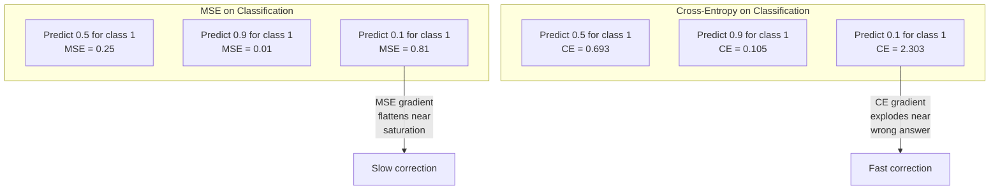
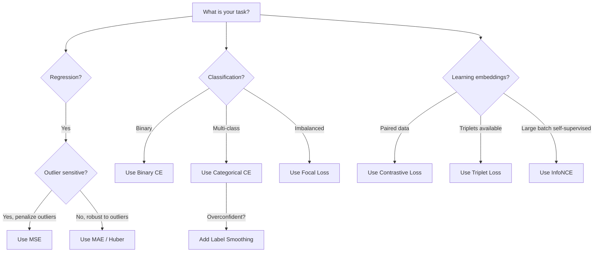
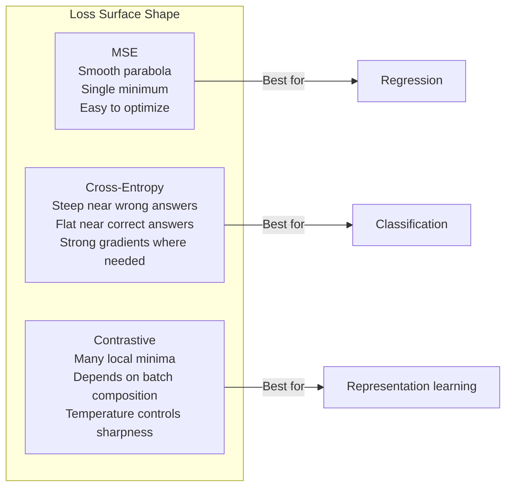

# 损失函数

> 你的网络做了一个预测。Ground truth 说不对。它错了多少？那个数字就是 loss。选错损失函数，你的模型就在优化完全错误的东西。

**Type:** Build
**Languages:** Python
**Prerequisites:** Lesson 03.04 (Activation Functions)
**Time:** ~75 minutes

## 学习目标

- 从零实现 MSE、binary cross-entropy、categorical cross-entropy 和 contrastive loss (InfoNCE) 及其梯度
- 通过演示"对所有输入都预测 0.5"的失败模式，解释为什么 MSE 在分类任务上失败
- 对 cross-entropy 应用 label smoothing，并描述它如何防止过度自信的预测
- 为回归、二分类、多分类和 embedding 学习任务选择正确的损失函数

## 问题

一个在分类问题上最小化 MSE 的模型会自信地对所有输入预测 0.5。它在最小化 loss。它也完全没用。

损失函数是你的模型实际优化的唯一东西。不是 accuracy。不是 F1 score。不是你向老板汇报的任何指标。优化器取损失函数的梯度并调整 weight 来让那个数字变小。如果损失函数没有捕捉到你关心的东西，模型会找到数学上最便宜的方式来满足它，而那种方式几乎从来不是你想要的。

这是一个具体例子。你有一个二分类任务。两个类别，50/50 分布。你用 MSE 作为 loss。模型对每个输入都预测 0.5。平均 MSE 是 0.25，这是不实际学习任何东西就能达到的最小值。模型的判别能力为零，但它在技术上确实最小化了你的损失函数。换成 cross-entropy，同样的模型被迫把预测推向 0 或 1，因为 -log(0.5) = 0.693 是一个很糟糕的 loss，而 -log(0.99) = 0.01 奖励自信的正确预测。损失函数的选择就是一个学习的模型和一个钻空子的模型之间的区别。

更糟的是。在自监督学习中，你甚至没有标签。Contrastive loss 完全定义了学习信号：什么算相似，什么算不同，模型应该多用力把它们推开。Contrastive loss 搞错了，你的 embedding 会坍缩到一个点——每个输入映射到同一个向量。技术上零 loss。完全没用。

## 概念

### 均方误差 (MSE)

回归的默认选择。计算预测和目标之间的平方差，对所有样本取平均。

```
MSE = (1/n) * sum((y_pred - y_true)^2)
```

为什么平方很重要：它对大误差施加二次惩罚。误差为 2 的代价是误差为 1 的 4 倍。误差为 10 的代价是 100 倍。这使 MSE 对异常值敏感——一个严重错误的预测会主导整个 loss。

实际数字：如果你的模型预测房价，在大多数房子上偏差 $10,000，但在一栋豪宅上偏差 $200,000，MSE 会激进地试图修复那一栋豪宅，可能损害其他 99 栋房子的性能。

MSE 对预测的梯度是：

```
dMSE/dy_pred = (2/n) * (y_pred - y_true)
```

与误差成线性关系。更大的误差得到更大的梯度。这对回归是特性（大误差需要大修正），对分类是 bug（你想对自信的错误答案施加指数级惩罚，而不是线性的）。

### Cross-Entropy Loss

分类的损失函数。根植于信息论——它衡量预测概率分布和真实分布之间的散度。

**Binary Cross-Entropy (BCE):**

```
BCE = -(y * log(p) + (1 - y) * log(1 - p))
```

其中 y 是真实标签（0 或 1），p 是预测概率。

为什么 -log(p) 有效：当真实标签是 1 且你预测 p = 0.99 时，loss 是 -log(0.99) = 0.01。当你预测 p = 0.01 时，loss 是 -log(0.01) = 4.6。这 460 倍的差异就是 cross-entropy 有效的原因。它残酷地惩罚自信的错误预测，同时几乎不惩罚自信的正确预测。

梯度讲述了同样的故事：

```
dBCE/dp = -(y/p) + (1-y)/(1-p)
```

当 y = 1 且 p 接近零时，梯度是 -1/p，趋向负无穷。模型收到巨大的信号来修正错误。当 p 接近 1 时，梯度很小。已经正确了，没什么要修的。

**Categorical Cross-Entropy:**

用于带 one-hot 编码目标的多分类。

```
CCE = -sum(y_i * log(p_i))
```

只有真实类别对 loss 有贡献（因为其他所有 y_i 都是零）。如果有 10 个类别且正确类别得到概率 0.1（随机猜测），loss 是 -log(0.1) = 2.3。如果正确类别得到概率 0.9，loss 是 -log(0.9) = 0.105。模型学会把概率质量集中在正确答案上。

### 为什么 MSE 在分类上失败



当预测接近 0 或 1 时（由于 sigmoid 饱和），MSE 梯度变平。Cross-entropy 梯度补偿了这一点——-log 抵消了 sigmoid 的平坦区域，恰好在最需要的地方给出强梯度。

### Label Smoothing

标准 one-hot 标签说"这 100% 是 class 3，0% 是其他所有类别。"这是一个很强的声明。Label smoothing 软化它：

```
smooth_label = (1 - alpha) * one_hot + alpha / num_classes
```

alpha = 0.1 且 10 个类别时：目标从 [0, 0, 1, 0, ...] 变成 [0.01, 0.01, 0.91, 0.01, ...]。模型的目标是 0.91 而不是 1.0。

为什么这有效：一个试图通过 softmax 输出恰好 1.0 的模型需要把 logit 推到无穷大。这导致过度自信，损害泛化能力，使模型对分布偏移脆弱。Label smoothing 把目标限制在 0.9（alpha=0.1 时），让 logit 保持在合理范围内。GPT 和大多数现代模型使用 label smoothing 或其等价物。

### Contrastive Loss

没有标签。没有类别。只有输入对和一个问题：这些相似还是不同？

**SimCLR 风格的 contrastive loss (NT-Xent / InfoNCE):**

取一张图片。创建它的两个增强视图（裁剪、旋转、颜色抖动）。这些是"正样本对"——它们应该有相似的 embedding。Batch 中的每张其他图片形成"负样本对"——它们应该有不同的 embedding。

```
L = -log(exp(sim(z_i, z_j) / tau) / sum(exp(sim(z_i, z_k) / tau)))
```

其中 sim() 是余弦相似度，z_i 和 z_j 是正样本对，求和遍历所有负样本，tau（temperature）控制分布有多尖锐。更低的 temperature = 更难的负样本 = 更激进的分离。

实际数字：batch size 256 意味着每个正样本对有 255 个负样本。Temperature tau = 0.07（SimCLR 默认值）。Loss 看起来像相似度上的 softmax——它希望正样本对的相似度在所有 256 个选项中最高。

**Triplet Loss:**

接收三个输入：anchor、positive（同类）、negative（不同类）。

```
L = max(0, d(anchor, positive) - d(anchor, negative) + margin)
```

Margin（通常 0.2-1.0）强制正负距离之间有最小间隔。如果负样本已经足够远，loss 为零——没有梯度，没有更新。这使训练高效，但需要仔细的 triplet mining（选择接近 anchor 的困难负样本）。

### Focal Loss

用于不平衡数据集。标准 cross-entropy 对所有正确分类的样本一视同仁。Focal loss 降低简单样本的权重：

```
FL = -alpha * (1 - p_t)^gamma * log(p_t)
```

其中 p_t 是真实类别的预测概率，gamma 控制聚焦程度。gamma = 0 时，这就是标准 cross-entropy。gamma = 2（默认值）时：

- 简单样本 (p_t = 0.9)：权重 = (0.1)^2 = 0.01。实际上被忽略。
- 困难样本 (p_t = 0.1)：权重 = (0.9)^2 = 0.81。完整的梯度信号。

Focal loss 由 Lin 等人为目标检测引入，其中 99% 的候选区域是背景（简单负样本）。没有 focal loss，模型淹没在简单的背景样本中，永远学不会检测物体。有了它，模型把容量集中在重要的困难、模糊的案例上。

### 损失函数决策树



### Loss 景观



## 动手实现

### Step 1: MSE 及其梯度

```python
def mse(predictions, targets):
    n = len(predictions)
    total = 0.0
    for p, t in zip(predictions, targets):
        total += (p - t) ** 2
    return total / n

def mse_gradient(predictions, targets):
    n = len(predictions)
    grads = []
    for p, t in zip(predictions, targets):
        grads.append(2.0 * (p - t) / n)
    return grads
```

### Step 2: Binary Cross-Entropy

log(0) 问题是真实存在的。如果模型对正样本预测恰好 0，log(0) = 负无穷。Clipping 防止这个问题。

```python
import math

def binary_cross_entropy(predictions, targets, eps=1e-15):
    n = len(predictions)
    total = 0.0
    for p, t in zip(predictions, targets):
        p_clipped = max(eps, min(1 - eps, p))
        total += -(t * math.log(p_clipped) + (1 - t) * math.log(1 - p_clipped))
    return total / n

def bce_gradient(predictions, targets, eps=1e-15):
    grads = []
    for p, t in zip(predictions, targets):
        p_clipped = max(eps, min(1 - eps, p))
        grads.append(-(t / p_clipped) + (1 - t) / (1 - p_clipped))
    return grads
```

### Step 3: Categorical Cross-Entropy with Softmax

Softmax 把原始 logit 转换为概率。然后我们对 one-hot 目标计算 cross-entropy。

```python
def softmax(logits):
    max_val = max(logits)
    exps = [math.exp(x - max_val) for x in logits]
    total = sum(exps)
    return [e / total for e in exps]

def categorical_cross_entropy(logits, target_index, eps=1e-15):
    probs = softmax(logits)
    p = max(eps, probs[target_index])
    return -math.log(p)

def cce_gradient(logits, target_index):
    probs = softmax(logits)
    grads = list(probs)
    grads[target_index] -= 1.0
    return grads
```

Softmax + cross-entropy 的梯度简化得很漂亮：对真实类别就是（预测概率 - 1），对所有其他类别就是（预测概率）。这个优雅的简化不是巧合——这就是为什么 softmax 和 cross-entropy 是配对使用的。

### Step 4: Label Smoothing

```python
def label_smoothed_cce(logits, target_index, num_classes, alpha=0.1, eps=1e-15):
    probs = softmax(logits)
    loss = 0.0
    for i in range(num_classes):
        if i == target_index:
            smooth_target = 1.0 - alpha + alpha / num_classes
        else:
            smooth_target = alpha / num_classes
        p = max(eps, probs[i])
        loss += -smooth_target * math.log(p)
    return loss
```

### Step 5: Contrastive Loss (简化版 InfoNCE)

```python
def cosine_similarity(a, b):
    dot = sum(x * y for x, y in zip(a, b))
    norm_a = math.sqrt(sum(x * x for x in a))
    norm_b = math.sqrt(sum(x * x for x in b))
    if norm_a < 1e-10 or norm_b < 1e-10:
        return 0.0
    return dot / (norm_a * norm_b)

def contrastive_loss(anchor, positive, negatives, temperature=0.07):
    sim_pos = cosine_similarity(anchor, positive) / temperature
    sim_negs = [cosine_similarity(anchor, neg) / temperature for neg in negatives]

    max_sim = max(sim_pos, max(sim_negs)) if sim_negs else sim_pos
    exp_pos = math.exp(sim_pos - max_sim)
    exp_negs = [math.exp(s - max_sim) for s in sim_negs]
    total_exp = exp_pos + sum(exp_negs)

    return -math.log(max(1e-15, exp_pos / total_exp))
```

### Step 6: MSE vs Cross-Entropy 在分类上的对比

用两种损失函数训练 lesson 04 中的同一网络（圆形数据集）。观察 cross-entropy 收敛更快。

```python
import random

def sigmoid(x):
    x = max(-500, min(500, x))
    return 1.0 / (1.0 + math.exp(-x))

def make_circle_data(n=200, seed=42):
    random.seed(seed)
    data = []
    for _ in range(n):
        x = random.uniform(-2, 2)
        y = random.uniform(-2, 2)
        label = 1.0 if x * x + y * y < 1.5 else 0.0
        data.append(([x, y], label))
    return data


class LossComparisonNetwork:
    def __init__(self, loss_type="bce", hidden_size=8, lr=0.1):
        random.seed(0)
        self.loss_type = loss_type
        self.lr = lr
        self.hidden_size = hidden_size

        self.w1 = [[random.gauss(0, 0.5) for _ in range(2)] for _ in range(hidden_size)]
        self.b1 = [0.0] * hidden_size
        self.w2 = [random.gauss(0, 0.5) for _ in range(hidden_size)]
        self.b2 = 0.0

    def forward(self, x):
        self.x = x
        self.z1 = []
        self.h = []
        for i in range(self.hidden_size):
            z = self.w1[i][0] * x[0] + self.w1[i][1] * x[1] + self.b1[i]
            self.z1.append(z)
            self.h.append(max(0.0, z))

        self.z2 = sum(self.w2[i] * self.h[i] for i in range(self.hidden_size)) + self.b2
        self.out = sigmoid(self.z2)
        return self.out

    def backward(self, target):
        if self.loss_type == "mse":
            d_loss = 2.0 * (self.out - target)
        else:
            eps = 1e-15
            p = max(eps, min(1 - eps, self.out))
            d_loss = -(target / p) + (1 - target) / (1 - p)

        d_sigmoid = self.out * (1 - self.out)
        d_out = d_loss * d_sigmoid

        for i in range(self.hidden_size):
            d_relu = 1.0 if self.z1[i] > 0 else 0.0
            d_h = d_out * self.w2[i] * d_relu
            self.w2[i] -= self.lr * d_out * self.h[i]
            for j in range(2):
                self.w1[i][j] -= self.lr * d_h * self.x[j]
            self.b1[i] -= self.lr * d_h
        self.b2 -= self.lr * d_out

    def compute_loss(self, pred, target):
        if self.loss_type == "mse":
            return (pred - target) ** 2
        else:
            eps = 1e-15
            p = max(eps, min(1 - eps, pred))
            return -(target * math.log(p) + (1 - target) * math.log(1 - p))

    def train(self, data, epochs=200):
        losses = []
        for epoch in range(epochs):
            total_loss = 0.0
            correct = 0
            for x, y in data:
                pred = self.forward(x)
                self.backward(y)
                total_loss += self.compute_loss(pred, y)
                if (pred >= 0.5) == (y >= 0.5):
                    correct += 1
            avg_loss = total_loss / len(data)
            accuracy = correct / len(data) * 100
            losses.append((avg_loss, accuracy))
            if epoch % 50 == 0 or epoch == epochs - 1:
                print(f"    Epoch {epoch:3d}: loss={avg_loss:.4f}, accuracy={accuracy:.1f}%")
        return losses
```

## 实际使用

PyTorch 提供所有标准损失函数，内置数值稳定性：

```python
import torch
import torch.nn as nn
import torch.nn.functional as F

predictions = torch.tensor([0.9, 0.1, 0.7], requires_grad=True)
targets = torch.tensor([1.0, 0.0, 1.0])

mse_loss = F.mse_loss(predictions, targets)
bce_loss = F.binary_cross_entropy(predictions, targets)

logits = torch.randn(4, 10)
labels = torch.tensor([3, 7, 1, 9])
ce_loss = F.cross_entropy(logits, labels)
ce_smooth = F.cross_entropy(logits, labels, label_smoothing=0.1)
```

使用 `F.cross_entropy`（不是 `F.nll_loss` 加手动 softmax）。它在一个数值稳定的操作中组合了 log-softmax 和负对数似然。单独应用 softmax 再取 log 不太稳定——你在大指数的减法中丢失精度。

对于对比学习，大多数团队使用自定义实现或 `lightly`、`pytorch-metric-learning` 等库。核心循环总是一样的：计算成对相似度，在正负样本上创建 softmax，反向传播。

## 交付产出

本课产出：
- `outputs/prompt-loss-function-selector.md` -- 一个用于选择正确损失函数的可复用 prompt
- `outputs/prompt-loss-debugger.md` -- 一个当你的 loss 曲线看起来不对时的诊断 prompt

## 练习

1. 实现 Huber loss（smooth L1 loss），它对小误差是 MSE，对大误差是 MAE。训练一个预测 y = sin(x) 的回归网络，在 5% 的训练目标上添加随机噪声（异常值），比较 MSE vs Huber 的最终测试误差。

2. 在二分类训练循环中添加 focal loss。创建一个不平衡数据集（90% class 0，10% class 1）。比较标准 BCE vs focal loss (gamma=2) 在 200 个 epoch 后对少数类 recall 的效果。

3. 实现带 semi-hard negative mining 的 triplet loss。为 5 个类别生成 2D embedding 数据。对每个 anchor，找到仍然比 positive 远但最接近的负样本（semi-hard）。与随机 triplet 选择比较收敛速度。

4. 运行 MSE vs cross-entropy 对比，但在训练期间跟踪每层的梯度幅度。绘制每个 epoch 的平均梯度范数。验证 cross-entropy 在模型最不确定的早期 epoch 产生更大的梯度。

5. 实现 KL 散度 loss，验证当真实分布是 one-hot 时，最小化 KL(true || predicted) 给出与 cross-entropy 相同的梯度。然后尝试软目标（如知识蒸馏），其中"真实"分布来自教师模型的 softmax 输出。

## 关键术语

| 术语 | 通俗说法 | 实际含义 |
|------|---------|---------|
| 损失函数 | "模型错了多少" | 一个可微函数，把预测和目标映射到一个标量，优化器最小化它 |
| MSE | "平均平方误差" | 预测和目标之间平方差的均值；对大误差施加二次惩罚 |
| Cross-entropy | "分类的 loss" | 用 -log(p) 衡量预测概率分布和真实分布之间的散度 |
| Binary cross-entropy | "BCE" | 两个类别的 cross-entropy：-(y*log(p) + (1-y)*log(1-p)) |
| Label smoothing | "软化目标" | 用软值（如 0.1/0.9）替换硬 0/1 目标，防止过度自信并改善泛化 |
| Contrastive loss | "拉近，推远" | 通过让相似对在 embedding 空间中接近、不相似对远离来学习表示的 loss |
| InfoNCE | "CLIP/SimCLR 的 loss" | 在相似度分数上的归一化温度缩放 cross-entropy；把对比学习当作分类来处理 |
| Focal loss | "不平衡数据的修复" | 用 (1-p_t)^gamma 加权的 cross-entropy，降低简单样本权重，聚焦困难样本 |
| Triplet loss | "Anchor-positive-negative" | 把 anchor 推向比 negative 更接近 positive 至少一个 margin 的位置 |
| Temperature | "锐度旋钮" | logit/相似度上的标量除数，控制结果分布有多尖锐；越低越尖锐 |

## 延伸阅读

- Lin et al., "Focal Loss for Dense Object Detection" (2017) -- 引入 focal loss 处理目标检测中的极端类别不平衡（RetinaNet）
- Chen et al., "A Simple Framework for Contrastive Learning of Visual Representations" (SimCLR, 2020) -- 定义了现代对比学习流程和 NT-Xent loss
- Szegedy et al., "Rethinking the Inception Architecture" (2016) -- 引入 label smoothing 作为正则化技术，现在是大多数大模型的标准
- Hinton et al., "Distilling the Knowledge in a Neural Network" (2015) -- 使用软目标和 KL 散度的知识蒸馏，模型压缩的基础
