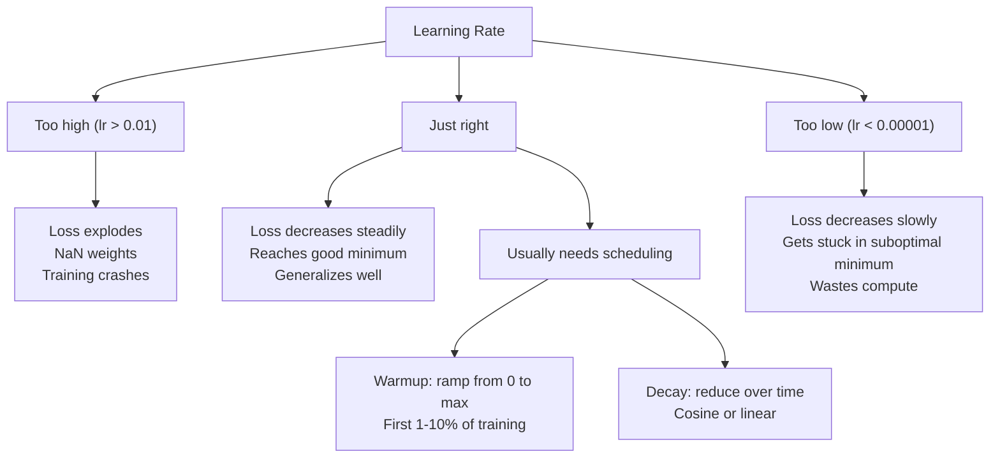
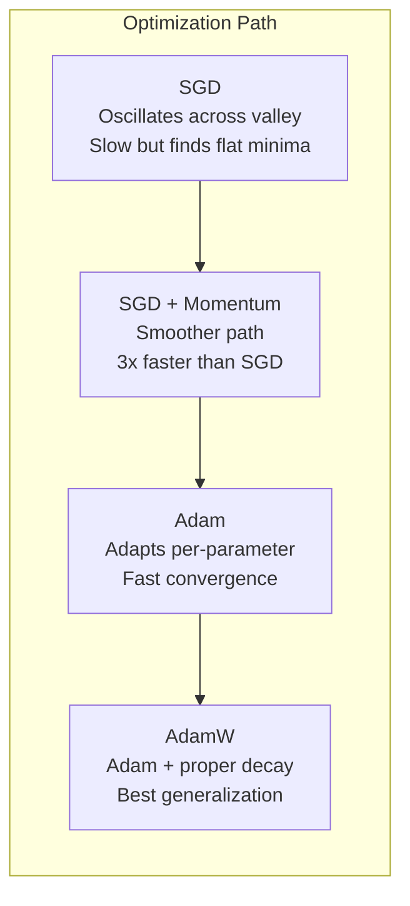
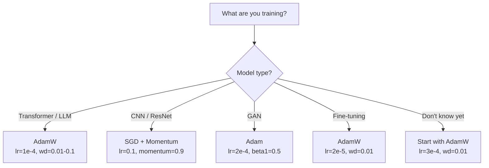

# 优化器

> 梯度下降告诉你往哪个方向走。它没说走多远或多快。SGD 是指南针。Adam 是带实时路况的 GPS。

**Type:** Build
**Languages:** Python
**Prerequisites:** Lesson 03.05 (Loss Functions)
**Time:** ~75 minutes

## 学习目标

- 用 Python 从零实现 SGD、SGD with momentum、Adam 和 AdamW 优化器
- 解释 Adam 的 bias correction 如何补偿训练早期零初始化的矩估计
- 演示为什么 AdamW 在同一任务上比 Adam + L2 正则化产生更好的泛化
- 为 transformer、CNN、GAN 和微调选择合适的优化器和默认超参数

## 问题

你计算了梯度。你知道 weight #4,721 应该减少 0.003 来降低 loss。但 0.003 是什么单位？按什么缩放？而且你应该在第 1 步和第 1,000 步移动相同的量吗？

朴素梯度下降对每个参数在每一步应用相同的 learning rate：w = w - lr * gradient。这产生了三个问题，让训练神经网络在实践中很痛苦。

第一，振荡。Loss 景观很少像一个光滑的碗。它更像一个又长又窄的山谷。梯度指向山谷的横向（陡峭方向），而不是纵向（平缓方向）。梯度下降在窄维度上来回弹跳，同时在有用的方向上只有微小进展。你见过这个：loss 快速下降然后平台期，不是因为模型收敛了，而是因为它在振荡。

第二，所有参数用一个 learning rate 是错的。有些 weight 需要大更新（它们处于早期欠拟合阶段）。其他需要微小更新（它们接近最优值）。对前者有效的 learning rate 会毁掉后者，反之亦然。

第三，鞍点。在高维空间中，loss 景观有大片梯度接近零的平坦区域。朴素 SGD 以梯度的速度爬过这些区域，而梯度实际上是零。模型看起来卡住了。它没有卡住——它在一个平坦区域，另一边有有用的下降。但 SGD 没有机制来推过去。

Adam 解决了这三个问题。它为每个参数维护两个运行平均——平均梯度（momentum，处理振荡）和平均平方梯度（自适应率，处理不同尺度）。加上前几步的 bias correction，它给你一个在 80% 的问题上用默认超参数就能工作的单一优化器。本课从零构建它，这样你就能准确理解它在另外 20% 上何时以及为什么失败。

## 概念

### 随机梯度下降 (SGD)

最简单的优化器。在 mini-batch 上计算梯度，朝相反方向走一步。

```
w = w - lr * gradient
```

"随机"意味着你用数据的随机子集（mini-batch）来估计梯度，而不是完整数据集。这个噪声实际上是有用的——它帮助逃离尖锐的局部最小值。但噪声也导致振荡。

Learning rate 是唯一的旋钮。太高：loss 发散。太低：训练永远完不了。最优值取决于架构、数据、batch size 和训练的当前阶段。对于现代网络上的朴素 SGD，典型值范围是 0.01 到 0.1。但即使在单次训练中，理想的 learning rate 也在变化。

### Momentum

球滚下山的类比被过度使用了但很准确。不是只按梯度走，你维护一个累积过去梯度的速度。

```
m_t = beta * m_{t-1} + gradient
w = w - lr * m_t
```

Beta（通常 0.9）控制保留多少历史。beta = 0.9 时，momentum 大约是最近 10 个梯度的平均（1 / (1 - 0.9) = 10）。

为什么这修复了振荡：指向同一方向的梯度累积。翻转方向的梯度相互抵消。在那个窄山谷中，"横向"分量每步翻转符号并被衰减。"纵向"分量保持一致并被放大。结果是在有用方向上的平滑加速。

实际数字：单独的 SGD 在条件不好的 loss 景观上可能需要 10,000 步。SGD with momentum (beta=0.9) 在同一问题上通常需要 3,000-5,000 步。加速不是边际的。

### RMSProp

第一个真正有效的逐参数自适应 learning rate 方法。由 Hinton 在 Coursera 课程中提出（从未正式发表）。

```
s_t = beta * s_{t-1} + (1 - beta) * gradient^2
w = w - lr * gradient / (sqrt(s_t) + epsilon)
```

s_t 追踪平方梯度的运行平均。持续有大梯度的参数被除以一个大数（更小的有效 learning rate）。有小梯度的参数被除以一个小数（更大的有效 learning rate）。

这解决了"所有参数一个 learning rate"的问题。一个已经收到大更新的 weight 可能接近目标了——减慢它。一个一直收到微小更新的 weight 可能训练不足——加速它。

Epsilon（通常 1e-8）防止参数没被更新时除以零。

### Adam: Momentum + RMSProp

Adam 组合了两个想法。它为每个参数维护两个指数移动平均：

```
m_t = beta1 * m_{t-1} + (1 - beta1) * gradient        (first moment: mean)
v_t = beta2 * v_{t-1} + (1 - beta2) * gradient^2       (second moment: variance)
```

**Bias correction** 是大多数解释跳过的关键细节。在第 1 步，m_1 = (1 - beta1) * gradient。beta1 = 0.9 时，那是 0.1 * gradient——小了十倍。移动平均还没有预热。Bias correction 补偿这个：

```
m_hat = m_t / (1 - beta1^t)
v_hat = v_t / (1 - beta2^t)
```

第 1 步 beta1 = 0.9 时：m_hat = m_1 / (1 - 0.9) = m_1 / 0.1 = 实际梯度。第 100 步：(1 - 0.9^100) 约等于 1.0，所以修正消失了。Bias correction 在前 ~10 步很重要，~50 步后就无关紧要了。

更新：

```
w = w - lr * m_hat / (sqrt(v_hat) + epsilon)
```

Adam 默认值：lr = 0.001, beta1 = 0.9, beta2 = 0.999, epsilon = 1e-8。这些默认值对 80% 的问题有效。当它们不行时，先改 lr。然后 beta2。几乎永远不要改 beta1 或 epsilon。

### AdamW: 正确的 Weight Decay

L2 正则化把 lambda * w^2 加到 loss 上。在朴素 SGD 中，这等价于 weight decay（每步从 weight 中减去 lambda * w）。在 Adam 中，这个等价性不成立。

Loshchilov & Hutter 的洞察：当你把 L2 加到 loss 然后 Adam 处理梯度时，自适应 learning rate 也缩放了正则化项。梯度方差大的参数得到更少的正则化。方差小的参数得到更多。这不是你想要的——你想要统一的正则化，不管梯度统计如何。

AdamW 通过在 Adam 更新之后直接对 weight 应用 weight decay 来修复这个问题：

```
w = w - lr * m_hat / (sqrt(v_hat) + epsilon) - lr * lambda * w
```

Weight decay 项 (lr * lambda * w) 不被 Adam 的自适应因子缩放。每个参数得到相同比例的收缩。

这看起来像一个小细节。不是。AdamW 在几乎所有任务上都比 Adam + L2 正则化收敛到更好的解。它是 PyTorch 中训练 transformer、扩散模型和大多数现代架构的默认优化器。BERT、GPT、LLaMA、Stable Diffusion——都用 AdamW 训练。

### Learning Rate：最重要的超参数



如果你只调一个超参数，调 learning rate。Learning rate 变化 10 倍比你做的任何架构决策都重要。常见默认值：

- SGD: lr = 0.01 to 0.1
- Adam/AdamW: lr = 1e-4 to 3e-4
- 微调预训练模型: lr = 1e-5 to 5e-5
- Learning rate warmup: 前 1-10% 的步数线性上升

### 优化器对比



### 每种优化器何时胜出



## 动手实现

### Step 1: 朴素 SGD

```python
class SGD:
    def __init__(self, lr=0.01):
        self.lr = lr

    def step(self, params, grads):
        for i in range(len(params)):
            params[i] -= self.lr * grads[i]
```

### Step 2: SGD with Momentum

```python
class SGDMomentum:
    def __init__(self, lr=0.01, beta=0.9):
        self.lr = lr
        self.beta = beta
        self.velocities = None

    def step(self, params, grads):
        if self.velocities is None:
            self.velocities = [0.0] * len(params)
        for i in range(len(params)):
            self.velocities[i] = self.beta * self.velocities[i] + grads[i]
            params[i] -= self.lr * self.velocities[i]
```

### Step 3: Adam

```python
import math

class Adam:
    def __init__(self, lr=0.001, beta1=0.9, beta2=0.999, epsilon=1e-8):
        self.lr = lr
        self.beta1 = beta1
        self.beta2 = beta2
        self.epsilon = epsilon
        self.m = None
        self.v = None
        self.t = 0

    def step(self, params, grads):
        if self.m is None:
            self.m = [0.0] * len(params)
            self.v = [0.0] * len(params)

        self.t += 1

        for i in range(len(params)):
            self.m[i] = self.beta1 * self.m[i] + (1 - self.beta1) * grads[i]
            self.v[i] = self.beta2 * self.v[i] + (1 - self.beta2) * grads[i] ** 2

            m_hat = self.m[i] / (1 - self.beta1 ** self.t)
            v_hat = self.v[i] / (1 - self.beta2 ** self.t)

            params[i] -= self.lr * m_hat / (math.sqrt(v_hat) + self.epsilon)
```

### Step 4: AdamW

```python
class AdamW:
    def __init__(self, lr=0.001, beta1=0.9, beta2=0.999, epsilon=1e-8, weight_decay=0.01):
        self.lr = lr
        self.beta1 = beta1
        self.beta2 = beta2
        self.epsilon = epsilon
        self.weight_decay = weight_decay
        self.m = None
        self.v = None
        self.t = 0

    def step(self, params, grads):
        if self.m is None:
            self.m = [0.0] * len(params)
            self.v = [0.0] * len(params)

        self.t += 1

        for i in range(len(params)):
            self.m[i] = self.beta1 * self.m[i] + (1 - self.beta1) * grads[i]
            self.v[i] = self.beta2 * self.v[i] + (1 - self.beta2) * grads[i] ** 2

            m_hat = self.m[i] / (1 - self.beta1 ** self.t)
            v_hat = self.v[i] / (1 - self.beta2 ** self.t)

            params[i] -= self.lr * m_hat / (math.sqrt(v_hat) + self.epsilon)
            params[i] -= self.lr * self.weight_decay * params[i]
```

### Step 5: 训练对比

用所有四种优化器在 lesson 05 的圆形数据集上训练同一个两层网络。比较收敛速度。

```python
import random

def sigmoid(x):
    x = max(-500, min(500, x))
    return 1.0 / (1.0 + math.exp(-x))

def make_circle_data(n=200, seed=42):
    random.seed(seed)
    data = []
    for _ in range(n):
        x = random.uniform(-2, 2)
        y = random.uniform(-2, 2)
        label = 1.0 if x * x + y * y < 1.5 else 0.0
        data.append(([x, y], label))
    return data


class OptimizerTestNetwork:
    def __init__(self, optimizer, hidden_size=8):
        random.seed(0)
        self.hidden_size = hidden_size
        self.optimizer = optimizer

        self.w1 = [[random.gauss(0, 0.5) for _ in range(2)] for _ in range(hidden_size)]
        self.b1 = [0.0] * hidden_size
        self.w2 = [random.gauss(0, 0.5) for _ in range(hidden_size)]
        self.b2 = 0.0

    def get_params(self):
        params = []
        for row in self.w1:
            params.extend(row)
        params.extend(self.b1)
        params.extend(self.w2)
        params.append(self.b2)
        return params

    def set_params(self, params):
        idx = 0
        for i in range(self.hidden_size):
            for j in range(2):
                self.w1[i][j] = params[idx]
                idx += 1
        for i in range(self.hidden_size):
            self.b1[i] = params[idx]
            idx += 1
        for i in range(self.hidden_size):
            self.w2[i] = params[idx]
            idx += 1
        self.b2 = params[idx]

    def forward(self, x):
        self.x = x
        self.z1 = []
        self.h = []
        for i in range(self.hidden_size):
            z = self.w1[i][0] * x[0] + self.w1[i][1] * x[1] + self.b1[i]
            self.z1.append(z)
            self.h.append(max(0.0, z))

        self.z2 = sum(self.w2[i] * self.h[i] for i in range(self.hidden_size)) + self.b2
        self.out = sigmoid(self.z2)
        return self.out

    def compute_grads(self, target):
        eps = 1e-15
        p = max(eps, min(1 - eps, self.out))
        d_loss = -(target / p) + (1 - target) / (1 - p)
        d_sigmoid = self.out * (1 - self.out)
        d_out = d_loss * d_sigmoid

        grads = [0.0] * (self.hidden_size * 2 + self.hidden_size + self.hidden_size + 1)
        idx = 0
        for i in range(self.hidden_size):
            d_relu = 1.0 if self.z1[i] > 0 else 0.0
            d_h = d_out * self.w2[i] * d_relu
            grads[idx] = d_h * self.x[0]
            grads[idx + 1] = d_h * self.x[1]
            idx += 2

        for i in range(self.hidden_size):
            d_relu = 1.0 if self.z1[i] > 0 else 0.0
            grads[idx] = d_out * self.w2[i] * d_relu
            idx += 1

        for i in range(self.hidden_size):
            grads[idx] = d_out * self.h[i]
            idx += 1

        grads[idx] = d_out
        return grads

    def train(self, data, epochs=300):
        losses = []
        for epoch in range(epochs):
            total_loss = 0.0
            correct = 0
            for x, y in data:
                pred = self.forward(x)
                grads = self.compute_grads(y)
                params = self.get_params()
                self.optimizer.step(params, grads)
                self.set_params(params)

                eps = 1e-15
                p = max(eps, min(1 - eps, pred))
                total_loss += -(y * math.log(p) + (1 - y) * math.log(1 - p))
                if (pred >= 0.5) == (y >= 0.5):
                    correct += 1
            avg_loss = total_loss / len(data)
            accuracy = correct / len(data) * 100
            losses.append((avg_loss, accuracy))
            if epoch % 75 == 0 or epoch == epochs - 1:
                print(f"    Epoch {epoch:3d}: loss={avg_loss:.4f}, accuracy={accuracy:.1f}%")
        return losses
```

## 实际使用

PyTorch 优化器处理参数组、梯度裁剪和 learning rate 调度：

```python
import torch
import torch.optim as optim

model = torch.nn.Sequential(
    torch.nn.Linear(784, 256),
    torch.nn.ReLU(),
    torch.nn.Linear(256, 10),
)

optimizer = optim.AdamW(model.parameters(), lr=3e-4, weight_decay=0.01)

scheduler = optim.lr_scheduler.CosineAnnealingLR(optimizer, T_max=100)

for epoch in range(100):
    optimizer.zero_grad()
    output = model(torch.randn(32, 784))
    loss = torch.nn.functional.cross_entropy(output, torch.randint(0, 10, (32,)))
    loss.backward()
    torch.nn.utils.clip_grad_norm_(model.parameters(), max_norm=1.0)
    optimizer.step()
    scheduler.step()
```

模式总是：zero_grad, forward, loss, backward, (clip), step, (schedule)。记住这个顺序。搞错（比如在 optimizer.step() 之前调用 scheduler.step()）是微妙 bug 的常见来源。

对于 CNN，很多从业者仍然偏好 SGD + momentum (lr=0.1, momentum=0.9, weight_decay=1e-4) 配合 step 或 cosine schedule。SGD 找到更平坦的最小值，通常泛化更好。对于 transformer 和 LLM，AdamW + warmup + cosine decay 是通用默认。没有测量过的理由不要对抗共识。

## 交付产出

本课产出：
- `outputs/prompt-optimizer-selector.md` -- 一个为任何架构选择正确优化器和 learning rate 的决策 prompt

## 练习

1. 实现 Nesterov momentum，在"前瞻"位置 (w - lr * beta * v) 而不是当前位置计算梯度。在圆形数据集上与标准 momentum 比较收敛速度。

2. 实现 learning rate warmup schedule：前 10% 的训练步数从 0 线性上升到 max_lr，然后 cosine decay 到 0。训练 Adam + warmup vs 无 warmup 的 Adam。测量在圆形数据集上达到 90% accuracy 需要多少 epoch。

3. 在 Adam 训练期间跟踪每个参数的有效 learning rate。有效率是 lr * m_hat / (sqrt(v_hat) + eps)。绘制 10、50 和 200 步后有效率的分布。所有参数是否以相同速度更新？

4. 实现梯度裁剪（按全局范数裁剪）。设最大梯度范数为 1.0。用高 learning rate (Adam 的 lr=0.01) 有无裁剪分别训练。在 10 个随机种子上统计有多少次运行发散（loss 变成 NaN）。

5. 在一个有大 weight 的网络上比较 Adam vs AdamW。把所有 weight 初始化为 [-5, 5] 的随机值（比正常大得多）。用 weight_decay=0.1 训练 200 个 epoch。绘制两种优化器训练过程中 weight 的 L2 范数。AdamW 应该显示更快的 weight 收缩。

## 关键术语

| 术语 | 通俗说法 | 实际含义 |
|------|---------|---------|
| Learning rate | "步长" | 梯度更新上的标量乘数；训练中影响最大的单一超参数 |
| SGD | "基本梯度下降" | 随机梯度下降：通过减去 lr * gradient 更新 weight，在 mini-batch 上计算 |
| Momentum | "滚球类比" | 过去梯度的指数移动平均；衰减振荡并加速一致方向 |
| RMSProp | "自适应 learning rate" | 把每个参数的梯度除以其最近梯度的运行 RMS；均衡 learning rate |
| Adam | "默认优化器" | 组合 momentum（一阶矩）和 RMSProp（二阶矩），加上初始步骤的 bias correction |
| AdamW | "做对了的 Adam" | 带解耦 weight decay 的 Adam；直接对 weight 应用正则化而不是通过梯度 |
| Bias correction | "运行平均的预热" | 除以 (1 - beta^t) 来补偿 Adam 矩估计的零初始化 |
| Weight decay | "收缩 weight" | 每步减去 weight 值的一个比例；惩罚大 weight 的正则化器 |
| Learning rate schedule | "随时间改变 lr" | 在训练期间调整 learning rate 的函数；warmup + cosine decay 是现代默认 |
| 梯度裁剪 | "限制梯度范数" | 当梯度向量的范数超过阈值时缩小它；防止梯度爆炸的更新 |

## 延伸阅读

- Kingma & Ba, "Adam: A Method for Stochastic Optimization" (2014) -- 原始 Adam 论文，包含收敛分析和 bias correction 推导
- Loshchilov & Hutter, "Decoupled Weight Decay Regularization" (2017) -- 证明了 L2 正则化和 weight decay 在 Adam 中不等价，并提出 AdamW
- Smith, "Cyclical Learning Rates for Training Neural Networks" (2017) -- 引入 LR range test 和循环 schedule，消除了调固定 learning rate 的需要
- Ruder, "An Overview of Gradient Descent Optimization Algorithms" (2016) -- 所有优化器变体的最佳单篇综述，有清晰的比较和直觉
