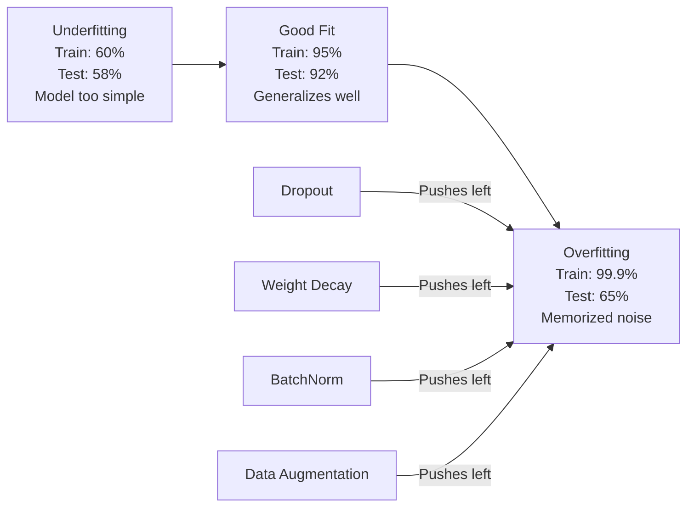
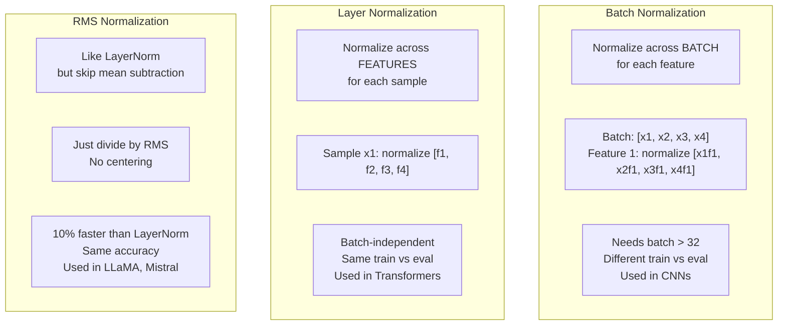
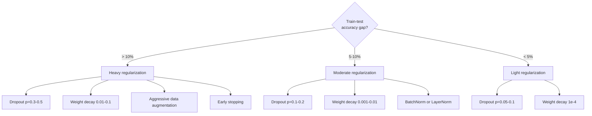

# Regularization

> 你的模型在训练集上拿到 99%，在测试集上只有 60%。它是在背答案，不是在学习。Regularization 就是你向复杂度征收的税，逼着模型去泛化。

**Type:** Build
**Languages:** Python
**Prerequisites:** Lesson 03.06 (Optimizers)
**Time:** ~75 minutes

## Learning Objectives

- 从零实现带有 inverted scaling 的 dropout、L2 weight decay、batch normalization、layer normalization 和 RMSNorm
- 度量训练集与测试集之间的准确率差距，并通过正则化实验诊断过拟合
- 解释为什么 transformer 用 LayerNorm 而非 BatchNorm，以及为什么现代 LLM 偏爱 RMSNorm
- 根据过拟合的严重程度组合使用合适的正则化技术

## The Problem

参数足够多的神经网络可以背下任何数据集。这不是空想，Zhang 等人 (2017) 在 ImageNet 上用随机标签训练标准网络，证明了这一点。网络在完全随机的标签分配上达到了接近零的训练损失，等于把一百万个毫无规律可循的输入-输出对硬背了下来。训练损失完美无瑕，测试准确率却是零。

这就是过拟合问题，而且模型越大问题越严重。GPT-3 有 1750 亿参数，训练集大约有 5000 亿 token。在这个量级下，模型有足够的容量把训练数据中相当大的片段一字不差地背下来。如果没有正则化，它就只会复读训练样本，而不是学到可泛化的规律。

训练表现和测试表现之间的差距就是 overfitting gap。本课的每种技术都从不同角度攻击这个差距。Dropout 强迫网络不依赖任何单个神经元。Weight decay 不让任何单个权重过分变大。Batch normalization 把损失曲面磨平，让优化器找到更平坦、更可泛化的极小值。Layer normalization 做同样的事，但能在 batch normalization 失效的场景下工作（小 batch、变长序列）。RMSNorm 通过省去均值计算把它做得快 10%。每种技术都很简单，但合在一起，就是一个会背书的模型和一个会泛化的模型之间的差别。

## The Concept

### The Overfitting Spectrum

每个模型都坐落在一条谱系上，从 underfitting（太简单，抓不住规律）到 overfitting（太复杂，连噪声都抓住了）。最佳点在两者之间，正则化把模型从过拟合一侧往这个最佳点上推。



### Dropout

最简单的正则化技术，却有最优雅的解释。在训练时，以概率 p 把每个神经元的输出随机置零。

```
output = activation(z) * mask    where mask[i] ~ Bernoulli(1 - p)
```

p = 0.5 时，每次前向传播都会有一半神经元被置零。网络必须学到冗余的表示，因为它没法预测哪些神经元会被保留。这避免了 co-adaptation，也就是某些神经元学会依赖另一些特定神经元同时存在的情况。

ensemble 解释：一个 N 个神经元的网络加上 dropout，等于构造了 2^N 个可能的子网络（每种神经元开/关组合都是一个子网络）。带 dropout 的训练近似地同时训练了所有 2^N 个子网络，每个子网络见到不同的 mini-batch。测试时启用全部神经元（不再 dropout），并把输出乘以 (1 - p) 以匹配训练时的期望值。这相当于对 2^N 个子网络的预测做平均，从单个模型里得到一个庞大的 ensemble。

实践中，把缩放放到训练时而不是测试时（inverted dropout）：

```
During training:  output = activation(z) * mask / (1 - p)
During testing:   output = activation(z)   (no change needed)
```

这样更干净，因为测试代码完全不需要知道 dropout 的存在。

默认取值：transformer 用 p = 0.1，MLP 用 p = 0.5，CNN 用 p = 0.2-0.3。dropout 越高 = 正则化越强 = 欠拟合风险越大。

### Weight Decay (L2 Regularization)

把所有权重的平方和加进损失函数：

```
total_loss = task_loss + (lambda / 2) * sum(w_i^2)
```

正则项的梯度是 lambda * w。也就是说每一步都会让每个权重朝零收缩，收缩比例与其大小成正比。大权重被惩罚得更重。模型被推向那种没有任何单个权重一家独大的解。

为什么这样能改善泛化：过拟合的模型往往有很大的权重，把训练数据中的噪声放大。Weight decay 让权重保持小，限制了模型的有效容量，逼它依赖鲁棒、可泛化的特征，而不是死记硬背的怪癖。

lambda 这个超参数控制强度。常见取值：

- transformer 上跑 AdamW 用 0.01
- CNN 上跑 SGD 用 1e-4
- 严重过拟合的模型用 0.1

正如 lesson 06 讨论过的：weight decay 和 L2 regularization 在 SGD 下是等价的，但在 Adam 下不等价。用 Adam 训练时，永远选 AdamW（解耦的 weight decay）。

### Batch Normalization

把每一层的输出在 mini-batch 维度上做归一化，再传给下一层。

对某一层 mini-batch 的激活：

```
mu = (1/B) * sum(x_i)           (batch mean)
sigma^2 = (1/B) * sum((x_i - mu)^2)   (batch variance)
x_hat = (x_i - mu) / sqrt(sigma^2 + eps)   (normalize)
y = gamma * x_hat + beta        (scale and shift)
```

gamma 和 beta 是可学习参数，让网络在最优时能把归一化抵消掉。如果没有它们，你就强行把每一层输出固定成零均值单位方差，这未必是网络想要的。

**Training vs inference split:** 训练时，mu 和 sigma 来自当前的 mini-batch；推理时，使用训练过程中累计的滑动平均（指数滑动平均，momentum = 0.1，意味着 90% 旧值 + 10% 新值）。

为什么 BatchNorm 起效至今仍有争议。原论文宣称是因为它减少了 "internal covariate shift"（前面的层更新时，后面层输入的分布会随之变化）。Santurkar 等人 (2018) 证明这个解释是错的。真正的原因是：BatchNorm 让损失曲面变得更光滑。梯度更具预测性，Lipschitz 常数更小，优化器可以放心地走更大的步子。这就是为什么 BatchNorm 允许更高的 learning rate 并加快收敛。

BatchNorm 有个根本的局限：它依赖 batch 的统计量。batch size 等于 1 时，均值和方差毫无意义；batch size 小于 32 时，统计量噪声很大，反而损害性能。这在目标检测（显存限制 batch size）和语言建模（序列长度变化）这类任务中尤为关键。

### Layer Normalization

不在 batch 维度上归一化，而是在 feature 维度上归一化。对单个样本：

```
mu = (1/D) * sum(x_j)           (feature mean)
sigma^2 = (1/D) * sum((x_j - mu)^2)   (feature variance)
x_hat = (x_j - mu) / sqrt(sigma^2 + eps)
y = gamma * x_hat + beta
```

D 是 feature 维度。每个样本独立归一化，不依赖 batch size。这就是为什么 transformer 用 LayerNorm 而不是 BatchNorm。序列长度可变，batch size 通常很小（生成时甚至是 1），训练和推理时的计算完全一致。

transformer 中的 LayerNorm 要么放在每个 self-attention block 和每个 feed-forward block 之后（Post-LN），要么放在它们之前（Pre-LN，训练更稳定）。

### RMSNorm

去掉均值减法的 LayerNorm。由 Zhang & Sennrich (2019) 提出。

```
rms = sqrt((1/D) * sum(x_j^2))
y = gamma * x / rms
```

就这样。没有均值计算，也没有 beta 参数。观察到的现象是：LayerNorm 中的 re-centering（减均值）对模型性能贡献极小，却消耗算力。去掉它可以在保持同等准确率的前提下节省约 10% 的开销。

LLaMA、LLaMA 2、LLaMA 3、Mistral 以及大多数现代 LLM 都用 RMSNorm 取代 LayerNorm。在百亿参数、万亿 token 的规模上，10% 的节省非常可观。

### Normalization Comparison



### Data Augmentation as Regularization

这不是改模型，而是改数据。在保持标签不变的前提下变换训练输入：

- 图像：random crop、flip、rotation、color jitter、cutout
- 文本：同义词替换、回译、随机删词
- 音频：变速、变调、加噪

效果与正则化等价：它扩大了训练集的有效规模，让模型更难背下具体样本。一张图只见到原始版本一次的模型可以把它背下来，但每张图见到 50 个增强版本的模型只能去学其中不变的结构。

### Early Stopping

最简单的正则化器：当 validation loss 开始上升时停止训练。在那一刻，模型还没过拟合。实践中，每个 epoch 跟踪 validation loss，保存最佳模型，然后再训练一个 "patience" 窗口（通常 5-20 个 epoch）。如果在 patience 窗口内 validation loss 没有进一步改善，就停下来加载之前保存的最佳模型。

### When to Apply What



## Build It

### Step 1: Dropout (Train and Eval Mode)

```python
import random
import math


class Dropout:
    def __init__(self, p=0.5):
        self.p = p
        self.training = True
        self.mask = None

    def forward(self, x):
        if not self.training:
            return list(x)
        self.mask = []
        output = []
        for val in x:
            if random.random() < self.p:
                self.mask.append(0)
                output.append(0.0)
            else:
                self.mask.append(1)
                output.append(val / (1 - self.p))
        return output

    def backward(self, grad_output):
        grads = []
        for g, m in zip(grad_output, self.mask):
            if m == 0:
                grads.append(0.0)
            else:
                grads.append(g / (1 - self.p))
        return grads
```

### Step 2: L2 Weight Decay

```python
def l2_regularization(weights, lambda_reg):
    penalty = 0.0
    for w in weights:
        penalty += w * w
    return lambda_reg * 0.5 * penalty

def l2_gradient(weights, lambda_reg):
    return [lambda_reg * w for w in weights]
```

### Step 3: Batch Normalization

```python
class BatchNorm:
    def __init__(self, num_features, momentum=0.1, eps=1e-5):
        self.gamma = [1.0] * num_features
        self.beta = [0.0] * num_features
        self.eps = eps
        self.momentum = momentum
        self.running_mean = [0.0] * num_features
        self.running_var = [1.0] * num_features
        self.training = True
        self.num_features = num_features

    def forward(self, batch):
        batch_size = len(batch)
        if self.training:
            mean = [0.0] * self.num_features
            for sample in batch:
                for j in range(self.num_features):
                    mean[j] += sample[j]
            mean = [m / batch_size for m in mean]

            var = [0.0] * self.num_features
            for sample in batch:
                for j in range(self.num_features):
                    var[j] += (sample[j] - mean[j]) ** 2
            var = [v / batch_size for v in var]

            for j in range(self.num_features):
                self.running_mean[j] = (1 - self.momentum) * self.running_mean[j] + self.momentum * mean[j]
                self.running_var[j] = (1 - self.momentum) * self.running_var[j] + self.momentum * var[j]
        else:
            mean = list(self.running_mean)
            var = list(self.running_var)

        self.x_hat = []
        output = []
        for sample in batch:
            normalized = []
            out_sample = []
            for j in range(self.num_features):
                x_h = (sample[j] - mean[j]) / math.sqrt(var[j] + self.eps)
                normalized.append(x_h)
                out_sample.append(self.gamma[j] * x_h + self.beta[j])
            self.x_hat.append(normalized)
            output.append(out_sample)
        return output
```

### Step 4: Layer Normalization

```python
class LayerNorm:
    def __init__(self, num_features, eps=1e-5):
        self.gamma = [1.0] * num_features
        self.beta = [0.0] * num_features
        self.eps = eps
        self.num_features = num_features

    def forward(self, x):
        mean = sum(x) / len(x)
        var = sum((xi - mean) ** 2 for xi in x) / len(x)

        self.x_hat = []
        output = []
        for j in range(self.num_features):
            x_h = (x[j] - mean) / math.sqrt(var + self.eps)
            self.x_hat.append(x_h)
            output.append(self.gamma[j] * x_h + self.beta[j])
        return output
```

### Step 5: RMSNorm

```python
class RMSNorm:
    def __init__(self, num_features, eps=1e-6):
        self.gamma = [1.0] * num_features
        self.eps = eps
        self.num_features = num_features

    def forward(self, x):
        rms = math.sqrt(sum(xi * xi for xi in x) / len(x) + self.eps)
        output = []
        for j in range(self.num_features):
            output.append(self.gamma[j] * x[j] / rms)
        return output
```

### Step 6: Training With and Without Regularization

```python
def sigmoid(x):
    x = max(-500, min(500, x))
    return 1.0 / (1.0 + math.exp(-x))


def make_circle_data(n=200, seed=42):
    random.seed(seed)
    data = []
    for _ in range(n):
        x = random.uniform(-2, 2)
        y = random.uniform(-2, 2)
        label = 1.0 if x * x + y * y < 1.5 else 0.0
        data.append(([x, y], label))
    return data


class RegularizedNetwork:
    def __init__(self, hidden_size=16, lr=0.05, dropout_p=0.0, weight_decay=0.0):
        random.seed(0)
        self.hidden_size = hidden_size
        self.lr = lr
        self.dropout_p = dropout_p
        self.weight_decay = weight_decay
        self.dropout = Dropout(p=dropout_p) if dropout_p > 0 else None

        self.w1 = [[random.gauss(0, 0.5) for _ in range(2)] for _ in range(hidden_size)]
        self.b1 = [0.0] * hidden_size
        self.w2 = [random.gauss(0, 0.5) for _ in range(hidden_size)]
        self.b2 = 0.0

    def forward(self, x, training=True):
        self.x = x
        self.z1 = []
        self.h = []
        for i in range(self.hidden_size):
            z = self.w1[i][0] * x[0] + self.w1[i][1] * x[1] + self.b1[i]
            self.z1.append(z)
            self.h.append(max(0.0, z))

        if self.dropout and training:
            self.dropout.training = True
            self.h = self.dropout.forward(self.h)
        elif self.dropout:
            self.dropout.training = False
            self.h = self.dropout.forward(self.h)

        self.z2 = sum(self.w2[i] * self.h[i] for i in range(self.hidden_size)) + self.b2
        self.out = sigmoid(self.z2)
        return self.out

    def backward(self, target):
        eps = 1e-15
        p = max(eps, min(1 - eps, self.out))
        d_loss = -(target / p) + (1 - target) / (1 - p)
        d_sigmoid = self.out * (1 - self.out)
        d_out = d_loss * d_sigmoid

        for i in range(self.hidden_size):
            d_relu = 1.0 if self.z1[i] > 0 else 0.0
            d_h = d_out * self.w2[i] * d_relu
            self.w2[i] -= self.lr * (d_out * self.h[i] + self.weight_decay * self.w2[i])
            for j in range(2):
                self.w1[i][j] -= self.lr * (d_h * self.x[j] + self.weight_decay * self.w1[i][j])
            self.b1[i] -= self.lr * d_h
        self.b2 -= self.lr * d_out

    def evaluate(self, data):
        correct = 0
        total_loss = 0.0
        for x, y in data:
            pred = self.forward(x, training=False)
            eps = 1e-15
            p = max(eps, min(1 - eps, pred))
            total_loss += -(y * math.log(p) + (1 - y) * math.log(1 - p))
            if (pred >= 0.5) == (y >= 0.5):
                correct += 1
        return total_loss / len(data), correct / len(data) * 100

    def train_model(self, train_data, test_data, epochs=300):
        history = []
        for epoch in range(epochs):
            total_loss = 0.0
            correct = 0
            for x, y in train_data:
                pred = self.forward(x, training=True)
                self.backward(y)
                eps = 1e-15
                p = max(eps, min(1 - eps, pred))
                total_loss += -(y * math.log(p) + (1 - y) * math.log(1 - p))
                if (pred >= 0.5) == (y >= 0.5):
                    correct += 1
            train_loss = total_loss / len(train_data)
            train_acc = correct / len(train_data) * 100
            test_loss, test_acc = self.evaluate(test_data)
            history.append((train_loss, train_acc, test_loss, test_acc))
            if epoch % 75 == 0 or epoch == epochs - 1:
                gap = train_acc - test_acc
                print(f"    Epoch {epoch:3d}: train_acc={train_acc:.1f}%, test_acc={test_acc:.1f}%, gap={gap:.1f}%")
        return history
```

## Use It

PyTorch 把所有归一化和正则化都封装成了模块：

```python
import torch
import torch.nn as nn

model = nn.Sequential(
    nn.Linear(784, 256),
    nn.BatchNorm1d(256),
    nn.ReLU(),
    nn.Dropout(0.3),
    nn.Linear(256, 128),
    nn.BatchNorm1d(128),
    nn.ReLU(),
    nn.Dropout(0.3),
    nn.Linear(128, 10),
)

model.train()
out_train = model(torch.randn(32, 784))

model.eval()
out_test = model(torch.randn(1, 784))
```

`model.train()` / `model.eval()` 这个开关至关重要。它会切换 dropout 的开/关，并告诉 BatchNorm 是用 batch 统计量还是 running 统计量。在推理前忘了调用 `model.eval()` 是深度学习中最常见的 bug 之一。你的测试准确率会随机抖动，因为 dropout 还在工作，BatchNorm 还在用 mini-batch 统计量。

对 transformer 来说，模式不同：

```python
class TransformerBlock(nn.Module):
    def __init__(self, d_model=512, nhead=8, dropout=0.1):
        super().__init__()
        self.attention = nn.MultiheadAttention(d_model, nhead, dropout=dropout)
        self.norm1 = nn.LayerNorm(d_model)
        self.ff = nn.Sequential(
            nn.Linear(d_model, d_model * 4),
            nn.GELU(),
            nn.Linear(d_model * 4, d_model),
            nn.Dropout(dropout),
        )
        self.norm2 = nn.LayerNorm(d_model)
        self.dropout = nn.Dropout(dropout)

    def forward(self, x):
        attended, _ = self.attention(x, x, x)
        x = self.norm1(x + self.dropout(attended))
        x = self.norm2(x + self.ff(x))
        return x
```

LayerNorm，不是 BatchNorm。Dropout p=0.1，不是 p=0.5。这些就是 transformer 的默认配置。

## Ship It

本课产出：
- `outputs/prompt-regularization-advisor.md` —— 一个用于诊断过拟合并推荐合适正则化策略的 prompt

## Exercises

1. 为 2D 数据实现 spatial dropout：不丢弃单个神经元，而是丢弃整个 feature channel。把若干连续 feature 视作一个 channel，整组一起丢，以此模拟。在 hidden_size=32 的 circle 数据集上对比标准 dropout 的训练-测试差距。

2. 把 lesson 05 的 label smoothing 与本课的 dropout 结合。用四种配置训练：都不开、只 dropout、只 label smoothing、两者都开。度量每种配置最终的训练-测试准确率差距。哪种组合差距最小？

3. 在 circle 数据集网络中，在隐藏层和激活函数之间插入一个 BatchNorm 层。用 0.01、0.05、0.1 三种 learning rate，分别在有/无 BatchNorm 的情况下训练。BatchNorm 应能让原本会发散的高 learning rate 也稳定收敛。

4. 实现 early stopping：每个 epoch 跟踪测试损失，保存最佳权重，如果 20 个 epoch 内测试损失没有改善就停止。把正则化网络跑 1000 epoch。报告最佳测试准确率出现在哪个 epoch，以及你节省了多少 epoch 的计算量。

5. 在一个 4 层（不只是 2 层）网络上对比 LayerNorm 和 RMSNorm。两者用相同初始权重。训练 200 epoch，对比最终准确率、训练速度（每个 epoch 的时间）以及第一层的梯度大小。验证 RMSNorm 在保持同等准确率的前提下确实更快。

## Key Terms

| Term | What people say | What it actually means |
|------|----------------|----------------------|
| Overfitting | "模型把数据背下来了" | 模型的训练表现显著超过测试表现，说明它学的是噪声而不是信号 |
| Regularization | "防过拟合" | 任何为提升泛化能力而约束模型复杂度的技术：dropout、weight decay、normalization、augmentation |
| Dropout | "随机删神经元" | 训练时以概率 p 把随机神经元置零，逼出冗余表示；等价于训练一个 ensemble |
| Weight decay | "L2 惩罚" | 每步通过减去 lambda * w 把所有权重朝零收缩；通过权重大小惩罚复杂度 |
| Batch normalization | "按 batch 归一化" | 用 batch 维度的统计量在训练时归一化层输出，推理时使用 running 平均 |
| Layer normalization | "按样本归一化" | 在每个样本内部跨 feature 做归一化；与 batch 无关，用在 batch size 多变的 transformer 中 |
| RMSNorm | "去掉均值的 LayerNorm" | Root mean square 归一化；从 LayerNorm 中去掉减均值步骤，准确率不变但快 10% |
| Early stopping | "在过拟合前停下" | 当 validation loss 不再改善时停止训练；最简单的正则化器，常与其他方法搭配使用 |
| Data augmentation | "用更少数据造更多数据" | 变换训练输入（flip、crop、加噪）以扩大有效数据集规模并强制学习不变性 |
| Generalization gap | "训练-测试差距" | 训练表现与测试表现之间的差距；正则化的目标就是把这个差距压小 |

## Further Reading

- Srivastava et al., "Dropout: A Simple Way to Prevent Neural Networks from Overfitting" (2014) —— 原始的 dropout 论文，提出了 ensemble 解释并做了大量实验
- Ioffe & Szegedy, "Batch Normalization: Accelerating Deep Network Training by Reducing Internal Covariate Shift" (2015) —— 提出 BatchNorm 及其训练流程，是被引最多的深度学习论文之一
- Zhang & Sennrich, "Root Mean Square Layer Normalization" (2019) —— 证明 RMSNorm 在更少计算量下能匹配 LayerNorm 的准确率，被 LLaMA 和 Mistral 采用
- Zhang et al., "Understanding Deep Learning Requires Rethinking Generalization" (2017) —— 里程碑式的论文，证明神经网络可以记住随机标签，挑战了传统的泛化观念
