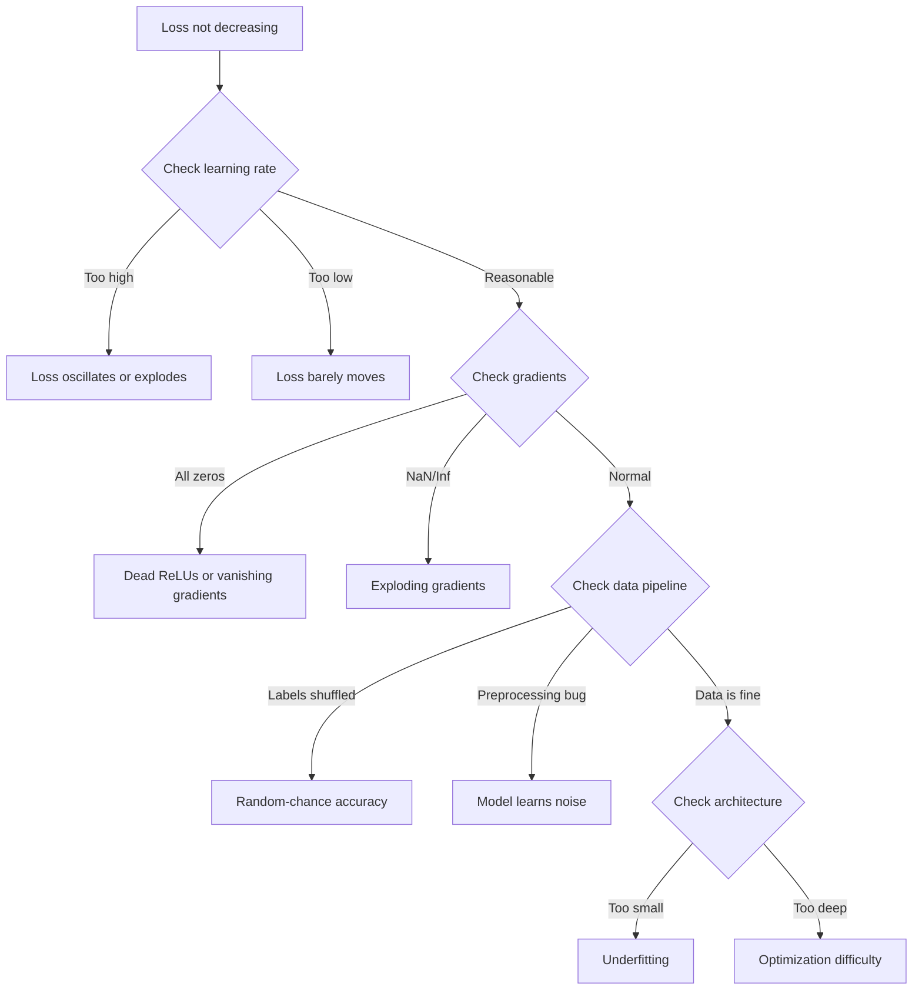
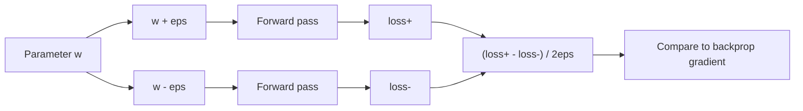
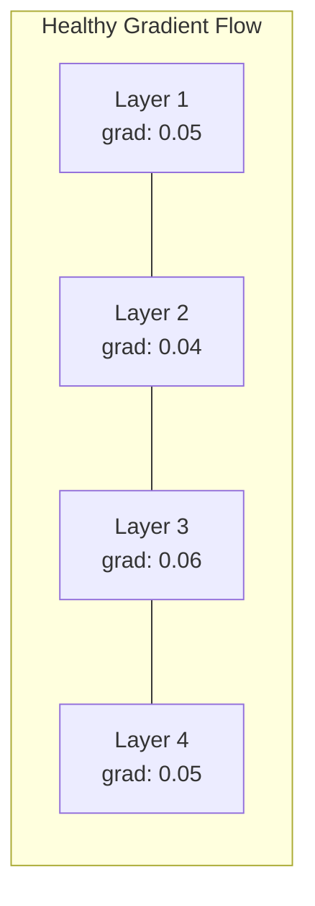
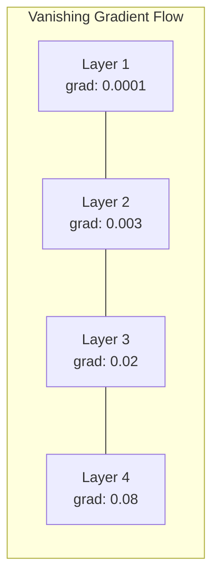
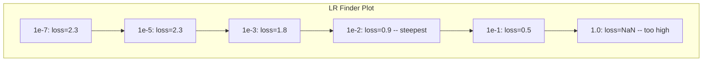

# Debugging Neural Networks

> 你的网络编译通过了，跑起来了，输出了一个数字。那个数字是错的，可什么也没崩。欢迎来到最难的一类调试 —— 没有错误信息的那种。

**Type:** Practice
**Languages:** Python, PyTorch
**Prerequisites:** Phase 03 Lessons 01-10（尤其是 backpropagation、loss functions、optimizers）
**Time:** ~90 分钟

## Learning Objectives

- 用系统化的调试策略诊断常见的神经网络故障（NaN loss、loss 曲线扁平、overfitting、震荡）
- 运用 "overfit one batch" 技巧来验证你的模型架构和训练循环是正确的
- 检查 gradient 量级、activation 分布以及 weight norm，识别 vanishing/exploding gradient 问题
- 建立一份覆盖 data pipeline、模型架构、loss function、optimizer 和 learning rate 的调试清单

## The Problem

传统软件坏了会崩溃。空指针抛异常，类型不匹配在编译期失败，差一错误产生明显错误的输出。

神经网络可不会给你这种待遇。

一个坏掉的神经网络会跑完整个流程，打印出一个 loss 值，输出预测结果。loss 也许在下降，预测看起来也像那么回事，但模型其实是悄无声息地错了 —— 它在学捷径、记噪声，或者收敛到一个毫无用处的局部极小。Google 的研究人员估计，60-70% 的 ML 调试时间花在这种不报错却拖垮模型质量的 "silent" bug 上。

能跑的模型和坏掉的模型，差距常常只是一行错位的代码：少了 `zero_grad()`、维度转置反了、learning rate 偏了 10 倍。经典的 "Recipe for Training Neural Networks"（2019）开篇就说："The most common neural net mistakes are bugs that don't crash."

这节课就是教你怎么找这些 bug。

## The Concept

### The Debugging Mindset

别再 print-and-pray 了。神经网络调试需要系统化方法，因为反馈环很慢（每次训练几分钟到几小时），而症状又是模糊的（loss 不好可以代表 20 种不同的问题）。

黄金法则：**从最简单的开始，一次只增加一处复杂度，并独立验证每一处。**



### Symptom 1: Loss Not Decreasing

这是最常见的抱怨。训练循环跑着、epoch 一个接一个过，loss 却纹丝不动或剧烈震荡。

**Wrong learning rate.** 太高：loss 震荡或飙到 NaN。太低：loss 下降得慢到看起来像没动。Adam 从 1e-3 起步，SGD 从 1e-1 或 1e-2 起步。在断定是别的问题之前，先尝试三个跨度为 10 倍的 learning rate（例如 1e-2、1e-3、1e-4）。

**Dead ReLUs.** 如果一个 ReLU 神经元收到很大的负值输入，它就输出 0、gradient 也是 0，从此再也不激活。死掉的神经元一多，网络就学不动。检查方法：在每个 ReLU 层之后打印恰好为 0 的 activation 比例。如果 >50% 都死了，换成 LeakyReLU 或者降低 learning rate。

**Vanishing gradients.** 在使用 sigmoid 或 tanh 的深层网络中，gradient 在反向传播时呈指数级缩小。等它们传到第一层时已经接近 0，前面几层就停止学习了。修复方法：用 ReLU/GELU、加入 residual connection，或者使用 batch normalization。

**Exploding gradients.** 反过来的问题 —— gradient 呈指数级增长。在 RNN 和很深的网络中常见，loss 跳到 NaN。修复方法：gradient clipping（`torch.nn.utils.clip_grad_norm_`）、降低 learning rate，或者加入归一化。

### Symptom 2: Loss Decreasing But Model is Bad

loss 在下降，training accuracy 冲到 99%，但 test accuracy 只有 55%。或者模型在真实数据上输出胡言乱语。

**Overfitting.** 模型在背训练数据，没在学规律。training loss 和 validation loss 之间的差距随时间变大。修复方法：更多数据、dropout、weight decay、early stopping、data augmentation。

**Data leakage.** test 数据漏到了训练里，accuracy 高得可疑。常见原因：先 shuffle 再切分、用整个数据集的统计量做预处理、跨 split 出现重复样本。修复方法：先切分再预处理，并检查重复。

**Label errors.** 大多数真实数据集里，5-10% 的标签是错的（Northcutt et al., 2021 —— "Pervasive Label Errors in Test Sets"）。模型学的是噪声。修复方法：用 confident learning 找出并修正错标样本，或者用 loss truncation 忽略 loss 极高的样本。

### Symptom 3: NaN or Inf in Loss

loss 变成 `nan` 或 `inf`，训练就此完蛋。

**Learning rate too high.** gradient update 跨度太大，权重炸了。修复方法：降低 10 倍。

**log(0) or log(negative).** Cross-entropy loss 要算 `log(p)`。如果模型输出恰好是 0 或负的概率，log 就爆了。修复方法：把预测值 clamp 到 `[eps, 1-eps]`，其中 `eps=1e-7`。

**Division by zero.** Batch normalization 要除以标准差。如果一个 batch 全是常数，std=0。修复方法：在分母上加 epsilon（PyTorch 默认会加，但自定义实现可能不会）。

**Numerical overflow.** 大的 activation 喂进 `exp()` 会变 Inf。Softmax 尤其容易翻车。修复方法：在指数运算前减去最大值（log-sum-exp 技巧）。

### Technique 1: Gradient Checking

把你的解析 gradient（来自 backprop）和数值 gradient（来自有限差分）比一比。两者不一致，说明你的 backward pass 有 bug。

参数 `w` 的数值 gradient：

```
grad_numerical = (loss(w + eps) - loss(w - eps)) / (2 * eps)
```

一致性度量（相对差异）：

```
rel_diff = |grad_analytical - grad_numerical| / max(|grad_analytical|, |grad_numerical|, 1e-8)
```

`rel_diff < 1e-5`：正确。`rel_diff > 1e-3`：基本可以确定有 bug。



### Technique 2: Activation Statistics

训练过程中监控每层 activation 的均值和标准差。健康的网络会让 activation 保持均值接近 0、标准差接近 1（归一化之后），起码也是有界的。

| Health indicator | Mean | Std | Diagnosis |
|-----------------|------|-----|-----------|
| Healthy | ~0 | ~1 | Network is learning normally |
| Saturated | >>0 or <<0 | ~0 | Activations stuck at extreme values |
| Dead | 0 | 0 | Neurons are dead (all zeros) |
| Exploding | >>10 | >>10 | Activations growing without bound |

### Technique 3: Gradient Flow Visualization

把每一层的平均 gradient 量级画出来。健康的网络里，各层 gradient 量级应当大致相当。如果前几层 gradient 比后几层小 1000 倍，那就是 vanishing gradients。





### Technique 4: The Overfit-One-Batch Test

深度学习里最重要的一种调试手段，没有之一。

取一个小 batch（8-32 个样本），在它上面训练 100+ 步。loss 应该几乎归零、training accuracy 应该达到 100%。如果做不到，你的模型或训练循环就有根本性的 bug —— 不要再去跑完整训练。

这一测试能抓出：
- 坏掉的 loss function
- 坏掉的 backward pass
- 容量小到根本表达不了数据的架构
- optimizer 没和模型参数挂上钩
- 数据和标签对不上号

跑一次 30 秒，能省下数小时调试完整训练的时间。

### Technique 5: Learning Rate Finder

Leslie Smith（2017）提出在一个 epoch 内把 learning rate 从极小（1e-7）扫到极大（10），同时记录 loss。把 loss 对 learning rate 画出来。最优 learning rate 大约比 loss 下降最快的那个 rate 小一个数量级。



这个例子里最好的 LR 大约是 ~1e-3（比下降最陡那一点小一个数量级）。

### Common PyTorch Bugs

下面这些 bug 在 PyTorch 社区耗掉的总时间最多：

| Bug | Symptom | Fix |
|-----|---------|-----|
| Forgetting `optimizer.zero_grad()` | Gradients accumulate across batches, loss oscillates | Add `optimizer.zero_grad()` before `loss.backward()` |
| Forgetting `model.eval()` at test time | Dropout and batch norm behave differently, test accuracy varies between runs | Add `model.eval()` and `torch.no_grad()` |
| Wrong tensor shapes | Silent broadcasting produces wrong results, no error | Print shapes after every operation during debugging |
| CPU/GPU mismatch | `RuntimeError: expected CUDA tensor` | Use `.to(device)` on model AND data |
| Not detaching tensors | Computation graph grows forever, OOM | Use `.detach()` or `with torch.no_grad()` |
| In-place operations breaking autograd | `RuntimeError: modified by in-place operation` | Replace `x += 1` with `x = x + 1` |
| Data not normalized | Loss stuck at random-chance level | Normalize inputs to mean=0, std=1 |
| Labels as wrong dtype | Cross-entropy expects `Long`, got `Float` | Cast labels: `labels.long()` |

### The Master Debugging Table

| Symptom | Likely cause | First thing to try |
|---------|-------------|-------------------|
| Loss stuck at -log(1/num_classes) | Model predicting uniform distribution | Check data pipeline, verify labels match inputs |
| Loss NaN after a few steps | Learning rate too high | Reduce LR by 10x |
| Loss NaN immediately | log(0) or division by zero | Add epsilon to log/division operations |
| Loss oscillating wildly | LR too high or batch size too small | Reduce LR, increase batch size |
| Loss decreasing then plateaus | LR too high for fine-tuning phase | Add LR schedule (cosine or step decay) |
| Training acc high, test acc low | Overfitting | Add dropout, weight decay, more data |
| Training acc = test acc = chance | Model not learning anything | Run overfit-one-batch test |
| Training acc = test acc but both low | Underfitting | Bigger model, more layers, more features |
| Gradients all zero | Dead ReLUs or detached computation graph | Switch to LeakyReLU, check `.requires_grad` |
| Out of memory during training | Batch too large or graph not freed | Reduce batch size, use `torch.no_grad()` for eval |

## Build It

一个能监控 activation、gradient 和 loss 曲线的诊断工具箱。你会故意把网络弄坏，然后用这个工具箱诊断每一种问题。

### Step 1: The NetworkDebugger Class

挂钩到 PyTorch 模型上，逐层记录 activation 和 gradient 统计量。

```python
import torch
import torch.nn as nn
import math


class NetworkDebugger:
    def __init__(self, model):
        self.model = model
        self.activation_stats = {}
        self.gradient_stats = {}
        self.loss_history = []
        self.lr_losses = []
        self.hooks = []
        self._register_hooks()

    def _register_hooks(self):
        for name, module in self.model.named_modules():
            if isinstance(module, (nn.Linear, nn.Conv2d, nn.ReLU, nn.LeakyReLU)):
                hook = module.register_forward_hook(self._make_activation_hook(name))
                self.hooks.append(hook)
                hook = module.register_full_backward_hook(self._make_gradient_hook(name))
                self.hooks.append(hook)

    def _make_activation_hook(self, name):
        def hook(module, input, output):
            with torch.no_grad():
                out = output.detach().float()
                self.activation_stats[name] = {
                    "mean": out.mean().item(),
                    "std": out.std().item(),
                    "fraction_zero": (out == 0).float().mean().item(),
                    "min": out.min().item(),
                    "max": out.max().item(),
                }
        return hook

    def _make_gradient_hook(self, name):
        def hook(module, grad_input, grad_output):
            if grad_output[0] is not None:
                with torch.no_grad():
                    grad = grad_output[0].detach().float()
                    self.gradient_stats[name] = {
                        "mean": grad.mean().item(),
                        "std": grad.std().item(),
                        "abs_mean": grad.abs().mean().item(),
                        "max": grad.abs().max().item(),
                    }
        return hook

    def record_loss(self, loss_value):
        self.loss_history.append(loss_value)

    def check_loss_health(self):
        if len(self.loss_history) < 2:
            return "NOT_ENOUGH_DATA"
        recent = self.loss_history[-10:]
        if any(math.isnan(v) or math.isinf(v) for v in recent):
            return "NAN_OR_INF"
        if len(self.loss_history) >= 20:
            first_half = sum(self.loss_history[:10]) / 10
            second_half = sum(self.loss_history[-10:]) / 10
            if second_half >= first_half * 0.99:
                return "NOT_DECREASING"
        if len(recent) >= 5:
            diffs = [recent[i+1] - recent[i] for i in range(len(recent)-1)]
            if max(diffs) - min(diffs) > 2 * abs(sum(diffs) / len(diffs)):
                return "OSCILLATING"
        return "HEALTHY"

    def check_activations(self):
        issues = []
        for name, stats in self.activation_stats.items():
            if stats["fraction_zero"] > 0.5:
                issues.append(f"DEAD_NEURONS: {name} has {stats['fraction_zero']:.0%} zero activations")
            if abs(stats["mean"]) > 10:
                issues.append(f"EXPLODING_ACTIVATIONS: {name} mean={stats['mean']:.2f}")
            if stats["std"] < 1e-6:
                issues.append(f"COLLAPSED_ACTIVATIONS: {name} std={stats['std']:.2e}")
        return issues if issues else ["HEALTHY"]

    def check_gradients(self):
        issues = []
        grad_magnitudes = []
        for name, stats in self.gradient_stats.items():
            grad_magnitudes.append((name, stats["abs_mean"]))
            if stats["abs_mean"] < 1e-7:
                issues.append(f"VANISHING_GRADIENT: {name} abs_mean={stats['abs_mean']:.2e}")
            if stats["abs_mean"] > 100:
                issues.append(f"EXPLODING_GRADIENT: {name} abs_mean={stats['abs_mean']:.2e}")
        if len(grad_magnitudes) >= 2:
            first_mag = grad_magnitudes[0][1]
            last_mag = grad_magnitudes[-1][1]
            if last_mag > 0 and first_mag / last_mag > 100:
                issues.append(f"GRADIENT_RATIO: first/last = {first_mag/last_mag:.0f}x (vanishing)")
        return issues if issues else ["HEALTHY"]

    def print_report(self):
        print("\n=== NETWORK DEBUGGER REPORT ===")
        print(f"\nLoss health: {self.check_loss_health()}")
        if self.loss_history:
            print(f"  Last 5 losses: {[f'{v:.4f}' for v in self.loss_history[-5:]]}")
        print("\nActivation diagnostics:")
        for item in self.check_activations():
            print(f"  {item}")
        print("\nGradient diagnostics:")
        for item in self.check_gradients():
            print(f"  {item}")
        print("\nPer-layer activation stats:")
        for name, stats in self.activation_stats.items():
            print(f"  {name}: mean={stats['mean']:.4f} std={stats['std']:.4f} zero={stats['fraction_zero']:.1%}")
        print("\nPer-layer gradient stats:")
        for name, stats in self.gradient_stats.items():
            print(f"  {name}: abs_mean={stats['abs_mean']:.2e} max={stats['max']:.2e}")

    def remove_hooks(self):
        for hook in self.hooks:
            hook.remove()
        self.hooks.clear()
```

### Step 2: The Overfit-One-Batch Test

```python
def overfit_one_batch(model, x_batch, y_batch, criterion, lr=0.01, steps=200):
    optimizer = torch.optim.Adam(model.parameters(), lr=lr)
    model.train()
    print("\n=== OVERFIT ONE BATCH TEST ===")
    print(f"Batch size: {x_batch.shape[0]}, Steps: {steps}")

    for step in range(steps):
        optimizer.zero_grad()
        output = model(x_batch)
        loss = criterion(output, y_batch)
        loss.backward()
        optimizer.step()

        if step % 50 == 0 or step == steps - 1:
            with torch.no_grad():
                preds = (output > 0).float() if output.shape[-1] == 1 else output.argmax(dim=1)
                targets = y_batch if y_batch.dim() == 1 else y_batch.squeeze()
                acc = (preds.squeeze() == targets).float().mean().item()
            print(f"  Step {step:3d} | Loss: {loss.item():.6f} | Accuracy: {acc:.1%}")

    final_loss = loss.item()
    if final_loss > 0.1:
        print(f"\n  FAIL: Loss did not converge ({final_loss:.4f}). Model or training loop is broken.")
        return False
    print(f"\n  PASS: Loss converged to {final_loss:.6f}")
    return True
```

### Step 3: Learning Rate Finder

```python
def find_learning_rate(model, x_data, y_data, criterion, start_lr=1e-7, end_lr=10, steps=100):
    import copy
    original_state = copy.deepcopy(model.state_dict())
    optimizer = torch.optim.SGD(model.parameters(), lr=start_lr)
    lr_mult = (end_lr / start_lr) ** (1 / steps)

    model.train()
    results = []
    best_loss = float("inf")
    current_lr = start_lr

    print("\n=== LEARNING RATE FINDER ===")

    for step in range(steps):
        optimizer.zero_grad()
        output = model(x_data)
        loss = criterion(output, y_data)

        if math.isnan(loss.item()) or loss.item() > best_loss * 10:
            break

        best_loss = min(best_loss, loss.item())
        results.append((current_lr, loss.item()))

        loss.backward()
        optimizer.step()

        current_lr *= lr_mult
        for param_group in optimizer.param_groups:
            param_group["lr"] = current_lr

    model.load_state_dict(original_state)

    if len(results) < 10:
        print("  Could not complete LR sweep -- loss diverged too quickly")
        return results

    min_loss_idx = min(range(len(results)), key=lambda i: results[i][1])
    suggested_lr = results[max(0, min_loss_idx - 10)][0]

    print(f"  Swept {len(results)} steps from {start_lr:.0e} to {results[-1][0]:.0e}")
    print(f"  Minimum loss {results[min_loss_idx][1]:.4f} at lr={results[min_loss_idx][0]:.2e}")
    print(f"  Suggested learning rate: {suggested_lr:.2e}")

    return results
```

### Step 4: Gradient Checker

```python
def _flat_to_multi_index(flat_idx, shape):
    multi_idx = []
    remaining = flat_idx
    for dim in reversed(shape):
        multi_idx.insert(0, remaining % dim)
        remaining //= dim
    return tuple(multi_idx)


def gradient_check(model, x, y, criterion, eps=1e-4):
    model.train()
    x_double = x.double()
    y_double = y.double()
    model_double = model.double()

    print("\n=== GRADIENT CHECK ===")
    overall_max_diff = 0
    checked = 0

    for name, param in model_double.named_parameters():
        if not param.requires_grad:
            continue

        layer_max_diff = 0

        model_double.zero_grad()
        output = model_double(x_double)
        loss = criterion(output, y_double)
        loss.backward()
        analytical_grad = param.grad.clone()

        num_checks = min(5, param.numel())
        for i in range(num_checks):
            idx = _flat_to_multi_index(i, param.shape)
            original = param.data[idx].item()

            param.data[idx] = original + eps
            with torch.no_grad():
                loss_plus = criterion(model_double(x_double), y_double).item()

            param.data[idx] = original - eps
            with torch.no_grad():
                loss_minus = criterion(model_double(x_double), y_double).item()

            param.data[idx] = original

            numerical = (loss_plus - loss_minus) / (2 * eps)
            analytical = analytical_grad[idx].item()

            denom = max(abs(numerical), abs(analytical), 1e-8)
            rel_diff = abs(numerical - analytical) / denom

            layer_max_diff = max(layer_max_diff, rel_diff)
            checked += 1

        overall_max_diff = max(overall_max_diff, layer_max_diff)
        status = "OK" if layer_max_diff < 1e-5 else "MISMATCH"
        print(f"  {name}: max_rel_diff={layer_max_diff:.2e} [{status}]")

    model.float()

    print(f"\n  Checked {checked} parameters")
    if overall_max_diff < 1e-5:
        print("  PASS: Gradients match (rel_diff < 1e-5)")
    elif overall_max_diff < 1e-3:
        print("  WARN: Small differences (1e-5 < rel_diff < 1e-3)")
    else:
        print("  FAIL: Gradient mismatch detected (rel_diff > 1e-3)")
    return overall_max_diff
```

### Step 5: Deliberately Broken Networks

现在把工具箱用到几个坏掉的网络上，逐个诊断。

```python
def demo_broken_networks():
    torch.manual_seed(42)
    x = torch.randn(64, 10)
    y = (x[:, 0] > 0).long()

    print("\n" + "=" * 60)
    print("BUG 1: Learning rate too high (lr=10)")
    print("=" * 60)
    model1 = nn.Sequential(nn.Linear(10, 32), nn.ReLU(), nn.Linear(32, 2))
    debugger1 = NetworkDebugger(model1)
    optimizer1 = torch.optim.SGD(model1.parameters(), lr=10.0)
    criterion = nn.CrossEntropyLoss()
    for step in range(20):
        optimizer1.zero_grad()
        out = model1(x)
        loss = criterion(out, y)
        debugger1.record_loss(loss.item())
        loss.backward()
        optimizer1.step()
    debugger1.print_report()
    debugger1.remove_hooks()

    print("\n" + "=" * 60)
    print("BUG 2: Dead ReLUs from bad initialization")
    print("=" * 60)
    model2 = nn.Sequential(nn.Linear(10, 32), nn.ReLU(), nn.Linear(32, 32), nn.ReLU(), nn.Linear(32, 2))
    with torch.no_grad():
        for m in model2.modules():
            if isinstance(m, nn.Linear):
                m.weight.fill_(-1.0)
                m.bias.fill_(-5.0)
    debugger2 = NetworkDebugger(model2)
    optimizer2 = torch.optim.Adam(model2.parameters(), lr=1e-3)
    for step in range(50):
        optimizer2.zero_grad()
        out = model2(x)
        loss = criterion(out, y)
        debugger2.record_loss(loss.item())
        loss.backward()
        optimizer2.step()
    debugger2.print_report()
    debugger2.remove_hooks()

    print("\n" + "=" * 60)
    print("BUG 3: Missing zero_grad (gradients accumulate)")
    print("=" * 60)
    model3 = nn.Sequential(nn.Linear(10, 32), nn.ReLU(), nn.Linear(32, 2))
    debugger3 = NetworkDebugger(model3)
    optimizer3 = torch.optim.SGD(model3.parameters(), lr=0.01)
    for step in range(50):
        out = model3(x)
        loss = criterion(out, y)
        debugger3.record_loss(loss.item())
        loss.backward()
        optimizer3.step()
    debugger3.print_report()
    debugger3.remove_hooks()

    print("\n" + "=" * 60)
    print("HEALTHY NETWORK: Correct setup for comparison")
    print("=" * 60)
    model_good = nn.Sequential(nn.Linear(10, 32), nn.ReLU(), nn.Linear(32, 2))
    debugger_good = NetworkDebugger(model_good)
    optimizer_good = torch.optim.Adam(model_good.parameters(), lr=1e-3)
    for step in range(50):
        optimizer_good.zero_grad()
        out = model_good(x)
        loss = criterion(out, y)
        debugger_good.record_loss(loss.item())
        loss.backward()
        optimizer_good.step()
    debugger_good.print_report()
    debugger_good.remove_hooks()

    print("\n" + "=" * 60)
    print("OVERFIT-ONE-BATCH TEST (healthy model)")
    print("=" * 60)
    model_test = nn.Sequential(nn.Linear(10, 32), nn.ReLU(), nn.Linear(32, 2))
    overfit_one_batch(model_test, x[:8], y[:8], criterion)

    print("\n" + "=" * 60)
    print("LEARNING RATE FINDER")
    print("=" * 60)
    model_lr = nn.Sequential(nn.Linear(10, 32), nn.ReLU(), nn.Linear(32, 2))
    find_learning_rate(model_lr, x, y, criterion)

    print("\n" + "=" * 60)
    print("GRADIENT CHECK")
    print("=" * 60)
    model_grad = nn.Sequential(nn.Linear(10, 8), nn.ReLU(), nn.Linear(8, 2))
    gradient_check(model_grad, x[:4], y[:4], criterion)
```

## Use It

### PyTorch Built-in Tools

```python
import torch
import torch.nn as nn

model = nn.Sequential(
    nn.Linear(768, 256),
    nn.ReLU(),
    nn.Linear(256, 10),
)

with torch.autograd.detect_anomaly():
    output = model(input_tensor)
    loss = criterion(output, target)
    loss.backward()

for name, param in model.named_parameters():
    if param.grad is not None:
        print(f"{name}: grad_mean={param.grad.abs().mean():.2e}")
```

### Weights & Biases Integration

```python
import wandb

wandb.init(project="debug-training")

for epoch in range(100):
    loss = train_one_epoch()
    wandb.log({
        "loss": loss,
        "lr": optimizer.param_groups[0]["lr"],
        "grad_norm": torch.nn.utils.clip_grad_norm_(model.parameters(), float("inf")),
    })

    for name, param in model.named_parameters():
        if param.grad is not None:
            wandb.log({f"grad/{name}": wandb.Histogram(param.grad.cpu().numpy())})
```

### TensorBoard

```python
from torch.utils.tensorboard import SummaryWriter

writer = SummaryWriter("runs/debug_experiment")

for epoch in range(100):
    loss = train_one_epoch()
    writer.add_scalar("Loss/train", loss, epoch)

    for name, param in model.named_parameters():
        writer.add_histogram(f"weights/{name}", param, epoch)
        if param.grad is not None:
            writer.add_histogram(f"gradients/{name}", param.grad, epoch)
```

### The Debug Checklist (Before Full Training)

1. 跑 overfit-one-batch 测试。失败就停下。
2. 打印模型摘要 —— 确认参数数量合理。
3. 用随机数据跑一次前向 —— 检查输出 shape。
4. 训练 5 个 epoch —— 确认 loss 在下降。
5. 检查 activation 统计量 —— 没有死层、没有爆炸。
6. 检查 gradient flow —— 没有消失、没有爆炸。
7. 验证 data pipeline —— 打印 5 个随机样本及其标签。

## Ship It

这节课产出：
- `outputs/prompt-nn-debugger.md` —— 用于诊断神经网络训练失败的 prompt
- `outputs/skill-debug-checklist.md` —— 用于排查训练问题的决策树清单

调试相关的关键部署模式：
- 在生产训练脚本里挂上监控 hook
- 每 N 步把 activation 和 gradient 统计量记录到 W&B 或 TensorBoard
- 为 NaN loss、dead neurons（>80% 为零）或 gradient explosion 设置自动告警
- 在更换架构或 data pipeline 时，永远先跑 overfit-one-batch 测试

## Exercises

1. **加一个 exploding gradient 探测器。** 修改 `NetworkDebugger`，让它在 gradient 超过阈值时检测到，并自动建议一个 gradient clipping 值。在一个 20 层、没有归一化的网络上测试。

2. **造一个 dead neuron 复活器。** 写一个函数，找出始终输出 0 的 dead ReLU 神经元，并用 Kaiming initialization 重新初始化它们的输入权重。证明这能救回一个 >70% 神经元已死的网络。

3. **实现带画图的 learning rate finder。** 扩展 `find_learning_rate`，把结果保存为 CSV，再写一个独立脚本读取 CSV，用 matplotlib 画出 LR vs loss 曲线。给 CIFAR-10 上的 ResNet-18 找出最优 LR。

4. **写一个 data pipeline 校验器。** 这个函数要检查：train/test split 之间的重复样本、标签分布失衡（>10:1 比例）、输入归一化（mean 接近 0，std 接近 1），以及数据中的 NaN/Inf 值。在一个故意被破坏的数据集上跑一遍。

5. **调试一个真实的故障。** 拿 Lesson 10 的 mini-framework，植入一个隐蔽的 bug（例如把 backward 里的权重矩阵转置），用 gradient checking 精确定位哪个参数的 gradient 算错了。把调试过程记录下来。

## Key Terms

| Term | What people say | What it actually means |
|------|----------------|----------------------|
| Silent bug | "It runs but gives bad results" | A bug that produces no error but degrades model quality -- the dominant failure mode in ML |
| Dead ReLU | "The neurons died" | A ReLU neuron whose input is always negative, so it outputs 0 and receives 0 gradient permanently |
| Vanishing gradients | "Early layers stop learning" | Gradients shrink exponentially through layers, making weights in early layers effectively frozen |
| Exploding gradients | "Loss went to NaN" | Gradients grow exponentially through layers, causing weight updates so large they overflow |
| Gradient checking | "Verify backprop is correct" | Comparing analytical gradients from backprop to numerical gradients from finite differences |
| Overfit-one-batch | "The most important debug test" | Training on a single small batch to verify the model CAN learn -- if it cannot, something is fundamentally broken |
| LR finder | "Sweep to find the right learning rate" | Exponentially increasing the learning rate over one epoch and picking the rate just before loss diverges |
| Data leakage | "Test data leaked into training" | When information from the test set contaminates training, producing artificially high accuracy |
| Activation statistics | "Monitor layer health" | Tracking mean, std, and zero-fraction of each layer's output to detect dead, saturated, or exploding neurons |
| Gradient clipping | "Cap the gradient magnitude" | Scaling gradients down when their norm exceeds a threshold, preventing exploding gradient updates |

## Further Reading

- Smith, "Cyclical Learning Rates for Training Neural Networks" (2017) —— 提出 learning rate range test（LR finder）的论文
- Northcutt et al., "Pervasive Label Errors in Test Sets Destabilize Machine Learning Benchmarks" (2021) —— 证明 ImageNet、CIFAR-10 等主要 benchmark 中有 3-6% 的标签是错的
- Zhang et al., "Understanding Deep Learning Requires Rethinking Generalization" (2017) —— 证明神经网络可以记住随机标签的论文，这也是 overfit-one-batch 测试为什么有效的原因
- PyTorch 关于 `torch.autograd.detect_anomaly` 和 `torch.autograd.set_detect_anomaly` 的文档，提供内置的 NaN/Inf 检测
