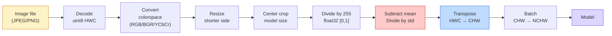
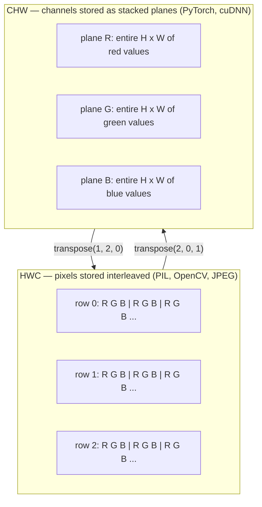

# 图像基础 — 像素、通道与色彩空间

> 图像就是光采样的张量。你将来用到的每一个视觉模型，都从这一个事实出发。

**类型：** Build
**语言：** Python
**前置课程：** Phase 1 Lesson 12（张量运算）、Phase 3 Lesson 11（PyTorch 入门）
**时长：** 约 45 分钟

## 学习目标

- 解释连续场景如何被离散化为像素，以及为什么采样/量化决策决定了所有下游模型的性能上限
- 将图像作为 NumPy 数组进行读取、切片和检查，并在 HWC 和 CHW 布局之间自如切换
- 在 RGB、灰度、HSV 和 YCbCr 之间进行转换，并说明每种色彩空间存在的理由
- 按照 torchvision 的要求，精确执行像素级预处理（normalize、standardize、resize、channel-first）

## 问题

你将来读到的每篇论文、下载的每个预训练权重、调用的每个视觉 API，都假设输入有特定的编码方式。把 `uint8` 图像传给期望 `float32` 的模型，它照样能跑——然后默默输出垃圾。把 BGR 喂给在 RGB 上训练的网络，准确率直接掉十个点。把 channels-last 的输入交给期望 channels-first 的模型，第一层卷积会把高度当成特征通道来处理。这些都不会报错，只会毁掉你的指标，然后你花一周时间去找一个藏在文件加载方式里的 bug。

卷积本身并不复杂，前提是你知道它在什么上面滑动。难的是"一张图像"对相机、JPEG 解码器、PIL、OpenCV、torchvision 和 CUDA kernel 来说意味着不同的东西。每个技术栈有自己的轴顺序、字节范围和通道约定。一个搞不清这些的视觉工程师，交付的就是有问题的 pipeline。

这节课把基础打牢，让后续整个阶段都能在此之上构建。学完之后你会知道像素是什么、为什么每个像素有三个数而不是一个、"用 ImageNet 统计量做 normalize"到底在做什么，以及如何在本阶段其他课程都会用到的两三种布局之间切换。

## 概念

### 完整预处理流水线一览

每个生产级视觉系统都是同一套可逆变换的序列。搞错任何一步，模型看到的输入就和它训练时的不一样。



红色和蓝色两个框是 80% 静默故障的所在：缺少标准化和错误的布局。

### 像素是一个采样点，不是一个方块

相机传感器计算落在一组微小探测器网格上的光子数。每个探测器在一小段时间内积分光线，输出一个与光子数成正比的电压。传感器随后将该电压离散化为一个整数。一个探测器变成一个像素。

```
Continuous scene                 Sensor grid                     Digital image
(infinite detail)                (H x W detectors)               (H x W integers)

    ~~~~~                        +--+--+--+--+--+                 210 198 180 155 120
   ~   ~   ~                     |  |  |  |  |  |                 205 195 178 152 118
  ~ light ~      ---->           +--+--+--+--+--+     ---->       200 190 175 150 115
   ~~~~~                         |  |  |  |  |  |                 195 185 170 148 112
                                 +--+--+--+--+--+                 188 180 165 145 108
```

这一步有两个选择，它们决定了下游一切的上限：

- **空间采样**决定场景每度有多少个探测器。太少，边缘会出现锯齿（混叠）。太多，存储和计算量爆炸。
- **强度量化**决定电压被分成多细的桶。8 bit 给出 256 个级别，是显示的标准。10、12、16 bit 给出更平滑的梯度，在医学影像、HDR 和 raw 传感器流水线中很重要。

像素不是一个有面积的彩色方块。它是一个单点测量值。当你 resize 或旋转时，你是在对那个测量网格做重采样。

### 为什么是三个通道

一个探测器计算整个可见光谱的光子——那就是灰度。要获得颜色，传感器在网格上覆盖红、绿、蓝滤光片的马赛克。经过去马赛克处理后，每个空间位置有三个整数：红色滤光探测器的响应、绿色的和蓝色的。这三个整数就是像素的 RGB 三元组。

```
One pixel in memory:

    (R, G, B) = (210, 140, 30)   <- reddish-orange

An H x W RGB image:

    shape (H, W, 3)     stored as   H rows of W pixels of 3 values
                                    each in [0, 255] for uint8
```

三不是什么魔法数字。深度相机加一个 Z 通道。卫星加红外和紫外波段。医学扫描通常有一个通道（X 光、CT）或很多个（高光谱）。通道数是最后一个轴；卷积层学习在通道间混合。

### 两种布局约定：HWC 和 CHW

同一个张量，两种排列方式。每个库选一种。

```
HWC (height, width, channels)           CHW (channels, height, width)

   W ->                                    H ->
  +-----+-----+-----+                     +-----+-----+
H |R G B|R G B|R G B|                   C |R R R R R R|
| +-----+-----+-----+                   | +-----+-----+
v |R G B|R G B|R G B|                   v |G G G G G G|
  +-----+-----+-----+                     +-----+-----+
                                          |B B B B B B|
                                          +-----+-----+

   PIL, OpenCV, matplotlib,              PyTorch, most deep learning
   almost every image file on disk       frameworks, cuDNN kernels
```

CHW 存在是因为卷积核在 H 和 W 上滑动。把通道轴放在最前面意味着每个核看到的是每个通道一个连续的 2D 平面，这样向量化很干净。磁盘格式保持 HWC 是因为这和传感器输出扫描线的方式一致。

你会打一千遍的单行转换：

```
img_chw = img_hwc.transpose(2, 0, 1)      # NumPy
img_chw = img_hwc.permute(2, 0, 1)        # PyTorch tensor
```

内存布局可视化：



### 字节范围与 dtype

三种约定占主导：

| 约定 | dtype | 范围 | 出现场景 |
|------|-------|------|----------|
| Raw | `uint8` | [0, 255] | 磁盘文件、PIL、OpenCV 输出 |
| Normalized | `float32` | [0.0, 1.0] | `img.astype('float32') / 255` 之后 |
| Standardized | `float32` | 大约 [-2, +2] | 减去均值、除以标准差之后 |

卷积网络是在 standardized 输入上训练的。ImageNet 统计量 `mean=[0.485, 0.456, 0.406]`、`std=[0.229, 0.224, 0.225]` 是三个通道在整个 ImageNet 训练集上的算术均值和标准差，基于 [0, 1] normalized 像素计算。把原始 `uint8` 喂给期望 standardized float 的模型，是应用视觉中最常见的静默故障。

### 色彩空间及其存在的原因

RGB 是采集格式，但它并不总是对模型最有用的表示。

```
 RGB               HSV                       YCbCr / YUV

 R red             H hue (angle 0-360)       Y luminance (brightness)
 G green           S saturation (0-1)        Cb chroma blue-yellow
 B blue            V value/brightness (0-1)  Cr chroma red-green

 Linear to         Separates color from      Separates brightness from
 sensor output     brightness. Useful for    color. JPEG and most video
                   color thresholding, UI    codecs compress the chroma
                   sliders, simple filters   channels harder because the
                                             human eye is less sensitive
                                             to chroma detail than to Y.
```

对大多数现代 CNN 你喂 RGB。你会在以下场景遇到其他空间：

- **HSV** — 经典 CV 代码、基于颜色的分割、白平衡。
- **YCbCr** — 读取 JPEG 内部结构、视频流水线、只在 Y 通道上操作的超分辨率模型。
- **灰度** — OCR、文档模型、颜色是干扰变量而非信号的任何场景。

从 RGB 到灰度是加权求和，不是平均，因为人眼对绿色比对红色或蓝色更敏感：

```
Y = 0.299 R + 0.587 G + 0.114 B       (ITU-R BT.601, the classic weights)
```

### 宽高比、缩放与插值

每个模型有固定的输入尺寸（大多数 ImageNet 分类器是 224x224，现代检测器是 384x384 或 512x512）。你的图像很少刚好匹配。三种重要的 resize 选择：

- **缩放短边，然后中心裁剪** — 标准 ImageNet 方案。保持宽高比，丢弃一条边缘像素。
- **缩放并填充** — 保持宽高比和所有像素，添加黑边。检测和 OCR 的标准做法。
- **直接缩放到目标尺寸** — 拉伸图像。便宜，扭曲几何，对很多分类任务够用。

插值方法决定当新网格与旧网格不对齐时如何计算中间像素：

```
Nearest neighbour     fastest, blocky, only choice for masks/labels
Bilinear              fast, smooth, default for most image resizing
Bicubic               slower, sharper on upscaling
Lanczos               slowest, best quality, used for final display
```

经验法则：训练用 bilinear，要看的素材用 bicubic 或 lanczos，包含整数类别 ID 的任何东西用 nearest。

## 动手构建

### 第 1 步：加载图像并检查其形状

用 Pillow 加载任意 JPEG 或 PNG，转为 NumPy，打印你得到了什么。为了有一个可离线运行的确定性示例，我们合成一张。

```python
import numpy as np
from PIL import Image

def synthetic_rgb(h=128, w=192, seed=0):
    rng = np.random.default_rng(seed)
    yy, xx = np.meshgrid(np.linspace(0, 1, h), np.linspace(0, 1, w), indexing="ij")
    r = (np.sin(xx * 6) * 0.5 + 0.5) * 255
    g = yy * 255
    b = (1 - yy) * xx * 255
    rgb = np.stack([r, g, b], axis=-1) + rng.normal(0, 6, (h, w, 3))
    return np.clip(rgb, 0, 255).astype(np.uint8)

arr = synthetic_rgb()
# Or load from disk:
# arr = np.asarray(Image.open("your_image.jpg").convert("RGB"))

print(f"type:   {type(arr).__name__}")
print(f"dtype:  {arr.dtype}")
print(f"shape:  {arr.shape}     # (H, W, C)")
print(f"min:    {arr.min()}")
print(f"max:    {arr.max()}")
print(f"pixel at (0, 0): {arr[0, 0]}")
```

预期输出：`shape: (H, W, 3)`、`dtype: uint8`、范围 `[0, 255]`。无论字节来自相机、JPEG 解码器还是合成生成器，这就是磁盘上的标准表示。

### 第 2 步：分离通道并重排布局

分别取出 R、G、B，然后从 HWC 转为 CHW 供 PyTorch 使用。

```python
R = arr[:, :, 0]
G = arr[:, :, 1]
B = arr[:, :, 2]
print(f"R shape: {R.shape}, mean: {R.mean():.1f}")
print(f"G shape: {G.shape}, mean: {G.mean():.1f}")
print(f"B shape: {B.shape}, mean: {B.mean():.1f}")

arr_chw = arr.transpose(2, 0, 1)
print(f"\nHWC shape: {arr.shape}")
print(f"CHW shape: {arr_chw.shape}")
```

三个灰度平面，每个通道一个。CHW 只是重排了轴；当内存布局允许时，严格来说不需要数据拷贝。

### 第 3 步：灰度和 HSV 转换

加权求和灰度，然后手动 RGB 转 HSV。

```python
def rgb_to_grayscale(rgb):
    weights = np.array([0.299, 0.587, 0.114], dtype=np.float32)
    return (rgb.astype(np.float32) @ weights).astype(np.uint8)

def rgb_to_hsv(rgb):
    rgb_f = rgb.astype(np.float32) / 255.0
    r, g, b = rgb_f[..., 0], rgb_f[..., 1], rgb_f[..., 2]
    cmax = np.max(rgb_f, axis=-1)
    cmin = np.min(rgb_f, axis=-1)
    delta = cmax - cmin

    h = np.zeros_like(cmax)
    mask = delta > 0
    rmax = mask & (cmax == r)
    gmax = mask & (cmax == g)
    bmax = mask & (cmax == b)
    h[rmax] = ((g[rmax] - b[rmax]) / delta[rmax]) % 6
    h[gmax] = ((b[gmax] - r[gmax]) / delta[gmax]) + 2
    h[bmax] = ((r[bmax] - g[bmax]) / delta[bmax]) + 4
    h = h * 60.0

    s = np.where(cmax > 0, delta / cmax, 0)
    v = cmax
    return np.stack([h, s, v], axis=-1)

gray = rgb_to_grayscale(arr)
hsv = rgb_to_hsv(arr)
print(f"gray shape: {gray.shape}, range: [{gray.min()}, {gray.max()}]")
print(f"hsv   shape: {hsv.shape}")
print(f"hue range: [{hsv[..., 0].min():.1f}, {hsv[..., 0].max():.1f}] degrees")
print(f"sat range: [{hsv[..., 1].min():.2f}, {hsv[..., 1].max():.2f}]")
print(f"val range: [{hsv[..., 2].min():.2f}, {hsv[..., 2].max():.2f}]")
```

Hue 以度为单位输出，saturation 和 value 在 [0, 1]。这与 OpenCV 的 `hsv_full` 约定一致。

### 第 4 步：Normalize、standardize 及其逆操作

从原始字节到预训练 ImageNet 模型期望的精确张量，然后再转回来。

```python
mean = np.array([0.485, 0.456, 0.406], dtype=np.float32)
std = np.array([0.229, 0.224, 0.225], dtype=np.float32)

def preprocess_imagenet(rgb_uint8):
    x = rgb_uint8.astype(np.float32) / 255.0
    x = (x - mean) / std
    x = x.transpose(2, 0, 1)
    return x

def deprocess_imagenet(chw_float32):
    x = chw_float32.transpose(1, 2, 0)
    x = x * std + mean
    x = np.clip(x * 255.0, 0, 255).astype(np.uint8)
    return x

x = preprocess_imagenet(arr)
print(f"preprocessed shape: {x.shape}     # (C, H, W)")
print(f"preprocessed dtype: {x.dtype}")
print(f"preprocessed mean per channel:  {x.mean(axis=(1, 2)).round(3)}")
print(f"preprocessed std  per channel:  {x.std(axis=(1, 2)).round(3)}")

roundtrip = deprocess_imagenet(x)
max_diff = np.abs(roundtrip.astype(int) - arr.astype(int)).max()
print(f"roundtrip max pixel diff: {max_diff}    # should be 0 or 1")
```

每通道均值应接近零，标准差接近一。preprocess/deprocess 这对操作正是每个 torchvision `transforms.Normalize` 调用在底层做的事。

### 第 5 步：用三种插值方法 resize

在上采样上比较 nearest、bilinear 和 bicubic，这样差异可见。

```python
target = (arr.shape[0] * 3, arr.shape[1] * 3)

nearest = np.asarray(Image.fromarray(arr).resize(target[::-1], Image.NEAREST))
bilinear = np.asarray(Image.fromarray(arr).resize(target[::-1], Image.BILINEAR))
bicubic = np.asarray(Image.fromarray(arr).resize(target[::-1], Image.BICUBIC))

def local_roughness(x):
    gy = np.diff(x.astype(float), axis=0)
    gx = np.diff(x.astype(float), axis=1)
    return float(np.abs(gy).mean() + np.abs(gx).mean())

for name, out in [("nearest", nearest), ("bilinear", bilinear), ("bicubic", bicubic)]:
    print(f"{name:>8}  shape={out.shape}  roughness={local_roughness(out):6.2f}")
```

Nearest 的粗糙度最高，因为它保留了硬边缘。Bilinear 最平滑。Bicubic 介于两者之间，保持感知锐度的同时没有阶梯状伪影。

## 实际使用

`torchvision.transforms` 把上面所有操作打包成一个可组合的 pipeline。下面的代码精确复现了 `preprocess_imagenet` 的功能，外加 resize 和 crop。

```python
import torch
from torchvision import transforms
from PIL import Image

img = Image.fromarray(synthetic_rgb(256, 256))

pipeline = transforms.Compose([
    transforms.Resize(256),
    transforms.CenterCrop(224),
    transforms.ToTensor(),
    transforms.Normalize(mean=[0.485, 0.456, 0.406], std=[0.229, 0.224, 0.225]),
])

x = pipeline(img)
print(f"tensor type:  {type(x).__name__}")
print(f"tensor dtype: {x.dtype}")
print(f"tensor shape: {tuple(x.shape)}      # (C, H, W)")
print(f"per-channel mean: {x.mean(dim=(1, 2)).tolist()}")
print(f"per-channel std:  {x.std(dim=(1, 2)).tolist()}")

batch = x.unsqueeze(0)
print(f"\nbatched shape: {tuple(batch.shape)}   # (N, C, H, W) — ready for a model")
```

四步，必须按这个顺序：`Resize(256)` 把短边缩放到 256；`CenterCrop(224)` 从中间取 224x224 的块；`ToTensor()` 除以 255 并把 HWC 转为 CHW；`Normalize` 减去 ImageNet 均值并除以标准差。颠倒顺序会静默改变送到模型的内容。

## 交付产出

本课产出：

- `outputs/prompt-vision-preprocessing-audit.md` — 一个 prompt，能把任何 model card 或 dataset card 转化为团队必须遵守的精确预处理不变量清单。
- `outputs/skill-image-tensor-inspector.md` — 一个 skill，给定任何图像形状的张量或数组，报告 dtype、布局、范围，以及它看起来是 raw、normalized 还是 standardized。

## 练习

1. **（简单）** 用 OpenCV（`cv2.imread`）和 Pillow 分别加载一张 JPEG。打印两者的 shape 和 `(0, 0)` 处的像素值。解释通道顺序的差异，然后写一行转换代码使 OpenCV 数组与 Pillow 的完全一致。
2. **（中等）** 编写 `standardize(img, mean, std)` 及其逆函数，使它们在任何 uint8 图像上通过 `roundtrip_max_diff <= 1` 测试。你的函数必须对 HWC 单张图像和 NCHW batch 都能用同一个调用。
3. **（困难）** 取一个 3 通道 ImageNet-standardized 张量，通过一个 1x1 卷积学习 RGB 到单通道灰度的加权混合。将权重初始化为 `[0.299, 0.587, 0.114]`，冻结它们，验证输出与你手动的 `rgb_to_grayscale` 在浮点误差范围内一致。还有哪些经典色彩空间变换可以写成 1x1 卷积？

## 关键术语

| 术语 | 口语说法 | 实际含义 |
|------|----------|----------|
| 像素 | "一个彩色方块" | 一个网格位置上的一次光强度采样——彩色三个数，灰度一个数 |
| 通道 | "颜色" | 堆叠成图像张量的多个平行空间网格之一；HWC 中是最后一个轴，CHW 中是第一个 |
| HWC / CHW | "shape" | 图像张量的轴排列方式；磁盘和 PIL 用 HWC，PyTorch 和 cuDNN 用 CHW |
| Normalize | "缩放图像" | 除以 255 使像素落在 [0, 1]——必要但不充分 |
| Standardize | "零中心化" | 逐通道减去均值除以标准差，使输入分布与模型训练时一致 |
| 灰度转换 | "对通道取平均" | 系数为 0.299/0.587/0.114 的加权求和，匹配人类亮度感知 |
| 插值 | "resize 怎么选像素" | 当新网格与旧网格不对齐时决定输出值的规则——标签用 nearest，训练用 bilinear，展示用 bicubic |
| 宽高比 | "宽除以高" | 区分"缩放加填充"和"缩放加拉伸"的那个比值 |

## 延伸阅读

- [Charles Poynton — A Guided Tour of Color Space](https://poynton.ca/PDFs/Guided_tour.pdf) — 关于为什么有这么多色彩空间以及何时用哪个，最清晰的技术论述
- [PyTorch Vision Transforms Docs](https://pytorch.org/vision/stable/transforms.html) — 你在生产中实际会组合的完整变换 pipeline
- [How JPEG Works (Colt McAnlis)](https://www.youtube.com/watch?v=F1kYBnY6mwg) — 关于色度子采样、DCT 以及为什么 JPEG 编码 YCbCr 而非 RGB 的精彩视觉之旅
- [ImageNet Preprocessing Conventions (torchvision models)](https://pytorch.org/vision/stable/models.html) — `mean=[0.485, 0.456, 0.406]` 的权威来源，以及为什么 zoo 里的每个模型都期望它
