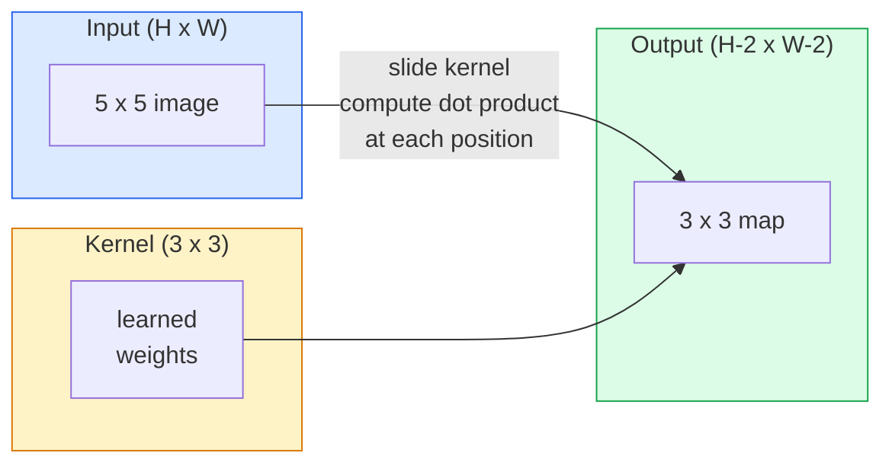
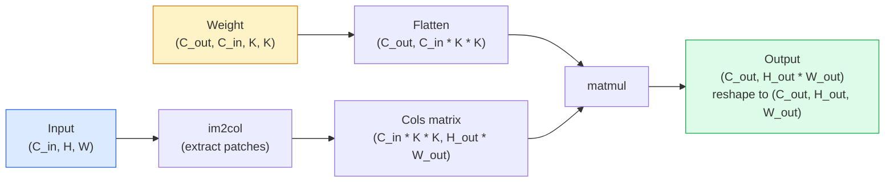

# 从零实现卷积

> 卷积就是一个小型全连接层，在图像上滑动，每个位置共享相同的权重。

**类型：** Build
**语言：** Python
**前置课程：** Phase 3（深度学习核心）、Phase 4 Lesson 01（图像基础）
**时长：** 约 75 分钟

## 学习目标

- 仅用 NumPy 从零实现 2D 卷积，包括嵌套循环版本和向量化的 `im2col` 版本
- 对任意输入尺寸、kernel 尺寸、padding 和 stride 的组合计算输出空间大小，并推导 `(H - K + 2P) / S + 1` 公式
- 手工设计 kernel（边缘、模糊、锐化、Sobel）并解释每个为什么产生它那样的激活模式
- 将卷积堆叠成特征提取器，并将堆叠深度与感受野大小联系起来

## 问题

一个全连接层作用在 224x224 RGB 图像上，每个神经元需要 224 * 224 * 3 = 150,528 个输入权重。一个 1,000 单元的隐藏层就已经是 1.5 亿参数——还没学到任何有用的东西。更糟的是，这个层完全不知道左上角的狗和右下角的狗是同一个模式。它把每个像素位置当作独立的，这对图像来说完全错误：把一只猫平移三个像素不应该迫使网络重新学习这个概念。

图像模型需要的两个属性是**平移等变性**（输入平移时输出也平移）和**参数共享**（同一个特征检测器在所有位置运行）。全连接层两个都给不了你。卷积免费给你两个。

卷积不是为深度学习发明的。它和 JPEG 压缩、Photoshop 里的高斯模糊、工业视觉中的边缘检测、以及所有音频滤波器用的是同一个操作。CNN 从 2012 到 2020 年统治 ImageNet 的原因是：对于相邻值相关且同一模式可以出现在任何位置的数据，卷积是正确的先验。

## 概念

### 一个 kernel，滑动

2D 卷积取一个小的权重矩阵（称为 kernel 或 filter），在输入上滑动，在每个位置计算逐元素乘积之和。这个和就成为一个输出像素。



一个具体的 3x3 示例，作用在 5x5 输入上（无 padding，stride 1）：

```
Input X (5 x 5):                Kernel W (3 x 3):

  1  2  0  1  2                   1  0 -1
  0  1  3  1  0                   2  0 -2
  2  1  0  2  1                   1  0 -1
  1  0  2  1  3
  2  1  1  0  1

The kernel slides across every valid 3 x 3 window. Output Y is 3 x 3:

 Y[0,0] = sum( W * X[0:3, 0:3] )
 Y[0,1] = sum( W * X[0:3, 1:4] )
 Y[0,2] = sum( W * X[0:3, 2:5] )
 Y[1,0] = sum( W * X[1:4, 0:3] )
 ... and so on
```

这一个公式——**共享权重、局部性、滑动窗口**——就是全部思想。其他一切都是记账。

### 输出尺寸公式

给定输入空间大小 `H`、kernel 大小 `K`、padding `P`、stride `S`：

```
H_out = floor( (H - K + 2P) / S ) + 1
```

记住这个。你会在每个架构中计算几十次。

| 场景 | H | K | P | S | H_out |
|------|---|---|---|---|-------|
| Valid conv，无 padding | 32 | 3 | 0 | 1 | 30 |
| Same conv（保持尺寸） | 32 | 3 | 1 | 1 | 32 |
| 下采样 2 倍 | 32 | 3 | 1 | 2 | 16 |
| Pool 2x2 | 32 | 2 | 0 | 2 | 16 |
| 大感受野 | 32 | 7 | 3 | 2 | 16 |

"Same padding"意味着选择 P 使得 S == 1 时 H_out == H。对于奇数 K，就是 P = (K - 1) / 2。这就是为什么 3x3 kernel 占主导——它们是仍然有中心点的最小奇数 kernel。

### Padding

没有 padding 的话，每次卷积都会缩小 feature map。堆叠 20 层，你的 224x224 图像变成 184x184，浪费了边界的计算，也让需要匹配形状的残差连接变得复杂。

```
Zero padding (P = 1) on a 5 x 5 input:

  0  0  0  0  0  0  0
  0  1  2  0  1  2  0
  0  0  1  3  1  0  0
  0  2  1  0  2  1  0       Now the kernel can centre on pixel
  0  1  0  2  1  3  0       (0, 0) and still have three rows and
  0  2  1  1  0  1  0       three columns of values to multiply.
  0  0  0  0  0  0  0
```

实践中遇到的模式：`zero`（最常见）、`reflect`（镜像边缘，避免生成模型中的硬边界）、`replicate`（复制边缘）、`circular`（环绕，用于环面问题）。

### Stride

Stride 是滑动的步长。`stride=1` 是默认值。`stride=2` 将空间维度减半，是 CNN 内部不用单独 pooling 层就能下采样的经典方式——每个现代架构（ResNet、ConvNeXt、MobileNet）都在某处用 strided conv 代替 max-pool。

```
Stride 1 on a 5 x 5 input, 3 x 3 kernel:

  starts: (0,0) (0,1) (0,2)        -> output row 0
          (1,0) (1,1) (1,2)        -> output row 1
          (2,0) (2,1) (2,2)        -> output row 2

  Output: 3 x 3

Stride 2 on the same input:

  starts: (0,0) (0,2)              -> output row 0
          (2,0) (2,2)              -> output row 1

  Output: 2 x 2
```

### 多输入通道

真实图像有三个通道。一个 3x3 卷积作用在 RGB 输入上实际上是一个 3x3x3 的体积：每个输入通道一个 3x3 切片。在每个空间位置，你对所有三个切片做乘法求和，再加一个偏置。

```
Input:   (C_in,  H,  W)        3 x 5 x 5
Kernel:  (C_in,  K,  K)        3 x 3 x 3 (one kernel)
Output:  (1,     H', W')       2D map

For a layer that produces C_out output channels, you stack C_out kernels:

Weight:  (C_out, C_in, K, K)   e.g. 64 x 3 x 3 x 3
Output:  (C_out, H', W')       64 x 3 x 3

Parameter count: C_out * C_in * K * K + C_out   (the + C_out is biases)
```

最后一行是你规划模型时要算的。一个 64 通道 3x3 conv 作用在 3 通道输入上有 `64 * 3 * 3 * 3 + 64 = 1,792` 个参数。很便宜。

### im2col 技巧

嵌套循环容易读但慢。GPU 想要大矩阵乘法。技巧是：把输入中每个感受野窗口展平成一个大矩阵的一列，把 kernel 展平成一行，整个卷积就变成一次 matmul。



每个生产级 conv 实现都是这个的某种变体加上缓存分块技巧（direct conv、Winograd、大 kernel 的 FFT conv）。理解了 im2col 你就理解了核心。

### 感受野

一个 3x3 conv 看 9 个输入像素。堆叠两个 3x3 conv，第二层的一个神经元看 5x5 个输入像素。三个 3x3 conv 给出 7x7。一般来说：

```
RF after L stacked K x K convs (stride 1) = 1 + L * (K - 1)

With strides:   RF grows multiplicatively with stride along each layer.
```

"一路 3x3 到底"能工作（VGG、ResNet、ConvNeXt）的全部原因是：两个 3x3 conv 看到的输入区域和一个 5x5 conv 一样，但参数更少，中间还多一个非线性。

## 动手构建

### 第 1 步：填充数组

从最小的原语开始：一个在 H x W 数组周围填充零的函数。

```python
import numpy as np

def pad2d(x, p):
    if p == 0:
        return x
    h, w = x.shape[-2:]
    out = np.zeros(x.shape[:-2] + (h + 2 * p, w + 2 * p), dtype=x.dtype)
    out[..., p:p + h, p:p + w] = x
    return out

x = np.arange(9).reshape(3, 3)
print(x)
print()
print(pad2d(x, 1))
```

尾部轴技巧 `x.shape[:-2]` 意味着同一个函数对 `(H, W)`、`(C, H, W)` 或 `(N, C, H, W)` 都能用，无需修改。

### 第 2 步：嵌套循环的 2D 卷积

参考实现——慢，但无歧义。这就是 `torch.nn.functional.conv2d` 原理上做的事。

```python
def conv2d_naive(x, w, b=None, stride=1, padding=0):
    c_in, h, w_in = x.shape
    c_out, c_in_w, kh, kw = w.shape
    assert c_in == c_in_w

    x_pad = pad2d(x, padding)
    h_out = (h + 2 * padding - kh) // stride + 1
    w_out = (w_in + 2 * padding - kw) // stride + 1

    out = np.zeros((c_out, h_out, w_out), dtype=np.float32)
    for oc in range(c_out):
        for i in range(h_out):
            for j in range(w_out):
                hs = i * stride
                ws = j * stride
                patch = x_pad[:, hs:hs + kh, ws:ws + kw]
                out[oc, i, j] = np.sum(patch * w[oc])
        if b is not None:
            out[oc] += b[oc]
    return out
```

四层嵌套循环（输出通道、行、列，加上对 C_in、kh、kw 的隐式求和）。这是你用来验证每个更快实现的 ground truth。

### 第 3 步：用手工设计的 kernel 验证

构建一个垂直 Sobel kernel，应用到合成阶梯图像上，观察垂直边缘亮起来。

```python
def synthetic_step_image():
    img = np.zeros((1, 16, 16), dtype=np.float32)
    img[:, :, 8:] = 1.0
    return img

sobel_x = np.array([
    [[-1, 0, 1],
     [-2, 0, 2],
     [-1, 0, 1]]
], dtype=np.float32)[None]

x = synthetic_step_image()
y = conv2d_naive(x, sobel_x, padding=1)
print(y[0].round(1))
```

预期在第 7 列有大的正值（从左到右亮度增加），其他地方全是零。这一个 print 就是你验证数学正确的 sanity check。

### 第 4 步：im2col

把输入中每个 kernel 大小的窗口转换成矩阵的一列。对于 `C_in=3, K=3`，每列是 27 个数。

```python
def im2col(x, kh, kw, stride=1, padding=0):
    c_in, h, w = x.shape
    x_pad = pad2d(x, padding)
    h_out = (h + 2 * padding - kh) // stride + 1
    w_out = (w + 2 * padding - kw) // stride + 1

    cols = np.zeros((c_in * kh * kw, h_out * w_out), dtype=x.dtype)
    col = 0
    for i in range(h_out):
        for j in range(w_out):
            hs = i * stride
            ws = j * stride
            patch = x_pad[:, hs:hs + kh, ws:ws + kw]
            cols[:, col] = patch.reshape(-1)
            col += 1
    return cols, h_out, w_out
```

仍然是 Python 循环，但现在重活将由一次向量化的 matmul 完成。

### 第 5 步：通过 im2col + matmul 实现快速 conv

用一次矩阵乘法替代四重循环。

```python
def conv2d_im2col(x, w, b=None, stride=1, padding=0):
    c_out, c_in, kh, kw = w.shape
    cols, h_out, w_out = im2col(x, kh, kw, stride, padding)
    w_flat = w.reshape(c_out, -1)
    out = w_flat @ cols
    if b is not None:
        out += b[:, None]
    return out.reshape(c_out, h_out, w_out)
```

正确性检查：运行两种实现并比较。

```python
rng = np.random.default_rng(0)
x = rng.normal(0, 1, (3, 16, 16)).astype(np.float32)
w = rng.normal(0, 1, (8, 3, 3, 3)).astype(np.float32)
b = rng.normal(0, 1, (8,)).astype(np.float32)

y_naive = conv2d_naive(x, w, b, padding=1)
y_im2col = conv2d_im2col(x, w, b, padding=1)

print(f"max abs diff: {np.max(np.abs(y_naive - y_im2col)):.2e}")
```

`max abs diff` 应该在 `1e-5` 左右——差异来自浮点累加顺序，不是 bug。

### 第 6 步：一组手工设计的 kernel

五个滤波器，展示单个 conv 层在任何训练之前能表达什么。

```python
KERNELS = {
    "identity": np.array([[0, 0, 0], [0, 1, 0], [0, 0, 0]], dtype=np.float32),
    "blur_3x3": np.ones((3, 3), dtype=np.float32) / 9.0,
    "sharpen": np.array([[0, -1, 0], [-1, 5, -1], [0, -1, 0]], dtype=np.float32),
    "sobel_x": np.array([[-1, 0, 1], [-2, 0, 2], [-1, 0, 1]], dtype=np.float32),
    "sobel_y": np.array([[-1, -2, -1], [0, 0, 0], [1, 2, 1]], dtype=np.float32),
}

def apply_kernel(img2d, kernel):
    x = img2d[None].astype(np.float32)
    w = kernel[None, None]
    return conv2d_im2col(x, w, padding=1)[0]
```

应用到任何灰度图像上，blur 使之柔化，sharpen 使边缘更清晰，Sobel-x 点亮垂直边缘，Sobel-y 点亮水平边缘。这些正是 AlexNet 和 VGG 的*第一个*训练好的 conv 层最终学到的模式——因为一个好的图像模型无论后续任务是什么，都需要边缘和 blob 检测器。

## 实际使用

PyTorch 的 `nn.Conv2d` 用 autograd、CUDA kernel 和 cuDNN 优化包装了同样的操作。形状语义完全相同。

```python
import torch
import torch.nn as nn

conv = nn.Conv2d(in_channels=3, out_channels=64, kernel_size=3, stride=1, padding=1)
print(conv)
print(f"weight shape: {tuple(conv.weight.shape)}   # (C_out, C_in, K, K)")
print(f"bias shape:   {tuple(conv.bias.shape)}")
print(f"param count:  {sum(p.numel() for p in conv.parameters())}")

x = torch.randn(8, 3, 224, 224)
y = conv(x)
print(f"\ninput  shape: {tuple(x.shape)}")
print(f"output shape: {tuple(y.shape)}")
```

把 `padding=1` 换成 `padding=0`，输出降到 222x222。把 `stride=1` 换成 `stride=2`，降到 112x112。和你上面记住的公式一样。

## 交付产出

本课产出：

- `outputs/prompt-cnn-architect.md` — 一个 prompt，给定输入尺寸、参数预算和目标感受野，设计一组 `Conv2d` 层，每步都有正确的 K/S/P。
- `outputs/skill-conv-shape-calculator.md` — 一个 skill，逐层遍历网络规格，返回每个 block 的输出形状、感受野和参数数量。

## 练习

1. **（简单）** 给定 128x128 灰度输入和一组 `[Conv3x3(s=1,p=1), Conv3x3(s=2,p=1), Conv3x3(s=1,p=1), Conv3x3(s=2,p=1)]`，手动计算每层的输出空间大小和感受野。用 PyTorch `nn.Sequential` 的 dummy conv 验证。
2. **（中等）** 扩展 `conv2d_naive` 和 `conv2d_im2col` 使其接受 `groups` 参数。证明 `groups=C_in=C_out` 复现了 depthwise convolution，且其参数量是 `C * K * K` 而非 `C * C * K * K`。
3. **（困难）** 手动实现 `conv2d_im2col` 的反向传播：给定输出的梯度，计算 `x` 和 `w` 的梯度。用 `torch.autograd.grad` 在相同输入和权重上验证。技巧：im2col 的梯度是 `col2im`，它需要累加重叠窗口。

## 关键术语

| 术语 | 口语说法 | 实际含义 |
|------|----------|----------|
| 卷积 | "滑动滤波器" | 在每个空间位置用共享权重做的可学习点积；数学上是互相关，但大家都叫它卷积 |
| Kernel / filter | "特征检测器" | 形状为 (C_in, K, K) 的小权重张量，它与输入窗口的点积产生一个输出像素 |
| Stride | "跳多远" | 相邻 kernel 放置位置之间的步长；stride 2 将每个空间维度减半 |
| Padding | "边缘加零" | 在输入周围添加的额外值，使 kernel 能以边界像素为中心；`same` padding 保持输出尺寸等于输入尺寸 |
| 感受野 | "神经元能看多大" | 给定输出激活所依赖的原始输入区域，随深度和 stride 增长 |
| im2col | "GEMM 技巧" | 把每个感受野窗口重排成列，使卷积变成一次大矩阵乘法——每个快速 conv kernel 的核心 |
| Depthwise conv | "每通道一个 kernel" | `groups == C_in` 的 conv，每个输出通道只从其对应的输入通道计算；MobileNet 和 ConvNeXt 的骨干 |
| 平移等变性 | "移入，移出" | 输入平移 k 像素则输出平移 k 像素的性质；共享权重免费给你 |

## 延伸阅读

- [A guide to convolution arithmetic for deep learning (Dumoulin & Visin, 2016)](https://arxiv.org/abs/1603.07285) — padding/stride/dilation 的权威图解，每门课都在悄悄抄
- [CS231n: Convolutional Neural Networks for Visual Recognition](https://cs231n.github.io/convolutional-networks/) — 经典讲义，包括原始 im2col 解释
- [The Annotated ConvNet (fast.ai)](https://nbviewer.org/github/fastai/fastbook/blob/master/13_convolutions.ipynb) — 从手动卷积到训练好的数字分类器的 notebook
- [Receptive Field Arithmetic for CNNs (Dang Ha The Hien)](https://distill.pub/2019/computing-receptive-fields/) — 感受野计算的论文级交互式讲解
