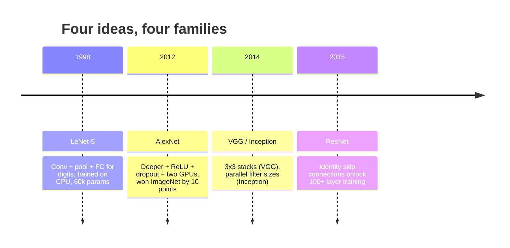
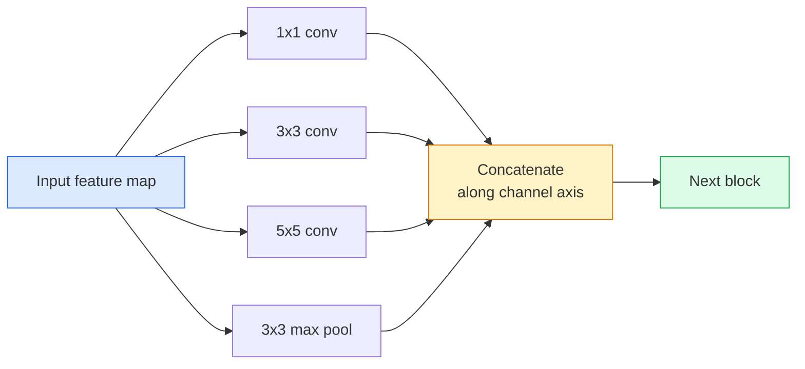
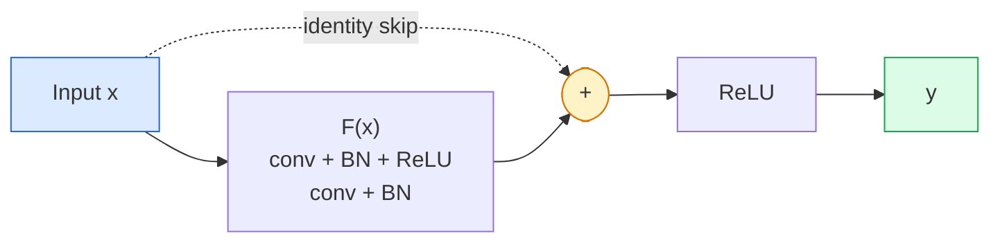

# CNN — 从 LeNet 到 ResNet

> 过去三十年每个重要的 CNN 都是同一套 conv-非线性-下采样 配方，加上一个新想法。按顺序学这些想法。

**类型：** Learn + Build
**语言：** Python
**前置课程：** Phase 3 Lesson 11（PyTorch）、Phase 4 Lesson 01（图像基础）、Phase 4 Lesson 02（从零实现卷积）
**时长：** 约 75 分钟

## 学习目标

- 追溯架构谱系 LeNet-5 -> AlexNet -> VGG -> Inception -> ResNet，并说明每个家族贡献的那一个新想法
- 用 PyTorch 实现 LeNet-5、VGG 风格 block 和 ResNet BasicBlock，每个不超过 40 行
- 解释为什么残差连接能把一个 1,000 层的网络从不可训练变成 state-of-the-art
- 阅读一个现代 backbone（ResNet-18、ResNet-50），在看源码之前预测其输出形状、感受野和参数量

## 问题

2011 年，最好的 ImageNet 分类器 top-5 准确率约 74%。2012 年 AlexNet 达到 85%。2015 年 ResNet 达到 96%。没有新数据，没有新一代 GPU。提升来自架构想法。一个合格的视觉工程师必须知道哪个想法来自哪篇论文，因为你在 2026 年交付的每个生产 backbone 都是这些相同组件的重组——也因为这些想法不断迁移：grouped conv 从 CNN 到了 transformer，残差连接从 ResNet 到了每个 LLM，batch normalisation 活在扩散模型里。

按顺序学习这些网络还能让你免疫一个常见错误：在 LeNet 大小的网络就能解决问题时去用最大的可用模型。MNIST 不需要 ResNet。知道每个家族的 scaling 曲线告诉你该坐在哪个位置。

## 概念

### 改变视觉的四个想法



经典视觉中没有其他东西比这四次跳跃更重要。

### LeNet-5 (1998)

Yann LeCun 的数字识别器。60,000 个参数。两个 conv-pool block，两个全连接层，tanh 激活。它定义了每个 CNN 继承的模板：

```
input (1, 32, 32)
  conv 5x5 -> (6, 28, 28)
  avg pool 2x2 -> (6, 14, 14)
  conv 5x5 -> (16, 10, 10)
  avg pool 2x2 -> (16, 5, 5)
  flatten -> 400
  dense -> 120
  dense -> 84
  dense -> 10
```

现代世界所说的 CNN——交替的卷积和下采样喂给一个小分类头——就是 LeNet 加上更多层、更大通道和更好的激活函数。

### AlexNet (2012)

三个变化合在一起打破了 ImageNet：

1. **ReLU** 代替 tanh。梯度不再消失。训练速度提升六倍。
2. **Dropout** 在全连接头中。正则化变成了一个层，而不是一个技巧。
3. **深度和宽度**。五个 conv 层，三个 dense 层，6000 万参数，在两块 GPU 上训练，模型在它们之间分割。

论文的 Figure 2 仍然展示了 GPU 分割为两个并行流。那个并行性是硬件的权宜之计，不是架构洞察——但上面三个想法仍然在你用的每个模型里。

### VGG (2014)

VGG 问：如果只用 3x3 卷积然后往深了走会怎样？

```
stack:   conv 3x3 -> conv 3x3 -> pool 2x2
repeat:  16 or 19 conv layers
```

两个 3x3 conv 看到的输入区域和一个 5x5 conv 一样，但参数更少（2*9*C^2 = 18C^2 vs 25*C^2），中间还多一个 ReLU。VGG 把这个观察变成了整个架构。简洁性——一种 block 类型，重复——使它成为之后一切的参考点。

代价：1.38 亿参数，训练慢，推理贵。

### Inception (2014，同年)

Google 对"该用什么 kernel 大小？"的回答是：全部，并行。



每个分支各有专长——1x1 做通道混合，3x3 做局部纹理，5x5 做更大模式，pooling 做平移不变特征——concat 让下一层选择哪个分支有用。Inception v1 在每个分支内部用 1x1 卷积作为瓶颈来控制参数量。

### 退化问题

到 2015 年，VGG-19 能工作而 VGG-32 不行。深度本应有帮助，但超过约 20 层后训练和测试 loss 都变差了。这不是过拟合。这是优化器找不到有用的权重，因为梯度在每层都乘法式地缩小。

```
Plain deep network:
  y = f_L( f_{L-1}( ... f_1(x) ... ) )

Gradient wrt early layer:
  dL/dW_1 = dL/dy * df_L/df_{L-1} * ... * df_2/df_1 * df_1/dW_1

Each multiplicative term has magnitude roughly (weight magnitude) * (activation gain).
Stack 100 of them with gains < 1 and the gradient is effectively zero.
```

VGG 在 19 层能工作是因为 batch norm（同时发表）保持了激活的良好缩放。但即使 batch norm 也救不了超过 30 层左右的深度。

### ResNet (2015)

He、Zhang、Ren、Sun 提出了一个修复一切的改变：

```
standard block:   y = F(x)
residual block:   y = F(x) + x
```

`+ x` 意味着层总是可以选择什么都不做，只要把 `F(x)` 驱动到零。一个 1,000 层的 ResNet 现在最差也不会比 1 层网络差，因为每个额外的 block 都有一个平凡的逃生通道。有了这个保证，优化器愿意让每个 block *稍微*有用——而稍微有用，堆叠 100 次，就是 state-of-the-art。



Block 的两个变体到处出现：

- **BasicBlock**（ResNet-18、ResNet-34）：两个 3x3 conv，skip 绕过两者。
- **Bottleneck**（ResNet-50、-101、-152）：1x1 降维、3x3 中间、1x1 升维，skip 绕过三者。通道数高时更便宜。

当 skip 需要跨越下采样（stride=2）时，恒等路径被替换为 1x1 stride=2 conv 以匹配形状。

### 残差为什么超越视觉仍然重要

这个想法其实不是关于图像分类的。它是关于把深度网络从"祈祷梯度能存活"变成一个可靠的、可扩展的工程工具。你下一阶段要读的每个 transformer 在每个 block 里都有完全相同的 skip connection。没有 ResNet，就没有 GPT。

## 动手构建

### 第 1 步：LeNet-5

一个最小的、忠实的 LeNet。Tanh 激活，average pooling。对现代性的唯一让步是我们在下游用 `nn.CrossEntropyLoss` 而不是原始的 Gaussian connections。

```python
import torch
import torch.nn as nn
import torch.nn.functional as F

class LeNet5(nn.Module):
    def __init__(self, num_classes=10):
        super().__init__()
        self.conv1 = nn.Conv2d(1, 6, kernel_size=5)
        self.conv2 = nn.Conv2d(6, 16, kernel_size=5)
        self.pool = nn.AvgPool2d(2)
        self.fc1 = nn.Linear(16 * 5 * 5, 120)
        self.fc2 = nn.Linear(120, 84)
        self.fc3 = nn.Linear(84, num_classes)

    def forward(self, x):
        x = self.pool(torch.tanh(self.conv1(x)))
        x = self.pool(torch.tanh(self.conv2(x)))
        x = torch.flatten(x, 1)
        x = torch.tanh(self.fc1(x))
        x = torch.tanh(self.fc2(x))
        return self.fc3(x)

net = LeNet5()
x = torch.randn(1, 1, 32, 32)
print(f"output: {net(x).shape}")
print(f"params: {sum(p.numel() for p in net.parameters()):,}")
```

预期输出：`output: torch.Size([1, 10])`、`params: 61,706`。这就是开启现代视觉的整个数字分类器。

### 第 2 步：VGG block

一个可复用的 block：两个 3x3 conv、ReLU、batch norm、max pool。

```python
class VGGBlock(nn.Module):
    def __init__(self, in_c, out_c):
        super().__init__()
        self.conv1 = nn.Conv2d(in_c, out_c, kernel_size=3, padding=1)
        self.bn1 = nn.BatchNorm2d(out_c)
        self.conv2 = nn.Conv2d(out_c, out_c, kernel_size=3, padding=1)
        self.bn2 = nn.BatchNorm2d(out_c)
        self.pool = nn.MaxPool2d(2)

    def forward(self, x):
        x = F.relu(self.bn1(self.conv1(x)))
        x = F.relu(self.bn2(self.conv2(x)))
        return self.pool(x)

class MiniVGG(nn.Module):
    def __init__(self, num_classes=10):
        super().__init__()
        self.stack = nn.Sequential(
            VGGBlock(3, 32),
            VGGBlock(32, 64),
            VGGBlock(64, 128),
        )
        self.head = nn.Sequential(
            nn.AdaptiveAvgPool2d(1),
            nn.Flatten(),
            nn.Linear(128, num_classes),
        )

    def forward(self, x):
        return self.head(self.stack(x))

net = MiniVGG()
x = torch.randn(1, 3, 32, 32)
print(f"output: {net(x).shape}")
print(f"params: {sum(p.numel() for p in net.parameters()):,}")
```

三个 VGG block 作用在 CIFAR 大小的输入上，一个 adaptive pool，一个线性层。约 290k 参数。对 CIFAR-10 足够了。

### 第 3 步：ResNet BasicBlock

ResNet-18 和 ResNet-34 的核心构建块。

```python
class BasicBlock(nn.Module):
    def __init__(self, in_c, out_c, stride=1):
        super().__init__()
        self.conv1 = nn.Conv2d(in_c, out_c, kernel_size=3, stride=stride, padding=1, bias=False)
        self.bn1 = nn.BatchNorm2d(out_c)
        self.conv2 = nn.Conv2d(out_c, out_c, kernel_size=3, stride=1, padding=1, bias=False)
        self.bn2 = nn.BatchNorm2d(out_c)
        if stride != 1 or in_c != out_c:
            self.shortcut = nn.Sequential(
                nn.Conv2d(in_c, out_c, kernel_size=1, stride=stride, bias=False),
                nn.BatchNorm2d(out_c),
            )
        else:
            self.shortcut = nn.Identity()

    def forward(self, x):
        out = F.relu(self.bn1(self.conv1(x)))
        out = self.bn2(self.conv2(out))
        out = out + self.shortcut(x)
        return F.relu(out)
```

conv 层上 `bias=False` 是 batch-norm 的约定——BN 的 beta 参数已经处理了偏置，再带 conv bias 是浪费。`shortcut` 只在 stride 或通道数变化时需要真正的 conv；否则是无操作的 identity。

### 第 4 步：一个小型 ResNet

堆叠四组 BasicBlock 得到一个适用于 CIFAR 大小输入的 ResNet。

```python
class TinyResNet(nn.Module):
    def __init__(self, num_classes=10):
        super().__init__()
        self.stem = nn.Sequential(
            nn.Conv2d(3, 32, kernel_size=3, stride=1, padding=1, bias=False),
            nn.BatchNorm2d(32),
            nn.ReLU(inplace=True),
        )
        self.layer1 = self._make_group(32, 32, num_blocks=2, stride=1)
        self.layer2 = self._make_group(32, 64, num_blocks=2, stride=2)
        self.layer3 = self._make_group(64, 128, num_blocks=2, stride=2)
        self.layer4 = self._make_group(128, 256, num_blocks=2, stride=2)
        self.head = nn.Sequential(
            nn.AdaptiveAvgPool2d(1),
            nn.Flatten(),
            nn.Linear(256, num_classes),
        )

    def _make_group(self, in_c, out_c, num_blocks, stride):
        blocks = [BasicBlock(in_c, out_c, stride=stride)]
        for _ in range(num_blocks - 1):
            blocks.append(BasicBlock(out_c, out_c, stride=1))
        return nn.Sequential(*blocks)

    def forward(self, x):
        x = self.stem(x)
        x = self.layer1(x)
        x = self.layer2(x)
        x = self.layer3(x)
        x = self.layer4(x)
        return self.head(x)

net = TinyResNet()
x = torch.randn(1, 3, 32, 32)
print(f"output: {net(x).shape}")
print(f"params: {sum(p.numel() for p in net.parameters()):,}")
```

四组，每组两个 block。第 2、3、4 组开头 stride 2。通道数在每次下采样时翻倍。大约 280 万参数。这就是能干净地扩展到 ResNet-152 的标准配方。

### 第 5 步：比较参数-特征效率

把相同输入通过三个网络，比较参数量。

```python
def summary(name, net, x):
    y = net(x)
    params = sum(p.numel() for p in net.parameters())
    print(f"{name:12s}  input {tuple(x.shape)} -> output {tuple(y.shape)}  params {params:>10,}")

x = torch.randn(1, 3, 32, 32)
summary("LeNet5",     LeNet5(),       torch.randn(1, 1, 32, 32))
summary("MiniVGG",    MiniVGG(),      x)
summary("TinyResNet", TinyResNet(),   x)
```

三个模型，三个时代，参数量相差三个数量级。对于 CIFAR-10 准确率，大致需要：LeNet 60%、MiniVGG 89%、TinyResNet 93%（训练几个 epoch 后）。

## 实际使用

`torchvision.models` 给你上面所有网络的预训练版本。调用签名在各家族间完全一致，这正是 backbone 抽象的意义。

```python
from torchvision.models import resnet18, ResNet18_Weights, vgg16, VGG16_Weights

r18 = resnet18(weights=ResNet18_Weights.IMAGENET1K_V1)
r18.eval()

print(f"ResNet-18 params: {sum(p.numel() for p in r18.parameters()):,}")
print(r18.layer1[0])
print()

v16 = vgg16(weights=VGG16_Weights.IMAGENET1K_V1)
v16.eval()
print(f"VGG-16   params: {sum(p.numel() for p in v16.parameters()):,}")
```

ResNet-18 有 1170 万参数。VGG-16 有 1.38 亿。ImageNet top-1 准确率相近（69.8% vs 71.6%）。残差连接给你 12 倍的参数效率提升。这就是为什么 ResNet 变体从 2016 年统治到 2021 年 ViT 出现——并且在计算是约束的真实部署中仍然占主导。

对于迁移学习，配方总是一样的：加载预训练，冻结 backbone，替换分类头。

```python
for p in r18.parameters():
    p.requires_grad = False
r18.fc = nn.Linear(r18.fc.in_features, 10)
```

三行代码。你现在有了一个 10 类 CIFAR 分类器，继承了 ImageNet 付出代价学到的表示。

## 交付产出

本课产出：

- `outputs/prompt-backbone-selector.md` — 一个 prompt，根据任务、数据集大小和计算预算选择正确的 CNN 家族（LeNet/VGG/ResNet/MobileNet/ConvNeXt）。
- `outputs/skill-residual-block-reviewer.md` — 一个 skill，读取 PyTorch module 并标记 skip-connection 错误（stride 变化时缺少 shortcut、shortcut 激活顺序、BN 相对于加法的位置）。

## 练习

1. **（简单）** 逐层手动计算 `TinyResNet` 的参数量。与 `sum(p.numel() for p in net.parameters())` 比较。参数预算的大头在哪里——conv、BN 还是分类头？
2. **（中等）** 实现 Bottleneck block（1x1 -> 3x3 -> 1x1 带 skip）并用它构建一个 ResNet-50 风格的 CIFAR 网络。与 `TinyResNet` 比较参数量。
3. **（困难）** 从 `BasicBlock` 中移除 skip connection，在 CIFAR-10 上分别训练一个 34-block 的"plain"网络和一个 34-block 的 ResNet 各 10 个 epoch。画出两者的训练 loss vs epoch。复现 He et al. Figure 1 的结果：plain 深度网络收敛到比其浅层孪生更高的 loss。

## 关键术语

| 术语 | 口语说法 | 实际含义 |
|------|----------|----------|
| Backbone | "模型" | 产生送给任务头的 feature map 的卷积 block 堆叠 |
| 残差连接 | "Skip connection" | `y = F(x) + x`；让优化器通过将 F 设为零来学习恒等映射，使任意深度可训练 |
| BasicBlock | "两个 3x3 conv 带 skip" | ResNet-18/34 的构建块：conv-BN-ReLU-conv-BN-add-ReLU |
| Bottleneck | "1x1 降、3x3、1x1 升" | ResNet-50/101/152 的 block；高通道数时便宜，因为 3x3 在降维后的宽度上运行 |
| 退化问题 | "越深越差" | 超过约 20 层 plain conv 后，训练和测试误差都增加；由残差连接解决，不是靠更多数据 |
| Stem | "第一层" | 将 3 通道输入转换为基础特征宽度的初始 conv；ImageNet 通常是 7x7 stride 2，CIFAR 是 3x3 stride 1 |
| Head | "分类器" | 最后一个 backbone block 之后的层：adaptive pool、flatten、linear(s) |
| 迁移学习 | "预训练权重" | 加载在 ImageNet 上训练的 backbone，只在你的任务上微调 head |

## 延伸阅读

- [Deep Residual Learning for Image Recognition (He et al., 2015)](https://arxiv.org/abs/1512.03385) — ResNet 论文；每张图都值得研究
- [Very Deep Convolutional Networks (Simonyan & Zisserman, 2014)](https://arxiv.org/abs/1409.1556) — VGG 论文；仍然是"为什么 3x3"的最佳参考
- [ImageNet Classification with Deep CNNs (Krizhevsky et al., 2012)](https://papers.nips.cc/paper_files/paper/2012/hash/c399862d3b9d6b76c8436e924a68c45b-Abstract.html) — AlexNet；终结手工特征时代的论文
- [Going Deeper with Convolutions (Szegedy et al., 2014)](https://arxiv.org/abs/1409.4842) — Inception v1；并行滤波器的想法至今仍出现在 vision transformer 中
