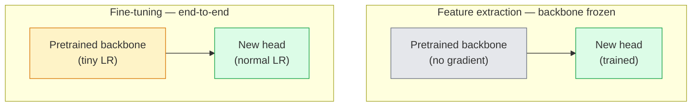

# 迁移学习与微调

> 别人花了一百万 GPU 小时教网络什么是边缘、纹理和物体部件。你应该先借用这些特征，再训练自己的。

**类型：** Build
**语言：** Python
**前置课程：** Phase 4 Lesson 03（CNN）、Phase 4 Lesson 04（图像分类）
**时长：** 约 75 分钟

## 学习目标

- 区分特征提取和微调，并根据数据集大小、领域距离和计算预算选择正确的方案
- 加载预训练 backbone，替换其分类头，仅训练 head 即可在 20 行以内得到一个可用的 baseline
- 用判别性学习率逐步解冻层，使早期通用特征获得比晚期任务特定特征更小的更新
- 诊断三种常见故障：解冻 block 学习率过高导致的特征漂移、小数据集上 BN 统计量崩溃、灾难性遗忘

## 问题

在 ImageNet 上训练一个 ResNet-50 大约需要 2,000 GPU 小时。很少有团队对每个要交付的任务都有这个预算。几乎每个团队实际交付的是一个预训练 backbone 加上一个在几百或几千张任务特定图像上训练的新 head。

这不是走捷径。任何 ImageNet 训练的 CNN 的第一个 conv block 学到的是边缘和 Gabor 类滤波器。接下来几个 block 学纹理和简单图案。中间 block 学物体部件。最后的 block 学开始像 1,000 个 ImageNet 类别的组合。这个层次结构的前 90% 几乎不变地迁移到医学影像、工业检测、卫星数据和其他所有视觉任务——因为自然界的边缘和纹理词汇是有限的。你实际训练的是最后 10%。

把迁移做对有三个 bug 等着你：用过高的学习率破坏预训练特征、冻结太多导致模型信息饥饿、以及让 BatchNorm 的运行统计量漂移到网络其余部分从未学过的小数据集上。这节课故意走过每一个。

## 概念

### 特征提取 vs 微调

两种方案，根据你对预训练特征的信任程度和数据量来选择。



经验法则：

| 数据集大小 | 领域距离 | 方案 |
|-----------|----------|------|
| < 1k 图像 | 接近 ImageNet | 冻结 backbone，只训练 head |
| 1k-10k | 接近 | 冻结前 2-3 个 stage，微调其余 |
| 10k-100k | 任意 | 用判别性 LR 端到端微调 |
| 100k+ | 远 | 微调所有；如果领域足够远，考虑从头训练 |

"接近 ImageNet"大致意味着带有物体内容的自然 RGB 照片。医学 CT 扫描、俯视卫星图像和显微镜图像是远领域——特征仍然有帮助，但你需要让更多层适应。

### 为什么冻结能工作

CNN 学到的 ImageNet 特征并不是专门针对那 1,000 个类别的。它们是专门针对自然图像统计的：特定方向的边缘、纹理、对比度模式、形状基元。这些统计在人类能命名的几乎每个视觉领域都是稳定的。这就是为什么一个在 ImageNet 上训练的模型，只加一个新的线性 head（不微调 backbone）在 CIFAR-10 上零样本评估就能达到 80%+ 准确率。Head 在学习对这个任务该如何加权已经学到的特征。

### 判别性学习率

当你确实解冻时，早期层应该比晚期层训练得更慢。早期层编码你想保留的通用特征；晚期层编码你需要大幅移动的任务特定结构。

```
Typical recipe:

  stage 0 (stem + first group): lr = base_lr / 100    (mostly fixed)
  stage 1:                       lr = base_lr / 10
  stage 2:                       lr = base_lr / 3
  stage 3 (last backbone group): lr = base_lr
  head:                          lr = base_lr  (or slightly higher)
```

在 PyTorch 中这只是传给 optimizer 的参数组列表。一个模型，五个学习率，零额外代码。

### BatchNorm 问题

BN 层持有在 ImageNet 上计算的 `running_mean` 和 `running_var` 缓冲区。如果你的任务有不同的像素分布——不同的光照、不同的传感器、不同的色彩空间——这些缓冲区就是错的。按优先级排列的三个选项：

1. **BN 在 train 模式下微调。** 让 BN 和其他一切一起更新其运行统计量。当任务数据集中等大小（>= 5k 样本）时的默认选择。
2. **冻结 BN 在 eval 模式。** 保持 ImageNet 统计量，只训练权重。当你的数据集小到 BN 的移动平均会有噪声时正确。
3. **用 GroupNorm 替换 BN。** 完全消除移动平均问题。用于每 GPU batch size 很小的检测和分割 backbone。

搞错这个会静默地使准确率下降 5-15%。

### Head 设计

分类头是 1-3 个线性层加一个可选的 dropout。每个 torchvision backbone 都带一个你要替换的默认 head：

```
backbone.fc = nn.Linear(backbone.fc.in_features, num_classes)          # ResNet
backbone.classifier[1] = nn.Linear(..., num_classes)                    # EfficientNet, MobileNet
backbone.heads.head = nn.Linear(..., num_classes)                       # torchvision ViT
```

对于小数据集，单个线性层通常就够了。添加一个隐藏层（Linear -> ReLU -> Dropout -> Linear）在任务分布离 backbone 训练分布较远时有帮助。

### 逐层 LR 衰减

判别性 LR 的更平滑版本，用于现代微调（BEiT、DINOv2、ViT-B 微调）。不是把层分组到 stage，而是给每一层一个比上面那层稍小的 LR：

```
lr_layer_k = base_lr * decay^(L - k)
```

decay = 0.75 且 L = 12 个 transformer block 时，第一个 block 以 `0.75^11 ≈ 0.04x` head 的 LR 训练。对 transformer 微调比对 CNN 更重要，CNN 中按 stage 分组的 LR 通常就够了。

### 该评估什么

迁移学习运行需要两个你在从头训练时不会跟踪的数字：

- **仅预训练准确率** — backbone 冻结时 head 的准确率。这是你的下限。
- **微调后准确率** — 端到端训练后同一模型的准确率。这是你的上限。

如果微调后低于仅预训练，你有学习率或 BN 的 bug。始终打印两者。

## 动手构建

### 第 1 步：加载预训练 backbone 并检查它

```python
import torch
import torch.nn as nn
from torchvision.models import resnet18, ResNet18_Weights

backbone = resnet18(weights=ResNet18_Weights.IMAGENET1K_V1)
print(backbone)
print()
print("classifier head:", backbone.fc)
print("feature dim:", backbone.fc.in_features)
```

`ResNet18` 有四个 stage（`layer1..layer4`）加一个 stem 和一个 `fc` head。每个 torchvision 分类 backbone 都有类似的结构。

### 第 2 步：特征提取——冻结一切，替换 head

```python
def make_feature_extractor(num_classes=10):
    model = resnet18(weights=ResNet18_Weights.IMAGENET1K_V1)
    for p in model.parameters():
        p.requires_grad = False
    model.fc = nn.Linear(model.fc.in_features, num_classes)
    return model

model = make_feature_extractor(num_classes=10)
trainable = sum(p.numel() for p in model.parameters() if p.requires_grad)
frozen = sum(p.numel() for p in model.parameters() if not p.requires_grad)
print(f"trainable: {trainable:>10,}")
print(f"frozen:    {frozen:>10,}")
```

只有 `model.fc` 是可训练的。Backbone 是一个冻结的特征提取器。

### 第 3 步：判别性微调

一个构建带有 stage 特定学习率的参数组的工具函数。

```python
def discriminative_param_groups(model, base_lr=1e-3, decay=0.3):
    stages = [
        ["conv1", "bn1"],
        ["layer1"],
        ["layer2"],
        ["layer3"],
        ["layer4"],
        ["fc"],
    ]
    groups = []
    for i, names in enumerate(stages):
        lr = base_lr * (decay ** (len(stages) - 1 - i))
        params = [p for n, p in model.named_parameters()
                  if any(n.startswith(k) for k in names)]
        if params:
            groups.append({"params": params, "lr": lr, "name": "_".join(names)})
    return groups

model = resnet18(weights=ResNet18_Weights.IMAGENET1K_V1)
model.fc = nn.Linear(model.fc.in_features, 10)
for p in model.parameters():
    p.requires_grad = True

groups = discriminative_param_groups(model)
for g in groups:
    print(f"{g['name']:>10s}  lr={g['lr']:.2e}  params={sum(p.numel() for p in g['params']):>8,}")
```

`decay=0.3` 意味着每个 stage 以下一个的 30% 速率训练。`fc` 得到 `base_lr`，`layer4` 得到 `0.3 * base_lr`，`conv1` 得到 `0.3^5 * base_lr ≈ 0.00243 * base_lr`。听起来极端；经验上它有效。

### 第 4 步：BatchNorm 处理

冻结 BN 运行统计量而不冻结其权重的辅助函数。

```python
def freeze_bn_stats(model):
    for m in model.modules():
        if isinstance(m, (nn.BatchNorm1d, nn.BatchNorm2d, nn.BatchNorm3d)):
            m.eval()
            for p in m.parameters():
                p.requires_grad = False
    return model
```

在每个 epoch 开始设置 `model.train()` 之后调用它。`model.train()` 把所有东西翻到训练模式；这只对 BN 层反转回来。

### 第 5 步：最小端到端微调循环

```python
from torch.optim import SGD
from torch.utils.data import DataLoader
from torch.optim.lr_scheduler import CosineAnnealingLR
import torch.nn.functional as F

def fine_tune(model, train_loader, val_loader, device, epochs=5, base_lr=1e-3, freeze_bn=False):
    model = model.to(device)
    groups = discriminative_param_groups(model, base_lr=base_lr)
    optimizer = SGD(groups, momentum=0.9, weight_decay=1e-4, nesterov=True)
    scheduler = CosineAnnealingLR(optimizer, T_max=epochs)

    for epoch in range(epochs):
        model.train()
        if freeze_bn:
            freeze_bn_stats(model)
        tr_loss, tr_correct, tr_total = 0.0, 0, 0
        for x, y in train_loader:
            x, y = x.to(device), y.to(device)
            logits = model(x)
            loss = F.cross_entropy(logits, y, label_smoothing=0.1)
            optimizer.zero_grad()
            loss.backward()
            optimizer.step()
            tr_loss += loss.item() * x.size(0)
            tr_total += x.size(0)
            tr_correct += (logits.argmax(-1) == y).sum().item()
        scheduler.step()

        model.eval()
        va_total, va_correct = 0, 0
        with torch.no_grad():
            for x, y in val_loader:
                x, y = x.to(device), y.to(device)
                pred = model(x).argmax(-1)
                va_total += x.size(0)
                va_correct += (pred == y).sum().item()
        print(f"epoch {epoch}  train {tr_loss/tr_total:.3f}/{tr_correct/tr_total:.3f}  "
              f"val {va_correct/va_total:.3f}")
    return model
```

用上述配方在 CIFAR-10 上五个 epoch 就能把 `ResNet18-IMAGENET1K_V1` 从约 70% 零样本 linear-probe 准确率提升到约 93% 微调准确率。仅 head 不碰 backbone 会在约 86% 处平台。

### 第 6 步：渐进式解冻

一个从末端向开头每 epoch 解冻一个 stage 的调度。以多几个 epoch 为代价缓解特征漂移。

```python
def progressive_unfreeze_schedule(model):
    stages = ["layer4", "layer3", "layer2", "layer1"]
    yielded = set()

    def start():
        for p in model.parameters():
            p.requires_grad = False
        for p in model.fc.parameters():
            p.requires_grad = True

    def unfreeze(epoch):
        if epoch < len(stages):
            name = stages[epoch]
            yielded.add(name)
            for n, p in model.named_parameters():
                if n.startswith(name):
                    p.requires_grad = True
            return name
        return None

    return start, unfreeze
```

在第一个 epoch 之前调用 `start()` 一次。在每个 epoch 开始时调用 `unfreeze(epoch)`。每当可训练参数集变化时重建 optimizer，否则冻结的参数仍然持有缓存的动量会搞混它。

## 实际使用

对于大多数真实任务，`torchvision.models` + 三行就够了。上面更重的机制在你遇到库默认值无法修复的问题时才重要。

```python
from torchvision.models import resnet50, ResNet50_Weights

model = resnet50(weights=ResNet50_Weights.IMAGENET1K_V2)
model.fc = nn.Linear(model.fc.in_features, num_classes)
optimizer = torch.optim.AdamW(model.parameters(), lr=1e-4, weight_decay=1e-4)
```

另外两个生产级默认选择：

- `timm` 提供约 800 个预训练视觉 backbone，API 一致（`timm.create_model("resnet50", pretrained=True, num_classes=10)`）。对于 torchvision zoo 之外的任何微调，它是标准。
- 对于 transformer，`transformers.AutoModelForImageClassification.from_pretrained(name, num_labels=N)` 给你 ViT / BEiT / DeiT，加载语义和文本模型相同。

## 交付产出

本课产出：

- `outputs/prompt-fine-tune-planner.md` — 一个 prompt，根据数据集大小、领域距离和计算预算选择特征提取 vs 渐进式 vs 端到端微调。
- `outputs/skill-freeze-inspector.md` — 一个 skill，给定 PyTorch 模型，报告哪些参数可训练、哪些 BatchNorm 层在 eval 模式、以及 optimizer 是否实际被喂了可训练参数。

## 练习

1. **（简单）** 在同一合成 CIFAR 数据集上分别以 linear probe（backbone 冻结）和完全微调训练 `ResNet18`。并排报告两个准确率。解释哪个差距告诉你特征迁移得好，哪个告诉你迁移得不好。
2. **（中等）** 故意引入一个 bug：在 backbone stage 上设置 `base_lr = 1e-1` 而不是 head 上。展示训练 loss 爆炸，然后通过应用 `discriminative_param_groups` 辅助函数恢复。记录每个 stage 开始发散的 LR。
3. **（困难）** 取一个医学影像数据集（如 CheXpert-small、PatchCamelyon 或 HAM10000）并比较三种方案：(a) ImageNet 预训练冻结 backbone + 线性 head；(b) ImageNet 预训练端到端微调；(c) 从头训练。报告每种的准确率和计算成本。在什么数据集大小下从头训练开始有竞争力？

## 关键术语

| 术语 | 口语说法 | 实际含义 |
|------|----------|----------|
| 特征提取 | "冻结然后训练 head" | Backbone 参数冻结，只有新分类头接收梯度 |
| 微调 | "端到端重训" | 所有参数可训练，通常用比从头训练小得多的 LR |
| 判别性 LR | "早期层更小的 LR" | Optimizer 参数组中早期 stage LR 是晚期 stage LR 的一个分数 |
| 逐层 LR 衰减 | "平滑 LR 梯度" | 每层 LR 乘以 decay^(L - k)；常见于 transformer 微调 |
| 灾难性遗忘 | "模型丢失了 ImageNet" | 过高的 LR 在新任务信号被学到之前就覆盖了预训练特征 |
| BN 统计量漂移 | "Running mean 是错的" | BatchNorm running_mean/var 在与当前任务不同的分布上计算，静默损害准确率 |
| Linear probe | "冻结 backbone + 线性 head" | 预训练特征的评估——冻结表示之上最佳线性分类器的准确率 |
| 灾难性崩溃 | "所有东西都预测同一个类" | 当微调的 LR 高到在 head 的梯度能稳定之前就破坏了特征时发生 |

## 延伸阅读

- [How transferable are features in deep neural networks? (Yosinski et al., 2014)](https://arxiv.org/abs/1411.1792) — 量化跨层特征可迁移性的论文
- [Universal Language Model Fine-tuning (ULMFiT, Howard & Ruder, 2018)](https://arxiv.org/abs/1801.06146) — 原始的判别性 LR / 渐进式解冻配方；这些想法直接迁移到视觉
- [timm documentation](https://huggingface.co/docs/timm) — 现代视觉 backbone 的参考，以及它们训练时使用的精确微调默认值
- [A Simple Framework for Linear-Probe Evaluation (Kornblith et al., 2019)](https://arxiv.org/abs/1805.08974) — 为什么 linear-probe 准确率重要以及如何正确报告它
