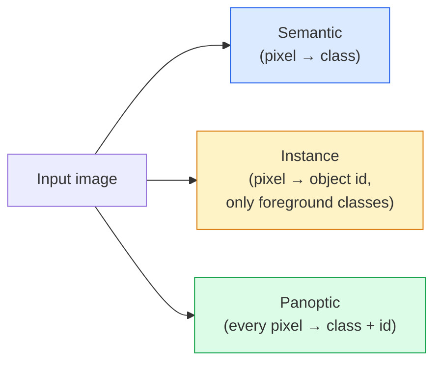
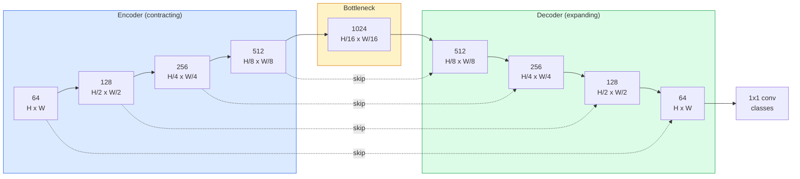

# 语义分割 — U-Net

> 分割就是对每个像素做分类。U-Net 通过将下采样编码器与上采样解码器配对，并在它们之间连接 skip connection 来实现这一点。

**类型：** Build
**语言：** Python
**前置课程：** Phase 4 Lesson 03（CNN）、Phase 4 Lesson 04（图像分类）
**时长：** 约 75 分钟

## 学习目标

- 区分语义分割、实例分割和全景分割，并为给定问题选择正确的任务
- 用 PyTorch 从零构建 U-Net，包括编码器 block、瓶颈层、带转置卷积的解码器和 skip connection
- 实现逐像素 cross-entropy、Dice loss 以及作为当前医学和工业分割默认的组合 loss
- 阅读逐类 IoU 和 Dice 指标，诊断差分数是来自小物体召回率、边界精度还是类别不平衡

## 问题

分类每张图输出一个标签。检测每张图输出少量框。分割每个像素输出一个标签。对于大小为 `H x W` 的输入，输出是形状为 `H x W`（语义）或 `H x W x N_instances`（实例）的张量。那是每张图数百万个预测，不是一个。

分割的结构是它驱动几乎每个密集预测视觉产品的原因：医学影像（肿瘤 mask）、自动驾驶（道路、车道、障碍物）、卫星（建筑轮廓、作物边界）、文档解析（版面区域）、机器人（可抓取区域）。这些任务都不能通过在物体周围画框来解决；它们需要精确的轮廓。

架构问题简单陈述但不简单解决：你需要网络同时看到图像的全局上下文（这是什么类型的场景）和局部像素细节（哪个像素是道路 vs 人行道）。标准 CNN 通过空间压缩来获得上下文，这丢弃了细节。U-Net 是同时获得两者的设计。

## 概念

### 语义 vs 实例 vs 全景



- **语义分割**说"这个像素是道路，那个像素是车。"两辆相邻的车合并成一个 blob。
- **实例分割**说"这个像素是 3 号车，那个像素是 5 号车。"忽略背景 stuff（"stuff" = 天空、道路、草地）。
- **全景分割**统一两者：每个像素得到一个类别标签，每个实例得到一个唯一 id，stuff 和 things 都被分割。

本课覆盖语义分割。下一课（Mask R-CNN）覆盖实例分割。

### U-Net 的形状



编码器四次将空间分辨率减半并将通道翻倍。解码器反过来：四次将空间分辨率翻倍并将通道减半。Skip connection 在每个分辨率将匹配的编码器特征与解码器特征拼接。最终的 1x1 conv 在全分辨率下将 `64 -> num_classes` 映射。

为什么 skip connection 是必要的：解码器在试图输出像素级预测时只看到了小的 feature map。没有 skip 它无法准确定位边缘，因为那些信息在编码器中被压缩掉了。Skip connection 把编码器在下行路上计算的高分辨率 feature map 交给它。

### 转置卷积 vs 双线性上采样

解码器必须扩展空间维度。两个选项：

- **转置卷积**（`nn.ConvTranspose2d`）— 可学习的上采样。历史上 U-Net 的默认。如果 stride 和 kernel size 不能整除会产生棋盘格伪影。
- **双线性上采样 + 3x3 conv** — 平滑上采样后接一个 conv。更少伪影，更少参数，现在是现代默认。

两者都在实际中出现。对于第一个 U-Net，双线性更安全。

### 像素网格上的 Cross-entropy

对于 C 类的语义分割，模型输出是 `(N, C, H, W)`。目标是 `(N, H, W)` 带整数类别 ID。Cross-entropy 与分类情况完全相同，只是在每个空间位置应用：

```
Loss = mean over (n, h, w) of -log( softmax(logits[n, :, h, w])[target[n, h, w]] )
```

PyTorch 中的 `F.cross_entropy` 原生处理这个形状。不需要 reshape。

### Dice loss 及其必要性

Cross-entropy 平等对待每个像素。当一个类别主导画面时这是错的（医学影像：99% 背景，1% 肿瘤）。网络可以通过到处预测背景得到 99% 准确率但仍然无用。

Dice loss 通过直接优化预测和真实 mask 之间的重叠来解决这个问题：

```
Dice(p, y) = 2 * sum(p * y) / (sum(p) + sum(y) + epsilon)
Dice_loss = 1 - Dice
```

其中 `p` 是某个类的 sigmoid/softmax 概率图，`y` 是二值 ground-truth mask。只有重叠完美时 loss 才为零。因为它是基于比率的，类别不平衡无关紧要。

实践中使用**组合 loss**：

```
L = L_cross_entropy + lambda * L_dice       (lambda ~ 1)
```

Cross-entropy 在训练早期给出稳定梯度；Dice 在训练后期聚焦于实际匹配 mask 形状。这个组合是医学影像的默认，在任何类别不平衡数据集上都很难超越。

### 评估指标

- **像素准确率** — 正确预测的像素百分比。便宜。在不平衡数据上和分类中的准确率一样有问题。
- **逐类 IoU** — 每个类的 mask 的 intersection over union；跨类平均 = mIoU。
- **Dice（像素上的 F1）** — 类似 IoU；`Dice = 2 * IoU / (1 + IoU)`。医学影像偏好 Dice，驾驶社区偏好 IoU；它们是单调相关的。
- **边界 F1** — 衡量预测边界与 ground-truth 边界的接近程度，惩罚即使很小的偏移。对半导体检测等高精度任务很重要。

报告逐类 IoU，不只是 mIoU。当九个类在 85% 时，平均 IoU 隐藏了一个在 15% 的类。

### 输入分辨率权衡

U-Net 的编码器四次将分辨率减半，所以输入必须能被 16 整除。医学图像通常是 512x512 或 1024x1024。自动驾驶裁剪是 2048x1024。U-Net 的内存成本随 `H * W * C_max` 缩放，在 1024x1024 配 1024 瓶颈通道时前向传播已经用掉数 GB 显存。

两个标准解决方案：
1. 分块输入——处理带重叠的 256x256 块然后拼接。
2. 用空洞卷积替换瓶颈层，保持更高的空间分辨率同时扩大感受野（DeepLab 家族）。

对于第一个模型，256x256 输入配 64 通道基础的 U-Net 在 8 GB 显存上训练很舒适。

## 动手构建

### 第 1 步：编码器 block

两个 3x3 conv 带 batch norm 和 ReLU。第一个 conv 改变通道数；第二个保持不变。

```python
import torch
import torch.nn as nn
import torch.nn.functional as F

class DoubleConv(nn.Module):
    def __init__(self, in_c, out_c):
        super().__init__()
        self.net = nn.Sequential(
            nn.Conv2d(in_c, out_c, kernel_size=3, padding=1, bias=False),
            nn.BatchNorm2d(out_c),
            nn.ReLU(inplace=True),
            nn.Conv2d(out_c, out_c, kernel_size=3, padding=1, bias=False),
            nn.BatchNorm2d(out_c),
            nn.ReLU(inplace=True),
        )

    def forward(self, x):
        return self.net(x)
```

这个 block 在整个网络中复用。`bias=False` 因为 BN 的 beta 处理偏置。

### 第 2 步：下采样和上采样 block

```python
class Down(nn.Module):
    def __init__(self, in_c, out_c):
        super().__init__()
        self.net = nn.Sequential(
            nn.MaxPool2d(2),
            DoubleConv(in_c, out_c),
        )

    def forward(self, x):
        return self.net(x)


class Up(nn.Module):
    def __init__(self, in_c, out_c):
        super().__init__()
        self.up = nn.Upsample(scale_factor=2, mode="bilinear", align_corners=False)
        self.conv = DoubleConv(in_c, out_c)

    def forward(self, x, skip):
        x = self.up(x)
        if x.shape[-2:] != skip.shape[-2:]:
            x = F.interpolate(x, size=skip.shape[-2:], mode="bilinear", align_corners=False)
        x = torch.cat([skip, x], dim=1)
        return self.conv(x)
```

仅空间形状检查（`shape[-2:]`）处理维度不能被 16 整除的输入；安全的 `F.interpolate` 在 concat 前对齐张量。比较完整形状也会在通道数差异上触发，那应该是一个响亮的错误，而不是静默的 interpolate。

### 第 3 步：U-Net

```python
class UNet(nn.Module):
    def __init__(self, in_channels=3, num_classes=2, base=64):
        super().__init__()
        self.inc = DoubleConv(in_channels, base)
        self.d1 = Down(base, base * 2)
        self.d2 = Down(base * 2, base * 4)
        self.d3 = Down(base * 4, base * 8)
        self.d4 = Down(base * 8, base * 16)
        self.u1 = Up(base * 16 + base * 8, base * 8)
        self.u2 = Up(base * 8 + base * 4, base * 4)
        self.u3 = Up(base * 4 + base * 2, base * 2)
        self.u4 = Up(base * 2 + base, base)
        self.outc = nn.Conv2d(base, num_classes, kernel_size=1)

    def forward(self, x):
        x1 = self.inc(x)
        x2 = self.d1(x1)
        x3 = self.d2(x2)
        x4 = self.d3(x3)
        x5 = self.d4(x4)
        x = self.u1(x5, x4)
        x = self.u2(x, x3)
        x = self.u3(x, x2)
        x = self.u4(x, x1)
        return self.outc(x)

net = UNet(in_channels=3, num_classes=2, base=32)
x = torch.randn(1, 3, 256, 256)
print(f"output: {net(x).shape}")
print(f"params: {sum(p.numel() for p in net.parameters()):,}")
```

输出形状 `(1, 2, 256, 256)` — 与输入相同的空间大小，`num_classes` 个通道。`base=32` 时约 770 万参数。

### 第 4 步：Loss

```python
def dice_loss(logits, targets, num_classes, eps=1e-6):
    probs = F.softmax(logits, dim=1)
    targets_one_hot = F.one_hot(targets, num_classes).permute(0, 3, 1, 2).float()
    dims = (0, 2, 3)
    intersection = (probs * targets_one_hot).sum(dim=dims)
    denom = probs.sum(dim=dims) + targets_one_hot.sum(dim=dims)
    dice = (2 * intersection + eps) / (denom + eps)
    return 1 - dice.mean()


def combined_loss(logits, targets, num_classes, lam=1.0):
    ce = F.cross_entropy(logits, targets)
    dc = dice_loss(logits, targets, num_classes)
    return ce + lam * dc, {"ce": ce.item(), "dice": dc.item()}
```

Dice 逐类计算然后取平均（macro Dice）。`eps` 防止在 batch 中缺失的类上除以零。

### 第 5 步：IoU 指标

```python
@torch.no_grad()
def iou_per_class(logits, targets, num_classes):
    preds = logits.argmax(dim=1)
    ious = torch.zeros(num_classes)
    for c in range(num_classes):
        pred_c = (preds == c)
        true_c = (targets == c)
        inter = (pred_c & true_c).sum().float()
        union = (pred_c | true_c).sum().float()
        ious[c] = (inter / union) if union > 0 else torch.tensor(float("nan"))
    return ious
```

返回长度为 C 的向量。`nan` 标记 batch 中缺失的类——计算 mIoU 时不要对这些取平均。

### 第 6 步：用于端到端验证的合成数据集

在彩色背景上生成形状，使网络必须学习形状而非像素颜色。

```python
import numpy as np
from torch.utils.data import Dataset, DataLoader

def synthetic_segmentation(num_samples=200, size=64, seed=0):
    rng = np.random.default_rng(seed)
    images = np.zeros((num_samples, size, size, 3), dtype=np.float32)
    masks = np.zeros((num_samples, size, size), dtype=np.int64)
    for i in range(num_samples):
        bg = rng.uniform(0, 1, (3,))
        images[i] = bg
        masks[i] = 0
        num_shapes = rng.integers(1, 4)
        for _ in range(num_shapes):
            cls = int(rng.integers(1, 3))
            color = rng.uniform(0, 1, (3,))
            cx, cy = rng.integers(10, size - 10, size=2)
            r = int(rng.integers(4, 12))
            yy, xx = np.meshgrid(np.arange(size), np.arange(size), indexing="ij")
            if cls == 1:
                mask = (xx - cx) ** 2 + (yy - cy) ** 2 < r ** 2
            else:
                mask = (np.abs(xx - cx) < r) & (np.abs(yy - cy) < r)
            images[i][mask] = color
            masks[i][mask] = cls
        images[i] += rng.normal(0, 0.02, images[i].shape)
        images[i] = np.clip(images[i], 0, 1)
    return images, masks


class SegDataset(Dataset):
    def __init__(self, images, masks):
        self.images = images
        self.masks = masks

    def __len__(self):
        return len(self.images)

    def __getitem__(self, i):
        img = torch.from_numpy(self.images[i]).permute(2, 0, 1).float()
        mask = torch.from_numpy(self.masks[i]).long()
        return img, mask
```

三个类：背景 (0)、圆形 (1)、方形 (2)。网络必须学会区分形状。

### 第 7 步：训练循环

```python
def train_one_epoch(model, loader, optimizer, device, num_classes):
    model.train()
    loss_sum, total = 0.0, 0
    iou_sum = torch.zeros(num_classes)
    for x, y in loader:
        x, y = x.to(device), y.to(device)
        logits = model(x)
        loss, _ = combined_loss(logits, y, num_classes)
        optimizer.zero_grad()
        loss.backward()
        optimizer.step()
        loss_sum += loss.item() * x.size(0)
        total += x.size(0)
        iou_sum += iou_per_class(logits, y, num_classes).nan_to_num(0)
    return loss_sum / total, iou_sum / len(loader)
```

在合成数据集上运行 10-30 个 epoch，观察形状类的 mIoU 攀升超过 0.9。注意 `nan_to_num(0)` 将 batch 中缺失的类视为零；要获得准确的逐类 IoU，应按存在性掩码并在评估时跨 batch 使用 `torch.nanmean`，而不是在这里取平均。

## 实际使用

对于生产，`segmentation_models_pytorch`（"smp"）用任何 torchvision 或 timm backbone 包装了每个标准分割架构。三行：

```python
import segmentation_models_pytorch as smp

model = smp.Unet(
    encoder_name="resnet34",
    encoder_weights="imagenet",
    in_channels=3,
    classes=3,
)
```

实际工作中还值得了解：
- **DeepLabV3+** 用空洞 conv 替换基于 max-pool 的下采样，使瓶颈保持分辨率；在卫星和驾驶数据上边界更快。
- **SegFormer** 用层次化 transformer 替换 conv 编码器；当前许多 benchmark 上的 SOTA。
- **Mask2Former** / **OneFormer** 在单一架构中统一语义、实例和全景分割。

三者都是 `smp` 或 `transformers` 中的即插即用替换，使用相同的 data loader。

## 交付产出

本课产出：

- `outputs/prompt-segmentation-task-picker.md` — 一个 prompt，为给定任务在语义、实例和全景分割之间选择并命名架构。
- `outputs/skill-segmentation-mask-inspector.md` — 一个 skill，报告类别分布、预测 mask 统计量，以及哪些类被欠预测或边界模糊。

## 练习

1. **（简单）** 为二值分割任务（前景 vs 背景）实现 `bce_dice_loss`。在合成两类数据集上验证当前景只占 5% 像素时，组合 loss 比单独 BCE 收敛更快。
2. **（中等）** 用 `nn.ConvTranspose2d` 上采样 block 替换 `nn.Upsample + conv` 上采样 block。在合成数据集上训练两者并比较 mIoU。观察转置卷积版本中棋盘格伪影出现在哪里。
3. **（困难）** 取一个真实分割数据集（Oxford-IIIT Pets、Cityscapes mini split 或医学子集）并将 U-Net 训练到与 `smp.Unet` 参考相差 2 个 IoU 点以内。报告逐类 IoU 并识别哪些类从添加 Dice 到 loss 中受益最多。

## 关键术语

| 术语 | 口语说法 | 实际含义 |
|------|----------|----------|
| 语义分割 | "标注每个像素" | 逐像素分类为 C 个类；同类的实例合并 |
| 实例分割 | "标注每个物体" | 分离同类的不同实例；仅前景 |
| 全景分割 | "语义 + 实例" | 每个像素得到一个类；每个 thing 实例也得到一个唯一 id |
| Skip connection | "U-Net 桥" | 将编码器特征拼接到匹配分辨率的解码器特征中；保留高频细节 |
| 转置卷积 | "反卷积" | 可学习的上采样；可能产生棋盘格伪影 |
| Dice loss | "重叠 loss" | 1 - 2\|A ∩ B\| / (\|A\| + \|B\|)；直接优化 mask 重叠，对类别不平衡鲁棒 |
| mIoU | "平均交并比" | 跨类平均 IoU；分割的社区标准指标 |
| 边界 F1 | "边界精度" | 仅在边界像素上计算的 F1 分数；对精度关键任务重要 |

## 延伸阅读

- [U-Net: Convolutional Networks for Biomedical Image Segmentation (Ronneberger et al., 2015)](https://arxiv.org/abs/1505.04597) — 原始论文；人人都抄的那张图在第 2 页
- [Fully Convolutional Networks (Long et al., 2015)](https://arxiv.org/abs/1411.4038) — 首次将分割变成端到端 conv 问题的论文
- [segmentation_models_pytorch](https://github.com/qubvel/segmentation_models.pytorch) — 生产分割的参考；每个标准架构加每个标准 loss
- [Lessons learned from training SOTA segmentation (kaggle.com competitions)](https://www.kaggle.com/code/iafoss/carvana-unet-pytorch) — 关于为什么 TTA、伪标签和类权重在真实数据上重要的演练
