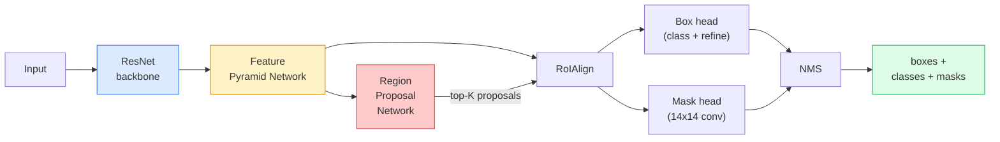

# 实例分割 — Mask R-CNN

> 在 Faster R-CNN 检测器上加一个小小的 mask 分支，就得到了实例分割。难点在于 RoIAlign，而它比看起来要难。

**Type:** Build + Learn
**Languages:** Python
**Prerequisites:** Phase 4 Lesson 06 (YOLO), Phase 4 Lesson 07 (U-Net)
**Time:** ~75 minutes

## 学习目标

- 端到端追踪 Mask R-CNN 架构：backbone、FPN、RPN、RoIAlign、box head、mask head
- 从零实现 RoIAlign，并解释为什么 RoIPool 已经不再使用
- 使用 torchvision 的 `maskrcnn_resnet50_fpn_v2` 预训练模型获取生产级实例 mask，并正确读取其输出格式
- 通过替换 box head 和 mask head 并冻结 backbone，在小型自定义数据集上微调 Mask R-CNN

## 问题背景

语义分割为每个类别生成一个 mask。实例分割为每个物体生成一个 mask，即使两个物体属于同一类别。计数个体、跨帧跟踪、测量物体（墙上每块砖的边界框、显微镜图像中每个细胞）都需要实例分割。

Mask R-CNN（He et al., 2017）将实例分割重新定义为"检测 + mask"。这个设计如此简洁，以至于接下来五年几乎每篇实例分割论文都是 Mask R-CNN 的变体，而 torchvision 的实现至今仍是中小型数据集的生产默认选择。

工程上的核心难题是采样：如何从一个角点不对齐像素边界的 proposal box 中裁剪出固定大小的特征区域？搞错这一步会在所有指标上损失零点几个 mAP。RoIAlign 就是答案。

## 核心概念

### 架构



需要理解五个部分：

1. **Backbone** — 在 ImageNet 上训练的 ResNet-50 或 ResNet-101。产生步幅为 4、8、16、32 的多层级特征图。
2. **FPN（Feature Pyramid Network）** — 自顶向下 + 横向连接，使每个层级都有 C 通道的语义丰富特征。检测时根据目标大小查询对应的 FPN 层级。
3. **RPN（Region Proposal Network）** — 一个小型卷积头，在每个 anchor 位置预测"这里有没有物体？"和"如何修正框？"。每张图像产生约 1000 个 proposal。
4. **RoIAlign** — 从任意 FPN 层级的任意 box 中采样固定大小（如 7x7）的特征块。双线性采样，无量化。
5. **Heads** — 两层 box head 用于修正框和选择类别，加上一个小型卷积头为每个 proposal 输出 `28x28` 的二值 mask。

### 为什么用 RoIAlign 而不是 RoIPool

原始的 Fast R-CNN 使用 RoIPool：将 proposal box 分成网格，取每个格子中的最大特征值，并将所有坐标取整。这种取整会导致特征图与输入像素坐标之间最多偏移一个特征图像素——在 224x224 图像上影响不大，但当特征图步幅为 32 时就是灾难性的。

```
RoIPool:
  box (34.7, 51.3, 98.2, 142.9)
  round -> (34, 51, 98, 142)
  split grid -> round each cell boundary
  misalignment accumulates at every step

RoIAlign:
  box (34.7, 51.3, 98.2, 142.9)
  sample at exact float coordinates using bilinear interpolation
  no rounding anywhere
```

RoIAlign 在 COCO 上免费提升 mask AP 3-4 个点。现在每个关注定位精度的检测器都使用它——YOLOv7 seg、RT-DETR、Mask2Former 皆如此。

### 一段话说清 RPN

在特征图的每个位置放置 K 个不同大小和形状的 anchor box。为每个 anchor 预测一个 objectness 分数和一个回归偏移量，将 anchor 变成更贴合的框。按分数保留前 ~1,000 个框，在 IoU 0.7 处做 NMS，将幸存者交给 head。RPN 用自己的 mini-loss 训练——结构与第 6 课的 YOLO loss 相同，只是只有两个类别（有物体/无物体）。

### Mask head

对每个 proposal（经过 RoIAlign 后），mask head 是一个小型 FCN：四个 3x3 卷积、一个 2x 反卷积、一个最终的 1x1 卷积，输出 `num_classes` 个通道、`28x28` 分辨率。只保留对应预测类别的通道，其余忽略。这将 mask 预测与分类解耦。

将 28x28 的 mask 上采样到 proposal 的原始像素大小，得到最终的二值 mask。

### 损失函数

Mask R-CNN 有四个损失相加：

```
L = L_rpn_cls + L_rpn_box + L_box_cls + L_box_reg + L_mask
```

- `L_rpn_cls`、`L_rpn_box` — RPN proposal 的 objectness + 框回归。
- `L_box_cls` — head 分类器上 (C+1) 类（含背景）的交叉熵。
- `L_box_reg` — head 框修正的 smooth L1。
- `L_mask` — 28x28 mask 输出上的逐像素二值交叉熵。

每个损失有自己的默认权重；torchvision 实现将它们作为构造函数参数暴露。

### 输出格式

`torchvision.models.detection.maskrcnn_resnet50_fpn_v2` 返回一个 dict 列表，每张图像一个：

```
{
    "boxes":  (N, 4) in (x1, y1, x2, y2) pixel coordinates,
    "labels": (N,) class IDs, 0 = background so indices are 1-based,
    "scores": (N,) confidence scores,
    "masks":  (N, 1, H, W) float masks in [0, 1] — threshold at 0.5 for binary,
}
```

mask 已经是完整图像分辨率。28x28 的 head 输出已在内部上采样。

## 动手构建

### Step 1: 从零实现 RoIAlign

这是 Mask R-CNN 中用代码比用文字更容易理解的组件。

```python
import torch
import torch.nn.functional as F

def roi_align_single(feature, box, output_size=7, spatial_scale=1 / 16.0):
    """
    feature: (C, H, W) single-image feature map
    box: (x1, y1, x2, y2) in original image pixel coordinates
    output_size: side of the output grid (7 for box head, 14 for mask head)
    spatial_scale: reciprocal of the feature map stride
    """
    C, H, W = feature.shape
    x1, y1, x2, y2 = [c * spatial_scale - 0.5 for c in box]
    bin_w = (x2 - x1) / output_size
    bin_h = (y2 - y1) / output_size

    grid_y = torch.linspace(y1 + bin_h / 2, y2 - bin_h / 2, output_size)
    grid_x = torch.linspace(x1 + bin_w / 2, x2 - bin_w / 2, output_size)
    yy, xx = torch.meshgrid(grid_y, grid_x, indexing="ij")

    gx = 2 * (xx + 0.5) / W - 1
    gy = 2 * (yy + 0.5) / H - 1
    grid = torch.stack([gx, gy], dim=-1).unsqueeze(0)
    sampled = F.grid_sample(feature.unsqueeze(0), grid, mode="bilinear",
                            align_corners=False)
    return sampled.squeeze(0)
```

每个数值都在双线性采样的位置上。没有取整，没有量化，没有丢失梯度。

### Step 2: 与 torchvision 的 RoIAlign 对比

```python
from torchvision.ops import roi_align

feature = torch.randn(1, 16, 50, 50)
boxes = torch.tensor([[0, 10, 20, 100, 90]], dtype=torch.float32)  # (batch_idx, x1, y1, x2, y2)

ours = roi_align_single(feature[0], boxes[0, 1:].tolist(), output_size=7, spatial_scale=1/4)
theirs = roi_align(feature, boxes, output_size=(7, 7), spatial_scale=1/4, sampling_ratio=1, aligned=True)[0]

print(f"shape ours:   {tuple(ours.shape)}")
print(f"shape theirs: {tuple(theirs.shape)}")
print(f"max|diff|:    {(ours - theirs).abs().max().item():.3e}")
```

在 `sampling_ratio=1` 和 `aligned=True` 的情况下，两者误差在 `1e-5` 以内。

### Step 3: 加载预训练 Mask R-CNN

```python
import torch
from torchvision.models.detection import maskrcnn_resnet50_fpn_v2, MaskRCNN_ResNet50_FPN_V2_Weights

model = maskrcnn_resnet50_fpn_v2(weights=MaskRCNN_ResNet50_FPN_V2_Weights.DEFAULT)
model.eval()
print(f"params: {sum(p.numel() for p in model.parameters()):,}")
print(f"classes (including background): {len(model.roi_heads.box_predictor.cls_score.out_features * [0])}")
```

4600 万参数，91 个类别（COCO）。第一个类别（id 0）是背景；模型实际检测的物体从 id 1 开始。

### Step 4: 运行推理

```python
with torch.no_grad():
    x = torch.randn(3, 400, 600)
    predictions = model([x])
p = predictions[0]
print(f"boxes:  {tuple(p['boxes'].shape)}")
print(f"labels: {tuple(p['labels'].shape)}")
print(f"scores: {tuple(p['scores'].shape)}")
print(f"masks:  {tuple(p['masks'].shape)}")
```

mask 张量的形状是 `(N, 1, H, W)`。在 0.5 处阈值化得到每个物体的二值 mask：

```python
binary_masks = (p['masks'] > 0.5).squeeze(1)  # (N, H, W) boolean
```

### Step 5: 替换 head 以适配自定义类别数

常见的微调方法：复用 backbone、FPN 和 RPN；替换两个分类 head。

```python
from torchvision.models.detection.faster_rcnn import FastRCNNPredictor
from torchvision.models.detection.mask_rcnn import MaskRCNNPredictor

def build_custom_maskrcnn(num_classes):
    model = maskrcnn_resnet50_fpn_v2(weights=MaskRCNN_ResNet50_FPN_V2_Weights.DEFAULT)
    in_features = model.roi_heads.box_predictor.cls_score.in_features
    model.roi_heads.box_predictor = FastRCNNPredictor(in_features, num_classes)
    in_features_mask = model.roi_heads.mask_predictor.conv5_mask.in_channels
    hidden_layer = 256
    model.roi_heads.mask_predictor = MaskRCNNPredictor(in_features_mask, hidden_layer, num_classes)
    return model

custom = build_custom_maskrcnn(num_classes=5)
print(f"custom cls_score.out_features: {custom.roi_heads.box_predictor.cls_score.out_features}")
```

`num_classes` 必须包含背景类，所以有 4 个目标类别的数据集使用 `num_classes=5`。

### Step 6: 冻结不需要训练的部分

在小数据集上，冻结 backbone 和 FPN。只让 RPN 的 objectness + 回归和两个 head 学习。

```python
def freeze_backbone_and_fpn(model):
    # torchvision Mask R-CNN packs the FPN inside `model.backbone` (as
    # `model.backbone.fpn`), so iterating `model.backbone.parameters()` covers
    # both the ResNet feature layers and the FPN lateral/output convs.
    for p in model.backbone.parameters():
        p.requires_grad = False
    return model

custom = freeze_backbone_and_fpn(custom)
trainable = sum(p.numel() for p in custom.parameters() if p.requires_grad)
print(f"trainable after freeze: {trainable:,}")
```

在 500 张图像的数据集上，这是收敛与过拟合之间的区别。

## 实际使用

torchvision 中 Mask R-CNN 的完整训练循环只有 40 行，在不同任务之间几乎不需要改动——换数据集就行。

```python
def train_step(model, images, targets, optimizer):
    model.train()
    loss_dict = model(images, targets)
    losses = sum(loss for loss in loss_dict.values())
    optimizer.zero_grad()
    losses.backward()
    optimizer.step()
    return {k: v.item() for k, v in loss_dict.items()}
```

`targets` 列表必须包含每张图像的 dict，含 `boxes`、`labels` 和 `masks`（作为 `(num_instances, H, W)` 的二值张量）。模型在训练时返回四个损失的 dict，在 eval 时返回预测列表，由 `model.training` 控制。

`pycocotools` 评估器产生 mAP@IoU=0.5:0.95，同时针对 box 和 mask；你需要两个数字来判断瓶颈在 box head 还是 mask head。

## 交付产出

本课产出：

- `outputs/prompt-instance-vs-semantic-router.md` — 一个 prompt，通过三个问题选择 instance vs semantic vs panoptic 以及具体的起始模型。
- `outputs/skill-mask-rcnn-head-swapper.md` — 一个 skill，为任何 torchvision 检测模型生成替换 head 的 10 行代码，给定新的 `num_classes`。

## 练习

1. **（简单）** 在 100 个随机 box 上验证你的 RoIAlign 与 `torchvision.ops.roi_align` 的一致性。报告最大绝对差异。同时运行 RoIPool（2017 年前的行为），展示它在边界附近的 box 上偏差约 1-2 个特征图像素。
2. **（中等）** 在 50 张图像的自定义数据集上微调 `maskrcnn_resnet50_fpn_v2`（任意两个类别：气球、鱼、坑洞、logo）。冻结 backbone，训练 20 个 epoch，报告 mask AP@0.5。
3. **（困难）** 将 Mask R-CNN 的 mask head 替换为预测 56x56 而非 28x28 的版本。测量替换前后的 mAP@IoU=0.75。解释为什么增益（或缺乏增益）符合预期的边界精度/内存权衡。

## 关键术语

| 术语 | 常见说法 | 实际含义 |
|------|---------|---------|
| Mask R-CNN | "检测加 mask" | Faster R-CNN + 一个小型 FCN head，为每个 proposal 的每个类别预测 28x28 的 mask |
| FPN | "特征金字塔" | 自顶向下 + 横向连接，使每个步幅层级都有 C 通道的语义丰富特征 |
| RPN | "区域提议器" | 一个小型卷积头，每张图像产生约 1000 个有/无物体的 proposal |
| RoIAlign | "无取整裁剪" | 从任意浮点坐标 box 中双线性采样固定大小的特征网格 |
| RoIPool | "2017 年前的裁剪" | 与 RoIAlign 目的相同但对 box 坐标取整；已过时 |
| Mask AP | "实例 mAP" | 用 mask IoU 而非 box IoU 计算的平均精度；COCO 实例分割指标 |
| Binary mask head | "逐类别 mask" | 为每个 proposal 的每个类别预测一个二值 mask；只保留预测类别对应的通道 |
| Background class | "Class 0" | 万能的"无物体"类别；真实类别的索引从 1 开始 |

## 延伸阅读

- [Mask R-CNN (He et al., 2017)](https://arxiv.org/abs/1703.06870) — 论文；第 3 节关于 RoIAlign 是关键阅读
- [FPN: Feature Pyramid Networks (Lin et al., 2017)](https://arxiv.org/abs/1612.03144) — FPN 论文；每个现代检测器都使用它
- [torchvision Mask R-CNN tutorial](https://pytorch.org/tutorials/intermediate/torchvision_tutorial.html) — 微调循环的参考
- [Detectron2 model zoo](https://github.com/facebookresearch/detectron2/blob/main/MODEL_ZOO.md) — 几乎每种检测和分割变体的生产实现及训练权重
