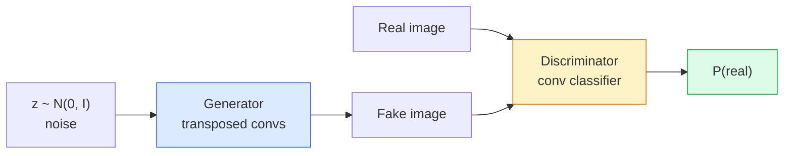
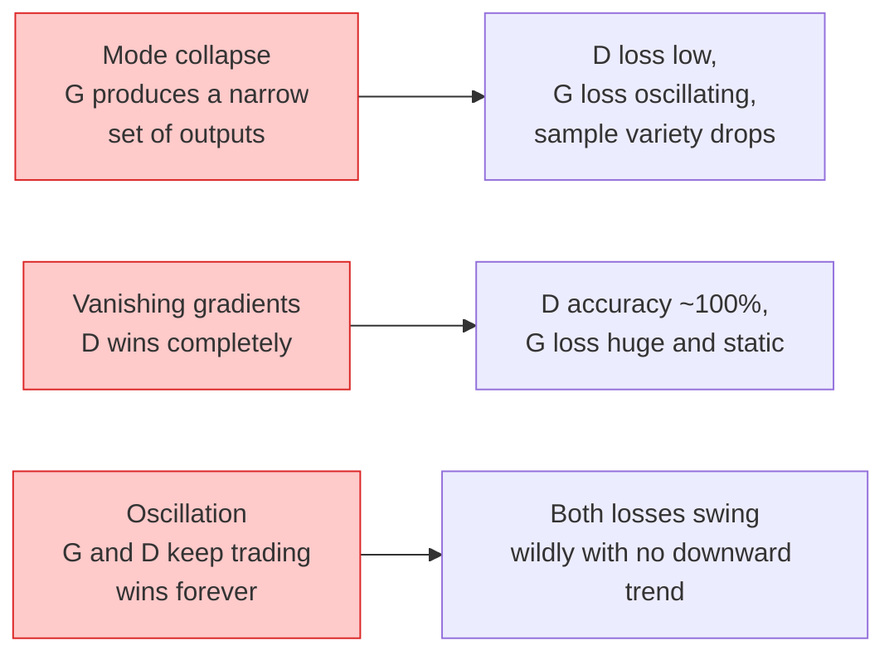

# 图像生成 — GAN

> GAN 是两个神经网络在一个固定博弈中对抗。一个画，一个评。它们一起进步，直到画出来的东西能骗过评判者。

**Type:** Build
**Languages:** Python
**Prerequisites:** Phase 4 Lesson 03 (CNNs), Phase 3 Lesson 06 (Optimizers), Phase 3 Lesson 07 (Regularization)
**Time:** ~75 minutes

## 学习目标

- 解释生成器与判别器之间的 minimax 博弈，以及为什么均衡点对应 p_model = p_data
- 用 PyTorch 实现一个 DCGAN，在 60 行以内生成连贯的 32x32 合成图像
- 用三个标准技巧稳定 GAN 训练：non-saturating loss、spectral norm、TTUR（双时间尺度更新规则）
- 读懂训练曲线，区分健康收敛、mode collapse、振荡和判别器完全获胜

## 问题背景

分类教网络将图像映射到标签。生成反转了这个问题：采样看起来像来自同一分布的新图像。没有"正确"的输出可以对比；只有一个你想模仿的分布。

标准损失函数（MSE、交叉熵）无法衡量"这个样本是否来自真实分布"。最小化逐像素误差产生的是模糊的平均值，而非逼真的样本。突破在于学习损失函数：训练第二个网络来区分真假，用它的判断来推动生成器。

GAN（Goodfellow et al., 2014）定义了这个框架。到 2018 年，StyleGAN 已经能生成与照片无法区分的 1024x1024 人脸。Diffusion model 此后在质量和可控性上夺取了王座，但让 diffusion 实用的每个技巧——归一化选择、潜空间、特征损失——都是先在 GAN 上被理解的。

## 核心概念

### 两个网络



**生成器** G 接收一个噪声向量 `z` 并输出一张图像。**判别器** D 接收一张图像并输出一个标量：该图像为真的概率。

### 博弈

G 想让 D 判断错误。D 想判断正确。形式化表示：

```
min_G max_D  E_x[log D(x)] + E_z[log(1 - D(G(z)))]
```

从右往左读：D 在最大化对真实图像（`log D(real)`）和假图像（`log (1 - D(fake))`）的判断准确率。G 在最小化 D 对假图像的准确率——它希望 `D(G(z))` 尽可能高。

Goodfellow 证明了这个 minimax 有一个全局均衡点：`p_G = p_data`，D 处处输出 0.5，生成分布与真实分布之间的 Jensen-Shannon 散度为零。难的是如何到达那里。

### Non-saturating loss

上面的形式在数值上不稳定。训练早期，每个假图像的 `D(G(z))` 接近零，所以 `log(1 - D(G(z)))` 对 G 的梯度消失。修复方法：翻转 G 的损失。

```
L_D = -E_x[log D(x)] - E_z[log(1 - D(G(z)))]
L_G = -E_z[log D(G(z))]                          # non-saturating
```

现在当 `D(G(z))` 接近零时，G 的损失很大，梯度有信息量。每个现代 GAN 都用这个变体训练。

### DCGAN 架构规则

Radford, Metz, Chintala (2015) 将多年失败实验提炼为五条使 GAN 训练稳定的规则：

1. 用步幅卷积替代池化（两个网络都是）。
2. 在生成器和判别器中都使用 batch norm，除了 G 的输出层和 D 的输入层。
3. 在更深的架构中去掉全连接层。
4. G 在所有层使用 ReLU，输出层除外（用 tanh 使输出在 [-1, 1]）。
5. D 在所有层使用 LeakyReLU（negative_slope=0.2）。

每个现代的基于卷积的 GAN（StyleGAN、BigGAN、GigaGAN）仍然从这些规则出发，逐个替换组件。

### 失败模式及其特征



- **Mode collapse**：G 找到一张能骗过 D 的图像，然后只生成那一张。修复：加 minibatch discrimination、spectral norm 或 label-conditioning。
- **判别器获胜**：D 变强太快，G 的梯度消失。修复：更小的 D、更低的 D 学习率，或对真实标签做 label smoothing。
- **振荡**：两个网络交替获胜，永远不接近均衡。修复：TTUR（D 的学习率比 G 快 2-4 倍），或切换到 Wasserstein loss。

### 评估

GAN 没有 ground truth，怎么知道它在工作？

- **样本检查** — 每个 epoch 结束时看 64 个样本。不可省略。
- **FID（Fréchet Inception Distance）** — 真实集和生成集的 Inception-v3 特征分布之间的距离。越低越好。社区标准。
- **Inception Score** — 更老、更脆弱；优先用 FID。
- **生成模型的 Precision/Recall** — 分别衡量质量（precision）和覆盖度（recall）。比单独的 FID 更有信息量。

对于小型合成数据实验，样本检查就够了。

## 动手构建

### Step 1: 生成器

一个小型 DCGAN 生成器，接收 64 维噪声，产生 32x32 图像。

```python
import torch
import torch.nn as nn

class Generator(nn.Module):
    def __init__(self, z_dim=64, img_channels=3, feat=64):
        super().__init__()
        self.net = nn.Sequential(
            nn.ConvTranspose2d(z_dim, feat * 4, kernel_size=4, stride=1, padding=0, bias=False),
            nn.BatchNorm2d(feat * 4),
            nn.ReLU(inplace=True),
            nn.ConvTranspose2d(feat * 4, feat * 2, kernel_size=4, stride=2, padding=1, bias=False),
            nn.BatchNorm2d(feat * 2),
            nn.ReLU(inplace=True),
            nn.ConvTranspose2d(feat * 2, feat, kernel_size=4, stride=2, padding=1, bias=False),
            nn.BatchNorm2d(feat),
            nn.ReLU(inplace=True),
            nn.ConvTranspose2d(feat, img_channels, kernel_size=4, stride=2, padding=1, bias=False),
            nn.Tanh(),
        )

    def forward(self, z):
        return self.net(z.view(z.size(0), -1, 1, 1))
```

四个转置卷积，每个 `kernel_size=4, stride=2, padding=1`，干净地将空间尺寸翻倍。输出通过 tanh 激活在 [-1, 1] 范围内。

### Step 2: 判别器

生成器的镜像。LeakyReLU，步幅卷积，以标量 logit 结束。

```python
class Discriminator(nn.Module):
    def __init__(self, img_channels=3, feat=64):
        super().__init__()
        self.net = nn.Sequential(
            nn.Conv2d(img_channels, feat, kernel_size=4, stride=2, padding=1),
            nn.LeakyReLU(0.2, inplace=True),
            nn.Conv2d(feat, feat * 2, kernel_size=4, stride=2, padding=1, bias=False),
            nn.BatchNorm2d(feat * 2),
            nn.LeakyReLU(0.2, inplace=True),
            nn.Conv2d(feat * 2, feat * 4, kernel_size=4, stride=2, padding=1, bias=False),
            nn.BatchNorm2d(feat * 4),
            nn.LeakyReLU(0.2, inplace=True),
            nn.Conv2d(feat * 4, 1, kernel_size=4, stride=1, padding=0),
        )

    def forward(self, x):
        return self.net(x).view(-1)
```

最后一个卷积将 `4x4` 特征图缩减为 `1x1`。输出是每张图像一个标量；sigmoid 只在计算损失时应用。

### Step 3: 训练步骤

交替进行：每个 batch 先更新 D 一次，再更新 G 一次。

```python
import torch.nn.functional as F

def train_step(G, D, real, z, opt_g, opt_d, device):
    real = real.to(device)
    bs = real.size(0)

    # D step
    opt_d.zero_grad()
    d_real = D(real)
    d_fake = D(G(z).detach())
    loss_d = (F.binary_cross_entropy_with_logits(d_real, torch.ones_like(d_real))
              + F.binary_cross_entropy_with_logits(d_fake, torch.zeros_like(d_fake)))
    loss_d.backward()
    opt_d.step()

    # G step
    opt_g.zero_grad()
    d_fake = D(G(z))
    loss_g = F.binary_cross_entropy_with_logits(d_fake, torch.ones_like(d_fake))
    loss_g.backward()
    opt_g.step()

    return loss_d.item(), loss_g.item()
```

D 步骤中的 `G(z).detach()` 至关重要：我们不希望梯度在 D 更新时流入 G。忘记这一点是经典的新手 bug。

### Step 4: 在合成形状上的完整训练循环

```python
from torch.utils.data import DataLoader, TensorDataset
import numpy as np

def synthetic_images(num=2000, size=32, seed=0):
    rng = np.random.default_rng(seed)
    imgs = np.zeros((num, 3, size, size), dtype=np.float32) - 1.0
    for i in range(num):
        r = rng.uniform(6, 12)
        cx, cy = rng.uniform(r, size - r, size=2)
        yy, xx = np.meshgrid(np.arange(size), np.arange(size), indexing="ij")
        mask = (xx - cx) ** 2 + (yy - cy) ** 2 < r ** 2
        color = rng.uniform(-0.5, 1.0, size=3)
        for c in range(3):
            imgs[i, c][mask] = color[c]
    return torch.from_numpy(imgs)

device = "cuda" if torch.cuda.is_available() else "cpu"
data = synthetic_images()
loader = DataLoader(TensorDataset(data), batch_size=64, shuffle=True)

G = Generator(z_dim=64, img_channels=3, feat=32).to(device)
D = Discriminator(img_channels=3, feat=32).to(device)
opt_g = torch.optim.Adam(G.parameters(), lr=2e-4, betas=(0.5, 0.999))
opt_d = torch.optim.Adam(D.parameters(), lr=2e-4, betas=(0.5, 0.999))

for epoch in range(10):
    for (batch,) in loader:
        z = torch.randn(batch.size(0), 64, device=device)
        ld, lg = train_step(G, D, batch, z, opt_g, opt_d, device)
    print(f"epoch {epoch}  D {ld:.3f}  G {lg:.3f}")
```

`Adam(lr=2e-4, betas=(0.5, 0.999))` 是 DCGAN 的默认设置——低 beta1 防止动量项过度稳定对抗博弈。

### Step 5: 采样

```python
@torch.no_grad()
def sample(G, n=16, z_dim=64, device="cpu"):
    G.eval()
    z = torch.randn(n, z_dim, device=device)
    imgs = G(z)
    imgs = (imgs + 1) / 2
    return imgs.clamp(0, 1)
```

采样前务必切换到 eval 模式。对 DCGAN 来说这很重要，因为 batch norm 会使用 running stats 而非当前 batch 的统计量。

### Step 6: Spectral normalisation

判别器中 BN 的即插即用替代品，保证网络是 1-Lipschitz 的。修复大多数"D 赢得太彻底"的问题。

```python
from torch.nn.utils import spectral_norm

def build_sn_discriminator(img_channels=3, feat=64):
    return nn.Sequential(
        spectral_norm(nn.Conv2d(img_channels, feat, 4, 2, 1)),
        nn.LeakyReLU(0.2, inplace=True),
        spectral_norm(nn.Conv2d(feat, feat * 2, 4, 2, 1)),
        nn.LeakyReLU(0.2, inplace=True),
        spectral_norm(nn.Conv2d(feat * 2, feat * 4, 4, 2, 1)),
        nn.LeakyReLU(0.2, inplace=True),
        spectral_norm(nn.Conv2d(feat * 4, 1, 4, 1, 0)),
    )
```

将 `Discriminator` 换成 `build_sn_discriminator()` 后，通常不再需要 TTUR 技巧。Spectral norm 是你能应用的最简单的单一鲁棒性升级。

## 实际使用

对于严肃的生成任务，使用预训练权重或切换到 diffusion。两个标准库：

- `torch_fidelity` 无需编写自定义评估代码即可计算生成器的 FID / IS。
- `pytorch-gan-zoo`（遗留）和 `StudioGAN` 提供经过测试的 DCGAN、WGAN-GP、SN-GAN、StyleGAN 和 BigGAN 实现。

在 2026 年，GAN 仍然是以下场景的最佳选择：实时图像生成（延迟 <10 ms）、风格迁移、精确控制的图像到图像转换（Pix2Pix、CycleGAN）。Diffusion 在照片级真实感和文本条件生成上胜出。

## 交付产出

本课产出：

- `outputs/prompt-gan-training-triage.md` — 一个 prompt，读取训练曲线描述并判断失败模式（mode collapse、D-wins、振荡）以及推荐的单一修复方案。
- `outputs/skill-dcgan-scaffold.md` — 一个 skill，根据 `z_dim`、目标 `image_size` 和 `num_channels` 生成 DCGAN 脚手架，包含训练循环和样本保存。

## 练习

1. **（简单）** 在合成圆形数据集上训练上述 DCGAN，每个 epoch 结束时保存 16 个样本的网格。到第几个 epoch 生成的圆形变得明显是圆的？
2. **（中等）** 将判别器的 batch norm 替换为 spectral norm。并行训练两个版本。哪个收敛更快？哪个在三个种子上的方差更低？
3. **（困难）** 实现一个 conditional DCGAN：将类别标签同时输入 G 和 D（在 G 中将 one-hot 拼接到噪声，在 D 中拼接一个类别嵌入通道）。在第 7 课的合成"圆形 vs 方形"数据集上训练，通过指定标签采样来证明类别条件生效。

## 关键术语

| 术语 | 常见说法 | 实际含义 |
|------|---------|---------|
| Generator (G) | "画东西的网络" | 将噪声映射为图像；训练目标是骗过判别器 |
| Discriminator (D) | "评判者" | 二分类器；训练目标是区分真实图像和生成图像 |
| Minimax | "博弈" | 对 G 取 min、对 D 取 max 的对抗损失；均衡点是 p_G = p_data |
| Non-saturating loss | "数值稳定版本" | G 的损失是 -log(D(G(z))) 而非 log(1 - D(G(z)))，避免训练早期梯度消失 |
| Mode collapse | "生成器只做一件事" | G 只产生数据分布的一小部分；用 SN、minibatch discrimination 或更大 batch 修复 |
| TTUR | "两个学习率" | D 的学习率比 G 快，通常快 2-4 倍；稳定训练 |
| Spectral norm | "1-Lipschitz 层" | 一种权重归一化，约束每层的 Lipschitz 常数；阻止 D 变得任意陡峭 |
| FID | "Fréchet Inception Distance" | 真实集和生成集的 Inception-v3 特征分布之间的距离；标准评估指标 |

## 延伸阅读

- [Generative Adversarial Networks (Goodfellow et al., 2014)](https://arxiv.org/abs/1406.2661) — 开创一切的论文
- [DCGAN (Radford, Metz, Chintala, 2015)](https://arxiv.org/abs/1511.06434) — 使 GAN 可训练的架构规则
- [Spectral Normalization for GANs (Miyato et al., 2018)](https://arxiv.org/abs/1802.05957) — 最有用的单一稳定化技巧
- [StyleGAN3 (Karras et al., 2021)](https://arxiv.org/abs/2106.12423) — SOTA GAN；读起来像过去十年所有技巧的精选集
