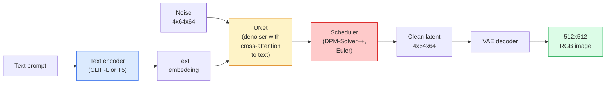

# Stable Diffusion — 架构与微调

> Stable Diffusion 是一个在预训练 VAE 的潜空间中运行的 DDPM，通过 cross-attention 以文本为条件，用快速确定性 ODE 求解器采样，并由 classifier-free guidance 引导。

**Type:** Learn + Use
**Languages:** Python
**Prerequisites:** Phase 4 Lesson 10 (Diffusion), Phase 7 Lesson 02 (Self-Attention)
**Time:** ~75 minutes

## 学习目标

- 追踪 Stable Diffusion pipeline 的五个组件：VAE、文本编码器、U-Net、scheduler、safety checker——以及它们各自的作用
- 解释 latent diffusion 以及为什么在 4x64x64 潜空间（而非 3x512x512 图像）中训练可以将计算量减少 48 倍而不损失质量
- 使用 `diffusers` 生成图像、运行 image-to-image、inpainting 和 ControlNet 引导生成
- 用 LoRA 在小型自定义数据集上微调 Stable Diffusion，并在推理时加载 LoRA adapter

## 问题背景

直接在 512x512 RGB 图像上训练 DDPM 代价高昂。每个训练步骤都要通过一个看到 3x512x512 = 786,432 个输入值的 U-Net 做反向传播，采样需要 50+ 次前向传播通过同一个 U-Net。以 Stable Diffusion 1.5（2022 年发布）的质量水平，像素空间 diffusion 大约需要 256 个 GPU-月的训练时间，在消费级 GPU 上每张图像 10-30 秒。

使开放权重文本到图像模型变得实用的技巧是 **latent diffusion**（Rombach et al., CVPR 2022）。训练一个 VAE 将 3x512x512 图像映射到 4x64x64 潜张量再映射回来，然后在该潜空间中做 diffusion。计算量下降 `(3*512*512)/(4*64*64) = 48` 倍。采样从数十秒降到同一 GPU 上不到两秒。

几乎每个现代图像生成模型——SDXL、SD3、FLUX、HunyuanDiT、Wan-Video——都是 latent diffusion model，只是在自编码器、去噪器（U-Net 或 DiT）和文本条件上有所变化。学会 Stable Diffusion 就学会了模板。

## 核心概念

### Pipeline



- **VAE** — 冻结的自编码器。编码器将图像转为潜变量（用于 img2img 和训练）。解码器将潜变量转回图像。
- **文本编码器** — CLIP 文本编码器（SD 1.x/2.x）、CLIP-L + CLIP-G（SDXL）或 T5-XXL（SD3/FLUX）。产生一个 token embedding 序列。
- **U-Net** — 去噪器。在每个分辨率层级都有 cross-attention 层，从潜变量 attend 到文本 embedding。
- **Scheduler** — 采样算法（DDIM、Euler、DPM-Solver++）。选择 sigma，将预测噪声混合回潜变量。
- **Safety checker** — 可选的 NSFW / 违规内容过滤器，作用于输出图像。

### Classifier-free guidance (CFG)

普通文本条件学习 `epsilon_theta(x_t, t, c)` 对每个 prompt `c`。CFG 训练同一网络时 10% 的时间丢弃 `c`（替换为空 embedding），使单一模型同时预测条件和无条件噪声。推理时：

```
eps = eps_uncond + w * (eps_cond - eps_uncond)
```

`w` 是 guidance scale。`w=0` 是无条件，`w=1` 是普通条件，`w>1` 将输出推向"更受 prompt 条件约束"但牺牲多样性。SD 默认 `w=7.5`。

CFG 是文本到图像能达到生产质量的原因。没有它，prompt 对输出的影响很弱；有了它，prompt 主导一切。

### 潜空间几何

VAE 的 4 通道潜变量不仅仅是压缩图像。它是一个流形，其中的算术大致对应语义编辑（prompt engineering + 插值都在这里），diffusion U-Net 的全部建模预算都花在这里。解码一个随机的 4x64x64 潜变量不会产生随机外观的图像——它产生垃圾，因为只有潜变量的特定子流形才能解码为有效图像。

两个推论：

1. **Img2img** = 将图像编码为潜变量，加部分噪声，运行去噪器，解码。图像结构得以保留因为编码近似可逆；内容根据 prompt 改变。
2. **Inpainting** = 与 img2img 相同，但去噪器只更新被 mask 的区域；未 mask 区域保持在编码后的潜变量。

### U-Net 架构

SD 的 U-Net 是第 10 课 TinyUNet 的大版本，增加了三个东西：

- **Transformer blocks** 在每个空间分辨率上，包含 self-attention + 到文本 embedding 的 cross-attention。
- **Time embedding** 通过 MLP 处理正弦编码。
- **Skip connections** 在匹配分辨率的编码器和解码器之间。

SD 1.5 总参数量：约 8.6 亿。SDXL：约 26 亿。FLUX：约 120 亿。参数量的跳跃主要在 attention 层。

### LoRA 微调

完整微调 Stable Diffusion 需要 20+ GB 显存并更新 8.6 亿参数。LoRA（Low-Rank Adaptation）保持基础模型冻结，在 attention 层注入小的秩分解矩阵。SD 的 LoRA adapter 通常 10-50 MB，在单张消费级 GPU 上训练 10-60 分钟，推理时作为即插即用的修改加载。

```
Original: W_q : (d_in, d_out)   frozen
LoRA:     W_q + alpha * (A @ B)   where A : (d_in, r), B : (r, d_out)

r is typically 4-32.
```

LoRA 是几乎所有社区微调的分发方式。CivitAI 和 Hugging Face 上托管了数百万个。

### 你会遇到的 Scheduler

- **DDIM** — 确定性，约 50 步，简单。
- **Euler ancestral** — 随机，30-50 步，样本略有创意。
- **DPM-Solver++ 2M Karras** — 确定性，20-30 步，生产默认。
- **LCM / TCD / Turbo** — consistency model 和蒸馏变体；1-4 步但牺牲一些质量。

在 `diffusers` 中切换 scheduler 只需一行代码，有时无需重新训练就能修复采样问题。

## 动手构建

本课端到端使用 `diffusers`，而非从零重建 Stable Diffusion。你需要重建的组件（VAE、文本编码器、U-Net、scheduler）是各自课程的主题；这里的目标是熟练使用生产 API。

### Step 1: 文本到图像

```python
import torch
from diffusers import StableDiffusionPipeline

pipe = StableDiffusionPipeline.from_pretrained(
    "runwayml/stable-diffusion-v1-5",
    torch_dtype=torch.float16,
).to("cuda")

image = pipe(
    prompt="a dog riding a skateboard in tokyo, studio ghibli style",
    guidance_scale=7.5,
    num_inference_steps=25,
    generator=torch.Generator("cuda").manual_seed(42),
).images[0]
image.save("dog.png")
```

`float16` 将显存减半且无可见质量损失。`num_inference_steps=25` 配合默认的 DPM-Solver++ 等效于 DDIM 的 `num_inference_steps=50`。

### Step 2: 切换 scheduler

```python
from diffusers import DPMSolverMultistepScheduler, EulerAncestralDiscreteScheduler

pipe.scheduler = DPMSolverMultistepScheduler.from_config(pipe.scheduler.config)
pipe.scheduler = EulerAncestralDiscreteScheduler.from_config(pipe.scheduler.config)
```

Scheduler 状态与 U-Net 权重解耦。你可以用 DDPM 训练，用任何 scheduler 采样。

### Step 3: Image-to-image

```python
from diffusers import StableDiffusionImg2ImgPipeline
from PIL import Image

img2img = StableDiffusionImg2ImgPipeline.from_pretrained(
    "runwayml/stable-diffusion-v1-5",
    torch_dtype=torch.float16,
).to("cuda")

init_image = Image.open("dog.png").convert("RGB").resize((512, 512))
out = img2img(
    prompt="a dog riding a skateboard, oil painting",
    image=init_image,
    strength=0.6,
    guidance_scale=7.5,
).images[0]
```

`strength` 是去噪前添加多少噪声（0.0 = 不变，1.0 = 完全重新生成）。0.5-0.7 是风格迁移的标准范围。

### Step 4: Inpainting

```python
from diffusers import StableDiffusionInpaintPipeline

inpaint = StableDiffusionInpaintPipeline.from_pretrained(
    "runwayml/stable-diffusion-inpainting",
    torch_dtype=torch.float16,
).to("cuda")

image = Image.open("dog.png").convert("RGB").resize((512, 512))
mask = Image.open("dog_mask.png").convert("L").resize((512, 512))

out = inpaint(
    prompt="a cat",
    image=image,
    mask_image=mask,
    guidance_scale=7.5,
).images[0]
```

mask 中的白色像素是要重新生成的区域。黑色像素被保留。

### Step 5: LoRA 加载

```python
pipe.load_lora_weights("sayakpaul/sd-lora-ghibli")
pipe.fuse_lora(lora_scale=0.8)

image = pipe(prompt="a village square in ghibli style").images[0]
```

`lora_scale` 控制强度；0.0 = 无效果，1.0 = 完全效果。`fuse_lora` 将 adapter 就地融合到权重中以提速，但阻止切换。加载不同 adapter 前调用 `pipe.unfuse_lora()`。

### Step 6: LoRA 训练（概要）

真正的 LoRA 训练在 `peft` 或 `diffusers.training` 中。大纲：

```python
# Pseudocode
for step, batch in enumerate(dataloader):
    images, prompts = batch
    latents = vae.encode(images).latent_dist.sample() * 0.18215

    t = torch.randint(0, num_train_timesteps, (batch_size,))
    noise = torch.randn_like(latents)
    noisy_latents = scheduler.add_noise(latents, noise, t)

    text_emb = text_encoder(tokenizer(prompts))

    pred_noise = unet(noisy_latents, t, text_emb)  # LoRA weights injected here

    loss = F.mse_loss(pred_noise, noise)
    loss.backward()
    optimizer.step()
```

只有 LoRA 矩阵接收梯度；基础 U-Net、VAE 和文本编码器都是冻结的。batch size 为 1 加上 gradient checkpointing 可以在 8 GB 显存中运行。

## 实际使用

在生产中，你实际要做的决策：

- **模型系列**：SD 1.5 用于开源社区微调，SDXL 用于更高保真度，SD3 / FLUX 用于最先进水平和严格许可要求。
- **Scheduler**：DPM-Solver++ 2M Karras 用于 20-30 步，LCM-LoRA 用于延迟低于 1 秒的场景。
- **精度**：4080/4090 上用 `float16`，A100 及更新上用 `bfloat16`，显存紧张时用 `int8`（通过 `bitsandbytes` 或 `compel`）。
- **条件控制**：纯文本可以工作；需要更强控制时，在基础 pipeline 上加 ControlNet（canny、depth、pose）。

批量生成方面，`AUTO1111` / `ComfyUI` 是社区工具；生产 API 方面，`diffusers` + `accelerate` 或 `optimum-nvidia` 配合 TensorRT 编译。

## 交付产出

本课产出：

- `outputs/prompt-sd-pipeline-planner.md` — 一个 prompt，根据延迟预算、保真度目标和许可约束选择 SD 1.5 / SDXL / SD3 / FLUX 加上 scheduler 和精度。
- `outputs/skill-lora-training-setup.md` — 一个 skill，为自定义数据集编写完整的 LoRA 训练配置，包括 caption、rank、batch size 和学习率。

## 练习

1. **（简单）** 用 `guidance_scale` 在 `[1, 3, 5, 7.5, 10, 15]` 中生成相同 prompt。描述图像如何变化。在什么 guidance 值时出现伪影？
2. **（中等）** 取任意真实照片，用 `StableDiffusionImg2ImgPipeline` 在 `strength` 为 `[0.2, 0.4, 0.6, 0.8, 1.0]` 时运行。哪个 strength 在改变风格的同时保留构图？为什么 1.0 完全忽略输入？
3. **（困难）** 在 10-20 张单一主体（宠物、logo、角色）的图像上训练 LoRA，并生成该主体在新场景中的图像。报告产生最佳身份保持而不过拟合输入图像的 LoRA rank 和训练步数。

## 关键术语

| 术语 | 常见说法 | 实际含义 |
|------|---------|---------|
| Latent diffusion | "在潜空间做 diffusion" | 在 VAE 潜空间（4x64x64）而非像素空间（3x512x512）中运行整个 DDPM；节省 48 倍计算 |
| VAE scale factor | "0.18215" | 将 VAE 原始潜变量重新缩放到大约单位方差的常数；硬编码在每个 SD pipeline 中 |
| Classifier-free guidance | "CFG" | 混合条件和无条件噪声预测；最有影响力的单一推理旋钮 |
| Scheduler | "采样器" | 将噪声 + 模型预测转化为去噪潜变量轨迹的算法 |
| LoRA | "低秩 adapter" | 微调 attention 层的小秩分解矩阵，不触碰基础权重 |
| Cross-attention | "文本-图像 attention" | 从潜变量 token 到文本 token 的 attention；在每个 U-Net 层级注入 prompt 信息 |
| ControlNet | "结构条件" | 单独训练的 adapter，用额外输入（canny、depth、pose、segmentation）引导 SD |
| DPM-Solver++ | "默认 scheduler" | 二阶确定性 ODE 求解器；2026 年低步数（20-30）下质量最佳 |

## 延伸阅读

- [High-Resolution Image Synthesis with Latent Diffusion (Rombach et al., 2022)](https://arxiv.org/abs/2112.10752) — Stable Diffusion 论文；包含证明设计合理性的所有消融实验
- [Classifier-Free Diffusion Guidance (Ho & Salimans, 2022)](https://arxiv.org/abs/2207.12598) — CFG 论文
- [LoRA: Low-Rank Adaptation of Large Language Models (Hu et al., 2021)](https://arxiv.org/abs/2106.09685) — LoRA 最初是 NLP 的；几乎无需修改就迁移到了 SD
- [diffusers documentation](https://huggingface.co/docs/diffusers) — 每个 SD / SDXL / SD3 / FLUX pipeline 的参考
