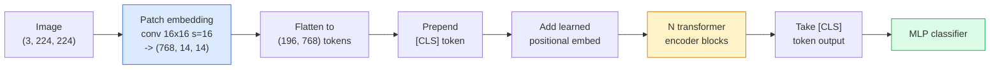

# Vision Transformer (ViT)

> 把图像切成 patch，把每个 patch 当作一个词，跑一个标准 transformer。不要回头看。

**Type:** Build
**Languages:** Python
**Prerequisites:** Phase 7 Lesson 02 (Self-Attention), Phase 4 Lesson 04 (Image Classification)
**Time:** ~45 minutes

## 学习目标

- 从零实现 patch embedding、learned positional embedding、class token 和 transformer encoder block，构建一个最小的 ViT
- 解释为什么 ViT 曾被认为需要海量预训练数据，直到 DeiT 和 MAE 证明并非如此
- 比较 ViT、Swin 和 ConvNeXt 的架构先验（无、局部窗口 attention、卷积 backbone）
- 使用 `timm` 在小数据集上微调预训练 ViT，采用标准的 linear-probe / fine-tune 方案

## 问题背景

十年来，卷积就是计算机视觉的代名词。CNN 有强大的归纳偏置——局部性、平移等变性——没人觉得能替代。然后 Dosovitskiy et al.（2020）展示了一个普通 transformer 应用于展平的图像 patch，完全没有卷积机制，在规模上可以匹配或击败最好的 CNN。

问题在于"在规模上"。ViT 在 ImageNet-1k 上输给了 ResNet。ViT 在 ImageNet-21k 或 JFT-300M 上预训练再在 ImageNet-1k 上微调则击败了它。结论是 transformer 缺乏有用的先验但能从足够多的数据中学到。后续工作（DeiT、MAE、DINO）表明，有了正确的训练方案——强数据增强、自监督预训练、蒸馏——ViT 在小数据上也能训练好。

到 2026 年，纯 CNN 在边缘设备上仍有竞争力（ConvNeXt 最强），但 transformer 主导其他一切：分割（Mask2Former、SegFormer）、检测（DETR、RT-DETR）、多模态（CLIP、SigLIP）、视频（VideoMAE、VJEPA）。ViT block 结构是必须掌握的。

## 核心概念

### Pipeline



七个步骤。Patch -> token -> attention -> 分类器。每个变体（DeiT、Swin、ConvNeXt、MAE 预训练）改变七步中的一两步，其余不变。

### Patch embedding

第一个卷积是关键。Kernel size 16，stride 16，所以 224x224 图像变成 14x14 的网格，每个 16x16 patch 投影到 768 维 embedding。这一个卷积同时完成了分 patch 和线性投影。

```
Input:  (3, 224, 224)
Conv (3 -> 768, k=16, s=16, no padding):
Output: (768, 14, 14)
Flatten spatial: (196, 768)
```

196 个 patch = 196 个 token。每个 token 的特征维度是 768（ViT-B）、1024（ViT-L）或 1280（ViT-H）。

### Class token

一个学习到的向量，前置到序列中：

```
tokens = [CLS; patch_1; patch_2; ...; patch_196]   shape (197, 768)
```

经过 N 个 transformer block 后，`[CLS]` 的输出就是全局图像表示。分类头只读这一个向量。

### Positional embedding

Transformer 没有内置的空间位置概念。给每个 token 加一个学习到的向量：

```
tokens = tokens + learned_pos_embedding   (also shape (197, 768))
```

该 embedding 是模型的参数；基于梯度的训练使其适应 2D 图像结构。正弦 2D 替代方案存在但实践中很少使用。

### Transformer encoder block

标准结构。Multi-head self-attention、MLP、残差连接、pre-LayerNorm。

```
x = x + MSA(LN(x))
x = x + MLP(LN(x))

MLP is two-layer with GELU: Linear(d -> 4d) -> GELU -> Linear(4d -> d)
```

ViT-B/16 堆叠 12 个这样的 block，每个有 12 个 attention head，总计 8600 万参数。

### 为什么用 pre-LN

早期 transformer 使用 post-LN（`x = LN(x + sublayer(x))`），在没有 warmup 的情况下难以训练超过 6-8 层。Pre-LN（`x = x + sublayer(LN(x))`）无需 warmup 就能稳定训练更深的网络。每个 ViT 和每个现代 LLM 都使用 pre-LN。

### Patch size 权衡

- 16x16 patch -> 196 个 token，标准。
- 32x32 patch -> 49 个 token，更快但分辨率更低。
- 8x8 patch -> 784 个 token，更精细但 O(n^2) attention 成本扩展很差。

更大的 patch = 更少的 token = 更快但空间细节更少。SwinV2 在层次窗口中使用 4x4 patch。

### DeiT 在 ImageNet-1k 上训练 ViT 的方案

原始 ViT 需要 JFT-300M 才能击败 CNN。DeiT（Touvron et al., 2020）仅在 ImageNet-1k 上将 ViT-B 训练到 81.8% top-1，靠四个改变：

1. 强数据增强：RandAugment、Mixup、CutMix、Random Erasing。
2. Stochastic depth（训练时随机丢弃整个 block）。
3. Repeated augmentation（同一图像在每个 batch 中采样 3 次）。
4. 从 CNN teacher 蒸馏（可选，进一步提升精度）。

每个现代 ViT 训练方案都源自 DeiT。

### Swin vs ConvNeXt

- **Swin**（Liu et al., 2021）— 基于窗口的 attention。每个 block 在局部窗口内 attend；交替 block 移动窗口以跨窗口混合信息。在保持 attention 算子的同时带回了类似 CNN 的局部性先验。
- **ConvNeXt**（Liu et al., 2022）— 重新设计的 CNN，匹配 Swin 的架构选择（depthwise conv、LayerNorm、GELU、inverted bottleneck）。证明了差距不在于"attention vs 卷积"而在于"现代训练方案 + 架构"。

2026 年，ConvNeXt-V2 和 Swin-V2 都是生产级的；正确选择取决于你的推理栈（ConvNeXt 在边缘编译更好）和预训练语料。

### MAE 预训练

Masked Autoencoder（He et al., 2022）：随机 mask 75% 的 patch，训练编码器只处理可见的 25%，训练一个小解码器从编码器输出重建被 mask 的 patch。预训练后丢弃解码器，微调编码器。

MAE 使 ViT 仅在 ImageNet-1k 上就能训练，达到 SOTA，是当前默认的自监督方案。

## 动手构建

### Step 1: Patch embedding

```python
import torch
import torch.nn as nn

class PatchEmbedding(nn.Module):
    def __init__(self, in_channels=3, patch_size=16, dim=192, image_size=64):
        super().__init__()
        assert image_size % patch_size == 0
        self.proj = nn.Conv2d(in_channels, dim, kernel_size=patch_size, stride=patch_size)
        num_patches = (image_size // patch_size) ** 2
        self.num_patches = num_patches

    def forward(self, x):
        x = self.proj(x)
        return x.flatten(2).transpose(1, 2)
```

一个卷积，一个 flatten，一个 transpose。这就是整个图像到 token 的步骤。

### Step 2: Transformer block

Pre-LN、multi-head self-attention、带 GELU 的 MLP、残差连接。

```python
class Block(nn.Module):
    def __init__(self, dim, num_heads, mlp_ratio=4, dropout=0.0):
        super().__init__()
        self.ln1 = nn.LayerNorm(dim)
        self.attn = nn.MultiheadAttention(dim, num_heads, dropout=dropout, batch_first=True)
        self.ln2 = nn.LayerNorm(dim)
        self.mlp = nn.Sequential(
            nn.Linear(dim, dim * mlp_ratio),
            nn.GELU(),
            nn.Dropout(dropout),
            nn.Linear(dim * mlp_ratio, dim),
            nn.Dropout(dropout),
        )

    def forward(self, x):
        a, _ = self.attn(self.ln1(x), self.ln1(x), self.ln1(x), need_weights=False)
        x = x + a
        x = x + self.mlp(self.ln2(x))
        return x
```

`nn.MultiheadAttention` 处理分头、缩放点积和输出投影。`batch_first=True` 使形状为 `(N, seq, dim)`。

### Step 3: ViT

```python
class ViT(nn.Module):
    def __init__(self, image_size=64, patch_size=16, in_channels=3,
                 num_classes=10, dim=192, depth=6, num_heads=3, mlp_ratio=4):
        super().__init__()
        self.patch = PatchEmbedding(in_channels, patch_size, dim, image_size)
        num_patches = self.patch.num_patches
        self.cls_token = nn.Parameter(torch.zeros(1, 1, dim))
        self.pos_embed = nn.Parameter(torch.zeros(1, num_patches + 1, dim))
        self.blocks = nn.ModuleList([
            Block(dim, num_heads, mlp_ratio) for _ in range(depth)
        ])
        self.ln = nn.LayerNorm(dim)
        self.head = nn.Linear(dim, num_classes)
        nn.init.trunc_normal_(self.pos_embed, std=0.02)
        nn.init.trunc_normal_(self.cls_token, std=0.02)

    def forward(self, x):
        x = self.patch(x)
        cls = self.cls_token.expand(x.size(0), -1, -1)
        x = torch.cat([cls, x], dim=1)
        x = x + self.pos_embed
        for blk in self.blocks:
            x = blk(x)
        x = self.ln(x[:, 0])
        return self.head(x)

vit = ViT(image_size=64, patch_size=16, num_classes=10, dim=192, depth=6, num_heads=3)
x = torch.randn(2, 3, 64, 64)
print(f"output: {vit(x).shape}")
print(f"params: {sum(p.numel() for p in vit.parameters()):,}")
```

约 280 万参数——一个可以在 CPU 上运行的小型 ViT。真正的 ViT-B 是 8600 万；同一个类定义用 `dim=768, depth=12, num_heads=12`。

### Step 4: 健全性检查——单图推理

```python
logits = vit(torch.randn(1, 3, 64, 64))
print(f"logits: {logits}")
print(f"probs:  {logits.softmax(-1)}")
```

应该无错运行。概率之和为 1。

## 实际使用

`timm` 提供每个 ViT 变体的 ImageNet 预训练权重。一行代码：

```python
import timm

model = timm.create_model("vit_base_patch16_224", pretrained=True, num_classes=10)
```

`timm` 是 2026 年 vision transformer 的生产默认选择。支持 ViT、DeiT、Swin、Swin-V2、ConvNeXt、ConvNeXt-V2、MaxViT、MViT、EfficientFormer 等数十种模型，统一 API。

对于多模态工作（图像 + 文本），`transformers` 提供 CLIP、SigLIP、BLIP-2、LLaVA。所有这些的图像编码器都是 ViT 变体。

## 交付产出

本课产出：

- `outputs/prompt-vit-vs-cnn-picker.md` — 一个 prompt，根据数据集大小、计算资源和推理栈在 ViT、ConvNeXt 或 Swin 之间选择。
- `outputs/skill-vit-patch-and-pos-embed-inspector.md` — 一个 skill，验证 ViT 的 patch embedding 和 positional embedding 形状是否匹配模型期望的序列长度，捕获最常见的移植 bug。

## 练习

1. **（简单）** 打印上述小型 ViT 前向传播中每个中间张量的形状。确认：输入 `(N, 3, 64, 64)` -> patch `(N, 16, 192)` -> 加 CLS `(N, 17, 192)` -> 分类器输入 `(N, 192)` -> 输出 `(N, num_classes)`。
2. **（中等）** 在第 4 课的 synthetic-CIFAR 数据集上微调预训练的 `timm` ViT-S/16。与在相同数据上微调 ResNet-18 比较。报告训练时间和最终精度。
3. **（困难）** 为小型 ViT 实现 MAE 预训练：mask 75% 的 patch，训练编码器 + 小解码器重建被 mask 的 patch。评估预训练前后在合成数据上的 linear-probe 精度。

## 关键术语

| 术语 | 常见说法 | 实际含义 |
|------|---------|---------|
| Patch embedding | "第一个卷积" | kernel size = stride = patch size 的卷积；将图像变成 token embedding 的网格 |
| Class token | "[CLS]" | 前置到 token 序列的学习向量；其最终输出是全局图像表示 |
| Positional embedding | "Learned pos" | 加到每个 token 上的学习向量，使 transformer 知道每个 patch 来自哪里 |
| Pre-LN | "子层前 LayerNorm" | 稳定的 transformer 变体：`x + sublayer(LN(x))` 而非 `LN(x + sublayer(x))` |
| Multi-head attention | "并行 attention" | 标准 transformer attention 分成 num_heads 个独立子空间，之后拼接 |
| ViT-B/16 | "Base, patch 16" | 标准尺寸：dim=768, depth=12, heads=12, patch_size=16, image=224；约 8600 万参数 |
| DeiT | "数据高效 ViT" | 仅在 ImageNet-1k 上用强数据增强训练的 ViT；证明大规模预训练数据集并非严格必需 |
| MAE | "Masked autoencoder" | 自监督预训练：mask 75% 的 patch，重建；当前主流 ViT 预训练方案 |

## 延伸阅读

- [An Image is Worth 16x16 Words (Dosovitskiy et al., 2020)](https://arxiv.org/abs/2010.11929) — ViT 论文
- [DeiT: Data-efficient Image Transformers (Touvron et al., 2020)](https://arxiv.org/abs/2012.12877) — 如何仅在 ImageNet-1k 上训练 ViT
- [Masked Autoencoders are Scalable Vision Learners (He et al., 2022)](https://arxiv.org/abs/2111.06377) — MAE 预训练
- [timm documentation](https://huggingface.co/docs/timm) — 你在生产中使用的每个 vision transformer 的参考
