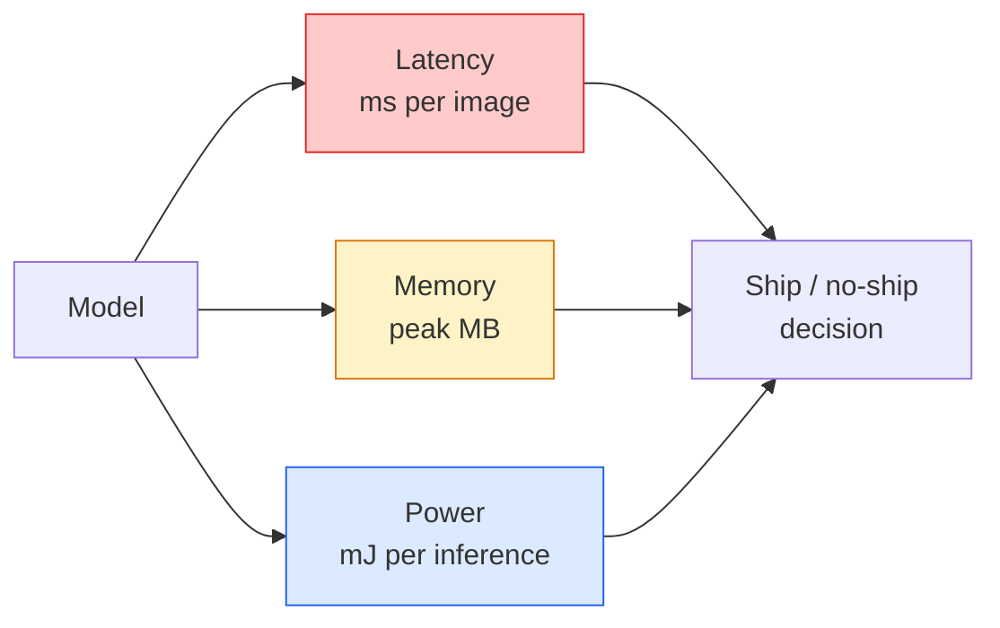

# 实时视觉 — 边缘部署

> Edge inference 的核心是让一个 90% 准确率的模型在 2 GB 内存的设备上跑到 30 fps。每一个百分点的准确率都要用毫秒级的延迟来换。

**Type:** Learn + Build
**Languages:** Python
**Prerequisites:** Phase 4 Lesson 04 (Image Classification), Phase 10 Lesson 11 (Quantization)
**Time:** ~75 minutes

## 学习目标

- 测量任意 PyTorch 模型的推理延迟、峰值内存和吞吐量，理解 FLOPs / 参数量 / 延迟之间的权衡
- 使用 PyTorch 的训练后量化将视觉模型量化到 INT8，并验证精度损失 < 1%
- 导出为 ONNX 并用 ONNX Runtime 或 TensorRT 编译；说出三种最常见的导出失败及其修复方法
- 解释在不同边缘约束下何时选择 MobileNetV3、EfficientNet-Lite、ConvNeXt-Tiny 或 MobileViT

## 问题

训练阶段的视觉模型是个浮点怪兽：1 亿参数、10 GFLOPs 每次前向传播、2 GB 显存。这些都塞不进手机、车载信息娱乐系统、工业相机或无人机。交付一个视觉系统意味着要把同样的预测能力压缩到小 100 倍的预算里。

三个旋钮完成了大部分工作：模型选择（用相同训练方法的更小架构）、量化（INT8 代替 FP32）、推理运行时（ONNX Runtime、TensorRT、Core ML、TFLite）。把它们调对，就是工作站上的 demo 和 $30 摄像头模组上的产品之间的差距。

这节课先建立测量纪律（你无法优化你无法测量的东西），然后逐一讲解三个旋钮。目标不是学会每个 edge runtime，而是知道有哪些杠杆，以及如何验证每个杠杆确实做了你以为它做的事。

## 概念

### 三个预算



- **延迟**：p50、p95、p99。只看 p50 均值会掩盖对实时系统至关重要的尾部行为。
- **峰值内存**：设备曾经看到的最大值，不是稳态平均值。嵌入式设备上 OOM 是致命的。
- **功耗 / 能量**：电池供电设备上每次推理的毫焦耳。通常用 CPU/GPU 利用率 * 时间来近似。

一张 (模型, 延迟, 内存, 精度) 的表格就是做边缘部署决策的依据。每个格子都要在目标设备上测量，而不是在工作站上。

### 测量纪律

每次 edge profiling 都应遵循三条规则：

1. **预热**模型，做 5-10 次 dummy 前向传播再开始测量。冷缓存和 JIT 编译会产生不具代表性的初始数据。
2. **同步** GPU 工作负载，在计时块前后调用 `torch.cuda.synchronize()`。否则你测的是 kernel dispatch 而不是 kernel execution。
3. **固定输入尺寸**为生产分辨率。224x224 的延迟不等于 512x512 的延迟。

### FLOPs 作为代理指标

FLOPs（每次推理的浮点运算数）是一个廉价的、设备无关的延迟代理。用于架构比较很有用，但作为绝对 wall-clock 时间会产生误导。一个 FLOPs 多 10% 的模型在实践中可能快 2 倍，因为它使用了硬件友好的算子（depthwise conv 编译效果好，大的 7x7 conv 则不行）。

规则：用 FLOPs 做架构搜索，用设备上的实际延迟做部署决策。

### 一段话讲清量化

把 FP32 的权重和激活替换为 INT8。模型大小缩小 4 倍，内存带宽降低 4 倍，计算量在有 INT8 kernel 的硬件上降低 2-4 倍（所有现代移动 SoC、所有带 Tensor Core 的 NVIDIA GPU）。视觉任务上训练后静态量化的精度损失通常为 0.1-1 个百分点。

类型：

- **动态量化** — 权重量化为 INT8，激活用 FP 计算。简单，加速有限。
- **静态量化（训练后）** — 权重量化 + 在小型校准集上标定激活范围。比动态量化快得多。
- **量化感知训练（QAT）** — 训练时模拟量化，让模型学会适应。精度最好，需要标注数据。

对于视觉任务，训练后静态量化用 5% 的工作量获得 95% 的收益。只有当 PTQ 的精度损失不可接受时才用 QAT。

### 剪枝和蒸馏

- **剪枝** — 移除不重要的权重（基于幅度）或通道（结构化）。对过参数化模型效果好；对已经紧凑的架构用处不大。
- **蒸馏** — 训练一个小的 student 模型来模仿大的 teacher 模型的 logits。通常能恢复缩小模型后损失的大部分精度。是生产级 edge 模型的标准做法。

### 推理运行时

- **PyTorch eager** — 慢，不适合部署。仅用于开发。
- **TorchScript** — 已过时。被 `torch.compile` 和 ONNX 导出取代。
- **ONNX Runtime** — 中立运行时。CPU、CUDA、CoreML、TensorRT、OpenVINO 都有 ONNX provider。从这里开始。
- **TensorRT** — NVIDIA 的编译器。在 NVIDIA GPU（工作站和 Jetson）上延迟最低。可与 ONNX Runtime 集成或独立使用。
- **Core ML** — Apple 的 iOS/macOS 运行时。需要 `.mlmodel` 或 `.mlpackage`。
- **TFLite** — Google 的 Android/ARM 运行时。需要 `.tflite`。
- **OpenVINO** — Intel 的 CPU/VPU 运行时。需要 `.xml` + `.bin`。

实践中：PyTorch -> ONNX -> 选择目标平台的运行时。ONNX 是通用语言。

### Edge 架构选择器

| 预算 | 模型 | 原因 |
|--------|-------|-----|
| < 3M 参数 | MobileNetV3-Small | 到处都能编译，好的基线 |
| 3-10M | EfficientNet-Lite-B0 | TFLite 上每参数精度最高 |
| 10-20M | ConvNeXt-Tiny | 每参数精度最高，CPU 友好 |
| 20-30M | MobileViT-S 或 EfficientViT | 带 ImageNet 精度的 Transformer |
| 30-80M | Swin-V2-Tiny | 如果技术栈支持 window attention |

除非有特殊原因，否则全部量化到 INT8。

## 动手构建

### Step 1: 正确测量延迟

```python
import time
import torch

def measure_latency(model, input_shape, device="cpu", warmup=10, iters=50):
    model = model.to(device).eval()
    x = torch.randn(input_shape, device=device)
    with torch.no_grad():
        for _ in range(warmup):
            model(x)
        if device == "cuda":
            torch.cuda.synchronize()
        times = []
        for _ in range(iters):
            if device == "cuda":
                torch.cuda.synchronize()
            t0 = time.perf_counter()
            model(x)
            if device == "cuda":
                torch.cuda.synchronize()
            times.append((time.perf_counter() - t0) * 1000)
    times.sort()
    return {
        "p50_ms": times[len(times) // 2],
        "p95_ms": times[int(len(times) * 0.95)],
        "p99_ms": times[int(len(times) * 0.99)],
        "mean_ms": sum(times) / len(times),
    }
```

预热、同步、使用 `time.perf_counter()`。报告百分位数，不只是均值。

### Step 2: 参数量和 FLOPs 计数

```python
def parameter_count(model):
    return sum(p.numel() for p in model.parameters())

def flops_estimate(model, input_shape):
    """
    Rough FLOP count for a conv/linear-only model. For production use `fvcore` or `ptflops`.
    """
    total = 0
    def conv_hook(m, inp, out):
        nonlocal total
        c_out, c_in, kh, kw = m.weight.shape
        h, w = out.shape[-2:]
        total += 2 * c_in * c_out * kh * kw * h * w
    def linear_hook(m, inp, out):
        nonlocal total
        total += 2 * m.in_features * m.out_features
    hooks = []
    for m in model.modules():
        if isinstance(m, torch.nn.Conv2d):
            hooks.append(m.register_forward_hook(conv_hook))
        elif isinstance(m, torch.nn.Linear):
            hooks.append(m.register_forward_hook(linear_hook))
    model.eval()
    with torch.no_grad():
        model(torch.randn(input_shape))
    for h in hooks:
        h.remove()
    return total
```

正式项目请用 `fvcore.nn.FlopCountAnalysis` 或 `ptflops`；它们能正确处理所有模块类型。

### Step 3: 训练后静态量化

```python
def quantise_ptq(model, calibration_loader, backend="x86"):
    import torch.ao.quantization as tq
    model = model.eval().cpu()
    model.qconfig = tq.get_default_qconfig(backend)
    tq.prepare(model, inplace=True)
    with torch.no_grad():
        for x, _ in calibration_loader:
            model(x)
    tq.convert(model, inplace=True)
    return model
```

三步：配置、准备（插入 observer）、用真实数据校准、转换（融合 + 量化）。要求模型已融合（`Conv -> BN -> ReLU` -> `ConvBnReLU`），`torch.ao.quantization.fuse_modules` 可以处理。

### Step 4: 导出为 ONNX

```python
def export_onnx(model, sample_input, path="model.onnx"):
    model = model.eval()
    torch.onnx.export(
        model,
        sample_input,
        path,
        input_names=["input"],
        output_names=["output"],
        dynamic_axes={"input": {0: "batch"}, "output": {0: "batch"}},
        opset_version=17,
    )
    return path
```

`opset_version=17` 是 2026 年的安全默认值。`dynamic_axes` 让你可以用任意 batch size 运行 ONNX 模型。

### Step 5: 基准测试和对比不同方案

```python
import torch.nn as nn
from torchvision.models import mobilenet_v3_small

def compare_regimes():
    model = mobilenet_v3_small(weights=None, num_classes=10)
    params = parameter_count(model)
    flops = flops_estimate(model, (1, 3, 224, 224))
    lat_fp32 = measure_latency(model, (1, 3, 224, 224), device="cpu")
    print(f"FP32 MobileNetV3-Small: {params:,} params  {flops/1e9:.2f} GFLOPs  "
          f"p50={lat_fp32['p50_ms']:.2f}ms  p95={lat_fp32['p95_ms']:.2f}ms")
```

对 `resnet50`、`efficientnet_v2_s` 和 `convnext_tiny` 运行同样的函数，你就有了做部署决策所需的对比表。

## 实际应用

生产技术栈收敛到三条路径之一：

- **Web / Serverless**：PyTorch -> ONNX -> ONNX Runtime（CPU 或 CUDA provider）。最简单，大多数场景够用。
- **NVIDIA edge（Jetson、GPU 服务器）**：PyTorch -> ONNX -> TensorRT。延迟最低，工程投入最大。
- **移动端**：PyTorch -> ONNX -> Core ML（iOS）或 TFLite（Android）。导出前先量化。

测量工具方面，`torch-tb-profiler`、`nvprof` / `nsys`、macOS 上的 Instruments 提供逐层分析。`benchmark_app`（OpenVINO）和 `trtexec`（TensorRT）提供独立的 CLI 数据。

## 交付产出

本课产出：

- `outputs/prompt-edge-deployment-planner.md` — 一个 prompt，根据目标设备和延迟 SLA 选择 backbone、量化策略和运行时。
- `outputs/skill-latency-profiler.md` — 一个 skill，编写完整的延迟基准测试脚本，包含预热、同步、百分位数和内存追踪。

## 练习

1. **（简单）** 在 CPU 上测量 `resnet18`、`mobilenet_v3_small`、`efficientnet_v2_s` 和 `convnext_tiny` 在 224x224 下的 p50 延迟。报告表格并找出哪个架构的精度/毫秒比最高。
2. **（中等）** 对 `mobilenet_v3_small` 应用训练后静态量化。报告 FP32 vs INT8 的延迟和在 CIFAR-10 或类似数据集的 held-out 子集上的精度损失。
3. **（困难）** 将 `convnext_tiny` 导出为 ONNX，用 `onnxruntime` 的 `CPUExecutionProvider` 运行，与 PyTorch eager 基线对比延迟。找出 ONNX Runtime 更快的第一层并解释原因。

## 关键术语

| 术语 | 常见说法 | 实际含义 |
|------|----------------|----------------------|
| Latency | "多快" | 从输入到输出的时间；p50/p95/p99 百分位数，不是均值 |
| FLOPs | "模型大小" | 每次前向传播的浮点运算数；计算成本的粗略代理 |
| INT8 量化 | "8-bit" | 用 8 位整数替换 FP32 权重/激活；约 4 倍更小，2-4 倍更快 |
| PTQ | "训练后量化" | 不重新训练就量化已训练模型；简单，通常够用 |
| QAT | "量化感知训练" | 训练时模拟量化；精度最好，需要标注数据 |
| ONNX | "中立格式" | 所有主流推理运行时都支持的模型交换格式 |
| TensorRT | "NVIDIA 编译器" | 将 ONNX 编译为 NVIDIA GPU 上的优化引擎 |
| Distillation | "Teacher -> student" | 训练小模型模仿大模型的 logits；恢复大部分损失的精度 |

## 延伸阅读

- [EfficientNet (Tan & Le, 2019)](https://arxiv.org/abs/1905.11946) — 高效架构的复合缩放
- [MobileNetV3 (Howard et al., 2019)](https://arxiv.org/abs/1905.02244) — 移动优先架构，使用 h-swish 和 squeeze-excite
- [A Practical Guide to TensorRT Optimization (NVIDIA)](https://developer.nvidia.com/blog/accelerating-model-inference-with-tensorrt-tips-and-best-practices-for-pytorch-users/) — 如何真正获得论文中的吞吐量数据
- [ONNX Runtime docs](https://onnxruntime.ai/docs/) — 量化、图优化、provider 选择
